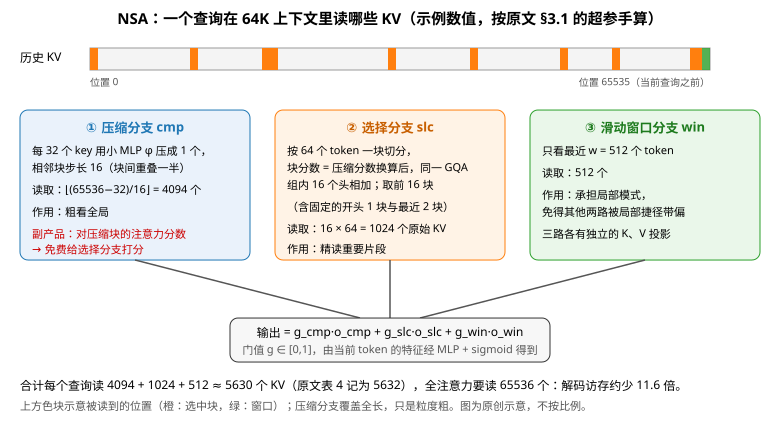

# NSA：压缩、选块、滑窗三路并行，让稀疏注意力从预训练第一步就参与训练

> 状态：技术精读 · 原文 ACL 2025 正式版（对照 arXiv:2502.11089v2） · 未复现

## 一句话

DeepSeek 与北京大学等（2025）让每个查询只读三类 KV：压缩成粗粒度块的全局概况、按块挑出的 16 个重要片段、最近 512 个 token，再用门控加权合并；块的选择借用压缩分支已经算出的注意力分数，在同一个 GQA 组内统一，以便 GPU 连续读取。这套稀疏注意力从预训练开始就参与训练。在 27B 总参数、3B 激活的模型上，它的通用评测与全注意力持平，LongBench 平均高 0.032，64K 长度下每次解码的访存量约为全注意力的 1/11.6。

## 它要解决的问题

**注意力变体的前一条线，压缩的是"每个位置存多少"。** [Transformer](../transformer/reading.md) 的多头注意力（MHA）在生成时为每个历史 token、每层、每个头缓存 K 和 V（KV 缓存，一句话：生成时为复用而保存的历史键值）。[MQA](../arxiv-1911.02150/README.md) 让所有查询头共用一组 K、V，[GQA](../arxiv-2305.13245/README.md) 让每组查询头共用一组，[DeepSeek-V2 的 MLA](../deepseek-v2/reading.md) 把各头的 K、V 压进一个 512 维潜向量。三者都缩小了每个位置的缓存，但每个查询仍要读遍全部历史位置。作者估算，64K 上下文解码时注意力占总延迟的 70%–80%（§1）。

**稀疏注意力要压缩的是"读多少个位置"。** softmax 注意力的权重天然集中在少数位置上，只算关键的查询-键对就能省下大部分计算。此前的做法分三类：按重要性逐出缓存（H2O、SnapKV）、按块挑选缓存（[Quest](https://arxiv.org/abs/2406.10774)、InfLLM）、用采样、聚类或哈希挑选（MagicPIG、ClusterKV）。作者认为它们卡在两处（附录 B）：

- **省下的计算兑现不了。** H2O 只在解码时稀疏、预填充（prefill，一次性处理整段输入的阶段）时仍要算完整注意力图；MInference 只稀疏预填充。Quest 让每个头各自挑块，在 GQA 模型里同组各头挑中的块取并集才是实际读取量，访存省不下来。
- **训练时用不了。** 这些方法都在训练好的全注意力模型上事后剪枝。作者引用 MagicPIG 的测量：注意力最高的 20% 位置只覆盖约 70% 的注意力权重，检索头（一句话：专门从远处上下文找回信息的注意力头）因此容易在推理时被剪掉。k-means 聚类、SimHash 这类离散操作不能回传梯度；逐 token 挑选又让 FlashAttention（一句话：按块把 Q、K、V 搬进片上高速缓存计算、不写出完整注意力矩阵的注意力实现）依赖的连续访存失效，训练只能退回低效实现。

NSA 要回答：能否设计一种从预训练开始就使用、训练与推理都真正提速的稀疏注意力，并且质量不低于全注意力？

## 核心想法

相对上面这些事后剪枝的方法，NSA 的增量有三点，前两点是算法，第三点是工程，但三者互相绑定：

1. **三路分层读取加门控。** 对每个查询，把历史 K、V 重映射成三组更小的集合：压缩块、选中块、滑动窗口，各算一次注意力，再用门值加权求和。
2. **选块不另设打分器。** 压缩分支算注意力时已经得到查询对每个压缩块的分数，把它换算成选择块的分数即可；在 GQA 组内把各头的分数相加，保证全组读同一批块。
3. **按 GQA 组组织的内核。** 一次把同组全部查询头装进片上缓存，顺序读取它们共享的连续 KV 块，使访存与 Tensor Core（GPU 上专做小矩阵乘的计算单元）的利用率接近 FlashAttention。

三者合在一起，让稀疏模式可以在预训练中和模型其余部分一起学出来，这就是标题里的"原生"。

## 机制

### 1 总框架：三路注意力的加权和

全注意力的输出是 oₜ = Attn(qₜ, k₁..ₜ, v₁..ₜ)。NSA 换成（§2.2，式 5）：

\[
o_t^*=\sum_{c\in\{\text{cmp},\,\text{slc},\,\text{win}\}} g_t^c\cdot \mathrm{Attn}\big(q_t,\tilde K_t^c,\tilde V_t^c\big)
\]

门值 gₜᶜ ∈ [0, 1] 由当前 token 的特征经 MLP 和 sigmoid 得到。三路各有独立的 K、V 投影，作者的理由是防止某一路走捷径、干扰其他路的梯度（§2.3.3）。实验模型的超参是：压缩块长 l = 32、步长 d = 16，选择块长 l′ = 64、选 n = 16 块（其中固定包含开头 1 块和最近 2 块），窗口 w = 512（§3.1）。

### 2 压缩分支：每 32 个 key 压成 1 个

把 key 序列按长度 32、步长 16 切块，相邻块重叠一半，以减少信息被块边界切断；每块经一个带块内位置编码的小 MLP φ 压成一个 key（式 7），value 同理。压缩分支用这些粗粒度 key、value 算注意力，相当于先扫一遍全局概况。

### 3 选择分支：借压缩分数挑 16 块

压缩分支的 softmax 分数 pₜᶜᵐᵖ（式 8）就是"查询对哪一段感兴趣"的估计。选择块长 64、压缩步长 16，所以一个选择块覆盖若干相邻的压缩块，把对应分数相加得到选择块的分数（式 9）。

在 GQA 中，同组 16 个查询头共用一份 KV。若各头各挑一批块，实际读取量是各头所选的并集。NSA 把同组各头的块分数相加（式 10），全组只挑一次前 16 块（式 11–12），读这 16 × 64 = 1024 个原始 token 的 K、V 做精细注意力。

按块而不是按 token 挑选，有两个理由（§2.3.2）：GPU 读连续块比按索引零散读取快得多，也正好适合按块计算的 Tensor Core；作者在全注意力模型的注意力图上看到分数呈块状聚集，相邻 key 的重要性相近（附录 F，图 8）。

### 4 滑动窗口分支：把局部模式单独拿出来

作者观察到局部模式学得更快，会主导训练，让压缩和选择两路学不到东西（§2.3.3）。所以最近 512 个 token 单独走一路，三路的输出由门控合并。

### 5 内核：按 GQA 组装载查询

FlashAttention 一次装入一段连续位置的查询。在 NSA 中，相邻位置的查询选中的块各不相同，这样装载会读到大量无关的 KV。NSA 的选择分支内核改为：外层按查询位置遍历，每次装入该位置同组全部查询头；内层按选中块的索引顺序读入连续 KV 块（§2.4，图 3）。压缩和滑窗两路可以直接用 FlashAttention-2。内核用 Triton（一种用 Python 写 GPU 内核的语言）实现。

这个设计以 GQA 或 MQA 为前提。作者明确只针对共享 KV 的结构，因为 MHA 在解码时本就受访存限制（§2.4）。

### 6 读多少、算多少（示例数值）

解码时每个查询读的 KV 个数是（§4.2）：⌊(s − l)/d⌋ 个压缩 token + n·l′ 个选中 token + w 个窗口 token，s 为已缓存长度。

| 已缓存长度 s | 压缩 ⌊(s−32)/16⌋ | 选中 16×64 | 窗口 | 合计 | 全注意力 | 访存比 |
|---|---|---|---|---|---|---|
| 8,192 | 510 | 1,024 | 512 | 2,046 | 8,192 | 4.0× |
| 65,536 | 4,094 | 1,024 | 512 | 5,630 | 65,536 | 11.6× |

手算结果与原文表 4 的 2048、5632 吻合（表 4 取整到块）。解码受显存带宽限制，作者据此把访存比当作预期加速比。

计算量的账同理。效率实验的配置是每个 GQA 组 16 个头，key 维度 192、value 维度 128（§4），一个 key 对一个头的乘加约为 2×192 + 2×128 = 640 FLOPs。64K 时一个查询位置、一个 GQA 组：

- 全注意力：16 × 65,536 × 640 ≈ 6.7 亿 FLOPs。
- NSA：16 × 5,630 × 640 ≈ 0.58 亿 FLOPs，另加压缩 MLP 和门控的少量开销。

两者之比 11.6 倍是理论上限；实测的内核前向加速为 9.0 倍、反向 6.0 倍（图 5）。

这张表也暴露了短序列的账：选中块和窗口共 1,536 个 token 是固定开销，与 s 无关。s 约 1.6K 以下时，三路合计读到的 KV 比全注意力还多（三路有重叠）；8K 时只省 4 倍。作者在通用评测处也写明，短序列上 NSA 未必能发挥效率优势（§3.3）。

### 7 实验设置

模型 30 层、隐藏维度 2560，GQA 分 4 组共 64 个头，FFN 用 [DeepSeekMoE](../arxiv-2401.06066/README.md)（72 个路由专家、2 个共享专家，每 token 激活 6 个），第一层的 MoE 换成 SwiGLU 形式的普通 MLP 以保证训练稳定（附录 C）。全注意力与 NSA 两个模型都在 8K 长度的文本上预训练 270B token，再用 YaRN（一种调整 RoPE 频率的长度外推方法）在 32K 上继续训练并做监督微调，都训练到收敛（§3.1）。

## 证据：哪个实验支撑哪个主张

| 主张 | 支撑实验 | 怎么读 |
|---|---|---|
| 短文本能力不降 | 表 1，9 项通用评测：平均 0.456 对 0.443，7 项更高；GSM8K +0.034、DROP +0.042 | 大多数样本短于窗口加选块的覆盖范围，此时稀疏几乎不起作用；单次训练，没有误差范围 |
| 长文本好于事后稀疏与全注意力 | 表 2，LongBench（长文本理解评测集）：NSA 0.469，全注意力 0.437，Exact-Top 0.423，Quest 0.392，H2O 0.303 | 事后稀疏的基线每个查询给 2560 个 token 的预算，等于 NSA 在 32K 上的平均读取量；作者剔除了所有模型都低分的子集 |
| 64K 内能找回任意位置的信息 | 图 4，64K 大海捞针（在长文中埋一句话要求找回）全部位置找回 | 只检验单点检索 |
| 稀疏模型也能学长推理 | 表 3，用 DeepSeek-R1 的 10B token 数学推理轨迹做蒸馏 SFT（监督微调）后的 AIME 24：8K 生成上限 0.121 对 0.046，16K 上限 0.146 对 0.092 | 绝对分数很低；每题采样 16 次取平均，没有给出方差 |
| 训练与推理都提速 | 图 5（A100、Triton 对 Triton 版 FlashAttention-2）：前向 8K/16K/32K/64K 为 2.1/3.8/6.3/9.0 倍，反向 1.1/2.0/3.4/6.0 倍；表 4 解码预期 4/6.4/9.1/11.6 倍 | 内核级对比，不是端到端训练吞吐；解码数字由访存量推出 |
| 另两种可训练的选块都更差 | 附录 E，图 7，3B 模型：用辅助损失训练的打分器、Quest 式免参数打分（含先用全注意力 1000 步再切换的冷启动）的训练损失都高于 NSA | 这是本文最有信息量的负结果，见"局限与后续"第 2 条 |

## 局限与后续

**作者自述。** 正式版的 Limitations 写了两点：只研究单层内的稀疏，跨层稀疏留待以后；Triton 实现比原生 CUDA 内核多一层抽象开销。

站在现在看，NSA 本身没有原样进入 DeepSeek 后来的正式模型，但它的部件被拆开，分几代回到了模型里。

**1. 选择粒度：从块回到 token，再从 token 回到"先块后 token"。** [DeepSeek-V3.2](../arxiv-2512.02556/reading.md)（2025 年 12 月）的 DSA 改用一个独立的小打分器逐 token 选 2048 个 KV，官方仓库称之为首次实现细粒度稀疏注意力；Kimi Linear 的相关工作一节也把 DSA 描述为"重新回到 token 级稀疏"（§7.1）。V3.2 的基础结构是 MLA 的 MQA 模式，一个 576 维的潜向量被全部 128 个查询头共享，逐 token 读取的代价比 GQA 小。到 [DeepSeek-V4.1-Flash](../arxiv-2609.19969/README.md)，索引器在超长上下文下又成了主要瓶颈，它的分层稀疏索引器先按块的最高分挑出 2048 个 8-token 块作候选池，后续层只在池内逐 token 打分（§2.3.2）。`[判断]` 块与 token 之争的实质是"打分要不要扫全长"：NSA 用块换来便宜的打分，DSA 用 token 换来精度却要全长扫描，V4.1-Flash 把两者叠成两级。

**2. NSA 判为更差的做法，后来成了 DSA 的做法。** 附录 E 的"辅助损失打分器"是给每个 token 加额外查询、用块内平均注意力分数作目标、以 KL 散度监督的可学习打分器，作者报告它增加算子开销、损失更高；"先全注意力 1000 步再切换"的冷启动也没有救回启发式打分。V3.2 的 DSA 恰恰是一个以主注意力分布为目标、用 KL 散度训练的独立打分器，并且先用稠密注意力预热。`[判断]` 两处的差别在于：DSA 的打分器输入与主模型断开梯度、只用 FP8 小头计算，并且从已经训好的 671B 稠密模型继续训练，而 NSA 的对照是 3B 模型从头训练。NSA 的负结果更像是在小模型、从头训练这一设置下成立，不能外推成"可学习打分器不可行"。

**3. 压缩与滑窗回到了 V4。** [DeepSeek-V4](../arxiv-2606.19348/README.md) 的 CSA 先把每 4 个 token 的 KV 压成一项，再用 DSA 式的索引器在压缩项上选 top-k，并加一条 128 token 的滑动窗口分支（§2.3）；HCA 以 128 倍压缩做稠密注意力。`[判断]` 这相当于 NSA 的压缩分支与窗口分支加上 DSA 的打分器，区别是 V4 在压缩项上直接做稀疏选择，不再回到原始 token。

**4. 访存省了，存储没省。** NSA 减少的是每次读多少 KV，选择分支仍要保留全长的原始 K、V（原文未讨论缓存大小，这是按结构推算的 `[判断]`）。V4.1-Flash 的引言写明，稀疏注意力降低计算之后，KV 的持久存储和搬运成了更突出的瓶颈，它用跨层共享 KV 和索引来压存储（§1、§2.3）。跨层共享也正是 NSA 自述局限里"跨层稀疏"的方向。

**5. 内核依赖。** 选择分支的效率建立在"同组多个查询头共享一份 KV"上，效率实验每组 16 个头。Kimi Linear 的相关工作一节认为 NSA 的效率依赖头数较多的 GQA（§7.1）。V3.2 把 DSA 放在 MLA 的 MQA 模式上，并引用 NSA 说明"每个 KV 项必须被多个查询共享才能高效"（V3.2 §2.1）。

**6. 评测覆盖不到的代价。** NSA 的证据集中在 MMLU、BBH、MATH、LongBench 和 64K 大海捞针。MiniMax 预训练负责人在官方博客中回顾，他们的线性注意力混合模型在同一批评测上看起来与全注意力相当，规模放大后才暴露出复杂多跳推理的明显缺陷，并据此让 MiniMax-M2 回到全注意力（[MiniMax 官方博客，2025-10-29](https://www.minimax.io/news/why-did-m2-end-up-as-a-full-attention-model)）。那是线性注意力，不是 NSA 这类稀疏注意力，但它说明这批评测对"省掉一部分注意力"的代价不敏感。V4.1-Flash 的结论也写明，CSA2 的选择误差可能在未测试的边界情形下损害能力，后续要重点压测长上下文中的稀疏检索。NSA 只在 27B、64K 以内验证，选不中关键块时会怎样失败，原文没有给出案例（未核实）。

## 批注

**易误读**

- 11.6 倍是表 4 由访存量推出的解码预期加速，9.0 倍与 6.0 倍是 A100 上 Triton 内核对 Triton 版 FlashAttention-2 的前向、反向对比（§4）；三者都不是端到端的训练或服务吞吐。
- 预训练数据量：§3.1 写 270B token（8K 长度），引言写 260B；arXiv v1、v2 与 ACL 正式版均如此。本页取实验设置一节的 270B。
- "16 块"包含固定的开头 1 块与最近 2 块（§3.1），真正由打分决定的是 13 块。原文没有说明为什么固定读开头块；`[判断]` 作用类似 [StreamingLLM](../arxiv-2309.17453/README.md) 始终保留的注意力汇聚 token。
- 表 1 的平均分差 0.013 来自单次训练，7/9 项更高不足以说明稀疏"提升"了短文本能力；作者给的解释（稀疏迫使模型聚焦重要信息）没有对照实验。
- Kimi Linear §7.1 写"NSA 中每个查询根据 MLP 产生的分数选块"，与原文不符：选块分数来自压缩分支的注意力分数，MLP 是压缩函数 φ 和门控。

**与其他论文的关联**

- [DeepSeek-V2 精读](../deepseek-v2/reading.md)：MHA → MQA → GQA → MLA 压的是每个位置的缓存大小，本篇压的是每次读的位置数，两条线在 V3.2 合到一起（MLA 加 DSA）。
- [DeepSeek-V3.2 精读](../arxiv-2512.02556/reading.md)：DSA 与 NSA 的逐项对照表在那一页"与 NSA 的关系"一节。
- [DeepSeek-V4](../arxiv-2606.19348/README.md)、[DeepSeek-V4.1-Flash](../arxiv-2609.19969/README.md)：压缩、滑窗、块级候选与跨层共享依次回归，见上文第 1、3、4 条。
- [递推状态谱系](../../../foundations/relations/recurrent-state.md)与 [Kimi Linear](../arxiv-2510.26692/README.md)：另一条路是把历史压进固定大小的状态。Kimi Linear §7.1 的判断是稀疏注意力更擅长找回细节，但必须存下全部 KV，表达能力的上限仍是全注意力。
- [注意力与 FFN 的分工谱系](../../../foundations/relations/attention-ffn-division.md)第 7 节：MoE 稀疏化的是 FFN；本篇说明注意力也可以稀疏化，但只能按每个查询动态选择，没有可以离线切分的固定内容，与该页"这条链解释了什么"的结论一致。
- 方向页：[长上下文](../../fields/long-context/README.md)第 4 阶段与[预训练](../../fields/pretraining/README.md)问题②③。

**未核实 / 待验证**

- 对照方法 H2O、Quest、InfLLM、MagicPIG、MInference 只按本文的转述引用，未逐篇核对原文。
- 训练损失曲线（附录 D 图 6、附录 E 图 7）只有图，没有数值，本页不引用具体损失值。
- 本文在 27B、64K 以内的结论能否外推到更大规模与 128K 以上，原文没有实验。
- 数值出处与页码见[证据档案](evidence.json)。
