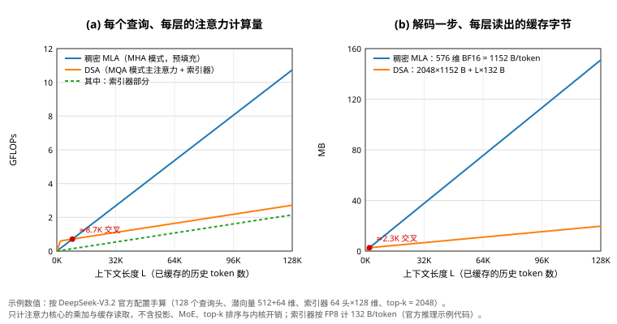

# DeepSeek-V3.2：在 MLA 上加一个 FP8 闪电索引器，主注意力只读 2048 个历史 token

> 状态：技术精读 · 原文 arXiv:2512.02556v1 · 未复现

## 一句话

DeepSeek-AI（2025 年 12 月）从已经扩到 128K 上下文的 DeepSeek-V3.1-Terminus 继续训练，结构上只改一处：加入 DSA（DeepSeek 稀疏注意力）。一个 64 头、FP8 精度的"闪电索引器"给每个历史 token 打分，主注意力（仍是 [MLA](../deepseek-v2/reading.md)）只读得分最高的 2048 个 token。主注意力的复杂度从 O(L²) 降到 O(Lk)，索引器本身仍是 O(L²)；在 H800 上按实际服务估算，128K 位置上每百万 token 的解码成本约为原来的 1/8.6。报告的另一半是后训练：强化学习算力超过预训练成本的 10%，并大规模合成智能体任务。

## 它要解决的问题

**作者的出发点。** 引言把开源模型与闭源模型差距拉大归结为三点：原始注意力在长序列上效率低，既妨碍部署也妨碍后训练；后训练算力投入不足；智能体场景下的泛化与指令遵循落后（§1）。第一点是本篇的架构部分，后两点是后训练部分。

**在注意力变体的谱系里，前几步只压了"每个位置存多少"。** MQA、GQA 让多个查询头共用 K、V；[DeepSeek-V2](../deepseek-v2/reading.md) 的 MLA 把每层每个 token 的缓存压到一个 512 维潜向量加一个 64 维位置键，共 576 个数，并沿用到 V3。但每个查询仍要读遍全部历史位置，128K 上下文里注意力的计算和读取都随长度线性增长，整段序列合计是平方增长。推理模型的长思考和智能体的多轮工具调用，正把输入和输出都推向这个长度。

**同一团队的前一步是 [NSA](../arxiv-2502.11089/reading.md)**（2025 年 2 月）：在 27B 模型上从头训练分块稀疏注意力，证明稀疏可以不掉点。它没有回答的是：一个已经训练好的 671B 稠密注意力模型（V3 系列，37B 激活），能否通过继续训练改成稀疏注意力，在 128K 上兑现成本下降，而能力不退？

## 核心想法

架构增量只有一个部件，另有两项非架构增量。

1. **闪电索引器加逐 token 的 top-k 选择。** 索引器是一个很小的、单独的注意力打分器，只负责决定"读谁"；主注意力只在选中的 2048 个 KV 上计算。
2. **建在 MLA 的 MQA 模式上。** 每个被选中的潜向量被同一 token 的全部 128 个查询头共享，选一次、全体头一起读，这是稀疏读取能高效执行的前提。
3. **两段式继续训练。** 先冻结主模型、保持稠密注意力，只训练索引器去模仿主注意力的分布；再打开稀疏选择、训练全部参数。索引器始终只从这个模仿损失学习，与语言模型损失断开。

后训练部分不改架构：沿用 GRPO（组相对策略优化，一句话：对同一问题采样一组回答，以组内相对得分作优势、不需要价值网络的强化学习算法），加入几项稳定技巧（见"局限与后续"第 5 条），算力超过预训练成本的 10%；合成 1,800 多个环境、8.5 万条复杂提示用于智能体训练（§1、§3.2.3）。

## 机制

### 1 先分清 MLA 的两种算法：MHA 模式与 MQA 模式

同一套 MLA 参数有两种等价的算法（附录 A）：

- **MHA 模式**：把潜向量还原成每个头各自的 K、V（每头 key 192 维、value 128 维）再算注意力。每个 key 对每个头约 2×192 + 2×128 = 640 FLOPs。适合训练和预填充（prefill，一次性处理整段输入），那时受计算量限制。
- **MQA 模式**：利用矩阵乘法结合律，把还原矩阵吸收进查询一侧，128 个头直接对同一个 576 维潜向量打分、对 512 维潜向量加权求和。每个 key 对每个头约 2×576 + 2×512 = 2176 FLOPs，计算更多，但缓存只读一份。适合解码，那时受显存带宽限制。

V3.1-Terminus 训练和预填充用 MHA 模式，解码用 MQA 模式（附录 A 图 7）。DSA 选择建在 MQA 模式上，理由是选中的每个 KV 项必须被多个查询共享，内核才高效（§2.1，引用 NSA）。这一点决定了后文短序列上的成本。

### 2 闪电索引器：一个只管"读谁"的小注意力

对当前 token 的隐藏状态 hₜ 和之前某个 token 的隐藏状态 hₛ，索引分数为（式 1）：

\[
I_{t,s}=\sum_{j=1}^{H_I} w^{I}_{t,j}\cdot \mathrm{ReLU}\big(q^{I}_{t,j}\cdot k^{I}_{s}\big)
\]

qᴵ 和每头权重 wᴵ 由当前 token 算出，kᴵ 由历史 token 算出，所有索引头共享同一个 key。官方配置是 Hᴵ = 64 个索引头、每头 128 维；原文说明用 ReLU 是为了吞吐，并且整个索引器可以用 FP8 计算（§2.1）。官方推理示例代码中，每个历史 token 每层要额外缓存一个 128 维的 FP8 索引 key 及其缩放因子，约 132 字节。

### 3 top-k 选择与主注意力

对每个查询，取索引分数最高的 k = 2048 个位置，主注意力只在这些位置的 MLA 潜向量上计算（式 2）。选择是逐 token 的，同一 token 的 128 个查询头共用同一组选择。上下文不足 2048 时等于全选。

### 4 两段式继续训练

两段都使用与 V3.1-Terminus 的 128K 长上下文扩展相同的数据分布（§2.1.1）。

- **稠密预热。** 保持稠密注意力，冻结索引器以外的全部参数。把主注意力各头的分数相加、沿序列做 L1 归一化，得到目标分布 pₜ，用 KL 散度训练索引器去拟合它（式 3）。学习率 10⁻³，1000 步，每步 16 条 128K 序列，共 2.1B token。
- **稀疏训练。** 打开 top-k 选择，训练全部参数。索引器的目标只在选中集合 Sₜ 上计算 KL（式 4）；索引器的输入从计算图上断开，主模型只受语言模型损失，索引器只受 KL 损失。学习率 7.3×10⁻⁶，15000 步，每步 480 条 128K 序列，共 943.7B token。

后训练同样全程使用稀疏注意力（§3）。

### 5 128K 上的账（示例数值）

按官方配置手算一个查询 token、一层、上下文 L = 131,072 时的注意力核心开销。只计注意力打分与加权求和的乘加和缓存读取，不含 Q/K/V 投影、MoE 和内核开销；缓存按 BF16 计（576 个数 × 2 字节 = 1152 字节/token），索引 key 按 132 字节计。

| 项目 | 稠密 MLA（V3.1-Terminus） | DSA（V3.2） |
|---|---|---|
| 主注意力计算 | MHA 模式 128 × 131,072 × 640 ≈ 10.7 GFLOPs | MQA 模式 128 × 2,048 × 2,176 ≈ 0.57 GFLOPs |
| 索引器计算 | — | 64 × 128 × 2 × 131,072 ≈ 2.15 GFLOPs（FP8） |
| 计算合计 | 10.7 GFLOPs | 2.72 GFLOPs，约 1/3.9 |
| 解码一步读缓存 | 131,072 × 1152 B ≈ 151 MB | 2,048 × 1152 B + 131,072 × 132 B ≈ 2.4 + 17.3 = 19.7 MB，约 1/7.7 |

61 层合计，稠密解码每生成一个 token 要为这一条序列读约 9.2 GB 缓存，DSA 约 1.2 GB。

这张表说明三件事：

- **128K 时，DSA 的主要开销已经是索引器。** 计算的 79%、读取的 88% 花在给全部历史打分上。索引器每个 key 16,384 FLOPs，是稠密 MHA 模式（81,920）的 1/5，所以长度再增加时，DSA 的计算量最多降到稠密的约 1/5（FP8 按半价计约 1/10），不会无限下降。
- **短序列上 DSA 更贵。** 主注意力固定读 2048 项，且 MQA 模式每项更贵。令 81,920·L = 128 × 2,048 × 2,176 + 16,384·L，得 L ≈ 8.7K：短于这个长度，DSA 的注意力计算量反而高于稠密 MHA 模式。按读取字节，交叉点约 2.3K。作者为此专门写了一句：短序列预填充改用带掩码的 MHA 模式来模拟 DSA（§2.3）。
- **存储没有减少。** 每个 token 每层仍要缓存完整的 576 维潜向量，再加 132 字节索引 key，按 BF16 计多出约 11%。DSA 省的是每一步读多少，不是总共存多少。

### 6 与 NSA 的关系

| 部件 | NSA（2025-02） | DSA（V3.2，2025-12） |
|---|---|---|
| 选择粒度 | 64 token 一块，选 16 块（含开头 1 块、最近 2 块） | 逐 token，选 2048 个 |
| 打分来源 | 压缩分支的注意力分数，不另设参数 | 独立的闪电索引器（64 头、128 维、ReLU、FP8） |
| 打分器怎么学 | 压缩分支随语言模型损失一起训练 | 只用 KL 拟合主注意力分布，输入断开梯度 |
| 读取路径 | 压缩、选择、滑窗三路，门控合并 | 只有选中的 token 一路 |
| 底座注意力 | GQA（4 组 × 16 头） | MLA 的 MQA 模式（1 个潜向量 × 128 头） |
| 训练方式 | 从头预训练，27B 模型、270B token | 从 671B 稠密模型继续训练，2.1B 预热 + 943.7B 稀疏 |
| 打分的长度复杂度 | 扫描 L/16 个压缩 key | 扫描全部 L 个 key |

`[判断]` 两者都保留了一个随长度平方增长的"扫描器"，只是常数更小：NSA 扫压缩后的 1/16，DSA 用 FP8 小头扫全长。DSA 放弃了 NSA 的压缩与滑窗分支，换来逐 token 的精度和单一路径的简洁，并且可以加到已训练好的 MLA 模型上；代价是扫描成本随长度全量增长。V4 又把压缩和滑窗加了回来，见"局限与后续"第 2 条。NSA 附录 E 曾报告"用 KL 监督的可学习打分器"和"先稠密再切换"在 3B 从头训练时效果更差，DSA 正是这两者的组合，讨论见 [NSA 精读](../arxiv-2502.11089/reading.md)"局限与后续"第 2 条。

## 证据：哪个实验支撑哪个主张

| 主张 | 支撑实验 | 怎么读 |
|---|---|---|
| 加稀疏后能力不退 | §2.2：V3.2-Exp 与 V3.1-Terminus 用相同的后训练流程；官方仓库的对照表中 MMLU-Pro 均为 85.0，GPQA-Diamond 80.7 → 79.9，HLE 21.7 → 19.8，HMMT 2025 86.1 → 83.6，Codeforces 2046 → 2121，BrowseComp 38.5 → 40.1 | 推理类有几项小幅下降，智能体类略升；论文正文只写"没有明显退化"，没有给数字 |
| 用户偏好持平 | §2.2：ChatbotArena 上两者 Elo 分接近（2025-11-10） | 原文未给分数 |
| 长文本不退 | §2.2：作者引用的第三方评测 AA-LCR 推理模式高 4 分，Fiction.liveBench 多项指标更好 | 第三方评测，本页未打开核对 |
| 长序列成本大降 | 图 3，H800、每 GPU 小时 2 美元、按实际服务估算：128K 位置上预填充约 0.67 → 0.19 美元/百万 token，解码约 2.16 → 0.25 | 数字由图中矢量坐标换算，原文未列；与上节手算的 3.9 倍、7.7 倍量级一致 |
| 短序列略贵 | 图 3：位置 0 附近 V3.2 的曲线高于 V3.1（预填充约 0.061 对 0.053，解码约 0.095 对 0.070），两条线在约 10K（预填充）、约 5K（解码）处相交 | 同样由矢量坐标换算；预填充曲线在约 6.6K 处有拐点，对应短序列改用掩码 MHA 模式 |
| 128K 仍不够用 | §4.1：搜索智能体评测中 20% 以上的样例超过 128K，不做上下文管理时 BrowseComp 51.4，做了为 67.6；MCP 类评测中模型常做冗余的自我验证，轨迹超出 128K | DSA 降低了单位长度的成本，但没有扩大窗口 |

## 局限与后续

**作者自述（§5）。** 总训练 FLOPs 较少，世界知识的广度落后于最强闭源模型；达到同样质量常需要更长的生成（token 效率低）；复杂任务仍落后。第 4.1、4.4 节另写明 128K 上限让搜索类智能体流程频繁被截断。

站在现在看，后来的版本和其他团队的选择暴露了 DSA 没有写出来的几项代价。

**1. 短序列开销。** 上一节的手算和图 3 都显示，几千到一万 token 以下 DSA 比稠密注意力更贵。[DeepSeek-V4](../arxiv-2606.19348/README.md) 把 top-k 从 2048 降到 512（Flash）或 1024（Pro），原文写明这是为了提高短、中长度文本的效率（§2.3.4）。

**2. 索引器的平方复杂度成为新瓶颈。** V4 让索引器的 QK 计算用 FP4，并写明这是为了加速超长上下文下的注意力（§2.3.4）；V4 的 CSA 先把每 4 个 token 压成一项再让索引器打分，扫描量降为 1/4，并加回 128 token 的滑动窗口（§2.3）。[DeepSeek-V4.1-Flash](../arxiv-2609.19969/README.md) 直接写道，剩下的索引器仍要给全部可见上下文打分，在极长上下文下仍是主要计算瓶颈，于是让后续层只在第一层按块选出的候选池里打分（§2.3.2）。`[判断]` 这三步都在给 V3.2 的索引器减负，与上节"128K 时 79% 的计算在索引器"一致。

**3. 索引器选得准不准，V3.2 没有直接测量。** 本篇只报告了端到端评测，没有报告索引器选出的集合覆盖了主注意力多少权重。V4 在后训练中对索引器的 QK 路径做 FP4 量化感知训练，并把索引分数从 FP32 降到 BF16，报告 top-k 选择器提速 2 倍、KV 召回率保持 99.7%（§5.2.1）；这是相对未降精度的索引器的召回，不是相对真实注意力。V4 在 1M 长度的多针检索 MRCR 上，128K 以内稳定、超过 128K 可见下降（§5.3.2 图 9）。V4.1-Flash 的结论写明，选择误差可能在未测试的边界情形下损害能力，后续要重点压测长上下文中的稀疏检索。索引器在哪类输入上选错、选错后会怎样失败，至今没有公开案例（未核实）。

**4. 实现依赖。** 官方仓库在 2025-11-17 更新说明，早先的推理示例代码中索引器的 RoPE 输入排布有误（索引器要求非交错排布，MLA 要求交错排布），可能导致模型性能下降。`[判断]` 索引器是一条与主注意力并行、规则不同的新路径，实现上的细微差异不会报错，只会悄悄改变选中的集合。高性能内核分散在 DeepGEMM（索引器打分）、FlashMLA（稀疏注意力）和 TileLang（研究用）里，[V4](../arxiv-2606.19348/README.md) 进一步投入 TileLang 与位级可复现的确定性内核（§3.2–3.3）。

**5. 训练与推理的不一致。** 本篇的强化学习部分列出了针对训推不一致的几项技巧：用采样时推理框架返回的概率计算偏离程度，屏蔽偏离过大的负样本序列；Keep Routing 在训练时强制使用采样时的 MoE 路由，作者说它对 MoE 的强化学习稳定性至关重要；Keep Sampling Mask 保留 top-p 截断掩码（§3.1）。注意力的 top-k 选择同样是一个离散路由，原文没有说是否也在训练时沿用采样时的选择（未披露）。后来的版本把这一点写明了：V4 在强化学习采样时直接使用 FP4 的索引器 QK 路径，与线上部署一致（§5.2.1）；V4.1-Flash 的分层索引在训练和推理中以完全相同的方式施加（§2.3.2）。

**6. 继续训练与原生训练。** V3.2 是在稠密模型上后加稀疏。V4 在预训练中用稠密注意力训练前 1T token，到 64K 长度才切换到稀疏（§4.2.2）；V4.1-Flash 从头就用稀疏注意力训练，不再有稠密预热（§1、§4.2.2）。MiniMax 预训练负责人在官方博客中回顾，他们尝试把全注意力模型继续训练成滑动窗口混合结构，长上下文性能随长度明显下降；分析认为检索头、归纳头这类全局模式在预训练早期就已形成，继续训练很难再改（[MiniMax 官方博客，2025-10-29](https://www.minimax.io/news/why-did-m2-end-up-as-a-full-attention-model)）。`[判断]` DSA 的选择由内容决定、并用 KL 继承稠密注意力的分布，所以能在继续训练中保住能力，这与固定窗口不同；但它也继承了稠密模型的注意力模式，DeepSeek 后两代把稀疏化提前到预训练里，说明继续训练只是过渡方案。

**7. 存储与搬运。** DSA 不减少 KV 缓存的总量。V4 沿序列压缩 KV，1M 上下文下 KV 缓存为 V3.2 的 10%（§1）；V4.1-Flash 的引言写明，稀疏注意力降低计算之后，KV 的持久存储与搬运成了更突出的瓶颈（§1）。

**其他团队的选择。** [Kimi Linear](../arxiv-2510.26692/README.md) 走线性注意力混合：每 3 层线性注意力接 1 层全注意力 MLA。它的相关工作一节评价，稀疏注意力更擅长找回历史细节，但必须存下全部 KV，表达能力的上限仍是全注意力（§7.1）。MiniMax-M2 则回到全注意力，理由是现有评测看不出高效注意力的代价、基础设施也不成熟（同上博客）。三家在 2025 年下半年分别押注稀疏、线性混合与全注意力。

## 批注

**易误读**

- "唯一的结构改动"是相对 V3.1-Terminus 而言；V3.2 正式版与实验版 V3.2-Exp 结构完全相同（§2.1），第 2.2 节的对照评测用的是 V3.2-Exp。
- 图 3 是按 H800 租价估算的单位 token 成本随位置变化，不是端到端延迟；短序列预填充用了掩码 MHA 模式，所以曲线在约 6.6K 处有拐点。本页的美元数由图中矢量坐标换算，误差约 ±0.01 美元。
- 本页 128K 示例按 BF16 缓存计算。官方推理示例代码注释说线上部署用 FP8 存潜向量，那时稠密与 DSA 的读取比约为 4.6 倍而非 7.7 倍，索引器的占比更高。
- 论文没有重述参数量。本页的 671B 总参数、37B 激活取自 V3 摘要；V3.2 官方配置的层数（61）与专家布局（256 个路由专家、每 token 激活 8 个）与 V3 相同。
- O(Lk) 只针对主注意力；论文正文写明索引器仍是 O(L²)（§2.3）。
- 后训练算力"超过预训练成本的 10%"中的预训练成本，原文没有说明是否包含 V3 的原始预训练。

**与其他论文的关联**

- [DeepSeek-V2 精读](../deepseek-v2/reading.md)：MLA 压缩每个位置的缓存，本篇在其 MQA 模式上加逐 token 稀疏读取；V2 精读"局限与后续"指出的"MLA 不减少历史位置数"由本篇接手。
- [NSA 精读](../arxiv-2502.11089/reading.md)：同一团队的前作，逐项对照见"与 NSA 的关系"。
- [DeepSeek-V4](../arxiv-2606.19348/README.md) → [DeepSeek-V4.1-Flash](../arxiv-2609.19969/README.md)：top-k 缩小、索引器降精度、先压缩再索引、分层候选池、跨层共享 KV 与索引，每一步都对着本篇的一项代价。
- [Kimi Linear](../arxiv-2510.26692/README.md)与[递推状态谱系](../../../foundations/relations/recurrent-state.md)：线性注意力把历史压进固定状态，是与稀疏读取并列的另一条路。
- [DeepSeek-R1](../arxiv-2501.12948/README.md) 与 [PPO 精读](../ppo/reading.md)：本篇的 GRPO 稳定技巧建立在两者之上；Keep Routing 与 MoE 的离散路由有关，见 [DeepSeek-V3](../arxiv-2412.19437/README.md)。
- 方向页：[长上下文](../../fields/long-context/README.md)第 5 阶段，[预训练](../../fields/pretraining/README.md)问题③与"预训练与后训练的分工"。

**未核实 / 待验证**

- AA-LCR、Fiction.liveBench 的分数只按本文转述，未打开第三方页面核对。
- 索引器的 Hadamard 旋转、LayerNorm 等细节只见于官方推理示例代码，论文正文未写；本页只引用了头数、维度、精度与缓存格式。
- 第 4 节智能体评测的完整数字与 Speciale 变体未在本页展开。
- 数值出处与页码见[证据档案](evidence.json)。
