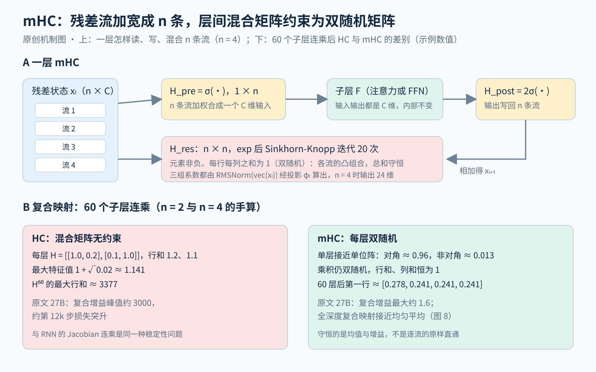

# mHC：把加宽残差流的混合矩阵约束成双随机矩阵，让信号穿过几十层后既不放大也不衰减

> 状态：技术精读 · 原文 arXiv:2512.24880v2 · 前作 Hyper-Connections 依据 arXiv:2409.19606v3（ICLR 2025） · 未复现

## 一句话

DeepSeek-AI（2025 年 12 月）沿用 Hyper-Connections（HC，ByteDance 2024）"把残差流加宽成 n 条、用可学习矩阵在层间混合"的做法，只改一处：混合矩阵 H_res 先取指数、再用 Sinkhorn-Knopp 迭代 20 次，投影成双随机矩阵（元素非负、每行每列之和都为 1）。这类矩阵相乘后仍是双随机矩阵，所以任意多层的复合映射都不放大信号；在 27B 模型上，HC 复合映射的最大增益峰值约 3000，mHC 降到约 1.6，并消除了 HC 在第 12k 步附近的损失突升。配合算子融合与重计算，n = 4 时额外训练时间为 6.7%。DeepSeek-V4 把它用进正式模型，V4.1-Flash 又改成单次遍历的版本。

## 它要解决的问题

残差连接让网络能堆深，代价是层间连接的强度被写死；HC 把强度变成可学习的，却在更大规模上丢掉了残差连接最重要的性质。

**残差连接的恒等映射。** 残差连接把一层写成 x_{l+1} = x_l + F(x_l)（[Transformer 讲义](../../../foundations/lessons/14-attention-transformer.md)第 10.2 节；它来自 ResNet，见 [CNN 讲义](../../../foundations/lessons/11-cnn.md)第 6 节）。逐层展开得 x_L = x_l + Σ F(x_i)：浅层的 x_l 原样出现在深层，这条直通路径对 x_l 的导数恒为单位阵（[LSTM 讲义](../../../foundations/lessons/13-lstm.md)把它与遗忘门为 1 的通路对应起来）。mHC 原文 §1 把这一项称为恒等映射，认为大规模训练的稳定性主要靠它。

**Pre-Norm 与 Post-Norm 的跷跷板。** 归一化放在哪里会改变优化行为（讲义第 10.4 节）。Post-Norm（相加后再归一化）在深层容易梯度消失；Pre-Norm（先归一化再进子层，[Pre-LN](../arxiv-2002.04745/README.md) 解释了它为何好训练）保住了梯度，却让深层特征彼此高度相似，新加的层贡献越来越小，HC 原文称为表示坍缩。HC 原文 §1 认为两者的根源相同：输入与输出之间的连接强度是预先定死的。

**前作 HC 怎样做。** [Hyper-Connections](../arxiv-2409.19606/README.md)（Zhu 等，ICLR 2025）把输入复制成 n 份，形成 n × d 的"超隐藏矩阵"，每层用三组可学习系数管理它（原文 §2，mHC 原文 §3 的记号）：

- H_pre（1 × n）：把 n 条流加权合成一条，作为本层子网络（注意力或 FFN）的输入；
- H_post（1 × n）：把子网络的输出按权重写回 n 条流；
- H_res（n × n）：在 n 条流之间互相混合，原文称宽度连接。

动态版本（DHC）的系数由当前输入经归一化、线性投影、tanh 后加上静态偏置得到，tanh 前乘一个初值很小的可学习因子。初始化时 H_res 取单位阵、H_post 全为 1，让网络从 Pre-Norm 残差出发（HC §2.3）。HC 原文 §3 证明 Pre-Norm 与 Post-Norm 都是 n = 1 时某种不可训练的 HC；n ≥ 2 时，HC 还能学出"顺序执行"与"并行执行"之间的任意混合（§3.2）。实验上，OLMoE-1B-7B（总参数 7B、激活 1.3B 的 MoE）换成 DHC×4 后收敛快 1.8 倍，500B token 时 ARC-Challenge 从 41.8 升到 47.8（HC 图 1、表 6）；n = 1 反而比基线差（表 1）。

**HC 卡在哪里。** 把 HC 的单层更新连乘展开（mHC 式 4），浅层 x_l 到深层的直通项变成 Π H_res，也就是几十个可学习矩阵的连乘。H_res 没有任何约束，连乘结果不再是单位阵，信号会被放大或衰减。mHC 原文 §3.1 在 27B 模型上看到了这一点：HC 在约第 12k 步出现损失突升，与梯度范数异常同时发生；复合映射的最大增益峰值达到约 3000，理想值为 1。另一笔代价在硬件：n 条流让每层读写残差的数据量约变成 n 倍，HC 原设计没有处理（§3.2）。

## 核心想法

相对 HC，mHC 不改"加宽残差流"本身，只把三个映射投影到受约束的集合上，并把工程开销压下来。

1. **H_res 投影到双随机矩阵。** 双随机矩阵构成的集合叫 Birkhoff 多面体（一句话：所有 n × n 置换矩阵的凸组合，也就是"按比例把几种换位方式混在一起"）。它的谱范数不超过 1，对乘法封闭，所以任意深度的复合映射都不放大信号（§4.1）。
2. **H_pre、H_post 限为非负。** 分别用 sigmoid 与 2 × sigmoid，避免正负系数相互抵消（式 8）。
3. **把开销做进系统。** 融合算子、按流水线段重计算、扩展 DualPipe（DeepSeek-V3 的流水线并行调度）的通信重叠，n = 4 时额外时间 6.7%（§4.3）。

原文表 1 的消融说明值得约束的正是 H_res：在 HC 的三个映射里，单开 H_res 就拿到 −0.022 的损失差，三个全开为 −0.027。

## 机制

图上半是一层 mHC 怎样读、写、混合 n 条流，下半是 HC 与 mHC 的复合映射穿过 60 个子层后的差别。

### 1 一层在算什么

对第 l 层（原文把每个 Transformer 块拆成注意力与 FFN 两层），残差状态是 n × C 的矩阵 x_l，更新为（式 3）

\[
x_{l+1}=H^{res}_l\,x_l+H^{post\,\top}_l\,\mathcal F\big(H^{pre}_l\,x_l,\;W_l\big)
\]

H_pre x_l 是 C 维向量，所以子网络 F 的形状完全不变，扩展只发生在层与层之间。三个映射的系数都由当前 token 的残差状态算出：先把 x_l 拉平成 nC 维并做 RMSNorm，再乘投影矩阵 φ_l（形状 nC × (n² + 2n)），加静态偏置（式 7）。n = 4 时 φ_l 的输出只有 16 + 8 = 24 维，DeepSeek-V4 报告 §3.3 提到的"输出维度只有 24 的矩阵乘法"就是它。27B 模型 C = 2560，每层 φ_l 约 4 × 2560 × 24 ≈ 24.6 万个参数，60 层合计约 1500 万，不到总参数的 0.1%（示例数值，按原文表 5 的维度估算）。

### 2 为什么连乘会失控（示例数值）

取 n = 2，假设 HC 某层学到的 H_res 是在单位阵上加一点交叉混合：

\[
H=\begin{bmatrix}1.0&0.2\\0.1&1.0\end{bmatrix}
\]

单层看很温和：行和为 1.2 与 1.1。但它的最大特征值是 1 + √0.02 ≈ 1.141，60 层都取这个矩阵时，H⁶⁰ 的最大行和约为 3377，已经和原文图 3（b）中约 3000 的峰值同一量级。HC 从单位阵初始化，只要训练把非对角元推离 0，连乘就会按 1.14⁶⁰ 这样的指数放大。

这和 RNN 的梯度爆炸是同一个结构（`[结构]`）：RNN 的远期梯度要连乘每一步的 Jacobian，放大倍数（最大奇异值）持续大于 1 就爆炸（[RNN 讲义](../../../foundations/lessons/12-rnn.md)第 5 节与第 7.1 节、[递推状态谱系](../../../foundations/relations/recurrent-state.md)）。把"层"看作"时间步"，Π H_res 就是沿深度的转移矩阵连乘；mHC 让每个转移的谱范数不超过 1，相当于在深度方向套上 Pascanu 式的稳定条件。Kimi 的 [Attention Residuals](../arxiv-2603.15031/README.md) 也从"深度上的递推"这个角度重新设计残差，见后文。

原文用 Amax Gain Magnitude 度量放大：复合映射各行绝对值之和的最大值（前向信号的最坏放大）与各列绝对值之和的最大值（反向梯度的最坏放大）。图 8 中 HC 学到的单层矩阵有大量负元素，连乘 30 层后元素已达数百。

### 3 Sinkhorn-Knopp：把任意矩阵变成双随机矩阵（示例数值）

做法分两步（式 8–9）：先取逐元素指数让所有元素为正，再交替做"每列除以列和"与"每行除以行和"，迭代 t_max = 20 次。

取 n = 2、原始矩阵 H̃ = [[2, 0], [0, 0]]，指数后为 [[7.389, 1], [1, 1]]。

| 迭代 | 先列归一、再行归一后的矩阵 | 此时的列和 |
|---|---|---|
| 1 | [[0.638, 0.362], [0.193, 0.807]] | 0.830、1.170 |
| 2 | [[0.713, 0.287], [0.251, 0.749]] | 0.964、1.036 |
| 3 | [[0.727, 0.273], [0.265, 0.735]] | 0.992、1.008 |
| 20 | [[0.731, 0.269], [0.269, 0.731]] | 1.000、1.000 |

2 × 2 的极限可以闭式写出：对角元 a 满足 a/(1 − a) = √(7.389 × 1 / (1 × 1)) = e，所以 a = e/(1 + e) ≈ 0.731。Sinkhorn 只用逐行、逐列的缩放，原矩阵"谁比谁大"的结构被保留下来。

双随机带来三条性质（§4.1）：

- **行和为 1**：H_res x_l 的每一行是各条流的凸组合（一句话：系数非负、和为 1 的加权平均），n 条流完全相同时输出不变；
- **列和为 1**：n 条流的总和（因而均值）在混合前后不变，反向传播时梯度的总量同样守恒；
- **乘法封闭**：两个双随机矩阵的乘积仍是双随机矩阵，所以上面的 1.14⁶⁰ 不会出现。

n = 1 时约束退化为标量 1，mHC 回到普通残差连接。对有控制背景的读者，`[结构]` 这正是多智能体平均一致性（average consensus）算法里的混合矩阵：双随机保证各节点的平均值守恒。

### 4 "恢复恒等映射"的准确含义（示例数值）

mHC 恢复的是"均值守恒、增益为 1"，复合映射本身并不接近单位阵。原文图 8 显示，单层投影后的矩阵很接近单位阵（第 1 层对角元约 0.95–1.00），但 60 层连乘后，每个元素都落在 0.21–0.29 之间，接近"每条流各取 1/4"的均匀平均。

手算可以复现这个形状。设每层都是 H = 0.947 I + 0.0533 × J/4（J 为全 1 矩阵），对角元约 0.960、非对角元约 0.013，与图 8 的单层矩阵相近。非均匀分量每层乘 0.947，60 层后剩 0.947⁶⁰ ≈ 0.037，复合矩阵第一行是 [0.278, 0.241, 0.241, 0.241]。也就是说，从第 1 层看第 60 层，n 条流已经几乎被平均成一条；浅层在各条流上的差别要靠各层 H_post 不断写入的新内容来维持。这一点原文没有讨论，后文"局限"一节会用到。

### 5 系统开销的账

扩展 n 倍的残差流，FLOPs 几乎不变，读写量却成倍增加；mHC 一半的篇幅在处理这笔账。

**访存。** 按原文表 2，每个 token 每层为维护残差读写的元素数（不含子网络内部）：普通残差 3C；未融合的 HC 为 (8n + 2)C + 2n² + 4n，n = 4 时约 34C。以 C = 4096、BF16 计，一个 token 一层从 24 KiB 涨到约 272 KiB（示例数值）。mHC 把 H_post、H_res 的应用与残差相加融合进一个算子，这部分读从 (3n + 1)C 降到 (n + 1)C、写从 3nC 降到 nC（§4.3.1），并把 RMSNorm 的除法挪到矩阵乘法之后。

**显存。** n 条流要为反向传播保留更多激活。mHC 前向后丢掉 mHC 算子的中间结果，反向时只重跑这些轻量算子；每 L_r 层只存一次输入 x_{l0}（nC 个元素），块内临时占用 (n + 2)C × L_r（表 3）。总量 nC·⌈L/L_r⌉ + (n + 2)C·L_r 在 L_r* ≈ √(nL/(n + 2)) 处最小（式 20）。60 层、n = 4 时 L_r* ≈ 6.3：取 6 层一块，常驻加峰值约 76C，不重计算时光是每层的 x_l 就要 240C（示例数值）。实际选择是让重计算块与流水线段对齐。

**通信。** 流水线并行时各段之间要传 n 倍的残差，原文扩展了 DualPipe 的调度，把 FFN 层的 F_post,res 放在高优先级计算流上，以免阻塞通信（§4.3.3、图 4）。

## 证据：哪个实验支撑哪个主张

| 主张 | 支撑实验 | 怎么读 |
|---|---|---|
| HC 在大规模上不稳定 | §3.1 图 2：27B，HC 相对 mHC 在约第 12k 步损失突升，梯度范数同时异常 | 对照是 mHC，不是 HC 与普通残差直接比；HC 是作者的复现 |
| 不稳定来自 H_res 的连乘 | 图 3：单层增益在 1–10 量级，复合增益峰值约 3000 | 每个点是一条选定序列上所有 token 的平均 |
| 约束后增益有界 | §5.4 图 7：单层前向增益为 1，反向略偏离 1；复合增益最大约 1.6 | 偏离来自 Sinkhorn 只迭代 20 次 |
| 训练损失更低、更稳 | §5.2 图 5：27B，mHC 最终损失比基线低 0.021，梯度范数与基线相当 | 基线是同结构的普通残差 MoE |
| 下游提升 | 表 4：27B，BBH 43.8 / 48.9 / 51.0、DROP 47.0 / 51.6 / 53.9（基线 / HC / mHC） | mHC 在 8 项中 7 项最好；MATH 上 HC 26.4 略高于 mHC 26.0 |
| 增益随规模保持 | 图 6（a）：3B、9B、27B 按计算量最优配比训练，相对基线的损失优势只略有衰减；图 6（b）：3B 在 1T token 上持续领先 | 只有三个规模点，没有拟合规模定律 |
| H_res 是主要收益来源 | 表 1：只开 H_res 损失差 −0.022，三者全开 −0.027 | 未注明在哪个模型规模上 |
| 开销可控 | §1、§4.3：n = 4 时额外时间 6.7% | 原文称来自内部大规模训练，未给逐项分解 |

实验模型都仿 DeepSeek-V3（MLA 注意力、DeepSeekMoE、无辅助损失均衡），27B 版本 30 个块、隐藏维度 2560、72 个路由专家激活 6 个，训练 262B token，优化器 AdamW（附录表 5）。

## 局限与后续

原文没有单列局限，只在结论里说双随机只是一种可选的流形，其他约束可能更好地平衡可塑性与稳定性。站在现在看，后续工作从三个方向检验了它。

**进入正式模型，但改了优化器与实现。** [DeepSeek-V4](../arxiv-2606.19348/README.md)（2026）摘要把 mHC 列为三项关键升级之一：V4-Pro（1.6T 总参数）与 V4-Flash（284B）都用 n = 4、t_max = 20，公式与本文一致（V4 §2.2、§4.2.1）。改动有两处。第一，V4 主体换用 Muon 优化器（一种对整块参数矩阵的更新做近似正交化的优化器），但 mHC 的静态偏置与门控因子仍用 AdamW（§2.4）。第二，工程上为那个 24 维输出的矩阵乘法写了确定性的 split-k 归约（§3.3），并只做选择性重计算，把开销压在"重叠后 1F1B（前向与反向交替执行的流水线调度）流水线段的 6.7%"（§3.4.2）。V4 训练中仍出现了明显的损失尖峰，作者追到 MoE 层的离群值，靠 Anticipatory Routing（用若干步之前的参数计算路由，只在检测到尖峰时启用）与 SwiGLU 截断压住，并承认原理尚未理解（§4.2.3）。`[判断]` mHC 解决的是残差流连乘这一种不稳定来源，到 1.6T 规模时，MoE 一侧的不稳定成了新瓶颈。

**访存继续被压缩。** [DeepSeek-V4.1-Flash](../arxiv-2609.19969/README.md)（2026）§2.4.1 算了 V4 实现的账：残差更新、系数预测、输入混合三步有数据依赖，只能顺序执行，连同子层的预归一化共读写 (4n + 4)d，n = 4 时 20d，是理论下界 (2n + 2)d 的两倍。V4.1 提出 Single-Pass mHC：每一块改用上一块算出的输入混合系数 A_{l−1}，依赖消失，三步融合进一个 Mega-mHC 算子，读写降到 10d；作者报告这个错位"几乎不损失性能"，45T token 的训练没有出现不稳定（§4.2.2）。从 34d（未融合）到 20d、再到 10d，`[判断]` 这说明 mHC 原文 6.7% 的开销里，相当一部分来自算子之间的数据依赖，而不是加宽本身。

**Sinkhorn 只是近似。** [mHC-lite](https://arxiv.org/abs/2601.05732)（Yang、Gao，2026 年 1 月；本轮只核实了摘要）指出两点：有限次迭代得不到严格的双随机矩阵，误差会沿深度累积；高效实现需要专门的 CUDA 算子，可移植性差。它按 Birkhoff–von Neumann 定理直接把 H_res 写成置换矩阵的凸组合，n = 4 时只有 4! = 24 个置换，结果严格双随机，只用常规矩阵运算；摘要称性能持平或更好、吞吐更高。这与本文图 7 反向增益偏离 1、复合最大约 1.6 的观察一致。

**另一条路：跨层注意力。** [Attention Residuals](../arxiv-2603.15031/README.md)（Kimi，2026）从"深度上的累加"出发，让每层用一个可学习的伪查询，对前面各层的输出做 softmax 加权。它对 (m)HC 的批评有三点：第一，(m)HC 每层仍只依赖上一层的状态，不能有选择地取回某个早期层的输出（§7）；第二，它的结构化矩阵视角把 (m)HC 看作深度方向、矩阵值状态的线性注意力（§6.2）；第三，访存为 34d，而块级 AttnRes 为 5.5d（表 1）。在同一个 16 层模型上，验证损失为 PreNorm 基线 1.766、mHC 1.747、块级 AttnRes 1.746、完整 AttnRes 1.737（表 4）。读这组对比要注意，34d 是 mHC 原文表 2 中未融合 HC 的计数，不是 DeepSeek 自己融合后的实现；表 2 的规模对照用的是 mHC-lite。

**做不好的场景与长尾。**

- **负向混合被禁止。** HC 学到的矩阵有大量负元素（图 8），双随机约束把它们全部排除。27B 上 mHC 在 MATH 略低于 HC（26.0 对 26.4），`[判断]` 可能与此有关，原文没有分析。
- **全深度上趋于均匀平均。** 第 4 小节的手算与图 8 都显示，60 层的复合映射接近均匀矩阵。`[判断]` 这让"n 条流各自保存不同的浅层信息"只在几十层的跨度内成立；AttnRes 原文 §6.2 转述的一篇博客称把复合转移换成单位阵仍有竞争力，那是非官方来源，本库未核实。
- **证据范围。** 公开实验只到 27B、262B token，且只试了 n = 4；HC 原文在 7B 稠密模型上报告 DHC 训练中"没有尖峰"（HC §4.3），mHC 在 27B MoE 上看到了尖峰，两者设置不同，哪个因素触发不稳定，原文没有拆开。
- **深层冗余是否缓解。** mHC 与 AttnRes 都没有用 [ShortGPT](../arxiv-2403.03853/README.md) 式的删层实验检验深层是否仍然冗余，HC 提出的"表示坍缩"问题在 mHC 里没有直接测量。

## 批注

**易误读**

- "恢复恒等映射"在原文 §1 的定义是多条流的平均信号强度在前向与反向中守恒，不是浅层信号逐流原样到达深层；60 层的复合映射接近均匀平均（图 8）。
- 约 3000 是复合映射在一条选定序列上按 token 平均后的最大行和或列和（图 3 说明），不是参数或激活的最大值。
- 6.7% 在 mHC 原文中称来自内部大规模训练，V4 报告中写作"重叠后 1F1B 流水线段的 6.7%"，两处是否为同一次测量，原文未说明；它不是 27B 实验的计时。
- 表 1 的"损失差"是相对于不开任何映射的 HC 骨架，不是相对于普通残差。
- HC 原文与 mHC 原文的记号不同：HC 用 A_m、A_r、B，mHC 用 H_pre、H_res、H_post，V4 又改用 A、B、C；V4 的 B 对应 H_res。
- 本文 27B 模型与 [Engram](../arxiv-2601.07372/reading.md) 的 MoE-27B 基线结构相同（30 块、2560 维、72 个路由专家、262B token），但优化器（AdamW 对 Muon）与评测数字不同，两篇的 27B 数字不能互相对照。

**与其他论文的关联**

- [Hyper-Connections](../arxiv-2409.19606/README.md) → 本篇 → [DeepSeek-V4](../arxiv-2606.19348/README.md) → [DeepSeek-V4.1-Flash](../arxiv-2609.19969/README.md)：同一部件从研究原型到旗舰模型，再到为部署改写依赖关系，是[架构方向](../../fields/architecture/README.md)"DeepSeek 架构线"第 6 步。
- [Attention Residuals](../arxiv-2603.15031/README.md)：处理同一个问题的 Kimi 方案，[预训练方向](../../fields/pretraining/README.md)"④ 更深更大的网络"把两者并列；其实验骨架是 [Kimi Linear](../arxiv-2510.26692/README.md)。
- [Engram](../arxiv-2601.07372/reading.md)：Engram 的全部实验以 mHC（M = 4）为骨架，每条流有自己的门控，消融显示去掉"按流门控"损失明显变差（Engram §2.4、§6.2），mHC 的多流结构因此成了 Engram 的接口。
- [RNN 讲义](../../../foundations/lessons/12-rnn.md)与[递推状态谱系](../../../foundations/relations/recurrent-state.md)：Π H_res 与 RNN 的 Jacobian 连乘是同一种稳定性问题，双随机约束相当于把转移的谱范数限制在 1 以内。
- [Pre-LN](../arxiv-2002.04745/README.md) 与 [Transformer 讲义](../../../foundations/lessons/14-attention-transformer.md)第 10.4 节：HC 的出发点是 Pre-Norm 与 Post-Norm 的跷跷板，n = 1 的 HC 可以写出这两种结构。
- [DeepSeek-V2 精读](../deepseek-v2/reading.md)：同一团队"每代只换一两个部件"的另一例；本文的实验骨架就是 V2/V3 的 MLA 加 DeepSeekMoE。

**未核实 / 待验证**

- mHC-lite 只核实了 arXiv 摘要；AttnRes 引用的知乎博客不属于本库的来源标准，未核实。
- mHC 中 HC 基线是否沿用 HC 原文按 √n 缩放输出权重的初始化（HC §4），原文未写明。
- V4、V4.1-Flash 没有报告"去掉 mHC"的消融，mHC 在旗舰模型中的单独收益未知。
- 数值出处与页码见[证据档案](evidence.json)；机制图见 [SVG](figures/mhc-mechanism.svg)。
