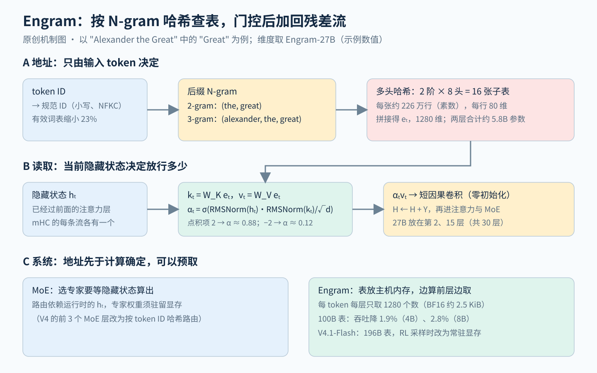

# Engram：用 N-gram 哈希查表承担静态模式，把一部分专家参数换成可预取的记忆

> 状态：技术精读 · 原文 arXiv:2601.07372v2 · 未复现

## 一句话

Cheng 等（北京大学与 DeepSeek-AI，2026）在 MoE 的"条件计算"之外加一条"条件记忆"稀疏轴：用当前 token 与前一两个 token 组成的 N-gram 做哈希，从很大的嵌入表里以常数时间取出向量，经上下文门控加回残差流。在总参数与每 token 计算量都固定时，把约 20%–25% 的稀疏参数从专家挪给记忆表，验证损失最低；按这个比例做成的 Engram-27B 比同参数、同计算的 MoE-27B 在 BBH 上高 5.0、MMLU 高 3.0。地址只取决于输入 token，推理前就能算出，所以 100B 参数的表可以放在主机内存里预取，吞吐只降 2.8%。DeepSeek-V4 没有采用它，V4.1-Flash 接入了 196B 参数的 Engram。

## 它要解决的问题

Transformer 里存知识的主要是 FFN，MoE 把 FFN 做大了，但"认出一个固定短语"这类工作仍要靠一层层计算去完成。

**知识主要在 FFN。** [注意力与 FFN 的分工谱系](../../../foundations/relations/attention-ffn-division.md)第 4–6 节整理了这条线：FFN 可以写成 Σ f(x·k_i) v_i，即一张用参数写成的键值表（Geva 等 2021）；事实回忆集中在 MLP，由注意力读出（ROME、Dissecting Recall）。MoE（混合专家，一句话：一层里放许多 FFN 专家，每个 token 只算路由器选中的几个）沿这条分工把 FFN 稀疏化（第 7 节），[DeepSeekMoE](../arxiv-2401.06066/README.md) 用"知识混杂""知识冗余"描述专家要解决的问题，[DeepSeek-V2](../deepseek-v2/reading.md) 把它做到 236B。

**MoE 仍是在"算"知识。** 原文 §1 与表 3 引用 Patchscopes 的观察：模型读到 "Diana, Princess of Wales" 的最后一个 token 时，第 1–2 层只认出 "Wales" 是英国的一个地区，第 4–5 层认出 "Princess of Wales" 这个头衔，到第 6 层才对应到戴安娜本人。作者认为这相当于在运行时用好几层注意力和 FFN 重建一张静态查找表，占用了本可以留给推理的深度。命名实体、固定搭配这类局部、刻板的模式，经典的 N-gram 模型（一句话：只看前 N−1 个词来预测下一个词的统计语言模型）用查表就能捕捉。

**前人的 N-gram 嵌入为什么不够。** 把 N-gram 哈希成嵌入并加进模型早有先例，例如 OverEncoding（Huang 等 2025）、SCONE（Yu 等 2025）、BLT（Pagnoni 等 2025，字节级 Transformer）。原文 §7 指出两点不足：没有在"总参数相同、每 token 计算相同"的严格条件下与 MoE 对比，OverEncoding 在 MoE 骨干上甚至没有明显收益；嵌入都放在输入层，查表与计算只能串行。

## 核心想法

相对 MoE 基线，增量在三处。

1. **条件记忆作为第二条稀疏轴。** MoE 按隐藏状态选专家（条件计算），Engram 按输入 token 选表项（条件记忆）。前者擅长依赖上下文的组合推理，后者承担不依赖上下文的静态模式。
2. **一个能在 MoE 上起作用的查表模块。** 经典 N-gram 嵌入加上四项改造：分词器压缩、多头哈希、上下文门控、与多流残差的整合。消融显示分词器压缩、门控、按流整合三项最重要，短卷积影响很小（§6.2）。
3. **把"怎样分配稀疏参数"变成一个可测的问题。** 在固定总参数与计算量下扫描专家与记忆表的比例，得到 U 形曲线，再按曲线的最优点放大到 27B。

系统设计（确定性地址带来的预取）是第四点，原文把它与建模并列为一等原则。

## 机制

图左是从 token 到表项的地址计算，图中是门控读取，图右是记忆表放在主机内存时的预取时序。

### 1 查表：从 token 到地址（示例数值）

以 "Only Alexander the Great could tame the horse" 中的 "Great" 为例（原文图 1 的句子）。

1. **分词器压缩。** 先把 token ID 映射成规范 ID：NFKC 规范化、转小写等，让 "Apple" 与 " apple" 这类只差大小写或空格的 token 合并。128k 词表的有效大小因此缩小 23%（§2.2，附录 C）。
2. **取后缀 N-gram。** 在 "Great" 处取 2-gram（the, great）与 3-gram（alexander, the, great）。Engram-27B 只用 2 阶和 3 阶，单个 token 的信息由主干的词嵌入负责。
3. **多头哈希。** 每一阶各用 K = 8 个不同的哈希函数（一种轻量的乘法加异或哈希），各指向一张大小为素数的子表，共 2 × 8 = 16 次查表（式 1）。不同的 N-gram 可能落到同一个槽位（哈希碰撞），但两个 N-gram 在 8 个头上同时碰撞的概率约为单头概率的 8 次方，可以忽略。
4. **拼接。** 16 个向量拼成 e_t，总维度 d_mem = 1280（式 2、表 5），按均分每个子表向量 80 维。

**参数账。** 附录表 5 给出 Engram-27B 的"Engram 词表大小"为 2,262,400，两个 Engram 层。按"每个子表约 226 万行、每行 80 维"理解，参数为 2,262,400 × 80 × 16 × 2 ≈ 5.79B，与表 1 的 5.7B 一致；Engram-40B 的 7,239,680 行同样算得 18.5B，与表 1 一致（示例数值，表 5 未写明这一读法，两组数字都吻合）。每个 token 在一个 Engram 层只取出 1280 个数，按 BF16 计约 2.5 KiB，与表的总大小无关。

### 2 读取：门控与短卷积

取出的 e_t 与上下文无关，同一个 N-gram 在任何句子里都得到同一个向量，碰撞和一词多义都会带来噪声。Engram 用当前隐藏状态 h_t 作查询，对取出的记忆做一次单键的注意力式检查（式 3–4）：

\[
k_t=W_Ke_t,\quad v_t=W_Ve_t,\qquad
\alpha_t=\sigma\!\left(\frac{\mathrm{RMSNorm}(h_t)^\top\mathrm{RMSNorm}(k_t)}{\sqrt d}\right),\qquad \tilde v_t=\alpha_t v_t
\]

示例数值：若归一化后的点积除以 √d 等于 2，门值 σ(2) ≈ 0.88，记忆基本放行；等于 −2 时门值约 0.12，记忆被压低。h_t 已经过前面的注意力层，所以门值反映"这段记忆与当前上下文是否相符"。原文图 7 的可视化里，门在 "Alexander the Great""the Milky Way""Princess of Wales" 以及中文的"四大发明""张仲景"这类短语的末尾 token 上明显打开。

之后再过一个短的因果深度卷积（核宽 4、膨胀率等于最大阶数 3、SiLU 激活，式 5），扩大感受野、增加非线性。卷积参数零初始化，训练开始时整个模块的输出为零，主干从普通 MoE 出发。输出加回残差：H ← H + Y，然后照常进入注意力与 MoE（§2.3）。

**与多流残差的整合。** 全部实验的骨干都用 [mHC](../arxiv-2512.24880/reading.md)（残差流扩成 M = 4 条）。四条流共用一张表和一个 W_V，各有自己的 W_K，所以每条流的门值不同；五个投影可以合成一次 FP8 矩阵乘法（§2.4）。消融里去掉"按流门控"（只在 H_pre 合成后的输入上做一次融合）是损失变差最多的三项之一。

**与 FFN 键值表的对照（`[结构]`）。** FFN 的 key 是参数向量，要拿隐藏状态与每个 key 做点积才知道命中哪些（MoE 则用路由器在隐藏状态上打分选专家）；Engram 的 key 是输入 token 的哈希，地址在前向计算开始前就已确定，value 就是表里那一行，门控只做一次标量的"放行多少"。地址不依赖隐藏状态，这一点决定了第 5 小节的系统设计。

### 3 放在哪一层

位置是建模与系统的折中。在 3B MoE（12 层、激活 0.56B、100B token）上，把 1.6B 的记忆集中成一个模块、从第 1 层扫到第 12 层：第 2 层最好（验证损失 1.770，基线 1.808），越往深越差（§6.2、图 5）。作者的解释是：越早插入，越能在主干花掉深度之前卸下局部模式；但最早的隐藏状态还没经过注意力，门控缺少上下文，所以第 1 层不如第 2 层。把同样 1.6B 拆成两个模块放在第 2、6 层更好（1.768）。系统一侧则希望放得更深，前面的层越多，越能把从主机内存取数的延迟藏在计算后面。Engram-27B 的两个模块放在第 2 层与第 15 层（30 层中）。

### 4 分配：把专家参数换成记忆参数（示例数值）

原文 §3.1 定义三个量：P_tot（总参数，不含词嵌入与输出头）、P_act（每 token 激活的参数，决定训练计算量）、P_sparse = P_tot − P_act（不参与当次计算的参数，即没被选中的专家与没被取到的表项）。分配比例 ρ 是 P_sparse 中分给 MoE 专家的份额，ρ = 1 为纯 MoE。

**Engram-27B 的账。** MoE-27B 每层有 2 个共享专家和 72 个路由专家，Engram-27B 把路由专家减到 55 个，空出的参数给 5.7B 的记忆表（表 1）。按同配置 mHC 原文表 5 的专家宽度 1536、隐藏维度 2560 估算，一个 SwiGLU 专家（带门控的 FFN，含三个权重矩阵）每层有 3 × 2560 × 1536 ≈ 1180 万参数，29 个 MoE 层合计约 0.34B；17 个专家约 5.8B，正好对上 5.7B。P_sparse ≈ 26.7B − 3.8B − 0.66B（词嵌入与输出头）≈ 22.2B，5.7B 占其中约 25.6%，即 ρ ≈ 74.4%，与原文的 74.3% 一致（示例数值）。

**U 形曲线。** 在 2 × 10²⁰ 与 6 × 10²⁰ FLOPs 两个预算下（总参数约 5.7B 与 9.9B，激活约十分之一），扫描 ρ（图 3 左）：

- 纯 MoE（ρ = 100%）不是最优；ρ ≈ 75%–80% 时损失最低。9.9B 的设置里验证损失从 1.7248 降到 1.7109。
- ρ 降到约 40%（专家只剩 43–46 个）时，损失才回到纯 MoE 的水平。
- 再往下，记忆替代不了计算，依赖上下文的推理受损，曲线回升。

以 9.9B 为例，P_sparse ≈ 9.9 − 0.99 ≈ 8.9B，最优点约把 1.8B 给记忆表。另一组实验固定 3B 的 MoE 骨干、只加大记忆表（槽位从 2.58 × 10⁵ 加到 10⁷，最多约 13B 参数），验证损失随槽位数在对数坐标上近似直线下降（图 3 右），而且同样的表，Engram 比 OverEncoding 的收益大得多。

### 5 系统：地址确定，就能预取

MoE 选哪个专家要等隐藏状态算出来；Engram 的地址只由 token 序列决定，前向开始前就能全部算好（§2.5）。

- **训练。** 表按行切分到各 GPU，前向用 All-to-All 通信收集被取到的行，反向把梯度送回。表的容量随 GPU 数线性增长。
- **推理。** 表放在主机内存，一边算前面的层，一边经 PCIe 异步取下一个 Engram 层要用的行。原文在 4B 与 8B 稠密骨干的第 2 块插入 100B 参数的 Engram（按 BF16 约 200 GB），吞吐从 9031.6 降到 8858.3 token/s（4B，降 1.9%）、从 6315.5 降到 6140.0（8B，降 2.8%）（表 4）。
- **分级缓存。** N-gram 的访问频率服从 Zipf 分布（少数高频模式占大多数访问），作者提出高频项放 HBM 或主机内存、长尾放 NVMe SSD；这一点只是设计建议，没有实验。

## 证据：哪个实验支撑哪个主张

| 主张 | 支撑实验 | 怎么读 |
|---|---|---|
| 专家与记忆之间存在最优分配 | §3.1 图 3 左：两个预算下都呈 U 形，最优 ρ ≈ 75%–80% | 两个规模、固定稀疏度约 10 倍；没有更大规模的扫描 |
| 记忆表越大越好 | §3.2 图 3 右：3B 骨干、100B token，槽位 2.58 × 10⁵ → 10⁷，损失对数线性下降 | 加表会增加总参数，这组不是同参数对照 |
| 同参数、同计算下优于 MoE | 表 1（262B token，激活 3.8B）：Pile 损失 1.960 → 1.950；BBH 50.9 → 55.9，MMLU 57.4 → 60.4，CMMLU 57.9 → 61.9，ARC-C 70.1 → 73.8，HumanEval 37.8 → 40.8，MATH 28.3 → 30.7 | 单次训练，没有误差条；附录 B 给出训练过程曲线 |
| 记忆加大还能继续提升 | 表 1：Engram-40B（18.5B 记忆）多数基准高于 27B | HumanEval、MBPP、C3、MATH 反而下降，作者归因于训练不足 |
| 长上下文检索更好 | 表 2（32k 扩展训练 30B token）：多查询大海捞针（在长文本中埋入多条信息、要求同时找回）84.2 → 97.0，变量追踪 77.0 → 87.2（Engram 取第 46k 步，与 MoE 第 50k 步的预训练损失相同） | 按预训练损失对齐；单针检索 100.0 对 97.6 略低 |
| 早期层被解放、相当于加深 | §6.1 图 4：logit lens（把中间层表示直接投影到词表上）下早期层与最终输出的 KL 更小；CKA（比较两组表示相似度的指标）显示 Engram 第 5 层与 MoE 第 12 层最相似 | 相关性分析，不是因果干预 |
| 记忆主要存事实 | §6.3 图 6：推理时关掉 Engram，TriviaQA 只剩 29%，事实类 29%–44%，阅读理解 81%–93% | 训练与推理不一致的事后消融 |
| 卸载到主机内存几乎不慢 | §6.4 表 4：100B 表，H800，吞吐降 1.9%–2.8% | 骨干是稠密模型，没有测 MoE 的专家并行场景 |

## 局限与后续

**哪些任务改善、哪些没有。** 收益最大的不是知识问答。表 1 中 Engram-27B 相对 MoE-27B 涨得最多的是 CCPM（中文古诗匹配）+7.5、BBH +5.0、CMMLU +4.0、ARC-Challenge +3.7、DROP +3.3；事实问答 TriviaQA 只 +1.9，长尾实体问答 PopQA（专门考低热度实体的问答集）只 +0.2，WinoGrande +0.2。`[判断]` 关掉 Engram 时 PopQA 只剩 44%，说明事实已经大量存进了表里；但 PopQA 几乎没涨，又说明 27B 规模下换进来的 5.7B 记忆没有显著扩大长尾知识的总量，主要收益来自把主干从局部模式里解放出来，与作者"相当于加深网络"的解释一致。原文 §8 把推理、代码、数学的提升归于这一点。

**V4 没有采用，V4.1-Flash 采用并改了三处。** [DeepSeek-V4](../arxiv-2606.19348/README.md)（2026 年 6 月）的架构里没有 Engram；它把前 3 个 MoE 层改为按 token ID 哈希路由（Hash routing，按预先定义的哈希函数决定专家，§2.1、§4.2.1），这同样是"地址只看 token"的思路，但落在专家上；结论一节把"更稀疏的嵌入模块"（引用本文）列为未来方向（§6）。[DeepSeek-V4.1-Flash](../arxiv-2609.19969/README.md)（2026 年 9 月）接入 196B 参数的 Engram（§2.4.2）：两个模块放在第 1、14 层（从 0 计数），阶数 {2, 3, 4}，每阶 8 个头、总维度 2048，每个头约 1600 万行，表与投影都用 FP8。核对参数：3 阶 × 8 头 × 1600 万行 × 256 维 × 2 个模块 ≈ 196.6B；每个 token 每个模块取 6144 个 FP8 数，两个模块约 12 KiB（示例数值）。相对原设计的改动：

- 去掉短卷积，理由是收益抵不过推理系统里增加的复杂度（§2.4.2），与本文"去掉卷积只略差"的消融一致；
- 原文用 Adam 更新嵌入表，V4.1 指出 Adam 的优化器状态让显存大增，改用"动量加 Sinkhorn 平衡"的更新（只需一个动量缓冲，经验上优于 Adam），学习率仍按本文放大 5 倍（§2.5、§4.2.2）；
- 强化学习采样阶段，表常驻 GPU 显存而不放主机内存，原因是主机内存碎片会导致内存不足（§3.1.3）。`[判断]` 本文"放主机内存几乎不慢"的结论只在推理吞吐上测过，训练与强化学习的系统环境暴露了别的约束。

V4.1-Flash 的配置一节不再提哈希路由（§4.2.1），也没有报告去掉 Engram 的消融，Engram 在旗舰模型中的单独贡献未知。

**表与分词器绑定。** [Tokenizer-Agnostic Engram Module](../arxiv-2607.29065/README.md)（Lim、Chieu，2026）指出：Engram 先给每个 token 一个哈希值，再按位置用异或聚合，换一个分词器，同一段文字的切分与顺序都会变，表只能重训。作者改为从字节序列做多项式哈希，各阶共用一个嵌入空间并加入 1-gram，使字节相同的 token 序列得到相同的地址。在 SmolLM2-1.7B 上（32B token），平均准确率异或哈希 0.605、多项式哈希 0.612，相当；把一个 7B 模型（cl100k 分词器）训练出的表冻结后接到另一个分词器的 0.7B 模型，平均准确率从 0.560 升到 0.584，只开 1-gram 的对照几乎没有收益（表 3–5）。这些实验规模小、每组只跑一次，而且加表会增加总参数，不是本文的同参数对照；表 3 里加了 Engram 的模型在 wikitext 上的 bits/byte 反而比基线高（0.919 对 0.861），原文没有解释。

**冻结的表要有对齐的读取器。** [Frozen Memory Is Not Enough](../arxiv-2608.17050/README.md)（Li 等，NeurIPS 2026）把在源模型上训练好的 Engram 表冻结，接到另一个模型上，只训练一个小的读取器（W_K、W_V 与门控）。结论是表的内容和正确寻址都有用，但只有通过与目标模型对齐的读取器才发挥作用；在目标侧从头训练一张新表，在同样的预算下也有竞争力，迁移的主要好处是省数据：Pythia-160M → 410M 时，迁移只训练 105 万参数，20M token 就到测试困惑度 21.5，从头训练 3460 万参数要到 50M token 才到 21.6（表 4）。它还给出两个做不好的场景：TruthfulQA（考察能否拒绝常见误解的问答集）在每个目标规模上都下降 0.2–0.8 个点，作者认为多出来的记忆联想在需要拒绝似是而非信息时有害（§4.3、图 3）；按空格切词的寻址在中文、日文上失效，要改用字符片段（附录 H）。

**做不好的场景（原文自述与 `[判断]`）。**

- 记忆替代不了计算：ρ 低于约 40% 后损失回升（§3.1）。
- 位置两难：放早了门控缺上下文，放深了卸不掉底层的局部模式（§6.2）。
- 长上下文并非全面提升：单针检索与常见词抽取上 Engram 略低于 MoE（表 2）。
- `[判断]` 表按 N-gram 存，而不是按事实存：同一个事实换一种说法、换一种语言，地址就不同；能否像 ROME 那样定点改写某条知识，原文没有检验。

## 批注

**易误读**

- MMLU 的提升：本页用表 1 与 §4.2 正文的 +3.0（57.4 → 60.4）；摘要与 §1 写作 +3.4，与表 1 不符。
- "27B"指总参数 26.7B，每 token 激活 3.8B（不含词嵌入）。"同计算"在表 1 的精度下成立；按表 5 维度估算，两个 Engram 层的 W_K、W_V 约增加 3300 万激活参数（约 0.9%），表中四舍五入后仍是 3.8B（`[判断]`，原文没有单列）。
- 长上下文的对比选了 Engram 的第 41k、46k、50k 步三个检查点，其中 46k 是按"预训练损失与 MoE 最终损失相同"挑出来的；"同计算"比较看 50k 那一行。
- 关掉 Engram 的敏感性分析是训练与推理不一致的事后消融，作者因此只解读事实知识与阅读理解两端（§6.3）。同一张图里算法推理类也掉得很多（MATH 只剩 36%、MGSM 44%、GSM8K 62%），"表里只有事实"的说法过强。
- 100B 表的吞吐测试只取了单个 Engram 层、稠密骨干、序列长度 100–1024 的批量负载，不代表长上下文或 MoE 部署。
- [Frozen Memory Is Not Enough](../arxiv-2608.17050/README.md) 式 2 写的门是 σ(sign(s)·√|s|)，本文式 4 是 σ(s)；两者可能分别对应官方代码与论文公式，本页按论文公式写。

**与其他论文的关联**

- [注意力与 FFN 的分工谱系](../../../foundations/relations/attention-ffn-division.md)第 8–9 节：本篇是"知识偏向 FFN"一线的最新节点，把能脱离上下文的那部分从 FFN 专家里拆成查表；关掉表后事实类大降、阅读理解基本保留，是这条分工最直接的证据。键值记忆的原始证据见 [Geva 等 2021](../../../cross-domain/papers/arxiv-2012.14913/README.md)，事实定位见 [ROME](../../../cross-domain/papers/arxiv-2202.05262/README.md)。
- [Switch Transformer](../arxiv-2101.03961/README.md) → [DeepSeekMoE](../arxiv-2401.06066/README.md) → 本篇：条件计算到条件记忆；V4 的前 3 层哈希路由是两者之间的折中形态。
- [mHC 精读](../arxiv-2512.24880/reading.md)：本篇全部实验以 mHC 为骨干，"按流门控"依赖多流结构；V4.1-Flash 同时用了 Single-Pass mHC 与 Engram。
- [DeepSeek-V2 精读](../deepseek-v2/reading.md)：V2 的 MLA 只为推理省 KV 缓存、MoE 稀疏化 FFN；本篇与它分工相同，都不动注意力的计算方式，而是把容量加在 FFN 一侧。
- [Tokenizer-Agnostic Engram](../arxiv-2607.29065/README.md) 与 [Frozen Memory Is Not Enough](../arxiv-2608.17050/README.md)：把记忆表当作可移植部件，分别处理"表与分词器的绑定"和"表与读取器的绑定"。
- [长上下文方向](../../fields/long-context/README.md)：本篇把部分长上下文收益归于"局部依赖交给查表、注意力留给全局"，这是作者的解释，没有直接测量注意力容量。

**未核实 / 待验证**

- 官方仓库 github.com/deepseek-ai/Engram 的代码未阅读，哈希函数与门控的实现细节以论文为准。
- 原文 v1（2026 年 1 月）与 v2（2026 年 7 月）的数字是否一致未逐项比对，本页取自 v2。
- 表 5"Engram 词表大小"按"每个子表的行数"理解，原文未定义；按这一理解参数量与表 1 吻合。
- V4.1-Flash 是多模态模型，图像 token 怎样参与 N-gram 哈希，报告未说明。
- 数值出处与页码见[证据档案](evidence.json)；机制图见 [SVG](figures/engram-mechanism.svg)。
