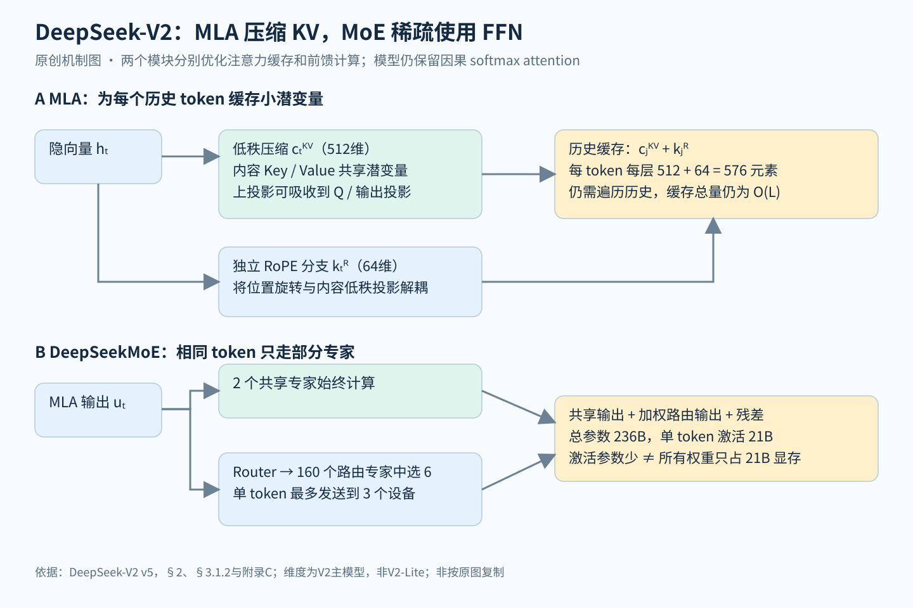

# DeepSeek-V2：注意力只缓存一个潜向量，FFN 只激活少数专家，把模型容量与每 token 成本分开

> 状态：技术精读 · 原文 arXiv:2405.04434v5 · 未复现

## 一句话

DeepSeek-AI（2024）在 Transformer 的两个子层上各做一处改动：注意力换成多头潜在注意力 MLA，每个历史 token 只缓存一个 512 维潜向量加一个 64 维位置键；FFN 换成 DeepSeekMoE，每个 token 只激活 160 个路由专家中的 6 个和 2 个共享专家。模型总参数 236B、每 token 激活 21B，在 8.1T token 上预训练；与自家稠密的 DeepSeek 67B 相比，KV 缓存少 93.3%，每训练 1T token 的成本低 42.5%，最大生成吞吐为 5.76 倍。

## 它要解决的问题

稠密大模型有两笔随规模增长的成本。

- **每 token 的计算。** 稠密模型每个 token 都要经过全部参数。[DeepSeek LLM](../arxiv-2401.02954/README.md) 67B 想装更多知识，就得同比增加每 token 的计算。[DeepSeekMoE](../arxiv-2401.06066/README.md)（2024 年 1 月）已在 16B 规模上验证：把专家切细、再隔离出共享专家，可以用更少的激活参数达到稠密模型的效果。
- **推理时的 KV 缓存。** [Transformer](../transformer/reading.md) 逐词生成时要为每个历史 token、每层、每个头保存 K 和 V，缓存随长度和批量线性增长，限制了能同时服务的请求数。MQA（多查询注意力，一句话：所有查询头共享一组 K、V）和 GQA（分组查询注意力，一句话：每组查询头共享一组 K、V）减少了缓存，但质量下降。

DeepSeek-V2 要回答：在 200B 以上的规模上，能否同时砍掉这两笔成本，而且注意力的质量不低于标准多头注意力（MHA）？

## 核心想法

两处改动分别落在 Transformer 的两个子层上，这正是[注意力与 FFN 的分工谱系](../../../foundations/relations/attention-ffn-division.md)第 7 节所说的分工：对注意力的改动只为推理省内存，稀疏化的对象是 FFN。

1. **MLA（Multi-head Latent Attention）。** 把各头的 K、V 联合压缩成一个低维潜向量，推理时只缓存它；利用矩阵乘法的结合律，把"从潜向量还原 K"这一步吸收进查询一侧，不必在每步解码时展开历史。位置信息另走一条共享的小分支（解耦 RoPE），否则吸收无法成立。
2. **大规模的 DeepSeekMoE。** 细粒度路由专家加共享专家，配上限制设备数的路由、三项负载均衡损失和按设备预算丢弃部分专家计算，让稀疏计算在多机上真正兑现。

训练流程本身（YaRN 扩到 128K、SFT、GRPO 强化学习）在后文简述，它们不属于架构增量。

## 机制

上半图是 MLA 为每个历史位置存什么，下半图是 MoE 为每个当前位置算哪些 FFN；两种节省来源不同。

### 1 KV 缓存的账（示例数值）

原文表 1 给出每个 token 的 KV 缓存元素数（n_h 头数、d_h 每头维度、l 层数、n_g 组数）：MHA 为 2n_h·d_h·l，GQA 为 2n_g·d_h·l，MQA 为 2d_h·l，MLA 为 (d_c + d_h^R)·l。

按 V2 的配置算一层：n_h = 128、d_h = 128、潜向量维度 d_c = 512、位置键维度 d_h^R = 64。

- MHA：2 × 128 × 128 = 32,768 个数。
- MLA：512 + 64 = 576 个数，约为 MHA 的 1/57。
- 等价的 GQA 组数：576 ÷ (2 × 128) = 2.25，也就是原文所说"缓存相当于只有 2.25 组的 GQA"。

全模型 60 层，每个历史 token 共 576 × 60 = 34,560 个数；按 BF16 每个数 2 字节、忽略元数据，约 67.5 KiB。附录 D 大 MoE 消融里 MLA 的 34.6K 元素/token 与这个数一致。实际服务又对 KV 做了平均 6 bit 的量化，所以部署时更小。

### 2 MLA：缓存潜向量，把上投影吸收进查询

对第 t 个 token 的隐藏向量 hₜ（原文式 9–11）：

\[
c_t^{KV}=W^{DKV}h_t,\qquad k_t^C=W^{UK}c_t^{KV},\qquad v_t^C=W^{UV}c_t^{KV}
\]

W^{DKV} 把 hₜ 压到 512 维，W^{UK}、W^{UV} 再为每个头还原出内容键与值。若每步解码都把全部历史潜向量还原成 K、V，省下的显存会被额外计算抵消。关键在结合律：对第 i 个头，

\[
(q_{t,i}^C)^\top W_i^{UK} c_j^{KV}=\big((W_i^{UK})^\top q_{t,i}^C\big)^\top c_j^{KV}
\]

先把当前查询变换一次，再与缓存里每个 512 维的 cⱼ 做点积；值一侧同样先对 cⱼ 加权求和，再乘 W_i^{UV}，并与输出投影合并（附录 C 式 37–47）。这是 MLA 自身参数化下的精确等价。

查询也被压到 1536 维，目的是减少训练时的激活内存；查询不需要缓存，这部分与 KV 缓存的节省无关。潜向量后还加了 RMSNorm 和缩放因子，用于训练稳定（§3.1.2）。

### 3 解耦 RoPE：位置走一条共享的小分支

RoPE（旋转位置编码，一句话：按位置把 Q、K 的每对分量旋转一个角度，使点积只依赖相对位置）若直接作用在内容键上，打分里会夹进一个随位置变化的旋转矩阵。它夹在 W_i^{UK} 与查询之间，矩阵乘法一般不交换，于是无法再把 W_i^{UK} 吸收进查询，只能缓存展开后的键（§2.1.3）。

V2 另开一条携带位置的分支：每个头有自己的位置查询 q^R，所有头共享一个 64 维位置键 k^R，内容分支不旋转。打分是两部分之和：

\[
s_{t,i,j}=\frac{(q_{t,i}^C)^\top k_{j,i}^C+(q_{t,i}^R)^\top k_j^R}{\sqrt{d_h+d_h^R}}
\]

softmax 后仍对值加权求和。每个历史位置因此只缓存 c^{KV} 与 k^R，即第 1 小节的 576 个数。

### 4 DeepSeekMoE：只替换 FFN

对注意力输出 uₜ（原文式 20–22）：

\[
h'_t=u_t+\sum_{i=1}^{N_s}\mathrm{FFN}_i^{(s)}(u_t)+\sum_{i=1}^{N_r}g_{i,t}\,\mathrm{FFN}_i^{(r)}(u_t)
\]

路由器用 uₜ 与每个专家的向量打分、做 softmax，只保留最高的 K 个门值。V2 除第一层外都用 MoE：每层 2 个共享专家、160 个路由专家，每 token 激活 6 个，每个专家的中间宽度 1536（§3.1.2）。细粒度专家让同样的激活预算可以组合更多种专长，共享专家承担通用部分、减少路由专家之间的重复。专家结构与标准 FFN 相同，attention、残差与其余层照常共享。

总参数 236B 与激活参数 21B 是两个量：后者决定每 token 的计算，前者决定权重要占多少显存；其他 token 会路由到其他专家，所以整套权重都要驻留。

### 5 路由的系统约束

专家分布在 8 个设备上（D = 8）。细粒度专家让一个 token 可能访问很多设备，通信随之增加。V2 先为每个 token 选出专家得分最高的 M 个设备，再在其中做 top-K，设 M = 3；作者报告 M ≥ 3 时效果与不受限的路由大致相当（§2.2.2）。

负载均衡用三项辅助损失：专家级（α₁ = 0.003）、设备级（α₂ = 0.05）、通信级（α₃ = 0.02）。专家级损失 L_exp = α₁ Σᵢ fᵢPᵢ 把每个专家实际被选中的频率 fᵢ 与平均路由概率 Pᵢ 相乘，防止少数专家吃掉大部分 token 而使其他专家训练不足（路由坍缩）。

辅助损失只是软约束。训练时每个设备的计算预算按容量因子 1.0 设定，超出预算时丢弃该设备上亲和度最低的那些 token 的专家计算，同时保证约 10% 的训练序列不被丢弃，以便推理时可以按需决定是否丢弃（§2.2.4）。训练用 16 路零气泡流水线并行、8 路专家并行和 ZeRO-1 数据并行（§3.1.3）。

### 6 预训练与对齐

预训练序列长 4K，8.1T token 中中文比英文多约 12%。之后只在解耦的位置分支上应用 YaRN（一种调整 RoPE 频率的长度外推方法），用 32K 长度追加训练 1000 步，在 128K 的大海捞针（在长文中埋一句话要求找回）测试上表现良好（§3.1.4）。

SFT 用 150 万条数据（120 万帮助性、30 万安全性）。强化学习用 GRPO（组相对策略优化，一句话：对同一问题采样一组回答，用组内得分的标准化值 Aᵢ = (rᵢ − mean) / std 作为优势，省去与策略同样大的价值网络），它来自同团队的 [DeepSeekMath](../arxiv-2402.03300/README.md)，是 [PPO](../ppo/reading.md) 的变体。RL 分两阶段：先做代码与数学的推理对齐，再做帮助性、安全与规则奖励的人类偏好对齐（§4.2）。

## 证据：哪个实验支撑哪个主张

| 主张 | 支撑实验 | 怎么读 |
|---|---|---|
| MLA 质量不低于 MHA，缓存小得多 | 附录 D 表 9，约 250B 总参数的大 MoE、420B token：MMLU 57.5 → 59.0，BBH 46.6 → 50.7，KV 缓存 860.2K → 34.6K 元素/token；小 MoE 缓存 110.6K → 15.6K | 大多数指标提升；小 MoE 的 C-Eval 从 51.6 降到 50.9 |
| 共享 KV 头的代价 | 附录 D 表 8，7B 稠密、1.33T token：5-shot MMLU 为 MQA 37.9、GQA（8 组）41.2、MHA 45.2 | 为对齐参数量调整了层数；是这组设置下的取舍 |
| 限制设备数不伤效果 | §2.2.2：M ≥ 3 时与不受限路由大致相当 | 原文没有给出数字 |
| 训练更省 | §3.2.3，H800 集群：每训练 1T token，V2 需 172.8K GPU 小时，DeepSeek 67B 需 300.6K | 单位 token 的成本之比，不是两个项目的总开销 |
| 推理更快 | §3.2.3：单节点 8 张 H800，按 DeepSeek 67B 线上服务的长度分布，生成吞吐超过 5 万 token/s，为 67B 的 5.76 倍 | 包含 FP8 权重、平均 6 bit 的 KV 量化与更大的批量 |
| 对齐有得有失 | 表 3，SFT → RL：MATH 52.7 → 53.9，HumanEval 76.8 → 81.1；BBH 81.3 → 79.7，MMLU 78.4 → 77.8 | 作者称之为对齐税（alignment tax，§4.4） |

## 局限与后续

原文 §5 自述：预训练后知识不再更新，会生成未经核实的内容与幻觉；数据以中英文为主，其他语言能力有限；只支持文本模态。

站在现在看，V2 的几项做法在后续版本里被逐一替换，替换的位置说明了当时的权宜之处。

**MoE 路由：从"损失加丢弃"到"偏置调节、全程不丢"。** [DeepSeek-V3](../arxiv-2412.19437/README.md)（2024 年 12 月）摘要写明 MLA 与 DeepSeekMoE 已在 V2 中充分验证并沿用，改动集中在路由：每层 1 个共享专家加 256 个路由专家、激活 8 个，前三层保留稠密 FFN；亲和度改用 sigmoid；V2 的三项辅助损失换成[无辅助损失负载均衡](../arxiv-2408.15664/README.md)（一句话：按上一批负载给每个专家的路由分数加偏置，偏置只影响选谁、不进入梯度），只保留一个系数极小的序列级损失；按设备限制改为每 token 最多发往 4 个节点；由于负载已经足够均衡，V3 训练和推理都不再丢弃 token（§2.1.2、§4.2）。`[判断]` V2 用三项损失加丢弃来保均衡，损失系数会干扰语言建模、丢弃会让部分 token 少算专家，V3 的每一处改动都对着这两个代价。依据：无辅助损失均衡的引言把"系数小了均衡不住、大了伤质量"列为出发点。

**训练目标：加上 MTP。** V3 还加了多 token 预测（MTP，一句话：在每个位置额外预测再下一个 token，保留完整因果链），深度为 1；推理时可丢弃，或用于投机解码，第二个 token 的接受率 85%–90%，每秒生成 token 数为 1.8 倍（§5.4.3）。预训练页"⑥训练方式保持简单"一节有它在 V4、V4.1-Flash 中的去留。

**MLA 的边界在后来暴露。** 第一，MLA 推理时不显式构造键矩阵，加不了 QK-Norm（计算注意力分数前对 Q、K 做归一化，常用的稳定训练手段）；Kimi K2 沿用 MLA，只能改在优化器里做 QK-Clip（[预训练方向](../../fields/pretraining/README.md)"①损失稳定"）。第二，MLA 压缩的是每个位置的表示，历史位置数不变，注意力计算仍随长度平方增长；到百万 token 上下文，DeepSeek 转向沿序列压缩与稀疏读取，V3.2 用 DSA，[DeepSeek-V4](../arxiv-2606.19348/README.md) 用 CSA/HCA，1M 上下文下 V4-Pro 的 KV 缓存为 V3.2 的 10%（预训练页"③更长更大的注意力"）。

**GRPO 走向推理模型。** V2 只用 GRPO 做了两阶段对齐，且观察到对齐税；[DeepSeek-R1](../arxiv-2501.12948/README.md) 把同一算法放到以可验证奖励为主的大规模推理训练上。

**稀疏模型的部署门槛。** 激活参数小，部署仍有门槛：整套专家权重要驻留，还要专家并行和跨设备通信。V3 自述推荐的部署单元较大，小团队负担重（预训练页"主线历史"第 4 阶段）。

## 批注

**易误读**

- 93.3% 的 KV 缓存减少以 DeepSeek 67B 为对照，是两个不同系统的比较；与"同头数 MHA"的维度比（约 1/57）不是同一个分母。
- 42.5% 是每训练 1T token 的成本之比；5.76 倍吞吐叠加了 FP8 权重、KV 量化与批量，不能全部归功于 MLA。
- MLA 的吸收是对 MLA 自身参数化的精确等价，不表示能把任意已训练好的 MHA 模型无损压缩成 MLA。
- 主模型的 MMLU 78.5、MATH 43.6（表 2）与其他模型在数据量、语种组成、总参数上都不同，单看这些分数不能证明某个模块的因果作用；更接近机制证据的是附录 D 的消融。
- DeepSeek-V2-Lite（附录 B）不压缩查询，专家数与训练 token（5.7T）也不同，不是主模型的等比缩小。
- 附录 E 把与地域文化相关的测试上的低分归因于语料去偏，依据是三位标注者之间一致性很低；这是作者的解释，没有受控对照。附录 G 的评测模板说明，打分方式与 few-shot 格式都会改变成绩。
- 128K 大海捞针只检验检索，不等于长文推理全面无退化。

**与其他论文的关联**

- [注意力与 FFN 的分工谱系](../../../foundations/relations/attention-ffn-division.md)第 7 节：本篇是"MoE 只稀疏化 FFN"的大规模实例，注意力一侧的改动（MLA）只为省内存。DeepSeekMoE 用"知识混杂""知识冗余"描述专家分工，与该页"FFN 偏向存知识"的方向一致；同一团队后来的 [Engram](../arxiv-2601.07372/README.md) 在 MoE 之外再加查表式记忆，是该页第 8 节。
- [Transformer 精读](../transformer/reading.md)：MQA → GQA → MLA 是围绕原始多头注意力 KV 缓存的一条改进线，本篇附录 D 表 8 给出了共享 KV 头的代价。
- [Mamba 精读](../mamba/reading.md)：两篇都在处理 KV 缓存。Mamba 把全部历史压进固定大小的状态，MLA 保留每个历史位置、只压缩每个位置的表示，所以 MLA 仍能精确回读任意位置，代价是缓存随长度增长。
- [DeepSeekMoE](../arxiv-2401.06066/README.md) → 本篇 → [DeepSeek-V3](../arxiv-2412.19437/README.md)（[无辅助损失均衡](../arxiv-2408.15664/README.md)、MTP）→ [DeepSeek-V4](../arxiv-2606.19348/README.md)：同一团队连续保留 DeepSeekMoE、每代只换一两个部件，是预训练页"团队偏好"一节的证据之一。
- [PPO 精读](../ppo/reading.md)与 [DeepSeek-R1](../arxiv-2501.12948/README.md)：GRPO 保留 PPO 的裁剪目标和对参考策略的 KL 项，去掉价值网络。

**未核实 / 待验证**

- 本轮核实了 V3 原文的路由、MTP 与超参段落（§2.1.2、§4.2、§5.4.3）；V3 中无辅助损失均衡的消融数字未重新核对，引用以预训练页与文献卡为准。
- DeepSeekMath 只核实了摘要（GRPO 由它提出）。
- 数值出处与页码见[证据档案](evidence.json)；机制图见 [SVG](figures/deepseek-v2-mechanism.svg)。
