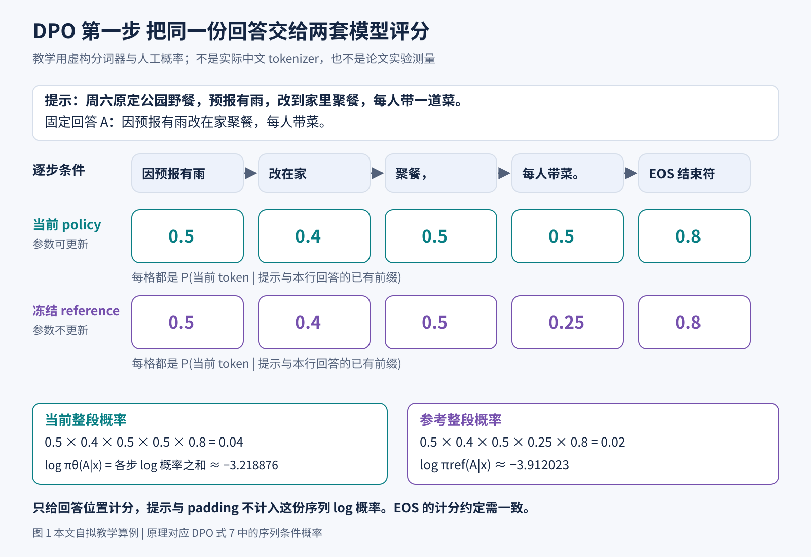
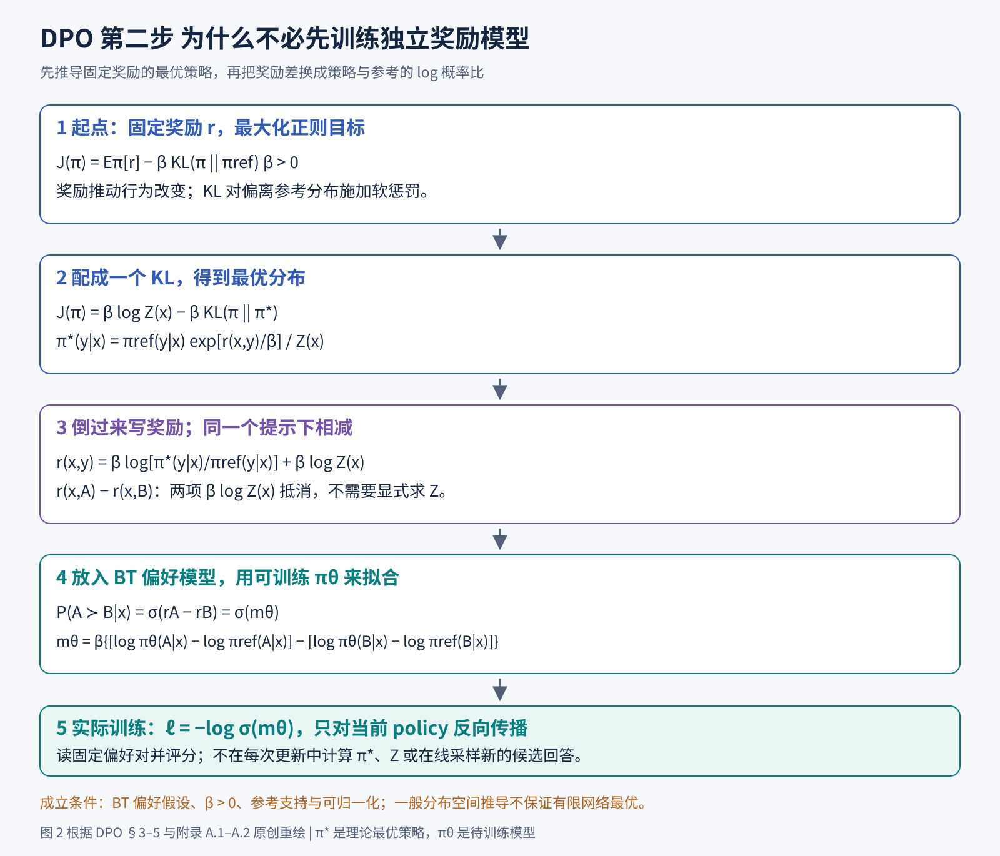
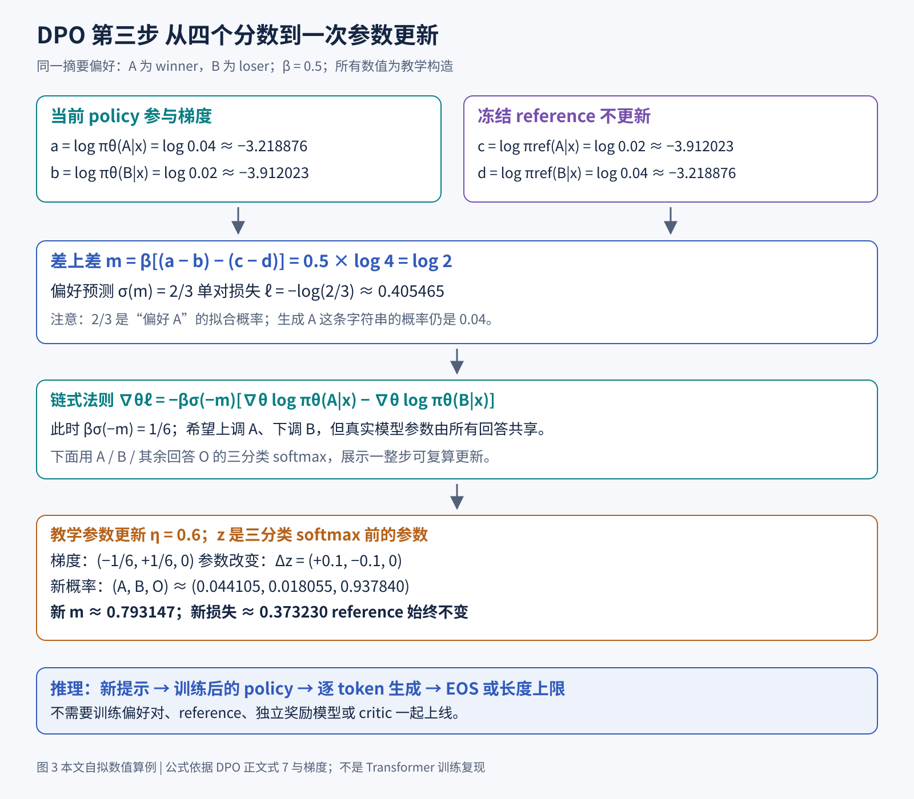
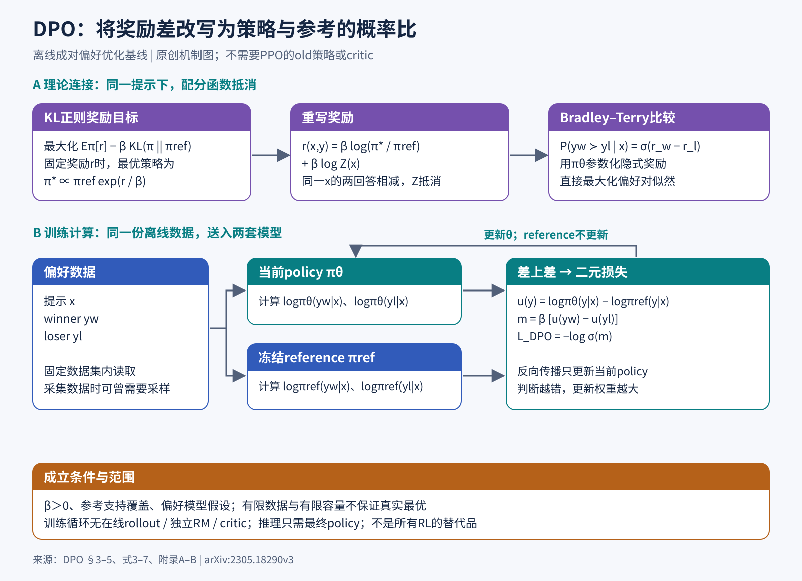

# 从一对回答读懂 DPO

> 状态：逐步教学版 · 原文 arXiv:2305.18290v3 · 未复现

论文：Rafael Rafailov、Archit Sharma、Eric Mitchell 等，Direct Preference Optimization: Your Language Model is Secretly a Reward Model，NeurIPS 2023，初稿 2023-05-29。[1][2]

如果你只知道“大模型会一个字一个字地回答”，还不懂强化学习，也可以从这里开始。我们会跟着同一条摘要样本，看文字怎样变成概率，偏好怎样变成损失，损失怎样变成梯度，梯度又怎样改变模型的回答方式。公式不会突然出现：每个新符号都在第一次用到时解释。

先给出最后会得到的结论：**DPO 用一对有优劣标签的回答，训练语言模型改变两者的相对概率；比较时，还会扣除冻结参考模型原本对两者的偏向。**它把一类奖励学习与带 KL 正则的策略优化问题，改写成可以直接对语言模型求导的偏好分类损失。它省去了原始训练流程中的独立奖励模型和在线强化学习优化环节；奖励、偏好假设与数据覆盖问题仍然存在，奖励以隐式的形式保留下来。[1，§3–5]

## 1 先把一条训练数据放在桌上

假设用户交给助手下面一段话：

提示 x：请用一句话总结：周六原定去公园野餐。天气预报有雨，所以改到家里聚餐，每人带一道菜。

两份候选回答是：

- 回答 A：因预报有雨改在家聚餐，每人带菜。
- 回答 B：周六去公园野餐，不用带菜。

标注者选择 A。理由很具体：A 保留了计划变更和带菜要求；B 把原计划当成最终计划，还颠倒了要求。于是我们记 A 为 y_w，B 为 y_l。下标 w 来自 winner，l 来自 loser。这里的 winner 只表示“这次比较中被选中的回答”；即使两份答案都有问题，标注者仍可能被要求选一个相对更好的。

一条偏好数据就是三件东西：提示 x、被偏好的回答 y_w、不被偏好的回答 y_l。把许多这样的三元组放在一起，就是偏好数据集 D。数据通常已经保存好，DPO 训练时直接从中取样。

这与“标准答案数据”有一点微妙差别。标准答案说：“遇到 x，请学着输出 A。”偏好对说：“遇到 x，A 比 B 更合适。”后者额外告诉我们 B 在这场比较里不应受鼓励。不过，**标签并没有指出究竟是哪几个 token 犯了错**。本例中人知道是地点和带菜要求错了，但普通 DPO 只拿到整段回答的优劣。模型能否把纠正推广到新句子，依赖它已有的语言能力和大量其他样本。

后文的概率都是示例数值，为了讲清计算而人工设置；论文中的任务和结果在第 13 节讨论。

## 2 一整份回答为什么会有概率

### 2.1 token 由分词器决定

语言模型处理的最小文本单位叫 token。一个 token 可能是一个汉字、半个英文词、标点，或者一段常见文本；具体怎样切分，由 tokenizer，也就是分词器决定。不同模型的切法可能不同。

为了让算式足够短，我们在本例中使用**教学用的虚构分词器**，将 A 切成五个单位：

因预报有雨 ｜ 改在家 ｜ 聚餐， ｜ 每人带菜。 ｜ 结束符

结束符通常写作 EOS，表示“这份回答到这里结束”。这里的长短语只是方便手算的 token。

模型先读提示 x，再给出“下一个 token 是什么”的概率分布。假设轮到第二个 token 时，模型已经读到提示和“因预报有雨”；它会给“改在家”“仍去公园”等候选单位分配概率。候选概率之和必须是 1。最终选哪个，可以用最大概率选择，也可以按分布随机采样。

我们把这套生成规则写成 π_θ。π 读作 pi，表示策略或概率分布；θ 读作 theta，表示模型的可训练参数。对语言模型来说，所谓 policy，中文常译“策略”，就是决定接下来生成什么的模型。

### 2.2 条件概率中的竖线怎么读

π_θ(y_t | x, y_<t) 的读法是：在已经知道提示 x 和前面所有回答 token 的条件下，当前模型生成第 t 个回答 token 的概率。

这里 t 是回答里的位置；y_t 是这个位置的 token；y_<t 是它之前的回答部分；竖线“|”表示“在……条件下”。

完整回答 y 是一条路径。走到它，需要第一步选对、第二步在正确前缀下选对，后面也都选对。因此：

π_θ(y | x) = ∏_(t=1)^T π_θ(y_t | x, y_<t)

∏ 表示把每一步的概率相乘；T 是回答 token 的个数。本例把 EOS 算在内。实际实现必须事先规定是否包含 EOS，并在 policy、reference、两种回答之间保持一致。

在我们设定的某个训练时刻，模型对 A 的这五步概率依次是：

0.5、0.4、0.5、0.5、0.8。

整份 A 的概率就是 0.5 × 0.4 × 0.5 × 0.5 × 0.8 = 0.04，也就是 4%。它表示在这个提示下，按该模型逐 token 采样，恰好生成这条完整字符串并在这里结束的概率。

正确意思有很多种表达。即使模型非常可靠，恰好生成某个措辞的概率也可能很低。

### 2.3 为什么训练里总在取 log

把很多小于 1 的数相乘，结果会非常小，不利于计算。取自然对数 log 后，乘法变加法：

log π_θ(y | x) = ∑_(t=1)^T log π_θ(y_t | x, y_<t)

∑ 表示求和。本文的 log 都是以 e 为底的自然对数。对于概率 0.04，自然对数约为 −3.218876；对于 0.02，约为 −3.912023。负数完全正常：0 到 1 之间的数取对数就是负的。−3.2 比 −3.9 大，所以前者对应更高的概率。

这里还藏着一个训练技巧：**给现成回答打分，不需要模型先把它生成出来。**我们把 A 的整条文本交给模型，在每个位置都提供数据中已有的正确前缀，再读取下一 token 的概率。这叫 teacher forcing，常译“教师强制”。因果注意力遮罩仍让每个位置只能看到之前的内容。

提示 token 是条件。计算 log π(y|x) 时，只累计回答位置的 log 概率；提示和用于补齐长度的 padding 不计入。注意：提示仍然参与模型计算，其表示也会影响回答损失和参数梯度。

图 1 把 A 在当前模型和参考模型中的五步评分展开。两条路径的文字完全相同，第四步概率不同，所以整段概率分别是 0.04 和 0.02。向右相乘，向下取 log 再相加，得到的是同一个序列概率的两种写法。图里的乘积数值只是教学设置，真实模型通常有更多 token。

## 3 SFT 先让模型学会怎样回答

SFT 是 supervised fine-tuning，监督微调。假设我们已经有一个经过预训练的语言模型，给它许多“提示与好回答”的示范，就可以训练它模仿回答方式。例如拿 x 和 A 构成一条示范，最小化：

L_SFT(θ) = −log π_θ(y_w | x)

L 表示 loss，也就是损失。我们把希望变大的东西加一个负号，就得到需要最小化的东西。模型给 A 的概率越大，log 概率越大，前面的负号就让损失越小。对很多样本训练时，再把这些损失求平均。

本例当前 π_θ(A|x)=0.04，因此单条示范的 SFT 损失是 3.218876。先记住这个数，后面 DPO 的损失会是另一个数，两者回答的是不同的统计问题。

如果示范充分，它也能教模型遵守要求、组织知识和解题。这里要区分的是监督形式：SFT 直接模仿一份答案；普通成对 DPO 还利用另一份较差答案作为对照。

完成 SFT 后，我们通常保存一份模型，再复制出可以继续训练的版本。保存下来且不再更新的叫 reference model，参考模型，记作 π_ref；可以继续更新的叫 policy，当前策略，记作 π_θ。初始化时两者往往一样，之后才逐渐分开。reference 是一把固定的尺子，在训练中保持不变。[1，§3–4]

“参考”有两个容易混淆的意思。这里的 reference model 是冻结的概率模型；摘要评测里的 reference summary 是数据集中的参考摘要文本。

## 4 DPO 接在什么历史问题后面

为什么不一直做 SFT？很多任务中，给两份答案选一个比从头写出完美示范更容易。研究者于是希望直接利用比较反馈。下面是与本文有关的几个节点。

2017 年，Christiano 等研究从人对轨迹片段的比较中学习反馈，并用于游戏和模拟控制。它说明人的相对判断可以成为学习目标的来源；研究对象还不是今天的聊天助手。[3]

2019 年，Ziegler 等将人类偏好驱动的奖励学习应用到语言模型，包括带风格的续写和摘要。这一阶段已经出现了“收集比较，学奖励，再优化生成”的语言任务路线。[4]

2020 年，Stiennon 等专门研究用人类反馈改进摘要，收集摘要比较数据，训练奖励模型，再用强化学习优化摘要策略。DPO 的 TL;DR 实验沿用了这条工作线中的偏好数据，因而其比较建立在一个已有的公开任务上。[5][1，§6]

2022 年，InstructGPT 把示范微调、奖励学习和策略优化用于更广泛的指令任务。它是理解当时语言模型 RLHF 工作流的重要参照。[6]

2023 年的 DPO 针对这条路线提出了一个更直接的训练办法：如果我们采用特定的偏好模型和 KL 正则化目标，那么“学一个奖励函数，再寻找其最优策略”这两件事能否合并到同一参数化里？答案是可以，这正是它的数学贡献。[1][2]

历史顺序帮助我们辨认创新在哪里：关键是奖励和最优策略之间的对应关系，以及这层对应怎样让一个难算的归一化项在比较中消失。

## 5 奖励模型怎样把偏好变成概率

### 5.1 reward 只是一个待学习的分数

先暂时回到传统路线。我们想训练一个奖励模型，英文 reward model，常缩写为 RM，记作 r_φ(x,y)，输入提示与回答，输出一个实数分数。r 表示 reward，奖励；φ 表示这台奖励模型的参数。分数可以为正，也可以为负，没有必要限制在 0 到 1 之间。

对本例，理想上希望 r_φ(x,A) 高于 r_φ(x,B)。但标注者只选了 A，并没有告诉我们 A 应得 8 分，B 应得 2 分。怎样从胜负标签学出分数？一个常用办法是 Bradley–Terry 模型，简称 BT。[1，式1–2]

BT 假设：

P(A ≻ B | x) = σ(r(x,A) − r(x,B))

符号 ≻ 表示“优于”；P 表示一场偏好比较的概率；σ 是 sigmoid 函数：

σ(s) = 1 / (1 + exp(−s))

s 是任意实数输入，exp 是指数函数。sigmoid 将实数变为 0 到 1 之间的数：分差为 0，获胜概率为 0.5；分差为 log 2，获胜概率为 2/3；分差越大，概率越靠近 1。

**这里第一次需要牢牢记住两个不同的概率。**π_θ(A|x) 是语言模型生成 A 这条字符串的概率；P(A≻B|x) 是偏好模型认为人会选 A 的概率。A 可以只有 4% 的生成概率，同时被预测有 2/3 的概率在 A、B 比较中获胜。它们的样本空间不同，不能互换。

当数据已经告诉我们 A 获胜，就最小化 −log P(A≻B|x)。若模型给这场正确胜负很小的概率，损失就大。这与二元分类的交叉熵有关：现在所有三元组都按“优者在前，劣者在后”排列，所以只需写出正标签的那一项。

### 5.2 BT 是一个统计假设

BT 用一个标量来概括回答质量，并认为比较取决于分数之差。现实却可能更复杂。有人偏好简洁，有人需要解释；相同句子在不同场景里意义不同；比较也可能有标错、平局或群体分歧。稳定的循环偏好也不能简单塞进一组固定标量分数里。

我们的教学样本故意把事实错误写得很明显，便于理解；真实训练数据的 winner 可能只是更讨标注者喜欢。

还有一个重要性质：如果给同一提示下所有答案的奖励都加 100，A 与 B 的分差不变，BT 概率也不变。偏好数据只识别相对差异，奖励的零点可以任意平移。这个性质稍后会派上用场。

## 6 为什么奖励之外还要一个 KL 项

如果只要求模型尽量拿高奖励，它可能把概率集中到奖励模型特别喜欢的一小类输出，甚至利用评分器的缺陷。传统 RLHF（reinforcement learning from human feedback，基于人类反馈的强化学习）因而常把奖励最大化与“别偏离起点太多”结合起来。[1，§3]

“偏离”如何量化？用 KL 散度。对固定提示 x，定义：

KL(π || π_ref) = ∑_y π(y|x) log[π(y|x) / π_ref(y|x)]

这里对所有可能的完整回答 y 求和。先算一个回答在新策略里相对参考模型变得多常见，再按新策略生成它的概率加权，最后求和。KL 通常不对称，交换两个分布的位置会变成另一种量；本文始终是 KL(当前策略 || 参考策略)。

单个回答的 log 概率比可以为负。例如 A 从 2% 变成 4%，log 比为 log 2；B 从 4% 变成 2%，log 比为 −log 2。**单条 log 比不是 KL。**完整地按当前分布求期望之后，KL 才非负。

为了可以手算，先将全部回答分成三类：A、B、其余回答。设参考分布为 (0.02, 0.04, 0.94)，当前分布为 (0.04, 0.02, 0.94)。假设其余回答之间的相对比例未变，那么：

KL = 0.04 log 2 + 0.02 log 0.5 + 0.94 log 1

= 0.02 log 2 ≈ 0.013863。

我们保留了“其余回答”的 94%，A、B 只是回答空间的一小部分。很多概念混乱就出在这里：DPO 每条数据只比较两个答案，生成模型却一直在一个远大于两项的空间里分配概率。

完整的正则化目标是：

J(π) = E_(x∼D)[ E_(y∼π(·|x))[r(x,y)] − β KL(π(·|x) || π_ref(·|x)) ]

J 是要最大化的目标；E 表示期望，可理解为按指定分布加权平均；x∼D 表示从提示分布取提示；y∼π 表示让当前策略生成回答；β 是一个大于 0 的系数，控制偏离参考分布的代价。这里从 D 取的是提示，回答 y 由当前策略生成。

对于**固定奖励函数**，β 越大，偏离参考分布在目标里就越昂贵；β 越小，奖励驱动更强。这个目标是软惩罚。

强化学习，简称 RL，可以先理解为：让当前模型尝试产生回答，观察这些回答得到的反馈，再改变下一次生成的行为。它与直接模仿一份写好的答案，反馈路径不同。在常见 PPO 式 RLHF 中，policy 生成一批回答，独立 RM 给这些新回答评分，再结合相对 reference 的偏离代价计算训练信号。一次生成完整回答的过程常叫 rollout。

PPO 的全名是 Proximal Policy Optimization，近端策略优化；在这里，它是完成策略更新的一种算法。典型实现还训练 value model 或 critic，价值模型，用来估计某个生成前缀后续能获得多少回报，辅助构造更新信号。policy、reference、reward model、value model 是不同的功能角色，某些实现可共享部分结构。理解 DPO 时不必先推导 PPO，只需记住这条“在线生成→评分→估计更新信号→改策略”的链条。DPO 用另一种方式求解同一个目标。[1，§3–5]

PPO 等方法可以用采样和策略更新去近似优化此类目标。DPO 则先问：如果暂时不受神经网络参数化限制，允许直接在概率分布空间里找最优解，它长什么样？

## 7 从正则化目标一步步走到 DPO

### 7.1 固定奖励时的最优策略

现在固定一个提示 x，暂时省略对 x 的外层平均。定义：

Z(x) = ∑_y π_ref(y|x) exp[r(x,y)/β]

Z 叫配分函数或归一化常数。它把参考概率乘上“奖励指数权重”之后的总和算出来。用这个总和除回去，才能保证新分布的概率加起来等于 1。

再定义一个候选分布：

π*(y|x) = π_ref(y|x) exp[r(x,y)/β] / Z(x)

星号 * 表示这个固定奖励问题的最优解（理论上的分布，尚未训练）。先把这个分布写出来，再检查它为什么最优。

两边取 log，得到：

log π*(y|x) = log π_ref(y|x) + r(x,y)/β − log Z(x)。

由此可以整理出：

log[π(y|x)/π*(y|x)]

= log[π(y|x)/π_ref(y|x)] − r(x,y)/β + log Z(x)。

现在按 π 对所有回答求平均，再乘上 −β：

−β KL(π || π*)

= E_π[r] − β KL(π || π_ref) − β log Z(x)。

于是原来的目标恰好变成：

J_x(π) = β log Z(x) − β KL(π || π*)。

下标 x 表示只看这个提示。固定 r、π_ref、β 时，Z 不随正在优化的 π 变化。KL 最小为 0，在两个分布相等时取到；β 又为正，所以目标在 π=π* 时最大。这就是闭式解的依据。[1，附录 A.1]

最关键的动作只是：把原目标改写成“一个常数减去非负量”。

### 7.2 这个闭式解为什么还不能直接拿来生成

因为 y 是完整回答。理论上要算 Z，就要遍历巨大回答空间。这比在某一个 token 位置上做一次 softmax 难得多。softmax 是把一组候选分数转换成总和为 1 的概率的运算；到第 10 节我们会亲手算它。

DPO 的下一步是把上式倒过来，表达奖励：

r(x,y) = β log[π*(y|x)/π_ref(y|x)] + β log Z(x)。

读成一句话：相对参考模型，最优策略把某个回答的概率放大了多少，可以告诉我们该回答的奖励，差一个只依赖提示的常数。

请注意主语：这里对应的是该奖励函数的**最优策略**。后面的做法是用这种关系重新参数化奖励，再用数据拟合它。

### 7.3 同一个提示的两个奖励相减

对我们的 A 和 B，分别写出奖励：

r(x,A) = β log[π*(A|x)/π_ref(A|x)] + β log Z(x)

r(x,B) = β log[π*(B|x)/π_ref(B|x)] + β log Z(x)。

两行相减，末尾的 β log Z(x) 完全相同，正好抵消：

r(x,A) − r(x,B)

= β {log[π*(A|x)/π_ref(A|x)] − log[π*(B|x)/π_ref(B|x)]}。

这就是转折点。BT 只需要奖励差，不需要绝对奖励；而奖励差恰好不需要我们计算那个巨大归一化常数。**同一个提示**是关键，如果两个回答来自不同提示，不能这样消掉两个不同的 Z。

### 7.4 把未知的最优策略变成待训练模型

将上面的奖励差放进 BT，偏好概率便只需要 π* 和 π_ref。真正训练时，我们不知道 π*，于是用参数化模型 π_θ 表示候选策略，拟合观察到的偏好。

定义相对 log 概率变化：

u_θ(x,y) = log π_θ(y|x) − log π_ref(y|x)。

再定义偏好 logit：

m_θ = β[u_θ(x,y_w) − u_θ(x,y_l)]。

logit 是送进 sigmoid 之前的实数，可以理解为这场比较的“有符号分差”。m>0，模型预测 winner 获胜概率高于 0.5；m=0，预测为 0.5；m<0，模型的偏好方向与标签相反。

最终的 DPO 损失是：

L_DPO(θ) = −E_((x,y_w,y_l)∼D) log σ(m_θ)。

这就是原论文式 7，写法不同但代数相同。[1，§4，附录 A.2、B]

这次 D 中取出的是**固定的完整偏好三元组**。与之前 J 中对当前策略生成回答的期望不同，计算这份损失只需要给已有文本打分。原始离线 DPO 的每次更新因而不必先在线生成一批回答，再送给独立奖励模型评分。

图 2 从上往下读。第一段蓝色部分固定奖励，解决“什么策略最好”；第二段紫色部分倒写奖励，并利用同一提示消掉 Z；第三段绿色部分才进入实际训练，用 π_θ 拟合偏好。把这三步分开，可以看清真实奖励和 π* 都没有被显式计算。

## 8 四项 log 概率究竟在比较什么

将 m 完全展开：

m = β { [log π_θ(y_w|x) − log π_θ(y_l|x)]

− [log π_ref(y_w|x) − log π_ref(y_l|x)] }。

四个数必须一一对上：

| 记号 | 哪个模型 | 哪份回答 | 是否回传梯度 |
| --- | --- | --- | --- |
| a | 当前 policy | winner A | 是 |
| b | 当前 policy | loser B | 是 |
| c | 冻结 reference | winner A | 否 |
| d | 冻结 reference | loser B | 否 |

因此 m=β[(a−b)−(c−d)]，单对损失 ℓ=−logσ(m)。小写 ℓ 指一条偏好对，大写 L 指训练集合或 batch 的平均。

先算 a−b，是当前模型偏向 A 而非 B 的程度；再算 c−d，是参考模型原本的偏向；两者相减，问的是：**相对出发点，这份偏向有没有朝标签方向改变？**

它比较的是相对参考的变化。例如参考模型给 A 0.001、给 B 0.1，当前模型给 A 0.002、给 B 0.05。A 的绝对概率仍比 B 小，但 A 相对参考翻倍，B 相对参考减半，DPO 的偏好 logit 已经为正。

反过来也成立：A 原本比 B 常见很多，即使现在 A 的绝对概率依然更大，假如相对参考的优势正在缩小，DPO 仍可能判定这次变化不符合标签。

为什么要这样设计？因为它来自前面的 KL 正则目标和 BT 变换。如果去掉参考项、换成每个 token 的平均 log 概率，或者另加一种长度归一化，你就改变了目标，需要单独分析。

## 9 把我们的样本算成一个具体损失

回到本文的固定样本。设当前模型和参考模型对 A、B 的逐步概率如下。每个位置的条件都是各自回答的实际前缀。

| 回答及模型 | 第 1 步 | 第 2 步 | 第 3 步 | 第 4 步 | EOS | 整段概率 |
| --- | ---: | ---: | ---: | ---: | ---: | ---: |
| A 当前模型 | 0.5 | 0.4 | 0.5 | 0.5 | 0.8 | 0.04 |
| A 参考模型 | 0.5 | 0.4 | 0.5 | 0.25 | 0.8 | 0.02 |
| B 当前模型 | 0.5 | 0.5 | 0.5 | 0.2 | 0.8 | 0.02 |
| B 参考模型 | 0.5 | 0.5 | 0.5 | 0.4 | 0.8 | 0.04 |

B 的教学切分是“周六｜去公园｜野餐，｜不用带菜。｜结束符”。表中只列指定路径上实际 token 的概率，其他候选 token 分走每一步剩下的概率。

于是四个 log 概率为：

a = log 0.04 ≈ −3.218876

b = log 0.02 ≈ −3.912023

c = log 0.02 ≈ −3.912023

d = log 0.04 ≈ −3.218876。

当前的优劣差 a−b=log 2≈0.693147；参考的优劣差 c−d=−log 2≈−0.693147。再相减得到 log 4≈1.386294。

教学上选择 β=0.5。因此：

m = 0.5 × log 4 = log 2 ≈ 0.693147

σ(m) = 2/3 ≈ 0.666667

ℓ = −log(2/3) = log(1.5) ≈ 0.405465。

这个 0.666667 是模型对“标注者会选择 A 而非 B”的拟合概率；模型最终生成 A 的概率仍是 0.04。

如果当前模型刚从参考模型复制出来，四项里 a=c、b=d，m 就是 0；无论 reference 本来多偏向 A 或 B，DPO 在这个起点上的偏好预测都是 0.5，单对损失都是 log2≈0.693147。这是一个很好的实现检查。

为什么起点明明会更常生成某份答案，却对偏好预测为五五开？因为隐式奖励衡量的是相对于 reference 的变化。初始化时没有变化，隐式奖励差为零，两条文本的生成概率仍可以不同。

我们的 0.405465 比起点 0.693147 更低，说明这一对的标签拟合改善了。它和前面 SFT 的 3.218876 是两种事件：前者是二元偏好事件的负 log 概率，后者是完整回答字符串的负 log 概率，量纲虽然都来自 log，事件却不同。

## 10 损失怎样变成参数更新

### 10.1 梯度告诉优化器往哪个方向调参数

θ 可能包含数十亿个参数。梯度 ∇_θℓ 告诉优化器：每个参数略微增加，会让损失怎样变化。梯度下降就是沿相反方向调整参数，让损失在局部变小。

先只看 m。由 ℓ=−logσ(m) 可以求得：

dℓ/dm = σ(m) − 1 = −σ(−m)。

这个导数总是不大于 0，所以提高 m 会降低这一条数据的损失。但 m 很大、模型已经很确信标签正确时，导数的绝对值会变小。已经分得很开的样本，推动力度自动减小。

reference 冻结，所以它的两项对 θ 的梯度是零。继续用链式法则：

∇_θℓ = −βσ(−m)[∇_θ log π_θ(y_w|x) − ∇_θ log π_θ(y_l|x)]。

方括号内是两个回答各自对参数的 log 概率梯度；前面 βσ(−m) 是这条样本的权重。模型越把 loser 判得相对更好，m 越负，σ(−m) 越大；模型已把这场比较分得很开，权重就趋近零。这个加权结构是原论文分析的要点。[1，§4]

在本例 m=log2，所以 σ(−m)=1/3，βσ(−m)=1/6。因此：

∂ℓ/∂a = −1/6，∂ℓ/∂b = +1/6。

如果暂把 a、b 看成独立输入，梯度下降会希望增大 winner 的 log 概率、减小 loser 的 log 概率。但真实神经网络里，a、b 都由共享参数和归一化概率计算而来；同一批其他样本也会给参数施加方向。

### 10.2 用三个参数走完一次真正的梯度下降

为了把“更新”算到最后，我们把庞大的语言模型暂时缩成一个三分类模型：三个输出是 A、B、其余回答 O。它们的当前概率仍是 (0.04,0.02,0.94)，参考概率仍是 (0.02,0.04,0.94)。这是教学替身。

给三个类别各一个可训练 logit，记作 z_A、z_B、z_O。这里 logit 是 softmax 前的分类分数，与前面整场偏好的 m 区分开来。概率定义为：

p_i = exp(z_i) / [exp(z_A)+exp(z_B)+exp(z_O)]。

i 表示所选类别。初始取 z_A=log0.04、z_B=log0.02、z_O=log0.94，softmax 正好给出上述概率，因为三项指数之和是 1。

当我们计算 log p_A−log p_B 时，共同的 softmax 分母会抵消，得到 z_A−z_B。所以这条偏好的梯度特别简单：

∂ℓ/∂z_A = −1/6

∂ℓ/∂z_B = +1/6

∂ℓ/∂z_O = 0。

选择教学学习率 η=0.6。η 读作 eta，它决定每一步迈多远，与控制正则化和偏好 logit 的 β 是两个参数。梯度下降公式为 z_new=z_old−η∇_zℓ。代进去：

z_A_new = z_A_old + 0.1

z_B_new = z_B_old − 0.1

z_O_new = z_O_old。

再重新计算 softmax，得到：

p_A_new ≈ 0.044105

p_B_new ≈ 0.018055

p_O_new ≈ 0.937840。

三者仍加起来等于 1。虽然 O 的 logit 没变，它的概率还是稍微变了，因为 softmax 分母变了。这正是“概率互相耦合”的含义。

新的 m 等于原来的 log2 加 0.1，即约 0.793147；新损失约为 0.373230，低于旧损失 0.405465。我们现在确实走完了一次“标签→四个 log 概率→损失→梯度→参数→新概率”的闭环。

真实 Transformer 的链条更长：每个位置的 logit 由隐藏状态计算，隐藏状态来自各层参数；自动微分沿这条计算图回传梯度。优化器可能使用 RMSprop、Adam 等方法。“通过更新参数间接改变输出概率”这个原则不变。

### 10.3 梯度变小之后

sigmoid 会让容易的样本权重变小，但对完全可分、没有冲突的有限比较数据，仍可能不断把某些比较的 margin 推大。第 15 节的 IPO 给出了这个现象的理论分析。

图 3 上半部显示四个评分值怎样合成 0.405465 的损失，下半部把同一例子接到三分类替身的一次更新。紫色 reference 分支止于评分，不更新；绿色 policy 分支才参与梯度。图末的推理路径只有训练后的 policy，提醒我们部署时只运行 policy。

## 11 写成训练流程后哪些步骤最容易做错

把原始离线 DPO 放到训练程序里，可以按下面的顺序理解。[1，§4、附录 B]

第一步，读取一批 (x,y_w,y_l)。检查两份回答确实对应同一个提示，winner/loser 的字段没有反接，也没有把训练提示混进测试集。

第二步，使用与模型匹配的 tokenizer 和聊天模板，把提示与两份回答分别拼好。训练时看到的角色标记、分隔符与实际使用时应相容。如果“助手开始回答”的边界错位，后面即使损失公式写对，也可能优化了错误的文本位置。

第三步，将两份已知回答送进 policy，计算回答部分的 token log 概率并求和，得到 a、b。实际可以把两种回答拼成一个更大的 batch 做前向，“四个评分量”的数学结构不变。

第四步，用冻结的 reference 对相同文本计算 c、d，不保留需要回传的梯度。模型和数据处理完全固定时，reference 的这两个分数可以预先缓存；这是从公式得到的工程安排。若聊天模板、截断方式、EOS 处理变了，旧缓存就可能失效。

第五步，计算 m=β[(a−b)−(c−d)]，再用数值稳定的 log-sigmoid 得到损失。程序里常写成 softplus(−m)，两者等价；极端负值时直接先算 sigmoid 再取 log，可能造成数值下溢。

第六步，对 batch 求平均，反向传播，只让 policy 的可训练参数进入优化器，然后更新参数。也可以只训练部分参数而冻结其余参数。

第七步，在独立验证提示上实际生成回答。除了训练 loss，还看生成质量、长度、错误、拒答、任务表现和相对参考的分布变化。只记录偏好训练准确率，会漏掉“数据里的两条答案排对了，自己新生成的答案却更差”这种情况。

原论文附录 B 的默认设置为 β=0.1、每批 64 条样本、RMSprop 优化器和 10⁻⁶ 的学习率；开始的 150 步将学习率从 0 线性升到目标值。摘要任务将 β 改为 0.5。这里的“预热”只是逐步增大学习率的训练安排。[1，附录 B]

损失函数的核心可以很短，但短代码外面仍有相当多的数据约定：因果预测的标签要位移一格；padding 不计分；提示损失要屏蔽；长度截断不能把关键差异删掉；两份回答和 reference 必须使用兼容的词表与文本处理。把论文中的 log π(y|x) 对应到这些实际张量，是复现时真正需要耐心的部分。

推理时则简单得多。用户发来新提示，最终 policy 逐 token 生成，直到 EOS 或长度上限。上线的只有 policy，reference、独立奖励模型和 critic 都留在训练阶段。温度、最大长度等解码设置仍会改变输出。温度较高通常使候选分布更分散；通常所说的温度 0 是贪心选择，每步取概率最高的 token。

## 12 标题里说模型也是奖励模型到底什么意思

把前面的 u 乘上 β，定义隐式奖励：

r̂_θ(x,y) = β log[π_θ(y|x)/π_ref(y|x)]。

帽子 r̂ 表示由当前模型定义的估计性量。DPO 的偏好 logit 正是 r̂_θ(x,y_w)−r̂_θ(x,y_l)。因此，用语言模型和参考模型给两份文本计算 log 概率，也就能得到一个可用于比较的奖励差。

本例 β=0.5，所以 A 的隐式奖励是 0.5log2≈0.346574，B 的是 −0.346574，其余回答在我们设定的比例下是 0。把这些值放回最优策略公式：

π_ref(y|x) exp[r̂_θ(x,y)/β]

= π_ref(y|x) × π_θ(y|x)/π_ref(y|x)

= π_θ(y|x)。

所有回答的概率加起来已经是 1，因此这组隐式奖励对应的 Z 就是 1。奖励的参数化被选得很特别：当前 policy 同时就是这份隐式奖励所诱导的 KL 正则最优策略。这是标题“语言模型暗中也是奖励模型”的精确含义之一。[1，§5.1、附录 A.5–A.6]

我们选择的是奖励等价类中的一种代表：同一提示下，加上或减去一个与回答无关的常数，不改变 BT 偏好，也不改变 KL 正则最优策略。

理论还要带着条件读：β>0；参考分布在所讨论回答上有正概率支持；相应归一化量存在；推导先在一般分布空间中进行。实际有限容量神经网络未必能表示理想分布，有限离线数据未必能确定真实偏好，优化器也未必找到理论最优点。

### 12.1 support 与覆盖

support，支持集，指概率不是零的回答集合。假如 π_ref(y|x)=0，而当前策略试图给该回答正概率，那么 log 概率比和 KL 会出现问题。理论要么假设参考正支持，要么把讨论限制在参考支持集内。

真实语言模型用有限 logit 的 softmax 时，许多有限长度 token 序列理论上都有正概率。但某条高质量回答即使概率不为零，也可能小到离线数据根本没采到。**数学上“有支持”不等于数据里“有足够覆盖”。**此外，生成时的硬词表约束、截断或采样筛选还会影响实际可见数据。

回到我们的摘要任务。如果数据只比较两种错误摘要，从不展示忠实保留计划变更的表达，DPO 就缺少第三种更好表达的偏好证据，只能依靠预训练知识去泛化。

### 12.2 β 的两个角色

在固定 r 的理论目标里，提高 β 会加重对偏离 reference 的惩罚；在实际 DPO 分类损失里，β 又乘在 logit 前面，并影响梯度大小。不同 β 下训练出的隐式奖励也在变。因此，固定一组模型概率观察“β 变大时 loss 怎么变”，与比较“训练完两个不同 β 的模型谁更保守”，是两个不同的实验。

本文用 β=0.5 是为了手算得到 2/3。β、学习率、训练轮数、参考模型和数据分布要一起检查。[1，附录 B]

## 13 原论文的实验究竟证明了多少

前面说明了算法为什么能这样写。实验回答另一个问题：在作者选择的模型、数据与实现里，这种写法是否有用？我们要逐项看实验对象、控制变量、指标和比较对象。

### 13.1 IMDb 是一个可控奖励的优化实验

任务是给电影评论的开头续写更积极的内容。作者使用 GPT-2-large，并用一个预训练情感分类器定义实验奖励。附录 C.1 描述了先做监督微调，再对 25,000 个前缀各生成 4 个候选，每组形成 6 个比较。这里 4 选 2 等于 6，所以是 150,000 条比较记录，但只有 25,000 组前缀；同组比较共享候选。[1，§6、附录 C.1]

这里所谓 ground-truth reward，是研究者预先选定、可直接查询的分类器目标。它使优化效果容易测量。

图 2 左侧横轴是相对 reference 的序列级 KL，纵轴是平均奖励。这张图同时看奖励和代价：用巨大分布偏移换来一点奖励，结果未必更理想。作者扫描不同保守程度，包括 PPO 的目标 KL、DPO 的 β 等，报告共 22 次运行，并在训练过程中按间隔评估，画出所测奖励与 KL 的前沿。

PPO 用从比较中学到的奖励；PPO-GT 直接获得这个情感分类器奖励。DPO 在这组设置里的前沿优于作者测试的 PPO 和 PPO-GT，说明其优化方案在这个受控场景里相当有效。PPO-GT 是一个很有价值的对照：即便拿掉“奖励模型学得不准”这一层困难，PPO 的具体训练实现也不自动得到最好结果。[1，§6.1]

### 13.2 TL;DR 的 61% 和 57% 各自对比参考摘要

TL;DR 摘要实验让模型总结 Reddit 帖子。DPO、PPO 和 Preferred-FT 从同一份 GPT-J SFT 模型继续训练，这是非常重要的起点控制。Preferred-FT 只继续模仿偏好数据中的 winner，用来检验额外比较信息是否有帮助。偏好数据由先前研究收集，原始采样模型与这里使用的 SFT 模型不是同一份，但训练方式相近；两者之间仍有分布错位。[1，§6]

图 2 右侧的胜率由 GPT-4 判断，**对手是测试集中的人类参考摘要**。在各自最佳温度 0 下，DPO 约 61%，PPO 约 57%。这表示 DPO 和 PPO 分别对共同参考取得上述胜率。[1，§6.2]

作者对生成温度做了变化，不只报告一个固定采样设置。在这组实验里，DPO 对温度变化更稳，PPO 的表现随温度升高明显退化。这个现象支持“评价偏好模型必须固定或报告解码设置”。

训练信息预算还存在差别：PPO 使用了额外未标注的 TL;DR 提示进行策略训练，DPO 不使用这些额外提示。[1，§6.3]

### 13.3 人评验证告诉我们裁判提示会改变结论

表 2 才有 DPO 与 PPO 的直接比较：DPO 温度 0.25，对 PPO 温度 0。人类判断中 DPO 胜率是 58%；要求重视简洁的 GPT-4 裁判提示给 54%，普通提示给 47%。同一组模型输出，裁判说明不同，胜率甚至能跨过 50% 的方向线。[1，§6.4、表2]

“GPT-4 胜率”依赖裁判提示。作者用人评检查了裁判，并在主要摘要结果中使用强调精确简洁的版本。附录 C.2 还记录评测模型为 gpt-4-0314，以及随机摆放两份回答的顺序，这些都是复现时应保留的条件。

参与者主要是斯坦福学生、近期毕业生和访问者，偏 STEM，尤其计算机相关背景。人评支持“这些受试者与此自动裁判在这些摘要比较上有一定一致性”。

### 13.4 分布外摘要：相对更好，仍低于参考

作者将 TL;DR 训练后的模型直接用于 CNN/DailyMail 新闻摘要。在温度 0 时，DPO 对数据集参考摘要的 GPT-4 胜率为 0.36，PPO 为 0.26；温度 0.25 时分别是 0.31 和 0.23。评测提示相应将“论坛帖子”改成“新闻文章”。[1，§6.3、表1]

在这个迁移设置里，DPO 的结果相对 PPO 更好；但是四个数都低于 0.5，两种方法都没有在该裁判下整体胜过参考摘要。这是“相对更好”和“达到理想水平”的区别。

它提供的是一种输入分布变化下的初步证据。

### 13.5 单轮对话：用 best-of-128 作参照

对话实验使用 Anthropic HH 偏好数据。作者从 Pythia-2.8B 出发，对 chosen 回答做监督微调形成参考，再做 DPO；评估限定在一轮人机交互的测试子集，比较对象是测试集 chosen 回答。[1，§6.2]

DPO 表现可以达到或超过 best-of-128：后者先从基线模型采样 128 份回答，再用学习到的奖励模型挑一份。它是很强但推理昂贵的选择策略。它把大量计算放在每次用户请求上，DPO 则试图把偏好的变化写进模型参数，因此比较时要同时看计算发生在哪个阶段。

这项实验没有拿到表现有力的现成 PPO 结果。作者尝试的外部 PPO 模型没有优于基础模型，因此将 best-of-128 视作 PPO 水平的粗略替代参照。[1，§6.2、附录 D.1]

### 13.6 附录中的失败样本也是结果

附录给出一些比平均胜率更醒目的提醒。某些 DPO 回答会流畅地陈述错误事实；另一个例子中，数据集 chosen 回答把 7+2 答成 11，而 GPT-4 仍错误地偏好它，另一边 DPO 虽答对 9 却十分啰嗦。chosen、模型裁判与事实正确性是三种不同的东西。[1，附录 D.2，表7–10]

作者还展示了简单负向似然基线在复杂任务中的重复退化。这个对照说明他们所试的朴素负向目标有问题，也支持仔细处理负样本更新。[1，附录 C.3]

最后，原文主要实验模型最大约 6B 参数，规模、更广泛泛化和奖励过优化都被列为后续问题。这些问题在第 15 节结合后续工作展开。[1，§7]

## 14 不用大模型也能检查自己是否真的懂了

第一问：如果 policy 与 reference 完全相同，单对 DPO 损失是多少？答案是 log2，因为两份回答各自相对 reference 的变化都为零。不是零。

第二问：将 winner 与 loser 交换，其他条件不变，会怎样？m 变成 −m；如果原来损失为 −logσ(m)，现在就是 −logσ(−m)，梯度也反向鼓励新标签。本例旧 m=log2，交换后损失为 −log(1/3)=log3≈1.098612。

第三问：如果 winner 与 loser 的概率都下降了，DPO 损失是否一定变差？不一定。它看相对变化之差；winner 降得少、loser 降得多，仍可能让 margin 变大。这也提醒我们，训练日志不能只看 margin，最好同时看两种回答的绝对 log 概率和自由生成结果。

第四问：如果数据里 A 胜 B，我们是否可以推出 A 胜所有其他答案？不可以。我们只观察到一条比较关系，剩余结论依赖模型假设与其他数据。

第五问：为什么不把每个回答的 token log 概率除以长度，让分数“更公平”？因为原始 DPO 的推导使用完整序列概率，除以长度改变了数学目标。这样的变体可以研究，但要明确它解决什么问题、引入什么假设，而不能悄悄替换原式。

如果想做最小动手验证，不必马上训练一个大模型。先实现本文三分类模型，检查概率和为 1，起点损失为 log2，有限差分梯度与解析梯度一致，单次小步更新后损失下降。然后再接真实 tokenizer 和模型，核查回答 mask 与四项 log 概率。最后才比较 SFT、winner-only 继续训练和 DPO 在同一组新提示上的结果。

读到这里，你应当能把整件事连成一条因果链：人给出一场比较；模型用 token 条件概率给两份文本打分；冻结参考提供出发点；四项 log 概率构成相对偏好 logit；sigmoid 和负 log 形成可微损失；梯度更新当前模型的参数；部署时新参数直接改变生成分布。

最后回看原有总览图。上排是第 6–7 节解释的理论连接，中排是第 8–11 节完成的实际计算，下排是第 12–13 节的适用条件。现在每个箭头都应能用具体动作解释，而不只是记住几个名词。图中“无独立 RM、无 critic、无在线 rollout”只描述原始 DPO 偏好训练循环。

## 15 局限与后续：站在现在看

**作者在 §7 自述的问题**：DPO 策略在分布外的泛化与显式奖励函数相比如何，初步结果相近但需要更全面的研究；能否像 PPO 利用额外提示那样，用 DPO 策略自己给未标注提示打标签；直接偏好优化中奖励过优化怎样表现（图 3 右侧后期的轻微下降可能就是一例）；实验最大到 6B，扩展到大几个数量级的模型留待后续；GPT-4 胜率受裁判提示影响。

**站在现在看，后续工作修补了什么：**

- **确定性偏好让 KL 正则失效**。IPO（Azar 等 2023，[A General Theoretical Paradigm to Understand Learning from Human Preferences](../arxiv-2310.12036/README.md)）§4.2 指出：偏好越接近确定（某回答总是胜出），BT 模型要求的奖励差越接近无穷，KL 正则的约束越弱；有限数据中，即使真实偏好只有 0.8，样本估计也可能是 1，此时无论 β 取多少，最优策略都会把 loser 的概率压到 0。作者认为在大模型巨大的回答空间里这是实际存在的过拟合问题，并提出有界的替代目标。`[判断]` 这正是第 10.3 节"可分数据上 margin 被持续推大"的理论版本：DPO 的 β 来自 KL 推导，但在有限、近乎确定的标签上，它管不住漂移。
- **长度被利用**。Park 等（2024，[Disentangling Length from Quality in DPO](https://arxiv.org/abs/2403.19159)）发现 DPO 有明显的长度利用：人和 GPT-4 都偏好更长、格式更好的回答，DPO 会顺着这种偏好把回答变长；作者把原因追到分布外的自举，用一个简单的正则项抑制长度利用，控制长度后胜率最多提高 20%。`[判断]` 批注中"偏好数据可能主要表达更长"的担心有了量化证据；第 13 节 TL;DR 实验里 GPT-4 裁判要求"简洁"才与人评一致，也是同一个问题的表现。
- **从离线固定数据走向在线、迭代**。OAIF（Guo 等 2024，[Direct Language Model Alignment from Online AI Feedback](https://arxiv.org/abs/2402.04792)）指出 DPO 一类方法用训练前收集的静态数据，模型变化后数据与策略不再匹配；它在每轮训练中从当前模型采样两份回答，让一个 LLM 标注者选出更好的，人评显示它优于离线的直接偏好方法和 RLHF。Llama 3（Meta 2024，[arXiv:2407.21783](../arxiv-2407.21783/README.md)）把 DPO 用在 405B 模型上，迭代六轮，每轮主要用上一轮最好模型采样的新偏好数据；还加了两处修改：在损失中屏蔽格式类特殊 token（否则会出现尾部重复、突然生成终止符），并对 chosen 回答加系数 0.2 的负对数似然项，防止 chosen 的 log 概率下降。`[判断]` 作者在 §7 设想的"用 DPO 策略自己打标签"成了主流做法；DPO 原本"无需在线采样"的优势，在实际系统里被迭代采样部分换回，换来的是数据与当前策略的匹配。第 14 节第三问"winner 与 loser 的概率都下降"在 Llama 3 里是需要专门修补的实际现象。
- **PPO 并没有被取代**。Xu 等（2024，[Is DPO Superior to PPO for LLM Alignment?](../arxiv-2404.10719/README.md)）从理论与实验上分析 DPO 可能有根本局限，并找出 PPO 表现好的关键因素；在对话到代码生成的多组测试中，调好的 PPO 全部胜出，并在代码竞赛上达到当时最好。`[判断]` DPO 论文中"DPO 优于 PPO"的对比，很大程度取决于 PPO 的实现与调参（第 13.5 节对话实验甚至没有可用的 PPO 基线）；两者的取舍更像"省事、稳定"与"在线探索、上限更高"之间的权衡。
- **推理能力转向可验证奖励的在线 RL**。[DeepSeek-R1](../arxiv-2501.12948/README.md) 用规则奖励（答案正确、格式合规）做大规模在线强化学习，[DeepSeekMath](../arxiv-2402.03300/README.md) 的 GRPO 去掉了价值模型。`[判断]` 在答案能自动判对错的数学、代码任务上，在线采样能不断生成新的正负样本，离线偏好对的覆盖问题（第 12.1 节）不再是瓶颈；DPO 主要留在人类偏好、风格与安全这类没有自动判定的对齐环节。

偏好学习方向的整体脉络见[偏好学习](../../fields/posttraining/preferences/README.md)。

## 参考文献与图文件

[1] Rafailov et al. Direct Preference Optimization: Your Language Model is Secretly a Reward Model. arXiv v3，2024-07-29 修订，NeurIPS 2023。本文理论、实验和附录依据：[官方 PDF](https://arxiv.org/pdf/2305.18290v3)；[官方 HTML](https://arxiv.org/html/2305.18290v3)。论文采用 [CC BY 4.0](https://creativecommons.org/licenses/by/4.0/)；本文为独立中文教学改写，包含自拟案例与图解，并非原文翻译。

[2] arXiv 官方版本记录。v1 为 2023-05-29，v3 为 2024-07-29：[版本历史](https://arxiv.org/abs/2305.18290)。

[3] Christiano et al. Deep reinforcement learning from human preferences，2017：[作者提交的论文与摘要](../arxiv-1706.03741/README.md)。

[4] Ziegler et al. Fine-Tuning Language Models from Human Preferences，2019 首次提交，2020 修订：[作者提交的论文与摘要](https://arxiv.org/abs/1909.08593)。

[5] Stiennon et al. Learning to summarize from human feedback，2020：[作者提交的论文与摘要](../arxiv-2009.01325/README.md)。

[6] Ouyang et al. Training language models to follow instructions with human feedback，2022：[作者提交的论文与摘要](https://arxiv.org/abs/2203.02155)。

图文件均保留可编辑 SVG 与便于展示的 PNG：

- 图 1 token 概率计算：[SVG](figures/dpo-token-probabilities-beginner-20261002.svg) / [图示](figures/dpo-token-probabilities-beginner-20261002.svg)
- 图 2 推导步骤：[SVG](figures/dpo-derivation-steps-beginner-20261002.svg) / [图示](figures/dpo-derivation-steps-beginner-20261002.svg)
- 图 3 从损失到更新：[SVG](figures/dpo-loss-update-beginner-20261002.svg) / [图示](figures/dpo-loss-update-beginner-20261002.svg)
- 图 4 复用总览：[SVG](figures/dpo-beginner-20261002.svg) / [图示](figures/dpo-beginner-20261002.svg)

## 批注

**易误读**

- 本文核读 arXiv v3（2024-07-29 修订），初稿发表于 2023-05-29；方法首次出现的年份是 2023，不是修订年份（[2]）。
- 单条完整回答的绝对概率（如 A 的 4%）不能当成"正确率"：正确意思有很多种表达，可靠的模型生成某一个具体措辞的概率也可能很低（第 2.2 节）。
- DPO 不是第一次使用偏好数据，也不是第一次计算两条答案的概率差，更不是删掉 PPO 的某个裁剪项；创新在奖励与最优策略的对应关系，以及这层对应怎样让归一化常数 Z 在比较中消失（第 4 节）。
- 拟合偏好标签不等于学会客观真理；省掉显式奖励模型，也不会自动修正标签里的偏差（第 5.2 节）。
- KL 正则是软惩罚，不是"KL 必须小于某个数"的硬保证；看到某次训练用了 β=0.1，不能断言最终 KL 小于 0.1（第 6 节）。
- r(x,y)=βlog[π*(y|x)/π_ref(y|x)]+βlogZ(x) 只对该奖励函数的最优策略成立，不能对任意未训练模型声称这个式子恢复了真实人类奖励（第 7.2 节）。
- 一步 DPO 更新不保证每条 winner 的绝对概率都上升：a、b 由共享参数和归一化概率算出，同一批其他样本也在推动参数（第 10.1 节）。
- sigmoid 让容易的样本权重变小，但在完全可分、没有冲突的有限比较数据上，仍可能把某些 margin 持续推大；单靠损失公式不能保证参数不漂移、生成能力不退化或验证集质量始终上升（第 10.3 节）。
- 原论文附录 A.4 中间公式的 winner/loser 符号与正文式 7 不一致；本文梯度由 −logσ(m) 独立求导，并与正文梯度、附录 B 的损失实现对齐，用有限差分检查过方向（§4、附录 A.4、B）。
- 三分类替身的学习率 η=0.6 只为手算，与论文语言模型训练的学习率（10⁻⁶）没有可比性，也不是训练建议（附录 B）。
- "训练时无需在线采样"的范围是：原始 DPO 的偏好优化循环不需要在线 rollout。收集离线数据时仍可能生成过大量候选，训练后的评测和推理当然也要生成；"DPO 从始至终不采样"是错的说法（第 11 节）。
- "语言模型也是奖励模型"不是说模型里藏着一个无需假设就准确的人类价值刻度，也不是说任意两个模型相减就恢复了真实奖励；隐式奖励只是奖励等价类中的一种代表（第 12 节，§5.1、附录 A.5–A.6）。
- 表示上的等价，不等于有限训练过程和所有 RLHF 实验效果都等价：有限容量的网络未必能表示理想分布，有限数据未必能确定真实偏好，优化器也未必找到理论最优点（第 12 节）。
- β 不是单调、永远有效的行为旋钮；本文手算取 β=0.5 与论文摘要任务的 β=0.5 只是数值相同，不构成复现（附录 B）。
- IMDb 实验不是对一切 PPO 配置的穷尽搜索，也不涉及事实性、安全性或多轮任务；不同算法依赖的信息与训练计算不完全相同。正文说 SFT 训练至收敛，附录 C.1 给出一轮微调，严格复现时要以附录为准（§6.1、附录 C.1）。
- TL;DR 的 61% 与 57% 是 DPO、PPO 分别对测试集人类参考摘要的胜率，不是"DPO 与 PPO 对战赢了 61%"（§6.2）。
- TL;DR 中 PPO 额外使用了未标注提示，相同起点不等于数据使用方式、在线采样量和总计算完全匹配，这项结果不是严格的等算力比较（§6.3）。
- 表 2 第一行 "N respondents" 中 DPO 列的 272 不是 272 名受试者：附录 D.3 描述的是 25 位志愿者名单、部分未计入；DPO 对 PPO 先抽 150 对输出、每对安排两人评，因未回复等得到 275 次判断，去掉约 1% 平局后得到表中的有效判断数（附录 D.3）。
- 人评受试者主要是斯坦福学生、近期毕业生和访问者，偏 STEM；结论不能推广为"所有用户都会同意"，同一输出上的两次判断也不是两条独立生成样本（附录 D.3）。
- CNN/DailyMail 迁移结果是一种输入分布变化下的初步证据，不能推出多语言、工具调用、长链推理或多轮智能体中的分布外可靠性（§6.3）。
- 单轮对话实验的 best-of-128 是 PPO 水平的粗略替代参照，不是同模型、同数据预算、精调 PPO 的直接证据；不能写成 DPO 在对话任务中严格击败了强 PPO（§6.2、附录 D.1）。
- 简单负向似然基线在复杂任务中的重复退化，只说明作者所试的朴素负向目标有问题，不能证明所有形式的 unlikelihood 训练都无效（附录 C.3）。
- 偏好优化不是新事实来源：模型优化的是成对标签，没有外部事实检查器；标注者若常偏爱自信、冗长但错误的回答，损失也会推动这些特征。
- 离线排序好不保证自由生成好：训练只问"在已给出的 A、B 之间更支持谁"，推理时模型可能生成训练对里从未出现的 C，C 的质量要靠泛化和实际评估检验。
- DPO 有隐式奖励：它通常不单独训练输出标量的奖励网络，但策略与参考的 log 概率比定义了奖励参数化；说"没有单独 RM"比说"没有 reward"准确。
- 原论文说"无需强化学习"，指不用 PPO 式在线 RL 循环提取策略；推导仍来自 KL 正则的奖励最大化。不能据此说它与 RL 无关，也不能说所有奖励函数、反馈形式和交互式任务都能原样换成 DPO。
- reference 不是 PPO 的 old policy：reference 在一轮既定训练中固定，定义相对基准；PPO 的 old policy 每批更新，用于计算重要性比例。混淆两者会导致错误地每步刷新 DPO 的 reference。
- 损失下降不证明通用能力上升：偏好数据可能主要表达"更长""格式更漂亮"等捷径。训练前比较 winner 与 loser 的长度、来源、主题和错误类型，检查拒答比例与标签冲突；训练后在共同提示和相同解码设置下比较外部表现。
- β 不是硬安全栏：DPO 的损失里没有逐批显式计算、严格控制全分布 KL 的罚项；reference 与 β 有正则化推导来源，但有限数据上的优化不会自动满足某个 KL 上界。

**与其他论文的关联**

- `[结构]` DPO 求解的是 [InstructGPT](../instructgpt/reading.md) 式 2（不含预训练项）的同一个 KL 正则奖励最大化目标：InstructGPT 先拟合显式 RM、再用 PPO 在线优化；DPO 用闭式最优策略把奖励差写成 log 概率比之差，直接在偏好对上训练。两篇的 Bradley–Terry 偏好模型也相同。
- `[结构]` DPO 的 reference 对应 InstructGPT 中长期冻结的参考策略，与 [PPO](../ppo/reading.md) 原文中每批更新的 old policy 是两种角色。
- `[历史]` [Qwen2.5-1M](../qwen2.5-1m/reading.md) 的后训练用"类似 DPO"的离线方法，Llama 3 用迭代多轮的 DPO；[DeepSeek-R1](../arxiv-2501.12948/README.md) 在推理训练中改用规则奖励的在线 RL。三者代表 DPO 之后后训练的不同分工。
- 偏好学习的方法谱系、基线与后续改法见[偏好学习方向](../../fields/posttraining/preferences/README.md)；DPO 之后的在线 RL 见[语言模型强化学习](../../fields/posttraining/rl/README.md)。

**未核实 / 待验证**

- 未重新训练论文中的语言模型，未复跑 PPO，未重新收集人评，也没有调用当年的 GPT-4 裁判；token 表、KL 三分类例子、一次梯度更新与机制图都是教学构造，数值计算与有限差分在本地检查过，不能替代实验复现。
- 附录 A.3 只检查了排序推广与归一化抵消的结构，没有逐项推演多候选排序版本。
- 历史文献 [3]–[6] 只核对了年份、研究对象和方法演进的摘要级信息；第 15 节所引后续工作只核对了摘要与相关小节。
- 版本、章节与图表位置见[证据档案](evidence.json)，许可见 [ATTRIBUTION.md](ATTRIBUTION.md)。
