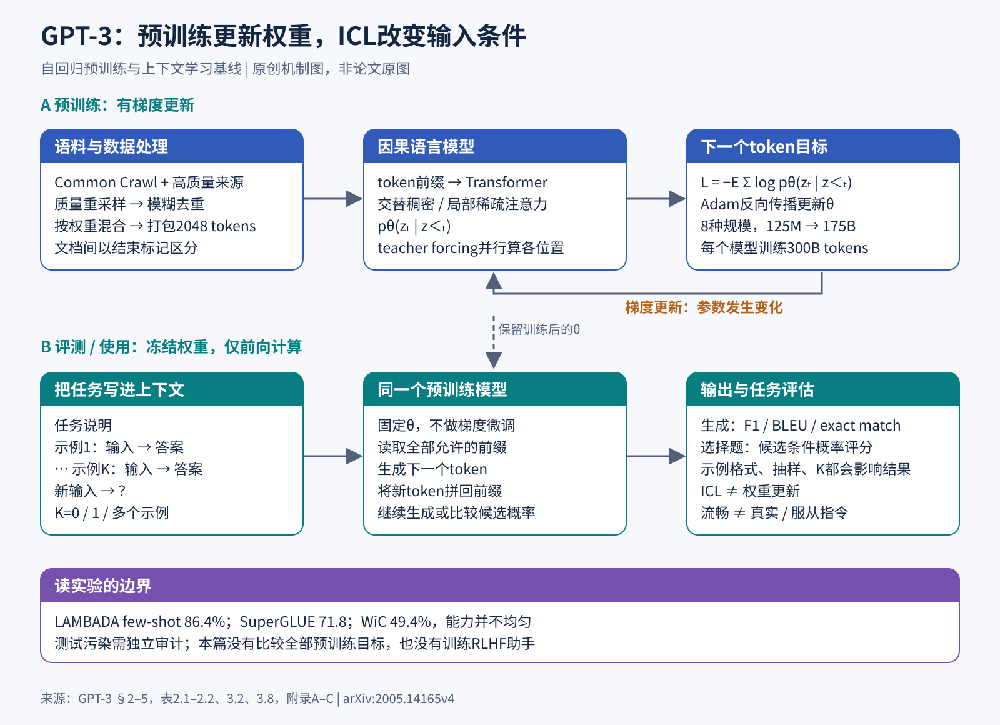

# GPT-3：把自回归语言模型做大，让任务写进提示里

> 状态：技术精读 · 原文 arXiv:2005.14165v4 · 未复现

## 一句话

Brown 等（2020，OpenAI）把 GPT-2 式的自回归语言模型放大到 175B 参数、训练 300B token，证明只在输入里放几条示例、不更新任何参数，模型就能做翻译、问答、算术等许多任务；这种用法叫上下文学习（in-context learning，ICL）。

## 它要解决的问题

2018–2019 年的主流做法是"预训练加任务微调"：先在大量文本上预训练，再为每个任务收集几千到几十万条标注样本做微调。作者列出三个代价：每个新任务都要一份标注数据集；大模型在很窄的任务分布上微调，容易抓住训练集里的伪相关，benchmark 分数会夸大真实能力；人则只需一句说明或几个例子就能做新任务。[§1]

GPT-2（1.5B）已经尝试把任务写进输入让模型续写，但效果远不及微调：Natural Questions 只有 4%，CoQA 的 55 F1 比当时最好成绩低 35 分以上。[§1，p.3–4] GPT-3 要回答：把统一的自回归语言模型扩大后，能否仅在输入里放少量示例，就完成原本需要专门微调的任务？能力怎样随规模变化？

## 核心想法

架构上几乎没有新东西，增量在规模和评测协议上。

1. **八个规模、同一份数据**。从 125M 到 175B 共八个模型，都训练 300B token，便于看能力随参数量怎样变化。
2. **三种推理设置**。zero-shot（只给任务说明）、one-shot（加一条示例）、few-shot（加 K 条示例，K 通常 10–100，受 2048 token 的上下文长度限制）。三种设置都不做梯度更新。
3. **广而不全成功的评测**。二十多类任务，既报告成功也报告失败，并专门做了测试集污染审计。

图解：上半部分是预训练（有梯度更新），下半部分是评测与使用（权重冻结，只改变输入）。[PNG 版](figures/gpt3.png)

## 机制

### 1 训练目标：下一个 token 的似然

把文本分词为 z₁,…,zₜ，自回归分解为 pθ(z)=∏ₜpθ(zₜ|z＜ₜ)。训练最小化负对数似然 L_NTP=−E_z∑ₜlog pθ(zₜ|z＜ₜ)，实现中再对有效 token 平均（这是对文中自回归训练描述的标准展开，论文没有给它编号）。因果注意力（causal attention，一句话：每个位置只能看见它之前的 token）让当前位置只利用前缀；teacher forcing（训练时每个位置都喂真实的历史 token）让一次前向就能并行算出所有位置的损失。

这个目标教模型"像训练文本那样继续写"。满足用户意图、回答真实、更受人偏好，都不在目标里。论文 §5 自己指出两点：目标对每个 token 一视同仁，没有"什么更重要"的概念；实用的助手可能更该看成采取目标导向的行动，而不只是做预测。[§5，p.33–34]

### 2 上下文学习：改变输入，不改变权重

推理时，在上下文里组织"任务说明 + K 组输入输出示例 + 新输入"，让模型续写答案。训练更新的是权重 θ；ICL 改变的是前向计算的条件和中间激活。示例可以帮助模型识别任务、确定格式、调动已有知识，也可能支持某些临时规则的归纳。[§2]

### 3 数据：质量筛选与按权重混合

训练混合物包含过滤后的 Common Crawl、WebText2、Books1、Books2 和英文 Wikipedia。表 2.2 列出的规模约 410B、19B、12B、55B、3B token，训练采样权重约 60%、22%、8%、8%、3%。权重不按数据集大小分配，少数高质量来源会被重复看到：Wikipedia 在 300B token 的训练中约过了 3.4 遍，Common Crawl 不到半遍。[表 2.2]

Common Crawl 先用一个逻辑回归分类器重采样（以高质量参考语料为正例），质量分低的文档也保留一部分，以维持分布覆盖；再做文档级模糊去重（MinHashLSH），平均减少约 10% 数据。[附录 A，p.43]

### 4 架构与训练

网络沿用 GPT-2 的主要设计（预归一化、可逆分词），各层交替使用稠密注意力与局部带状稀疏注意力。最大模型 96 层、隐藏维 12288、96 个注意力头，上下文长度 2048。规模变化同时伴随层数、宽度、学习率和批量的调整。[表 2.1，p.8]

训练把短文档以结束标记隔开、打包成 2048-token 序列。优化器 Adam（β₁=0.9、β₂=0.95），梯度全局范数裁剪 1.0，权重衰减 0.1，375M token 学习率预热后余弦下降，到 260B token 降到初始值的 10%；175B 的批量 3.2M token、学习率 6×10⁻⁵。[附录 B，p.43]

**算力的手算（示例数值）**。训练 FLOPs 近似为 6×参数量×训练 token（前向约 2PD、反向约 4PD）：6 × 175×10⁹ × 300×10⁹ ≈ 3.15×10²³。附录 D 给出的 175B 训练量约 3.14×10²³ FLOPs，同样忽略了占比较小的注意力计算。用同一公式算 13B 模型，约 2.3×10²²，是 175B 的约 1/13。

### 5 评测怎样打分

选择题比较各个候选补全的条件概率，多数任务按 token 数归一化；ARC、OpenBookQA、RACE 还除以"只给答案前缀时"的无条件概率做校正。自由生成按任务用 F1、BLEU 或 exact match，beam 宽 4、长度惩罚 0.6。[§2.4，p.10]

**归一化为什么会改变答案（示例数值）**。候选 A 有 2 个 token，总 log 概率 −3.0；候选 B 有 6 个 token，总 log 概率 −6.0。按总和选 A（−3.0 > −6.0）；按每 token 平均，A 为 −1.5、B 为 −1.0，选 B。同名的 few-shot 分数，换一种打分方式就可能换一个答案，所以复现时分词、提示格式、示例抽样和打分规则都要固定。

## 证据：哪个实验支撑哪个主张

| 主张 | 支撑实验 | 怎么读 |
|---|---|---|
| few-shot 能接近或超过微调基线 | LAMBADA 准确率 zero/one/few-shot：76.2% / 72.5% / 86.4%（表 3.2） | one-shot 反而下降；few-shot 同时换成了填空格式，增益不全来自示例数量 |
| 闭卷问答随示例增加而提高 | TriviaQA 64.3%→68.0%→71.2%；Natural Questions 14.6%→23.0%→29.9%（表 3.3） | 同为问答，难度与知识覆盖差别很大 |
| 能力有明显缺口 | SuperGLUE test 平均 71.8，BERT-Large 微调 69.0，当时微调 SOTA 89.0；WiC 仅 49.4%，接近随机（表 3.8） | 判断两处用法是否相同、两句是否蕴含这类比较任务最弱 |
| 算术随位数急剧变差 | few-shot 两位数加法 100%，三位数 80.4%，五位数 9.3%（表 3.9） | 正文附近给出 80.2% 的另一表述，以表格为准 |
| 生成文本难以与人写区分 | 短新闻辨别来源的平均准确率 52%，95% 区间 49%–54%（表 3.11） | 特定受试者、提示与文章长度下的来源辨别，与内容是否真实无关 |
| 示例的收益在大模型上更明显 | 八个规模 × 三种设置；图 1.2 符号插入任务、图 3.8 SuperGLUE 改变 K | 比只看 175B 的最终分数更有解释力 |
| 污染对主要结论影响有限 | 按 n-gram 重叠构造 clean 子集重新评测（§4、附录 C） | 训练前的去重有一个过滤错误，部分重叠残留，重训成本过高；PIQA、Winograd 结果因此带星号 |

## 局限与后续

**作者在 §5 自述的局限**（p.33–34）：

- 长文本仍会语义重复、在足够长的段落里失去连贯、自相矛盾；"把奶酪放进冰箱会化吗"这类常识物理题有困难；WiC、ANLI 这类比较任务和部分阅读理解只比随机好一点。
- 只做了自回归模型，没有双向架构或去噪目标，可能在填空、回看比较两段内容、读长文后给短答案的任务上吃亏。
- 预训练目标的根本限制：每个 token 等权；任务只能硬塞成预测问题；没有视频、物理交互等其他经验的接地。作者列出的出路包括**从人类那里学习目标函数、用强化学习微调**、加入图像等模态。
- 预训练的样本效率低；few-shot 到底是在推理时从零学会新任务，还是认出训练中见过的任务，并不清楚。

**站在现在看，后续工作修补了什么：**

- **指令微调把 few-shot 变成 zero-shot**。FLAN（Wei 等 2021，[Finetuned Language Models Are Zero-Shot Learners](../arxiv-2109.01652/README.md)）把 137B 模型在 60 多个用指令模板描述的 NLP 任务上微调，在 25 个评测任务中的 20 个上超过 zero-shot 的 175B GPT-3。`[判断]` GPT-3 需要精心挑选的示例才能调动的能力，用少量指令数据微调就能在普通请求下稳定出现；示例的作用很大一部分是"告诉模型要做什么任务"，对应 §5 中"认出任务"那一端。
- **人类反馈把"像训练文本"改成"像人想要的回答"**。[InstructGPT](../instructgpt/reading.md) 正是 §5 所列"从人类学习目标函数 + 强化学习微调"的实现：1.3B 的 InstructGPT 在人类偏好评测中胜过 175B GPT-3。`[判断]` 下一词目标与用户意图之间的差距，靠后训练而不是继续放大预训练来补，这成为此后所有对话模型的标准分工（见[预训练方向](../../fields/pretraining/README.md)"预训练与后训练的分工"一节）。
- **300B token 对 175B 参数太少**。Chinchilla（Hoffmann 等 2022，[Training Compute-Optimal LLMs](../../../cross-domain/papers/arxiv-2203.15556/README.md)）指出当时的大模型明显训练不足，模型规模和训练 token 应同比例扩大；与 Gopher 同算力、70B 参数、4 倍数据的 Chinchilla 在大量下游任务上全面超过 Gopher（280B）和 GPT-3（175B）。GPT-3 自己在图 2.2 写明，依据 Kaplan 等的规模定律，它"用比通常少得多的 token 训练大得多的模型"。`[判断]` 这个"固定 300B token、只扩参数"的设计让它的规模曲线混入了训练不足，后来的开源模型（如 [DeepSeek LLM](../arxiv-2401.02954/README.md)）都先拟合规模定律再定数据量。
- **多步推理靠提示里的中间步骤**。思维链提示（Wei 等 2022，[Chain-of-Thought Prompting](../arxiv-2201.11903/README.md)）在示例里写出中间推理步骤，540B 模型只用 8 条这样的示例就在 GSM8K 数学应用题上达到当时最好，超过微调过的 GPT-3 加验证器。`[判断]` GPT-3 在五位数加法上 9.3% 的失败，部分来自"直接写出答案"这一格式；把中间计算写出来，后来又被[测试时计算](../test-time-compute/reading.md)和推理模型发展成主线。
- **污染审计成为评测纪律**。GPT-3 的过滤错误与 clean 子集方法，被后来的技术报告沿用为标准步骤；[DeepSeek LLM](../arxiv-2401.02954/README.md) 还发现选择题数据能刷高 MMLU 却不提升生成式问答，说明 benchmark 分数与能力之间的口径问题在 GPT-3 之后只多不少。

## 批注

**易误读**

- few-shot 指在上下文里放示例，评测时没有任何参数更新（§2）；它与"拿几条样本做梯度微调"的 few-shot 微调是两件事。
- 175B 是八个模型中的最大一个，论文的规模结论来自全部八个模型（表 2.1）。
- "训练 300B token"不等于 300B 不重复的原始文本：高质量来源被重复采样，Common Crawl 只用了不到一遍（表 2.2）。
- 局部带状稀疏注意力是注意力模式上的稀疏，与稀疏激活的专家模型（MoE）无关（§2.1）。
- 八个模型之间同时改了层数、宽度、学习率和批量，规模曲线不是"只改一个参数"的对照（表 2.1）。
- 示例的作用可能是标签映射、输出格式或新规则，论文没有区分；作者在 §5 明确把"从零学会还是认出任务"列为未解决的问题。
- 图 1.3 的 42 个准确率任务汇总，作者自己说明不是含义统一的 benchmark；把它读成"规模让一切能力稳步增加"会漏掉 WiC、ANLI 和个别 one-shot 退化。
- 污染审计中，文本重叠不必然泄露答案（阅读理解可能只见过背景文章）；去掉重叠后分数近似不变，也不能严格证明没有记忆，因为 clean 子集的难度可能变化。表 C.1 用了不同的 ICL 抽样种子，与主表不是同一次实验（附录 C）。非合成任务的 n-gram 长度 n 取数据长度分位数并限制在 8–13，不是一律 13-gram。
- 附录 D 的 3.14×10²³ FLOPs 是作者的估算，不是账单，也不能换算成通用的训练价格。
- §6 对性别、族群与宗教偏见的分析，作者承认方法和维度有限。

**与其他论文的关联**

- `[历史]` 架构来自 [Transformer](../transformer/reading.md) 的 decoder 部分，经 GPT-2 的预归一化改造；`[判断]` GPT-3 之后通用大模型几乎全部收敛到 decoder-only，原因之一是目标从固定任务的 benchmark 变成开放生成与少样本泛化（见[预训练方向](../../fields/pretraining/README.md)）。
- `[历史]` [InstructGPT](../instructgpt/reading.md) 以 GPT-3 为底座，用 SFT、奖励模型和 PPO 把它训练成助手；它的 GPT-3 基线就是本文的 175B 模型，并与"加了精心设计 few-shot 提示的 GPT-3"对比。
- 本文的规模曲线固定了训练 token，Chinchilla 与 [DeepSeek LLM](../arxiv-2401.02954/README.md) 的规模定律改为同时调参数量与数据量。
- 多次采样再筛选的用法从 GPT-3 式的采样生成延伸到[测试时计算](../test-time-compute/reading.md)；监督微调的数据格式与损失掩码见 [SFT 方向](../../fields/posttraining/sft/README.md)。

**未核实 / 待验证**

- 未复现任何 175B 结果。最小机制验证可以用一个小型开源因果模型：固定模型，改变 0/1/8 个示例；再固定 K，打乱标签或调换示例顺序，记录 exact match 及方差，用来确认 ICL 发生在输入条件而不是参数更新，并观察提示敏感性。
- 数值出处与页码见[证据档案](evidence.json)；机制图源文件见 [SVG](figures/gpt3.svg)。
