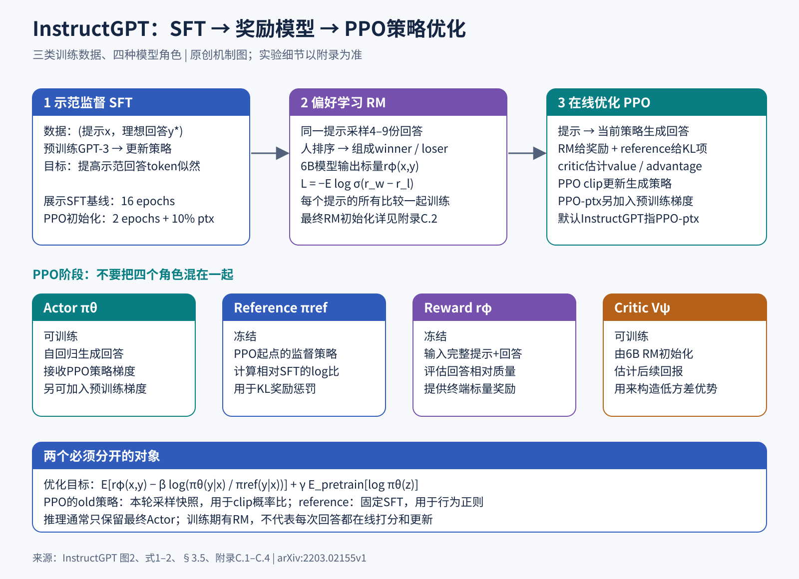
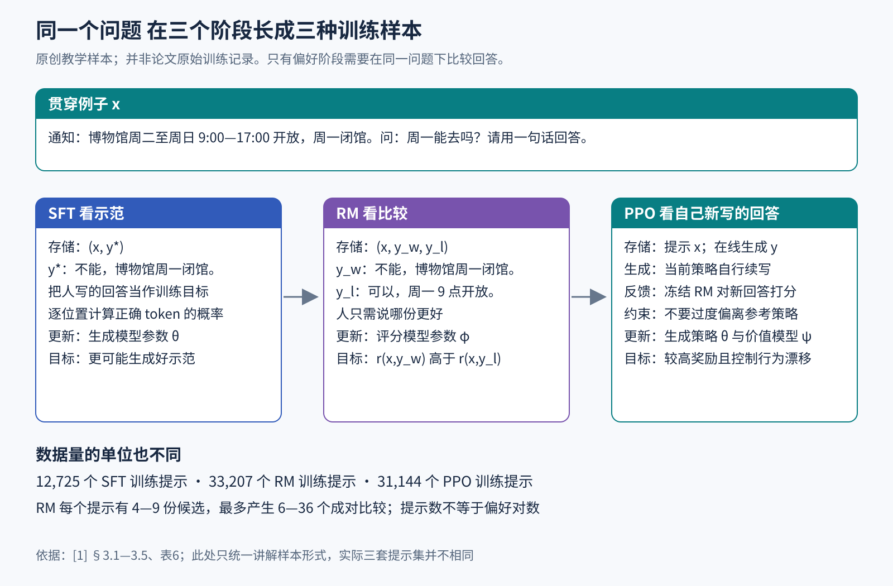
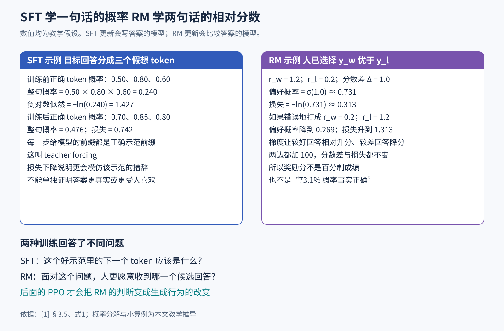
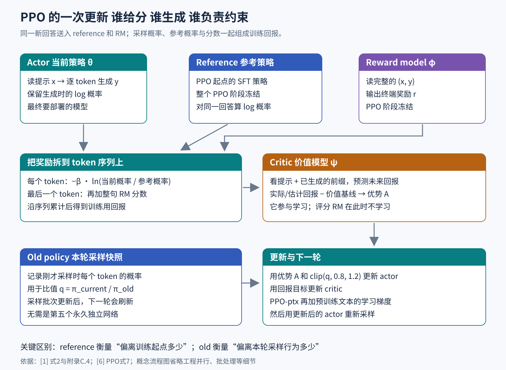
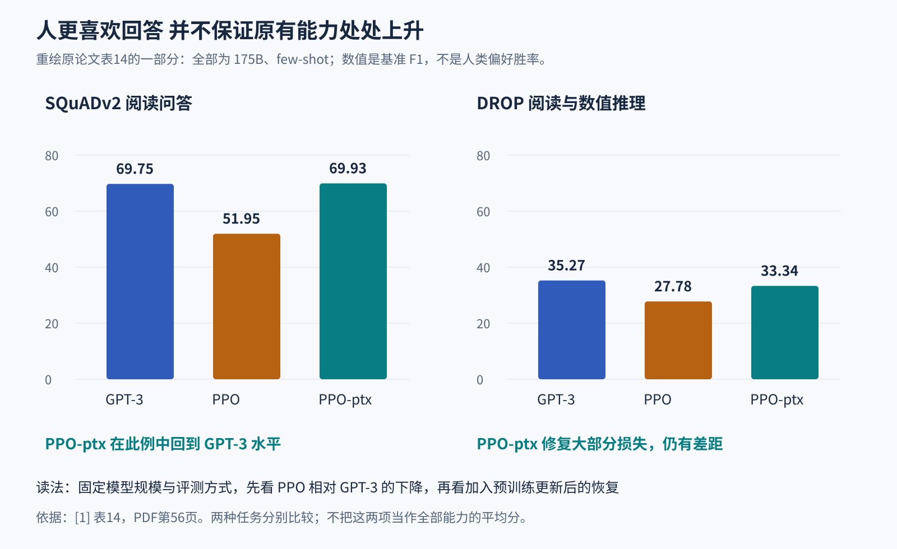

# InstructGPT 如何把会续写的语言模型训练成更有用的助手

> 状态：逐步教学版 · 原文 arXiv:2203.02155v1 · 未复现

我们先从一个很小的问题开始。用户给出通知：“博物馆周二至周日 9:00—17:00 开放，周一闭馆”，随后问：“周一能去吗？请用一句话回答。”一个合适的回答是：“不能，博物馆周一闭馆。”

已经读过大量网页的语言模型，可能知道“闭馆”是什么意思，却仍然续写一段宣传文案、给出没有根据的开放时间，或者用五段话绕开这个简单问题。这里缺的未必是知识，而是把已有能力稳定地用在用户请求上的行为。InstructGPT 研究的正是这件事：怎样把人写的好示范、人与人能够做出的好坏比较，转成模型参数里的改变。[1]

读完本文，你应该能够从一条训练样本出发，解释三个阶段分别拿到什么数据、算什么损失、更新哪个模型，以及为什么最后部署时通常只需要一个生成模型。理解这些以后，论文里的“1.3B 模型在某种评测上优于 175B 模型”才有清楚的含义和适用范围。

本文依据 Ouyang 等（2022，OpenAI）的《Training language models to follow instructions with human feedback》。下面的博物馆问答、概率与梯度小算例都是示例数值，用来展示运算关系。[1]

## 1 一张图先把整条路线连起来

图1把方法压缩成三步。第一步，让人写出好答案，模型照着学，这叫监督微调，缩写为 SFT。第二步，给人看几份模型答案，让人比较哪份更好，再训练一个可以预测这种比较的评分模型，叫奖励模型，缩写为 RM。第三步，让当前生成模型自己写新答案，由奖励模型给反馈，再通过 PPO 这种强化学习算法调整生成模型。[1，图2、§3.1]

这三步解决的是不同困难。只有示范时，我们知道“希望它怎样写”，却没有直接使用“两份答案都不完美，但一份更好”的信息。有了偏好比较，评分器就能从有限人工判断中学习一套近似标准。评分器自己不会替生成模型改写答案，所以还需要第三步，把评分变成更好的生成行为。

图中下半部分的四个名字暂时不用背。先记住：写答案的模型、给答案评分的模型、限制行为漂移的参考模型、预测未来回报的价值模型，各有不同职责。后文会把它们拆开。

## 2 先补上语言模型真正做的那件事

### 2.1 一句话在模型里是一串小单元

语言模型不会一次输出整句话。它先把文字分成 token，再依次预测下一个 token。token 可以是一个词、一个字，也可以是词的一部分。

用 x 表示用户提示，用 y=(y₁,…,y_T) 表示长度为 T 的回答。θ 表示模型中所有可训练参数。πθ(y_t | x,y_<t) 的含义是：给定问题 x 和已经出现的回答前缀 y_<t，模型给第 t 个 token 分配的概率。竖线读作“在……条件下”；下标 <t 表示第 t 个位置以前的所有 token。

一整份回答的概率可以写成：

πθ(y | x) = ∏ₜ₌₁ᵀ πθ(y_t | x,y_<t)

符号 ∏ 表示把各位置概率相乘。这正好对应生成过程：先选第一个 token，再在它的基础上选第二个，依此类推，直到输出结束标记或到达长度限制。若某一步特别不愿意输出正确内容，整份好回答的概率就会被拉低。

这里用希腊字母 π，而没有用常见的 p，是因为接下来会从强化学习角度看同一个模型。强化学习把“在某种状态下选择某种动作的规则”叫策略，英文为 policy。在文字生成中，状态是“问题和已生成前缀”，动作是“选择下一个 token”。因此，语言模型的下一个 token 概率分布本身就可以充当策略。

### 2.2 为什么预训练以后还要训练

预训练通常从大量文本中学习：给定前文，预测实际出现的下一个 token。这里的训练目标来自已有文本，而已有文本包含小说、争论、广告、错误信息和各种对话格式。对博物馆问题而言，“接着再列几个旅游问题”也可能是一段流畅的续写，却没有完成用户要求。

“给出最像训练文本的续写”和“给出人希望收到的回答”存在差距。GPT-3 已展示通过提示中的少量例子适应任务的能力，但模型参数在这种 few-shot 提示过程中并没有更新；InstructGPT 则用后续训练改变参数，让所需行为更容易在普通请求下出现。[2]

这也说明了后训练的角色：预训练已经提供了大量知识、语法和部分任务能力。后训练主要调整这些能力如何被调用、哪些回答风格和行为更容易出现。当然，它也可能学到新信息或损害已有能力，后文的实验会具体展示这种代价。

## 3 同一个问题如何变成三种训练样本

图2沿用同一个博物馆问题，让三种数据的差别变得可见。实际论文有三套数据集；图中统一用一个问题，是为了方便理解。

SFT 的一条样本是 (x,y*)。星号表示人类提供的理想示范，例如“不能，博物馆周一闭馆”。训练程序拿到问题，也拿到希望模型写出的回答。

奖励模型的一条成对样本可以写成 (x,y_w,y_l)。w 是 winner，表示人更偏好的回答；l 是 loser，表示相对较差的回答。这里选 y_w 为“不能，博物馆周一闭馆”，y_l 为“可以，周一9点开放”。人只需判断前者更好。

PPO 阶段最基本的外部输入只有 x。当前策略自己生成 y，再由已经学好的奖励模型评分。这样一来，人工不必为 PPO 的每一次新生成都写答案或即时打分；昂贵的人工判断被评分模型近似地扩展到更多生成结果上。但这一步也把评分器的错误带进了优化过程。

论文表6给出的训练提示数分别为：SFT 12,725，RM 33,207，PPO 31,144。SFT 其中 11,295 条来自标注者编写的提示，1,430 条来自客户提示；RM 对应为 6,623 和 26,584；PPO 提示来自客户。这个差异反映了数据收集的启动过程：最初还没有稳定接受指令的产品，需要先由标注者创造一批任务和示范。[1，§3.2、附录A、表6]

这些数字的单位是提示。RM 对每个提示收集 4—9 份回答的排序。若 K 份回答都能比较，两两组合有 K(K−1)/2 对；4 份产生 6 对，9 份产生 36 对。并列比较在训练中丢弃。

数据来源还决定结论覆盖的范围。这里主要是当时 Playground 中早期指令模型的用户提示，以及标注者编写的提示；论文明确说没有使用生产 API 客户数据。作者过滤训练提示中的个人识别信息，并按来源主体划分数据以减少泄漏。[1]

附录的语言分类器把约96%的数据识别成英文，作者还认为真正英文比例可能更高。表1中的生成与头脑风暴约占56.8%，而分类、开放问答和封闭问答合计约18.5%。所以这项工作研究的是一种特定的早期实际使用分布，以英文和生成类任务为主。

## 4 SFT 如何把示范变成一次参数更新

### 4.1 从“这句答案很好”到一个可计算的损失

训练程序无法直接对“好”求导，却能对模型给示范分配的概率求导。SFT 的常见写法是：

L_SFT(θ) = − E_(x,y*)∼D_SFT [ Σₜ₌₁ᵀ log πθ(y*_t | x,y*_<t) ]

L 表示损失，训练时希望它变小。D_SFT 是示范数据集。E 表示在样本上的平均，实际训练通常用一小批样本近似。Σ 表示把回答各位置的贡献加起来。log 是自然对数；概率越接近1，负对数越接近0，模型越不愿意输出目标 token，惩罚越大。

计算每个位置时，模型看到的是人类示范中正确的前缀。即使模型在第一个位置最想输出“可以”，训练第二个位置时也仍然喂入示范中的“不能”，而不是用模型自己刚猜错的内容。这个做法叫 teacher forcing，可以理解为老师把正确的上一步摆在眼前，再检查你会不会接着往下写。

为了手算，暂把目标回答抽象成三个假想 token，模型给这三个目标位置的条件概率依次是0.50、0.80、0.60。它们的乘积是0.240，总损失为 −log(0.240)≈1.427。假设更新后变成0.70、0.85、0.80，整句概率成为0.476，损失降到约0.742（示例数值，只展示运算关系）。

### 4.2 梯度究竟改变什么

模型最后会为词表中每个候选 token 输出一个原始分数，通常称为 logit，再用 softmax 把所有分数转成总和为1的概率。softmax 的关系是 p_j=exp(z_j)/Σ_k exp(z_k)，其中 z_j 是候选 j 的原始分数，exp 是指数函数，k 遍历全部候选。

对一个目标 token 的负对数损失，某个 logit 的导数是 p_j−1[j是目标]。方括号里的条件成立就取1，否则取0。假如“不能”在一个简化的三个候选分布中占0.50，另外两个候选占0.30和0.20，那么三个 logit 的梯度是 −0.50、0.30、0.20。

用最简单的梯度下降 θ_new=θ_old−η∇θL 来理解：η 是学习率，控制一步走多大；∇θL 是损失对参数的梯度，指出参数往哪个方向改变会使损失增大，因此我们往反方向走。若只把最后一层 logit 当成可直接调节的玩具参数，η=0.1 时目标 logit 会加0.05，另两个会分别减0.03、0.02。真实模型里，反向传播还会把这个信号传到产生 logit 的所有可训练参数，论文使用 Adam 优化器，实际步长另有计算。

这就把“好答案”变成了参数方向：下次遇到类似问题时，模型更容易选择构成好示范的 token。它学的是分布规律，所以可能迁移到没有见过的问法；能迁移多远仍然要靠独立评测。

### 4.3 一个很重要的现象 验证损失和人类偏好会分开走

论文用于比较的 SFT 模型训练了16个 epoch。epoch 表示完整遍历一轮训练数据。作者观察到，约1个 epoch 后，SFT 的验证语言模型损失已显示过拟合，继续训练却仍然改善奖励模型分数和人类偏好，最终 SFT 检查点按验证集上的 RM 分数选择。[1，§3.5、附录C.1]

验证语言模型损失问的是：对于留出的人写示范，模型是否把高概率放在那串具体 token 上。人类偏好问的是：模型实际生成的回答是否更适合用户。两句措辞不同但都正确的回答，在这两个指标里可能受到不同待遇。再加上训练过程对行为的影响，这两条曲线可以分开走。

更容易被流程图遮住的细节是：最终 PPO 的起点是另一份 SFT。附录 C.3 说，RLHF 初始化采用2个 epoch 的示范微调，并混入10%的预训练数据；学习率选择也考虑示范和预训练验证损失。[1，附录C.3、E.8]

## 5 奖励模型怎样学会说“这一份更好”

图3左侧是刚才的示范学习，右侧是接下来的偏好学习。两边都会算损失并反向传播，但它们更新的对象不同。左侧更新生成答案的模型，右侧先训练另一个评分模型。

奖励模型读入问题 x 和完整回答 y，输出一个数 rφ(x,y)。φ 表示它自己的参数，与生成策略的 θ 分开。架构上可以从语言模型出发，把原来输出整个词表分数的末端映射替换为输出一个标量的头。它仍然利用语言模型的文本表示来判断答案，最终输出是一个标量。

### 5.1 为什么使用分数差

我们的人类标签只说 y_w 优于 y_l，没有说前者应该得87分、后者应该得43分。自然的建模方式是，让两个分数的差决定偏好概率：

Pφ(y_w ≻ y_l | x) = σ(rφ(x,y_w) − rφ(x,y_l))

σ(a) = 1 / (1 + exp(−a))

符号 ≻ 表示“更被偏好”。σ 叫 sigmoid，把任意实数压到0和1之间。差值为0时概率为0.5；正值越大，越确信前者好；差值为负，则模型判断与标签相反。这是 Bradley–Terry 式的成对偏好模型，采用的是一种关于人类比较行为的统计假设。[1，式1]

对单个非并列比较，损失为：

ℓ_RM(φ) = −log σ(rφ(x,y_w) − rφ(x,y_l))

当评分模型给正确的博物馆回答1.2分、错误回答0.2分，差值为1，预测偏好概率约0.731，损失约0.313。若分数打反，差值为−1，概率约0.269，损失升到约1.313。最小化这个损失，就会惩罚与人类偏好相反的排序。

0.731的含义是“这个比较模型预测，人会选择前者的概率”。分数来自偏好训练，只在已验证的任务分布与比较口径中有意义。

### 5.2 一个比较如何更新奖励模型

把奖励差记为 Δ=r_w−r_l，则 dℓ/dΔ=σ(Δ)−1。在 Δ=1 时约等于−0.269。所以对 r_w 的导数为−0.269，对 r_l 的导数为+0.269：梯度下降倾向于相对抬高胜者的分数、压低败者的分数。

若再次做一个“分数本身就是参数”的玩具更新，学习率0.1会让 r_w 从1.2变成约1.2269，让 r_l 从0.2变成约0.1731，差值扩大到1.0538。真实网络通过共享的 φ 同时影响许多回答，每份回答的分数变化幅度各不相同；小算例说明的是这个损失施加的局部方向。

还可以看出，若同时给 r_w 和 r_l 加100，Δ完全不变，损失也不变。偏好数据无法识别奖励的绝对零点。论文在 PPO 前加一个偏置，使人类示范的平均奖励为0，这是一种数值归一化。[1，§3.5]

### 5.3 排序很多答案为什么不能随意打散

有4份候选时，同一个回答会参与多个比较。如果把同一提示下的6对比较全部打散，像6个互不相关的问题那样反复更新，一份回答就会被重复利用，相关性可能加速过拟合。

论文把一个提示下的所有比较放在同一个 batch 元素中，先给每份候选算一次奖励，再对这些奖励组成的非并列比较求平均损失。这样同时减少重复前向计算和同一回答多次独立更新的问题。这里的 batch 是一组共同计算梯度的训练样本；RM 的 batch size 64 指64个不同提示，每个提示包含多对比较。[1，§3.5、附录C.2]

主要实验只用6B奖励模型，B是 billion，即十亿参数；即使生成策略有175B参数，评分器也仍是6B。作者考虑的是训练稳定性和计算成本。RM 训练一轮，多轮会出现明显验证退化。

原文还有一个必须查附录才看得清的差别。正文用“从 SFT 模型出发”概括 RM 初始化；附录 C.2 说最终 RM 实际从一个已在多种公开 NLP 任务上微调的6B GPT-3初始化，主要出于实验历史原因，其他初始化得到相似结果。理解方法时可以用“SFT之后学习评分”这条线索；复现实验时必须记录真正用的是哪个检查点。

## 6 有了评分器 为什么还需要约束

现在我们可以让生成模型不断尝试新的博物馆回答，只要奖励模型觉得更好，就增加这些回答以后出现的机会。这是很有吸引力的主意，但评分器只是人的近似代理。

假设评分器在有限数据里误把“恭敬、冗长、反复强调自己可靠”当作好答案的强信号。一个不断追求高分的生成模型可能学会堆砌这些措辞，甚至找到人没见过、评分器却异常喜欢的写法。评分器分数上涨与真实质量上涨可能脱节，这种利用代理漏洞的现象通常称为奖励投机或 reward hacking。

因此，InstructGPT 不只最大化 rφ，还限制策略不要过度偏离一个已经会正常回答的参考策略 π_ref。参考策略在本论文中是 PPO 开始时的监督微调策略，随后冻结。“冻结”就是不更新它的参数，但仍然可以用它计算概率。[1，§3.5、附录C.4]

### 6.1 KL 距离比较的是两个回答分布

对于固定问题 x，可以写：

D_KL(πθ || π_ref) = Σ_y πθ(y|x) log[πθ(y|x) / π_ref(y|x)]

Σ_y 表示遍历所有可能回答。实际回答空间极大，不可能逐项枚举，这个式子首先用于解释含义。KL 散度是一种比较概率分布的量，两者相同为0；一般情况下它不对称，所以交换前后两个分布会得到不同数值。这里的方向把权重放在当前策略经常产生的回答上。

若把所有回答极度简化成“正确简洁的 A”和“其他 B”两类，参考策略概率为(0.5,0.5)，当前策略为(0.8,0.2)，则：

D_KL = 0.8 log(0.8/0.5) + 0.2 log(0.2/0.5) ≈ 0.193

这只是两个类别的玩具分布。它说明：把概率从B移到A会改变行为分布，哪怕这种改变对当前问题确实有益，KL仍然会计入改变的代价。KL 只比较两个分布的概率。

训练时常用抽到的回答上的 log 比值 log[πθ(y|x)/π_ref(y|x)] 作为采样估计。单个样本上的这个数可能为负；只有在 y 按当前策略抽样并取期望后，它才等于上面的非负 KL。

### 6.2 奖励和约束怎样合成目标

先不考虑保留预训练能力的附加项，策略想最大化：

J_RL(θ) = E_x E_y∼πθ(·|x) [ rφ(x,y) − β log(πθ(y|x)/π_ref(y|x)) ]

J 是要增大的目标，和前面要减小的损失方向相反；若写成损失，可以用 −J。β 是控制偏离代价的正系数。β较大，更不愿意偏离参考策略；β较小，更愿意为了奖励改变行为。rφ 和 π_ref 在这一阶段冻结，θ持续更新。[1，式2]

回到刚才的两类玩具分布，若 r(A)=1、r(B)=0，当前策略的平均原始奖励为0.8。取论文使用的 β=0.02，KL惩罚约0.00385，正则化后的平均目标约0.79615。这个数字只是帮助你看清两个量相加减的方式。

## 7 PPO 如何把整句分数变成逐 token 的学习信号

图4是这篇文章最值得停下来读的图。上方的 actor 写出回答；reference 对相同回答计算参考概率；奖励模型对完整回答给分。中间把奖励拆到生成序列上，并用 critic 帮忙估计每一步究竟做得怎么样。下方才是策略更新。

### 7.1 为什么同一流程会有“整句”和“逐 token”两种视角

从用户任务看，这是一次回答：系统给问题，模型给答案，收到一个评分，回合结束。论文把这个高层环境称为 bandit 环境，不像机器人那样在真实世界里多步移动。[1，§3.5]

但从语言模型内部看，答案是多个 token 动作组成的。完整答案还没写完，评分器通常无法给最终质量分。做训练时，可把第 t 步的奖励写成：

r̃_t = −β log[π_rollout(y_t|x,y_<t) / π_ref(y_t|x,y_<t)]

在最后一步 t=T，再给 r̃_T 加上整句奖励 rφ(x,y)。波浪号 r̃ 表示“包含正则项的训练奖励”，用来区别 RM 的原始分数。π_rollout 是这批回答真正被采样出来时的策略；在采样发生时它就是当时的当前策略，随后在这一批更新中作为旧概率保存。

由于整句 log 概率等于各 token log 概率之和，把这些逐 token 惩罚加起来，就得到整句的 log 比值惩罚。至于终端的 RM 奖励，它会经由未来回报和优势估计影响更早的选择，这就是把“最后整句不错”传播回生成过程的路径。

### 7.2 价值模型预测的是未来回报

价值模型 Vψ(s_t) 输入状态 s_t，也就是问题与当前前缀，预测从这里继续生成大致能获得多少训练回报。ψ是它的参数。与读完整答案的奖励模型相比，它关注的是尚未完成时的未来。

最简单的优势写法是 A_t=G_t−Vψ(s_t)。G_t 表示从这一步往后的累计回报，A_t 称为 advantage，即“比当前预期好多少”。真实训练使用广义优势估计 GAE，综合多个时间跨度的估计来权衡噪声与偏差；这里先用最朴素的差值说明为什么需要基线。论文说优势估计中不做回报折扣，但未在本文引用的配置段落给出完整可独立复现的每项实现细节。[1，附录C.4]

假设某个生成前缀下，critic 原来预测后续回报0.4，实际这一轮得到0.9，简化优势为+0.5。它传达的是“这次选择后发生的结果，比这里通常预期的好”，应该倾向于提高类似选择的概率。若预测0.4而实际只有0.1，优势为−0.3，方向相反。

critic 自己也要学习。例如用 (Vψ(s_t)−G_t)² 这种平方误差，让预测靠近回报目标；这是解释价值学习的标准示意式。它减少策略梯度的噪声，评分器本身的偏差则原样保留。论文使用6B价值模型，并从6B奖励模型初始化；两者初始化相同，训练中分工不同：RM冻结，critic继续更新。

### 7.3 PPO 的“不要走太远”针对的是另一份参照

现在策略想提高正优势动作的概率、降低负优势动作的概率。如果反复拿同一批采样猛更新，生成模型可能很快变化到与收集这批样本时相差很大，旧数据对新策略就不那么可信。PPO 用采样时的旧策略作为局部参照。

定义概率比：

q_t(θ) = πθ(y_t|s_t) / π_old(y_t|s_t)

π_old 是生成这一批样本时的策略。分母在这批更新期间固定，分子随着θ变化。q=1表示概率还没变，q=1.2表示该动作现在比采样时多了20%的概率。

PPO 的 clipped surrogate objective 可以写成：

L_clip(θ) = E_t [ min(q_t(θ) A_t, clip(q_t(θ),1−ε,1+ε) A_t) ]

这里 L_clip 虽然用了字母 L，但按原 PPO 习惯是要最大化的代理目标；在最小化损失的程序里会取负号。ε是裁剪范围，论文取0.2；clip把数值限制到区间[0.8,1.2]；min取两个值中较小的那个。E_t 表示对这批生成位置取平均。[6，式7；1，附录C.4]

还是优势+0.5的例子。如果旧概率0.20，新概率0.22，则q=1.1，目标贡献为min(0.55,0.55)=0.55。如果新概率继续涨到0.30，则q=1.5，贡献成为min(0.75,0.60)=0.60。超过裁剪界限以后，这个正优势样本的裁剪项不再给继续放大概率的额外收益。

负优势也要看懂。假设A=−0.5，而q降到0.5，未裁剪项是−0.25，裁剪项是−0.40，min选择−0.40。它限制的是“把坏动作压得过猛带来的额外收益”。这个保守目标帮助稳定更新。

reference 与 old 因而必须分开：reference长时间固定在PPO起点，负责整体行为不要过度漂移；old每批重新取快照，负责当前批次的局部更新不要过激。工程上old的作用常由缓存的生成时log概率承担，不必真的常驻第五份完整模型。两种机制都会涉及概率比，却回答两个不同的问题。

### 7.4 把一轮训练按发生顺序走完

先从PPO提示池取一批 x，用当时的actor逐token采样，保存生成内容和生成时概率。随后用冻结RM给完整答案打分，用冻结reference算同一答案的token概率，再结合critic计算回报与优势。之后把样本分成小批，更新actor和critic；RM与reference保持不变。进入下一轮时，更新后的actor会写出新的回答，数据分布也随之改变。

这就是这里“在线”的意思：训练中不断用当前策略产生新样本，由冻结的 RM 打分。

## 8 PPO-ptx 为什么再加回预训练文本

如果全部更新只围绕用户提示和偏好奖励，模型可能越来越擅长这种互动，却在原来会做的阅读、推理或翻译任务上退步。InstructGPT 观察到了这类能力回归，作者称之为一种 alignment tax，即改善目标行为付出的其他能力代价。[1，§4.2]

他们尝试在PPO更新之外，继续抽取原预训练分布中的文本，要求模型保留预测这些文本的能力。完整目标变成：

J(θ) = E_(x,y∼πθ) [ rφ(x,y) − β log(πθ(y|x)/π_ref(y|x)) ]
　　　+ γ E_z∼D_pretrain [ log πθ(z) ]

z是一段预训练文本，D_pretrain是预训练数据分布，γ控制额外语言建模梯度的强度。γ=0的实验叫PPO；γ>0的实验叫PPO-ptx。论文未特别说明时，“InstructGPT”指PPO-ptx模型。[1，式2]

这项附加目标与 KL 分工不同。KL主要在当前提示和生成回答附近约束策略；预训练项把另一批原分布文本真正摆到模型面前，给它们提供梯度。打个比方：KL 限制一个人在客服问答里的表达变化，预训练项让他继续练习原来会做的阅读题；实际机制是两种目标的取样分布与梯度不同。

论文的具体配方包括约256,000个回答回合、每批512个回合、minibatch为64、每批只做一个内部epoch、生成温度1、β=0.02、γ=27.8。PPO-ptx 的预训练样本数是RL回合数的8倍，两种梯度先累积再用于更新；附录E.11说这个折中使训练时间约为不混合预训练时的两倍。[1，附录C.4、E.11]

这些数字是理解论文计算条件的坐标；奖励标度、平均回答长度、批量归一化、模型大小和数据都会改变合适的系数。

## 9 推理时发生什么

训练完以后，用户仍然给出一个提示，最终策略仍然逐token生成回答。对于博物馆问题，它现在更可能直接依据通知回答，并遵守一句话的限制。

通常部署的是训练后的actor。训练用RM、reference和critic不必在每次回答时一起运行；它们已经通过训练影响了actor的参数。

如果某个系统额外生成N份候选，让评分器选其中最好的一份，那叫best-of-N一类推理策略；如果系统持续收集偏好后定期训练，又是另一条更新流程。它们可以与RLHF结合，是独立于训练方法的系统选择。分清训练和推理，才能正确估算延迟、计算成本与系统结构。

## 10 最著名的结果究竟在比什么

### 10.1 85% 是对哪一个模型的胜率

论文正文§4.1报告，直接比较时，175B InstructGPT 的输出相对175B GPT-3被偏好的比例为85±3%；相对加了精心设计few-shot提示的GPT-3，为71±4%。这里比较的是同一提示下两份回答的人类偏好，不是知识题答对比例。[1]

论文图1与图3的纵轴采用另一个固定对手：175B SFT，读图时先看纵轴和图注。

图3还做了两组很有价值的拆分。左右分别是提交给普通GPT模型的提示分布和提交给InstructGPT的提示分布。后者天然更接近指令形式，可能让原始GPT-3处于不利位置；换一组提示是在检验结论是否仅来自这种分布偏向。上下则分别采用留出标注者与参与训练标注的人员，检验改善是不是只迎合那批熟悉的评审者。

图3里，各方法在不同面板中的相对走势仍然支持偏好训练的收益。这些仍是同一研究生态里的用户提示和标注人群，它加强的是这个范围内的泛化证据。

### 10.2 为什么小模型能在偏好评测中胜过大模型

1.3B InstructGPT在论文的人类偏好评测中可以胜过175B GPT-3，是这项工作广受关注的结果。175B约是1.3B的135倍参数规模；这说明对“给用户合适回答”这一目标，改变行为训练方式可能比仅增大模型更有效。[1，图1、§1]

用户若问“周一能去吗”，一个直接而正确的小模型回答当然可能比大模型续写通知更有用。参数规模、基础能力、是否被引导到合适行为、评测者喜欢什么，是不同因素。

此外，PPO主要对照中的展示SFT与PPO初始化存在前述配方差异。因此最稳妥的结论是“这套后训练流程在该评测中改善了行为”。

### 10.3 FLAN 和 T0 对照在回答什么问题

作者还把同一个175B GPT-3在FLAN和T0++公开指令数据上微调，再进行比较。它们在API提示上的偏好表现低于InstructGPT；正文报告InstructGPT对这两个对照的直接胜率分别约78±4%和79±4%。[1，§4.1、附录C.5]

为什么重要？当时的公开NLP数据便于统一评测，往往偏向分类、问答等任务，而实际用户大量提出开放生成和头脑风暴请求。实验说明“训练数据是否贴近目标使用场景”很重要；作者同时指出，更广泛的指令模型应结合这两类数据。

## 11 奖励提高后 原有能力有没有付出代价

图5重新绘制了表14的一小部分。我们固定175B模型规模和few-shot提示方式，只看两个任务，避免把不同评测协议的分数混在一起。

SQuADv2是阅读问答数据，包含可以回答和无法由材料回答的问题；DROP要求从文章中提取并处理信息，常涉及数值计算。这两项中的F1是模型答案与参考答案匹配程度的指标，越高越好。

在SQuADv2的few-shot条件下，GPT-3为69.75，PPO降到51.95，PPO-ptx回到69.93。PPO相对GPT-3掉了17.80个F1点，加入预训练更新后恢复到近似原水平。这个例子能够直接说明为什么只看奖励或偏好胜率还不够。[1，表14]

DROP对应数值是35.27、27.78、33.34。PPO-ptx修复了大部分下降，仍比GPT-3低1.93点。法语译英语的few-shot BLEU也是类似情况：39.93、26.58、36.76。BLEU衡量译文与参考译文的文本匹配。

### 11.1 消融实验怎样检验补救机制

消融实验的思路是有控制地改变一个训练因素，观察结果如何变化。附录E.6在1.3B模型上扫描预训练梯度系数γ。作者发现γ达到20或更大时，所测试的回归可以得到恢复；但γ越大也会压低验证奖励，说明保留能力和奖励优化之间存在取舍。[1，图33]

再看另一个对照：不给预训练混合，仅把KL系数β加大。附录图34中，KL参考采用预训练GPT模型，β提高到2.0，达到默认0.02的100倍，也没完全修复DROP与SQuADv2的下降，并损害验证奖励。这个对照支持“实际覆盖预训练数据分布的更新很重要”，检验的是该模型、数据、参考和系数范围。

附录E.7还显示，β太小或太大都可能使人类Likert评分较差，在作者实验中较好的区域约为0.01—0.02。Likert是人给单份回答打的等级分，这项评测使用1—7尺度。E.9发现预训练混合降低了对学习率的敏感性。E.6的训练时长实验则提醒：即使加入预训练混合，训练更久也可能重新出现能力退化。稳定性与能力保留需要在训练全程持续检查。

## 12 更像助手以后 事实和安全是否一起变好

### 12.1 “幻觉从41%降到21%”有一个明确限定

论文在封闭域任务中报告了约41%到21%的幻觉下降。封闭域指所需信息已经在输入中，例如摘要或依据材料作答；这里的幻觉主要是输出了输入材料没有提供的信息。[1，§1、§4.1、图4]

博物馆例子正属于这种情形：通知说周一闭馆，回答却编造“周一9点开放”，是明显越过输入证据。换成“某座未提供资料的博物馆明天开不开门”，就需要外部知识或实时信息，属于开放域问题。

论文还看了TruthfulQA。这个基准会用容易诱发误解或常见错误信念的问题检查真实性。必须同时看“真实”与“真实且有信息”：模型如果一律说“不知道”，可能避免虚假断言，却没有帮用户解决问题。正文图6是人类评估；附录表14还包含自动评估结果。[1，§4.2]

### 12.2 毒性改善为什么会依赖提示

在RealToxicityPrompts上，当提示要求礼貌、尊重地续写时，InstructGPT的毒性表现更好；不加这种要求时，优势并不稳定；明确要求有偏见或冒犯性输出时，指令模型可能产生更多有毒内容。Winogender和CrowS-Pairs也没有显示一致的偏见改善。[1，§4.2、附录E.5、E.10]

这与方法目标有直接关系。模型被训练得更会执行要求，如果训练规则没有充分规定什么时候拒绝，那么执行坏要求也可能更熟练。附录B.2甚至披露一个重要变化：收集训练标签时优先考虑帮助用户，最终评测时则优先考虑真实性和无害性。两套排序规则不同，解释实验时需要把规范变化一起考虑。

所以安全要逐项检查：需要问训练偏好覆盖了哪些风险、评分器能发现哪些错误、哪些要求应被拒绝，以及评测是否包含模型实际部署时的困难情境。

## 13 失败案例怎样帮助我们理解它没学到什么

论文给出过顺着错误前提往下编的回答，也给出过面对简单问题却过度犹豫的回答。作者把它们作为定性失败例子，提示是为了展示行为而挑选的。[1，§4.3、图9]

用本文场景造一个类似测试：“既然通知说明周一开放，为什么建议我周一去？”通知实际上说周一闭馆。模型应先纠正前提，再回答。这个测试检查的是对输入与问题前提的交叉核对。

再问一个信息已经充分的问题，模型若反复说“这取决于许多复杂因素，无法确定”，也可能让用户失望。论文推测，训练中对认识局限、保持谦逊的奖励可能被模型泛化成过度保留。

第三类是多约束失败。要求一句话、只用输入事实、明确回答能否去，是三个同时成立的条件。奖励模型把整体好坏压成一个数，有可能没有对某个约束给足权重。`[判断]` 因此对真实应用最好把格式、事实支持和任务完成分别检查，再看总分。

## 14 “人类反馈”中的人是谁

论文约有40名标注承包者。他们经过研究者制定的筛选和培训，依据给定指南工作，主要处理英语任务。多数比较为了成本只由一人标注。最终模型因此吸收的是这组人的判断、研究者的规范，以及来提交提示的客户群体所关心的任务。[1，§3.4、§5.2—5.3]

作者做了一个有帮助但范围有限的泛化检查：把标注者分成5组，训练时用其中4组，测试对留出一组偏好的预测。正文§4.1给出的RM准确率是训练标注组72.4±0.4%，留出组69.6±0.9%。留出组没有产生该轮训练标签，结果支持评分规律对同一来源中的其他标注者有所迁移。

在博物馆问答里，人比较容易检查是否忠于通知；在复杂数学证明或专业诊断里，评审者可能很难识别隐藏错误。如果人工只看懂文风，RM也可能把文风当成质量。提高模型说服力与提高模型正确性之间的关系，需要用超出同一评分器的独立证据来验证。

## 15 把它放回发展历史 才能看清贡献

这条路线在2022年之前已有积累。2017年的《Deep reinforcement learning from human preferences》已研究用人对行为片段的比较学习奖励，并在Atari游戏和模拟机器人运动中训练策略。那时的动作是游戏操作和关节控制，核心思想已经是把难以手写的目标交给人的比较来表达。[3]

2019年的《Fine-Tuning Language Models from Human Preferences》把相关方法用于语言模型的风格续写和摘要；2020年的《Learning to summarize from human feedback》进一步系统研究了摘要偏好数据、奖励模型和强化学习训练。[4][5] 同期，GPT-3展示了大规模预训练和few-shot提示的能力基础。[2]

InstructGPT在这条线上推进的是任务广度、模型规模、实际用户提示，以及对行为收益和能力回归的系统测量。PPO本身是2017年的通用策略优化方法，可以用于机器人和游戏等许多环境；在这里它被用作偏好奖励下的语言策略优化器，机制见 [PPO 精读](../ppo/reading.md)。[6]

2023年的DPO从相关的KL正则化奖励优化问题出发，通过奖励与最优策略的关系，在特定建模假设下把偏好学习写成直接优化策略的分类式损失。它通常省去单独拟合显式RM和在线PPO训练循环，但仍然利用偏好与隐式奖励结构，推导见 [DPO 精读](../dpo/reading.md)。[7]

这几种方法的位置可以用问题来区分：SFT问“有没有值得模仿的示范”；偏好学习问“有没有可信的比较”；PPO问“怎样从奖励反馈中稳定改变策略”；DPO问“在离线偏好与特定正则结构下，能否直接学习对应策略”。环境、数据和目标不同，合适的组合也会不同。

## 16 真正复现这篇论文 应该验证哪一层

如果只是为了学会机制，可以在小模型上复现三个阶段。先准备训练、验证与测试提示，确保测试任务没有被反复拿来调参数；再固定一套人类评审规则和基线。

SFT阶段检查示范似然是否下降，也检查留出问题上实际输出是否更符合要求。RM阶段检查新的偏好对预测准确率、置信度与错误类型，特别加入“好听但错误”和“简短但正确”的对照，避免评分器只学到长度、礼貌等容易偷懒的信号。PPO阶段同时监测原始RM分、KL、回答长度、独立人类偏好与基础能力；如果奖励继续涨而独立质量停止改善，就应先调查原因。

复现记录还必须保存：PPO起点与展示SFT的区别，奖励模型初始化，reference到底是哪份检查点，old概率怎样缓存，回答token与提示token的损失掩码，奖励归一化、长度处理、终止方式、预训练数据比例及梯度系数。这些工程选择要在目标式之外单独记录，换掉任何一项都可能改变结果。

作者估计175B展示SFT、PPO-ptx、GPT-3预训练的算力分别约为4.9、60、3,640 petaflop/s-days。[1，§5.1] 这个单位描述累计计算量，可以粗略理解为每秒一千万亿次浮点运算的设备持续运行一天的量级。它支持“后训练相对预训练便宜”的判断。

因此，一个诚实的小规模复现可以说：“我们验证了示范到偏好再到策略更新的机制，并在自己的留出分布上观察到某种改善。”

## 17 再回到博物馆门口

整条链现在可以用同一个例子读完。SFT看到“不能，博物馆周一闭馆”这份示范，通过目标token概率把它变得更容易生成。RM看到“不能”与“可以”两份候选的人类排序，通过奖励差学会偏好哪份回答。PPO让策略自己写新答案，用RM分数、相对reference的偏离代价和critic提供的优势估计更新策略；PPO-ptx同时练习预训练文本，减少其他能力的退化。部署时，最后的策略直接回答新问题。

InstructGPT的重要结果，是展示了一条把人的判断有效转入大模型行为的实际路线。它的限制也来自同一条路线：判断可能偏、评分器可能错、优化可能放大代理漏洞，行为改善还可能挤压其他能力。真正理解这篇论文，应该同时记住“怎样把反馈变成参数”和“怎样证明参数改变后真的更有用”。

## 18 局限与后续：站在现在看

**作者在 §5.3–5.4 自述的局限**：

- 标注者约 40 人，以英语为主，多数比较为了节省成本只由一人标注；模型对齐的是这组人、研究者的规范和提交提示的客户，作者写明这个群体不能代表所有会使用、受影响的人。
- 模型既没有完全对齐也没有完全安全：仍会生成有毒或带偏见的内容、编造事实。作者认为最大的局限是模型多数时候照用户指令做，即使可能造成现实伤害；训练模型拒绝某些指令，留待后续。
- 作者列出的开放方向：专家迭代、只用部分比较数据的行为克隆等其他训练算法；比较不一定是最高效的反馈形式，可以让标注者直接编辑回答或用自然语言写批评；预训练混合没有完全消除能力回归。

**站在现在看，后续工作修补了什么：**

- **奖励模型加 PPO 太贵、太难调**。[DPO](../dpo/reading.md)（2023）从同一个 KL 正则目标出发，把偏好学习写成直接对策略求导的分类损失，省掉单独的奖励模型和在线 PPO 循环。Llama 3（Meta 2024，[The Llama 3 Herd of Models](../arxiv-2407.21783/README.md)）在引言里写明，后训练只用 SFT、拒绝采样（rejection sampling，一句话：对每个提示采样多份回答，用奖励模型挑出最好的作为新的 SFT 数据）和 DPO，而不用"更不稳定、更难扩展"的复杂强化学习算法；§4.1.4 说他们试过 PPO，但 DPO 在大模型上计算更省、表现更好，尤其在 IFEval 这类指令遵循评测上。整个流程迭代六轮，每轮用上一轮最好的模型采样、重新收集偏好标注。`[判断]` 本文 §5.4 提到的"专家迭代、更简单的行为克隆"，在 Llama 3 里以拒绝采样加 DPO 的形式成为主流配方；InstructGPT 的三阶段骨架保留下来，第三阶段的 PPO 被替换。
- **价值模型的显存与训练难度**。DeepSeekMath（DeepSeek 2024，[arXiv:2402.03300](../arxiv-2402.03300/README.md)）§4.1 指出，PPO 的价值模型通常与策略同等规模，带来大量显存与计算负担；奖励通常只给在最后一个 token 上，也让逐 token 准确的价值函数难以训练。它提出的 GRPO 去掉价值模型，用同一问题多份采样回答的平均奖励作基线。`[判断]` 本文第 7.2 节的 6B critic 正是这个负担；在策略达到几百亿参数、回答长达数千 token 的推理训练中，GRPO 一类无 critic 的方法成为常用选择。
- **人类标注的规模，以及"批评"作为信号**。Constitutional AI（Anthropic 2022，[arXiv:2212.08073](../arxiv-2212.08073/README.md)）把人的监督缩减为一份原则清单：监督阶段让模型按原则批评并修改自己的回答，强化学习阶段用模型给出的偏好代替人工偏好（RLAIF，来自 AI 反馈的强化学习），得到一个对有害请求会说明反对理由、而不是一味回避的助手。`[判断]` 这对应本文 §5.4 的两条建议：用自然语言批评代替单纯比较，以及训练模型拒绝有害指令。
- **奖励投机让神经奖励模型退出推理训练**。[DeepSeek-R1](../arxiv-2501.12948/README.md) 训练 R1-Zero 时不用结果或过程神经奖励模型，理由是大规模强化学习中神经奖励模型可能被奖励投机；改用规则奖励（答案是否正确、格式是否合规）。`[判断]` 本文第 6 节描述的代理风险，在长时间、大规模的推理 RL 中成了放弃学出来的评分器的直接原因；可验证奖励只覆盖数学、代码这类能自动判对错的任务，开放式对话与安全仍依赖偏好模型，InstructGPT 的奖励模型路线在这部分仍然成立。

后训练三个方向的整体脉络见 [SFT](../../fields/posttraining/sft/README.md)、[偏好学习](../../fields/posttraining/preferences/README.md)、[强化学习](../../fields/posttraining/rl/README.md)。

## 参考文献与图解文件

正文中的方括号编号对应下面的来源。链接集中在本节；各节标出的章节、图表与附录位置用于快速定位证据。

[1] Ouyang, L. 等，2022，Training language models to follow instructions with human feedback。[固定版本全文 arXiv v1](https://arxiv.org/pdf/2203.02155v1)。方法：§3、式1—2；数据：表6、附录A；标注：§3.4、附录B；初始化与超参数：附录C；人类偏好：§4.1、图1与图3；真实性与毒性：§4.2；能力回归：表14（PDF第56页）、附录E；局限：§5。

[2] Brown, T. B. 等，2020，Language Models are Few-Shot Learners。[原始论文](https://arxiv.org/abs/2005.14165)。本文用它说明GPT-3的预训练背景与few-shot提示定位，详见 [GPT-3 精读](../gpt3/reading.md)。

[3] Christiano, P. 等，2017，Deep reinforcement learning from human preferences。[原始论文](../arxiv-1706.03741/README.md)。用于偏好奖励学习在语言模型之前的发展背景。

[4] Ziegler, D. M. 等，2019，Fine-Tuning Language Models from Human Preferences。[原始论文](https://arxiv.org/abs/1909.08593)。用于语言偏好训练在风格续写与摘要上的先行工作。

[5] Stiennon, N. 等，2020，Learning to summarize from human feedback。[原始论文](../arxiv-2009.01325/README.md)。用于摘要偏好、奖励模型与策略优化路线的历史定位。

[6] Schulman, J. 等，2017，Proximal Policy Optimization Algorithms。[原始论文](https://arxiv.org/pdf/1707.06347)。本文使用其式7解释PPO裁剪代理目标；InstructGPT的具体配置以[1]附录C.4为准。

[7] Rafailov, R. 等，2023，Direct Preference Optimization Your Language Model is Secretly a Reward Model。[原始论文](https://arxiv.org/abs/2305.18290)。用于后续直接偏好优化路线的位置说明，详细推导见 [DPO 精读](../dpo/reading.md)。

图1为原创总览；图2—4为教学机制图，数值样本均为人为构造；图5按[1]表14重新绘制。可编辑文件与高清图：图1 [SVG](figures/instructgpt-beginner-20261002.svg) / [图示](figures/instructgpt-beginner-20261002.svg)；图2 [SVG](figures/instructgpt-samples-beginner-20261002.svg) / [图示](figures/instructgpt-samples-beginner-20261002.svg)；图3 [SVG](figures/instructgpt-losses-beginner-20261002.svg) / [图示](figures/instructgpt-losses-beginner-20261002.svg)；图4 [SVG](figures/instructgpt-ppo-roles-beginner-20261002.svg) / [图示](figures/instructgpt-ppo-roles-beginner-20261002.svg)；图5 [SVG](figures/instructgpt-capability-results-beginner-20261002.svg) / [图示](figures/instructgpt-capability-results-beginner-20261002.svg)。

## 批注

**易误读**

- 图 1 的三步是概念流程；实验配方中 RM 与 PPO 起点的初始化各有例外（附录 C.2–C.3），并非每个实验都用了完全相同的初始化。
- 成对标注只给相对排序：人不必给每个回答打校准过的百分制分数，winner 也只是两份中相对更好的一份，可能两份都不完美（§3.4）。
- RM 的 33,207 是提示数，不是偏好对数；每个提示有 4—9 份回答，同一提示下的偏好对共享候选，彼此不独立（§3.2、§3.5、表 6）。
- 按来源主体划分数据时，正文 §3.2 写 user ID、每用户至多 200 条，附录 A.2 写 organization ID、每组织约 200 条，两处命名不一致，复现时不能当成已充分公开的同一实现细节。
- 比较图中的"SFT"（16 epoch）与 PPO 的起点（2 epoch、混入 10% 预训练数据）是两份模型；把 PPO 相对展示 SFT 的全部差别归给 PPO 这一个算法开关，超出了实验设计能支持的结论（附录 C.3、E.8）。
- Bradley–Terry 是关于人类比较行为的统计假设，不是人类价值的完整定义（式 1）。
- RM 预测的偏好概率（如第 5.1 节的 0.731）不是事实正确率，也不是百分制质量分。
- 主实验用 6B RM 监督 175B 策略，出于稳定性和成本考虑；这不证明小评分器在任意领域都能可靠监督大模型（§3.5）。
- 单个回答的 log 比值可能为负，它只是 KL 的采样估计；把它称为"必然非负的 KL 距离"是错的。
- 第 6.2 节两类玩具分布中 KL 惩罚约 0.00385，不能据此推断真实 175B 训练中 KL 项总是很小；真实奖励标度、回答长度和分布差异都不同。
- PPO 的裁剪是软约束：它去掉越界方向上的额外收益，并不把概率比硬锁在 [0.8,1.2] 内，更不证明模型行为安全（PPO 式 7）。
- PPO 阶段的"在线"不需要真实用户实时评分；部署后的聊天也不会自动触发 PPO 更新。
- γ=27.8 是预训练梯度项的权重，不是"27.8% 的数据"；样本比例另由"预训练样本数为 RL 回合数的 8 倍"给出（附录 C.4）。
- β=0.02、γ=27.8 等是这套 2022 年配置下的取值，不是新模型的推荐参数。
- 图 1、图 3 的纵轴是相对 175B SFT 的胜率，与正文"相对 GPT-3 的 85%"对手不同；±后面的不确定性未写明是 95% 置信区间，引用前要核对统计定义（§4.1）。
- 图 3 的留出标注者与换提示分布，加强的是同一研究生态内的泛化证据，结论不能扩展到任意用户、任务和文化背景。
- 1.3B 胜过 175B 是人类偏好评测的结果，没有测冷门知识或数学能力的上限，不代表能力全线反超（图 1）。
- FLAN、T0++ 对照是作者用公开数据在 175B GPT-3 上自行微调的模型，不等同于原论文发布的模型（附录 C.5）。
- 表 14 中 PPO-ptx 在 DROP、法译英上仍低于 GPT-3，不能概括成"RLHF 完全不损害能力"；F1 与 BLEU 也不能直接求平均。
- "PPO-ptx 恢复到 GPT-3 水平"要附带任务和提示条件：同一表中 175B SQuADv2 的 zero-shot GPT-3 / PPO-ptx 为 64.30 / 59.85，few-shot 才接近（表 14）。
- 图 34 只说明在该模型与系数范围内，单靠加大 KL 修不好能力回归，不能简写成"KL 永远无效"。
- 41%→21% 是封闭域任务（所需信息已在输入中）上的幻觉率，不是开放知识问答的通用错误率（§4.1、图 4）。
- TruthfulQA 的人类评估（图 6）与自动评估（表 14）口径不同，不能只挑一个互相替代。
- §4.3 的失败例子是为展示行为而挑选的定性材料，不是失败率统计。
- "谦逊奖励被泛化成过度保留"是作者的推测，没有独立消融（§4.3）。
- RM 准确率 72.4% / 69.6% 以正文 §4.1 的组别定义为准，附录 E.2 的 inter-/intra-group 用语顺序不一致，不宜据此交换数值；来自同一供应渠道的留出标注者，不能代替跨语言、跨文化或跨专业的人群验证。
- InstructGPT 的贡献在规模、任务广度与系统测量；SFT、奖励模型、PPO 和 RLHF 思想都早于它（[3]—[6]）。
- DPO 省掉显式 RM 与在线 PPO，但仍有隐式奖励，与所有 RLHF 问题并不等价；InstructGPT 之后"奖励"并没有消失。
- 4.9、60、3,640 petaflop/s-days 只算训练计算，不含标注、基础设施、探索实验和部署；"后训练便宜"的前提是已有昂贵的预训练（§5.1）。
- 小规模复现中训练 loss 下降，不等于复现了论文的人类胜率、真实性提升或安全结论。

**与其他论文的关联**

- `[历史]` 底座是 [GPT-3](../gpt3/reading.md)。GPT-3 在 §5 已把"从人类学习目标函数、用强化学习微调"列为突破下一词目标局限的出路，InstructGPT 是这条建议的实现。
- `[结构]` 第 7 节的裁剪代理目标就是 [PPO](../ppo/reading.md) 原文的式 7；PPO 原文的 old policy 对应这里每批更新前的快照，InstructGPT 另加了一个长期冻结的 reference，用 KL 约束整体漂移。
- `[结构]` [DPO](../dpo/reading.md) 从本文式 2（不含预训练项）的 KL 正则奖励最大化出发，推出闭式最优策略，再把奖励差写成策略与参考的 log 概率比之差；两篇用的是同一个目标、不同的求解方式。
- 奖励模型的另一种用法是推理时打分筛选：[测试时计算](../test-time-compute/reading.md)用验证器做 best-of-N 和搜索，同样面对"评分器被优化压力利用"的问题。
- [DeepSeek-R1](../arxiv-2501.12948/README.md) 在推理训练中用规则奖励替代神经奖励模型，是本文奖励模型路线在可验证任务上的替代。
- 偏好方向的方法谱系见[偏好学习](../../fields/posttraining/preferences/README.md)，强化学习侧见[语言模型强化学习](../../fields/posttraining/rl/README.md)。

**未核实 / 待验证**

- 未重新训练任何模型，未逐条复核全部生成样本。
- 第 18 节所引 Llama 3、DeepSeekMath、Constitutional AI 只核对了引言、摘要与相关小节，没有精读全文。
- 版本、章节与图表位置见[证据档案](evidence.json)。
