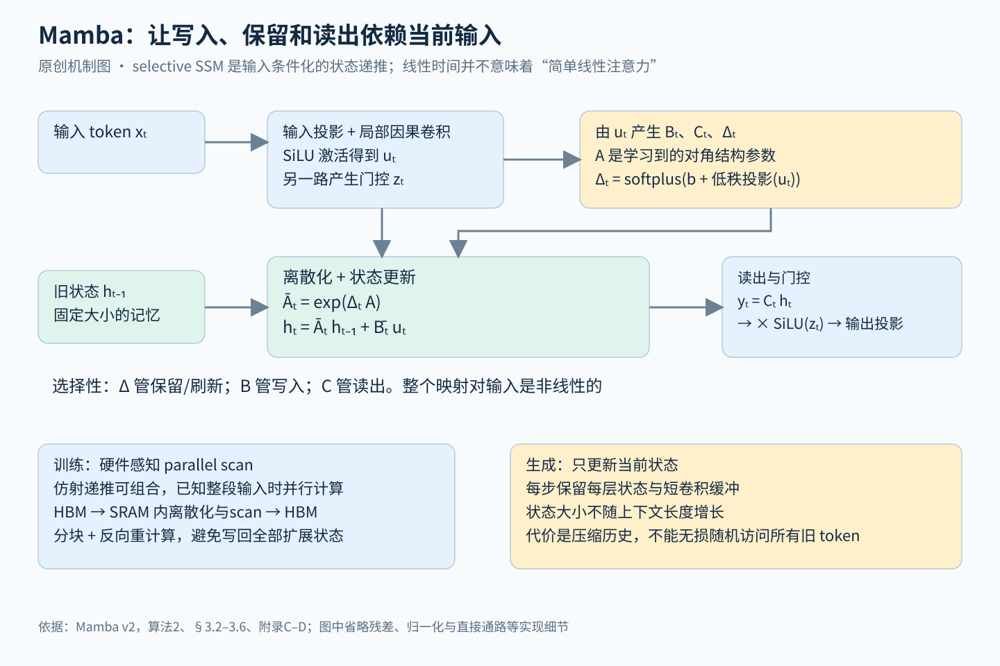

# Mamba：让状态转移随输入变化，用固定大小的状态按内容决定记住什么

> 状态：技术精读 · 原文 arXiv:2312.00752v2 · 未复现

## 一句话

Gu、Dao（2023）让状态空间模型（SSM）的步长 Δ、写入矩阵 B、读出矩阵 C 都由当前 token 算出，模型因此能按内容决定写入、保留还是遗忘；转移只依赖输入、不依赖状态，所以仍能用并行 scan 训练，再配一套面向 GPU 内存层次的融合内核把它算快。不含注意力的 Mamba-2.8B 在零样本平均准确率上超过同规模的 Pythia，并高于参数多一倍多的 Pythia-6.9B；生成吞吐约为同规模 Transformer 的 4–5 倍。

## 它要解决的问题

[Transformer](../transformer/reading.md) 生成时要缓存每个历史 token 的 K、V，缓存随长度线性增长，训练计算随长度平方增长。为此出现了许多亚二次的替代：线性注意力、门控卷积、循环网络、结构化 SSM。原文摘要的判断是，它们在语言这类重要模态上都没有达到注意力的水平，关键弱点是做不了基于内容的推理。

这个弱点在[递推状态谱系](../../../foundations/relations/recurrent-state.md)第 3 节看得最清楚：S4（Gu、Goel、Ré，[arXiv:2111.00396](https://arxiv.org/abs/2111.00396)）和 [LRU](../arxiv-2303.06349/README.md) 的状态转移是固定的对角阵，属于线性时不变（LTI）系统，好处是能写成卷积或并行 scan，代价是每个输入都以同样的方式进入状态，模型没法"看到无关 token 就跳过"。

原文 §3.1 把整件事归结为一个权衡：序列建模的根本问题是把上下文压进更小的状态。注意力完全不压缩（KV 缓存保存全部上下文），所以有效但慢；循环模型状态有限，所以快，但效果取决于状态压缩得好不好。Mamba 要回答：能否在固定大小的状态下，让压缩按内容进行？

## 核心想法

相对 S4 一类 LTI SSM，增量有三处。

1. **选择性（selection）。** Δ、B、C 成为当前输入的函数，Ā、B̄ 随时间变化。用谱系的表格说，转移从"不依赖任何量"变成"只依赖当前输入"。
2. **硬件感知的并行 scan。** 参数随时间变化后不能再用卷积，作者改在递推形式上做并行 scan，并把离散化、scan、读出融合在 GPU 的快速片上内存（SRAM）里完成。
3. **简化的块。** 把 H3 块与 MLP 块合并成一个同质的 Mamba 块反复堆叠，网络里没有注意力，也没有单独的 MLP。

消融显示第 1 项是关键：同一外围结构下，固定 SSM 换成选择性 SSM，合成任务准确率从 56.4% 升到 99.8%，语言建模困惑度从 10.93 降到 8.71（见证据表）。

## 机制

图中先看输入生成的 Δ、B、C 怎样进入状态更新，再看训练时 scan 与生成时逐步递推的区别；直接通路、残差和归一化省略。

### 1 经典 SSM：固定系数的递推

对一个输入通道，连续系统 h′(t) = Ah(t) + Bx(t)、y(t) = Ch(t)，h 有 N 维。用步长 Δ 做零阶保持离散化（一句话：假设输入在一个步长内不变）：

\[
h_t=\bar A h_{t-1}+\bar B x_t,\quad y_t=Ch_t,\qquad \bar A=\exp(\Delta A),\quad \bar B=(\Delta A)^{-1}(\exp(\Delta A)-I)\,\Delta B
\]

A 取对角结构，D 个特征通道各自独立地套用这组方程，总状态 D×N。A、B、C、Δ 不随时间变化时，展开得 yₜ = Σⱼ C Ā^{t−j} B̄ xⱼ，系数只依赖时间差 t−j，可以写成一个固定的卷积核：S4 训练时用卷积、生成时用递推，就是同一个系统的两种算法（[SSM 讲义](../../../foundations/lessons/18-ssm-gnn-moe.md)第 2.2 节）。

### 2 选择：Δ、B、C 由输入算出

算法 2 令 Bₜ = s_B(xₜ)、Cₜ = s_C(xₜ)、Δₜ = softplus(参数 + s_Δ(xₜ))，s 是线性投影；A 仍是与输入无关的可学习参数。三者分工：B 决定写进状态的哪些方向，C 决定从状态读出什么，Δ 决定保留旧状态与吸收新输入的比例。A 取负实数时，Δ 小则 Ā = exp(ΔA) 接近 1，旧状态几乎原样保留、当前输入几乎被忽略；Δ 大则旧状态被清空、聚焦当前输入（§3.5.2）。

**示例数值：选择性怎样保住一个值。** 取 N = 1 的门控形式 hₜ = (1 − gₜ)hₜ₋₁ + gₜxₜ（第 3 小节说明它就是选择性 SSM 的特例）。序列是一个要记住的 token（值 5）后面跟两个无关 token（值记为 0），h₀ = 0。

| 步 | 输入 | 选择性：g 随内容变化 | 固定门：g 恒为 0.5 |
|---|---|---|---|
| 1 | 5（要记住） | g = 0.9，h = 4.5 | h = 2.5 |
| 2 | 0（无关） | g = 0.05，h = 0.95 × 4.5 = 4.275 | h = 1.25 |
| 3 | 0（无关） | g = 0.05，h ≈ 4.061 | h = 0.625 |

固定门不区分内容，每遇到一个无关 token 就把记忆冲淡一半；选择性门在无关 token 上几乎关闭，三步后仍保住约 81% 的值。无关 token 的数量变化时，固定卷积核里"隔几步复制"的规则就失效，这正是原文 Selective Copying 任务考察的情形（§3.1，图 2）。

### 3 门控是它的特例

原文定理 1（§3.5.1，证明在附录 C）：N = 1、A = −1、B = 1、Δₜ = softplus(Linear(xₜ)) 时，选择性 SSM 的递推就是

\[
g_t=\sigma(\mathrm{Linear}(x_t)),\qquad h_t=(1-g_t)h_{t-1}+g_t x_t
\]

因为 e^{−softplus(z)} = 1 − σ(z)。**示例数值**：z = 2 时 softplus(2) ≈ 2.127，e^{−2.127} ≈ 0.119，而 1 − σ(2) ≈ 0.119。完整 Mamba 的状态维度更大（默认 N = 16），B、C 也随输入变化；表 10 显示，只有 B、C 也是选择性的时候，加大 N 才明显有用。

这一定理把 Mamba 放进了[递推状态谱系](../../../foundations/relations/recurrent-state.md)第 4 节：它与 LSTM 的耦合门形式相同，区别在于门值只依赖 xₜ、不依赖 hₜ₋₁。

### 4 scan：转移不依赖状态，所以能并行

给定整段输入后，每一步都是仿射映射 h ↦ aₜh + bₜ，其中 aₜ = Āₜ、bₜ = B̄ₜxₜ。两步合成仍是同一形式，(a₂, b₂)∘(a₁, b₁) = (a₂a₁, a₂b₁ + b₂)，且满足结合律，于是可以用并行前缀 scan 一次算出所有时刻的状态。

**示例数值**：上表的选择性序列，三步分别是 (0.1, 4.5)、(0.95, 0)、(0.95, 0)。先合并后两步得 (0.9025, 0)，再作用到第一步上得 (0.09025, 4.061)；h₀ = 0 时 h₃ = 4.061，与逐步计算一致。门值若依赖 hₜ₋₁（如 LSTM），合成就写不回这种固定形式。

算法上可并行还不够。朴素实现要把"批量 × 长度 × 通道 × 状态维"这么多个中间状态写进 GPU 显存（HBM），读写开销会吃掉收益。作者把参数读进 SRAM，在 SRAM 里完成离散化、scan 和乘 C，只把"批量 × 长度 × 通道"大小的输出写回；反向传播时重算中间状态而不保存（§3.3.2，附录 D）。在 N = 16 时，这个 scan 在序列长度超过 2K 后比 FlashAttention-2 还快，比 PyTorch 里的标准 scan 快 20–40 倍（§4.5）。

### 5 Mamba 块与生成时的状态

Mamba 块把输入维度 D 扩展 E = 2 倍，一支经短因果卷积、SiLU 激活和选择性 SSM，另一支经 SiLU 作为门，两支逐元素相乘后投影回 D 维。每块约 3ED² 个参数集中在线性投影里，两个 Mamba 块的参数量约等于一个"注意力 + MLP"的 Transformer 层（§3.4）。训练目标仍是下一词预测。

生成时，每层只需保存 SSM 的最终状态和短卷积的少量缓冲，每来一个 token 更新一次，与序列长度无关。

**示例数值：状态与 KV 缓存的大小。** 设隐藏维度为 D，Transformer 用标准多头注意力。一个 Transformer 层每个历史 token 缓存 K、V 共 2D 个数；对应的两个 Mamba 块，状态共 2 × (E·D·N) = 2 × 2D × 16 = 64D 个数（忽略卷积缓冲）。历史超过 32 个 token 后 Mamba 更省；prompt 为 2048 时，KV 缓存是 4096D，约为 Mamba 状态的 64 倍。原文 4–5 倍的吞吐优势，主要来自这份省下的显存允许更大的批量。

## 证据：哪个实验支撑哪个主张

| 主张 | 支撑实验 | 怎么读 |
|---|---|---|
| 选择性本身是关键 | 表 1，Selective Copying：Mamba 块内用 S4 为 56.4%，用选择性 S6 为 99.8%；H3 块配 S6 也达 99.7% | 换外围块影响小，换成选择性影响大 |
| Δ 最重要，三者合用更好 | 表 7，语言建模困惑度：都不选择 10.93，只选 Δ 9.81，Δ、B、C 全选 8.71 | 呼应定理 1 中 Δ 与门的对应 |
| 大状态要配合选择性才有用 | 表 10：B、C 固定时 N 从 1 到 16，困惑度 9.88 → 9.81；B、C 选择性时 9.73 → 8.71，参数只多约 1% | 能按内容使用状态，扩大状态才有回报 |
| 语言上与同规模 Transformer 竞争 | 表 3，Pile 上训练 300B token：零样本平均准确率 Mamba-2.8B 63.3，Pythia-2.8B 59.1，Pythia-6.9B 61.7 | 3B 以下规模、所列任务上的结论 |
| 合成任务上可外推到很长 | Induction Heads：训练长度 256，测试到 2²⁰ ≈ 100 万仍正确 | 特定合成任务；DNA、音频的长序列结果是另外的模态 |
| 生成更快 | 图 8 与附录 E.5：A100 80GB，prompt 2048、生成 128 个 token，批量 1–128；吞吐约为同规模 Transformer 的 4–5 倍 | 优势主要来自更大批量；6.9B 模型未训练，只用于测速 |

规模曲线的对照组 Transformer++ 采用当时最强的配方（RoPE、SwiGLU、RMSNorm、更高学习率），Mamba 是第一个在这组对照下追平它的无注意力模型（图 4）。

## 局限与后续

原文 §5 自述了三点：实验规模在 3B 以下，低于多数强开源模型，更大规模是否仍占优有待评估；微调、提示、上下文学习、RLHF 这类下游用法在 SSM 上是否同样成立，尚未研究；选择性有利于文本、DNA 这类离散模态，却可能伤害 LTI 模型擅长的连续信号，附录 E.4 的长音频实验中选择性确实带来了损失。

站在现在看，后续工作集中暴露了第二点背后的一个具体缺陷：**从上下文中精确召回**。

- **召回差距被量化。** Zoology（Arora 等，[arXiv:2312.04927](https://arxiv.org/abs/2312.04927)，与 Mamba 同月）预训练了 17 个模型，发现门控卷积类架构在 Pile 上比注意力差最多 2.1 个困惑度点，其中 82% 的差距来自"回忆前文提到过的信息"。Repeat After Me（Jelassi 等，[arXiv:2402.01032](../arxiv-2402.01032/README.md)，ICML 2024）证明两层 Transformer 能复制长度随头数指数增长的字符串，而固定状态的模型无法准确复制比状态比特数更多的内容；在预训练模型上做"电话簿查号"，Pythia 在各个规模上都明显好于 Mamba。
- **规模化之后差距仍在。** NVIDIA 的 Waleffe 等（[arXiv:2406.07887](https://arxiv.org/abs/2406.07887)，2024）在同样数据上训练了 8B 的 Mamba、Mamba-2 和 Transformer（最多 3.5T token）：纯 SSM 在许多任务上持平或更好，但在 5-shot MMLU、电话簿查号这类需要复制或上下文学习的任务上落后；电话簿超过约 500 个 token，Mamba 与 Mamba-2 就开始答错，Transformer 在 4096 的训练长度内接近全对。作者观察到 SSM 的答案常与正确号码相近，称之为"模糊记忆"：信息被压进了状态，但取不回原样。AI21 的 Jamba（[arXiv:2403.19887](../arxiv-2403.19887/README.md)）也发现纯 Mamba 在 IMDB 等少样本任务上常不遵守答案格式，作者推测与 SSM 难以形成 induction head 有关。
- **混合架构成为主流答案。** Mamba-2（Dao、Gu，[arXiv:2405.21060](../arxiv-2405.21060/README.md)，ICML 2024）把 A 从对角阵进一步简化为标量乘单位阵，借矩阵乘法单元让核心层比 Mamba 快 2–8 倍、状态可放大 8 倍以上；同文的实验中，约 10% 的层换成注意力效果最好，作者的解释是 SSM 层做一般的序列变换，注意力层充当检索机制，不必把全部上下文压进状态。Jamba 每 8 层放 1 层注意力并加 MoE（52B 总参数、12B 激活，支持 256K 上下文）；Waleffe 等的 8B Mamba-2-Hybrid 由 43% Mamba-2 层、7% 注意力层、50% MLP 层组成，12 项标准任务全部超过同规模 Transformer（平均高 2.65 分），长上下文生成预计快近 8 倍。Kimi 的 [Kimi Linear](../arxiv-2510.26692/README.md) 与 [K3](../arxiv-2607.24653/README.md) 用的是带逐通道遗忘门的线性注意力，同样保留四分之一的全注意力层（[预训练方向](../../fields/pretraining/README.md)"问题与手段"③）。

`[判断]` 原文 §3.1 的权衡（高效要小状态，有效要状态装下全部必要信息）在后续工作里被证实是硬约束：选择性提高了压缩质量，却改变不了"固定大小状态取不回任意旧细节"这一点。业界的回应是在递推层之间保留少量注意力层负责精确检索，Mamba 的选择性递推则作为大部分层的默认部件留了下来。

## 批注

**易误读**

- Mamba 与线性注意力在递推视角上相通，但 Δ、B、C 随输入变化，整体输入输出映射是非线性的；它也不计算 softmax 注意力的近似（附录 B.3–B.4）。
- "百万长度"的证据来自合成任务、DNA 和音频，不等于百万 token 的自然语言检索（表 11、图 5–7）。
- 4–5 倍吞吐包含更大批量的贡献，不是单请求延迟快 5 倍；附录 E.5 的训练显存对比也不是处处更省。
- 定理 1 只覆盖 N = 1 的退化情形，完整 Mamba 的表达能力来自更大的状态与选择性 B、C 的组合。
- 原文 §3.5.2 指出，选择性 SSM 可以在拼接的样本边界上把状态重置（Δ 趋于无穷），而 LTI 模型会让前一个样本的信息渗进来；这是模型能学会的能力，数据管线仍应显式隔离样本。
- 表 3 的对照模型与 Mamba 用相同数据和分词器，但各实现的成熟度不同。

**与其他论文的关联**

- [递推状态谱系](../../../foundations/relations/recurrent-state.md)第 4 节是本篇的位置：转移随输入变化、不随状态变化，因而既能按内容选择又能并行 scan。本页核实过的 Mamba-2（A 简化为标量乘单位阵）可作为该页第 4、5 节之间的新节点，那一页目前把它列在"未核实"里。
- [LRU 文献卡](../arxiv-2303.06349/README.md)：同一谱系的上一节点，固定转移、靠参数化保证稳定；本篇附录 B.3 引用了它，两篇共享作者 Albert Gu。
- [注意力与 FFN 的分工谱系](../../../foundations/relations/attention-ffn-division.md)：Mamba 块把 H3 块与 MLP 块合并为一个同质块，灵感来自把注意力与 MLP 合并的 GAU（原文 §3.4、附录 B.2）。后来的混合架构又把少量注意力层放回来专做检索，与该页"注意力负责从上下文读取"的分工一致。
- [Transformer 精读](../transformer/reading.md)：本篇针对的 KV 缓存与平方成本来自那里；[DeepSeek-V2 精读](../deepseek-v2/reading.md)的 MLA 走的是另一条路，保留每个历史位置、只压缩每个位置的表示。
- [Kimi Linear](../arxiv-2510.26692/README.md)：线性注意力一支的近期节点，作者同样写明长上下文检索是纯线性结构的主要瓶颈。

**未核实 / 待验证**

- Zoology 只核实了摘要；RWKV、RetNet、H3 原文未打开。
- Mamba-2 的混合实验数字（350M、48 层）只核实了"约 10% 注意力层最好"的结论句，表格未逐项核对。
- 数值出处与页码见[证据档案](evidence.json)；许可见 [ATTRIBUTION.md](ATTRIBUTION.md)；机制图见 [SVG](figures/mamba-mechanism.svg)。
