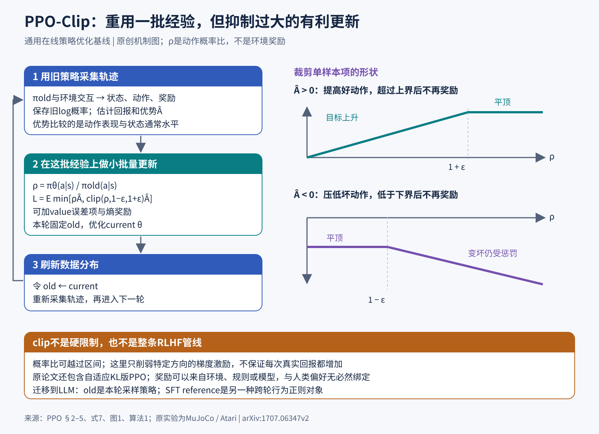

# PPO：用裁剪概率比，让同一批经验可以安全地多学几轮

> 状态：技术精读 · 原文 arXiv:1707.06347v2 · 未复现

## 一句话

Schulman 等（2017）把策略梯度的目标改写成"新旧策略的概率比 × 优势"，再把概率比裁剪在 [1−ε, 1+ε] 附近：好动作的概率提高够了、坏动作的概率压低够了，就不再给激励。这样同一批采样数据可以做多轮小批量梯度更新，而策略不会一步走得太远。

## 它要解决的问题

强化学习的基本循环是：策略与环境交互，收集状态、动作、奖励，再据此更新策略（状态、策略、优势、策略梯度的基础见 [强化学习讲义](../../../docs/foundations/05b-reinforcement-learning.md) 第 4–5 节）。PPO 之前有两种代表做法：

- **普通策略梯度**：每批数据只做一次梯度更新。数据来自旧策略，若在同一批数据上反复优化 log 概率目标，更新会过大，策略可能突然变坏。所以样本利用率低。
- **TRPO**（信赖域策略优化，一句话：每次更新都要求新旧策略的平均 KL 散度不超过一个阈值）：更新稳定，但约束优化需要二阶近似，实现复杂。

PPO 要回答：能否只用一阶优化器（如 Adam），得到 TRPO 那样"每步不走太远"的稳定性，同时让每批数据被多用几轮？

## 核心想法

把"不要离旧策略太远"从**约束**改成**目标函数的形状**。

定义概率比 ρₜ(θ) = π_θ(aₜ|sₜ) / π_old(aₜ|sₜ)（原文记作 rₜ(θ)，这里用 ρ 避免与奖励 r 混淆）。π_old 是采集这批数据时的策略，在本轮优化中冻结；优化开始时 ρ = 1。PPO-Clip 最大化：

L_CLIP = E[ min( ρₜ Âₜ, clip(ρₜ, 1−ε, 1+ε) Âₜ ) ]

其中 Âₜ 是优势估计（一句话：这个动作比该状态下的平均水平好多少，正数表示好于平均），ε 是裁剪阈值，常用 0.2。取 min 使这一项成为未裁剪代理目标 ρₜÂₜ 的保守下界。[§3，式 7]

为什么必须"不走太远"？代理目标 E[ρₜÂₜ] 用旧数据评估新策略：比值 ρ 校正了"在同一个状态下选这个动作的概率变了多少"，但状态 sₜ 本身是旧策略走到的。新策略离旧策略越远，它实际会访问的状态就越不像这批数据，代理目标也就越不能代表真实回报。把 ρ 留在 1 附近，就是让这批数据在本轮优化期间一直"够用"。这也是 PPO 仍然按"采样 → 有限几轮更新 → 重新采样"组织训练的原因。

增量全部在这个目标函数上；数据收集、优势估计、网络结构都沿用当时的标准做法。论文同时给出一个自适应 KL 惩罚的版本作为对照，实验中弱于裁剪版。

## 机制

### 1 裁剪按优势的符号分两种情况（示例数值）

取 ε = 0.2，即比值的"免费区间"为 [0.8, 1.2]。

**Â > 0（好动作）**：目标随 ρ 上升，直到 1.2 后变平。

- Â = 2，ρ = 1.4：未裁剪 2 × 1.4 = 2.8，裁剪后 2 × 1.2 = 2.4，取 min 得 2.4。目标对 ρ 的梯度为 0，这个样本不再推动 ρ 继续上升。
- Â = 2，ρ = 0.7：未裁剪 1.4，裁剪后 2 × 0.8 = 1.6，取 min 得 1.4。用的是未裁剪项，梯度照常存在，会把这个好动作的概率拉回来。

**Â < 0（坏动作）**：目标在 ρ 低于 0.8 后变平。

- Â = −2，ρ = 0.6：未裁剪 −1.2，裁剪后 −2 × 0.8 = −1.6，取 min 得 −1.6。梯度为 0，坏动作已经压得够低，不再继续压。
- Â = −2，ρ = 1.3：未裁剪 −2.6，裁剪后 −2 × 1.2 = −2.4，取 min 得 −2.6。用未裁剪项，梯度照常把这个坏动作的概率往下压。

规律是：**朝有利方向走过头时，梯度归零；朝有害方向偏离时，惩罚照常生效**。min 的作用就在这里，只把 ρ 夹在 [0.8, 1.2] 会漏掉第二和第四种情况。

### 2 优势怎么估计（示例数值）

论文用广义优势估计（GAE，一句话：把多步时间差分误差按 (γλ) 的幂次加权求和）的截断形式：

δₜ = rₜ + γ V(sₜ₊₁) − V(sₜ)，Âₜ = δₜ + (γλ) δₜ₊₁ + (γλ)² δₜ₊₂ + …（求和截至本段轨迹末端）

V(s) 是价值网络（critic）对状态 s 后续回报的估计。γ 是折扣因子，λ 在偏差和方差之间折中。[§5，式 11–12]

示例数值：γ = 0.99、λ = 0.95，则 γλ = 0.9405。一段 3 步轨迹的 δ 依次为 1.0、0.5、−0.2：

Â₀ = 1.0 + 0.9405 × 0.5 + 0.9405² × (−0.2) ≈ 1.0 + 0.470 − 0.177 = 1.293

第 0 步动作之后的一步表现好于预期，第三步略差，合起来该动作的优势约 1.29。

截断与终止要分开处理：轨迹段因 T 步用完而被截断时，最后一步的 δ 用 V(s_T) 补上未来回报（bootstrap）；环境真正终止（如摔倒、游戏结束）时，后面没有回报，V(s_T) 取 0。把截断当成终止，会系统性地低估段尾动作的优势。

### 3 联合目标与训练循环

策略和价值网络共享参数时，联合最大化

L_CLIP − c₁ L_VF + c₂ H(π)

L_VF 是价值预测的平方误差，H(π) 是策略熵（一句话：动作分布越分散熵越大，加上它鼓励探索）。写成最小化的 loss 时整体取负。[§5，式 9]

训练循环（算法 1）：

1. N 个并行 actor 各用 π_old 与环境交互 T 步，记录状态、动作、旧 log 概率、奖励和终止标记；
2. 计算优势 Â 和价值目标；
3. 在这 NT 条数据上做 K 个 epoch 的小批量 SGD（或 Adam）；
4. 令 π_old ← π_θ，回到第 1 步。

第 3 步的"K 个 epoch"就是 PPO 相对普通策略梯度多出来的样本利用率，裁剪目标让它不至于失控。

### 4 自适应 KL 版本（示例数值）

另一个版本最大化 E[ρ − β KL(π_old ‖ π_θ)]。每轮结束后测平均 KL，记为 d：d < d_target / 1.5 则 β 减半，d > 1.5 × d_target 则 β 翻倍。[§4]

示例数值：d_target = 0.01。测得 d = 0.02 > 0.015，β 从 1 变为 2，下一轮对偏离的惩罚加倍；测得 d = 0.005 < 0.0067，β 减为 0.5。

### 5 训练时该看哪些量

代理目标上升只说明"在旧数据上看起来更好"。判断训练是否健康，要同时看五个量：真实回报、新旧策略的近似 KL、被裁剪样本的比例（clip fraction）、策略熵和价值误差。它们对应不同的故障：

- 回报上升而独立评估下降：先查奖励定义，或评分器在新分布上失效；
- KL 剧烈跳动、clip fraction 很高：查旧 log 概率是否正确保存、学习率和 epoch 数是否过大；
- 优势几乎全同号或价值误差很大：查回报计算、终止标记和奖励尺度；
- 熵迅速塌到很低、回报停滞：探索不足，常见于稀疏奖励，缩小 ε 解决不了。

这套顺序是从目标函数结构推出的诊断方法，论文没有给出这些量的通用阈值。它的用处是把"目标错了""数据不覆盖""估计不稳""更新过大"分开，再决定改奖励、改采样还是改优化器。

## 证据：哪个实验支撑哪个主张

| 主张 | 支撑实验 | 怎么读 |
|---|---|---|
| 裁剪是让多轮更新稳定的关键 | 7 个 MuJoCo 连续控制任务 × 3 个种子，各 100 万步；按"随机策略 = 0、该任务最佳 = 1"归一化后平均：不加约束 −0.39，裁剪 ε = 0.1 / 0.2 / 0.3 为 0.76 / 0.82 / 0.70，最佳自适应 KL 0.74（Table 1） | 同样做多轮更新，去掉裁剪就比随机策略还差；ε = 0.2 最好 |
| 在连续控制上优于同期在线方法 | 与 TRPO、CEM、普通策略梯度、A2C 等的学习曲线对比（Figure 3） | 多数任务上 PPO 领先 |
| Atari 上学得快，但最终分数不总是最高 | 49 个游戏 × 3 次：按全程平均回报，PPO 赢 30 个、ACER 赢 18 个；按最后 100 回合，PPO 赢 19 个、ACER 赢 28 个（Table 2） | 两种口径结论相反：PPO 的优势在样本效率与简单性，ACER 的最终性能更强 |

Atari 的单游戏分数比赢家计数更能说明差异：训练 4,000 万帧（1,000 万环境步）后的最后 100 回合平均，Enduro 上 PPO 758.3、A2C 和 ACER 都是 0；Breakout 上 PPO 274.8，低于 ACER 的 456.4（附录 B，Table 6）。没有一种方法在所有游戏上占优。

## 局限与后续

- **超参数敏感**。MuJoCo 和 Atari 的设置差别很大：MuJoCo 用 T = 2048、10 个 epoch、minibatch 64、学习率 3×10⁻⁴；Atari 用 T = 128、8 个 actor、3 个 epoch、minibatch 256、熵系数 0.01，ε 从 0.1 起随训练退火（附录 A）。
- **探索仍是难题**。Venture 这类稀疏奖励游戏上三种方法都是 0 分（附录 B，Table 6），裁剪只管更新稳定，不管探索。
- **在 LLM 上的使用**。把"提示 + 已生成前缀"当状态、下一个 token 当动作、完整回答的评分当奖励，PPO 就能训练语言模型。[InstructGPT](../instructgpt/reading.md) 用这种方式做 RLHF，并在奖励中减去当前策略相对 SFT 参考模型的 KL。[DPO](../dpo/reading.md) 从同一个"奖励 − KL"目标推导出一个只用偏好数据的分类式损失，绕开了在线采样和 PPO。[DeepSeek-R1](../arxiv-2501.12948/README.md) 使用的 GRPO 保留 PPO 的裁剪目标和对参考策略的 KL 项，但去掉了与策略同样大的 critic，改用同一问题多个回答的组内得分估计基线。

## 批注

**易误读**

- ε 是概率比的裁剪阈值，不是学习率，也不是 KL 阈值（式 7）。
- 裁剪目标是未裁剪代理目标的下界，不是真实回报的下界，也不保证每次更新都变好；共享参数、同一 minibatch 中其他样本的梯度、价值与熵项，都可能把某个样本的 ρ 推出区间。实践中通常同时监控近似 KL 和被裁剪样本的比例。
- PPO 的 KL 与 RLHF 中的 KL 是两件事：前者在新旧策略之间，管单次更新的步长；后者在当前策略与固定的 SFT 参考模型之间，是奖励中的正则项，限制整个训练过程的行为漂移。两者可以同时存在。
- Table 1 的归一化分数依赖参照算法集合，不能与其他论文的分数直接比较。"不加约束为负"有一部分来自 HalfCheetah 上特别差的结果，并非每个环境都崩溃（§6.1）。
- 原始实验只有 MuJoCo/Roboschool 连续控制和 Atari，没有语言模型；"局限与后续"中的 LLM 映射来自后续论文。

**与其他论文的关联**

- `[结构]` [RMA](../../../robotics-embodied/papers/rma/reading.md) 第一阶段用 PPO 联合训练环境编码器和基础策略，补充材料给出的裁剪比率 0.8–1.2 正是 ε = 0.2。
- `[结构]` [InstructGPT](../instructgpt/reading.md) 是 PPO 在语言模型上的代表性用法：actor 是语言模型本身，critic 预测生成前缀之后的累计回报，奖励来自人类偏好训练出的奖励模型。
- `[结构]` [DPO](../dpo/reading.md) 与 PPO 优化的是同一个"奖励 − β·KL(π‖π_ref)"目标，DPO 用其闭式最优解把奖励模型和在线采样都消掉。
- `[结构]` [DeepSeek-R1](../arxiv-2501.12948/README.md) 的 GRPO 是 PPO-Clip 去掉 critic 的变体：优势改由同一问题下一组回答的相对得分给出。

**未核实 / 待验证**

- 论文中关于 TRPO 与 dropout、参数共享不兼容的具体表述，本轮未重新打开全文逐句核对，正文只写了"实现复杂"。
- 数值出处与页码定位见 [证据档案](../../../docs/deep-readings/evidence/ppo.json)；机制图见 [SVG](figures/ppo.svg) / [PNG](figures/ppo.png)。
