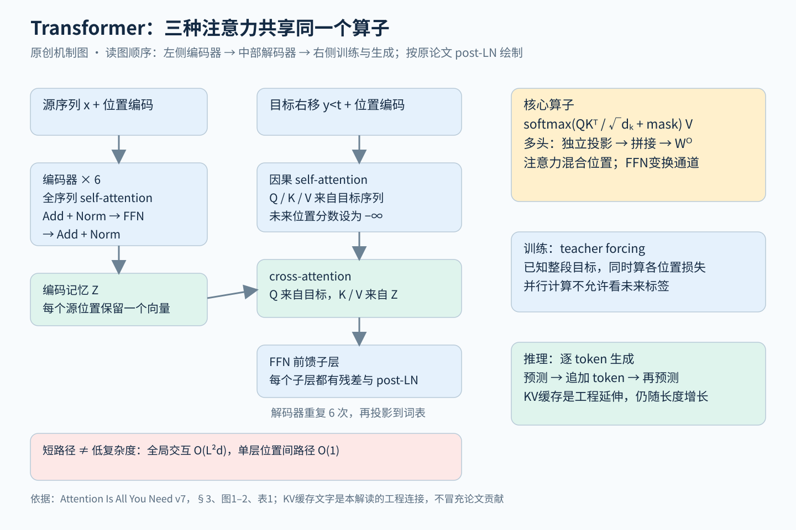

# Transformer 全文精读

论文：Vaswani 等，Attention Is All You Need，2017。本文固定阅读 [arXiv v7](https://arxiv.org/abs/1706.03762v7)，[PDF 全文](https://arxiv.org/pdf/1706.03762v7)，15页。阅读覆盖正文§1–7、表1–4，以及末尾注意力可视化图3–5；参考文献用于追溯边界，未逐篇展开。它是本系列注意力架构的基础参照，不等于今天所有大语言模型的完整配方。

## 先看结论

Transformer解决的是序列变换中的计算组织问题：用所有位置之间的直接注意力连接，替代沿时间步逐个推进的循环骨架。它保留了编码器、解码器、自回归概率分解、FFN、残差和归一化。题目里的“All”不能理解为模型里只有注意力，也不能理解为作者首次发明了attention。真正应掌握的是：Q/K/V怎样决定信息路由，因果mask怎样同时支持并行训练和逐步生成，以及全局连接为什么既强大又昂贵。

图解：蓝色区域是原始架构，绿色表示跨序列记忆或推理过程，黄色展开共享注意力算子。原文采用post-LN；现代pre-LN、RoPE和KV工程优化没有被混写成2017年的贡献。可用[SVG版](figures/transformer-mechanism.svg)检查细节。

## 1 问题和历史位置

机器翻译把源句x变为目标句y，建模的是 p(y|x)=∏ₜp(yₜ|y<t,x)。当时常用RNN编码源句，再由RNN解码，attention帮助解码器读源端记忆。瓶颈不只是“忘记长句”：同一个样本的第t步状态依赖第t−1步，训练难以沿序列充分并行。卷积能并行，但要多层才能连接远距离位置。

Transformer把注意力提升为主要的跨位置计算算子：同一层内，每个位置都能读取允许范围内的其他位置。§2明确承认自注意力、编码器解码器attention和memory networks的前序工作。这里的baseline价值是建立计算图，不是把整个注意力历史压缩成这篇论文。

## 2 从一个注意力头推到完整网络

设输入表示X有L行、每行d_model维。通过可学习投影得到Q=XW_Q、K=XW_K、V=XW_V。原文式(1)为：

\[
\mathrm{Attention}(Q,K,V)=\mathrm{softmax}(QK^T/\sqrt{d_k})V.
\]

加入mask时，将非法位置的logit设为−∞再做按行softmax。某一行Q表达“这个位置需要什么”，K用来计算相容性，V是实际被加权汇总的信息。Q/K决定权重而V提供内容，三者来自同一X并不意味着作用相同；它们由不同参数投影。输出不是找一个最近邻，而是多个value的可微加权和。

除以√d_k的动机是控制点积尺度。若分量独立、均值0且方差1，q·k的方差随d_k增长；过大的logit容易让softmax饱和。这是原文用于解释缩放的近似假设，并不是训练中所有Q/K必然满足该分布。[§3.2.1，p4]

多头不是把同一个结果复制多份。第i头有独立的W_i^Q、W_i^K、W_i^V，先在子空间算attention，再拼接并由W^O混合。base设置h=8，d_model=512，每头d_k=d_v=64，因此增加头数同时减小每头维度，主要计算量可保持近似不变。多个头允许一个位置同时聚合不同关系，但没有先验规定哪个头必须负责语法或指代。[§3.2.2]

原模型有三种调用：编码器self-attention的Q/K/V都来自源端；解码器self-attention都来自目标端且带因果mask；cross-attention的Q来自解码器，K/V来自编码器最终输出。三个模块的接口差异比“都是attention”更重要。

每个位置还经过 FFN(x)=ReLU(xW₁+b₁)W₂+b₂，base的中间维度2048。attention负责跨位置混合，FFN在同一位置做非线性特征变换。原始子层输出是LayerNorm(x+Sublayer(x))，即post-LN；不能直接替换成现代常见的x+Sublayer(LayerNorm(x))而仍声称忠实复现。[§3.1–3.3，式(2)]

## 3 位置与因果性不能混为一谈

没有位置信息时，单独的全局self-attention对位置重排具有相应的等变性，不能天然区分“甲追乙”和“乙追甲”的顺序角色。论文把正余弦位置向量加到embedding：

\[
PE_{p,2i}=\sin(p/10000^{2i/d}),\quad PE_{p,2i+1}=\cos(p/10000^{2i/d}).
\]

固定偏移可以通过每对正余弦的线性变换表达，这是相对位置关系可能易于学习的动机。原文仅说这种形式“可能”有利于超出训练长度的外推，并未给出百万token长度验证；表3(E)学得位置embedding的BLEU 25.7与正余弦25.8很接近。[§3.5，表3]

位置编码告知顺序，因果mask限制可见内容，右移标签防止抄答案，三者各司其职。训练时给解码器输入[BOS,y₁,…,yₜ₋₁]，位置t预测yₜ；虽然所有目标都已知，mask仍保证每个预测只依赖过去。若把未右移的yₜ直接放在能看到的位置，loss可能漂亮却发生标签泄漏。

## 4 训练和推理的完整流程

训练先分词、按近似长度组batch，编码源端，再一次性计算整段右移目标的各位置分布，并用label smoothing的交叉熵回传。英德约450万句对，共享BPE词表约37000；英法约3600万句对，词表32000。base在8张P100训练10万步约12小时，big训练30万步约3.5天。[§5.1–5.2]

Adam使用β₁=0.9、β₂=0.98、ε=10⁻⁹；学习率先4000步warmup，再按step⁻¹ᐟ²下降。base dropout为0.1，label smoothing为0.1。后者让困惑度变差但BLEU改善，说明训练或验证loss并非最终任务质量的唯一代理。[§5.3–5.4]

推理先编码源句，从BOS开始预测下一个token，追加到历史，直到EOS或长度上限。论文不是只做greedy：翻译采用beam size 4和长度惩罚α=0.6；base平均最后5个checkpoint，big平均最后20个。因此比较BLEU时必须同时对齐解码与checkpoint平均，而不只对齐网络层数。[§6.1]

工程连接：因果解码中，旧token的各层K/V不因后续token到来而改变，因此可以缓存，避免重算旧投影。不过新query仍要和历史key交互，缓存也随长度增加。这是理解后续GQA/MLA的入口；本段是对计算图的推导，不把KV缓存压缩宣称为本论文创新。

## 5 实验真正支持哪些结论

表2中base英德BLEU为27.3，big为28.4，支持当时翻译质量与训练效率的强结果。表3是newstest2013开发集、没有checkpoint平均，不应和表2的测试集数字混比。保持大致计算量时，单头BLEU 24.9低于base八头25.8；32头为25.4，说明并非头越多越好。去掉dropout降到24.6；去掉label smoothing困惑度从4.92改善到4.67，BLEU却从25.8降到25.3。[表2–3]

有一处原文不一致值得保留：摘要与表2报告英法big为41.8 BLEU，但§6.1正文写41.0。本文引用表2时明确按表2记，不替作者擅自消除差异。训练FLOPs也是GPU数量、时间和估计算力的乘积，不是现代统一硬件上的逐算子实测。[p1、p8]

句法分析证明它并非只能做翻译：表4的4层模型在WSJ-only得91.3 F1，半监督得92.7；但更强的专门模型仍有93.3。附录图3–5展示远距离依赖、代词和句法结构相关的头，是有启发性的定性案例，不能单靠这些图证明每个注意力权重都是忠实因果解释。[§6.3、表4、附录p13–15]

## 6 复杂度与失败边界

表1把全局self-attention核心交互列为O(L²d)，顺序操作O(1)，最长信息路径O(1)。这里O(1)指单层、已知输入时的位置并行结构，不表示整段自回归输出能一次生成，也没把所有投影/FFN成本都装进L²d。生成长度越长，逐步依赖仍在。

全局读历史使检索灵活，却造成长序列的算力和缓存压力。缩短路径不是消除二次复杂度；有位置公式也不保证长度外推可靠。原文主要证据来自翻译和句法分析，没有证明开放域问答、工具调用或复杂推理能力。现代LLM的decoder-only架构、预训练规模与对齐过程需要另读对应论文。

## 7 一个手算例子帮助建立直觉

以下是教学构造，不是论文实验。设某个query对三个位置的缩放后打分为[0,0,0]，则权重是[1/3,1/3,1/3]，输出是三个value的平均；若最后一个位置不允许看见，把它的分数改为−∞，权重变成[1/2,1/2,0]。这说明mask改变的是概率归一化范围，而不是先平均再把未来输出删掉。

再设三个value分别代表三种不同信息。一个头把它们混成一个向量，混合后可能难以区分究竟哪种关系重要；多个头可以在不同投影子空间分别汇总，再由输出投影组合。但不能据此保证每头都学到互补含义：头的分工是训练结果，冗余和未使用的头也不能从架构定义中排除。验证某个头的作用，还需要干预、屏蔽或消融，单凭颜色连线不能下因果结论。

实现比较还有一个常见陷阱：把“层数相同”当成公平。一个编码器层有两个子层，解码器层有三个；不同模型的隐藏宽度、前馈宽度、词表和embedding共享都会改变参数量。若用这篇作实验baseline，应记录训练token数、batch按token还是句子计、数据划分、分词方式、参数量、训练FLOPs、解码配置和硬件；仅报告“六层Transformer”不足以复核。原文已经在表3展示了缩小key维度、增大宽度和改变正则化会产生不同收益，这也是后续架构比较必须控制配方的直接理由。

## 8 读懂后的最小检验

手算三个token、一个head的QKᵀ并施加上三角mask，检查softmax每行和为1；再确认每个输出究竟读了哪些V。随后检查一个实现的三个细节：标签是否右移、cross-attention的K/V是否来自源端、Norm放在残差前还是后。最后把“训练并行”“prefill并行”和“decode逐步”分别画出来。能解释这三件事，就有了阅读Mamba、MoE/MLA和推理预算论文的共同坐标系。

## 阅读证据

正文、表格和附录定位见 [证据与覆盖记录](../../../docs/deep-readings/evidence/transformer.json)。本稿是原创技术解读，没有把全文翻译或原图复制作为交付；涉及数值均保留实验条件与原文出处。

## 图解文件与证据索引

[SVG高清图](figures/transformer-mechanism.svg) · [SVG可编辑图](figures/transformer-mechanism.svg) · [结构化证据](../../../docs/deep-readings/evidence/transformer.json)
