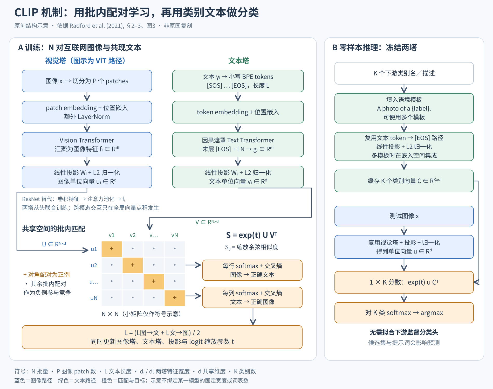
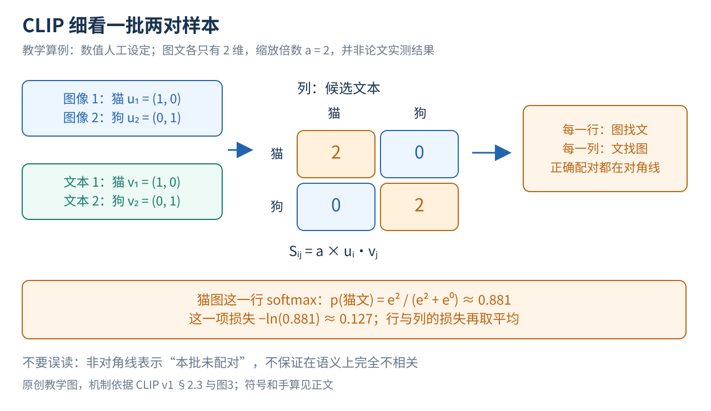
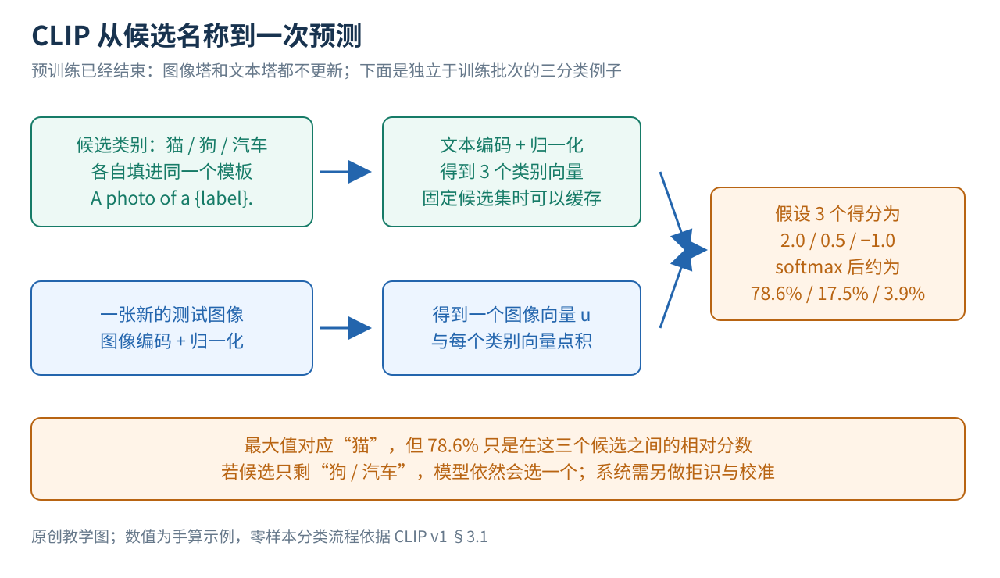

# CLIP：在 4 亿对网上图文里练"图找文、文找图"，一句话就能定义一个分类器

> 状态：逐步教学版 · 原文 arXiv:2103.00020v1 · 未复现

## 一句话

Radford 等（2021，OpenAI）让一个图像塔和一个文本塔各自把输入变成同样长度的单位向量，在每批 32,768 对网上图文里同时训练"每张图从全批文字中找出自己的描述"和"每段文字找出自己的图"。训练完，把类别名写成"a photo of a {类别}."交给文本塔，得到的向量就是分类器的权重。不用 ImageNet 的 128 万张训练图，零样本 ImageNet 准确率 76.2%，与原始的有监督 ResNet-50 相当。

## 它要解决的问题

**固定类别的分类器换任务就要重训。** 传统分类器把类别含义存在分类头的权重里，"猫"这个名字只是给人看的标签。新增类别要收集标注、改分类头、再训练（下面第一节展开）。

**用自然语言做监督的前作规模太小、效果太弱。** Visual N-Grams（Li 等 2017，[arXiv:1612.09161](https://arxiv.org/abs/1612.09161)）已经用网页文字学视觉概念并尝试零样本迁移，ImageNet 零样本只有 11.5%。VirTex（Desai、Johnson 2020，[arXiv:2006.06666](https://arxiv.org/abs/2006.06666)）让视觉表示服务于预测图像描述。ConVIRT（Zhang 等 2020，[arXiv:2010.00747](https://arxiv.org/abs/2010.00747)）在医学图像与报告上做图文对比学习，结构最接近 CLIP；CLIP 原文称自己是"从头训练的简化版 ConVIRT"（§1）。批内竞争的目标可以追溯到 N-pair loss 与 InfoNCE（§2.3）。CLIP 引言指出，VirTex、ICMLM、ConVIRT 只训练了"加速器天"、用了 10 万到 20 万张图像，而同期有监督的大模型已经在百万到十亿张图像上训练了"加速器年"（§1）。

**同期视觉主干要靠大规模人工标注。** [ViT](../vit/reading.md) 的最好结果依赖 3 亿张带标签的 JFT。CLIP 的问题是：网上天然配对的图文能否代替人工类别标签，并且直接给出一个用语言指定任务的接口？在[视觉表征方向](../../fields/visual-representation/README.md)的主线里，这是同时换掉训练信号和数据的一步；它的图像塔后来成为[图文对齐](../../fields/alignment/README.md)与[视觉语言模型](../../fields/vlm/README.md)的常用起点。

## 核心想法

1. **让语言生成分类器权重。** 文本塔把类别描述编码成向量，图片与哪个向量最相似就归哪一类；自然语言从备注变成了任务接口。
2. **选配对识别，不选逐词生成。** 预测"哪段文字和这张图是一对"比逐词生成描述省得多（图 2），双塔、对比损失本身都不是新东西。
3. **把规模做上去。** 自建 4 亿对图文的 WIT 数据集，训练 5 个 ResNet 与 3 个 ViT（最大的 ViT 用 256 张 V100 训练 12 天，最大的 ResNet 用 592 张训练 18 天），并在 30 多个数据集上系统评测零样本、线性探针与分布偏移。

下面第一到六节逐步讲机制。

## 一 先理解 CLIP 想改变的分类方式

### 1 固定类别的分类器为什么不够灵活

传统分类器先提取一组特征，再给每个类别打分。假设特征有 512 个数，分类头为"猫"保存 512 个权重，为"狗"再保存 512 个；图片特征与每组权重做加权求和，就得到各类别的分数。模型用已标注的照片调整这些权重，使正确类别得分更高。

类别含义因此保存在训练出来的权重中，cat 这个词本身没有参与计算。把分类头里的"猫"改名为"火车"，模型不会因此识别火车；换任务往往要重新学一组类别权重。

CLIP 把这组权重的来源改成文本网络：把 cat 写成 A photo of a cat.，文本网络输出与该描述对应的向量，图片与它越相似，"猫"的分数越高（§3.1.1–3.1.2）。

### 2 零样本到底少了什么

这里的"零样本"指：针对这次下游任务，不用该任务的已标注训练样本拟合分类器。CLIP 此前已经在 4 亿对网上图文上训练过，很可能见过与测试类别相近的概念（§2.2、§3.1）。"下游不用再训练"的代价，是一笔昂贵的上游预训练。

## 二 一张总图先把训练和使用分开

图 1 依据原文 §2–3 和图 3 绘制。左边是训练，右边是训练完成后的使用；蓝色是图像路径，绿色是文字路径，橙色表示评分与学习目标。

左边输入的是一批已知对应关系的图文对。两座塔各自处理自己的输入，最后各交出一个向量。下方的方阵把本批每张图与每段文字都比一遍：对角线是原有的配对，其余格子作为竞争项。

右边的文字输入换成了我们指定的类别描述。文本塔先生成这些候选的向量，测试图片再与它们比较；两座塔在标准零样本路径上都冻结，不因预测新照片而修改参数。

图中的 N 是训练批量，K 是本次任务的类别数，d 是图文共享的向量长度，L 在文本路径表示序列长度；旧图用 P 表示图像 patch 的个数（不是 ViT 文献里常用的 patch 边长）。图像塔可以是 ViT，也可以是 ResNet，"CLIP"指的是图文训练与使用方式（§2.3–2.4）。

## 三 图片与文字怎样变成可比较的数字

### 1 两座塔各交出一个向量

编码器是把输入变成一串数（向量）的可训练函数。图像编码器处理像素，文本编码器处理文字，计算方式不同，但最后都要交出相同维度的结果，才能直接比较。真正受约束的是整体关系：相关的图片和文字方向更接近，不匹配的候选较难被误选。

图像塔与文本塔的输出原本分别有 dᵢ 和 dₜ 维，CLIP 用两个各自独立的可训练线性投影把它们都变成 d 维，映射到同一个可比较的空间（§2.3、图 3）。

### 2 为什么要把向量长度统一

两个方向相同的向量，一个长度是另一个的 10 倍时，直接点积会偏向长的那个，模型可能靠放大数值而不是改善语义匹配来取巧。CLIP 对投影后的向量做 L2 归一化，让长度变成 1。

**示例数值。** 二维向量 (3, 4) 的长度是 √(3² + 4²) = 5，归一化后为 (0.6, 0.8)。两个单位向量的点积就是余弦相似度：同向为 1，垂直为 0，反向为 −1。

设第 i 张图片的单位向量为 uᵢ，第 j 段文字的单位向量为 vⱼ，配对分数写成：

Sᵢⱼ = a × uᵢᵀvⱼ，a = exp(t)。

a 是正的缩放倍数，t 是训练中学习的一个数。缩放不改变一行分数的大小顺序，但改变随后 softmax 的尖锐程度：分数差放大，概率就更集中到高分候选。它也常写成温度的倒数 1/τ，"小温度"与"大缩放倍数"是同一个方向（§2.3、图 3）。

### 3 两座塔内部各做了什么

图像侧有两类模型。修改过的 ResNet 用卷积逐步提取特征，以注意力池化汇总整张图；ViT 先把图片切成小块，让 Transformer 在块之间交换信息，CLIP 的 ViT 在 patch 与位置嵌入相加后额外做了一次 LayerNorm（§2.4）。

文字侧先用 BPE 分词（把常见字符串合并成子词单元），再用 Transformer 结合上下文处理。文本两端带有开始和结束标记 [SOS]、[EOS]，论文取最后一层 [EOS] 位置的表示，经归一化和线性投影，作为整段文字的向量（§2.4）。文本塔使用因果遮罩，[EOS] 在末尾，所以能汇集整段文字；训练目标是整段文字与整张图的匹配，不是逐词续写。

两座塔在编码过程中互不查看对方的 token，跨模态比较只发生在最后的全局向量点积上。这让文字向量可以提前缓存；代价是细小区域、词序和复杂关系能否保留下来，全看单个全局向量的表达能力。后来的工作正是从这里找到了 CLIP 的弱点（见"局限与后续"第 3 条）。

## 四 一批配对如何变成训练目标

### 1 数据只告诉模型原来哪两项在一起

一批里有两对数据：猫图配猫的描述，狗图配狗的描述。我们还会额外计算"猫图与狗描述""狗图与猫描述"的分数，两对样本变成四个可比较的组合。

一批有 N 对时，就有 N×N 个分数、N 个已知配对。图像编号放在行、文字编号放在列，原始配对都在对角线上。训练让每张图片从 N 段文字中找到自己的文字，也让每段文字从 N 张图片中找到自己的图片（§2.3、图 3）。

### 2 softmax 和交叉熵分别做什么

softmax 把一行分数变成非负、总和为 1 的数。固定图片 i，对文字 j 的相对概率为：

pⱼ = exp(Sᵢⱼ) / Σₖ exp(Sᵢₖ)。

分子代表这一个候选，分母代表所有候选的竞争总量。交叉熵在只有一个正确目标时写成 −ln(p正确)：正确概率接近 1 时损失接近 0，正确概率很小时损失很大。训练根据损失的梯度调整两座塔、投影矩阵和缩放参数（[分类与概率讲义](../../../foundations/lessons/modules/objectives/02-classification-probabilities.md)）。

### 3 手算一批只有两对的数据

**示例数值。** 设猫图和猫文的向量都是 (1, 0)，狗图和狗文都是 (0, 1)，缩放倍数 a = 2。相同方向的点积为 1，垂直方向为 0，所以得分矩阵两行分别为 (2, 0) 与 (0, 2)。

第一行：猫图在"猫文、狗文"之间选择，正确配对概率为 e²/(e² + e⁰) ≈ 7.389/8.389 ≈ 0.881，损失 −ln(0.881) ≈ 0.127。第二行对称。

按列看，猫文从两张图中选猫图，狗文选狗图；本例矩阵对称，列方向也是 0.127。行、列各自平均再取平均，整批损失约为 0.127。如果四个分数完全相同，每行只能给两个候选各 0.5，损失是 −ln(0.5) ≈ 0.693。正确配对与竞争项拉开差距，损失就从"分不清"的 0.693 往下降。

完整批次的目标可以写为：

L = −(1/2N) Σᵢ [ln(exp(Sᵢᵢ)/Σⱼ exp(Sᵢⱼ)) + ln(exp(Sᵢᵢ)/Σⱼ exp(Sⱼᵢ))]。

第一个分母沿行相加，表达"图找文"；第二个沿列相加，表达"文找图"。所有候选在同一个分母里竞争，这与逐词生成描述不同，也与给每个组合独立判断"是 / 否"不同（§2.3、图 3）。后者正是 SigLIP 后来的做法，见"局限与后续"第 2 条。

### 4 未配对不等于语义上一定错误

一批里有两张不同的猫图，描述都只写"一只猫"。数据仍把它们当成不同配对，非对角组合依然进入竞争项，尽管从语义看两段描述都适合两张图。这类潜在的假负例是批内对比目标的固有风险，原论文没有单独量化它。

## 五 真实的数据与训练流程

### 1 四亿对数据是怎样的监督

WIT 包含 4 亿个网上图像–文本对。收集时使用约 50 万个查询词，每个查询最多保留约 2 万对；查询词来自英文 Wikipedia 的高频词、短语、文章名，并补充了 WordNet 词条（§2.2 及脚注 1）。

搜索词用于寻找样本，训练用的是与图像一起出现的完整文本。文本可能描述主体，也可能描述背景、语境或拍摄者关心的事，所以自然语言监督更丰富，也更嘈杂。作者检查 YFCC100M 时发现，标题和描述里有很多文件名、相机参数，只保留自然语言英文标题或描述后剩下约 1500 万张图（§2.2）。

### 2 一次参数更新具体发生什么

训练程序抽取一批图文对，对图像做随机方形裁剪，对文本分词；两座塔从头初始化共同训练，不加载 ImageNet 权重或现成的语言模型。图文经编码、投影与归一化后产生批内分数矩阵，计算双向交叉熵，再反向更新（§2.3–2.5）。

批量 32,768，训练 32 个 epoch；优化器 Adam，配解耦权重衰减和余弦学习率（§2.5、附录 F）。温度初始化等效于 0.07，缩放倍数上限截断为 100，以防训练不稳定（§2.5）。

### 3 好用的接口背后是昂贵的预训练

作者训练了 5 个 ResNet 和 3 个 ViT。通常报告的最佳模型是 ViT-L/14@336px：先以 224 分辨率训练，再在 336 分辨率额外训练一个 epoch。最大的 ViT 用 256 张 V100 训练 12 天，最大的 ResNet（RN50x64）用 592 张训练 18 天（§2.4–2.5）。CLIP 的优势之一是把这笔成本复用到多种任务上。

## 六 训练好后怎样用一句话定义类别

### 1 从类别名到缓存的分类器

列出 K 个候选类别，给每个类别填入同一个提示模板，例如 A photo of a {label}.。每句话经过文本塔，得到归一化类别向量 c₁ 到 c_K；新图片编码为单位向量 u，分别计算 a×uᵀcₖ，选最高分的类别（§3.1.1–3.1.2）。

每个 cₖ 就是一个类别的权重，只不过由文本塔生成。候选集固定时，这些向量可以预先算好缓存，之后每张图片只需运行图像塔。

**示例数值。** 图 3 的三分类得分设为 2.0、0.5 和 −1.0。softmax 的分母为 exp(2.0) + exp(0.5) + exp(−1.0) ≈ 9.406，三个概率约为 78.6%、17.5%、3.9%，模型选"猫"。

这些数只是给定候选集内的相对分数：删掉"猫"后，模型仍会在"狗"和"汽车"中选一个。要允许"以上都不是"，需要另外设计拒识、校准与评估。

### 2 提示词为什么会改变表现

裸类别名可能很短，也可能有歧义；预训练看到的却多是带上下文的句子。把类别名放进"某物的照片"之类的模板，能更明确地指定用途；不同任务还可能更适合其他语境，例如卫星照片或某种动物的图像（§3.1.4）。

同一类别可以写出多个模板，各自编码后在嵌入空间平均，得到一个类别表示，仍然可以缓存。作者在开发过程中查看过完整验证集，论文明确承认这与"目标任务一张验证标签都不看"的最严格零样本不同（§6）。

## 证据：哪个实验支撑哪个主张

图 4 是读实验的路线图：零样本测"文字接口能否直接生成有效的分类器"；线性探针冻结图像编码器、用标签训练一个线性头，测"表示里有没有可读出的类别信息"；分布变化实验把相同协议搬到来源或外观不同的图像上。4-shot 指每类 4 个带标签样本。

| 主张 | 支撑实验 | 怎么读 |
|---|---|---|
| 对比目标比逐词生成高效 | 图 2：达到同样的 ImageNet 零样本准确率，Transformer 语言模型基线约慢 3 倍；把词袋预测换成词袋对比，再快约 4 倍 | 横轴是处理过的图像数，比的是学习速度 |
| 零样本大幅超过前作 | 表 1：ImageNet 76.2 对 Visual N-Grams 11.5；aYahoo 98.4 对 72.4；SUN 58.5 对 23.0 | 模型、数据、算力全不同，是跨代系统对比 |
| 零样本可与有监督线性基线竞争 | 图 5：27 个数据集中 16 个超过"ImageNet ResNet-50 特征 + 线性分类器" | 遥感、计数、距离估计等明显偏弱 |
| 提示工程有效 | §3.1.4：ImageNet 上默认模板比裸类别名高 1.3 点，80 个模板集成再高 3.5 点；36 个数据集平均约 5 点 | 三个数的比较起点不同 |
| 零样本约等于 4-shot | 图 6–7：20 个数据集上平均相当于同一特征上的 4-shot 线性分类器；达到零样本水平所需每类标签数中位数 5.4，ImageNet 约 16 | 估算的等效位置 |
| 表示本身可迁移 | §3.2：12 数据集套件上比最佳对比模型高 2.6 点，27 数据集上约高 5 点；对 Noisy Student EfficientNet-L2 在 21/27 项占优，ImageNet 上低约 3 点 | 线性探针用了下游标签 |
| 零样本更鲁棒 | §3.3、图 13–14：用 ImageNet 拟合线性头后 ImageNet 从 76.2 升到 85.4，自然分布偏移平均略降，ImageNet-R 降 4.7、ObjectNet 降 3.8 | "有效鲁棒性"比的是超出按 ImageNet 成绩预测的部分 |
| 数据重叠不足以解释结果 | §5、附录 C：35 个数据集中位重叠率 2.2%、平均 3.2%；对准确率的最大估计增益为 Birdsnap 0.6 点 | 检测器在 4 亿张图上的召回无法完全验证 |

下面补充表中放不下的读法。

**数据源。** 用等规模的过滤后 YFCC 与 WIT 子集训练 ResNet-50，平均线性探针 65.5 对 66.6，平均零样本 29.6 对 30.0；平均差距小，个别细分类别差很多，而且 WIT 本身包含 YFCC 来源（表 12）。

**特殊任务。** 零样本 MNIST 只有 88.4%，低于原始像素上的逻辑回归 92.5%；而把影评情感文字渲染成图片的 Rendered SST2，线性探针达到 80.5%（表 14）。人觉得简单的视觉任务未必匹配网上图文的分布，表示里又保留了一些可用于文字任务的信息。

**视频口径。** 线性评测用单帧，附录 E 的零样本视频实验对全视频帧取平均；UCF101 在表 11 与表 15 分别为 76.9% 和 80.3%，评估方式与帧聚合都不同。

## 局限与后续

**作者自述（§6–7）。** 零样本 CLIP 整体上与线性探针的 ResNet-50 基线相当，而这个基线已远低于各数据集的最佳结果；作者估计零样本要达到总体最佳，还需约 1000 倍算力。细粒度分类、计数、距离估计、抽象任务偏弱；对真正分布外的数据（如 MNIST）泛化很差；开发中反复查看了完整验证集；数据未经过滤，带有社会偏差，类别集与提示会改变偏差的表现（§7、表 7）。

站在现在看，后来的工作把"CLIP 为什么有效"和"CLIP 在哪里失效"都拆得更清楚了。

**1. 主因是数据，而 WIT 没有公开。** MetaCLIP（Xu 等 2023，Meta FAIR 与 NYU 等，[arXiv:2309.16671](../arxiv-2309.16671/README.md)）开篇就写，CLIP 成功的主要因素是数据，而不是架构或训练目标；CLIP 对数据只给了很少的说明，后来的复现只好用 CLIP 模型本身去过滤数据。MetaCLIP 按 CLIP 的描述重建了流程：50 万个元数据条目做子串匹配，每个条目最多保留 t = 20,000 对。在 16 亿对的数据池里，匹配数超过 2 万的条目只占 3.2%，却占了全部匹配的 94.5%；例如"photo"在池中出现 5400 万次，平衡后只保留 2 万条（§3.3–3.4）。同样 4 亿对、同样的 ViT-B 训练设置，MetaCLIP 零样本 ImageNet 70.8%，CLIP 的数据为 68.3%。DataComp（Gadre 等 2023，[arXiv:2304.14108](../arxiv-2304.14108/README.md)）从 128 亿对候选池中筛选出 DataComp-1B，用相同的训练流程和算力训练 ViT-L/14，零样本 ImageNet 79.2%，比 OpenAI CLIP ViT-L/14 高 3.7 个百分点。OpenCLIP 的规模律研究（Cherti 等 2023，LAION 等，[arXiv:2212.07143](../arxiv-2212.07143/README.md)）发现，结构相同、配方相近的 OpenAI 与 OpenCLIP 模型扩展规律不同，训练数据的分布起关键作用。`[判断]` CLIP 原文的消融几乎都花在训练目标和模型上，数据构造只有一段描述（§2.2）；后来的复现和超越，主要发生在数据一侧。

**2. 批内 softmax 绑死了大批量。** 第四节的损失要在整批上归一化，每张卡都要拿到全批的相似度矩阵。SigLIP（Zhai 等 2023，Google DeepMind，[arXiv:2303.15343](../arxiv-2303.15343/README.md)）把它换成逐对的 sigmoid 损失：每一对图文独立判断"是不是一对"，不需要整批归一化。批量增大的收益很快饱和，约 32k 已足够；配合锁定图像塔的 LiT 方式，只用 4 块 TPUv4 训练两天就达到 84.5% 的零样本 ImageNet（摘要）。

**示例数值。** 沿用第四节的 2×2 分数矩阵（对角线 2，其余 0），设每对的 logit = 分数 + b。b = 0 时，两个正对各损失 −ln σ(2) ≈ 0.127，两个负对各损失 −ln σ(0) ≈ 0.693，损失主要来自负对。一批 32,768 对时，正对 3.3 万个，负对约 10.7 亿个，这种不平衡会在训练初期造成很大的修正步长；SigLIP 因此把 b 初始化为 −10、温度项初始化为 log 10，让训练从"几乎所有组合都不是一对"的先验出发（§3.2、§4.9）。

**3. 一个全局向量装不下组合关系。** ARO（Yuksekgonul 等，ICLR 2023，Stanford，[arXiv:2210.01936](../arxiv-2210.01936/README.md)）用 5 万多个测试检查属性绑定、关系与词序：两句话选一句，随机水平 50%，CLIP 在属性上 62%，空间关系 56%，动词关系 61%（§2.3）。作者进一步说明，在现有检索数据集上不用词序和组合信息也能做好检索，而对比预训练恰恰在优化这种检索，所以模型没有动力学组合信息（§3）；在训练中加入交换名词、形容词或动词短语得到的"组合难负例"，就能明显改善（§4，NegCLIP）。`[判断]` 第三节"两座塔只在最后点积"的结构，加上第四节的批内目标，共同造成了这个短板。

**4. 做视觉语言模型的眼睛时有盲区。** MMVP（Tong 等 2024，NYU 等，[arXiv:2401.06209](../arxiv-2401.06209/README.md)）收集 CLIP 余弦相似度高于 0.95、DINOv2 相似度低于 0.6 的图像对，设计了 150 对、300 个问题；包括 GPT-4V 在内的多模态大模型经常答错，难住 CLIP 的视觉模式与难住大模型的高度相关；把自监督的 DINOv2 特征混入视觉输入，定位能力明显提升。Perception Encoder（Bolya 等 2025，Meta FAIR，[arXiv:2504.13181](https://arxiv.org/abs/2504.13181)）的标题直说"最好的视觉嵌入不在网络的输出层"：对比训练得到的通用特征藏在中间层，要额外对齐才能拿出来。[LLaVA](../llava/README.md) 取 CLIP 倒数第二层而不是最后一层，是同一现象在下游的用法。Web-SSL（Fan 等 2025，[arXiv:2504.01017](https://arxiv.org/abs/2504.01017)）在同一份 MetaCLIP 数据上比较：CLIP 在 OCR 与图表类问答见长，但模型增大到中等规模后提升趋于饱和；纯视觉自监督模型扩到 7B 后追平（图 3）。

**5. 密集特征与原生分辨率靠后续补。** SigLIP 2（Tschannen 等 2025，Google DeepMind，[arXiv:2502.14786](../arxiv-2502.14786/README.md)）在图文对比之外加入基于描述生成的预训练、自蒸馏与遮蔽预测，并做在线数据筛选，改善定位与分割、深度等密集任务；NaFlex 变体支持多分辨率并保持原始宽高比（摘要、§1）。Registers 论文发现 OpenCLIP 的大 ViT 也有高范数伪影 token（[DINO 精读](../dino/reading.md)"局限与后续"第 3 条）。`[判断]` CLIP 式编码器后来的改进，基本都在往"只对齐全局语义"的目标上补局部信息。

## 批注

**易误读**

- 76.2% 是零样本，85.4% 是在同一 CLIP 特征上用 ImageNet 训练集拟合线性头的线性探针结果（表 10，p40），两者不能混用。
- 零样本"相当于 4-shot"不是说 CLIP 只相当于每类看过 4 张图；预训练看过海量图文，文字接口也带来了监督信息（§3.1.5）。
- 图 5 的对手是"ImageNet ResNet-50 特征加线性头"这一个特定基线，不是所有有监督视觉系统。
- 第六节 78.6% 这类 softmax 概率只在给定候选集内有意义，不是开放世界里"确实是猫"的概率。
- 图 2 的"3 倍、4 倍"是达到同一准确率所需的图像数之比，不是准确率之比。
- v1 正文 p5 写词表大小 49,152，附录 F 表 18 写 49,408，两处不一致；正文写最大序列长度 76。复现时以代码版本为准。
- 提示中加入 child 等类别后，儿童图像落入有害类别的比例下降，这说明候选集会改变偏差的表现，不说明偏差消失（§7、表 7）。

**与其他论文的关联**

- [ViT 精读](../vit/reading.md)：CLIP 最好的图像塔是 ViT-L/14；ViT 的分类头只能认识训练过的类别，CLIP 用文本塔补上了这个接口。
- [DINO 精读](../dino/reading.md)与 [MAE 精读](../mae/reading.md)：同年的两种纯视觉自监督。MMVP 与 Web-SSL 把 DINO 系特征当作 CLIP 的互补，[OpenVLA](../../../robotics-embodied/papers/openvla/reading.md) 拼接 DINOv2 与 SigLIP 两路特征。
- [LLaVA](../llava/README.md)：用 CLIP ViT-L/14 的网格特征经线性投影接入语言模型，是 CLIP 进入[视觉语言模型方向](../../fields/vlm/README.md)的入口。
- DALL·E 2 等生成模型以 CLIP 嵌入为条件，见[视觉生成方向](../../fields/generation/README.md)。
- 对比学习的一般形式与 SimCLR 的批内候选，见[自监督与生成目标讲义](../../../foundations/lessons/modules/objectives/03-pretraining-objectives.md)第 7–9 节。

**未核实 / 待验证**

- MetaCLIP、DataComp、OpenCLIP 规模律、SigLIP、ARO、MMVP、Perception Encoder、Web-SSL、SigLIP 2 只核对了本页引用的段落与表格；它们在本库还没有文献卡。
- MetaCLIP 引用的是 arXiv v6（2025 年 11 月），数字以该版本为准。
- SigLIP 示例中"logit = 分数 + b"是本页为手算采用的写法；原文式 1 的印刷形式与此等价与否未逐字核对。
- 前作（Visual N-Grams、VirTex、ConVIRT、N-pair loss、InfoNCE）只按 CLIP 原文 §2 的描述引用。
- 数值出处与页码见[证据档案](evidence.json)与[教学改写核验记录](evidence-beginner-revision.json)。
