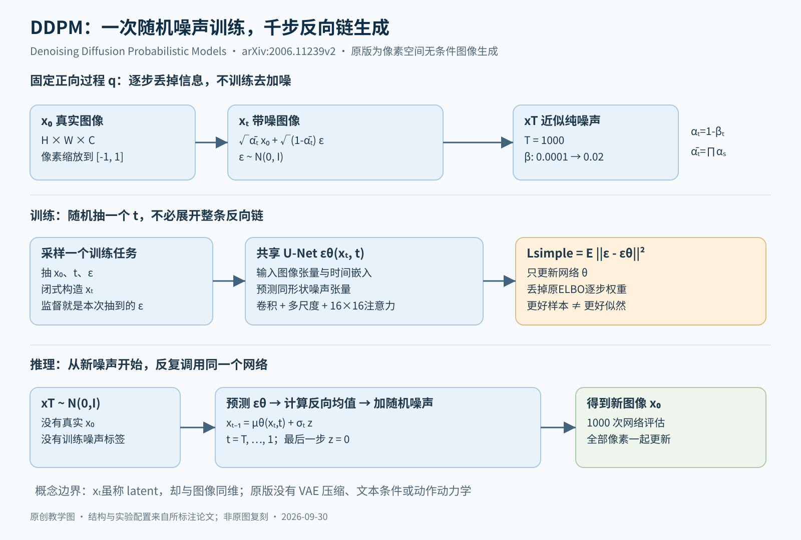

# DDPM 精读：为什么预测噪声能够生成图像

本篇阅读 Jonathan Ho、Ajay Jain、Pieter Abbeel 的 [Denoising Diffusion Probabilistic Models，arXiv:2006.11239v2](https://arxiv.org/abs/2006.11239v2)，固定到2020-12-16版本。正文§1–6、补充信息、附录A–D和样本图均已读。这里讨论原版像素扩散，不把后来潜空间扩散、文本条件、CFG或快速采样器算进原方法；未复现训练。

最重要的结论：DDPM把复杂图像生成拆成不同噪声水平下的去噪任务。训练时可一步制造任意噪声等级的样本，推理时却需要顺序走反向链。噪声预测是反向高斯均值的一种参数化；去掉特定权重后的简化目标是有效的经验选择，不是“均方误差与原始最大似然完全一样”。

## 一张图分开训练与采样

原创图解据原文式(1)–(14)、算法1–2及附录B整理。向右加噪是已知的固定过程；生成时从最右边开始，逐步调用同一个U-Net回到图像空间。图中的扩散时间不是视频时间或机器人时间。

## 1 先把概率对象分清楚

真实样本x₀来自数据分布q(x₀)。正向链q(x₁:T|x₀)不断加噪，反向链pθ(x₀:T)=p(xT)∏pθ(xₜ₋₁|xₜ)从标准高斯开始。模型真正要实现的是边缘分布pθ(x₀)，中间状态x₁…xT需要积分掉。[§2式(1)–(3)，PDF页2](https://arxiv.org/pdf/2006.11239v2#page=2)

这些中间状态被称为latent，但每个xₜ都与图像同维，仍是H×W×C张量。它没有先经VAE压缩，也没有离散词表或图像tokenizer。U-Net内部多尺度特征是网络激活，不应与概率模型里的xₜ混为一谈。原实验是无条件生成：时间t是去噪难度条件，却不是类别或文本语义条件。

固定正向转移为：

q(xₜ|xₜ₋₁)=N(√(1−βₜ) xₜ₋₁, βₜI)

βₜ是每一步加多少噪声。定义αₜ=1−βₜ，ᾱₜ=∏(s=1…t)αₛ，则可直接采样：

xₜ=√ᾱₜ x₀ + √(1−ᾱₜ) ε，ε∼N(0,I)

这里两项分别控制剩余信号和累计噪声，而不是简单对每一步噪声方差求和。随着ᾱₜ变小，xₜ越来越少携带x₀的信息。这一闭式边缘分布是高效训练的关键：无需先运行t步加噪，更无需为一个梯度更新生成整条1000步轨迹。[§2式(2)、(4)，PDF页2](https://arxiv.org/pdf/2006.11239v2#page=2)

## 2 已知原图时，反向一步有可计算答案

q(xₜ₋₁|xₜ)通常难算，因为不知道产生带噪图像的干净原图；但训练时有x₀，q(xₜ₋₁|xₜ,x₀)就是可解析高斯。其均值μ̃ₜ混合x₀与xₜ，方差β̃ₜ=[(1−ᾱₜ₋₁)/(1−ᾱₜ)]βₜ。模型学习pθ(xₜ₋₁|xₜ)去近似这个有教师条件的分布，而部署时无需给它x₀。[§2式(6)–(7)，PDF页3](https://arxiv.org/pdf/2006.11239v2#page=3)

原文把负对数似然的变分上界分为三类：终点先验匹配LT、中间反向KL项、最后一步重建项L₀。β固定时LT不含待训练参数；中间项比较两个高斯，可用闭式KL减少估计方差；L₀处理真实离散像素。附录A的推导本质上利用Bayes重写正向转移并让相邻边缘概率相消，不能把其中“给定x₀”的后验误当作推理时可调用的oracle。[式(5)、附录A，PDF页3、13–14](https://arxiv.org/pdf/2006.11239v2#page=13)

## 3 预测噪声为何等价于控制反向均值

取固定反向方差σₜ²I后，KL中的参数相关部分是加权的均值误差。再把x₀由带噪公式解出来，就能将均值写成：

μθ(xₜ,t)=1/√αₜ · [xₜ−βₜ/√(1−ᾱₜ) · εθ(xₜ,t)]

网络只需预测与图像同形状的εθ。它不是识别“随机数发生器的种子”，也不是在高噪声下唯一恢复这张原图：同一个带噪状态可能对应许多原图，均方误差的最优预测反映条件平均。噪声预测经过上述确定公式，才成为一次合法反向转移的均值。[§3.2式(8)–(12)，PDF页3–4](https://arxiv.org/pdf/2006.11239v2#page=4)

原始KL对应的噪声误差权重为βₜ²/[2σₜ²αₜ(1−ᾱₜ)]。DDPM最成功的训练选择丢掉这个随t变化的权重，均匀抽t后优化：

Lsimple=E(x₀,t,ε) ||ε−εθ(√ᾱₜ x₀+√(1−ᾱₜ)ε,t)||²

它因此重新分配不同噪声等级的重要性。按作者的schedule，近乎干净图像的微小细节项被相对降权，模型更多关注困难的去噪。不能同时说“去掉所有权重”又说“严格最大化原ELBO”：前者是ε空间里的形式，后者要保留导出的权重与离散解码项。[§3.4式(14)，PDF页5](https://arxiv.org/pdf/2006.11239v2#page=5)

与score的联系也有明确尺度：噪声预测可换成约为−εθ/√(1−ᾱₜ)的带噪分布score，即对xₜ的对数密度梯度。这解释了为何采样类似退火Langevin动力学；“类似”不表示可以随意替换系数。DDPM反向步长与噪声大小来自正向βₜ，附录C专门区分它与事后另设采样器的NCSN。[§3.2、附录C，PDF页4、15](https://arxiv.org/pdf/2006.11239v2#page=15)

## 4 一次训练步与一次完整推理

训练顺序是抽真实图像、抽均匀t、抽高斯ε、闭式构造xₜ、运行εθ、反传噪声MSE。t以正弦位置嵌入注入残差块，网络在所有噪声等级共享参数，而不是为1000个t分别训练1000个U-Net。[算法1，PDF页4；附录B，页14](https://arxiv.org/pdf/2006.11239v2#page=14)

推理从全新xT∼N(0,I)开始，对于t=T…1重复：预测噪声，计算μθ，再取xₜ₋₁=μθ+σₜz。t>1时z是新高斯噪声，最后一步令z=0。生成不需要训练时那张图或那份ε；随机性来自初始噪声和链中后续采样。同一个中间xₜ分叉也可能产生不同图像，原文图7据此检查高层属性何时趋于固定。[算法2、图7，PDF页4、7](https://arxiv.org/pdf/2006.11239v2#page=7)

原版T=1000，β从10^-4线性增至0.02。U-Net采用group norm、残差块及16×16特征分辨率上的self-attention；CIFAR10模型约35.7M参数，256×256模型约114M，大卧室模型约256M。图像缩放到[-1,1]；最后的离散似然用高斯在像素量化区间的积分计算，展示图像则使用最后一步无噪声均值。[§3.3–4、附录B，PDF页4–5、14](https://arxiv.org/pdf/2006.11239v2#page=14)

## 5 哪个实验真正支撑方法选择

CIFAR10无条件结果为IS 9.46±0.11、FID3.17，负对数似然上界≤3.75 bits/dim。3.17以训练集为FID参考，改用测试集为5.24。FID下降和似然改善是不同指标，论文没有宣称似然全面领先。[表1、§4.1，PDF页5](https://arxiv.org/pdf/2006.11239v2#page=5)

最有价值的是表2：固定方差、完整变分目标下，直接预测后验均值FID13.22，预测ε为13.51，几乎没有优势；换成简化ε-MSE后才到3.17。这支持“参数化与loss加权共同奏效”，而不是“预测噪声天然优于一切”。对应表1，完整目标NLL≤3.70，比简化目标≤3.75更好，恰好说明感知质量与编码长度存在权衡。[表1–2、§4.2，PDF页5–6](https://arxiv.org/pdf/2006.11239v2#page=5)

表2里学习方差导致不稳定，只能限定到本文实现与试验，不能推广成所有扩散模型都应固定方差。补充表3中LSUN Bedroom大模型FID4.90、Church7.89、Cat19.75，各类数据和模型容量不同，不能把它们拼成同一测试上的排序。[补充信息表3，PDF页13](https://arxiv.org/pdf/2006.11239v2#page=13)

附录B说明最终配置只训练一次，在训练过程中选最低FID checkpoint；CIFAR10用50,000个生成样本算指标。作者报告TPU v3-8上CIFAR训练800K步约10.6小时，256张32×32图片采样约17秒；128张256×256采样约300秒。这既说明当时可行，也暴露1000次网络调用的代价，不应作为今天不同实现的速度预测。[附录B，PDF页14–15](https://arxiv.org/pdf/2006.11239v2#page=14)

## 6 压缩与自回归讨论不是装饰

原文§4.3发现反向过程中先形成大尺度结构，后补细节；大量无损编码位数用于难以感知的细小差异。这解释了为什么感知好看与NLL不完全一致。但补充页13明确说其逐步编码方案依赖高维下不可行的随机编码过程，因此只是压缩解释与概念验证，不是已可用的图片压缩器。[§4.3、补充信息，PDF页6–8、13](https://arxiv.org/pdf/2006.11239v2#page=13)

把高斯噪声替换成逐坐标mask，可得到类似自回归的特殊构造；这用于说明“先恢复哪些信息”也是生成模型的归纳偏置。不能由此说原版DDPM逐像素自回归：其每个去噪步骤同时更新全部像素。附录D的插值与最近邻图也只是探索表征与记忆风险的局部证据，不能证明没有任何训练样本记忆。[§4.3–4.4、附录D，PDF页7–8、15–25](https://arxiv.org/pdf/2006.11239v2#page=15)

## 复现时先检查的四个关口

第一，索引与噪声定义必须一致。βₜ是单步方差，1−ᾱₜ是累计方差，把两者交换会使训练输入和反向均值不匹配。第二，目标ε须是制造当前xₜ的那次采样，不能重新抽一个独立噪声当标签；时间嵌入也必须与这份xₜ对应。第三，训练时抽噪声并不是每次都从纯噪声预测原图：小t和大t承担不同难度，共享网络学的是整个噪声等级族。第四，推理每一步加的z与训练标签ε角色不同，最后一步无噪声也不是把整条链变成确定性采样。这些是从算法1–2直接推导的实现检查，而非新增实验结果。

优化配置同样不宜省略：附录B使用Adam，CIFAR10学习率2×10^-4、batch128，大图学习率2×10^-5、batch64，参数EMA衰减0.9999。作者主要在CIFAR10上选超参数，再迁到其他数据；并不是每个数据集都获得同样充分的搜索。若重新实现，先核对像素缩放、评估参考集、采样数量和checkpoint选择规则，再解释差异来自模型还是协议。[附录B，PDF页14–15](https://arxiv.org/pdf/2006.11239v2#page=14)

## 7 与理解模型及世界模型如何相连

ViT是一种架构，CLIP是一种图文表征训练路线，DDPM是一种概率生成建模与训练采样方式，三者不是同一维度的互斥选择。原版DDPM使用U-Net；以后可换骨干或增加条件，但那是后续系统的设计。

迁移到Diffusion Policy时，被去噪的对象可变成动作序列；迁移到Video Diffusion时变成视频块。公式相似不代表任务相同：动作生成建模策略p(a|o)，视频生成建模视觉分布，动作条件世界模型还须建模“执行指定动作之后会发生什么”。原DDPM没有提供这个闭环。它的重要性是提供可复用的生成机制，而不是已经获得视觉理解、可控物理或规划能力。

## 阅读核验与复述题

已覆盖正文§1–6、额外表3–4、附录A推导/B实现/C关系/D样本，式(1)–(26)及算法1–4。参考文献浏览仅用于追溯来源，未逐篇复现。应能自己解释：为何训练可抽单个t而采样必须顺序进行？μ预测和ε预测怎样互换？Lsimple与ELBO差在哪里？xₜ为何不是压缩VAE latent？好FID为何既不证明更好似然，也不证明物理正确？

## 图解文件与证据索引

[SVG高清图](figures/ddpm.svg) · [SVG可编辑图](figures/ddpm.svg) · [结构化证据](evidence.json)

来源类型：本次为细分方向新选择的 baseline，不是历史聊天提取。
