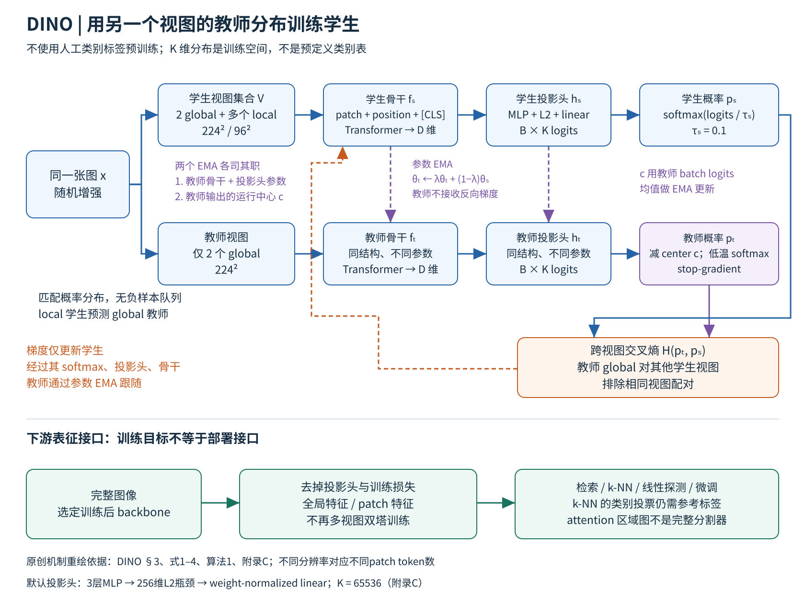

# DINO：让学生猜动量教师对另一个裁剪的输出分布，自监督 ViT 的注意力自己分出了物体

> 状态：技术精读 · 原文 arXiv:2104.14294v2 · 未复现

## 一句话

Caron 等（2021，Facebook AI Research 与 Inria）把同一张图的不同裁剪分别送进学生网络和教师网络，让学生的输出分布去匹配教师的输出分布。教师没有标签，也不是事先训练好的大模型，而是学生参数的指数滑动平均（EMA）。防止"所有图输出同一个结果"只靠对教师输出做中心化与锐化两步。不用任何标签在 ImageNet 上训练的 ViT-S/8，冻结特征只用 k 近邻就达到 78.3% top-1，最后一层的注意力还能把前景物体分出来。

## 它要解决的问题

**ViT 当时还没有显出优势。** [ViT](../vit/reading.md) 证明标准 Transformer 可以做视觉主干，但 DINO 的引言写道：ViT 与卷积网络相比还没有明显好处，计算更贵、要更多训练数据、特征也没有独特性质（§1）。ViT 用的是有监督预训练。作者的问题是：Transformer 在视觉中的成功有限，是否因为预训练用了监督？在语言里，BERT、GPT 的自监督目标比"一句话一个标签"提供更丰富的信号；图像级标签则把一张图里丰富的信息压成几千类中的一个概念。

**自监督视觉的主流方法都带着各自的防坍塌部件。** 坍塌（collapse，一句话：网络对所有输入输出同一个结果，"两个视图输出一致"的目标被平凡地满足）是这类方法的核心难点。对比学习（MoCo、SimCLR）用负样本，因而需要大批量或大字典；BYOL 不用负样本，靠在学生一侧加预测头（predictor）并依赖 BatchNorm；SwAV 把特征分配到原型上，用 Sinkhorn-Knopp 迭代让分配均衡。这些方法主要在 ResNet 上验证。DINO 要回答：能否用一个不需要负样本、预测头和 BatchNorm 的框架训练 ViT，并看看自监督 ViT 会出现哪些有监督 ViT 没有的性质。

在[视觉表征方向](../../fields/visual-representation/README.md)的主线里，DINO 是 2021 年"对 ViT 的四种回答"之一；另外三种是换成遮蔽重建的 [MAE](../mae/reading.md)、换成图文配对的 [CLIP](../clip/reading.md)，以及回头检验卷积网络的 ConvNeXt。

## 核心想法

增量不在架构上：骨干就是 ViT，论文也在 ResNet-50 上验证同一套方法。增量在训练信号的三个部件上。

1. **自蒸馏**（self-distillation，一句话：学生向一个由自己构造出来的教师学习，而不是向外部训练好的教师学习）。教师参数是学生参数的 EMA，动量 λ 从 0.996 按余弦升到 1。训练全程教师都强于学生（图 6），作者把它解释为 Polyak-Ruppert 平均：训练中持续构造一个模型集成，再用这个集成指导学生。蒸馏的一般形式见[知识蒸馏方向](../../../cross-domain/fields/knowledge-distillation/README.md)。
2. **只在教师一侧防坍塌**：先减去运行中心 c（centering），再用低温度 τₜ 做 softmax（sharpening）。两步一个抑制"某一维长期占优"，一个抑制"分布变均匀"。
3. **multi-crop**：每张图取两个 224×224 的全局裁剪和若干个 96×96 的局部裁剪；教师只看全局裁剪，学生看全部。学生因此被要求从局部小块推出与整幅图一致的分布，即"局部到全局"的对应。

## 机制

图中 B 是批量，K 是投影头输出维度（65536，不是 ImageNet 的 1000 类）。[可编辑 SVG](figures/dino.svg)。

### 1 前向与更新

学生和教师结构相同、参数不同，都是 g = h∘f：f 是骨干，取 ViT 最后一层的 [CLS] 表示；h 是投影头，三层 MLP（隐藏宽 2048）接 256 维 L2 归一化瓶颈，再接一个权重归一化的线性层输出 K = 65536 维（附录 C）。

- 学生：pₛ = softmax(gₛ(x′)/τₛ)，τₛ = 0.1。
- 教师：pₜ = softmax((gₜ(x) − c)/τₜ)，τₜ 在前 30 个 epoch 从 0.04 升到 0.07。
- 损失：对两个全局裁剪 x 和学生看到的每个其他裁剪 x′（排除同一个裁剪），求交叉熵 H(pₜ, pₛ) = −Σₖ pₜ,ₖ log pₛ,ₖ 的和（式 3）。

梯度只流进学生，教师一侧停止梯度。每步之后有两个独立的 EMA：教师参数 θₜ ← λθₜ + (1−λ)θₛ；中心 c ← m·c + (1−m)·（本批教师输出的均值）。前者平滑模型，后者平滑输出的偏置。

### 2 中心化与锐化为什么缺一不可（示例数值）

取 K = 3、一批两张图。教师对图 A 的 logits 为 [3, 1, 0]，对图 B 为 [2, 0, 1]，中心取这一批的均值 c = [2.5, 0.5, 0.5]。三种做法得到的教师目标：

| 做法 | 图 A 的 pₜ | 图 B 的 pₜ |
|---|---|---|
| 只锐化：不减中心，τₜ = 0.04 | [1.00, 0.00, 0.00] | [1.00, 0.00, 0.00] |
| 只中心化：减中心，τ = 1 | [0.42, 0.42, 0.16] | [0.21, 0.21, 0.58] |
| 两者都做：减中心，τₜ = 0.04 | [0.50, 0.50, 0.00] | [0.00, 0.00, 1.00] |

- 第一行：第 1 维在两张图上都偏大，低温度把它放大成独热，两张图被分进同一个"类"。学生只要永远输出第 1 维就能让损失为零，这是一维占优的坍塌。
- 第二行：减去均值后没有哪一维长期占优，但温度高，目标接近均匀分布（A 的熵 1.02，三类均匀分布为 ln 3 ≈ 1.10）。学生输出均匀分布就能满足，这是均匀坍塌。
- 第三行：两张图得到不同且明确的目标，学生必须区分它们。

原文 §5.3 把交叉熵分解为教师熵加 KL 散度，用图 7 展示了同样的互补关系：只做一种时，KL 都降到零，即学生与教师一致而且不依赖输入。

学生一侧：设学生对图 A 的另一个裁剪输出 logits [0.3, 0.2, 0]，除以 τₛ = 0.1 后做 softmax，pₛ ≈ [0.705, 0.259, 0.035]。与第三行的目标 [0.5, 0.5, 0] 比较，H = −(0.5 ln 0.705 + 0.5 ln 0.259) ≈ 0.85。梯度会把第 2 维往上推、第 1 维往下拉，直到两者都接近 0.5。目标来自教师对全局裁剪的判断，学生看到的却可能只是一个 96×96 的局部，这就是 multi-crop 要求的"从局部推出整体"。

### 3 训练完怎么用

投影头和损失只在训练时使用。评测时取骨干特征，不同协议取法不同（附录 F）：

- **k 近邻**（一句话：冻结特征，不训练任何参数，在有标签的训练集中找余弦相似度最高的 k 个样本加权投票）：取最后一层 [CLS]，k = 20，投票权重温度 0.07。
- **线性评测**：ViT-S 拼接最后 4 层的 [CLS]，得到 1536 维；ViT-B 拼接最后一层 [CLS] 与平均池化的 patch 特征。
- **密集任务**：取逐 patch 的特征，例如视频分割中按最近邻把首帧掩码逐帧传下去。

切块越小，token 越多。在 224 输入、V100、批量 128 的推理测量中，ViT-S/16 每图 197 个 token、约 1007 图/秒，ViT-S/8 为 785 个 token、约 180 图/秒（表 1）。主训练配方：ImageNet 去掉标签，AdamW，批量 1024，学习率 0.0005 × 批量/256，权重衰减从 0.04 升到 0.4（§3.2）。

## 证据：哪个实验支撑哪个主张

| 主张 | 支撑实验 | 怎么读 |
|---|---|---|
| 自监督 ViT 的冻结特征很强 | 表 2：ViT-S/16 线性 77.0、k 近邻 74.5；ViT-S/8 为 79.7、78.3；ViT-B/8 为 80.1、77.4 | 主表各方法训练长度不同（DINO、SwAV、MoCo-v2 为 800 epoch，BYOL 为 300，附录 D）；机制比较看统一 300 epoch 的表 7 |
| 动量教师是关键部件 | 表 7（ViT-S，300 epoch）：默认 k 近邻/线性 72.8/76.1；去掉动量教师 0.1/0.1 | 坍塌；同表 SwAV 不用动量也能训练，靠的是另一套均衡约束 |
| 教师可以有其他形式 | 图 6：复制学生、取上一次迭代的学生都是 0.1；取上一个 epoch 的学生 66.6；EMA 72.8 | 全部是 k 近邻；"上一 epoch"不坍塌，说明教师的设计空间不止 EMA |
| 损失与 multi-crop 的作用 | 表 7：去掉 multi-crop 降到 67.9/72.5；交叉熵换成 MSE 降到 52.6/62.4；加预测头 71.8/75.6 | 加 BYOL 式预测头没有帮助 |
| multi-crop 划算 | 表 8：2 个全局裁剪训练 300 epoch，线性 72.5、45.9 小时；再加 10 个局部裁剪训练 100 epoch，74.6、24.2 小时 | 两台 8 卡机器上的结果，后者峰值显存更高 |
| 中心化与锐化互补 | §5.3、图 7；附录 D：中心动量 0.999 坍塌；τₜ 固定为 0.08 坍塌，从 0.04 预热到 0.07 可以训练 | 经验上的稳定区间，不是收敛定理 |
| 注意力里有物体布局 | 图 4：PASCAL VOC12，保留 60% 注意力质量得到掩码，ViT-S/16 的 Jaccard 有监督 27.3、DINO 45.9 | 取各模型表现最好的头；附录 D 中 MoCo-v2、BYOL、SwAV 训练的 ViT-S 为 46.3–47.8 |
| patch 特征可以做对应 | 表 5：DAVIS-2017 视频分割，冻结 patch 特征最近邻传播，(J&F)m ViT-B/16 为 62.3、ViT-B/8 为 71.4 | 测的是帧间对应，不是专门训练的分割网络 |

## 局限与后续

**作者自述。** 结论（§6）把下一步写为"在随机、未筛选的图像上预训练更大的 ViT"。正文与附录写明的代价有：小切块很贵；中心动量和教师温度选错会坍塌；k 近邻和线性评测仍要用有标签的训练集。

站在现在看，同一团队的后续版本和其他团队的工作，暴露了 DINO 没有写出来的几处坑。

**1. 随机未筛选的数据会伤特征。** DINOv2（Oquab 等 2023，Meta AI Research 与 Inria，[arXiv:2304.07193](../arxiv-2304.07193/README.md)）在同样迭代数下训练 ViT-g：从同一来源随机抽 1.42 亿张未筛选图像时，ImageNet-1k 线性 83.3、iNaturalist 2018 为 68.0；换成按已有数据集检索筛选出的 LVD-142M，分别为 85.8 和 82.3（DINOv2 表 2）。ADE20k 分割是例外，未筛选数据略高（48.5 对 47.7）。`[判断]` DINO 结论里"随机未筛选"的设想被同一团队改成了"筛选"：自监督去掉了标注，没有去掉人对数据分布的选择。

**2. 只监督 [CLS]，密集特征靠"涌现"。** DINOv2 的损失是 DINO 的图像级项加 iBOT 的 patch 级项（学生输入里遮住一些 patch，让它在这些位置匹配教师的 patch 输出），再把中心化换成 SwAV 的 Sinkhorn-Knopp，并加 KoLeo 正则让一批特征分布得更均匀（DINOv2 §4）。`[判断]` 这三处替换各对着 DINO 的一项：目标只在图像级、中心化只减均值、特征可能挤在一起。

**3. 干净的注意力图其实是例外。** Darcet 等（"Vision Transformers Need Registers"，2023，FAIR 与 Inria，[arXiv:2309.16588](../arxiv-2309.16588/README.md)）发现，有监督（DeiT-III）、图文对比（OpenCLIP）、自监督（DINOv2）训练的大 ViT 都会在信息量低的背景处出现少量高范数 token：约占 2%，范数约为其他 token 的 10 倍，被模型挪去存放全局信息；它们只在 ViT-L 及更大的模型、训练进行到约三分之一之后出现。原始 DINO（ViT-B/16）没有这种伪影。依赖注意力图的无监督物体发现方法 LOST，在 DINOv2 上 VOC2007 的 corloc 只有 35.3，给模型加入几个专门存放全局信息的 register token 后升到 55.4，仍低于原始 DINO 的 61.9（Registers §1、图 4、表 3）。`[判断]` DINO 标题里的"涌现性质"与它的规模和训练长度绑在一起；模型更大、训练更长之后，要额外的 token 才能保住。

**4. 训练越久，密集特征反而退化。** DINOv3（Siméoni 等 2025，Meta AI Research，[arXiv:2508.10104](../arxiv-2508.10104/README.md)）报告：ViT-g 和 7B 模型的 ImageNet 线性分类随训练单调上升，Pascal VOC 上逐 patch 线性分割却在约 20 万次迭代后下降，7B 模型甚至跌到早期水平以下；原因是 patch 特征与 [CLS] 的相似度逐渐升高、局部性下降。他们用 Gram anchoring（让学生 patch 特征之间的相似度矩阵贴近早期教师的相似度矩阵）修复，并写明这一现象在 DINOv2 训练中已以较轻程度出现过；加入 iBOT 的局部损失只是开始解决，随着训练推进，全局表示仍会占上风（DINOv3 §4.1–4.2）。`[判断]` DINO 的图像级目标与密集特征之间存在张力，300–800 epoch、ViT-B 以下的规模还看不出来。

**5. 不变性由人选的增强决定。** I-JEPA（Assran 等 2023，Meta FAIR，[arXiv:2301.08243](../arxiv-2301.08243/README.md)）的引言指出：基于手工增强的不变性方法能得到语义层次高的表征，但引入的偏置可能对某些下游任务有害，也很难推广到音频等其他模态（§1）。I-JEPA 改为在表示空间里预测被遮块的表示，不用视图增强。相比之下，MAE 不做任何增强时微调仍有 84.0（MAE 表 1e）。`[判断]` DINO 学到的是对颜色抖动、裁剪缩放的不变性，需要颜色或精确位置的任务要靠 patch 级目标补回来。

**6. 没有语言接口，但差距不全在语言。** MMVP（Tong 等 2024，NYU 等，[arXiv:2401.06209](../arxiv-2401.06209/README.md)）反过来用 DINOv2 找 CLIP 的盲区：CLIP 余弦相似度高于 0.95、DINOv2 低于 0.6 的图像对，多模态大模型在上面经常答错；把 DINOv2 特征混入视觉输入能明显改善视觉定位。Web-SSL（Fan 等 2025，Meta FAIR 与 NYU，[arXiv:2504.01017](../arxiv-2504.01017/README.md)）在与 CLIP 相同的 MetaCLIP 20 亿张图像上训练 DINOv2 式模型，扩到 7B 参数时在 16 项 VQA 上平均追平 CLIP；同等条件下 CLIP 在 OCR 与图表类见长，DINO 式模型在以视觉为中心的类别见长（Web-SSL 图 3）。`[判断]` "自监督特征不适合做视觉语言模型的输入"，很大一部分是训练数据与规模的差别。

## 批注

**易误读**

- 78.3% 是 ViT-S/8 的 k 近邻结果；切块从 16 缩到 8，每图 token 数从 197 增到 785，推理吞吐降到约 1/5.6（表 1–2）。
- ViT-B/8 的线性评测（80.1）高于 ViT-S/8，k 近邻（77.4）却低于 ViT-S/8 的 78.3（表 2）。
- 线性评测对 ViT-S 和 ViT-B 取的特征不同（附录 F.2），两种尺寸的线性准确率不是"同一个特征换分类器"。
- 注意力 Jaccard 有两套阈值：正文图 4 保留 60% 注意力质量，附录 D 的方法对比写的是 80%，表中又重复了正文的部分数值；附录里 BYOL（47.8）、SwAV（46.8）、MoCo-v2（46.3）都略高于 DINO（45.9），这一性质是自监督 ViT 共有的（p8 图 4，p17 附录 D）。
- K = 65536 维的输出是学到的原型空间，不能读成校准过的类别概率。
- 本页的"DINO"指 2021 年这篇，与同名的检测器 DINO（DETR 系）无关。

**与其他论文的关联**

- [ViT 精读](../vit/reading.md)：DINO 的骨干与 [CLS] 设计都来自 ViT；ViT 结论中"自监督与有监督之间仍有很大差距"的问题由 DINO 和 MAE 接手。
- [MAE 精读](../mae/reading.md)：同为 2021 年 FAIR 在 ViT 上的自监督，MAE 预测像素、偏向微调，DINO 匹配教师分布、偏向冻结特征；两者的协议偏好见[视觉表征方向](../../fields/visual-representation/README.md)"主要路线与团队偏好"。Registers 附录 E 观察到 MAE 也没有高范数伪影，作者推测是因为 MAE 只有逐 patch 的局部损失。
- [CLIP 精读](../clip/reading.md)：CLIP 用文本给出语义锚点，DINO 没有；MMVP 与 Web-SSL 把两者当作互补的视觉输入。[OpenVLA](../../../robotics-embodied/papers/openvla/reading.md) 拼接 DINOv2 与 SigLIP 两路特征，是这种互补在机器人上的用法。
- 世界模型一侧，[DINO-WM](../arxiv-2411.04983/README.md) 与 [Back to the Features](../arxiv-2507.19468/README.md) 以预训练 DINO 特征为状态空间（据标题），依赖的正是本篇第 3 节的 patch 特征。

**未核实 / 待验证**

- DINOv2、Registers、DINOv3、I-JEPA、MMVP、Web-SSL 只核对了本页引用的段落与表格；文献卡见正文中的链接。
- LOST 的 61.9 由 Registers 表 3 的正文转引自 LOST 原文，未打开 LOST 原文核对。
- 数值出处与页码见[证据档案](evidence.json)。
