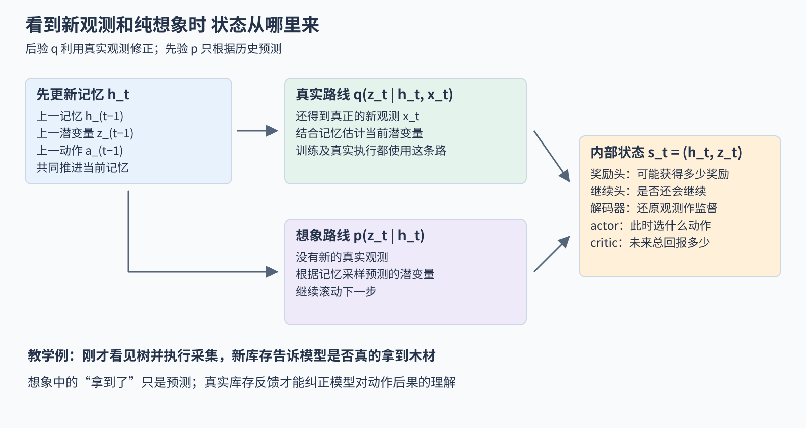

# DreamerV3：在学到的潜空间里想象练习，用一组尺度处理让同一套超参跨 150 多个任务

> 状态：逐步教学版精读 · 原文 arXiv:2301.04104v1 · 未复现

## 一句话

Hafner、Pasukonis、Ba、Lillicrap（2023，DeepMind 与多伦多大学）的 DreamerV3 先从自己的真实交互中学一个世界模型（一句话：给定当前内部状态和动作，预测下一状态、奖励和是否终止的网络），再在模型里滚动短的想象轨迹训练 actor 和 critic，然后回到环境执行、收集新数据。相对前代，它的增量主要在"让各种量的数值尺度不再依赖任务"：symlog 变换、two-hot 回归、带下限的回报归一化、KL balancing 加 free bits。v1 用一套固定的核心超参在 7 类基准、150 多个任务上训练（每个任务单独训练一个智能体），并在 Minecraft 中不用人类数据第一次拿到钻石：40 次训练里有 24 次至少一局达到含钻石的最高里程碑。

## 它要解决的问题

"用学到的模型产生额外经验"不是新想法。Sutton 的 Dyna（1991）已经把真实交互、模型学习与模型内规划结合起来；[World Models](../../../robotics-embodied/papers/arxiv-1803.10122/README.md)（Ha、Schmidhuber 2018）在 VAE 潜变量上学动力学，让策略在"梦里"训练；[PlaNet](../../../robotics-embodied/papers/arxiv-1811.04551/README.md)（Hafner 等 2019）从像素学 RSSM 潜在动力学并在潜空间里做规划；Dreamer（[arXiv:1912.01603](https://arxiv.org/abs/1912.01603)）改为在想象中学 actor-critic；DreamerV2（[arXiv:2010.02193](https://arxiv.org/abs/2010.02193)）换成离散潜变量，把这条路线推进到 Atari。

卡住的是"换一个领域就要重新调参"。引言写明：现有强化学习算法用在与开发时相似的任务上没问题，换到新领域却需要大量专家经验和试验（摘要、§1）。不同任务的画面复杂度、奖励大小与稀疏程度、动作类型（离散按键还是连续关节）差别很大，世界模型、critic 和 actor 的各项损失在不同任务上的相对大小随之漂移。DreamerV3 要回答：能否用一组固定的核心超参，在从机器人控制到 Minecraft 的各类任务上都学得好？这与 [PPO](../../../llm/papers/ppo/README.md) 一类无模型算法的处境一样；v1 在图 1 与 Crafter 等基准上与 PPO 对照，v2 在每个基准上都跑了 PPO。

## 核心想法

1. **沿用 Dreamer 的三件套。** RSSM 世界模型（确定性的 GRU 记忆 + 32 组×32 类的离散随机潜变量），想象 15 步的 actor-critic，部署时 actor 直接出动作、不做在线搜索。
2. **把所有"数值尺度"变成与任务无关。** 奖励与价值在 symlog 空间里用 255 个桶的 two-hot 分类回归；actor 的回报按 5%–95% 分位范围归一化，分母下限为 1；世界模型的两个 KL 项分开加权（KL balancing），并在 1 nat 以下截断（free bits）；分类分布混入 1% 均匀分布。
3. **规模化。** 8M 到 200M 参数的 5 个规模上，更大的模型既得分更高，也需要更少的真实交互（图 6）。

附录 D 的消融显示，这几项都有贡献，其中 two-hot 回归和分母下限在稀疏奖励任务上影响最明显（见第九节）。

## 一图先看清 它怎样学习

图1　原创教学总览。左边是真实数据教模型预测，中间是模型教策略选择，右边是策略回到环境执行。三部分循环进行，世界模型随新数据持续更新。

三个部件各管一件事：**世界模型**回答"这样做后可能发生什么"；**actor** 回答"现在选哪个动作"；**critic** 回答"从这里继续行动，预计总共还能得到多少回报"。

部署时 actor 根据当前内部状态直接选择动作，不做搜索树，也不在线优化动作序列。"先想后练"的工作都发生在训练期间，然后被学进策略网络里（原文 pp.3–7）。

下文用一个简化的采矿例子贯穿：看见树、靠近、采集、库存多了木材、用木材做工具，最终想拿到地下的钻石。例子只为教学，原论文 Minecraft 实验的具体设定见第八节。

## 一 记号：把采矿例子写成强化学习的变量

观测 x_t 是当下读到的信息（屏幕、库存计数等）；动作 a_t 是前进、转向、采集、制作之类的离散选项，在机器人任务里则是连续的关节目标；奖励 r_t 例如首次得到木材 +1、首次做出工具 +1、最后拿到钻石；继续标志 c_t 为 1 表示本局继续、为 0 表示终止。一条转移 (x_t, a_t, r_t, c_t, x_{t+1}) 存进经验回放缓冲区，训练时取的是连续片段：模型要学"先采集、再转身、再制作"这类先后后果，打散的单步样本学不到。

Dreamer 维护自己的**内部状态**：由历史观测与动作更新出的一组数。它不是游戏引擎的真状态，也不逐维对应"坐标""工具耐久"这样的人工变量；对它的要求只是保留足够的信息去预测未来、选择动作。

数据收集与训练交替进行：当前 actor 在环境里收集数据，世界模型和 actor-critic 在回放数据上更新，二者的比例由"训练比例"控制（原文附录 A、C）。

## 二 为什么要先学后果

### 直接学动作与先学后果的差别

无模型强化学习（例如 PPO）只从真实的成功和失败里改进策略，不显式预测下一观测。Dreamer 先学"当前内部状态加某个动作，会变成什么状态、得到多少奖励、是否结束"，学到之后，同一段真实经验可以支持许多次内部练习：已经见过靠近树和采集木材，就能在模型里滚动若干种不同的动作序列，为策略提供更多学习信号。代价是策略会被模型的预测误差误导（见"局限与后续"第 1 条）。

### 为什么不必把每一步都画成视频

一张 64×64 彩色图有 12,288 个像素通道值，大部分是地面纹理、光照这类与决策关系不大的细节。Dreamer 把观测编码成紧凑的内部表示，在这个表示里预测下一步，称为**潜在动力学**（"潜在"指这些量是模型学出的隐藏表示，"动力学"指状态如何随时间和动作变化）。

Dreamer 有把内部状态还原成图像或向量的解码器，训练时用来逼表示保留观测信息；actor 和 critic 在想象中学习时只用内部状态和预测的奖励，不需要每一步都解码成 RGB 再编码回去。这是潜空间想象省计算的主要原因（原文 Fig.3、Eq.3）。

## 三 内部状态为什么分成记忆和随机表征

### 先记住刚才发生的事

世界模型是 RSSM（循环状态空间模型）。内部状态写作 s_t = (h_t, z_t)：h_t 是确定性的循环记忆，z_t 是随机潜变量。记忆更新为：

h_t = f_φ(h_(t−1), z_(t−1), a_(t−1))

f_φ 是参数为 φ 的记忆网络（实现上是 GRU）。放回采矿例子：模型记得"面前有树，手里没有工具"，刚执行了采集；即使新图像还没到，它也应该更新对当前情况的预期（原文 Eq.3、附录 B）。

### 有真实观测时用后验，没有时用先验

这是整篇最值得慢下来读的区别。与环境交互时，模型拿到新观测 x_t，结合记忆推断 z_t：

z_t ∼ q_φ(z_t | h_t, x_t)

这叫后验。在想象里没有新画面，只能根据记忆预测：

ẑ_t ∼ p_φ(ẑ_t | h_t)

这叫先验（动力学预测）。两条路都产生潜在表征，信息来源不同：训练和真实执行时用真实观测，向未来做纯模型滚动时只靠先验（原文 Eq.3）。

图2　原创机制拆解。两条分支是不同的信息条件。上支的真实观测可以纠正预测；下支把模型自己的预测继续用于下一步想象。

沿绿色分支走一次：采集后真实库存出现木材，后验据此修正"采集成功"的判断。沿紫色分支走一次：没有真实库存反馈，模型只能预测木材是否增加；猜错了，后面的想象就沿着错的状态继续。

`[结构]` 这与卡尔曼滤波的"预测—用测量修正"同形：先验对应预测步，后验对应量测更新步。区别在于转移模型、观测模型和状态的含义都由网络从数据中学出，而不是由已知的物理方程给定。

### 为什么 z 是离散的

v1 默认用 32 组分类潜变量，每组 32 类（原文 Table W.1）。每一组是模型学到的一个离散选择，含义由训练形成，不是人工指定的 32 项游戏属性。离散采样不能直接求导，论文用 straight-through 估计：前向时做离散选择，反向时用连续概率的梯度近似传递。这是有偏的梯度估计。

## 四 世界模型通过什么目标学会预测

### 三个预测头各补一个缺口

从 s_t = (h_t, z_t) 出发，模型做三类预测。**重建观测**，要求状态别把"有没有树""库存有几块木材"等输入信息丢掉。**预测奖励**，否则模型只会预测未来，不知道哪种未来值得追求。**预测是否继续**：如果玩家已经死亡，却仍把后续钻石奖励加进价值，策略就会高估危险动作；实现中还要区分环境真正终止和人为的时间截断（原文 Eq.3–5）。

### 内容要丰富，又要可预测

只有重建目标，模型可能把容量花在随机纹理上；只有"未来要容易预测"的目标，模型又可能把所有状态压成一个常量。DreamerV3 单时刻的世界模型损失可概括为：

L_WM = L_pred + 0.5 L_dyn + 0.1 L_rep

L_pred 汇总观测、奖励和继续标志的负对数似然；L_dyn 要求动力学先验追上后验；L_rep 要求后验表示别变得过于难以预测。原文 Eq.4 还对一段时间求和、并对潜变量采样取期望。继续标志是二分类，向量重建和奖励、价值各有自己的数值处理（原文 Eq.4–5、附录 C、E）。

### KL balancing：同一个 KL，两条梯度路径

比较先验 p 与后验 q 用 KL 散度。**示例数值**：只考虑两类，若后验认为"采集成功/未成功"的概率为 (0.9, 0.1)，先验为 (0.6, 0.4)：

KL(q ‖ p) = 0.9 ln(0.9/0.6) + 0.1 ln(0.1/0.4) ≈ 0.226

论文把它写成两项：

L_dyn = max(1, KL[sg(q) ‖ p])

L_rep = max(1, KL[q ‖ sg(p)])

sg 是 stop-gradient，把括号里的分布当作固定目标。第一项只让预测分布 p 向 q 靠近，第二项只让表示 q 适度向可预测的 p 靠近。两项数值相同，梯度走不同的路径，再配 0.5 与 0.1 的权重，就是 KL balancing（原文 Eq.5）。

### free bits：KL 低于 1 nat 就不再施压

上面的算例 KL ≈ 0.226，取 max 后是 1。KL 从 0.226 再降到 0.1，这一项仍为 1，不再产生梯度。模型因此不会为了让先验后验更接近而把表示越压越空。阈值 1 nat 约 1.44 bits（nat 是以自然对数计的信息单位）（原文 pp.5–6）。

分类分布还混入 1% 的均匀分布：某类原本被预测为几乎为零，混入后保留一个很小但非零的概率，避免对数和 KL 出现极端值（原文附录 C）。

## 五 "想象"如何改善动作

### 从真实经历中的状态起跑

从回放中某个后验状态出发（例如"刚拿到木材"），actor 选动作，模型用先验预测下一潜在状态、奖励和继续概率，actor 再在新状态上选动作。如此反复得到一小段想象轨迹，只含内部状态、动作、预测奖励与继续概率。起点锚定在真实经验里，但滚动几步后仍可能离开模型熟悉的区域（原文 Fig.3、pp.6–7）。

### actor 和 critic 各学什么

actor 写作 a_t ∼ π_θ(a_t | s_t)，critic 写作 v_ψ(s_t)。φ、θ、ψ 分别属于世界模型、actor、critic。奖励头回答"这一步预计得到什么"，critic 回答"从这里按当前策略继续，长远总共能得到什么"：拿到木材的即时奖励可能只有 1，但它打开了做工具、采石、采铁的后续机会。

折扣回报 R_t = r_t + γr_(t+1) + γ²r_(t+2) + …，实际计算还要乘继续因子；v1 取 γ = 0.997。**示例数值**：未来三步奖励为 0、0、10，取 γ = 0.9，回报为 0 + 0.9×0 + 0.9²×10 = 8.1。

### 想象很短，怎么学很长的任务

论文默认想象 15 步转移，正文按含起点的 16 个状态书写（原文 Eq.7、Table W.1）。15 步不够从空手挖到钻石，于是让 critic 给短轨迹的末端接上长期价值估计，再往前传播，即 bootstrapping。论文用 λ-return：

R_t^λ = r_t + γc_t[(1 − λ)v_ψ(s_(t+1)) + λR_(t+1)^λ]，末端 R_T^λ = v_ψ(s_T)

λ 靠近 0 时更依赖一步之后的 critic 估计，靠近 1 时更多利用短轨迹上的后续奖励。v1 取 λ = 0.95。

图3　原创数值示意。为方便心算，图中用 γ = 0.9、λ = 0.5，不是论文默认值。

代入图中的数：当前奖励 1，继续概率 1，下一状态 critic 估计 4，更后面的混合回报 6。后续部分 0.5×4 + 0.5×6 = 5，结果 1 + 0.9×1×5 = 5.5。若当前已终止，c_t = 0，结果只剩 1。继续预测因此直接决定了回报。

### 谁把这个 5.5 学进去

critic 以算出的回报为目标回归，目标路径停止梯度，以免网络靠移动目标本身减小误差；actor 提高带来较高回报的动作概率，并保留一定随机性。离散动作用 REINFORCE 类梯度估计；连续动作可以经由已学动力学做随机反向传播（原文 p.7）。三组参数的职责分开：世界模型只按真实经验的目标学习，不会为了让 actor 得分更高而"把未来说得更美好"。

## 六 为什么花这么多篇幅谈数值尺度

### 同一套损失，换个奖励单位就变样

一个游戏奖励只有 0 和 1，另一个动辄上千分。原始奖励直接做平方误差，后者的梯度会大得多；策略目标里"多拿奖励"与"保持探索"的相对强弱也会随奖励单位改变。要让同一组核心设置跨任务使用，就必须处理这些尺度。这是 V3 相对前代的主要贡献。

### symlog：保留符号，压缩大数

symlog(y) = sign(y) · ln(1 + |y|)，逆变换 symexp(u) = sign(u) · [exp(|u|) − 1]（原文 Eq.1–2）。

**示例数值**：symlog(0) = 0，symlog(1) ≈ 0.693，symlog(1000) ≈ 6.909，symlog(−1000) ≈ −6.909。相差 1000 倍的 1 和 1000，变换后只差约 10 倍，负奖励仍在负的一侧；对 6.909 做 symexp 又还原出约 1000。观测输入的 symlog 只用于向量观测，纯图像环境不做这一步（附录 E）。

### two-hot：把一个连续目标分给相邻两个桶

奖励头和 critic 在 symlog 空间里预测 255 个桶上的概率分布，桶范围 −20 到 20，用相邻两桶的软标签训练（原文 Eq.8–10）。

**示例数值**（用简化刻度）：变换后的目标是 2.3，相邻两个桶中心是 2 和 3，则桶 2 的目标权重 0.7、桶 3 为 0.3，其余为 0；0.7×2 + 0.3×3 = 2.3，没有被四舍五入。若网络给这两个桶的概率是 p_2、p_3，这个样本的交叉熵损失为 L = −0.7 ln p_2 − 0.3 ln p_3。论文 255 桶的真实间距不是 1。

读出数值时，v1 先求桶中心的概率加权平均，再做 symexp；先平均再逆变换，顺序不能交换。two-hot 处理的是奖励与价值的回归，与连续动作的表示、z 的 32×32 分类表示是三处不同的"离散"。

### 只缩小大的回报，不放大小回报里的噪声

actor 目标里有熵正则（鼓励动作分散，系数 η）。为了让回报与熵的权衡跨任务稳定，论文估计想象回报的尺度 S（一批回报的 95% 分位数减 5% 分位数，再做滑动平均），用 max(1, S) 作分母（原文 Eq.11–12）。

**示例数值**：S = 100 时，回报差 50 缩为 0.5；S = 0.01 时，回报差 0.001 除以 max(1, 0.01) = 1，仍是 0.001，不会被放大成 0.1。几乎还没发现奖励时，微小的回报差异主要来自模型噪声，放大它会让策略过早认定某个没有证据的动作最好、停止探索。在这一处理下，论文用固定的 η = 3×10⁻⁴。

### 其他稳定措施

奖励头与 critic 的输出层零初始化，减少一开始就估出巨大收益的情况；critic 还向自身参数的指数滑动平均版本的预测靠拢，缓和目标不断变化的影响（原文 pp.6–8、附录 C）。

## 七 把整套训练再走一遍

第一阶段，当前 actor 在游戏里行动，保存画面、库存、动作、奖励和继续标志。早期数据可能很差，但仍告诉模型"这个动作在这类场景下实际产生了什么"。

第二阶段，从回放里抽连续片段。真实观测经后验形成状态；动力学先验学习预测这些状态；重建、奖励和继续目标共同约束表示。

第三阶段，从这些真实片段的内部状态出发，actor 与先验交替滚动出短想象轨迹；奖励头与继续头给信号，critic 补上尾部的长期估值；算出 λ-return 后训练 critic，再改进 actor。

第四阶段，改进后的 actor 回到游戏执行。它可能做对过去做不好的动作，也可能因为模型误差做错；新观测暴露这些误差，进入回放，下一轮世界模型再修正。循环是否良性，要看真实回报是否改善，而不是想象中的分数。

图4　专题机制图。可把图中的 RSSM、KL、symlog、two-hot 与 λ-return 对应到前面的例子；箭头表示流程，不表示所有模块共享梯度。

## 八 实验结果逐项该怎样读

### "一个算法通用"指每个任务单独训练

v1 在 7 类基准和 Minecraft 上评估，超过 150 个任务，**每个任务分别训练一个智能体**。"固定超参数"指世界模型与 actor-critic 的核心设置共享；模型大小、训练比例、环境步数、并行环境数随基准不同（原文 Table A.1、W.1）。这组核心设置先在视觉控制与 Atari 200M 上共同选定，再用于 Crafter、BSuite、Minecraft 等新领域，不再逐领域调整（附录 C）。每个智能体在一张 V100 上训练（Table A.1）。

### 连续控制

低维本体感觉控制 18 个任务、50 万环境步，DreamerV3 平均 743.1，D4PG 721.0；视觉控制 20 个任务、100 万环境步，DreamerV3 平均 739.6，DrQ-v2 677.4（原文 Tables O.1、Q.1）。两组任务构成不同，743.1 与 739.6 不能相减得出"加上视觉只掉 3.5 分"。

### Atari：均值与中位数都要看

Atari 200M（55 个游戏）人类归一化中位数 302%，DreamerV2 为 219%；归一化均值 920%，反而低于 DreamerV2 的 1149%（原文 Table V.1）。人类归一化分数以随机策略和人类表现为两个参照点；中位数反映典型游戏，均值容易被少数极高分游戏拉动。

Atari 100k 中 v1 报告人类归一化均值 112%、中位数 49%。100k 指动作重复之后的智能体决策步数，对应 400k 原始帧，混用 frames 与 agent steps 会把数据预算看错四倍。同表 EfficientZero 更高，它使用在线树搜索等不同设置（原文 Tables S.1、T.1）。

### Minecraft 里拿到多少次钻石

40 个训练 seed 各跑 1 亿环境步。24 个 seed 至少一局达到含钻石的最高里程碑分，全部 seed 合计 50 局，首次出现在 2930 万步（原文 p.10、附录 G）。所以 60% 指"训练运行至少一次达到"，不是"每局采到钻石的成功率"。从村庄箱子里偶然捡到钻石、但没达到最高里程碑分的局不计入。

### 环境设置决定"从零学习"的含义

12 个物品里程碑各奖励一次 +1，生命变化给很小的正负奖励。输入除 RGB 外还有库存计数、历史最大库存、当前装备，以及健康、饥饿、呼吸。动作整理成 25 个离散选项，不是原版键鼠的全部操作（原文附录 F）。方块破坏速度设为 100 倍：随机策略很难连续许多步保持同一个挖掘动作，而短暂切换会重置进度。训练不用人类示范，但有设计过的动作接口、辅助观测和中间奖励。

### 模型越大越省数据

在 8M 到 200M 参数的 5 个规模上，若干任务显示更大的模型最终得分更高，达到同样表现需要的真实交互也更少；提高训练比例也改善数据效率（原文 Fig.6、Table B.1）。省的是真实交互，不是计算：更大的模型和更高的回放训练比例都要更多算力。训练比例是回放步数与策略决策步数之比，存在动作重复时不等于与原始帧数之比（Table A.1 注）。

## 九 消融检验了哪些设计

### 不平衡 KL 或取消 free bits

取消 KL balancing 会拖慢学习；取消 free bits 会损害部分简单环境，支持"不要持续压缩已经足够匹配的表示"这一动机（原文 Fig.D.1）。这是特定任务与配置上的趋势，原文没有给出统一的百分点。

### 只做连续 symlog 回归够不够

奖励与价值头的消融比较了连续回归与 two-hot 离散回归，以及其他尺度变换和运行中的奖励归一化。two-hot 在所测任务中贡献明显，尤其是奖励稀疏、回报分布集中在失败和成功两端时，保留分布比硬拟合一个数更有帮助（原文 Fig.D.2、附录 E）。

### 取消分母下限会伤害探索

NoDenomMax 消融直接除以分位范围（加一个很小的数防止除零），不再以 1 为下限：大回报缩小，小回报也被放大。稀疏奖励任务中，几乎没学到真正奖励时的微小差异被放大，策略过早变得确定（原文 Fig.D.3）。这正对应第六节 0.001 除以 0.01 的算例。

### 不是每项替换都有明显差距

用慢 critic 计算回报目标，与用当前 critic 计算目标再向慢 critic 正则化，作者报告两者实践中表现相近（原文附录 C、Fig.D.2）。

## 证据：哪个实验支撑哪个主张

| 主张 | 支撑实验 | 怎么读 |
|---|---|---|
| 一套核心超参跨领域可用 | 7 类基准、150 多个任务（Tables O–V）；超参只在视觉控制与 Atari 上选定（附录 C） | 每个任务单独训练；模型规模、训练比例随基准变 |
| 连续控制领先 | 本体 18 任务 743.1 对 D4PG 721.0；视觉 20 任务 739.6 对 DrQ-v2 677.4 | 两个任务集不能相减 |
| Atari 上典型游戏更好 | 200M 中位数 302% 对 DreamerV2 219%；均值 920% 对 1149% | 聚合方式改变结论 |
| 不用人类数据拿到钻石 | 40 seed 中 24 个至少一局达到最高里程碑分，合计 50 局 | 破坏速度 ×100、25 个离散动作、辅助观测 |
| 尺度处理是关键 | 附录 D：去掉 KL balancing、free bits、two-hot、分母下限都会在部分任务上变差 | 曲线趋势，非统一数值 |
| 规模化有回报 | 图 6：8M–200M 五个规模，越大越省真实交互 | 有限规模、有限任务上的趋势 |

## 局限与后续

**作者自述（v1 §结论）。** Minecraft 中 1 亿步内只是"有时"拿到钻石，而人类专家通常在所有世界里都能拿到；为了让随机策略能学会，把方块破坏速度调快了；规模化趋势能外推多远需要更大规模的实现；每个任务单独训练一个智能体，作者把"训练更大的模型在重叠领域上解决多个任务"列为后续方向。

站在现在看，后续工作和竞争团队暴露了几处论文没有写明的坑。

**1 模型误差被策略利用。** 假设模型很少见过悬崖，在想象里预测往前走能更快到矿区、继续概率也很高；actor 发现这条路线回报高，越来越爱往前走，真实执行却掉下悬崖。想象回报上升而真实回报下降，原因可能恰恰是 actor 太善于利用模型的漏洞：模型在训练分布附近有效，不保证在策略主动寻找的边缘区域也准确。单步预测准也不够，第一步偏一点，后面在偏移状态上继续预测，误差逐步放大。检验世界模型因此要同时看三件事：给定真实起点和动作序列，多步预测偏离实际多少；模型认为更好的动作在真实环境里是否也更好；三者共同更新时真实回报是否改善。v1 的实验只报告最后一项。

**2 真机：同一个算法，问题换了一批。** [DayDreamer](../../../robotics-embodied/papers/arxiv-2206.14176/README.md)（Wu、Escontrela、Hafner 等，UC Berkeley，2022，基于 DreamerV2 的官方实现）把 Dreamer 直接放到 4 台真机上在线学习、不用仿真器：Unitree A1 从仰躺开始，约 5 分钟学会翻身落地、再过约 20 分钟学会站立、约 1 小时学会以跳跃步态前进；之后用长杆反复推倒它，10 分钟内学会抗推或快速翻回；同样条件下 SAC 只学会翻身，作者还得手动帮它解开卡死的腿部姿态（§3.1、图 4）。对训练过四足策略的读者，值得注意的是正文之外的工程：电机以 20 Hz 接收关节角目标、由硬件 PD 控制器执行，用 Butterworth 滤波器滤掉高频指令保护电机；奖励是 5 项之和、逐级门控（直立、髋、肩、膝的姿态、前向速度，前一项满足到 0.7 后下一项才激活，否则为 0）；机器人走到训练区边缘时人工干预。作者自述的局限是长时间真机学习会磨损硬件、需要人工干预或维修。`[判断]` "不用仿真、1 小时学会走"成立的前提是人写的分阶段奖励和底层 PD 控制；DreamerV3 v1 的 150 多个任务全在仿真与游戏中，没有回答真机上的安全与磨损问题。

**3 竞争团队指出的弱项。** UCSD 的 [TD-MPC2](../../../robotics-embodied/papers/arxiv-2310.16828/README.md)（Hansen、Su、Wang，ICLR 2024）走另一条路：不学解码器，在潜空间里做规划。它在 104 个连续控制任务上与 DreamerV3 对照，写明 DreamerV3 在 Dog 任务上偶有数值不稳定，在需要精细物体操作的任务（lift、pick、stack）上普遍吃力，在 Meta-World 的难任务上常不收敛（§4.1、图 5、图 13）；同时指出对照用的 DreamerV3 约 2000 万参数、更新与数据比为 512，而 TD-MPC2 默认为 1。TD-MPC2 也承认 DreamerV3 在 Atari、Minecraft 这类离散动作任务上很强，而它自己扩展到离散动作仍是开放问题（§5）；在 10 个视觉 DMC 任务上两者相当（图 10）。`[判断]` "一套超参跨领域"的说法在接触丰富的连续操作上有缺口，高训练比例意味着每一步真实数据背后有大量计算。

**4 作者自己的后续版本。** arXiv v2（2024 年 4 月）改为 10 个 seed 报告 Minecraft，写明全部智能体都在 1 亿步内拿到钻石；与 VPT 对照时写明 VPT 用人类键鼠数据做行为克隆再强化学习、720 张 GPU 训练 9 天，Dreamer 不用人类数据、1 张 GPU 训练 9 天（v2 结果与 Previous work 两节）。v2 结论把"从互联网视频学世界知识""跨领域学单一世界模型"列为后续方向。2025 年 4 月发表于 Nature 的版本（[Mastering diverse control tasks through world models](https://www.nature.com/articles/s41586-025-08744-2)）同样报告所有训练运行都发现了钻石，读出方式也变了：v1 先对桶中心求期望再做 symexp，Nature 版直接对 symexp 变换后的桶位置加权平均，两者一般不等价，复制公式时要固定版本。

**5 世界模型的主线换了出发点。** `[判断]` 2024 年后受关注的大规模世界模型多出自视频生成团队，目标是可交互、长时一致、可编辑（[观点页：生成收敛](../../../perspectives/generative-convergence.md)"从视频生成到世界模型"、[Genie](../arxiv-2402.15391/README.md)），用法也从"在模型里训练策略"转向"为模仿学习训练的 VLA 做评估和数据合成"（[机器人世界模型方向](../../../robotics-embodied/fields/world-models/README.md)趋势 2）。原因之一正是本篇的局限：每个任务单独训练、需要人写奖励，而 VLA 没有可以在想象中优化的奖励函数。Dreamer 一线的 RSSM、两个 KL 的平衡和尺度处理，仍是"在想象中学策略"这条路线的基线。

### 直接后继：从在线 RSSM 到离线可扩展视频动力学

[Dreamer 4](../arxiv-2509.24527/README.md)（2025）保留“在模型内学习行为”，把动力学改成 Transformer 与连续视频 token，并用 shortcut forcing 兼顾少步生成和抗历史误差；其关键验证变为纯离线 Minecraft 数据训练。它适合接在本篇后读：先比较表示与动力学，再比较训练数据是否来自当前策略，最后比较控制结果。更广的统一视频–动作接口见 [Cosmos 3](../arxiv-2606.02800/README.md) 与[世界模型方向](../../fields/world-models/README.md)。

## 批注

**易误读**

- "超过 150 个任务"是每个任务各训练一个智能体，不是一个模型零样本玩遍所有领域（附录 A）。
- 24/40 是训练运行的比例，不是每局成功率（附录 G）；v2/Nature 的"全部 seed 拿到钻石"是另一组实验（10 个 seed），不能与 v1 的数字拼在一起。
- Atari 100k 的 100k 是智能体决策步，对应 400k 原始帧。
- 输入 symlog 只用于向量观测（附录 E）；two-hot 的 255 桶用于奖励与价值，不用于动作或潜变量。
- 15 步想象与 16 个状态说的是同一件事（含起点）；具体起止索引以代码为准。
- 本页的采矿例子、KL 两类算例、λ-return 图中的 γ = 0.9、λ = 0.5 都是教学构造，不是论文设定。

**与其他论文的关联**

- [机器人世界模型方向](../../../robotics-embodied/fields/world-models/README.md)把本篇作为"在想象中学策略"的基线（主线第 2 步与 [Baseline 页](../../../robotics-embodied/fields/world-models/BASELINES.md)），本页第八节是那里引用的实验解读；[模仿与强化学习方向](../../../robotics-embodied/fields/imitation-reinforcement-learning/README.md)把它列为离线 RL 与世界模型的入口。
- [PlaNet](../../../robotics-embodied/papers/arxiv-1811.04551/README.md) → Dreamer → DreamerV2 → 本篇 → [DayDreamer](../../../robotics-embodied/papers/arxiv-2206.14176/README.md)：同一作者的 RSSM 一线；[TD-MPC2](../../../robotics-embodied/papers/arxiv-2310.16828/README.md) 是无解码器、部署时规划的对照路线。
- [PPO](../../../llm/papers/ppo/README.md)：本篇的无模型对照之一；附录 D 的 AdvantageStd 消融把第六节的回报归一化换成 PPO 常用的优势标准化，两者处理的是同一类尺度问题。
- [世界模型方向（多模态）](../../fields/world-models/README.md)与 [Genie](../arxiv-2402.15391/README.md)：从视频生成出发的世界模型，与本篇"为控制而学"的出发点不同。

**未核实 / 待验证**

- Nature 版只核对了版本差异、Minecraft 统计口径与读出公式，补充材料没有逐项精读；当前官方代码是否对应 v1 没有核对。
- Dyna、World Models、Dreamer、DreamerV2 原文本页没有打开，历史定位依据本篇的相关工作一节与对应文献卡。
- 附录 I–V 的逐任务曲线没有数字化。
- 数值出处见[证据档案](evidence.json)；许可与归属见 [ATTRIBUTION.md](ATTRIBUTION.md)。图 1–3 为原创教学图，图 4 复用专题机制图并调整字号：[总览](figures/dreamerv3_overview-beginner-20261002.svg) · [后验与先验](figures/dreamerv3_posterior_prior-beginner-20261002.svg) · [回报算例](figures/dreamerv3_returns-beginner-20261002.svg) · [完整机制](figures/dreamerv3_mechanism-beginner-20261002.svg)。
