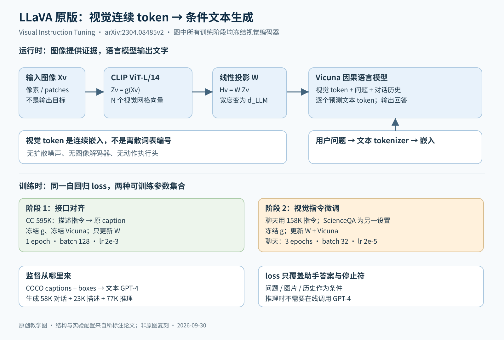

# LLaVA：一个线性投影把 CLIP 的视觉特征接进 Vicuna，再用纯文本 GPT-4 造出的 15.8 万条视觉指令数据微调

> 状态：技术精读 · 原文 arXiv:2304.08485v2（NeurIPS 2023）· 未复现

## 一句话

Liu、Li、Wu、Lee（2023，UW–Madison、Microsoft Research、Columbia）把冻结的 CLIP ViT-L/14 输出的 256 个图像块特征，经一个可训练的线性层投影成"像词嵌入一样"的向量，放在问题前面送进语言模型 Vicuna；训练数据由只看文字的 GPT-4 根据 COCO 的图像描述和目标框改写而成。结构几乎是最简的，增量在数据：没有指令微调时，自建评测上的相对得分是 21.5，用全部 15.8 万条数据微调后是 85.1。数据、模型和代码全部公开，此后的开源视觉语言模型大多从这套配方出发。

## 它要解决的问题

**语言一侧已经证明了指令微调。** [InstructGPT](../../../llm/papers/instructgpt/README.md) 一类工作说明，用"指令 + 期望回答"的数据微调语言模型，能让它在没见过的任务上按指令回答；Vicuna 是 LLaMA 在这类对话数据上微调的开源模型。

**视觉一侧有对齐，没有指令遵循。** [CLIP](../clip/README.md) 让图像特征与文字语义对齐，但它的接口是"给一张图和几段文字，算相似度"，不会回答问题。Flamingo、BLIP-2 已经把视觉编码器接到语言模型上，训练数据却是图文对，模型倾向于描述图像，而不是按用户的要求回答：论文表 3 中，问"这张图有什么不寻常"，BLIP-2 答"一个男人坐在黄色出租车后面"，OpenFlamingo 答"这个男人在车引擎盖上晾衣服"。

卡住的是数据：多模态的指令数据要靠人工众包，成本高、定义也模糊（§3）。论文要回答：能否用现成的纯文本大模型，把已有的图文标注改写成视觉指令数据？用这种数据微调一个结构很简单的模型，能否得到一个能对话、能推理的视觉助手？

## 核心想法

1. **数据：让看不到图的 GPT-4 出题和作答。** 把图像写成文字（若干条描述 + 带类别的目标框坐标）交给 GPT-4，配少量人工写的示例，生成三类数据：对话 5.8 万、详细描述 2.3 万、复杂推理 7.7 万，共 15.8 万条，约 8 万张不同的 COCO 图（§3、§5.1）。
2. **结构：最简单的连接器。** 冻结的 CLIP 视觉编码器 + 一个线性投影 + Vicuna。作者写明选线性层是因为它轻，便于快速迭代以数据为中心的实验，Flamingo 的门控交叉注意力、BLIP-2 的 Q-Former 这类更复杂的连接方式留作后续（§4.1）。
3. **训练：两阶段。** 第一阶段只训练投影层，把它当作"给冻结语言模型配一个兼容的视觉分词器"；第二阶段投影层与语言模型一起训练，视觉编码器始终冻结（§4.2）。

## 机制

上半图是推理时的信息流，下半图是两个训练阶段各更新哪些参数。GPT-4 只在离线造数据和评测打分时出现。

### 1 视觉 token 从哪来

图像 Xᵥ 经冻结的 CLIP ViT-L/14 编码器 g 得到网格特征 Zᵥ = g(Xᵥ)，再乘可训练矩阵 W 得到 Hᵥ = W·Zᵥ（式 1）。Hᵥ 的每一列与语言模型的词嵌入同宽，可以和文字的词嵌入排进同一个序列。视觉 token 因此是连续向量，没有词表编号，也不会被模型"输出"；模型输出的只有文字。

**示例数值。** 输入 224×224、每块 14×14 像素，得到 16×16 = 256 个网格特征，每个 1024 维（CLIP 原文表 20 中 ViT-L/14 的宽度）。13B 的 Vicuna 来自 LLaMA-13B，词嵌入 5120 维（LLaMA 原文表 2）。W 是 5120×1024 的矩阵，约 524 万个参数，不到语言模型参数量的万分之五；一张图在序列里占 256 个位置。

论文比较了取最后一层与倒数第二层的特征：倒数第二层在 ScienceQA 上 90.92%，最后一层 89.96%。作者的解释是最后一层更偏全局、抽象的图像属性，倒数第二层保留更多局部细节（§5.2，表 8）。

### 2 数据怎么造

给 GPT-4 的"图像"是两类符号（表 1 的例子）：五条人写的描述，例如"一群人站在一辆黑色车辆外，周围放着行李"；以及目标框，例如"person: [0.681, 0.242, 0.774, 0.694]"。每类数据先人工写几个示例，作为上下文示例让 GPT-4 照着生成：

- **对话**：模拟助手"看着图"回答关于物体种类、数量、动作、位置、相对位置的问题，只保留有确定答案的问题；
- **详细描述**：从一组"请详细描述这张图"的问法里随机抽一个，让 GPT-4 写长描述；
- **复杂推理**：在前两类的基础上出需要逐步推理的问题，例如"这些人面临什么困难"。

作者早期对比过 ChatGPT 与 GPT-4，后者在空间推理等方面的数据质量更高（§3）。

第一阶段用的图文对来自 CC3M：先用 spaCy 抽出所有名词短语并统计频率，丢掉出现少于 3 次的；再从最低频的概念开始往候选池里加描述，每个名词短语最多取 100 条。结果是 59.5 万对，目的在概念覆盖与训练成本之间折中（附录 E）。

### 3 两阶段训练与损失

**第一阶段（特征对齐）。** 每对图文变成单轮对话：问题从"请简要描述这张图"的一组问法里随机抽，答案就是原描述。视觉编码器和语言模型都冻结，只训练 W。1 个 epoch，学习率 2×10⁻³，批量 128，8 张 A100 约 4 小时（§5、附录 C）。

**第二阶段（端到端微调）。** 视觉编码器仍冻结，W 与语言模型一起训练。通用聊天模型用 15.8 万条指令数据训 3 个 epoch（学习率 2×10⁻⁵，批量 32，约 10 小时）；ScienceQA 模型另用该任务的训练集训 12 个 epoch。

**损失只算助手的回答。** 多轮对话排成"系统提示 ### 用户：问题 ### 助手：回答 ###…"的序列，第一轮随机决定图像放在问题前还是后，图像只出现一次（式 2、表 2）。训练目标是自回归的下一词预测（式 3），只有助手回答和结束符 ### 参与计算损失。

**示例数值。** 一条两轮对话：系统提示 30 个词元、图像 256 个、第一问 15 个、第一答 60 个、第二问 12 个、第二答 40 个，再加两个结束符，共 415 个位置。参与损失的只有 60 + 40 + 2 = 102 个，约四分之一；图像和问题只作为条件。

### 4 推理

给一张图、一段对话历史：算一次视觉特征并投影，接上文字，Vicuna 逐词生成直到结束符。GPT-4 不参与普通推理；ScienceQA 上"LLaVA + GPT-4 当裁判"的组合是另外的实验。

## 证据：哪个实验支撑哪个主张

| 主张 | 支撑实验 | 怎么读 |
|---|---|---|
| 指令数据是关键，三类数据互补 | 表 4，LLaVA-Bench（COCO，30 张图 90 题）：全部数据 85.1；去掉对话 81.9；只用对话 73.8；不做指令微调 21.5 | 相对得分：GPT-4 读文字版真值，给 LLaVA 与"看文字真值作答的 GPT-4"各打 1–10 分，前者除以后者；不是准确率 |
| 比同期模型更会按指令回答 | 表 5，LLaVA-Bench（In-the-Wild，24 张图 60 题）：LLaVA 67.3±2.0，BLIP-2 38.1±1.0，OpenFlamingo 19.1±0.4 | 均值与标准差来自三次推理；评委 GPT-4 对同一组答案三次打分较一致 |
| 微调到具体任务很强 | 表 7，ScienceQA 测试集 4241 题：LLaVA 90.92%，此前最好的 MM-CoT 91.68%；LLaVA 与纯文本 GPT-4 组合（分歧时让 GPT-4 裁决）92.53% | 92.53% 不是单模型成绩；纯文本 GPT-4 两例上下文学习为 82.69% |
| 第一阶段对齐有用 | 表 8：跳过第一阶段直接训 ScienceQA，90.92% → 85.81%；7B 模型 89.84% | 只在 ScienceQA 上做了这组消融 |

## 局限与后续

**作者自述。** In-the-Wild 的失败样例（表 6）：冰箱里只有草莓和酸奶，问"有没有草莓味酸奶"，LLaVA 答有，作者称它有时把图像当成"一袋图块"，抓不住图中的复杂语义；认出餐厅名字需要多语言与广泛知识，认出酸奶品牌需要高分辨率。附录 A 列出幻觉（输出没有依据的内容，医疗等场景要谨慎）、从 CLIP 和 Vicuna 继承的偏见，以及 GPT-4 评委在其他情形下是否可靠尚待研究。

站在现在看，后续工作暴露出三处本篇没有写明的坑。

**1 看不到图的老师会教出幻觉，自建评测测不出来。** POPE（Li 等，人民大学，[arXiv:2305.10355](../arxiv-2305.10355/README.md)）把"图里有没有某物"做成是非题，在 COCO 上测了五个模型（表 3）：随机抽题时 LLaVA 准确率 54.43%，答"是"的比例 95.37%；按共现频率专挑容易混淆的物体出题时准确率 50.77%，答"是"的比例 99.10%，几乎等于全答"是"；同表 InstructBLIP 为 88.73% 与 74.37%。作者分析，指令数据里高频出现、或常与图中物体共现的物体最容易被幻觉出来，并指出由纯文本大模型合成的视觉指令通常更长、信息更多，却可能夹带与图像不符的描述，从而误导模型（§3.2、§4）。LLaVA-1.5 的作者自己也写道，LLaVA-Instruct 的详细描述里可能含少量幻觉内容（Improved Baselines §5.2）。`[判断]` 这正是"老师只看到符号摘要、学生看到像素"的信息不对称的后果；而本篇的 LLaVA-Bench 用同一个纯文本 GPT-4 出题、作答和打分，结构上测不到这类错误，需要 POPE 这种只问有无、答案可自动判对错的评测来补。

**2 只会长回答，不会短回答。** 同一作者的 LLaVA-1.5（Liu 等，[arXiv:2310.03744](../arxiv-2310.03744/README.md)）写明，原版在要求一个词作答的学术基准上表现差，是非题倾向答"是"，原因是训练数据里没有这类数据（§3.1）。改法是加入 VQAv2 等学术数据，并在问题后加一句格式提示"用一个词或短语回答"：MME 从 809.6 升到 1323.8（表 2）。

**3 线性层、224 分辨率与数据量。** LLaVA-1.5 的其余改动（表 2）：线性层换成两层 MLP，视觉编码器换成 336 像素版（按 336/14 = 24 算，一张图 576 个视觉 token），加入 OCR、区域级问答、GQA 和纯文本对话数据，语言模型换成 13B。最终 13B 模型只用 120 万条公开数据，在一台 8×A100 上约 1 天训完，POPE 三个子集的 F1 从原版 7B 的 76.3/72.2/70.1 升到 87.1/86.2/84.5（表 4）。作者还发现把输入分辨率提到 448 后，"详细描述"中的幻觉明显减少，于是认为幻觉一部分来自训练数据的细节超出了模型在当前分辨率下能看清的范围（§5.2）。仍未解决的：不能处理多张图，高分辨率训练变慢，仍会幻觉（附录 C）。

**4 其他团队走了另一条路。** LLaVA-1.5 的对照对象 Qwen-VL（阿里，[arXiv:2308.12966](../arxiv-2308.12966/README.md)）用单层交叉注意力把视觉特征压成固定 256 个 token；第一阶段在 14 亿对清洗后的图文数据上训练，冻结的是语言模型、解冻的是视觉编码器，与 LLaVA 正好相反；第二阶段把分辨率提到 448，并把目标框坐标写成文本，专门训练定位与 OCR（§2–3）。InternVL（上海 AI Lab 等，[arXiv:2312.14238](../arxiv-2312.14238/README.md)）的出发点是视觉基础模型的进展跟不上语言模型，把视觉编码器扩到 60 亿参数（InternViT-6B）再与语言模型逐步对齐（摘要）。LLaVA-1.5 的回应是：这类重采样器要在数亿到十几亿对数据上训练，而它的简单 MLP 只用 60 万对就够（§1）。`[判断]` 两条路线在"视觉 token 要不要压缩、视觉编码器要不要训练"上分歧，LLaVA-1.5 的附录 C 也承认重采样器能减少 token，只是在同等数据下收敛不如它；之后的分辨率与 token 数之争延续到 VLA 的骨干选择（[VLA 方向](../../../robotics-embodied/fields/vla/README.md)）。

## 批注

**易误读**

- 85.1 是在 30 张 COCO 图上相对纯文本 GPT-4 的得分比，不是准确率，也不是"达到 GPT-4 能力的 85%"（表 4）；评测题与训练数据出自同一条 GPT-4 生成流程。
- 92.53% 是 LLaVA 与纯文本 GPT-4 组合的成绩，单模型为 90.92%（表 7）。
- 第二阶段叫"端到端"，但视觉编码器始终冻结（§4.2）。
- 本篇是原版 LLaVA；MLP 连接器、336 像素、学术数据混合都属于 LLaVA-1.5，不要混用两篇的数字。
- POPE 原文与 LLaVA-1.5 表 4 测到的原版 LLaVA 数字不同（前者 F1 约 68.7，后者 76.3），两者的模型版本与提示设置不同，本页只在各自的表内比较。

**与其他论文的关联**

- [CLIP](../clip/README.md) 提供冻结的视觉编码器；[ViT](../vit/README.md) 是它的结构。
- [InstructGPT](../../../llm/papers/instructgpt/README.md)：语言模型的指令微调；本篇没有用奖励模型或强化学习，只有监督微调。
- [OpenVLA 精读](../../../robotics-embodied/papers/openvla/reading.md)：同样是"视觉编码器 + 投影层 + 语言模型"的骨架，输出换成动作 token；[VLA 方向](../../../robotics-embodied/fields/vla/README.md)"视觉语言模型的接口"一条引用本篇，[VLA Baseline 页](../../../robotics-embodied/fields/vla/BASELINES.md)把本篇第一阶段只训投影层与"新模块会损伤预训练骨干"联系起来。
- [视觉表征方向](../../fields/visual-representation/README.md)：倒数第二层特征优于最后一层，是"同一编码器的不同层适合不同下游"的一个例子。

**未核实 / 待验证**

- Flamingo、BLIP-2、InstructBLIP 原文没有打开，相关描述来自本篇与 LLaVA-1.5 的转述。
- Qwen-VL 与 InternVL 只核对了本页引用的段落；它们后续版本（Qwen2-VL、InternVL 2 等）没有展开。
- 数值出处见[证据档案](evidence.json)；机制图见 [SVG](figures/llava.svg)。
