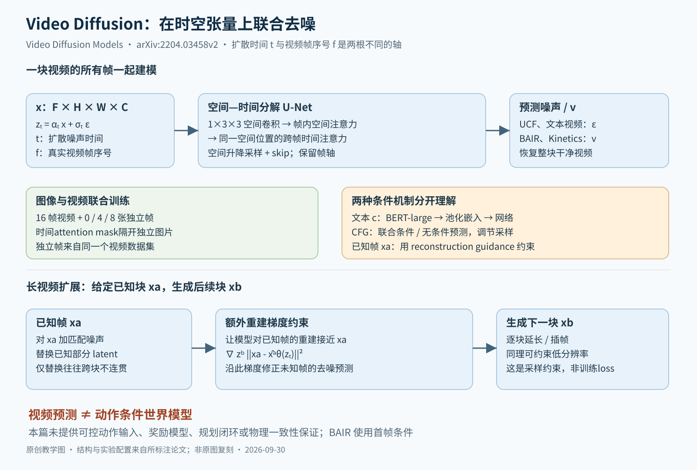

# Video Diffusion：把图像扩散的 U-Net 拉成时空分解的 3D U-Net，再用重建引导把 16 帧短块接长

> 状态：技术精读 · 原文 arXiv:2204.03458v2 · 未复现

## 一句话

Ho、Salimans 等（2022，Google）第一次用扩散模型生成视频：把一整块 16 帧视频当作一个张量一起加噪、一起去噪，网络是在空间与时间上分解的 3D U-Net；同一个网络屏蔽掉时间注意力就能当图像模型，于是可以图像、视频联合训练；再用"重建引导"从无条件模型里做条件采样，把短块接成长视频、把低分辨率升成高分辨率。BAIR 机器人推动视频预测上 FVD 66.92，此前最好的 NUWA 为 86.9；作者以伪造与偏见风险为由不发布模型。

## 它要解决的问题

此前的视频生成主要用自回归模型、VAE、GAN 和流模型（§5）；[DDPM](../ddpm/reading.md) 已经让扩散在图像上追平 GAN，作者想验证扩散在视频这种新模态上是否同样可行（§1）。

视频带来两个具体困难。一是体量：真实视频有数百到数千帧、每秒至少 24 帧，加速器内存只够一次训练约 16 帧（§3.1）。二是条件生成：要生成更长或更清晰的视频，需要"已知前一块，生成下一块"或"已知低分辨率，生成高分辨率"，而单独为每种条件训练一个模型成本高。同期另一篇工作用循环网络串起逐帧的图像扩散模型（§5 引用 [63]）；本篇选择整块联合建模。

## 核心想法

扩散的数学形式基本照搬图像（作者原话是"标准高斯扩散，除了为视频改结构外几乎不改"，§1），增量在三处：

1. **时空分解的 3D U-Net。** 卷积和空间注意力只在帧内做，每个空间注意力块后插一个只沿帧轴做的时间注意力块。
2. **图像–视频联合训练。** 在每段视频后面拼几张独立图片，用注意力掩码切断它们与视频、彼此之间的时间交互。表 4 中每段视频加 8 张图片，验证 FVD 从 205.42 降到 60.72。
3. **重建引导（reconstruction guidance）。** 从只训练过无条件分布的模型里，近似地采样"已知 xᵃ 时的 xᵇ"。表 6 中把 16 帧模型延长到 64 帧，验证 FVD 从旧方法的 436.16 降到 134.55。

## 机制

图中有两根时间轴：帧序号 f 是视频里的真实时间，扩散时间 t 是人为加噪的程度。一块视频的所有帧在同一个 t 下一起去噪。

### 1 生成对象：一整块视频，连续时间加噪

一块视频 x 的形状是 帧数 × 高 × 宽 × 通道（例如 16×64×64×3）。加噪写成连续时间 t ∈ [0, 1]（式 1）：

zₜ = αₜ x + σₜ ε，λₜ = log(αₜ²/σₜ²)

αₜ 是剩余信号的系数，σₜ 是噪声系数，λₜ 是对数信噪比（log-SNR），随 t 增大而减小，t = 1 时 z₁ 近似标准高斯。本篇的 αₜ 对应 [DDPM](../ddpm/reading.md) 里的 √ᾱₜ。日程用余弦形式（一句话：让信噪比在中段平滑下降、两端变化很慢的噪声日程），λ 的范围是 [−20, 20]（附录 A）。

网络要预测的量因实验而异：UCF101 和文本视频预测噪声 ε，BAIR 和 Kinetics 预测 v（一句话：v = αₜε − σₜx，信号与噪声的另一种线性组合，数值上更稳定）。

**示例数值。** 取 αₜ = 0.6、σₜ = 0.8（平方和为 1），则 λₜ = log(0.36/0.64) ≈ −0.58，噪声略多于信号。某个像素 x = 1、抽到 ε = 0.5，则 z = 0.6 + 0.4 = 1.0，v = 0.6×0.5 − 0.8×1 = −0.5；反过来 x = αₜz − σₜv = 0.6 + 0.4 = 1.0，网络预测出 v 就能还原 x。

### 2 时空分解的 3D U-Net

从图像 U-Net 出发改三处（§3、图 1）：

- 每个 3×3 卷积改成 1×3×3（第一维是帧），卷积只在帧内做；
- 空间注意力在每帧内部做，帧轴当作批次轴；
- 每个空间注意力块后插一个时间注意力块：同一空间位置跨帧做注意力，空间轴当作批次轴，用相对位置编码区分先后，不需要"整段视频的绝对时间"。

**示例数值：分解省了多少计算。** 在 32×32 的特征分辨率上（附录 A 在 8、16、32 三个分辨率加注意力），每帧 S = 1024 个位置，F = 16 帧。所有时空位置两两做注意力，要算 (F·S)² = 16384² ≈ 2.7×10⁸ 对；分解后空间注意力 F·S² ≈ 1.68×10⁷ 对，时间注意力 S·F² ≈ 2.6×10⁵ 对，合计约 1.7×10⁷，约为全时空注意力的 1/16（比值等于 F·S/(F+S) ≈ 15.8）。代价是一层之内信息只能沿帧内或沿同一位置的帧间传播，斜向的运动要靠空间层与时间层交替、以及 U-Net 的多尺度来传递。

### 3 训练与采样

训练与 DDPM 相同：抽一块视频、抽 t 与 ε、造 zₜ、回归 ε 或 v（式 2）。条件 c（文本）以 BERT-large 的句向量经注意力池化后，与 λₜ 一起加进每个残差块（§2–3、§4.3）。

采样有两种：祖先采样（一句话：DDPM 那样每步算均值再加噪声），以及在每步之后加一次 Langevin 校正的预测–校正采样（式 5，步长 δ = 0.1）。校正一步也要调用一次网络，所以附录写的"256 步（+256 次 Langevin 校正）"实际是 512 次网络调用。BAIR 上祖先采样 512 步 FVD 68.19，预测–校正 256 步 66.92，两者网络调用次数相同（表 2、附录 A.2）。

### 4 图像–视频联合训练

时间注意力块屏蔽掉之后，网络就是逐帧的图像模型。作者在每段 16 帧视频后拼若干张从同一数据集其他视频里随机抽出的单帧，把时间注意力的掩码设成：视频的 16 帧之间互相可见，每张单帧只看自己。空间层对视频帧和单帧共享。

**示例数值。** 16 帧加 8 张单帧共 24 帧，时间注意力矩阵是 24×24；左上 16×16 块全部可见，其余只保留对角线上的 8 个元素。一个批次元素里因此多了 8 个彼此独立的图像样本。作者的解释是：这以视频目标的一点偏差换取更低的小批量梯度方差，相当于一种节省内存、塞进更多独立样本的办法（§4.3.1）。

### 5 两种引导

**无分类器引导（classifier-free guidance）。** 同一个模型同时学有条件和无条件（条件置零）预测，采样时外推（式 6）：

ε̃ = (1 + w)·ε(zₜ, c) − w·ε(zₜ)

w = 0 是普通的条件预测；w > 0 时沿"条件减无条件"的方向多走一步，样本多样性下降、单帧质量和条件效果增强。**示例数值**：某像素条件预测 0.3、无条件预测 0.1，w = 2 时 ε̃ = 3×0.3 − 2×0.1 = 0.7，比条件预测本身走得更远。

**重建引导。** 已知部分 xᵃ（前一块视频，或低分辨率版本），要生成其余部分 xᵇ。旧的"替换法"每一步把 zᵃ 换成对 xᵃ 正确加噪的结果，xᵇ 照常去噪。作者指出它少了一项（§3.1）：

E[xᵇ | zₜ, xᵃ] = E[xᵇ | zₜ] + (σₜ²/αₜ)·∇_{zᵇ} log q(xᵃ | zₜ)

替换法只用了第一项，所以每块单独看都好，块与块之间却不连贯。第二项没有闭式，作者把 q(xᵃ|zₜ) 近似成以模型自己对 xᵃ 的重建为中心的高斯，得到式 7：

x̃ᵇ = x̂ᵇ − (w_r·αₜ/2)·∇_{zᵇ} ‖xᵃ − x̂ᵃ(zₜ)‖²

直觉是：若当前对后半段的猜测让模型很难重建出已知的前半段，就沿减小重建误差的方向修正后半段。求的是对输入 zᵇ 的梯度，网络参数不变；w_r 在 BAIR 上取 50、Kinetics 上取 9（附录 A）。把 xᵃ 换成低分辨率视频、把 x̂ᵃ 换成高分辨率预测的可微降采样，就是式 8 的超分辨率版本。

两者合用可以搭级联：先用 16×64×64、每 4 帧取 1 帧的模型生成稀疏低清视频，再用 9×128×128 的模型同时做空间超分和逐块外推，得到 64×128×128、逐帧的视频（图 2）。块内联合去噪，块与块之间是自回归的。

## 证据：哪个实验支撑哪个主张

| 主张 | 支撑实验 | 怎么读 |
|---|---|---|
| 无条件视频生成大幅领先 | 表 1，UCF101，16×64×64：FID 295±3、IS 57±0.62；TGAN-v2 为 3431±19、26.60 | FID、IS 用视频动作识别网络 C3D 的特征算，不能与图像 FID 比；真实数据 IS 约 60.2 |
| 无条件模型经引导可做视频预测 | 表 2，BAIR（给 1 帧预测 15 帧）：66.92，NUWA 86.9；表 3，Kinetics-600（给 5 帧预测 11 帧）：16.2±0.34，Transframer 25.4 | FVD（一句话：生成视频与真实视频在 I3D 网络特征空间里的分布距离，越低越好）；Kinetics 改用他人的抽样协议后为 16.9 |
| 图像–视频联合训练有效 | 表 4，文本视频小模型，每段视频加 0、4、8 张单帧：验证 FVD 205.42、70.74、60.72 | 单帧来自同一数据集；同时改变了批次里的独立样本数 |
| 引导不是越强越好 | 表 5，大模型、逐帧：w = 1、2、5 时验证 FVD 43.70、48.79、160.21，平均帧 FID 12.39、10.47、13.52，IS 一路上升 | 单帧质量指标与视频分布指标朝不同方向变化 |
| 重建引导解决跨块不连贯 | 表 6，16 帧模型延长到 64 帧，w = 2：验证 FVD 重建引导 134.55、替换法 436.16；首帧 FID 都是 16.46 | 第一帧一样好，差距全在帧与帧之间 |

## 局限与后续

**作者自述。** 以伪造内容、骚扰和虚假信息风险为由不发布模型；模型会继承训练数据的偏见，文本视频模型继承文本到图像模型的问题（§6）；联合训练的单帧目前只取自同一数据集，"从更大的纯图像数据集取图"留作后续（§4.3.1）。

站在现在看，后来的视频模型在本篇的每个部件上都做了替换，同时有两样东西一直留着。

**1 分辨率与时长：先级联，后压缩。** 半年后同一批作者的 [Imagen Video](../arxiv-2210.02303/README.md)（2022）把结构做成 7 个子模型的级联（1 个基础模型、3 个空间超分、3 个时间超分，共 11.6B 参数），文本编码器换成冻结的 T5-XXL，生成 1280×768、24 帧/秒、128 帧（约 5.3 秒）的视频；训练数据是 1400 万对内部视频–文本、6000 万对图像–文本加 LAION-400M，正是本篇留作后续的"外部图像数据"。它还写明了本篇没有暴露的两个坑：所有模型改用 v 预测，因为 ε 预测在高分辨率上会出现颜色漂移；最高分辨率的超分模型为省内存改成全卷积，不再用注意力。2024 年后的路线改成先压缩再生成：[Wan](../arxiv-2503.20314/README.md) 的 3D 因果 VAE 把时间压 4 倍、长宽各压 8 倍，[Seedance 1.0](../arxiv-2506.09113/README.md) 取时间 4 倍、长宽各 16 倍。**示例数值**：按 Wan 的压缩公式 [1+T/4, H/8, W/8]，取 81 帧、480×832 的输入，潜变量为 21×60×104，位置数约为原视频的 1/247。

**2 分解注意力：团队之间仍有分歧。** [HunyuanVideo](../arxiv-2412.03603/README.md)（腾讯）改用统一的全时空注意力，理由之一是它优于分解的时空注意力，并把图像当作单帧视频统一处理（§4.2）；[Seedance 1.0](../arxiv-2506.09113/README.md)（字节跳动）出于训练与推理效率，仍把空间层与时间层解耦，文本只在空间层参与交互，时间层内再按窗口划分（§2.2）。`[判断]` 本篇的时空分解没有被统一淘汰，它变成了"效率换表达"的一个可调旋钮。

**3 卷积 U-Net 到时空 patch 上的 Transformer。** OpenAI 的 [Sora 技术报告](../sora-tech-report/README.md)（2024）把压缩后的视频切成时空 patch 当作 token，用扩散 Transformer 在原生分辨率、时长和长宽比上训练；HunyuanVideo（13B）、Wan（14B 与 1.3B）、Seedance 都落在"潜空间 + Transformer"的骨架上（各家结构对照见[观点页：生成收敛](../../../perspectives/generative-convergence.md)阶段四的表）。

**4 训练目标与文本编码。** 上述三份开源或半开源报告都写明用流匹配训练（Seedance 写的是速度预测），不再用本篇的 ε/v 扩散目标；文本编码器从本篇的 BERT-large、Imagen Video 的 T5-XXL，换成 decoder-only 的语言模型或多模态模型（HunyuanVideo §4.3、Seedance §2.2）。

**5 采样成本。** 本篇 Kinetics 上 128 步加 128 次校正，每块要调用网络约 256 次。Imagen Video 用渐进蒸馏把 7 个模型都压到每个 8 步；Seedance 1.0 用多阶段蒸馏报告约 10 倍端到端加速；Wan 自述 14B 模型在单张高端 GPU 上不加优化生成一段视频约需 30 分钟（Limitation 一节）。

**6 长时一致与物理。** 本篇按块自回归延长，每块只看到上一块；"可延长到任意长度"描述的是采样接口。后来各家官方报告把长时不连贯、物理与状态变化不对列为共同短板，见[观点页](../../../perspectives/generative-convergence.md)阶段四"做不好的场景"。

**7 离世界模型还差动作。** BAIR 实验只给第一帧，没有输入机器人的未来动作，也没有回报、规划或闭环。后来补上动作接口的是另一批工作：[Genie](../arxiv-2402.15391/README.md) 从无标注游戏视频里学出逐帧可控的潜在动作，[Cosmos](../arxiv-2501.03575/README.md) 先预训练通用的视频世界模型，再用特定环境的数据后训练成专用世界模型，Google 用 Veo 做机器人策略的评估器（[Veo 世界模拟器评估](../../../robotics-embodied/papers/arxiv-2512.10675/README.md)）。

`[判断]` 留下来的有两样：图像–视频联合训练（Sora、HunyuanVideo 都把图像当单帧视频一起训练），以及"整块视频在同一个扩散时间下联合去噪"。换掉的是像素空间、卷积 U-Net、扩散目标、文本编码器和采样步数。本篇作为基线的价值在于它把视频生成的问题拆成了几个可以分别替换的部件。

## 批注

**易误读**

- UCF101 的 FID 295 是 C3D 特征上的视频指标，不能与 DDPM 那类 Inception 图像 FID 比（§4.1）；作者也提示各论文的预处理不总一致。
- 正文写 ε 预测，但 BAIR 与 Kinetics 用的是 v 预测（附录 A.2–A.3）；v 不是物体运动速度。
- 式 6 中 w = 0 才是普通条件预测；表 5 的 1.0、2.0、5.0 都是在此之上的外推。
- 表 4 是小模型、表 5 与表 6 是大模型；三张表的数字不能互相串用。
- 表中"128 步""256 步"不含 Langevin 校正，实际网络调用次数翻倍（附录 A）。
- frameskip 4 指每 4 帧取 1 帧，同样 16 帧覆盖 4 倍的时长。

**与其他论文的关联**

- [DDPM 精读](../ddpm/reading.md)：本篇沿用其训练配方；DDPM 的离散 1000 步在这里换成连续时间与余弦日程。
- [视觉生成方向](../../fields/generation/README.md)第 7 个节点与"技术地基"中的引导一条，引用本页机制第 5 节；[视频与时序方向](../../fields/video-temporal/README.md)。
- [观点页：生成收敛](../../../perspectives/generative-convergence.md)"视频生成的四种基本做法"第一种即本篇与 Imagen Video；本页机制第 2 节是那里分解注意力的计算量推导。
- [Imagen Video](../arxiv-2210.02303/README.md) → [Veo 3](../veo3-tech-report/README.md)：Google 视频生成从像素级联到潜空间 Transformer 的一条线。

**未核实 / 待验证**

- 项目页视频没有播放；本页只依据论文正文、表格与静态图。
- Sora 报告与 Seedance 2.0、Veo 3 的失败描述，以观点页与对应文献卡的核对为准，本页没有重新打开。
- 无分类器引导原文（Ho、Salimans）与 TimeSformer、ViViT 原文没有打开。
- 数值出处见[证据档案](evidence.json)；机制图见 [SVG](figures/video-diffusion.svg)。
