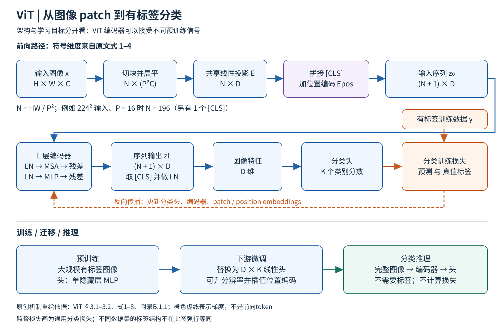
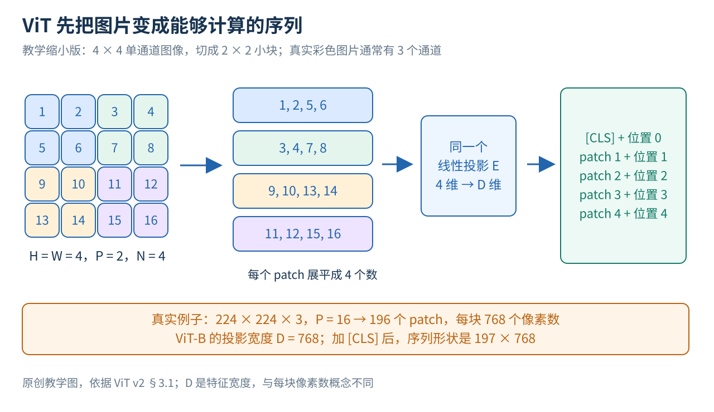

# ViT：把图像切成 16×16 的块当作词，交给几乎不改的 Transformer

> 状态：逐步教学版 · 原文 arXiv:2010.11929v2 · 未复现

## 一句话

Dosovitskiy 等（2020，Google，ICLR 2021）把图像切成固定大小的小块，每块线性投影成一个向量，加上可学习的位置向量和一个分类 token，直接送进 NLP 用的标准 Transformer 编码器。只在 ImageNet 上预训练时，它不如同规模的 ResNet；在 3 亿张图的 JFT-300M 上预训练后，ViT-H/14 在 ImageNet 上达到 88.55%，预训练算力却少于同期最强的卷积网络 BiT-L。

## 它要解决的问题

**2020 年的视觉主干仍是卷积网络**（[CNN 讲义](../../../foundations/lessons/11-cnn.md)）。语言一侧，[Transformer](../../../llm/papers/transformer/reading.md) 加"大语料预训练、小任务微调"已成配方，模型做到上千亿参数仍未饱和。视觉里也有人把自注意力引进来，但要么与卷积结合，要么换成专门设计的局部或稀疏注意力；后者理论上高效，却因为注意力模式特殊，没能在现代加速器上有效扩展。所以大规模图像识别的最好结果仍属于 ResNet 一类（ViT §1）。

**最接近的前作只在小尺度上试过。** Cordonnier、Loukas、Jaggi（ICLR 2020，[arXiv:1911.03584](https://arxiv.org/abs/1911.03584)）研究自注意力与卷积的关系，用 2×2 的小块做全局注意力，只适用于小分辨率图像；ViT 自己称它为最接近的工作（§2）。数据规模一线，Sun 等（2017，[arXiv:1707.02968](https://arxiv.org/abs/1707.02968)）用 JFT-300M 研究 CNN 的规模效应，BiT（Kolesnikov 等 2020，[arXiv:1912.11370](https://arxiv.org/abs/1912.11370)）系统研究大规模有监督预训练 ResNet 的迁移，它就是 ViT 的主要对照。

论文要回答：尽量不改标准 Transformer、除了切块之外不加图像专用的归纳偏置，靠更大的数据能不能胜过卷积？在[视觉表征方向](../../fields/visual-representation/README.md)的主线里，这是"架构轴从 CNN 移到 Transformer、数据轴移到 JFT-300M"的节点。

## 核心想法

1. **图像变成块序列。** 切块是唯一的图像专用操作（微调换分辨率时的位置插值另算），之后的计算与 NLP 的 Transformer 编码器相同（§3.1、§5）。
2. **复用 BERT 式接口。** 在序列前加一个可学习的 [class] token，取它的输出做整图表示；位置用一维可学习向量。
3. **增量在规模实验，不在新结构。** 预训练数据从约 130 万（ImageNet）到约 1400 万（ImageNet-21k）再到 3.03 亿（JFT），作者据此写出"大规模训练压过归纳偏置"（§1）。

下面第一到七节逐步讲机制，从像素一直走到推理。

## 一 先分清图片、分类器与骨干网络

### 1 图片对模型来说是一堆怎样的数

一张普通彩色图片通常可以表示为 H×W×C 个数：H 是高度，W 是宽度，C 是颜色通道数，RGB 图片的 C = 3。224×224 的彩色图片就有 224×224×3 = 150,528 个原始数值。模型需要从中提取能区分类别的信息，而不是记住每个像素位置的颜色。

特征或表示，是网络加工后得到的一组数。比如把整张图片变成 768 维向量，就是用 768 个内部数值表示这张图。一项视觉属性可以分散在很多维里，多种属性也可能共享表示。

分类头是把这些特征映射成类别分数的最后一小段网络。例如任务有猫、狗、汽车三个类别，它就输出三个数。训练时用正确标签衡量输出是否合适，再据此更新网络；推理时只输入新图片。

### 2 为什么要把骨干与学习目标分开

"骨干网络"负责把像素加工成表示；"学习目标"规定训练过程中什么输出算好。相同骨干可以接受不同学习信号，比如人工类别标签、遮掉部分图像后的预测任务，或图片与文字的配对关系。

ViT 首先是一种骨干架构。原论文的主实验采用有标签分类预训练，以便回答"这个架构在什么数据与预算条件下有效"。后来的 [MAE](../mae/reading.md)、[DINO](../dino/reading.md)、[CLIP](../clip/reading.md) 在同一个骨干上换了学习目标（§3–4）。

### 3 卷积提供了哪些预先写进模型的经验

卷积用同一套小滤镜扫描图片各个位置，每次只处理附近的像素。这把两条经验直接写进结构：附近像素通常有关联；同一个局部图案移动到别处时，仍值得用相同方式识别。

这些预先加入的偏好叫"归纳偏置"，即模型对可能规律的预设。局部性强调先看邻近范围；平移等变性大致指输入移动后，对应特征也随之移动。

ViT 的全局注意力没有要求每层都只看相邻块，它可以更自由地学习远近关系；学习这些空间规律的工作因此更多交给了数据。论文后面的数据规模实验，正是在检验这个代价与机会（§3.1、§4.3）。

## 二 一图看完 ViT 的完整路径

图 1 依据原文 §3.1–3.2、式 1–8 和附录的训练说明绘制。蓝线是计算结果向前传递，橙色虚线表示训练时损失对参数产生的更新信号，底部把预训练、微调、推理三个阶段分开。

上半部分先看四件事：图片切块，每块展平成一排数；同一个线性投影把各块变成等长向量；加入一个负责汇总的分类 token 和表示位置的向量；整条序列穿过多层 Transformer，最后取出分类 token 的结果送入分类头。

"token"在这里是序列中的一个处理单位。图像里的大部分 token 对应一个 patch，也就是一小块像素；额外的 [CLS] token 不对应任何一块原始像素。图中的 D 是每个 token 的特征宽度，N 是 patch 数，L 是编码器层数，K 是当前任务类别数。

预训练先在大数据上学习参数，微调利用目标任务的数据继续调整参数，推理则把训练好的网络用于新图片。后面会解释为什么迁移时需要换分类头，以及为什么分辨率变化还会牵涉位置编码。

## 三 从二维像素走到一维序列

### 1 16×16 指一小块的尺寸

标题里的 16×16 是常用 patch 的像素边长（不是"每张图固定分成 16×16 个 token"）。假设图片尺寸可被 patch 边长 P 整除，横向有 W/P 块，纵向有 H/P 块，所以：

N = (H/P) × (W/P) = HW/P²。

对于 224×224 图片、P = 16，横纵各有 14 块，总数是 14×14 = 196。额外加一个分类 token 后，Transformer 接收 197 个 token（§3.1）。

每个 patch 含 P²C 个像素数，这个例子里是 16×16×3 = 768。展平就是保留这些数的对应顺序，把小方块排成一个 768 维向量。

图 2 用 4×4 单通道小图片解释顺序。左上角 2×2 块包含 1、2、5、6，展平后是一行；右上角块包含 3、4、7、8。分块改变的是处理单位，像素的相对顺序保留在每块内部。

### 2 一个共享线性投影怎样处理所有块

展平后的像素数还需要变成模型使用的特征宽度 D。论文使用可训练矩阵 E，形状为 (P²C)×D。每个 patch 的向量都乘同一个 E，输出 D 个数，称为 patch embedding（§3.1、式 1）。

所有位置复用同一套投影规则，位置信息稍后单独加入。因此同一个局部图案出现在不同位置时，最初的投影以相同方式加工它的像素。

**示例数值。** 让一个 patch 为 x = (1, 2, 5, 6)，投影到 D = 2。假设 E 的四行依次是 (1, 0)、(0, 1)、(1, 0)、(0, 1)，则 xE = (1 + 5, 2 + 6) = (6, 8)，即对输入做两种不同的加权组合。真实模型的 E 从数据中学习。

ViT-B/16 恰好把 768 维像素块映射到 768 维特征，但输入维度与特征宽度是两个独立的量；换成别的 patch 大小或模型宽度时，两者不必相等。

### 3 为什么还要加位置向量

单靠全局自注意力，模型不知道序列里的某一块原来位于左上角。ViT 为每个序列位置准备一个可学习的 D 维向量，加到该位置的 patch 表示上（§3.1）。

延续刚才的例子，若这一位置的向量是 (0.1, −0.1)，原来的 (6, 8) 就变成 (6.1, 7.9)。加法让内容与位置一起进入后续网络；位置向量在训练中学习，同一位置的向量在不同图片之间复用。

论文默认使用一维可学习位置编码。patch 实际上来自二维网格，模型要从数据中学会其中的空间关系。后面的消融会说明：在被测条件下，提供位置信息有用，更复杂的二维方案并没有明显胜过这种简单做法。

### 4 分类 token 从哪里来

在 patch 序列前再放一个可学习的 D 维向量，通常写作 [CLS] 或原文的 [class]。它开始时没有专属的图片内容，之后通过注意力从其他 token 获取信息；最终只取它的输出，作为整图表示（§3.1）。

训练时它受整图分类损失的推动，逐渐学会聚合对分类有用的信息。背景如果也能帮助降低训练损失，它同样会利用背景，所以 [CLS] 的注意力不能直接当作物体定位器。

写成一个式子，输入序列为：

z₀ = [x_class；x₁E；x₂E；…；x_N E] + E_pos。

z₀ 是进入第一层之前的整个序列；x_class 是可学习分类向量；xᵢ 是第 i 个展平 patch；分号表示按序排成多行；E_pos 是所有位置向量组成的矩阵。共有 N + 1 行，每行 D 个数，形状为 (N + 1)×D（式 1）。

## 四 Transformer 怎样让图片各部分交换信息

### 1 一个 token 向其他 token 提问

如果一个 patch 只包含狗耳朵的一部分，仅看这块可能分不清它是耳朵、叶片还是衣角，其他位置的身体轮廓可以帮助解释它。自注意力让当前 token 根据内容为其他 token 分配权重，再按这些权重取回信息。

每个 token 经三组可训练线性变换产生 Query、Key、Value。可以把 query 理解成"当前要找什么信息"，key 理解成"这个候选能否匹配这种需求"，value 理解成"实际取回并混合的内容"。

把某个 query 与所有 key 点积，得到一排匹配分数；除以 √dₕ，再做 softmax，得到权重。dₕ 是这一注意力头中 query/key 的维度，平方根缩放用于控制点积的尺度。随后用权重对 value 加权求和：

A = softmax(QKᵀ / √dₕ)，输出 = AV。

A 的每一行是在候选 token 上归一化的权重，行内相加等于 1；V 储存被汇总的内容。这是跨位置传递信息的步骤（这些权重是位置之间的权重，不是类别概率；附录 A，式 5–7）。机制的完整推导见 [QKV 讲义](../../../foundations/lessons/15-qkv-deep-dive.md)。

### 2 手算一次注意力汇总

**示例数值。** 图 3 只保留一个 query 和两个候选。设 dₕ = 2，q = (1, 0)，k₁ = (√2, 0)，k₂ = (0, √2)。点积再除以 √2，得到两个分数 1 和 0。

对 (1, 0) 做 softmax，第一个权重为 e¹/(e¹ + e⁰) ≈ 0.731，第二个约为 0.269。

再令 v₁ = (2, 0)，v₂ = (0, 4)，汇总结果就是：

0.731 × (2, 0) + 0.269 × (0, 4) ≈ (1.462, 1.076)。

key 决定权重，被混合的是 value。输出同时包含两个候选的信息，来自候选一的权重更大。真实 ViT 里还有其余 token、归一化、残差、多头与输出投影，这里都省略了。

### 3 多头：并行的几组匹配规则

一个匹配规则未必能同时处理局部边缘、形状和远距离关系。多头注意力让不同的可训练投影并行进行多组 Q、K、V 计算，再把各头输出拼接并投影回 D 维。各头有机会学到不同的关系，但不能事先指定某个头负责颜色或某种物体（附录 A，式 8）。

ViT-B 的 D = 768、头数 12，每头宽度为 768/12 = 64。每个头都看整条序列，区别在于使用不同的投影。

### 4 一个完整 Transformer 块还有什么

ViT 采用先归一化的结构（Pre-LN）。每个块先对输入做 LayerNorm，再经过多头注意力，把结果加回原输入；然后再做一次 LayerNorm，经过 MLP，再加一次残差（§3.1、式 2–3）。

LayerNorm 对每个 token 内部的数值做归一化与可训练调整，控制计算尺度。残差连接就是"原表示 + 新算出的改变量"，让网络在保留旧信息的基础上逐步修正。

MLP 是逐 token 使用的两层全连接网络，中间有 GELU 非线性；ViT-B 的内部宽度为 3072，再投影回 768。它对每个位置使用同一组参数，加工每个 token 自身的特征；跨 token 的信息交换发生在注意力里。经过整个块，序列仍有 N + 1 个 token、每个 D 维，变化的是其中储存的信息（§3.1、表 1）。

把这样的块堆叠 L 次，最后取分类 token 的表示做 LayerNorm，得到整张图的 D 维特征。ViT-B、ViT-L、ViT-H 分别有 12、24、32 层，宽度分别为 768、1024、1280；B、L、H 表示模型规模，"/16""/14"表示 patch 边长（表 1）。

## 五 从分类分数到参数学习

### 1 用一个三分类例子看清训练信号

**示例数值。** 设整图特征送入分类头，得到"猫、狗、汽车"三个分数 (2, 1, 0)。softmax 把它们转换为约 (0.665, 0.245, 0.090)。如果真实类别是猫，交叉熵损失为 −ln(0.665) ≈ 0.408；如果真实类别是狗，则为 −ln(0.245) ≈ 1.408。

同一组预测，在不同真实标签下受到不同惩罚。训练程序计算损失对各参数的梯度，再用优化器更新分类头、Transformer、patch 投影、分类 token 和位置向量。监督只出现在整张图的类别上，前面各层也都会收到更新信号。

### 2 预训练更新整条图像路径

原论文的主要预训练是端到端有监督学习。分类头在预训练时是带一个隐藏层的 MLP（与编码器块内部的 MLP 是两回事）。预训练期间，整条图像路径的可训练参数都参与学习（§3.1、附录 D.3）。

因为分类头必须依靠前面的特征完成任务，训练会推动前面的网络学出对这些类别有用的表示。换到相关任务时，已经学到的形状、纹理或结构信息仍然有用，这就是迁移的基础。

## 六 论文实际上怎样预训练和迁移

### 1 三种数据规模分别在检验什么

论文比较 ImageNet-1k 约 130 万张图、ImageNet-21k 约 1400 万张图、JFT 约 3.03 亿张图。三者的类别范围、来源与标签条件都不相同。作者按下游测试集对预训练数据去重，以降低直接重叠的影响（§4.1）。

从 ImageNet 换到 JFT 时，数量与数据类型一起变了，所以论文还从同一 JFT 中抽不同大小的子集，更直接地研究数量的作用。两组实验要配合着读。

### 2 一轮真实预训练怎样展开

模型在 224 分辨率预训练：抽一批图像和标签，依次完成切块、投影、位置编码、Transformer、分类头及损失计算，然后反向更新。所有比较架构，包括 ResNet，在主设置中都使用 Adam、批量 4096；学习率先经过 10,000 步 warmup（训练初期逐步增大学习率），再按设定衰减（§4.1、附录 B、表 3）。

一个 epoch 表示遍历一轮数据，所以同样 7 个 epoch，在不同大小的数据集上意味着不同数量的更新。

JFT 主设置的权重衰减为 0.1，学习率线性衰减；ImageNet-21k 和 ImageNet 的训练时长、学习率、权重衰减、dropout 各不相同，ImageNet 训练用余弦衰减。作者写明，从零在 ImageNet 上训练时强正则化是关键（附录 B.1）；小数据实验中调了权重衰减、dropout 与标签平滑三个参数（§4.3）。数据增强没有调，这一点后来成了关键，见"局限与后续"第 1 条。

### 3 迁移时为何要换头

预训练分类头对应上千或上万类别，目标任务可能只分猫、狗、汽车，旧头的输出维度和类别含义都不合适。论文丢弃整个预训练头，接上一个零初始化的 D×K 线性层（K 为新任务类别数），再用目标任务的标签微调整个网络（§3.2、附录 B.1.1）。

微调采用 SGD、动量 0.9、批量 512、余弦学习率衰减且无权重衰减；学习率用从目标任务训练数据中划出的开发集选择（附录 B.1.1、表 4）。

### 4 为什么微调可以用更大的图片

论文通常把微调分辨率提高到 384，保持 patch 边长不变。图片保留更细的内容，patch 数量随之增加。编码器里的线性变换处理的是 D 维向量，大部分参数不受序列变长影响；要处理的是按固定网格学到的位置向量（§3.2）。

图 4 固定 P = 16。224 输入对应 196 块，加分类 token 为 197；384 输入对应 24×24 = 576 块，加分类 token 为 577。位置向量先按原图的二维网格排列，再通过二维插值获得更密的新网格（根据旧网格中的邻近数值估计新位置的数值），分类 token 的位置项单独处理。

序列变长是有代价的。一个注意力头要对所有 token 两两打分：197² = 38,809 个分数，577² = 332,929 个，约增加到 8.58 倍（这是分数矩阵的元素数，整模型的运行时间还受投影、MLP 与硬件并行影响）。

论文表 2 的最高 ImageNet 结果用了进一步的设置：ViT-L/16 以 512 分辨率微调，ViT-H/14 以 518 微调，并做了权重平均（§4.1、表 2、表 5）。

### 5 推理时只剩前向计算

推理时，新图片按既定预处理和分辨率切块，通过固定参数的编码器与分类头得到分数，选取类别即可。

这个分类头只认识训练过的 K 个类别。要用一句类别名直接定义新类别，需要一个把文字映射成分类权重的文本塔，这正是 [CLIP](../clip/reading.md) 增加的接口。

## 七 读结果前先区分两种评价协议

"全量微调"用目标任务的训练标签更新模型，报告适配后的测试准确率。它回答的是：允许用目标任务数据调整系统后，这个预训练模型能做到多好。

"少样本线性评估"冻结表示，每类只取少量有标签样本训练一个简单分类器。ViT 论文用正则化最小二乘回归求解这个分类器，计算快，适合在训练过程中频繁比较模型与数据规模（§4.1）。

ImageNet 5-shot linear 中的 5-shot 指每类的标签样本数，图像编码器此前已经过大规模预训练。表 8 的位置编码消融和图 9 的分类 token 消融，用的都是这条较轻的评估路线。

## 证据：哪个实验支撑哪个主张

| 主张 | 支撑实验 | 怎么读 |
|---|---|---|
| 大规模预训练后，ViT 达到或超过最强 CNN，预训练更省 | 表 2：JFT 预训练，ImageNet 上 ViT-H/14 88.55、ViT-L/16 87.76、BiT-L 87.54；预训练 TPUv3 核·天约 2.5k、0.68k、9.9k | 系统对比，优化器、训练时长、微调分辨率都不同 |
| 数据少时大模型反而差 | 表 5（384 微调）：只用 ImageNet 预训练，B/16 77.91、L/16 76.53；JFT 预训练后 84.15、87.12 | §4.3、图 3 |
| 同源数据量的效应 | 图 4：JFT 抽 9M、30M、90M 与全量，ImageNet 5-shot 线性；小子集上 ResNet 占优，大子集上 ViT 占优 | 子集上不另调正则化，用早停取最佳验证点 |
| 同等计算下 ViT 更省 | 图 5：五任务平均达到相同表现，ViT 所需预训练计算约为 ResNet 的 1/2–1/4；混合模型在小预算下略优，预算增大后差距消失 | §4.4，比的是计算而不是参数量 |
| 需要位置信息，但形式影响小 | 表 8（ViT-B/16，5-shot 线性）：无位置编码 61.38，一维 64.21，二维 64.00，相对位置 64.03 | 附录 D.4 |
| [CLS] 与平均池化相当 | 图 9：平均池化沿用 [CLS] 的学习率 8×10⁻⁴ 时很差，改为 3×10⁻⁴ 后曲线相近 | 附录 D.3；换组件要给它合理的调参机会 |
| 自监督可行，但差距大 | §4.6：遮蔽块预测预训练的 ViT-B/16 在 ImageNet 上 79.9%，比从头训练高约 2 点，比大规模有监督预训练低约 4 点 | MAE 的出发点 |

下面逐项补充表中放不下的读法。

### 1 表 2：旗舰系统的比较

TPUv3 核·天把核心数与训练天数相乘，是特定硬件上的资源度量。旗舰 ViT 以较低的报告预训练成本达到很强结果，但优化器、训练时长等设置也不同，所以这组数是系统对比，不是"架构固定节省某个百分比"。逐项看，ViT-L/16 在 VTAB 上为 76.28±0.46，BiT-L 为 76.29±1.70，ImageNet ReaL 上二者同为 90.54：准确的说法是旗舰 ViT 在这组基准上总体达到或超过强 CNN 基线（表 2）。

### 2 表 5 与图 3：容量要配数据

只用 ImageNet 预训练时，更大的 L/16 反而低于 B/16；换成 JFT 后，L/16 反超。在论文的配方下，更大的容量需要足够的数据才能转化成更高的迁移准确率（§4.3）。

### 3 图 4：同一来源的数据量

图 4 从 JFT 抽约 9M、30M、90M 样本与全量比较，作者保持主要超参数一致、不为小子集重新调正则化，采用早停，下游用 5-shot 线性评估（§4.3、p7）。在这些协议限定下，小子集上 ResNet 更好，大子集上 ViT 更好，比跨数据集的比较更直接地支持"视觉先验在数据较少时有帮助"。

### 4 图 5：计算预算

同样参数量的模型可能处理不同数量的 token，训练时长也可能不同，所以参数量不能替代计算量。混合模型先用 CNN 产生特征图，再转成序列交给 Transformer（§3.1、§4.4、表 6）。

### 5 表 8：位置编码

无位置编码时，模型仍能利用每个 patch 内部的纹理和内容，所以分类没有崩溃，但跨 patch 的位置线索丢失，结果下降约 3 个百分点；加入简单位置编码后改善明显，更复杂方案与默认方案的差距很小（附录 D.4、p17）。

### 6 图 9：替换组件时的调参公平性

作者最初把分类 token 换成对所有 patch 输出做全局平均池化，表现很差，看上去像是 [CLS] 很关键；后来发现平均池化需要更小的学习率，调整后两者曲线相近（附录 D.3、pp16–17）。研究教训是：替换一个组件后，与它强相关的超参数要重新调，再判断机制优劣。

## 八 附录如何补足主结论

### 1 更深、更宽、更小 patch 是三种不同的扩大

附录 D.2 分别增加深度、表示宽度、MLP 宽度，并调整 patch 大小。更深的网络带来更多连续加工步骤，更宽的网络给每个 token 更多维度，更小的 patch 则把同一图片切成更长的序列（附录 D.2、图 8）。

减小 patch 边长时，主干参数基本不变，token 数量上升，注意力计算随之增加；只比较参数量会漏掉这部分成本。附录 D.5 给出真实 TPUv3 吞吐和可容纳批量，D.6 讨论轴向注意力：它把空间交互拆到不同轴上，理论计算更省，朴素实现却不一定更快。FLOPs 是算法计算量估计，运行时间还受内存、并行和算子实现影响（附录 D.5–D.6）。

### 2 原文已经试过遮蔽块预测

论文做了一个初步的自监督实验：选中 50% 的 patch embedding 进行破坏，其中 80% 换成可学习的 mask 向量，10% 换成随机的其他 patch，10% 保持不变；然后根据对应位置的表示预测 patch 的离散平均颜色（§4.6、附录 B.1.2）。原文说这一设置与 BERT 的做法非常相近；这个自监督模型是在 JFT 上训练约 14 个 epoch 得到的。

ViT-B/16 经这一预训练后在 ImageNet 上为 79.9%，比从头训练约高 2 个百分点，比大规模有标签预训练低约 4 点（§4.6）。一年后的 MAE 把遮挡比例提到 75%，让编码器只处理可见块、由轻量解码器重建像素，目标和计算路径都换了（[MAE 精读](../mae/reading.md)）。

### 3 注意力热图展示了什么

原论文可视化了位置向量相似度、注意力距离和图像区域响应。某些早期层的头偏局部，另一些已能整合较远距离的信息；位置向量也学出了与二维位置相关的结构（§4.5、图 7、附录 D.7）。

图 6 与图 14 用 Attention Rollout（把各头的注意力权重取平均，再把所有层的矩阵依次相乘，近似整图信息穿过各层的汇总路径）观察模型关注哪里（附录 D.8）。

## 九 自检

不翻正文，试着解释三件事：224 和 384 的图片为什么分别是 197 和 577 个 token；表 2 的 88.55% 为什么不能和表 5 的 88.04% 当成同一设置的结果；分类 token 消融为什么说明的是调参公平性，而不是所有汇总方式完全相同。

## 局限与后续

**作者自述。** 引言写明，在 ImageNet 这类中等规模数据上、不加强正则化时，ViT 比同规模 ResNet 低几个百分点（§1）。结论列了三个挑战：把 ViT 用到检测与分割；继续探索自监督预训练，缩小它与大规模有监督预训练的差距；继续扩大规模（§5）。

站在现在看，后续工作接手了这三个挑战，也暴露了几处原文没写明的坑。

**1. "需要大数据"有很大一部分是"需要好配方"。** DeiT（Touvron 等 2020，Facebook AI 与 Sorbonne，[arXiv:2012.12877](../arxiv-2012.12877/README.md)）只用 ImageNet，在一台 8 卡机器上预训练 53 小时，结构与 ViT-B 相同的 DeiT-B 在 224 分辨率达到 81.8%，384 分辨率微调后 83.1%；ViT 原文同一结构只用 ImageNet 为 77.91%（384 分辨率）。DeiT 的消融显示配方极其敏感：去掉随机擦除或随机深度，训练直接失败（4.3%、3.4%）；同时去掉 mixup 与 cutmix 降到 75.8%；优化器从 AdamW 换成 SGD 降到 74.5%（DeiT 表 8）。Google 自己的 AugReg（Steiner 等，TMLR 2022，[arXiv:2106.10270](../arxiv-2106.10270/README.md)）系统研究后结论是：增加计算并配合数据增强与正则化，效果相当于把训练数据扩大一个数量级；在公开的 ImageNet-21k 上训练的 ViT 已能追平或超过 JFT-300M 上的同规模模型。MAE 也把 ViT-L 从零训练从原文的 76.5% 提到 82.5%（MAE 附录 A.2）。`[判断]` "大规模训练压过归纳偏置"成立，但数据门槛有多高，取决于配方；ViT 只调了三个正则化参数、没有调数据增强，把一部分配方问题算成了架构问题。卷积一侧的对称结果（ConvNeXt 用现代配方追平）见[观点页：CNN 与 Transformer](../../../perspectives/cnn-vs-transformer.md)。

**2. 最强结果依赖不公开的 JFT。** 外部团队无法重建同一数据条件。AugReg 发布了 5 万多个在不同设置下训练的 ViT 模型，并证明公开数据足以达到同等水平，基本消除了这个复现障碍（AugReg §1）。

**3. 固定正方形输入与位置插值。** ViT 在固定分辨率上学位置向量，换分辨率要插值，非正方形图片要缩放或裁剪。SigLIP 2（Tschannen 等 2025，Google DeepMind，[arXiv:2502.14786](../arxiv-2502.14786/README.md)）专门训练了 NaFlex 变体，支持多种分辨率并保持原始宽高比，作者写明这有望改善文档理解这类对宽高比敏感的应用（§1）。`[判断]` 在需要读小字、看图表的视觉语言模型里，固定正方形输入是一个坑。

**4. token 数随分辨率平方增长。** 第六节算过，224 到 384 时注意力分数增加到 8.58 倍；切块从 16 缩到 8 也是同样的代价。DINO 报告 ViT-S/16 每图 197 个 token、约 1007 图/秒，ViT-S/8 为 785 个 token、约 180 图/秒（[DINO 精读](../dino/reading.md)表 1）。patch 大小因此是精度与成本之间最直接的旋钮。

**5. 只有一个 [CLS] 做全局汇总，大模型会自己挪用背景 token。** Darcet 等（"Vision Transformers Need Registers"，2023，[arXiv:2309.16588](../arxiv-2309.16588/README.md)）发现，有监督的 DeiT-III、图文对比的 OpenCLIP、自监督的 DINOv2 训练出的大 ViT，都会在信息量低的背景处出现约 2% 的高范数 token，范数约为其他 token 的 10 倍，被用来存放全局信息、丢掉了原 patch 的局部信息；它们只在 ViT-L 及更大、训练到约三分之一之后出现。在输入序列里加几个与图像无关的 register token 后，伪影消失，密集预测变好（Registers §1–3）。`[判断]` 有监督模型也有这个现象，说明它是 ViT 结构在规模变大后的共性，ViT 原文的规模和可视化方式还看不出来。

**6. 检测、分割与自监督在一年内被接手。** MAE 把单尺度的 ViT 适配成多尺度特征接检测器，COCO 上 ViT-L 的检测 box AP 从有监督预训练的 49.3 提到 53.3；MAE 与 DINO 分别用遮蔽重建和自蒸馏补上了自监督的差距（[MAE 精读](../mae/reading.md)、[DINO 精读](../dino/reading.md)）。

## 批注

**易误读**

- 表 2 中的 ± 是三次微调结果的标准差，不是三次独立预训练的波动（表 2，p6）。
- 同一 ViT-H/14，表 2 为 88.55%（518 分辨率微调并做权重平均），表 5 为 88.04%（统一 384 微调）；该版本表 6 中的 H/14 又写 88.08%，与表 5 略有出入，本页按原表分别引用。
- 表 8 与图 9 都是 ImageNet 5-shot 线性评估，结论不能直接推广到全量微调。
- 注意力热图集中在主体区域，可以帮助观察模型行为，但不构成"这些像素是预测原因"的因果证明，也不是有像素级真值的分割结果；网络还有残差和 MLP 两条路径（附录 D.8）。
- DeiT 的 81.8% 是 224 分辨率、77.91% 是 ViT 原文 384 分辨率的结果；同为 384 时 DeiT-B 为 83.1%。
- 本页第三至五节的小矩阵、注意力与交叉熵数值都是示例数值，不是论文实测。

**与其他论文的关联**

- [Transformer 精读](../../../llm/papers/transformer/reading.md)：ViT 的编码器块与多头注意力来自这里，但采用 pre-LN；[CLS] 与"预训练加微调"的接口来自 BERT（Devlin 等 2018）。
- [MAE](../mae/reading.md)、[DINO](../dino/reading.md)、[CLIP](../clip/reading.md)：在同一个 ViT 骨干上分别换成遮蔽重建、自蒸馏与图文对比；三者如何回答 ViT 留下的问题，见[视觉表征方向](../../fields/visual-representation/README.md)主线第 6 节。
- ViT 的切块思路被 DiT 用到图像生成的去噪主干里，见[视觉生成方向](../../fields/generation/README.md)。
- [OpenVLA](../../../robotics-embodied/papers/openvla/reading.md) 的两路视觉编码器（DINOv2 与 SigLIP）都是 ViT。

**未核实 / 待验证**

- DeiT、AugReg、SigLIP 2、Registers 只核对了本页引用的段落与表格；文献卡见正文中的链接。
- Cordonnier 等、Sun 等、BiT 只按 ViT §2 的描述引用，未打开原文。
- 数值出处与页码见[证据档案](evidence.json)与[教学改写核验记录](evidence-beginner-revision.json)。
