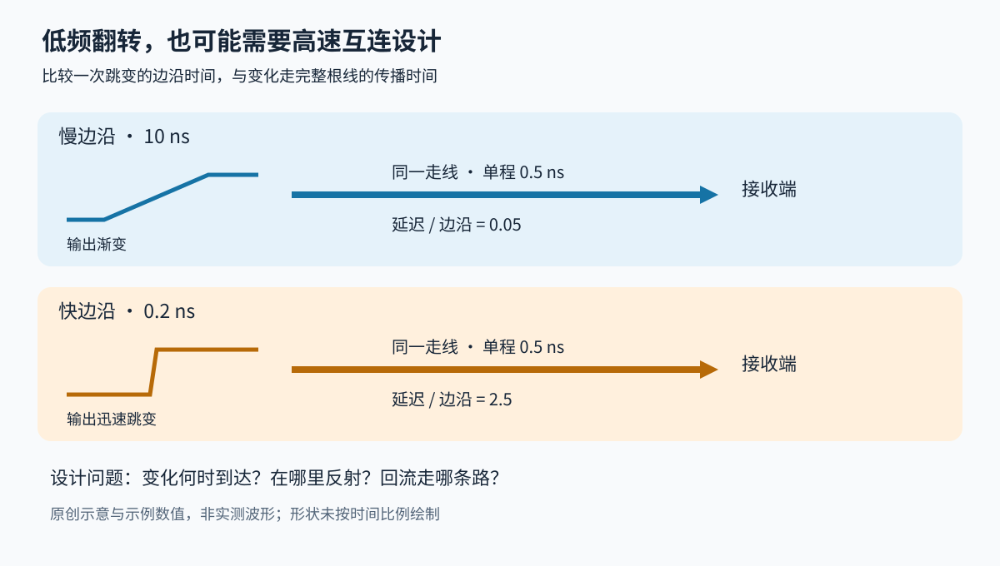

# 高速电子临时探索：什么时候连线也成为电路的一部分

> 速览：器件的切换边沿决定信号包含多快的变化；板上走线需要时间传递变化。两者接近时，要把连线的传播、反射和回流一起设计。模拟信号还要检查到达指定精度需要多久。

## 我的问题

电子器件的高速与非高速，在设计和应用上究竟有哪些区别？除了响应、带宽、热功率和电磁干扰，还有什么需要考虑，难点在哪里？

## 目前的判断

- [我] 这是突然感兴趣的问题，属于临时兴趣。
- [建议] 先把边沿时间、传播延迟、回流路径和建立时间联系起来，再根据具体器件决定是否深入。下面保留这一问题的机制讲解与图示。

## 从一个低频控制信号说起

假设控制器每隔一段时间改变一次输出电平，接收器看到高电平就执行动作。逻辑程序关心的是高与低，板级设计还需要回答：远端什么时候越过门限、越过几次、采样时是否稳定？

"更新次数少"描述两次动作之间隔了多久，"边沿快"描述一次跳变用了多久。这两个时间可以相差很大。一个很少翻转的控制引脚，仍可能产生很陡的跳变。因此，高速设计的起点是信号在互连上的变化过程。[1]

图中的两路信号走相同距离，传播延迟相同。上路的输出变化较慢，下路很快完成变化；下路远端尚未收到前一段变化时，源端已经换了状态。这时，把整根线当成同时具有一个电压的节点，会丢失重要行为。

## 第一步：把两个时间放在一起比较

传播延迟是变化从源端到接收端所需的时间。上升时间是电压从指定低百分比变到高百分比所需的时间；比较器件时，需要使用一致的测量定义。ADI 的 MT-097 给出按传播延迟与边沿时间判断是否采用传输线方法的经验规则。[1]

**示例数值**：设一条走线的单程延迟为 0.5 ns。若边沿用时 10 ns，延迟占其 5%；若边沿用时 0.2 ns，单程延迟是边沿的 2.5 倍。后者更需要按沿线传播的波来分析。这个算例用于理解比例，具体布线仍要依据器件和板材模型。

## 第二步：信号必须有回来的路径

电流沿信号线出去，也要通过回流路径回到源端。参考平面就是在走线附近提供连续回流通路的导电层。TI 的布局说明指出，高频回流趋向低阻抗路径；参考平面的裂缝会迫使它绕行，扩大回路面积并增加辐射问题。[2]

这解释了一个常见现象：原理图连通性完全相同，换一种布局后却更容易受干扰。原理图中的"地"在物理板上有形状，信号线和回流路径共同构成互连。检查走线时，应连同参考平面、换层位置以及附近敏感电路一起看。

## 第三步：检查沿途的不连续位置

过孔让走线换层，但没有用于传递信号的那段导电孔壁，可能留下支路。支路会影响高频传输，TI 的 SPRAAR7J 因而专门讨论过孔残桩和背钻。背钻是在制造时去掉不需要的导电孔段，代价是增加工艺约束。[3]

差分接口用两根线共同传输信息，仍需要控制两路传播差异、沿途几何结构及连接器影响。该文档对不同器件分别给布局参数，正说明这些要求需要落到具体接口上。（文档附表的长度、阻抗和过孔限制适用于表中器件，不应当作全板通用数值。）[3]

## 第四步：模拟输出到位，还要到达所需精度

如果输出给模数转换器采样，仅仅"波形大致到了目标电压"还不够。建立时间描述阶跃之后，输出进入并持续留在指定误差带内需要多久。误差带越窄，等待要求可能明显增加；MT-046 还讨论了测量电路自身过载对结果的影响。[4]

**示例数值**：目标变化量为 1 V，允许相对这次变化量偏差 0.1%，对应误差带为 ±1 mV；若收紧到 0.01%，则为 ±0.1 mV。这里需要测量的是进入对应误差带后的稳定过程。把某器件在宽误差带下的建立时间直接用于更高精度采样，会改变实际精度预算。

## 怎样沿着资料继续读

先用 [MT-097](../../cross-domain/resources/adi-mt-097/README.md) 建立边沿与传播的直觉，再读 [SCAA082A](../../cross-domain/resources/ti-scaa082a/README.md) 的回流和布局示意。设计有具体高速接口时，进入 [SPRAAR7J](../../cross-domain/resources/ti-spraar7j/README.md) 查对应器件要求；若问题在模拟采样精度，则转到 [MT-046](../../cross-domain/resources/adi-mt-046/README.md)。

这四份资料承担基础机制入口。下一步的有效扩充应围绕选定器件的数据手册、板层结构和实际接口展开，才能把通用原理变成可测的约束。

## 批注

**适用边界**

- 这是一份临时兴趣的机制资料整理，不推定已有硬件项目；具体设计需要另行提供器件、叠层与接口条件。

- 本页解释互连与采样的基础关系。图和算例为原创教学示意，没有代表某块实际电路板的仿真或测量。
- 边沿/传播比例是筛查线索，终端配置需要结合驱动阻抗、负载、拓扑与时序预算确定。
- [3] 的无版本官方入口在本次检查中仍提供 Rev. J；这表示该入口返回的版本，不构成对全部 TI 文档或所有接口"最新"的断言。

**参考文献**

1. Analog Devices. [MT-097: Dealing with High-Speed Logic](../../cross-domain/resources/adi-mt-097/README.md)，Rev. 0，2009-01，边沿与传输线判断。
2. Texas Instruments. [High-Speed Layout Guidelines, SCAA082A](../../cross-domain/resources/ti-scaa082a/README.md)，2017-08 修订，§1.6 与 §2 的回流、参考平面和布局。
3. Texas Instruments. [High-Speed Interface Layout Guidelines, SPRAAR7J](../../cross-domain/resources/ti-spraar7j/README.md)，2023-02 修订，§3.6–3.7 和附录器件参数。
4. Analog Devices. [MT-046: Op Amp Settling Time](../../cross-domain/resources/adi-mt-046/README.md)，Rev. 0，2008-10，建立时间定义与测量。
