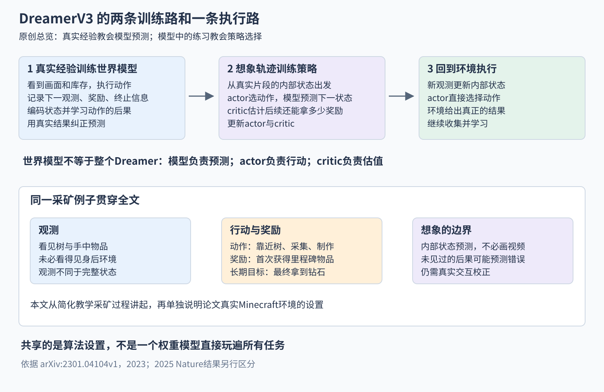
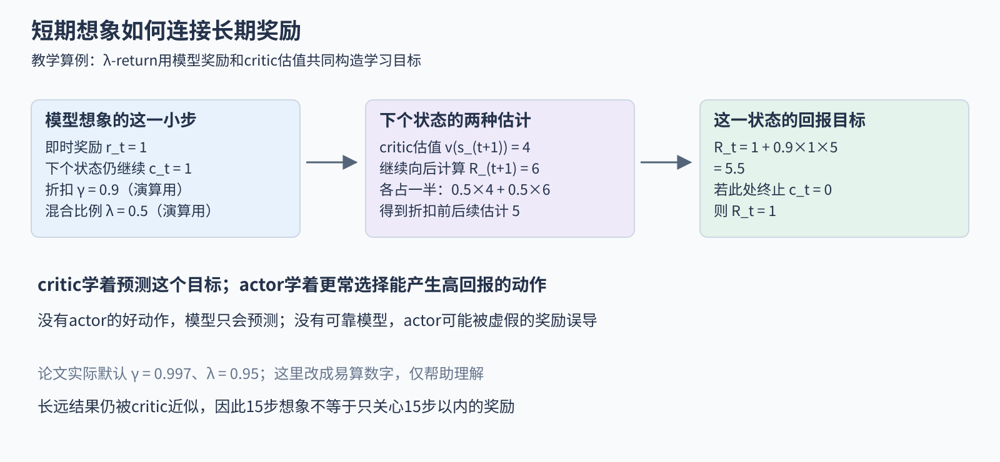
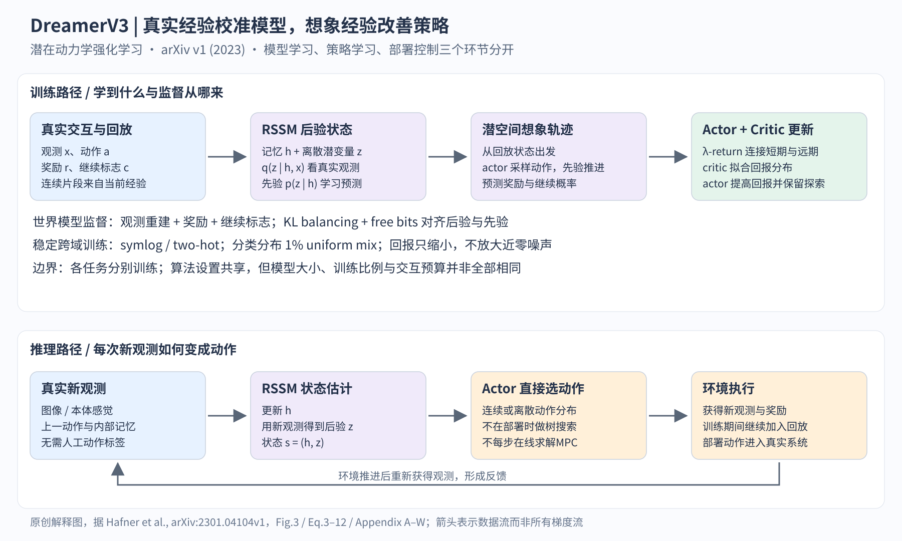

# DreamerV3 精读 从真实经验到想象中的练习

假设你第一次玩一个采矿游戏。你看见树，尝试靠近并采集，发现库存里多了木材；接着学会用木材制作工具。想拿到地下的钻石，需要很多步以前的准备。每个动作都去现实里试，学习会很慢；但如果已经大致知道“做这个动作会发生什么”，就能先在内部模型里练习。

DreamerV3做的正是这件事：先从自己的真实交互中学习一个可以预测动作后果的模型，再利用模型生成想象轨迹，训练选择动作的策略，随后回到真实环境继续验证和收集经验。它没有跳过真实经验，也不是靠一开始就正确的物理模拟器学会任务。想象有多可靠，取决于已学模型有多可靠。[1]

这篇文章从一个简化的采矿例子出发，把观测、状态、动作、奖励、世界模型、actor和critic串成一次完整学习过程。简化例子只为教学；后面会单独说明原论文Minecraft实验具体改了什么，避免把直觉例子当成实验设定。

**版本与阅读范围。** 本文以Hafner等人的《Mastering Diverse Domains through World Models》，arXiv:2301.04104v1，2023年1月10日，38页版本为基准。本次重新核查正文方法、公式、主要结果和结论，细读附录A–G与W，并复核O、Q、S、T、V中的关键评估表。其余任务曲线用于定位覆盖范围，没有逐点数字化，也没有运行训练或重现实验。2025年Nature发表的后续版本采用更新的实验与实现，本文在末尾单列说明，绝不把新旧数字拼成同一实验。[1][7]

## 一图先看清 它究竟怎样学习

图1　原创教学总览。左边是真实数据教模型预测，中间是模型教策略选择，右边是策略回到环境执行。三部分循环进行，不是训练完世界模型就永远不更新。

读图时先留意三个不同工作。**世界模型**回答“这样做后可能发生什么”；**actor**回答“现在选择哪个动作”；**critic**回答“从这里继续行动，预计总共还能得到多少回报”。它们一起构成Dreamer，任何一块都不是整套算法的全部。

右边还有一个重要细节：真正玩游戏时，actor根据当前内部状态直接选择动作。DreamerV3不要求每一步都临时做一棵庞大搜索树，也不要求每一步在线寻找最优动作序列。大量“先想后练”的工作发生在训练期间，然后被学进策略网络里。[1，pp.3–7]

## 一 从一次采集动作认识强化学习

### 观测是眼前信息 状态还包括看不见的历史

屏幕上有树，手里有一把工具，库存里有几块木材。这些当下可以读到的内容是观测，论文记为x_t。下标t表示环境中的第t个时刻。

但一张屏幕截图通常不足以告诉你所有重要信息。你可能刚从左边转过来，身后有一堵墙；同一棵树也可能已经采集了一会儿，只差一点就会掉落资源。完整环境状态包含这些历史与隐藏因素，当前观测只暴露其中一部分。

Dreamer因此维护自己的**内部状态**：一组由历史观测与动作更新出来的数字。它不是游戏引擎给出的真状态，也不一定能逐维对应“坐标”“工具耐久”这样的人工变量。我们希望它保留足够的信息，用来预测未来和选择动作。

### 动作改变世界 奖励告诉它哪些结果值得追求

在教学例子里，动作包括前进、转向、采集、制作工具。actor每次选择一个，环境执行后给出下一次观测。有的环境动作是离散选项，例如“按左键”；有的是连续值，例如关节目标或方向大小。DreamerV3的评估同时包含两类任务，但同一个任务使用哪种动作表示，由环境接口决定。

**奖励**是环境给出的数字反馈。假设首次获得木材奖励1，首次制作工具也奖励1，之后最终拿到钻石再得到奖励。奖励不是一张“下一步应该怎么做”的答案表。智能体仍必须自己发现哪个早期动作促成了很久以后的好结果。这种把远期结果归到之前行为的困难，叫信用分配问题。

**策略**就是从当前内部状态选择动作的规则，在这里由actor网络实现。早期策略可能经常走错；得到经验后才逐步改进。这与行为克隆不同：行为克隆模仿人给出的动作标签；这里的训练起点是自己做过什么、结果是什么、得到了多少奖励，而不是专家告诉它每一步该按哪个键。

### 一条经验究竟保存什么

文中的神经网络首先只是可学习的数字函数：读入一组输入，输出预测或动作概率；内部有许多可调整的参数。训练先用损失衡量它预测得怎样，再利用梯度调整参数。梯度可以理解成“每个参数变一点，会让损失往哪里变”的提示，反向传播是计算这些提示的办法。后面说停止梯度，限制的是某条训练信号怎么影响参数，并不是停止游戏时间或停止模型预测。

假设智能体看见树，选择采集，下一时刻库存从0变成1，收到奖励1，而且游戏没有结束。这条转移记录至少涉及前后观测、所做动作、奖励和终止情况。许多连续转移连起来，就是一条轨迹；从开始到死亡、完成或时间上限的一整局，叫一个episode。

这些真实记录进入**经验回放缓冲区**。你可以把它理解为可反复取样的经历仓库。训练不是只看最新一秒，而是从已经收集的连续片段中反复学习。连续性很重要：如果把先采集、再转身、再制作三个动作打散，模型就难以学到动作的先后后果。

“在线强化学习”也不等于每发一个动作都必须立即更新一次网络。它指数据随当前策略与环境的交互不断产生，策略更新又会改变后续数据。回放中的学习、模型里的想象和真实执行可以按设定的比例交替进行。[1，Appendix A、C]

## 二 为什么要学习世界模型

### 直接学动作与先学后果有什么差别

一种直接路线，是只从真实成功或失败中改进策略。它不必显式预测下一观测，通常称为无模型强化学习。这里的“无模型”不是没有神经网络，而是没有专门用来预测环境转移的世界模型。

Dreamer选择另一条路线。它先学习“当前内部状态加某个动作，会变成什么状态、得到多少奖励、是否结束”。学到这些后，同一段真实经验就可以支持许多内部练习。例如已经见过靠近树和采集木材，它可以在内部滚动若干种动作过程，为策略提供更多学习信号。

这并不意味着内部练习凭空创造了新的真实证据。模型从未见过的情况仍可能预测错。它的优势是重复利用已有经验，把其中学到的规律用于更多模拟尝试；代价是策略可能被预测误差误导。

### 为什么不必把每一步都画成视频

一张64×64彩色图片有超过一万个像素通道值；大量信息是地面纹理、光照或背景。行动决策未必需要逐像素保存所有细节。Dreamer把观测编码到较紧凑的内部表示，在这个表示里预测下一步，称为**潜在动力学**。

“潜在”表示这些量不是直接观测的真值，而是模型学出来的隐藏表示；“动力学”在这里指状态如何随时间和动作变化，不限定于牛顿力学方程。模型需要知道采集可能增加木材、转向会改变所见方向，不一定先生成一段能让人观看的电影。

Dreamer确实有把内部状态还原成图像或向量的解码器，训练时用来检验表示是否保留观测信息。但actor和critic在想象中学习时，主要使用内部状态与预测奖励，不需要每一步都把状态解码为RGB图片再编码回去。这就是潜空间想象能节省计算的原因之一。[1，Fig.3、Eq.3]

### 历史上新在哪里

“用学到的模型产生额外经验”并非2023年才出现。Sutton在1991年的Dyna工作已把真实交互、模型学习和模型内的规划整合起来。2019年的PlaNet从像素学习潜在动力学，并在潜空间规划。Dreamer第一代随后将模型中的想象用于学习行为；DreamerV2在离散潜变量世界模型与Atari任务上推进了这条路线。[3][4][5][6]

所以DreamerV3的重要贡献不是首次提出“先想象再行动”，而是解决让整套方法跨许多任务更稳定的问题：不同任务的画面复杂度、奖励大小、奖励稀疏程度和动作类型变化很大，世界模型与策略的损失项却要保持合适的相对尺度。它通过一组相互配合的表示、归一化与优化设计，减少重新调参的需要。[1，Appendix C]

历史资料在本文用于定位各方法的角色，不代表这些前序论文都已按相同深度精读。

## 三 内部状态为什么分成记忆和随机表征

### 先记住刚才发生的事

Dreamer的世界模型使用RSSM，全称是循环状态空间模型。名称看起来长，可以拆成两个朴素要求：要用记忆连接时间；要用一个内部状态表示对世界的理解。

这个内部状态有两部分，写作s_t=(h_t, z_t)。s_t是供决策使用的整体内部状态；h_t是确定性的循环记忆；z_t是随机潜变量。括号表示把两者组合起来。这里“确定性”指给定同一输入和参数，记忆更新的输出固定，不意味着模型对世界绝对确定。

记忆更新写成：

h_t = f_φ(h_(t−1), z_(t−1), a_(t−1))

f_φ是参数为φ的记忆更新网络；t−1表示上一步；h_(t−1)是旧记忆，z_(t−1)是上一步的潜在表征，a_(t−1)是刚执行的动作。三者一起决定现在的记忆h_t。

放回采矿例子：模型此前记得“面前有树，手里没有工具”，刚执行了采集。即使新图片尚未到达，它也应该更新对当前情况的预期。GRU是论文用来实现这类循环记忆的神经网络部件；这里不必展开其门控公式，关键是记忆会随动作和历史变化，而不是每帧独立识别。[1，Eq.3、Appendix B]

### 有真实观测时用后验 没有时用先验

这是整篇论文最值得慢下来读的区别。

真正与环境交互时，模型获得新观测x_t，可以结合记忆推断z_t：

z_t ∼ q_φ(z_t | h_t, x_t)

q_φ是一个条件概率分布；竖线表示“已知右侧信息”；波浪符号∼表示从分布中采样；φ仍是世界模型的参数。它使用当前记忆h_t以及真实观测x_t，因此通常叫后验表征或后验分布。

在想象里，模型没有新的真实画面，只能根据记忆预测：

ẑ_t ∼ p_φ(ẑ_t | h_t)

p_φ是动力学预测分布，通常叫先验；帽子表示这是预测的量。它没有x_t这个输入。两条路线都产生潜在表征，但信息来源不同。训练和真实执行会利用真实观测；向未来做纯模型滚动时，依赖先验预测。[1，Eq.3]

图2　原创机制拆解。两条分支是不同的信息条件，不是每一步都必须运行的两个独立机器人。上支的真实观测可以纠正预测；下支把模型自己的预测继续用于下一步想象。

读图时，先看左侧记忆更新，再沿绿色分支走一次。采集后，真实库存出现木材，后验可以据此修正“采集成功”的判断。再沿紫色分支走一次：没有真实库存反馈，模型只能预测木材是否增加。如果它猜错了，后面的想象也可能沿着错的状态继续。

这与滤波中的“先预测、再用测量修正”有直觉相似处，但不是一套已知物理方程的卡尔曼滤波器。状态表示、转移规律和观测解释在这里主要都由神经网络从数据中学习。

### 为什么z不是一个普通连续坐标

v1默认使用32组分类潜变量，每组有32种可能类别。每一组可以理解成模型学到的一个离散选择，组合起来表示当前情况。它们不是作者手工指定的32项游戏属性，也不是“第1组必定表示树、第2组必定表示工具”。分类表示的意义由学习过程形成。[1，Table W.1]

这种离散采样不能直接像普通连续函数那样求梯度。论文使用straight-through估计：前向时做离散选择，反向训练时用连续概率的变化近似传递梯度。这是有偏的梯度估计技巧，不是离散操作突然有了精确导数。

随机表征也不等于模型已经精确校准了自己的不确定性。它提供了表示多种可能性和复杂分布的能力，但在陌生状态下仍可能自信地预测错。

## 四 世界模型通过什么目标学会预测

### 三个预测头各自补一个缺口

从s_t=(h_t,z_t)出发，模型做三类预测。

第一，**重建观测**。给定内部状态，还原当时的图像或向量。对采矿例子，这要求状态别把“有没有树”“库存有几块木材”等输入信息全丢掉。重建是训练约束，不意味着所有像素都对控制同样重要。

第二，**预测奖励**。模型需要知道某种状态转移是否带来里程碑奖励。若只有视频预测、没有任务奖励估计，它还不知道哪种未来值得策略追求。

第三，**预测是否继续**。真实数据中的c_t为1表示相应episode仍继续，为0表示终止；想象时模型给出继续概率。这个预测很重要：如果玩家已死亡，却仍把后续钻石奖励加进价值，策略就可能高估危险动作。实现中还要正确区分环境终止和人为时间截断，不能只凭“轨迹文件结束”就认定未来没有价值。[1，Eq.3–5]

### 同时要求内容足够丰富 又不能无法预测

只有重建目标，模型可能把很多容量花在随机纹理上；只有“未来要容易预测”的目标，模型又可能把所有状态压成一个常量。常量当然很好预测，却无法区分正在采木材还是掉进坑里。

DreamerV3将每一时刻的主要世界模型损失概括为：

L_WM = L_pred + 0.5 L_dyn + 0.1 L_rep

L_WM是世界模型损失；L_pred汇总观测、奖励和继续标志的预测误差；L_dyn要求动力学先验追上后验；L_rep要求后验表示不要变得过于难以预测。0.5和0.1是论文采用的相对权重。这是单时刻的教学写法；原文Eq.4还对一段时间求和，并对潜变量采样取期望。

L_pred在原文写成三个负对数似然之和。负对数似然可以先理解为“模型把真实结果认为越不可能，惩罚越大”。不同预测对象采用适合的输出分布：继续标志是二分类，向量重建和奖励/价值又有各自的数值处理，不能把所有项都当作原始RGB的一个普通平方误差。[1，Eq.4–5、Appendix C、E]

### KL balancing不是一个新任务奖励

为了比较先验p与后验q，论文使用KL散度。它衡量两个概率分布的不一致，数值非负；通常不是对称距离。教学上只考虑两个类别，若后验认为“采集成功/未成功”的概率为(0.9,0.1)，先验为(0.6,0.4)，那么：

KL(q ‖ p) = 0.9 ln(0.9/0.6) + 0.1 ln(0.1/0.4) ≈ 0.226

q与p分别是这两个构造分布；ln是自然对数；双竖线表示KL的两个有顺序的输入，不是除法；0.9与0.1来自q，因此这个计算衡量在q认为常见的结果上，p给出的概率有多不匹配。这里用“采集是否成功”命名两类仅为教学，真实z的类别并非人工这样标注。

论文把类似的KL写成两项：

L_dyn = max(1, KL[sg(q) ‖ p])

L_rep = max(1, KL[q ‖ sg(p)])

max取两个数中的较大值；sg是stop-gradient，意思是计算这条损失的梯度时，把括号里的分布当作固定目标。第一项主要让预测分布p向后验q靠近；第二项让表示q适度向可预测的p靠近。两式的数值可能一样，但允许更新的梯度路径不同；再配合0.5与0.1的权重，便形成KL balancing。[1，Eq.5]

注意，停止某一分支的梯度不意味着整个世界模型的对应模块永远冻结。其它损失仍在训练相关网络，记忆与表示还存在共享依赖。准确说法是“这一条损失不沿被sg包住的路径反传”。

### free bits为什么要把小于1的KL截住

在上面的两类算例中，KL约0.226，max之后是1。若KL从0.226再变到0.1，这一损失项仍为1，因此不再产生继续压小KL的梯度。模型可以把注意力放在保留并预测有用信息上，而不是为了让先验后验更接近，把表示越压越空。

这个下限称为free bits。原文阈值是1 nat，约1.44 bits；nat是以自然对数计量的信息单位。名字叫free bits，并不意味着强制每个状态至少含一个比特，也不是每个潜变量都恰好占一比特。它是在损失低于某个程度时停止进一步施压。[1，pp.5–6]

分类分布还混入1%的均匀分布。例如某类别原本被网络预测为几乎零，混入后就保留极小但非零的概率，避免对数和KL出现极端数值。这主要是稳定训练的措施，不能把它误解为一套保证探索到钻石的规划算法。[1，Appendix C]

## 五 “想象”如何真的改善动作

### 从真实经历中的状态起跑

到这里，模型已经能从一段真实记录估计内部状态，并预测动作后果。现在从回放中的某个后验状态出发，例如“刚拿到木材”，让actor选动作。模型不用打开游戏引擎，而是通过先验预测下一潜在状态，再预测奖励和继续概率。actor随后根据新想象状态继续选动作。

如此反复，就得到一小段想象轨迹。它包括内部状态、动作、预测奖励与继续概率，不必包括可观看的视频。轨迹起点锚定在真实经验中，有助于避免从任意乱造状态起跑，但滚动几步后仍可能离开模型熟悉的区域。[1，Fig.3、pp.6–7]

### actor和critic各自学什么

actor可写成a_t ∼ π_θ(a_t | s_t)。π_θ是参数为θ的策略分布，s_t是当前内部状态，a_t是采样出的动作。critic记作v_ψ(s_t)，ψ是critic自己的参数，输出对未来回报的估计。这里φ、θ、ψ分别属于世界模型、actor、critic，不要把三者都看成一套可随意共享损失的网络参数。

为什么已经有奖励头，还需要critic？因为奖励头回答“眼前这一步预计得到什么”，critic回答“从这里继续遵循当前策略，长远总共可能得到什么”。拿到木材的即时奖励可能只有1，但它打开了制作工具、采石、采铁的后续机会。critic需要把这种后续价值也计入。

为了表示“更远的奖励稍微折扣”，回报可以写成：

R_t = r_t + γr_(t+1) + γ²r_(t+2) + …

R_t是从当前时刻开始的折扣总回报；r_t是当前奖励；γ是介于0和1之间的折扣因子；γ²表示两步后的奖励乘两次γ。上式先忽略episode终止，实际计算还要乘相应的继续因子。v1取γ=0.997。这不是说智能体只关心下一步，而是越远的结果权重逐步减小。

教学算例中，若未来三步奖励是0、0、10，暂取γ=0.9，则回报为0+0.9×0+0.9²×10=8.1。当前没得分，不等于当前动作没有价值；它可能为后面的10分创造条件。

### 想象很短 怎么学很长的任务

论文默认想象15步转移，正文按16个状态书写相应序列。不要把“15”与“16”直接当成两个冲突设置：包含起点的一串状态，比中间转移数多一个。具体代码仍应核对起止索引。[1，Eq.7、Table W.1]

15步显然不够从空手一路挖到钻石。解决办法是让critic给短轨迹的尾部接上一个长期价值估计，再把这个信息往前传播。这叫bootstrapping，可以理解为“用现有的长期估计，补上还没实际展开的未来”。

论文使用λ-return：

R_t^λ = r_t + γc_t[(1 − λ)v_ψ(s_(t+1)) + λR_(t+1)^λ]

末端设 R_T^λ = v_ψ(s_T)

逐个看新符号。上标λ是这种混合回报的标签，不是取幂；λ控制两种后续估计的混合比例。v_ψ(s_(t+1))是critic对下一状态的估值，R_(t+1)^λ是沿想象继续向后递推得到的回报；c_t是继续概率；T是这段想象的末端索引。先在末端用critic估值，再从后往前计算前面的R_t^λ。

λ靠近0时，更依赖一步之后的critic估计；λ靠近1时，更多利用这条短轨迹上的后续奖励，最后仍以尾端critic收尾。两者都可能有误差，混合是在短期预测与价值估计之间折中。v1的λ为0.95。[1，Eq.7、Table W.1]

图3　原创数值示意。为方便心算，图中使用γ=0.9、λ=0.5，不是论文默认超参数。

把图中的数代进去：当前奖励1，继续概率1，下一状态critic估计4，更后面的混合回报6。后续部分先算0.5×4+0.5×6=5，再得1+0.9×1×5=5.5。若当前已终止，c_t=0，结果只剩1。这一乘法说明继续预测为什么是决策模型的一部分，而不是附带的小功能。

### 谁把这个5.5学进去

critic训练时把计算出来的回报当目标，学着更准确地估计状态价值；目标路径会停止梯度，以免网络单靠移动目标本身来减小误差。actor训练时则提高那些预计带来较高回报的行为概率，并保留一定随机性帮助探索。

对离散采矿动作，v1使用REINFORCE类梯度估计：给带来较好估计回报的动作增加概率，而不是对“按左键”这个离散编号直接求普通导数。连续动作则可以使用经由已学动力学的随机反向传播。论文明确区分了两种动作情形，因此“世界模型可微，所以所有策略都是直接穿过模型求同一种梯度”并不准确。[1，p.7]

训练actor时可以使用模型的可微计算，但这不意味着要让模型为了使actor高兴而修改自身、凭空预测更多奖励。世界模型依真实经验的目标学习，策略依模型内回报学习，critic拟合回报目标；参数更新的职责要分开。否则模型可能只学会“把未来说得更美好”，没有更准确地描述世界。

## 六 DreamerV3为什么花这么多篇幅谈数值尺度

### 同样一套损失 换个奖励单位就可能变样

假设一个游戏奖励只有0和1，另一个游戏得分动辄1000。若把原始奖励直接拿去做平方误差训练，后者可能产生大得多的梯度。同样，策略的目标中既有“多拿奖励”，也有“保持探索”，奖励单位一变，两者的相对强弱就会改变。

论文想让同一组核心算法设置跨任务使用，就必须处理这些尺度问题。这里不是锦上添花的工程细节，而是V3相比前代的主要贡献之一。

### symlog保留正负号 同时压缩大数

普通对数无法直接处理负数和零。论文使用：

symlog(y) = sign(y) · ln(1 + |y|)

这里y是要处理的标量；|y|是绝对值；sign(y)在正、零、负时分别取1、0、−1；ln是自然对数。它把正负的大幅值压小，但不丢掉符号。

算几个数就能看出效果：symlog(0)=0，symlog(1)≈0.693，symlog(1000)≈6.909，symlog(−1000)≈−6.909。原本相差1000倍的1和1000，变换后差距温和得多；负奖励仍然在负的一侧。

读出预测时用逆变换：

symexp(u) = sign(u) · [exp(|u|) − 1]

u是symlog空间中的值，exp是自然指数函数。将6.909左右的值逆变换，就能还原约1000。训练目标并不是简单把真实奖励永久截断，而是让网络在较容易处理的数值空间学习，再映射回原尺度。[1，Eq.1–2]

这也不是把所有RGB像素都做同样处理。附录E明确说明，观测输入的symlog用于向量观测；纯图像环境中移除这项向量处理，与原方法等价。把“观测”两个字笼统扩写为“所有输入图像”，会造成实现错误。

### two-hot把一个连续目标分给相邻两个桶

奖励头和critic使用的还不只是输出一个变换后的数。它们预测symlog空间中255个桶上的概率分布，桶范围从−20到20，再以相邻两桶的软标签训练。[1，Eq.8–10]

用一个简化刻度说明。假设变换后的目标为2.3，旁边两个桶中心分别是2和3。那么给桶2的目标权重为0.7，给桶3为0.3，其余桶为0。这就是two-hot：目标主要落在两个位置，而不是one-hot那样只落在一个位置。0.7×2+0.3×3恰好等于2.3，因此并没有被强制四舍五入到整数。

这里2和3只是演算用的桶，论文255桶的真实间距不是1。一般做法是按目标到两个相邻桶的距离分配权重，距离越近，权重越大。

如果网络给这两个桶的预测概率是p_2和p_3，这个例子的交叉熵损失为：

L = −0.7 ln p_2 − 0.3 ln p_3

L是该样本损失，负号让“真实目标桶的概率越小”对应越大惩罚。其它目标权重为0的桶不直接出现在这两个项里，但所有输出概率仍共同归一化。训练会把概率质量推向目标所在的相邻区域。

读出数值时，论文先计算symlog桶中心的概率加权平均，再做symexp。次序很重要：先平均再逆变换，不能随意交换。two-hot改变的是奖励与价值的回归方式，不是把机器人连续动作离散成255种，也不是z的32×32分类表示。这三类“离散”处在完全不同的位置。

### 只缩小大的回报 不放大小回报里的噪声

actor除了追求回报，还加入熵正则化。熵可以直觉理解为策略选择有多分散：一开始只会死守一个动作，不容易发现新事情；始终完全随机，又难以完成精细任务。系数η决定鼓励随机性的强度。

为了让回报与熵之间的权衡跨任务更稳定，论文估计想象回报的尺度S，并用max(1,S)作归一化分母。S来自一批回报的95%分位数减5%分位数，再以移动统计平滑。分位数指把值从小到大排序后相应位置的数，这种范围比直接使用最大减最小更不容易被少数极端样本主导。[1，Eq.11–12]

两个算例最能说明分母下限。若S=100，回报差50缩为0.5；若S=0.01，回报差0.001除以max(1,0.01)=1，仍是0.001，不会被放大成0.1。后者重要，因为在几乎还没发现任何奖励时，微小差异可能主要来自模型噪声。把它放大，会让策略过早认定某个没证据的动作最好，从而停止探索。

因此这项设计不是“让所有回报都一样大”，而是“压住大数，又不把近零噪声吹大”。论文在这些处理下使用固定的熵系数η=3×10⁻⁴，即0.0003。本文用文字表达最大化回报与熵的意图，不把不同梯度估计器与实现细节压成一条看似可直接复制的完整actor损失代码。

### 其它稳定措施在做什么

奖励头与critic的输出层以零权重初始化，减少刚开始就凭空估出巨大收益的情况。critic还向自身参数的指数移动平均版本所产生的预测靠拢，以缓和目标不断变化的影响。指数移动平均就是保留较多旧值、加入少量新值的平滑方式；它不是额外的人类老师。

这些办法分别针对早期乱估值、尺度变化和训练反馈环。把它们拆开理解，比只记住“V3做了很多归一化”更有用。[1，pp.6–8、Appendix C]

## 七 把整套训练再走一遍

现在回到采木材的智能体。第一阶段，它用当前actor在游戏里行动，保存画面、库存、动作、奖励和继续标志。早期数据可能很差，但仍告诉模型“这个动作在这类场景下实际产生了什么”。

第二阶段，从回放里抽连续片段。真实观测通过后验帮助形成状态；动力学先验学习预测这些状态；重建、奖励和继续目标共同约束表示。世界模型在这里依靠实际发生过的结果学习。

第三阶段，从这些真实片段的内部状态出发，actor与先验模型交替滚动，生成短想象轨迹。奖励头与继续头给信号，critic补上短轨迹尾部的长期估值。计算λ-return后训练critic，再用相应回报信号改进actor。

第四阶段，改进的actor回到游戏执行。它可能尝试过去没做好的制作工具动作，也可能因为模型误差做出错误选择。新观测暴露这种误差，进入回放，下一轮世界模型再修正。循环能否良性运行，最终看真实回报是否改善，不看想象中的分数是否越来越高。

图4　复用并调整字号的专题机制图。现在可把图中的RSSM、KL、symlog、two-hot与λ-return对应到前面的例子；箭头表达工作流程，不表示所有模块可以任意共享梯度。

这时再读图1就不应觉得世界模型是一个神秘黑箱。它提供的是一个学出来、会犯错、需要真实经验校准的预测器。actor把模型中的练习压缩为快速动作选择；critic让有限的想象长度能接上更长远的任务价值。

## 八 实验结果逐项该怎样读

### “一个算法通用”不等于“一个模型什么都会”

v1在7类基准和Minecraft上评估，总计超过150个任务。**每个任务分别训练智能体**，并不是拿同一份模型权重直接零样本玩遍所有领域。

“固定超参数”也要结合附录理解。世界模型与actor-critic的核心损失尺度等设置共享，但模型大小、训练比例、环境步数和并行环境数随基准不同。比如附录A给视觉控制、Atari和Minecraft的资源配置并不相同。正确结论是这套算法减少了针对每类任务重新设计和微调核心学习规则的需要，而不是所有任务使用完全一样的资源与数据。[1，Table A.1、W.1]

作者也不是从未调过参数。附录C说明，这组核心设置先在视觉控制与Atari 200M上共同选择，再用于Crafter、BSuite、Minecraft等新领域而不继续逐领域调整。这样的跨域验证，比“完全没有调参过程”的说法更准确。

### 连续控制提供了什么证据

低维本体感觉控制包含18个任务，预算为50万环境步，DreamerV3的平均得分为743.1，D4PG为721.0。视觉控制包含20个任务，预算100万环境步，DreamerV3平均739.6，DrQ-v2为677.4。[1，Tables O.1、Q.1]

前一组较直接提供身体或系统信息，后一组必须从高维画面提取信息。两者都表现良好，支持同一方法可适用于不同观测形式。但18任务与20任务的构成不同，不能把743.1与739.6直接相减，声称这就是“加上视觉困难只掉了3.5分”。基准均值不是可跨任何任务集合随意相减的物理量。

### Atari说明为何均值与中位数都要看

Atari 200M实验包含55个游戏。人类归一化中位数为302%，DreamerV2为219%；但归一化均值为920%，反而低于DreamerV2的1149%。[1，Table V.1]

人类归一化分数通常把随机策略与人类表现作为参照，因此302%不是“302%的通关率”。中位数是排序后中间的表现，均值更容易受少数极高分游戏影响。一个方法可以在典型游戏上变强，却在算术平均上不占优。论文支持哪些结论，要说清楚使用哪种聚合指标。

低数据量Atari 100k中，v1报告人类归一化均值112%、中位数49%。100k指动作重复之后的智能体决策步数，相应原始环境帧数为400k；把不同论文的frames和agent steps混用，会把数据预算看错四倍。该表中EfficientZero表现更高，且采用在线树搜索等不同设置，不能把DreamerV3写成该基准上无条件全面领先。[1，Tables S.1、T.1]

### Minecraft里到底拿到多少次钻石

v1的40个训练seed各运行1亿环境步。在附录G的严格统计中，24个seed至少一次达到包含取得钻石的最高里程碑分，总计50个episode达到这一分数；首次发生在2930万步。seed是不同随机初始化与随机过程的独立训练运行，不是一局游戏。[1，p.10、Appendix G]

因此，24/40=60%可以说成“有60%的训练运行至少一次达到该最高里程碑”，不能说成“每局采钻石成功率60%”。一条运行包含很多局，偶尔成功与每局稳定成功差得很远。附录还说明，偶然从村庄箱子得到钻石但未达到最高里程碑分的episode，不包含在这50次统计中。

结果仍然有意义：没有用人类示范教它按顺序采矿，而是从交互和奖励中逐步发现长任务。但原论文也承认，它只是有时能获得钻石，距离熟练人类的稳定表现很远。

### 环境设置决定“从零学习”的含义

论文Minecraft环境给12个物品里程碑各一次奖励1，还给生命变化很小的正负奖励。输入不只有RGB：包括库存计数、历史最大库存、当前装备，以及健康、饥饿、呼吸等信息。动作被整理成25个离散选项，包含移动、转向、采集、制作等；这不是原版键鼠所有操作的原样接口。[1，Appendix F]

作者还将方块破坏速度设为100倍，原因是随机策略难以连续许多步保持同一个挖掘动作，而短暂切换会重置进度。这个调整减少了一类长时间按键困难。训练时没有人类示范，不意味着没有经过设计的动作接口、辅助观测与中间奖励。

保留这些条件不是削弱研究价值，而是在说明它到底解决了哪个版本的问题。只有条件写清楚，后续方法才能比较是否真正改善了更难的部分。

### 模型更大是否真的更省数据

论文在约800万到2亿参数的5种规模上做了扩展实验，Fig.6中的若干任务显示，更大模型不仅最终得分较高，还能用更少真实交互达到一定表现。提高训练比例也能改善数据效率，因为每份真实经验被用于更多计算更新。[1，Fig.6、Table B.1]

但“省真实交互”不等于“省计算”。更大模型与更高回放训练比例需要额外算力、显存和时间。训练比例的定义也应按附录口径读：回放训练的时间步与策略决策步之比，不应在存在action repeat时直接当作与原始环境帧数的比例。

这组结果是有限规模、有限任务上的经验趋势，支持继续研究扩展性；不能凭它写出一条对无限模型规模、任意机器人都成立的规律。

## 九 消融真正检验了哪些设计

### 不平衡KL或取消free bits会怎样

附录D–E把世界模型中的几项设计拆开。取消KL balancing会拖慢学习，说明“让预测器追表征”和“让表征更可预测”不宜在所有条件下用完全一样的训练压力。取消free bits会损害部分简单环境，支持“不要持续过度压缩已经足够匹配的表示”这一动机。[1，Fig.D.1]

这仍是特定任务与配置的实验。不能把趋势写成所有任务统一下降多少百分点，更不能从低分辨率曲线人工猜一个精确数字。本文只报告原文支持的方向，不编造数值消融表。

### 只做连续symlog回归是否足够

奖励和价值头的消融比较了连续回归与two-hot离散回归，也比较了其它尺度变换和运行中奖励归一化。two-hot设计在所测任务中有重要贡献，特别是在奖励稀疏、回报分布可能集中于失败和成功两类区域时，保留分布比硬拟合一个数更有帮助。[1，Fig.D.2、Appendix E]

这不是说分类永远优于回归，而是说在这里的奖励/价值学习问题上，合适的分布表示与尺度变换改善了学习。也不能据此推论所有图像重建都该换成同样255桶。

### 为什么取消分母下限会伤害探索

NoDenomMax消融把回报直接除以分位范围，加一个很小数防止除零，却不再以1作下限。这样大回报缩小了，小回报也会放大。稀疏奖励任务中，几乎没学到真正奖励时的微小估计差异被放大，策略容易过早变得确定。附录的结果支持保留这个下限。[1，Fig.D.3]

这与前面0.001除以0.01的算例正好对应。真正有价值的机制解释，应让一个数值选择在具体学习过程里有后果，而不只是给它贴上“训练技巧”的标签。

### 不是每项替换都有明显差距

论文还比较了用慢critic计算回报目标，和用当前critic算目标、再向慢critic正则化。作者报告两者实践中表现相近，没有证据说明后者在所有设置中必然优越。好的精读需要保留这种弱差异，而不是把每一个采用的设计都写成决定性创新。[1，Appendix C、Fig.D.2]

## 十 世界模型会怎样骗过自己的策略

假设模型很少见过悬崖。它在想象里预测：往前走能更快到矿区，继续概率也很高。actor发现这条路线回报高，于是越来越爱往前走。真实执行却掉下悬崖。这时想象回报可以不断上升，真实回报反而下降。

问题不是actor没有认真优化，可能恰好是它太善于利用世界模型的漏洞。模型在训练分布附近有效，不保证在策略主动寻找的边缘区域也准确。这种**模型误差被策略利用**，是基于模型强化学习的重要风险。

单步预测准确也未必足够。第一步位置偏一点，下一步在偏移状态上继续预测，再下一步又偏一点，长滚动可能严重失真。反过来，一个视频看着不够清晰的模型，若正确预测了碰撞、奖励与关键任务状态，也可能仍有决策价值。画面逼真与控制有用是相关但不同的评价目标。

因此验证世界模型时，应同时看三件事。第一，给定真实起点和动作，多步预测如何偏离实际？第二，模型认为更好的动作，在真实环境里是否也更好？第三，模型、actor与critic持续共同更新时，真实回报是否随之改善？只记录重建损失、KL或critic误差中的一个，都不足以证明“学会了世界”。

对真实机器人，问题还增加了接触不连续、传感器延迟、硬件磨损与安全成本。游戏里死亡可以重开，真机碰撞未必可以。DreamerV3论文没有提供一般闭环稳定性、碰撞约束满足或仿真到真实的保证；把它移到机器人需要额外控制与安全设计。

## 十一 版本变化与应该带走的结论

2025年4月2日，相关工作以《Mastering diverse control tasks through world models》发表于Nature。后续版本扩展了评估设置，包含8个基准领域，并更新DMLab、Atari和Minecraft实验；其Minecraft报告所有训练运行都发现钻石。它与本文v1中的40个seed、24个达到最高里程碑、总计50个episode不是同一组实验，不能用新结论改写旧版历史。[7]

还有一个实现层面的版本差别：本文解释的是v1的symlog桶读出，先求桶值期望再做symexp；2025正文采用symexp变换后的桶位置直接加权平均。逆变换与求平均通常不能交换，因此复制公式时也必须固定版本。[1，Eq.8；7，Robust predictions]

本次对Nature版仅核对版本、上述方法差别与结果口径，没有逐项精读其所有补充材料，也没有把当前仓库代码默认视为2023年v1的实现。若做复现，需要同时固定论文版本、代码commit、环境版本、动作重复、模型规模、回放训练比例和统计方法。[2]

读完后，可以用采矿例子把DreamerV3说完整：真正采集一次，产生真实观测和奖励；回放把经历变成世界模型的训练数据；后验用观测修正内部状态，先验负责无新观测的未来预测；actor在这些预测里练习动作，critic把短期想象接到长期价值；尺度处理避免不同任务的数值范围破坏训练；最后必须回到真实游戏检验并校正。

这篇论文最值得记住的不是“AI会做梦”，而是一套明确的数据与决策闭环，以及让它跨不同任务更容易训练的一组机制。想象减少了对真实试验的部分需求，却始终不能代替真实证据。

## 参考资料与延伸阅读

[1] Hafner、Pasukonis、Ba、Lillicrap，Mastering Diverse Domains through World Models，arXiv:2301.04104v1，2023年1月10日。本文方法、公式、实验与附录事实的主要依据。 [固定版本PDF](https://arxiv.org/pdf/2301.04104v1)

[2] 作者项目页，包含论文、代码和结果入口。页面当前内容可能反映后续版本，因此使用时需再固定版本。 [DreamerV3项目页](https://danijar.com/project/dreamerv3/)

[3] Hafner等，Learning Latent Dynamics for Planning from Pixels，ICML 2019，即PlaNet。用于说明从像素学潜在动力学并在其中规划的前序路线。 [正式论文页](https://proceedings.mlr.press/v97/hafner19a.html)

[4] Hafner等，Dream to Control: Learning Behaviors by Latent Imagination，2019预印本，ICLR 2020，即Dreamer第一代。用于说明在潜在想象中学习行为的历史。 [论文页](https://arxiv.org/abs/1912.01603)

[5] Hafner等，Mastering Atari with Discrete World Models，2020预印本，ICLR 2021，即DreamerV2。用于说明离散世界模型与V3之前的路线。 [论文页](https://arxiv.org/abs/2010.02193)

[6] Sutton，Dyna, an integrated architecture for learning, planning, and reacting，1991。用于说明真实经验、已学模型和内部规划相结合的早期思想。 [正式出版页](https://doi.org/10.1145/122344.122377)

[7] Hafner等，Mastering diverse control tasks through world models，Nature，2025年4月2日。本文只作后续版本对照，不将其结果并入2023年v1。 [Nature论文](https://www.nature.com/articles/s41586-025-08744-2)

图1–3为本次原创教学图；图4复用已有专题机制图并调整字号。它们不是论文实测曲线或视频帧。可编辑版本：[总览SVG](../../assets/baselines/embodied/dreamerv3_overview-beginner-20261002.svg) · [后验与先验SVG](../../assets/baselines/embodied/dreamerv3_posterior_prior-beginner-20261002.svg) · [回报算例SVG](../../assets/baselines/embodied/dreamerv3_returns-beginner-20261002.svg) · [完整机制SVG](../../assets/baselines/embodied/dreamerv3_mechanism-beginner-20261002.svg)
