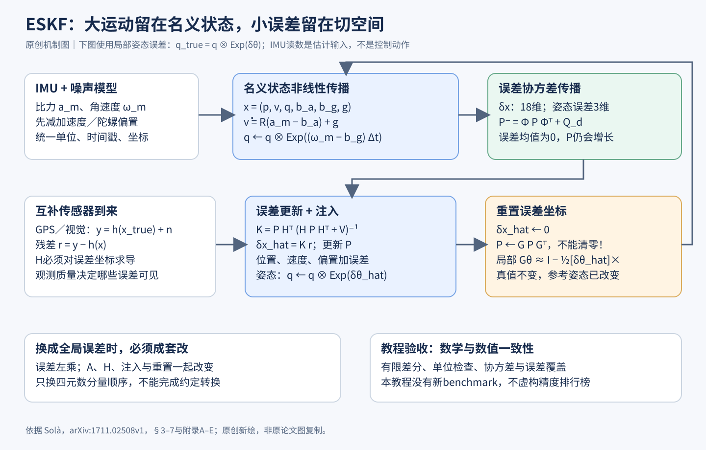

# Solà ESKF 全文精读与机制图解

> 角色：旋转、惯性积分和误差状态滤波的数学教程与算法基线，不是 ESKF 首创论文，也不是一个带公开排行榜的完整定位系统。固定阅读 arXiv:1711.02508v1，PDF内日期2017-11-08，共95页。覆盖正文1–7、附录A–E及参考文献；不虚构精度、速度或相对其他系统的benchmark。

## 1 先理解为什么要拆成两条轨道

惯性导航一方面要处理身体真实的大幅运动，另一方面要估计目前预测错了多少。若直接给四元数四个分量套普通加法更新，会与单位长度约束纠缠；若使用三个欧拉角，又会遇到姿态参数奇异性。ESKF把大运动放进非线性的名义状态，用单位四元数保存姿态；把小误差放进局部三维切空间，用高斯均值和协方差递推。这不是把机器人运动假设为很小，而是假设“真实状态相对当前估计的误差”足够小。[来源：§5.1–5.2]

论文前半部分的四元数、SO(3)、指数映射和雅可比，都是后半滤波器的接口规范。它最适合用来追查符号、坐标和协方差错误，而不是只从末尾抄一个18维矩阵。全文最大的教学贡献是把“在哪个空间相加、在哪一侧相乘、误差在哪个坐标系”从模糊默认变成显式选择。

## 2 四元数四项约定必须成套记录

作者采用Hamilton乘法、标量在前，并以q将局部向量变换到全局：a_G=q⊗a_L⊗q*。组件存储顺序、乘法代数、主动／被动解释、坐标变换方向是不同问题；仅看到(x,y,z,w)不能认定程序使用JPL乘法。旋转复合不交换，R_AB R_BC=R_AC所表达的坐标链比“先乘左边还是右边”的口语更可靠。[来源：§2.6、§3]

单位四元数 q与−q表示同一姿态，这是SO(3)的双覆盖。旋转向量φ=θu到四元数的映射为 Exp(φ)=[cos(θ/2),u sin(θ/2)]；到旋转矩阵则为exp([φ]×)。半角是四元数表示的几何性质，不能把旋转矩阵的指数公式直接移植成四元数。小角时Exp(δθ)≈[1,δθ/2]。SLERP若想走最短姿态路径，还需处理两个四元数内积为负时的符号选择。[来源：§2.3–2.8]

局部误差定义 q_true=q⊗Exp(δθ_L)，误差右乘；全局误差定义 q_true=Exp(δθ_G)⊗q，误差左乘，两者由δθ_G=Rδθ_L联系。姿态对局部扰动的雅可比并不是对四元数四个自由分量求导。右雅可比J_r把旋转向量参数增量换成当前姿态处的切空间增量，满足Exp(φ+δφ)≈Exp(φ)Exp(J_r(φ)δφ)。这解释了不少预积分和优化公式中为什么多一个J_r。[来源：§4.1–4.5]

## 3 状态、观测和所谓输入

名义状态x=(p,v,q,b_a,b_g,g)共19个存储分量，但姿态只有三个自由度；误差δx=(δp,δv,δθ,δb_a,δb_g,δg)为18维。若把重力当已知常量而不估计，常见实现会变成15维误差状态；不能把教程的18维与某工程的15维差异误认为谁遗漏了状态。作者还讨论把初始姿态设为确定、把初始倾斜不确定性转移给重力方向的建模选择。[来源：§5.3、表3]

加速度计测量的是比力：a_m=R_trueᵀ(a_true−g_true)+b_a,true+n_a；陀螺仪给局部角速度ω_m=ω_true+b_g,true+n_g。偏置按随机游走建模。滤波传播把IMU读数称为输入u，但它们不是控制器主动选择的动作，更不是神经策略输出。GPS、视觉等互补传感器则通过一般观测y=h(x_true)+n进入校正；本文没有为所有传感器提供一个通用h。[来源：式230–236、§6]

## 4 从真实方程减去名义方程

名义传播为 ṗ=v，v̇=R(a_m−b_a)+g，q̇=½q⊗(ω_m−b_g)，偏置和重力的名义导数为零。把真实状态替换成名义加误差，并保留误差的一阶项，会得到局部误差动力学：δṗ=δv；δv̇=−R[a_m−b_a]×δθ−Rδb_a+δg−Rn_a；δθ̇=−[ω_m−b_g]×δθ−δb_g−n_g。偏置误差由随机游走噪声驱动。[来源：§5.3.2–5.3.3，式237–259]

速度式中姿态误差为什么会变成加速度误差？因为同一个机体系比力，经过稍微错误的旋转便指向稍微错误的全局方向。用R_true≈R(I+[δθ]×)展开，再利用[δθ]×a=−[a]×δθ，就得到−R[a]×δθ项。这个项连接了姿态、速度、位置误差：很小的倾角偏差也能把重力错误地积分成持续速度漂移。陀螺仪偏置因此不能只当成姿态模块内部的小问题。

这里有小误差线性化、白高斯噪声和偏置随机游走等假设。教程有时把Rn_a直接改写为n_a，只有噪声各向同性时旋转后协方差不变；三轴噪声不同就必须保留RΣRᵀ。这个细节会影响你从传感器数据手册生成过程噪声，不能无条件照搬单位阵。[来源：式248–250、附录E.2.1]

## 5 离散传播是均值与不确定性两件事

名义姿态可用q←q⊗Exp((ω_m−b_g)Δt)更新，位置、速度按当前加速度积分。误差动力学写成δẋ=Aδx+噪声，得到状态转移Φ；协方差按P⁻=ΦPΦᵀ+Q_d传播。误差均值若已经重置为零，预测后仍为零，所以可以不显式传播零向量；但P必须继续传播，零均值从不意味着零不确定性。[来源：§5.4，式260–271]

附录A从Euler、中点到RK4讲名义积分，B在区间内A固定时推导Φ=exp(AΔt)及IMU分块闭式解，C比较整矩阵截断和分块截断，D讨论A随时间变化时积分Φ̇=A(t)Φ。低阶近似便宜，但忽略的交叉项会随采样间隔变大而更明显；“更高阶”也不自动解决噪声参数不准或模型错误。旋转增量仍应保证落回合法姿态空间，某些带加法修正的四元数积分须检查归一化。[来源：§4.6、附录A–D]

噪声离散化尤其容易抄错。附录E区分一个采样值在整个时间间隔内保持的测量噪声和连续随机游走扰动：前者按该采样噪声方差乘Δt²，后者按连续强度乘Δt。数据手册的噪声密度与离散采样标准差不是同一个量，不能看到白噪声就机械决定乘Δt还是Δt²。一般连续白噪声模型还需Q_d=∫Φ(Δt,τ)LQ_cLᵀΦ(Δt,τ)ᵀdτ；这是标准线性随机系统的补充解释，不能把附录的简化冲量式误当任何模型下的精确离散化。

## 6 更新、注入、重置缺一不可

新传感器到来时计算残差r=y−h(x)，观测雅可比必须针对误差坐标：H=∂h(x⊕δx)/∂δx|₀。它可以由链式法则分成普通状态观测雅可比和状态组合雅可比，四元数对应4×3块；不能把对19维名义存储向量求的导数直接喂给18维误差协方差。[来源：§6.1，式274–281]

卡尔曼增益K=PHᵀ(HPHᵀ+V)⁻¹，估计误差δx_hat=Kr；再把平移量相加、把姿态误差以q←q⊗Exp(δθ_hat)注入名义状态。协方差更新可以使用Joseph形式，原文脚注明确提醒简单(I−KH)P可能失去数值对称性或正定性。[来源：§6.1–6.2，脚注26]

注入之后，真实姿态没变，名义姿态却变了，所以“误差相对谁定义”也变了。必须把误差均值归零，并将协方差运输到新误差坐标：P←GPGᵀ。局部误差的一阶姿态重置块为G_θ≈I−½[δθ_hat]×；全局误差变成I+½[δθ_hat]×。重置不是把P清零，也不是在任何情况下都能忽略G。小修正时G≈I可以是工程近似，但应明确误差阶数。[来源：§6.3、§7.3]

## 7 全局误差版本不是只交换一次乘法

第7节保持IMU角速度仍在机体系，而把姿态误差换成全局定义。名义轨迹方程不变，误差方程、观测组合雅可比、注入方向和重置雅可比都要成套修改。此时δθ̇_G=−Rδb_g−Rn_g，速度姿态耦合变为−[R(a_m−b_a)]×δθ_G。表4将这些差异并列，是实现核对清单。[来源：§7、表4]

不要从式子更短推断全局版本在所有系统都更准，也不要把该版本自动等同于任意Invariant EKF。滤波一致性还取决于可观测性、线性化点、观测模型和噪声建模。仅靠IMU不能消除所有漂移；互补传感器要在实际运动与几何条件下提供所需约束。所谓“误差状态一直小”是设计目标及局部近似工作条件，不是遭遇大初始偏差或错误观测后仍然成立的无条件定理。

## 8 教程怎样变成可检验的基线

本文没有实验榜单，合理验收方式是数学与数值一致性测试：随机生成姿态和小扰动，用有限差分检查H、A及重置G；比较四元数旋转与矩阵旋转；验证q与−q结果相同；静止IMU应满足重力与比力符号一致；改变Δt后检查噪声方差单位与增长速度；用模拟真值检查协方差是否覆盖实际误差。以上为建议测试，不是作者已报告的实验。

一个量纲自测：假设未被校正的倾角误差为1°，静止时可产生约9.81×sin(1°)=0.171 m/s²的虚假水平加速度；若持续10秒且不考虑其他反馈，位置误差约为½at²=8.56米。这是简化推算，不是论文实测，它说明只报告姿态误差“看起来很小”远远不够。

与学习式机器人连接时，ESKF可为策略提供速度、姿态和不确定性，网络也可提供视觉观测、偏置修正或噪声估计。但网络输出进入滤波器前仍需明确坐标系、时间戳、相关性和协方差，不能把一个任意置信分数当作统计方差。它与ORB-SLAM3共享旋转及惯性数学，架构上却分别属于递推滤波与多时刻优化。先学此篇，再读VIO／SLAM、MPC或腿足策略，能把“输入状态”看成有假设和失效边界的估计量。

## 来源与审计

- [官方固定版本全文](https://arxiv.org/pdf/1711.02508v1)，重点：§3–4旋转约定；§5–7滤波闭环；附录A–E积分与噪声
- [逐条证据与版本](../../docs/deep-readings/evidence/eskf.json) · [阅读覆盖](../../docs/deep-readings/evidence/eskf-coverage.json)

## 图解文件与证据索引

[SVG高清图](../../assets/baselines/robotics/eskf.svg) · [SVG可编辑图](../../assets/baselines/robotics/eskf.svg) · [结构化证据](../../docs/deep-readings/evidence/eskf.json)

来源类型：本次为细分方向新选择的 baseline，不是历史聊天提取。
