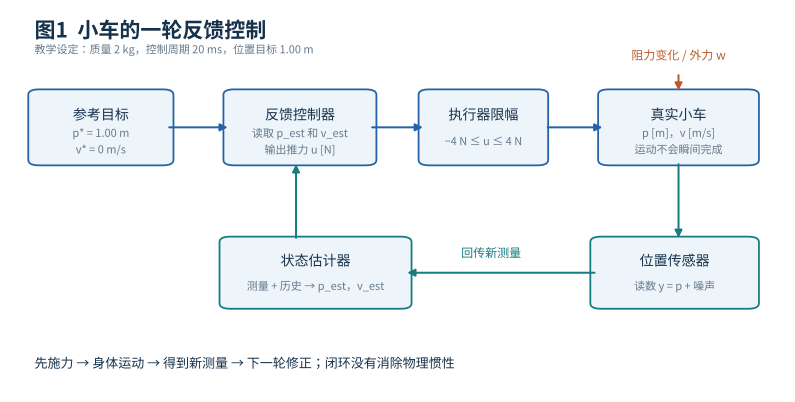
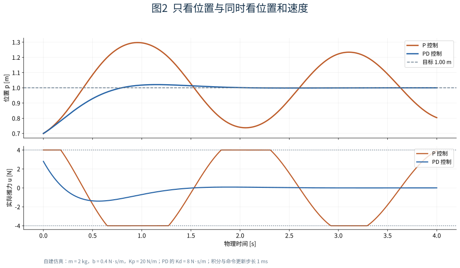
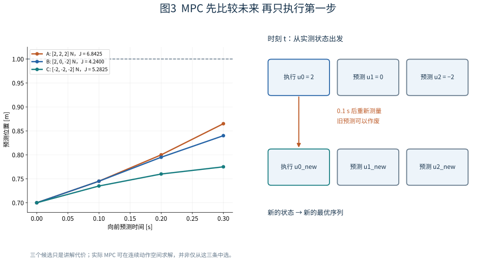
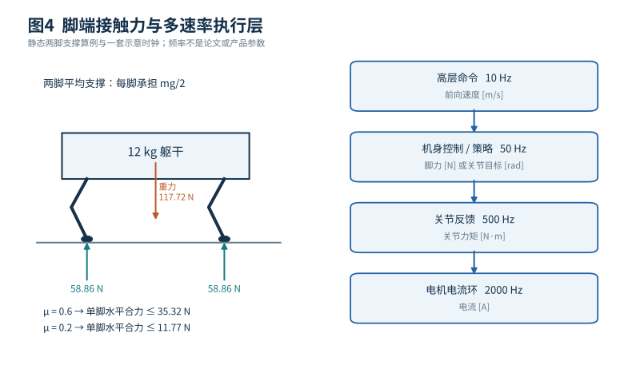
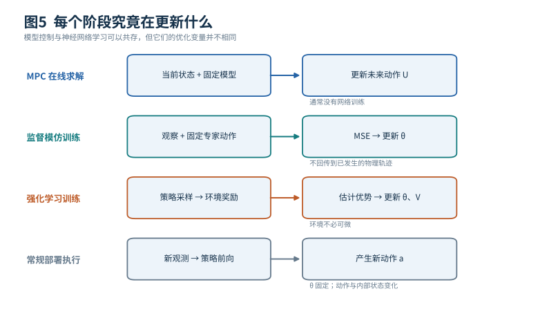

# 运动控制与足式运动入门 从一辆小车到四足机器人的每一次落脚

机器人已经知道要走到桌边，为什么还会摔倒？因为“去哪儿”和“下一瞬间怎样施力”是两个问题。路径上的一个位置不会自动变成电机电流；电机施力后，身体也不会瞬间抵达目标。它有质量、惯性、接触、延迟和测量误差。运动控制研究的就是：在这些限制下，反复根据当前测量产生可执行输入，让真实运动接近期望运动。

本篇只假定你理解位置、速度、力和基础神经网络。我们先用一辆只能沿直线运动的小车，把反馈、PID、LQR和MPC的每一步算清楚；再把同一思路扩展到四足机器人的接触力和关节命令；最后解释神经网络控制器的训练损失从哪里来，以及为什么部署时“在适应”不一定意味着“在更新权重”。文中小车参数、四足算例和时钟配置都是自建教学设定，不是某篇论文的实验复现。论文的特定结论会单独标明来源。

## 1 先规定一个能验收的任务

设一辆质量为2 kg的小车在水平轨道上移动。位置记作p，单位m；速度记作v，单位m/s；电机对车的水平推力记作u，单位N。电机最多输出正负4 N。任务是从p=0.70 m、v=0.40 m/s出发，停在p*=1.00 m附近。我们规定：位置误差小于0.01 m、速度绝对值小于0.02 m/s，并连续保持0.5 s，才算到位。这样，“到位”就不是某一帧恰好穿过目标。

轨道有阻力。先采用简单模型：

$$
\dot p=v,\qquad m\dot v=u-bv+w,\qquad m=2\ {\rm kg},\ b=0.4\ {\rm N\,s/m}.
$$

点号表示对时间求导；b v是与速度反向的阻力；w是模型没提前知道的外力，例如有人推了一下。模型不是神经网络，而是我们写下的运动规律。真实轨道的阻力未必恰好与速度成正比，这正是后面需要反馈的原因。

每隔Δt=0.02 s，控制器得到一次状态估计并更新推力，即50 Hz。假设在两次更新之间保持u不变。用最简单的显式欧拉近似，仿真一步就是：

$$
p_{t+1}=p_t+\Delta t\,v_t,\qquad
v_{t+1}=v_t+\Delta t\frac{u_t-bv_t+w_t}{m}.
$$

例如此刻u=2.8 N、w=0，则加速度为(2.8−0.4×0.4)/2=1.32 m/s²。20 ms后，模型给出p=0.708 m、v=0.4264 m/s。位置没有一下变成1 m；控制器只改变了接下来运动的趋势。这个小计算已经说明，动作的单位和持续时间缺一不可：“输出2.8”若没说是N、m/s还是目标位置，就还不是一个可执行控制接口。

## 2 状态 观测 估计和目标不是同一种量

这辆车的动力学状态是x=[p,v]。知道当前p、v以及未来输入，就能在该模型下预测未来。传感器实际读到的可能是位置编码器值y=p+噪声，并不直接提供准确速度。状态估计器要利用连续测量和运动模型，给出p̂、v̂。例如真实p=0.700 m时，测量可能为0.695 m，估计为0.698 m。控制器只能使用它实际拿得到的数。

任务目标p*=1.00 m是外部给定的参考，不是测量。控制输入u是发给执行器的命令，不是车已经产生的运动。仿真中知道的真实位置、质量和阻力，也不等于部署时都能测到。后文说“用状态做控制”时，除非特别注明，部署接口指的是估计状态。

图1把一个20 ms周期展开。先看蓝色通路：参考位置和估计位置、速度进入控制器，控制器输出N为单位的推力；限幅器保证发送值在±4 N内；真实车据此运动。再沿下方箭头回来：传感器读到结果，估计器重新估计p和v，下一轮用新的误差计算输入。橙色的外力和阻力变化进入的是物理系统，不会自动成为控制器已知输入。这个“动作会改变下一次观察”的回路，正是控制与静态图片分类最关键的不同。

如果预先算好一串推力，之后不再看传感器，就是开环执行。模型、初始位置或外力稍有误差，结果就会偏移。闭环不是保证永不出错，而是让后续动作有机会针对已经发生的误差修正。

## 3 从P到PD再到PID 每一项在补偿什么

最容易想到的规则是：离目标越远，推力越大。定义误差e=p*−p，比例控制写成u=Kp e。这里Kp的单位是N/m，因为米乘以N/m才得到牛顿。令Kp=20 N/m，初始误差0.30 m时，计算得到6 N，但电机只能发4 N，实际发送的是4 N。

为什么只看位置容易越过目标？设车已经到了p=0.95 m，却仍以0.60 m/s向前。P控制还在输出20×0.05=1 N的向前力。它看到“还差5 cm”，却没有充分处理“车正高速冲向目标”。即使到p=1 m时推力降为零，车也不会失去已有速度。

加入与速度相反的阻尼项，得到PD控制。对于固定位置目标，e的导数等于−v，因此：

$$
u_{\rm PD}=K_p(p^*-p)-K_dv.
$$

取Kd=8 N·s/m。初始p=0.70 m、v=0.40 m/s时，u=6−3.2=2.8 N，正好是前面算过的一步。到p=0.95 m、v=0.60 m/s时，u=1−4.8=−3.8 N，控制器开始向后施力，提前减速。它不是“快到目标就凭经验小心一点”，而是明确把速度反馈写进了命令。

忽略限幅、保持模型准确时，令位置误差相对目标表示，闭环动力学会出现m p̈+(b+Kd)ṗ+Kp(p−p*)=0。这和质量、弹簧、阻尼器的方程相同：Kp提供“拉回目标”的作用，Kd增加耗散。增益不能无限大，真实传感器噪声、离散采样、通信延迟和电机带宽都可能让激进反馈振荡。[1]

图2不是论文性能曲线，而是用本篇方程和参数生成的数值实验。上图看位置：虚线是目标，P曲线容易跨过去，再被拉回来；PD较早减速。下图同时画出实际发送的推力，平顶或平底对应±4 N限幅。应把两幅图一起读：较快接近目标未必意味着较好停稳，控制输入是否长期顶在上限也很重要。图中采用1 ms显式欧拉步长进行教学仿真；它展示这个模型下的现象，不能作为实机稳定性证明。

如果存在恒定外力，例如w=−1 N，PD静止时v=0，必须保留一定位置误差才能产生补偿力：20e−1=0，得到e=0.05 m。要消除这样的稳态偏差，可以引入积分I=∫e dt，得到PID：

$$
u=K_pe+K_iI+K_d\dot e,\qquad
I_{t+1}=I_t+\Delta t\,e_t.
$$

Ki单位是N/(m·s)。积分项在误差持续存在时逐步累积，即使当前位置误差最终接近零，也能保持抵消恒定外力的输入。但如果电机已经饱和，积分仍不断累积，目标改变后会留下过大的历史补偿，这叫积分饱和。实际实现需要限积分或抗饱和回算；微分项也常需滤波，以免放大测量噪声。[1]

这里没有训练数据、神经网络权重或反向传播。选择Kp、Ki、Kd叫控制器设计或调参；也可以用数据辅助调参，但不能因此把每次PID计算说成一次神经网络训练。每轮变化的是误差、积分状态和输出，通常不是三项增益本身。

## 4 LQR 把多种误差写成一个可优化的代价

PD告诉我们速度很重要，但位置误差和速度应该各占多大权重？如果系统有十几个相互耦合的状态，逐项手调就更难。线性二次调节器LQR提供一种规范答案：先规定线性动力学，再规定状态偏差与控制输入的二次代价，求出一组反馈增益。[2]

为了可以清楚手算，下面暂时忽略小车阻力，仍保留质量2 kg。用目标相对坐标ξ=[p−1,v]，线性系统为：

$$
\dot\xi=A\xi+Bu,\quad
A=\begin{bmatrix}0&1\\0&0\end{bmatrix},\quad
B=\begin{bmatrix}0\\1/2\end{bmatrix}.
$$

目标不是神秘地“喂给优化器”，而是通过ξ的第一项变成相对1 m的误差。我们设定代价：

$$
J=\int_0^\infty\left[20(p-1)^2+4v^2+u^2\right]dt.
$$

这里采用以1 m、1 m/s、1 N为尺度的数值坐标；若保留物理单位，权重必须带相应倒数量纲，使不同项能够相加。位置项大，表示更在意离目标远；速度项大，表示更不愿快速运动；输入项大，表示更不愿用力。把米换成厘米却不改权重，会改变实际优化问题，而不只是改变显示格式。

LQR通过求解Riccati方程得到u=−Kξ。对于上述特定数值，K≈[4.4721,4.6785]。因此在p=0.70 m、v=0.40 m/s时，u≈−4.4721×(−0.30)−4.6785×0.40=−0.530 N。它已经开始刹车，而前面的PD还在轻推。这不表示谁算错了：两个控制器的增益对应不同权衡。LQR的“最优”只针对指定模型、代价和假设成立。[2]

对这个二阶系统，可以把LQR看成一种有原则地确定PD样式增益的方法；但多变量系统里的K通常是矩阵，某个电机输入会同时响应多个状态偏差。LQR的计算会利用系统耦合，不是为每个关节独立抄一份PID。

标准无限时域LQR常在运行前求好K，部署每轮只做矩阵乘法。求解Riccati方程不是用轨迹标签训练网络，运行时也没有必须更新的网络权重。它还没有自动处理输入饱和或障碍约束：事后把u截断到±4 N，会改变原来的最优性和闭环分析。非线性机器人可在工作点附近线性化后用LQR，但大幅离开该区域时，原近似可能不够准确。

## 5 MPC 把未来动作序列当成当前优化变量

如果我们要求“不能越过1.05 m”“推力始终不超过4 N”，仅写一个二次代价不够。模型预测控制MPC把接下来一小段动作列为待求变量，用模型预测每个候选序列的后果，并显式施加约束。它在每个控制周期重新求解一次，再只执行第一个动作。[3]

为了展示数值，沿用无阻力的小车模型，但把本节预测间隔设为0.1 s。在每段推力恒定的前提下，这个模型的精确离散化是：

$$
p_{k+1}=p_k+0.1v_k+0.0025u_k,\qquad
v_{k+1}=v_k+0.05u_k.
$$

0.0025来自Δt²/(2m)，0.05来自Δt/m。它与前文显式欧拉有区别：位置更新包含这一小段加速度的贡献。写代码前必须统一采用哪个离散模型，不能把二者的数值混用。

只看未来3步，从p=0.70、v=0.40开始，试三个动作序列。序列A为[2,2,2] N，最后p=0.865 m、v=0.70 m/s；序列B为[2,0,−2] N，最后p=0.840 m、v=0.40 m/s；序列C为[−2,−2,−2] N，最后p=0.775 m、v=0.10 m/s。A离目标最近，却也冲得最快。

设本节演示代价为J=100(p₃−1)²+10v₃²+0.01Σuₖ²。代入得到A为6.8425、B为4.2400、C为5.2825，所以这三个候选中应选B。这个比较只是解释代价怎样工作，不是声称MPC只会枚举三个序列，也不是证明B是所有连续输入中的全局最优解。实际求解器会在允许的连续空间中求解相应优化问题。

图3先看左半边：三条预测轨迹终点不同，代价也不同；终点更靠近目标的A因为速度过大而输给B。再看右半边：在时刻t，控制器求出[u₀,u₁,u₂]，只执行u₀；0.1 s后重新读取实际状态。假如有人推动小车，实测状态不等于原预测，控制器就从新状态求[u′₀,u′₁,u′₂]，而不是坚持旧计划。右侧灰色动作表示“曾经预测过但未直接照单执行的未来”。

一般形式可写成：

$$
\min_{u_0,\ldots,u_{H-1}}\sum_{k=0}^{H-1}
\bigl[\|x_k-x_k^{\rm ref}\|_Q^2+\|u_k\|_R^2\bigr]
+\|x_H-x_H^{\rm ref}\|_{Q_f}^2,
$$

$$
\text{使得 }x_{k+1}=f_d(x_k,u_k),\quad x_0=\hat x_t,
\quad |u_k|\le4,\quad p_k\le1.05.
$$

H是预测步数，HΔt是向前看的物理时长；\|z\|²_Q表示zᵀQz。动力学等式保证预测不是随便画出来的曲线，输入和位置不等式表达允许范围。线性动力学、凸二次代价和线性约束会给出二次规划QP；非线性MPC可能需要迭代求近似解，并不天然具有同样的凸性和速度。

本节真正被优化的是这一轮的动作序列u₀…uH−1，通常不是某个神经网络θ。即使求解器内部使用梯度或牛顿法，也不能把它与“训练一个控制策略网络”混为一谈。MPC可使用学习得到的模型，但那是另外一组模型参数，其训练与在线选动作需要分别说明。

MPC的限制也能从这个小例子看到。只看0.3 s可能不足以充分评估停稳过程；模型低估制动距离会导致约束在真实世界失效；求解超时则会错过控制周期。较长预测窗、终端代价和合适终端约束可以改善设计，但任何一个“MPC”标签本身都不自动给出安全、可行性或稳定性保证。[3]

## 6 为什么四足机器人不能简单变成十二个小车

四足机器人通常有多个关节电机，但身体在空中的六个自由度没有直接驱动电机。身体向前加速、维持高度和调整姿态，主要依赖脚与地面的接触力。腿伸在空中时，电机可以改变腿的位置，却不能凭空得到任意地面支撑力。这是足式运动比独立关节位置跟踪更难的核心。

先把机器人躯干近似为一个质量为12 kg的刚体。世界坐标z轴向上，地面对第i只脚的力为fᵢ。质心p的平动近似满足：

$$
m\ddot p=\sum_i f_i+m g,\qquad g=[0,0,-9.81]^\mathsf T\ {\rm m/s^2}.
$$

静止站立时，所有脚的向上支撑力总和必须约为117.72 N。如果四脚均匀承担，每脚约29.43 N；如果只有两脚支撑，平均每脚需要58.86 N。三条腿抬起来，剩下一条腿并不会因为上层说“保持高度”就自动拥有足够的力矩和稳定裕量。

转动也重要：接触点相对质心的力臂rᵢ与力fᵢ产生力矩rᵢ×fᵢ。合力正确但力矩错误，机身仍可能前后翻转。同样的总向上力，分配在前脚或后脚上，会产生不同的俯仰运动。因此控制器需要同时关注机身位置、速度、姿态和角速度。

接触力不是任意三维向量。支撑脚通常只能推地，不能把地面向上拉，所以f_z≥0；摩擦限制水平力，理想各向同性库仑近似为√(f_x²+f_y²)≤μf_z。假设μ=0.6、单脚f_z=58.86 N，允许的水平合力上限约35.32 N；若踩到μ=0.2的表面，则约11.77 N。继续命令原来的大水平力可能打滑，而不是获得期望加速度。

四足MPC可以把未来各脚的接触力作为变量；身体动力学连接“脚力”与“机身会怎么动”，摩擦与接触安排成为约束。某脚处于摆动阶段时，其地面接触力被设为零。若提前给定哪只脚何时支撑，问题会比同时选择所有接触模式容易很多；但这也限制了优化器自行改变步态的自由。[4]

## 7 从机身运动到电机命令 中间还隔着哪些接口

图4左边是一幅自建静态支撑算例。向上的箭头是地面对脚的力，箭头总和抵消重力；旁边的摩擦边界提醒你，接触还限制水平用力。右边是示意工程系统的多速率接口：高层给期望速度，机身控制器给脚力或姿态相关命令，关节控制器更快地给力矩，电机电流环再追踪电流。图中的10、50、500、2000 Hz是帮助理解预算的示例配置，不是行业统一参数。

如果一个控制器输出脚端力，怎样变成关节力矩？运动学雅可比J描述关节小速度怎样改变足端小速度，v_foot=J q̇。根据功率一致性，对于一致定义的足端广义力，关节力矩满足τ=JᵀF。若MPC变量定义为“地面对机器人”的力，而执行器接口需要机器人施加给地面的力，必须核对负号和坐标变换。这个公式还不是完整动力学补偿；腿自身的重力、惯性和科氏项可由额外前馈或全身控制处理。

如果控制器输出的是目标关节角，则另一种接口是关节PD：

$$
\tau_j=K_{p,j}(q_j^{\rm des}-q_j)
+K_{d,j}(\dot q_j^{\rm des}-\dot q_j).
$$

角度单位rad，角速度rad/s，力矩N·m。示例中q_des=0.45 rad、q=0.30 rad、目标速度0、实际速度0.20 rad/s、Kp=40 N·m/rad、Kd=1 N·m·s/rad，得到τ=5.8 N·m。随后仍要经过硬件许可的力矩、速度与温度限制。

所以“网络控制机器人”必须继续追问：网络输出目标角、角度增量、速度、脚力还是直接力矩？输出目标角并不代表它绕过了传统控制；很可能神经网络下面正运行着高速PD和电流环。不同接口会改变动作平滑性、探索风险和训练难度，不能仅比较网络层数。

Di Carlo等人的Cheetah 3系统是明确的模型控制例子：它用约简躯干模型与预定接触安排在线优化接触力，还包括状态估计、摆动腿控制和底层执行环。原文的MPC更新率与低层千赫兹级控制不同，不能把求解器的一次耗时等同于整机控制频率。这里没有通过奖励端到端训练一个行走网络。[4]

## 8 神经控制器怎样获得参数 先分清两种训练

设神经策略a=πθ(o,c)，输入o是可用观测，c是命令，例如期望前向速度0.5 m/s。为了明确接口，可让a是十二维无量纲残差，每维限制在[−1,1]，再转换为q_des=q_nom+0.25 rad×a。若某维a=0.4，就是在名义角度上增加0.10 rad，之后交给关节PD。这个动作缩放是设计的一部分，不是网络输出自动具有的物理意义。

一种训练路线是模仿现有控制器。专家标签必须与学生采用同一种动作接口、单位和归一化：这里a*应是无量纲关节角残差。前文四足MPC输出的是接触力，不能把以N为单位的脚力直接当成这个标签；必须先明确生成相应关节目标的控制链，或改用输出脚力的学生并保留其下游控制器。随后让这个接口一致的专家在很多初始状态下运行，保存(o,c,a*)，再最小化L=平均½‖πθ(o,c)−a*‖²。对某条样本，网络输出a=0.3、专家为0.5，则输出端梯度为0.3−0.5=−0.2；反向传播把这个梯度传到θ，优化器更新网络参数。专家标签固定，采集过的数据固定，原来的物理轨迹并不会随着这次反向传播被改写。这种监督学习学的是“遇到类似观察时像专家那样做”。

另一条路线是强化学习。策略在仿真中执行动作，环境产生新状态和奖励，再由PPO等算法把累计表现转换为策略参数梯度。希望走得快，可以奖励速度跟踪；希望少抖动，可以惩罚动作差分；希望少摔，可以定义摔倒终止或失败代价。但“写好奖励”不等于“已经知道每个时刻的正确关节角”。算法必须根据大量轨迹估计哪些行为值得提高概率，奖励、价值估计、探索与优化各负责不同工作。下一篇会完整手算这个链条。[5]

一个自建的速度跟踪奖励可以含exp(−((v_x−v_cmd)/(0.25 m/s))²)。命令0.5 m/s、实际0.3 m/s时，该项约0.527。再加无量纲化后的姿态、能耗与动作变化代价。必须说明奖励是每控制步发放还是按物理秒积分；控制频率变了，固定的“每步惩罚”会改变单位时间内的权重。力矩平方也是控制努力指标，不自动等于真实电能，不能把它的下降直接叫省电百分比。

图5从上到下读。第一行MPC每轮改变待执行动作序列；第二行监督模仿用专家动作误差更新θ；第三行强化学习用实际采集的奖励和轨迹形成损失，再更新θ及价值网络；最下方部署一般只做前向计算。图中“固定”表示这一步没有优化器更新，并不表示物理状态不变。读任何学习控制论文时，都可以照此给每个模块标上“本阶段更新”或“本阶段冻结”。

## 9 RMA的适应 为什么不是边走边重新训练全部网络

真实机器人无法直接读取地面摩擦、载荷质量等真值，仿真却可以提供这些特权信息。RMA把这个差异拆成两个阶段：先让环境编码器把特权参数e编码为z，再让基础策略结合自身观测和z产生动作；这一阶段用强化学习训练基础策略和环境编码器。然后冻结它们，训练历史适应网络φ，让它从最近的观测和动作历史预测ẑ，损失是‖ẑ−z‖²。[6]

这里损失的两端有明确身份。z是冻结编码器给出的监督目标；ẑ是可训练φ的预测。反向传播只更新φ，不要求把仿真接触过程微分一遍。适应阶段的数据还要覆盖“使用当前不完美ẑ来控制”时遇到的状态，不能只在理想专家轨迹上做静态回归。[6]

部署时真实e不可见，所以用ẑ替代z。基础策略仍用当前关节和机身信息闭环控制；历史网络不断用最新运动结果改变ẑ。网络权重可保持固定，却因为输入历史变了，输出的环境表示和动作跟着变。原论文报告基础策略100 Hz、适应模块约10 Hz，正体现了不同模块可以按不同时间尺度运行。不能据此推导所有机器人都应使用同样频率。[6]

这种适应也有信息边界。机器人还没踩上湿滑表面时，单靠已经发生的本体感觉未必能预测远处摩擦；两个不同物理原因可能造成相似短期运动，隐变量也不一定有“这一维就是质量”的可解释意义。快速适应提供的是训练分布内外的一种补偿机制，不是任意环境识别和任意摔倒恢复的保证。

## 10 从仿真到现实 必须逐项追踪误差进入哪一层

仿真到现实的差异至少会进入四个地方。第一是身体动力学，例如真实载荷和惯性不同；第二是接触，例如摩擦、地面柔软程度和碰撞模型不同；第三是观测，例如噪声、坐标偏置、丢帧；第四是执行，例如电机延迟、饱和和命令刷新频率不同。一个网络在无延迟仿真里学会急促补偿，部署后可能恰好总在补偿上一个状态。

域随机化是在训练时变化这些因素，使策略见到更宽条件；系统辨识是通过测量让仿真参数更接近实物；历史适应是在运行时根据近期结果改变内部条件表示；显式约束与保护层则限制命令。这些措施作用不同，可以组合，但没有任何一项单独把真实安全变成自动成立的结论。[6]

也不能只靠增大“摔倒惩罚”让已经倒地的机器人站起来。如果仿真一倒地就终止，数据中根本没有倒地后的动作；如果动作接口或力矩上限使翻身不可行，奖励再大也不会创造新动力学；如果探索从未找到能恢复的序列，优化器也没有正例去提高它的概率。恢复训练需要可达的状态、合适初始分布、恢复轨迹或探索支持，以及允许执行恢复动作的任务设置。

测试时因此要区分三种结果：没有摔倒、能按命令前进、遭扰动后恢复任务。趴着不动可能在第一项得高分，却不是合格的行走控制。除任务成功率外，还应记录速度误差、姿态峰值、滑足、约束违反、控制延迟与失败类型，并说明样本数和条件。

## 11 把一篇控制论文读成可以检查的系统

读到一个控制方法时，按实际信号流复述一遍：传感器每多久给什么量，估计器输出在哪个坐标系，控制器接收什么目标，动作单位是什么，命令保持多久，哪些约束在哪里执行，新的运动结果何时进入下一轮。如果这些接口仍然模糊，先不要急着比较成功率。

接着分清三种计算。离线设计可能求LQR增益；在线优化可能每轮求MPC动作序列；离线学习可能通过MSE或策略梯度更新神经网络。它们都叫“优化”时，优化变量、数据来源和时间位置仍完全不同。系统中可以同时存在三者，例如用神经网络估计摩擦、MPC分配脚力、PD追踪关节目标。

最后问失败是否来自目标、信息、模型、动作能力还是更新时间。车停不准可能需要积分补偿；车刹不住可能是力矩或时延限制；机器人打滑可能是摩擦估计错；网络静止不前可能是奖励或数据分布问题；MPC求解超时则是实时预算问题。只有定位到具体接口，改动才有理由。

## 12 自己动手的最小学习路线

先在电脑里实现本篇2 kg小车。固定1 ms仿真步长，以20 ms周期更新PD命令；保存每次真实位置、观测、估计、未限幅输入和实际输入。比较仅P、PD、加入恒定外力后的PD与PID，检查稳态误差与积分饱和。不要直接把示例增益发到真实硬件。

然后暂时去掉阻力，复算三个MPC候选序列，确认成本分别为6.8425、4.2400、5.2825。再用一个QP求解器把动作改成连续优化变量，加入±4 N约束，比较0.3 s与1 s预测时长。故意把仿真质量改为3 kg而控制器仍认为2 kg，观察滚动反馈能补偿多少、何时补偿不够。

最后再读四足论文，把小车里的x、u、f_d换成机身状态、接触力和简化刚体动力学。先做静态四脚力分配，再切换到两脚支撑，检查力总和、力矩与摩擦边界。等这些接口清楚后，再研究学习策略怎样替换某个模块，才不会把“网络输出一个动作”误当成已经解决了整条执行链。

## 来源与延伸阅读

[1] Åström与Murray，Feedback Systems，PID Control官方章节索引，覆盖PID、执行器饱和、抗积分饱和与微分滤波。https://fbswiki.org/wiki/index.php/PID_Control

[2] Russ Tedrake，Underactuated Robotics，Linear Quadratic Regulators，含连续与离散LQR、Riccati方程、非线性系统局部线性化。https://underactuated.mit.edu/lqr.html

[3] Russ Tedrake，Underactuated Robotics，Trajectory Optimization，含直接转录、约束与模型预测控制。https://underactuated.mit.edu/trajopt.html

[4] Di Carlo等，Dynamic Locomotion in the MIT Cheetah 3 Through Convex Model-Predictive Control，2018。MIT官方记录与作者稿。https://dspace.mit.edu/entities/publication/bc8c7e1e-5830-443f-a879-787947111fcf

[5] Schulman等，Proximal Policy Optimization Algorithms，2017，§2–5及算法1。https://arxiv.org/pdf/1707.06347v2

[6] Kumar等，RMA Rapid Motor Adaptation for Legged Robots，2021，§III、算法1–2；作者项目页与论文。https://ashish-kmr.github.io/rma-legged-robots/ ； https://arxiv.org/abs/2107.04034

本篇五幅图均为原创教学图。图2是明确列出参数的自建模型仿真；图3数值由本篇离散方程计算；其他图用于解释接口，不冒充论文原图或实机测试。下一篇：[模仿学习与机器人强化学习](imitation-reinforcement-learning.md)。
