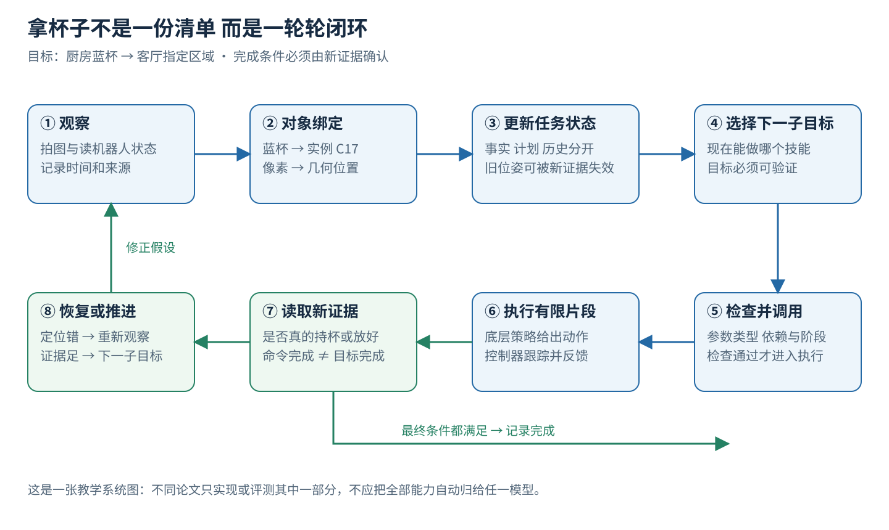
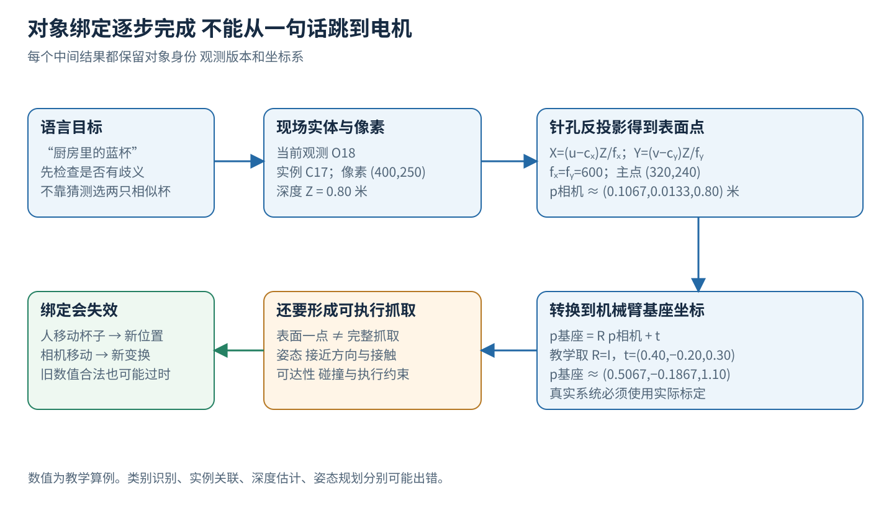
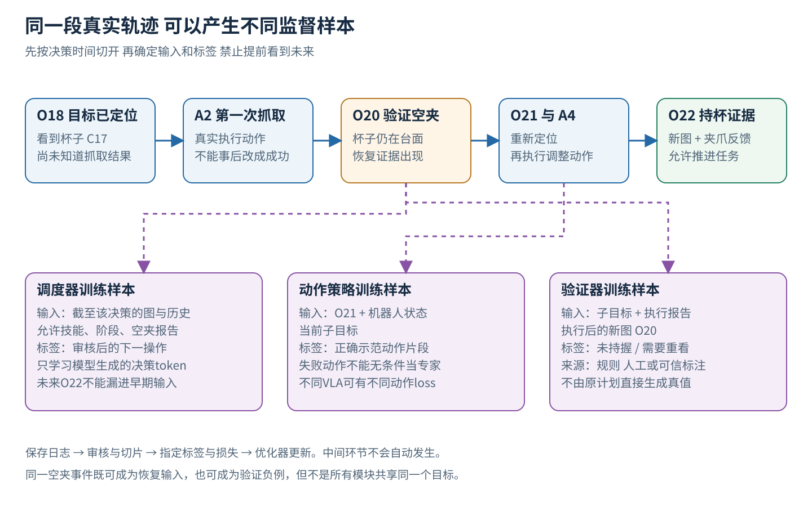
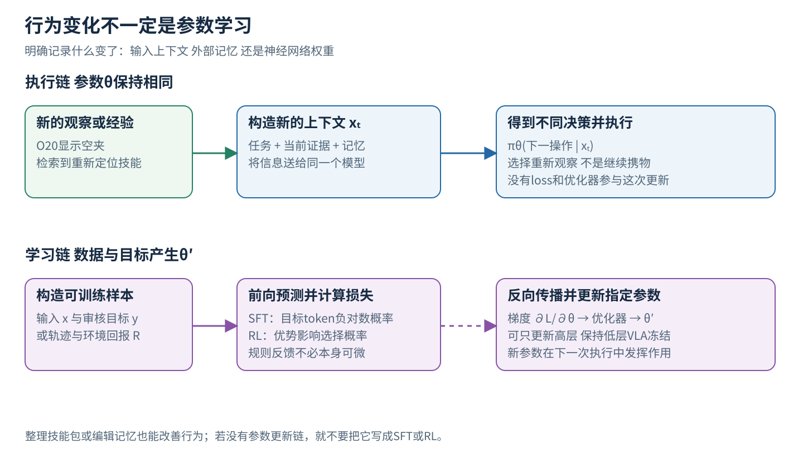
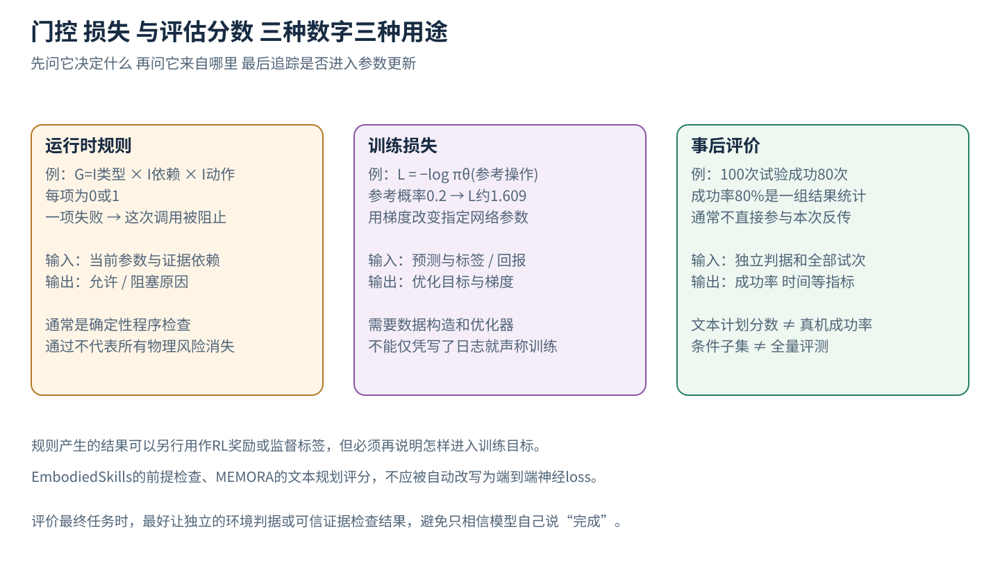

# 具身 Agents 从拿杯子任务走完决策执行和学习

“把厨房里的蓝杯拿到客厅桌上。”一个语言模型可以立即写出五个步骤，但机器人还要解决另一组问题：哪一个蓝色东西才是杯子？记忆中的位置是否还有效？抓取程序需要什么输入？夹爪闭合后真的拿住了吗？如果没拿住，是重新观察、调整抓取，还是停止？

具身Agent是把这些问题连成持续行动过程的系统。本文用同一个拿杯子任务，从原始观察走到对象绑定、状态更新、计划、技能调用、物理执行、验证与恢复，再把一段真实轨迹变成训练样本。读者只需要基础深度学习、物理和运动学知识；遇到机器人接口、技能、监督微调或强化学习术语时，我们会在它们实际发挥作用的位置解释。

这里有两条必须分别追踪的链。**执行链**改变输入、上下文、记忆和物理世界；**学习链**从经历构造标签、计算损失、反向传播并修改参数。前一条可以在参数完全冻结时运行；后一条需要显式构造的数据、损失和优化器。

蓝杯故事、接口、坐标和数值都是原创教学例子。四篇论文在相应章节作为不同机制的具体实例出现，各自只覆盖闭环中的一段：SayCan（Ahn等2022，用语言评分乘技能可行性评分来选下一个机器人技能）、EmbodiedSkills（Wang等2026，用带类型和前提的技能契约组织VLA Agent的规划、执行与验证）、RoboSkill（Xie等2026，把执行记录整理成可复用的外部技能）和MEMORA（Yu等2026，从第一人称视频形成可检索的具身记忆）。[1]—[4]

## 一 在开始之前定义完成意味着什么

### 目标写成可验证的物理状态

先把任务中的对象和完成条件说清楚。目标对象是厨房里的某只蓝杯，目的地是客厅桌面的指定区域。完成至少需要：杯子到达目标区域；杯子以任务允许的姿态稳定放置；机器人已经松开且没有把杯子带走。若要求杯中液体不能洒、某些物体不能碰，这些也必须成为约束。

“程序成功调用place”是软件事件，“杯子稳定地放在桌上”是物理状态；程序返回成功可能只说明命令被控制器接收。最终状态要靠新的传感器证据确认。

如果画面里有两只蓝杯，任务本身又没法区分，系统应获取额外信息或向人询问。若只有一只明显候选，我们可继续，但仍应保留对象绑定的依据。

### 模型和系统的边界在哪里

一个视觉语言模型可以读图、给描述或生成下一步建议；一个VLA可以从图像、语言和机器人状态生成动作。Agent还需要安排何时调用哪个部件，把输出放到正确字段，处理工具错误，在动作结束后读取新证据。

这里的“工具”是可调用的软件接口，例如获取相机图、查询地图、规划路径、运行抓取策略。工具后面可能是神经网络、传统算法或确定性程序。证据地位取决于来源：read_camera返回传感器图像，predict_image返回生成图像，二者都叫“图像”，只有前者是观测证据。

所谓高层与低层，首先是决策尺度不同。高层可能决定“先去厨房，再抓杯子”，按任务步更新；低层控制器按电机周期连续修正电机或末端跟踪误差。SayCan提供了一种把任务语言和可执行技能连接起来的具体办法。[1]

图1　原创拿杯子闭环。上半圈把观察变成可执行决策，下半圈把真实执行结果变成新证据。失败会返回对应的环节。

## 二 第一步 观察必须带上时间和来源

### 输入不只是图片 还有机器人自己的状态

机器人尚在客厅时，相机图像可能根本看不到厨房杯子。此时观测包含当前RGB图、可用深度、机器人定位和本体状态。RGB描述颜色与外观；深度帮助估计可见表面的距离；本体状态包含关节位置、夹爪开度等机器人内部读数。具体传感器取决于硬件。

我们给一帧观测加上标识O17、拍摄时间τ17和来源camera_front。这些字段看似行政性，实际上影响后续动作是否可靠。若杯子定位由O17算出，而人在O18之前把杯子挪走，O17上的坐标仍是合法数字，描述的却是过去的位置。

新鲜度要按对象判断：静止墙面可能很久不变，正在被手推动的杯子一瞬间就变。新鲜度应结合对象是否移动、相机是否移动、依赖什么测量来判断。我们在教程里用明确观测版本替代笼统的“最新信息”。

### 感知输出应该保留它没有确定的部分

在厨房新图O18中，检测器提出两个候选：C17可能是蓝杯，B04可能是蓝色盒子。输出可以包括边界框、分割区域、类别置信度和可见程度。“可能是杯子”与“已确认是本任务的杯子”要分成两个字段。

若目标被遮挡，系统可以改变视角再拍，或者先移开不危险的遮挡物。这个动作本身也需要授权与安全约束。在学习概念时只要抓住一点：有些动作是为了直接推进任务，有些动作是为了让之后的决策拥有更好的信息。

## 三 第二步 对象绑定怎样把蓝杯变成现场目标

### 从词语到一个可追踪的实体

“蓝杯”是语言描述，C17是现场候选的实例标识。对象绑定或grounding要建立“这次任务中的蓝杯指向C17”这条关系。判断依据可以包括外观、位置、与其他对象的关系以及历史。

移动相机后，同一只杯子会出现在不同像素位置。系统需要数据关联：判断新观测中的候选是否仍是C17。若无法确定，应保存两个假设或重新辨认。类别识别回答“这是什么种类”，实例关联回答“是不是刚才那一个”，两者的错误模式不同。

这一层可以是显式模块，也可以隐含在网络内部。直接图像到动作的VLA可能把部分绑定隐含在网络内部；几何抓取管线则往往要显式对象或区域。EmbodiedSkills也把绑定是否需要、绑定几项，留给任务与执行策略接口。[2]

### 亲手把一个像素算成三维点

假设我们已经选中C17上的一个可见表面点，像素坐标(u,v)=(400,250)，深度Z=0.80米。相机经过标定，焦距参数fₓ=fᵧ=600像素，主点(cₓ,cᵧ)=(320,240)。针孔模型给出：

X = (u−cₓ)Z/fₓ

Y = (v−cᵧ)Z/fᵧ

代入得X=80×0.80/600≈0.1067米，Y=10×0.80/600≈0.0133米，Z=0.80米。因此这个表面点在相机坐标系里是p相机=(0.1067,0.0133,0.80)。u和v是图像位置，c是主点，f是焦距的像素表示；深度把投影射线上的位置固定下来。

机械臂通常还需要基座坐标系中的位置。若已知相机到基座的旋转矩阵R与平移向量t，则p基座=R p相机+t。为便于心算，教学上取R为单位矩阵，t=(0.40,−0.20,0.30)米，得到p基座≈(0.5067,−0.1867,1.10)米（真实相机要使用实际标定的旋转）。

这个点只是杯子可见表面上的一点；完整抓取还需确定夹爪姿态、接近方向、允许接触区域、碰撞路径与可达性。基础运动学可以把目标姿态转成关节解，无碰撞和稳定接触还要另外检查。

图2　原创绑定与坐标流程。词语、实例ID、像素、三维点和抓取姿态是不同对象。图中的数值仅展示投影与坐标变换。

### 坐标要来自测量

语言模型可以决定调用定位工具，可以解释坐标系，也可以检查参数是否缺失；可信的米制坐标则来自深度和标定（接口里出现数字，并不说明数字来自测量）。

每个几何结果最好带上依赖：这个位姿基于哪一帧、哪次标定和哪个对象ID。这样杯子移动后，可以只使相应抓取位姿失效，同时保留“客厅在厨房左边”这类无关背景。

## 四 第三步 更新记忆时区分计划与事实

### 四种记录回答四种不同的问题

在蓝杯任务里，当前状态可以写成“C17最后在O18中被观察到，位于厨房台面”；历史事件可以写成“上次抓取在O20后被验证为空夹”；任务进度是“目标尚未到达客厅”；可复用经验则是“类似杯型上次从杯柄反侧接近更容易稳定抓住”。

第一种要随新证据更新；第二种是已经发生的事件，后来的成功也要保留它；第三种只在条件满足后推进；第四种是带适用条件的经验，需要在新现场重新验证。

设系统在10:02看到杯子在厨房，10:04看到它随夹爪移动。正确更新是保留10:02的历史观察，同时把“最后已观察状态”改为10:04。若中途相机看不清夹爪，则应写“是否持杯尚未确认”（上一条计划是抓杯，不能据此把位置改成手里）。

### MEMORA研究的是经历怎样变成可检索记忆

MEMORA从第一人称视频形成环境、实体、活动和推断知识四类存储，在线编辑物体记录，离线整理跨经历规律，再在新问题或目标下检索。[4] 用本例理解，厨房结构、C17身份与状态、拿杯事件顺序、反复出现的使用习惯，分别需要不同更新方式。

“在线编辑”中的在线，指新经历到来时更新外部记录；“离线整理”指把已有经历归纳，两者更新的都是外部记录。把检索到的记忆放进模型输入，可以在模型权重不变时改变输出。MEMORA补充高层背景与计划条件，机械臂如何行动仍要由另一执行系统承担。[4]

因此，旧记忆说杯子在橱柜，可以指导机器人先去那里找；杯子当前的位置仍要靠新观察确认。若你把“最后见到的位置”改写成“当前绝对位置”，再强的检索也只能更快地拿到过时结论。

## 五 第四步 计划必须落到已有能力上

### 先把技能理解成可调用的行为

假设机器人已有导航到区域、重新观察、抓取指定对象、携物移动、放置到区域这几类技能。一个技能可以由传统程序实现，也可以由训练好的策略实现。它需要输入，运行一段时间，产生结果与失败信息。技能名称只是人类可读入口。

高层可能生成“去厨房→定位蓝杯→抓起→去客厅→放下”。若机器人没有开门技能，而厨房门关闭，计划器需要找到另一路线、请求帮助或停止，取决于任务与权限。

可验证的子目标应描述结果，例如“杯子与夹爪建立稳定持握”，而不是只描述动作“闭合夹爪”。前者告诉验证器要找什么证据；后者容易让系统把发出命令当成完成。

### SayCan怎样选现在最合适的一步

SayCan给每个候选技能两个评分。语言侧Lₖ衡量技能描述接在当前指令和已选步骤后是否合适；执行侧Cₖ估计在当前状态下这个技能完成的可能性。k是技能编号。系统用Sₖ=Lₖ×Cₖ排序，选择较高者，然后执行，再根据新状态继续选择。[1]

做一个教学计算。机器人离厨房台面还远时，“抓杯”的语言分数L=0.6，但可行性C=0.1，组合S=0.06；“走近台面”的L=0.4、C=0.9，组合S=0.36。只看目标相关性容易急着抓，乘上现场可行性后，会先靠近。

靠近后重新观察，抓杯的C可能上升。如果新的L=0.8、C=0.8，S=0.64，就可以成为下一步（0.64是两个估计信号的乘积，不是整个任务的真实成功概率）。

SayCan的可行性使用从机器人经验学到的价值函数。成功奖励为1、失败为0且无折扣等条件满足时，期望回报可以对应成功概率。主系统使用行为克隆或强化学习得到低层技能，并使用TD训练的价值估计提供可行性。[1][5]

### 执行前的可行性与执行后的验证

可行性在执行前预测“可能成功”，验证在执行后判断“是否已经成功”。预测0.9仍可能遭遇那次失败；验证也可能误判。所以即使采用SayCan式选择，系统仍需明确执行结果如何进入后续上下文，什么时候重新定位和停止。

原始PaLM-SayCan主要通过当前决策步的价值函数获得环境反馈，官方项目也指出这可能不足以反映技能失败或场景变化。[5] 图1的完整教学闭环提供的是理解系统所需的检查点；读论文时，要标出作者真正贡献与评测的那一段。

## 六 第五步 把模型建议变成受检查的工具调用

### 结构化参数让错误可以被定位

高层提出的技能调用可以表示为以下教学记录：

技能 = grasp_object

目标对象 = C17

观测依据 = O18

子目标 = 确认持握蓝杯

最大执行片段 = 该策略接口规定的有限步数

若只传字符串“抓住那个”，执行器可能不知道对象、坐标与状态来自哪里；若显式传C17和O18，程序可以检查该绑定是否存在、是否过期、是否与当前任务一致。

运行时至少可以检查参数类型和必填项、技能在当前阶段是否允许、观测依赖是否仍有效、动作数值是否有限、维度是否匹配、片段长度是否超限。几何碰撞或硬件限位还需要对应的规划器与控制器。

### EmbodiedSkills把提案与执行语义分开

EmbodiedSkills用带类型与前提的技能契约，将观察、规划、执行前检查、有限片段执行、验证、恢复组织成可回访的循环。高层负责提出结构化操作，运行时负责检查合法性及依赖新鲜度，并使过时结果失效。[2]

契约中的前提可以是一条确定性规则。例如教学门控G=I类型×I依赖×I阶段×I动作，其中I为0或1，分别表示对应检查是否通过。只要一项为0，G=0，这次调用不应进入物理执行。这里的乘法是逻辑合取的数字写法，属于运行时门控（它与训练损失的区别见第十二节）。

若C17位置基于O18，但O19显示它已移动，则I依赖=0。运行时返回“目标定位依据已失效”，把Agent送回观察或绑定阶段。门控阻止的是这一个已编码、且被正确检测出来的无效条件（感知若误认了物体，格式和时间戳仍可能全部通过）。

## 七 第六步 执行一段动作后究竟读回什么

### 动作片段和完整任务的尺度

低层VLA可能接收当前图像、机器人状态和子目标，输出一小段末端或关节动作。控制器在这段时间里执行跟踪，实时硬件检查继续工作。随后高层获得新的图像与执行报告，决定再执行一段还是切换子目标。

设杯子离夹爪还有一段距离，第一段动作只完成接近；如果验证器只允许“整件任务成功/失败”，这会被错误地记成失败。更合理的结果包括继续当前子目标、推进下一步、重新观察、重规划和进入恢复。EmbodiedSkills显式区分了这些路由。[2]

片段长度是一个折中。观察、模型推理和通信都有开销；长片段减少频繁决策，却可能让偏差更久才被发现。控制频率、相机频率和高层推理频率各自独立，具体折中必须在相同时间预算下评估。

### 夹爪闭合以后仍需要新的证据

第一次抓取后，控制接口报告命令完成，夹爪开度很小，视觉却显示杯子还留在台面。这个组合支持“空夹或未稳定拿起”，系统因此留在抓取子目标，暂不推进到携物移动。

第二次尝试后，若杯子随着末端抬升、位置关系稳定，夹爪状态也与持握相符，就有更强证据支持持杯。但压力增大也可能是碰到了别的物体，视觉相随也可能短暂误检。验证应结合能取得的独立信息，并把证据不足作为有效结果。

RoboSkill关注这类交互中的视觉与触觉反馈，以及把执行记录整理为可复用文字、代码与证据包。它在任务中调用SDK获取观察、执行程序，并在结束时根据实际运行记录整理技能；后续任务检索和适配这些技能。[3] 这条路线把经验保存在外部再利用，底层模型权重可以保持不变。

## 八 第七步 失败恢复是在修正哪一个假设

### 按失败原因选择下一步

对第一次空夹，至少有几种原因：目标位置过时；深度估计偏差；夹爪姿态不适合杯型；动作执行中杯子被碰走；目标本来就绑错了。它们需要的下一步不同。

若观测过期，就重拍并重新绑定；若图像无法判断接触，就补充视角或使用已有接触反馈；若策略连续在同一姿态下失败，就改变适用的抓取方案或停止请求帮助。恢复记录应写“观察到什么”和“因此改了哪一个条件”。

杯子已经滑落时，旧的“持杯”状态失效，之后的携物路径也需要重新评估。某些背景仍可保留，例如客厅目标区域的语义标识；某些依赖必须重算，例如杯子当前位置与抓取位姿。这就是依赖失效比清空所有记忆更有用的地方。

### 经验带着适用条件复用

一次从杯柄反侧成功，只是一条带条件的经验。技能包应保留适用条件、动作程序、输入接口、验证点与失败记录；到新桌面时，要重新绑定目标与坐标。[3]

在本例中，最终放置之后还要观察：杯子是否在客厅目标区域、是否稳定、夹爪是否释放。只有这些任务条件得到足够支持，才记录成功。若用仿真器评测，最终判据可以读取模拟器状态；真机通常需要传感器或人工标注（真机上的自动验证器没有模拟器的真值）。

## 九 把整个过程写成一条可学习的轨迹

### 轨迹保留失败与证据

现在把我们的故事压成一条仍保留证据的记录。t是Agent决策步，对应的物理时长不固定；每一步可以包含工具等待或一段底层动作。

在t=0，输入是原始指令、当前客厅图和可用技能；Agent选择导航到厨房。记录输出决策及实际导航报告。到t=1，工具返回O18，感知将语言目标绑定到C17。记录对象ID、位置依据和不确定部分。

在t=2，Agent调用第一次抓取，控制器执行了动作片段A2。t=3的新图O20显示杯子未抬起，验证结果为未持握，路由为重新观察。O20只能进入t=3之后的决策输入，因为t=2时还没有拍到它。

在t=4，Agent先选择重新观察，取得O21并更新对象绑定；在t=5，用O21提出新的抓取，执行动作片段A4；在t=6，O22与夹爪反馈支持稳定持握。A4是动作片段ID。再经过携物移动与放置，最后观测支持目标条件。我们保存失败尝试，因为它解释了为什么中途改变策略，也提供了验证和恢复样本。

训练数据要保留失败尝试：把整条轨迹改成“导航→一次抓成功→放下”，会删掉Agent最需要学习的反馈使用能力。轨迹中工具提供的证据作为条件输入，模型只学习生成自己的决策。

图3　原创数据集构造。相同轨迹按不同时间切点服务不同组件：调度器看决策前上下文，动作策略看执行前图像与动作标签，验证器看执行后的新证据。标签从哪里来必须单独交代。

### 调度器样本 只预测下一次允许的操作

对于t=4的恢复决策，输入x₄包含任务目标、当前阶段、O20、当前对象状态、之前的空夹报告，以及当前允许调用的技能列表。目标y₄是经过审核的下一步操作及参数，例如“重新观察并更新C17定位”。O21在t=4时尚未返回，所以只进入t=5的新抓取决策输入。

y₄可以由专家修正：若原输出无效，可以由专家修正后作为监督；若只使用筛选过的有效决策，要清楚说明筛选规则。把原Agent所有尝试都当“正确答案”训练，会把它的错误一起模仿进去。

EmbodiedSkills的组件训练遵循部署一致的输入边界：规划器、调度器与验证器接收各自上线时可取得的上下文；工具结果和环境消息作为条件，训练损失只覆盖组件自己生成的目标token。[2] 这是防止模型被训练成“编造下一条传感器证据”的关键设计。

### 动作策略样本 监督如何动

动作策略的输入可以是(O21,机器人状态,当前子目标)，标签是实际正确示范中的动作片段A4。若A4来自失败尝试，它适合用于失败预测、离线RL或对照分析，用作行为克隆样本时要另加说明。

行为克隆是让策略模仿示范动作（见 [模仿学习与机器人强化学习](imitation-reinforcement-learning.md)）。最简单的连续回归形式是L动作=‖a预测−a示范‖²。举例，某一归一化动作维度示范为0.3，预测0.1，损失为0.04。这个算例帮助理解监督目标；现代VLA还可能采用动作token交叉熵、扩散或流匹配等目标（见 [VLA 讲义](vla.md) 第六至八节）。

### 验证器样本 监督如何解释动作后的证据

验证器输入当前子目标、执行报告和执行后的O20，标签是“未持握，需要重新观察”。这些标签可以来自模拟器规则、人工标注或经过验证的传感器判据。用另一个模型生成标签也可行，但要评估它的错误。

若简化成成功二分类，标签y=1表示成功，预测概率p∈(0,1)，交叉熵为L验证=−[y ln p+(1−y)ln(1−p)]。若空夹样本y=0而预测p=0.8，损失是−ln 0.2≈1.609；若模型改为p=0.2，损失降到−ln 0.8≈0.223。

这里优化的是识别成功证据的能力。更准确的验证通过后续重试决策改善整个系统，这是经由执行链传递的效果，与动作策略本身的参数改进分开计算。

## 十 监督微调到底更新了哪一组参数

### 只对生成的答案计算损失

设调度器参数为θ，输入上下文为x，审核后的输出token序列为y₁,…,yⱼ。一种监督微调，也就是SFT，使用：

L_SFT = −Σⱼ mⱼ log πθ(yⱼ | x,y₍<ⱼ₎)

πθ是调度器对下一token的概率分布；y₍<ⱼ₎表示目标序列中第j项之前的token；mⱼ是掩码，需学习的输出位置取1，其余位置取0。实际训练通常再按token数或批次归一化。

例如输入里写着“工具：新图显示杯子仍在桌上”，它是外部条件。目标输出是“重新观察并更新抓取”，才是调度器应该学习生成的操作。模型读取前一条证据作为条件。完整轨迹训练时要特别防止把后来的成功图漏进早期上下文。

### 用二选一调度器算一次梯度

暂把复杂语言输出简化成两个决策：A为继续携物移动，B为重新观察。空夹之后，审核标签是B。设调度器softmax给B的概率p_B=0.2，损失L=−ln 0.2≈1.609。

softmax交叉熵对B的logit导数为p_B−1=−0.8，对A为p_A−0=0.8（softmax交叉熵的梯度见 [分类与概率](../../foundations/lessons/modules/objectives/02-classification-probabilities.md)）。若直接用学习率0.1调整这两个教学logit，B分数增加0.08，A分数减少0.08，下一次B的概率会上升。真实网络中还会通过链式法则把这些导数送回生成logit的参数θ。

看清这一点，就能区分三种“变好了”。第一，输入里多了一条空夹报告，使同一个冻结模型选了B；第二，技能库多了“空夹后先重定位”的程序，使检索到的新上下文改变选择；第三，训练更新θ，使模型以后更倾向在相似证据下选B。三者都可能改善行为，只有第三种发生了参数学习。

EmbodiedSkills在高层调度SFT阶段可以冻结低层VLA，使训练只改变调度和技能使用，连续控制保持不变。组件可独立适配，运行时契约维持固定。[2]

图4　原创执行链与学习链对照。上路不经过优化器：新观察、记忆或检索改变上下文，但θ保持相同。下路需要数据集、监督标签或奖励、损失与优化器，才会产生新的参数θ′。

## 十一 强化学习怎样利用一整段任务的结果

### 任务回报评价整段行为

监督学习直接告诉模型下一步参考操作；强化学习给出行为结果的评价，让策略提高较好行为的概率（回报与策略梯度见 [05b-reinforcement-learning](../../foundations/lessons/05b-reinforcement-learning.md)）。设一条完整任务轨迹为τ，包含一串决策与工具结果；任务结束后给回报R(τ)。例如教学上成功得1，失败得0，再扣除明确规定的无效调用惩罚。

这个R由环境按规则计算，例如检查杯子是否在目标区，它可以不可微。策略梯度利用动作或token的概率，让高回报轨迹中的选择更常出现，布尔判断本身无需求导。

一种简化的策略梯度目标是L_RL=−sg(A) Σₜ log πθ(dₜ|xₜ)，其中dₜ是第t次模型决策，A是该轨迹相对基线的优势；sg表示本次策略更新把优势当作固定学习信号，不沿它的计算路径反传。A>0时，提高所选决策概率会降低损失；A<0时则相反。这是教学形式，实际算法还可能有重要性比率、裁剪、熵和参考模型约束。

### 同任务多次尝试怎样形成相对优势

设相同任务条件做了四次rollout，回报为(1,1,0,0)。均值μ=0.5，按总体标准差计算σ=0.5，则Aᵢ=(Rᵢ−μ)/(σ+ε)近似为(1,1,−1,−1)。下标i指第几条轨迹，ε是避免除零的小正数。

这给成功与失败轨迹提供了相反的训练方向，但信用分配仍然粗糙。同一条成功轨迹里也可能有一次无效调用；同一条失败轨迹的早期导航也许完全正确。把终局分数平均分给所有决策只是粗略的近似，需要更细标签、分阶段奖励或更多控制实验来改善解释。

EmbodiedSkills描述了可选的group-relative在线优化：对同条件多条轨迹归一化回报，并在生成token上使用带裁剪的目标。论文明确把它作为可选补充，组件监督是主要训练范式。[2]

### 记录奖励与真的运行RL之间还缺什么

至少缺少要更新的策略、旧策略概率或其他所需统计、轨迹取样方式、训练目标、优化器和更新时机。若系统只是把“成功”记在日志里，然后下次读出来，这属于经验复用。

同理，RoboSkill中的“evolve”指把执行经历整理并更新外部技能；MEMORA中的“consolidation”指形成可检索规律。判断是否发生参数学习，要检查参数更新路径。[3][4]

## 十二 规则检查 训练损失与评估分数怎样分开

### 同样是数字 用途可能完全不同

前面G=0表示某个执行前条件没通过，它是本轮运行时门控。L_SFT=1.609表示监督目标对模型输出概率的惩罚，用于计算梯度。任务成功率80%表示一组试验中的成功比例，是事后评估。把三者混在一起，会得到“契约有loss，所以能通过反向传播保证安全”这样的错误结论。

确定性规则可以参与学习系统：例如违规次数进入奖励，或违规样本用于训练调度器。但规则本身是否需要训练、梯度是否经过它，是另一个问题。布尔检查通常直接执行程序逻辑；政策梯度可以从其产生的回报学习，而不对该检查求普通导数。

图5　原创三类信号。先问“这个数字决定什么”，再问“它来自哪里”。只有进入指定优化目标和参数更新路径的量，才是本轮参数学习信号。

### MEMORA的规划指标测什么

MEMORA的规划评估使用文本规则指标，检查参考步骤顺序、关键对象和偏好等；RGP组合相应规划分数（它不是真机完成比例）。论文的机器人材料是两个定性任务，由固定规则控制器执行高层计划，展示了接入机器人的方式。[4]

问答数字也需要正确分母。主文74.5%来自“无记忆基线答错，且MEMORA选择内容答案”的条件子集；同骨干附录全量准确率为46.1%。两者回答的问题不同。[4]

### EmbodiedSkills与RoboSkill分别测了什么

EmbodiedSkills的RoboTwin 2.0（Chen等2025的双臂操作数据生成器与benchmark，含50个双臂任务）主结果86.20%对应50个任务的任务适配低层策略，每项任务单独微调π0.5（这是每任务适配后的成绩，不是未见任务上的通用Agent成绩）。保持相关组件和预算的中间验证消融，更直接说明循环机制在该设置中的作用。[2]

RoboSkill仿真主比较在LIBERO-10（LIBERO是Liu等2023的机器人操作仿真benchmark，LIBERO-10是其中一组10个任务）的40个任务与种子组合上进行，技能构建种子排除在外；首次回合成功、允许重置后的最终成功和运行时间分别统计。真机平均用时只统计成功试次。[3]

这些限定让你知道该用哪一项证据回答哪一个问题。想证明恢复更好，就观察故障后是否恢复以及花费；想证明参数训练有效，就固定其他条件比较训练前后；想证明记忆有用，就控制检索工具、提示、预算与测试划分。

## 十三 从这个任务整理出你自己的最小实验

### 先做只读图的闭环练习

准备六张顺序场景图：杯子在台面、夹爪接近、第一次空夹、重新定位、确认持杯、稳定放置。提供一个只能读图和选择下一技能的模拟接口。让系统每次只看到当前及过去图。

先固定模型参数，测试它是否利用空夹证据进入恢复。然后加入一条可检索经验，再测是否更少重复无效操作。这两轮测试的是输入与记忆机制。

接着把经过审核的轨迹切成调度器样本，只对模型应该生成的操作与参数计算SFT损失。保留相同测试场景，再加入不同杯子、不同遮挡和错误记忆。若训练集里的图片也进入测试，成绩就不能说明泛化。

最后记录四类结果：任务是否达成、是否误报完成、用了多少次动作与观察、失败后采取什么恢复。若只看最后一句“完成了”，会把语言流畅当成物理执行；若只看训练loss下降，又可能忽略实际任务没有改善。

### 用三个追问检查是否真正理解了系统

第一，当杯子滑落时，哪个传感器最先提供证据，哪个模块把“持杯”状态改掉，哪些下游结果因此失效？这检查你是否知道反馈如何改变系统。

第二，把一次失败加入历史后，哪些字节变了：上下文、外部技能文件、模型权重，还是都变了？如果只知道“Agent学到了”，还需要把更新过程说具体。

第三，若验证器总说成功，完整任务成功率会不会被虚假提高？答案取决于最终评价是否独立。真实评测应把成功判据、证据来源与统计分母写清楚，避免模型一边执行一边为自己颁奖。

走到这里，具身Agent是一条能够追踪信息、执行和反馈的过程；训练则是在这条过程留下的真实证据上，明确选择谁学什么、用什么目标以及更新哪组参数。

## 批注

**易误读**
- SayCan的候选分数相乘后也未必归一化；把期望回报读成成功概率，只在成功为1、失败为0且无折扣等条件下成立，换成带能耗、速度惩罚的奖励就不再直接成立（第五节，[1]）。
- SayCan开源桌面演示中的检测器式可行性实现，不能反过来当成主论文所有实验的实现（第五节，[1][5]）。
- 图1的完整教学闭环不是在声称原始SayCan、MEMORA或任意单篇论文已经实现图中全部细节；四篇论文不能拼成一套已实现的统一系统（第一、五节）。
- 运行时门控不证明系统永远安全，它只拦截已编码且被正确检测出的无效条件（第六节）。
- EmbodiedSkills的可选group-relative RL不能用来解释全部主表成绩（第十一节，[2]）。
- MEMORA的机器人材料是两个定性任务，不能用来估计广泛的闭环泛化（第十二节，[4]）。
- RoboSkill真机平均用时只算成功试次，更短的成功试次用时不能直接解释为全部尝试的总成本更低（第十二节，[3]）。

**与其他论文的关联**
- 语言评分乘可行性评分的技能选择来自 [SayCan](../papers/saycan/README.md)，其过程讲解见 [SayCan 基线](../baselines/saycan.md)；EmbodiedSkills 把选择之后的检查、验证与恢复写成显式契约（[论文解读](../papers/2026/embodiedskills.md)）。
- 外部技能库与经验复用对应 [RoboSkill](../papers/2026/roboskill.md)，可检索的具身记忆对应 [MEMORA](../papers/2026/memora.md)；两者都在权重不变时改变系统行为，与第十节的SFT参数学习形成对照。

**未核实 / 待验证**
- 本文未运行SayCan演示，也未复现任何论文实验（[5]）。

## 参考文献与继续阅读

[1] Ahn等. Do As I Can, Not As I Say Grounding Language in Robotic Affordances. arXiv:2204.01691v2，2022。核对§3–4技能打分、低层技能与TD可行性训练，及主系统与开源桌面实现的区别。https://arxiv.org/html/2204.01691v2

[2] Wang等. EmbodiedSkills A Unified Framework for Orchestrating, Training, and Deploying VLA Agents. arXiv:2609.01281v1，2026。核对§3运行时、§4组件监督与可选RL、§5每任务适配及消融。https://arxiv.org/html/2609.01281v1

[3] Xie等. Explore, Execute, Evolve A Skill Acquisition and Reuse Loop for Embodied Agents. arXiv:2609.37810v1，2026。核对§3外部技能获取与复用、§4与§6评测分母及时间口径。https://arxiv.org/html/2609.37810v1

[4] Yu等. MEMORA Embodied Action Memory from Egocentric Videos for Reasoning and Planning. arXiv:2607.14252v2，2026。核对§4记忆形成与检索、附录B.5条件与全量QA、C.3规则规划指标、D固定控制器真机演示。https://arxiv.org/html/2607.14252v2

[5] SayCan官方项目页。提供方法与公开桌面示例入口；本文未运行演示或重现实验。https://say-can.github.io/

继续读本库：[SayCan过程讲解](../baselines/saycan.md) · [EmbodiedSkills论文解读](../papers/2026/embodiedskills.md) · [RoboSkill论文解读](../papers/2026/roboskill.md) · [MEMORA论文解读](../papers/2026/memora.md) · [世界模型过程教学](world-models.md)
