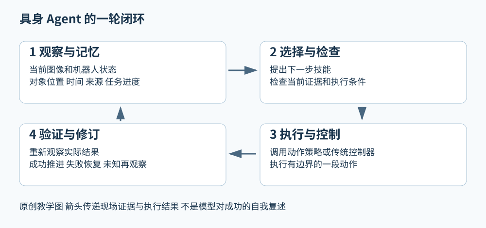

# 具身 Agents 从一句指令到可验证的行动

让机器人“把厨房的杯子拿到客厅”，看起来只是一句话，却隐藏了多个不同的问题。厨房在哪里？哪个东西是杯子？杯子现在是否还在原来的位置？机器人能否接近它？抓取命令发出以后，杯子真的在手里吗？如果门被关上，应该换路、开门，还是先向人确认？本篇用这个任务说明具身 Agent 的组成。你不需要先学会训练大模型，也能理解这个闭环。

这里的 Agent 指持续依据环境反馈选择行动的系统。它可以把语言模型放在高层，也可以采用传统规则、搜索或学习策略；“接入一个大模型”并不是充分条件。具身强调它的行动会改变物理世界，或者一个具有物理交互约束的仿真世界。因此，回答正确和行动成功是两个不同的评价对象。

## 1 先把模型和整个系统分开

视觉语言模型接收图片和文字，能够输出描述、判断或计划。视觉语言动作模型，简称 VLA，进一步输出机器人动作。它们都可以成为 Agent 的一个部件。完整系统还需要把输入送到合适部件，保留任务进度，调用执行接口，再把动作结果读回来。

设想模型给出“抓住杯子”。如果这个输出只是字符串，机械臂并不会自己知道要去哪个三维坐标。系统需要把“杯子”绑定到一个被观察到的对象，给出位置与姿态，把目标转换成机械臂能够执行的动作，并在动作以后检查结果。把语言指令绑定到当前世界中的对象或动作，通常称为 grounding，可以理解为“让词语有现场所指”。

你可以用一个简单问题辨别系统边界：当杯子滑落时，谁负责发现，谁负责记录，谁负责决定重试，谁负责安全地执行？如果论文只描述动作预测模型，就不能自动把这些系统能力都算到它头上。

## 2 用一个完整回合理解闭环

首先，系统接到目标，记下“杯子要放到客厅桌上”以及完成条件。完成条件不能只写成“调用过放置函数”，而要描述期望观察到的结果。

其次，相机拍到桌面，感知部件提出杯子候选。定位系统同时估计机器人相对房间的位置。相机看到的像素坐标和机械臂使用的空间坐标不同，需要标定与坐标变换才能接起来。高层 Agent 可以请求这些结果，但不应凭一句语言推理绕开几何计算。

第三，计划器把目标拆成走到厨房、找到杯子、抓起杯子、走到客厅、放下杯子。这里的计划是可修订的提案。若厨房门关闭，原先的行动序列就不再适用；若杯子已被人拿到客厅，则可能根本不用前往厨房。

第四，运行系统检查当前动作的条件。例如抓取前，目标位置应足够新，机械臂应处于可执行状态，规划路径应满足碰撞约束。检查通过以后，才把一段动作交给控制器。控制器以较快频率处理跟踪误差，高层不必为每个电机控制周期重新生成一段文字。

第五，动作结束后重新观察。夹爪闭合只说明夹爪执行了命令，并不证明杯子被抓住。系统可以综合视觉、夹爪开度或接触反馈来判断；具体能用什么信息，取决于硬件和论文设置。证据不足时保留“未确认”，比把计划中的成功当成现实更可靠。

最后，把实际结果更新到任务状态：成功就推进下一步，失败就更新原因并重规划。这样才从“生成一份计划”变成“反复行动直到目标达成或停止条件触发”。

图中上半部是目标、记忆与决策，下半部是执行和新的观察。反馈箭头返回的是行动后的证据，而不是模型再次复述自己的计划。图是教学结构，不声称每篇论文都实现全部模块。

## 3 记忆为什么不等于把聊天全部塞回去

当前观察回答“眼前有什么”；历史记忆帮助回答“刚才去过哪里、哪次尝试失败了、这个杯子是否已经移动”。这几类信息的有效期不同。

“厨房在走廊尽头”通常比“杯子在桌面左侧”稳定。后一条一旦发生移动就要更新。如果记忆只追加而不修订，系统可能同时保存杯子在厨房和在客厅两条说法，随后把冲突当成事实。有效记忆因此需要关联时间、对象身份、来源和置信程度。

还应区分经验与当前事实。“昨天从杯柄一侧抓比较成功”是一个可尝试的经验；“现在杯柄朝右”是需要新观察支持的现场事实。经验能够缩小选择范围，但不能替代现场检查。近年来的记忆型和技能复用型研究，值得分别检查它们怎样更新事实、怎样提炼经验，以及错误记忆怎样被纠正。[3][4]

## 4 VLA 世界模型和传统控制分别放在哪里

VLA 可以承担动作策略：给它观察、语言和机器人状态，它生成下一段动作。高层 Agent 则可能决定当前子目标、何时调用策略、何时重新观察以及何时停止。这是可行的分工，不是所有系统都必须采用的唯一结构。

世界模型负责预测：如果采取某种行动，未来可能发生什么。它可以帮助比较候选行动，也可以在训练时提供想象轨迹。预测画面看起来合理，不等于预测的接触关系或任务后果正确。判断世界模型是否有用，最终仍需看预测怎样改变行动选择，以及真实执行是否改善。

传统定位、运动规划和控制器继续承担坐标估计、避障和稳定执行等工作。它们不因为高层换成语言模型就失去意义。相反，明确的几何接口和执行反馈，常常让高层系统更容易发现自己哪里出错。

## 5 从 baseline 到当前问题

SayCan 是理解高低层分工的一个合适起点：它把语言上有助于任务的技能，与当前状态下可完成的技能结合起来选择。[1] 本篇将它作为教学选择，不把它记录成用户已选定的实验方案。

接下来可以分别问三个问题：技能执行前后的有效性怎样检查；执行记录怎样变成可复用技能；空间与经历怎样成为可检索的记忆。EmbodiedSkills、RoboSkill、HoloAgent-0 和 MEMORA 分别提供了相关的近期研究入口。[2]—[5] 它们的证据口径不同，不能把单次动作成功率、文本计划评分和完整任务成功率排进同一张排行榜。

## 6 读实验时应该追问什么

先找清楚分母。100个独立任务，和10个任务各尝试10次，都可以得到100次结果，但衡量的泛化范围不同。允许反复重置之后的最终成功率，也不同于第一次尝试成功率。只统计成功试次的平均用时，可能掩盖失败试次耗掉的时间。

再看评价者。由仿真器根据真实状态判定成功，与语言模型看图判定成功，并非同一证据强度。若模型既负责做任务又负责宣布成功，就应额外检查它是否会误报完成。真机演示能证明系统在所示场景运行过，但几段视频本身不能给出广泛任务的成功概率。

最后看代价：调用次数、总时延、失败恢复次数、人工干预、训练数据和硬件条件。这些约束决定了方法是否适合你的具体机器人，而不只是论文曲线是否更高。

## 参考文献与后续阅读

[1] Ahn 等. Do As I Can, Not As I Say. 2022. https://arxiv.org/abs/2204.01691

[2] Wang 等. EmbodiedSkills. 2026-09-01. https://arxiv.org/abs/2609.01281

[3] Xie 等. Explore, Execute, Evolve. 2026-09-29. https://arxiv.org/abs/2609.37810

[4] Yu 等. MEMORA. 2026-07-15，v2 2026-08-31. https://arxiv.org/abs/2607.14252

[5] Zhou 等. HoloAgent-0. 2026-06-22. https://arxiv.org/abs/2606.23565

[本目录首页](../README.md) · [SayCan教学讲解](../baselines/saycan.md) · [具身Agents路线图](../roadmaps/embodied-agents.md)
