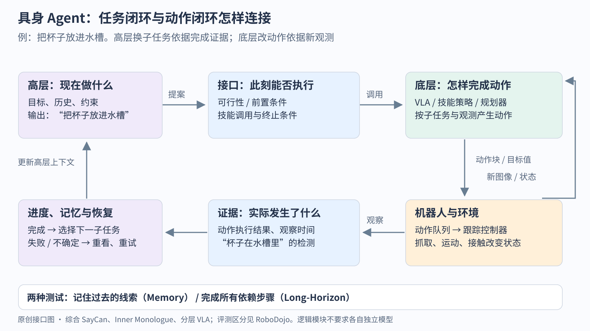

# 具身 Agent

> 状态：领域入门页 · v2（2026-10-04 追加第 6 阶段） · 依据 [synthesis.csv](synthesis.csv)（14 行）
>
> 速览：
> 1. 具身 Agent 把长程任务拆成两层：大模型在高层理解指令、拆子任务、选技能；底层技能（RL 策略、VLA（视觉语言动作模型，一句话：从图像和指令直接输出机器人动作的模型）、运动规划器或一段程序）把每个子任务做出来。本方向的难点几乎都在两层之间：技能库覆盖不到、执行后没验证、长程错误累积、记忆过期。
> 2. 主线五步：长程任务基准（ALFRED）→ 语言打分乘可行性打分（SayCan）→ 闭环反馈与重规划（Inner Monologue、LLM-Planner）→ 用代码和价值图绕过固定技能库（Code as Policies、Voyager、VoxPoser）→ 训练出来的分层 VLA（Hi Robot、π0.5）→ 2026 年的 Agent 运行时、技能积累与记忆（EmbodiedSkills、RoboSkill、MEMORA、HoloAgent-0）。
> 3. 每一步的失败都有数字：SayCan 规划成功 84%、执行成功 74%，长程指令执行只有 47%，错误中 65% 来自语言模型；同一批扰动下开环 SayCan 30.8%，加闭环反馈 60.4%；EmbodiedBench 中最强模型从基础子集 96% 降到长程子集 58%；EmbodiedSkills 去掉中间验证，成功率从 86.2% 跌到 48.2%；依赖记忆的任务只有 12.5%。
> 4. `[判断]` 分工在移动：技能库从人写的固定集合，变成代码生成、执行后积累；验证从可选的反馈变成运行时的必经步骤；高层从冻结的通用大模型，变成与底层同一家族、在机器人数据上训练的 VLM。
> 5. `[判断]` Google 机器人团队与后来的 Physical Intelligence 一线（Ichter 等）从"冻结 LLM + 技能库"走到"分层 VLA"；Wenlong Huang 一线（Inner Monologue、Code as Policies、VoxPoser）押注让大模型生成可执行的结构；2026 年的中国团队押注 Agent 运行时、技能积累与记忆这些"中间层"。Google DeepMind 在 Gemini Robotics 1.5 与 2 中两次采用"具身推理模型编排、VLA 当工具"的结构，2026 年 7 月的安全评测又把"这个子任务该不该交给 VLA"交给编排器判断（第 6 阶段）。

本页是[机器人与具身](../../README.md)领域的具身 Agent 方向。机制与手算（目标写成可验证的物理状态、像素到三维点、SayCan 的选择、执行后的证据、调度器与验证器样本怎样训练）在[具身 Agent 讲义](../embodied-agents.md)，本页不重复，只讲领域地图。不限于机器人的 Agent 方法（ReAct、工具调用、轨迹验证）在[跨方向 Agent 页](../../../cross-domain/fields/agents/README.md)；单个技能怎样从图像和语言出动作在 [VLA](../vla/README.md)；按指令走到某处在[导航与规划](../navigation-planning/README.md)。

## 这个领域在解决什么

对一台移动机械臂说"我把可乐打翻了，帮我收拾一下"。它要想到需要海绵、垃圾桶和一罐新可乐（常识与规划），判断此刻离桌子太远、先得走过去（可行性），一步步执行"走到桌边、拿起罐子、扔掉、拿海绵"（技能），每做完一步看一眼有没有成功（验证），失败了换个办法（恢复），下次再遇到时记得海绵在哪（记忆）。

### 高层与底层的分工

结论：大模型擅长"做什么"，不擅长"怎么动"；技能擅长"怎么动"，不知道"为什么要做"。具身 Agent 的设计就是决定两者之间传什么、谁来检查。

| 层 | 典型实现 | 输入 → 输出 | 本库中的证据 |
|---|---|---|---|
| 高层规划 | 冻结的 LLM/VLM 打分或生成（SayCan、Inner Monologue、LLM-Planner）；在机器人数据上训练的 VLM（Hi Robot、π0.5） | 指令、历史、场景描述 → 下一个子任务或技能调用 | EmbodiedBench：最强的通用多模态模型在高层任务上 64%–68%，在低层机械臂操作上只有 28.9% |
| 中间层 | 可行性打分（价值函数）、成功检测、运行时检查与验证、记忆检索 | 技能提案 + 当前证据 → 允许执行 / 阻塞 / 重规划 | EmbodiedSkills 去掉中间验证 86.2% → 48.2%；Inner Monologue 加成功检测与场景描述后 30.8% → 60.4% |
| 底层技能 | RL 策略与价值函数（SayCan）、程序加运动规划器（Code as Policies、VoxPoser）、VLA（π0、π0.5） | 子任务 + 观测 → 动作 | SayCan 写明系统的首要瓶颈是底层技能的范围与能力 |

接口有三种写法，对应主线的三个阶段：**打分选择**（高层从固定技能库中挑，SayCan）、**生成代码或结构**（高层写出调用感知与控制 API 的程序，Code as Policies、VoxPoser）、**语言子任务**（高层输出"拿起砧板"这样的短指令，由训练过的 VLA 执行，Hi Robot、π0.5）。

图：原创接口图。上层根据“杯子已经放入水槽”的证据决定是否换子任务；下层根据新图像和本体状态修正正在执行的动作。把已执行动作、观察时间与成功证据一起返回，才有条件区分“规划选错了”“动作没做成”和“验证看错了”。图示综合本页的 SayCan、Inner Monologue 与分层 VLA 接口，不代表任何一篇论文的完整架构。

## 主线历史

结论：每一步都在补上一步的一个缺口：开环 → 闭环；固定技能库 → 可生成、可积累的技能；冻结的通用大模型 → 训练过的高层；无记忆、无验证 → 运行时检查与记忆。

### 0 起点：端到端模型做不了长程任务（2019）

[ALFRED](../../papers/arxiv-1912.01734/README.md)（UW、CMU、AI2、NVIDIA）给出 7 类家务任务、8,055 条专家示范，平均每个任务 50 步，指令描述不完整、部分动作不可逆。端到端的 Seq2Seq 基线在未见环境的测试集上任务成功率 0.4%，人类 91%。

`[判断]` 站在现在看过去：0.4% 说明的不是模型太小，而是长程、部分可观测、动作不可逆这三件事放在一起时，一个从像素直接出动作的策略无从分配信用。三年后 LLM-Planner 仍在 ALFRED 上用分层结构：GPT-3 出子目标，原有的低层模型执行。

### 1 SayCan：语言模型说"有用"，价值函数说"做得到"（2022）

[SayCan](../../papers/saycan/reading.md)（Robotics at Google、Everyday Robots）给 551 个技能各算两个分数：语言模型认为这个技能对指令有多有用，技能的价值函数认为它在当前状态下能否成功，两者相乘选下一步（讲义第五节有手算）。在模拟厨房的 101 条指令上，PaLM-SayCan 规划成功 84%、执行成功 74%；真实厨房 81% 与 60%（Table 2）。

做不好的场景：

- **长程任务**。15 条长程指令规划成功 73%，执行成功只有 47%；涉及"机器人自身状态"的指令执行 55%。
- **语言模型出错**。错误中 65% 来自语言模型，35% 来自可行性估计，常见的是提前结束和处理不了否定句（第 5.1 节）。
- **技能覆盖**。作者写明系统的首要瓶颈是底层技能的范围与能力；技能报告了高价值却执行失败时，系统反应不过来（第 8 节）。

`[判断]` 站在现在看过去：SayCan 留下四个问题，后续工作逐个接手（[SayCan 精读](../../papers/saycan/reading.md)第 7 节）：技能库没覆盖的任务怎么办（Code as Policies、VoxPoser、RoboSkill），执行后怎样验证（Inner Monologue、EmbodiedSkills），失败经历怎样复用（Voyager、RoboSkill），环境变了旧事实何时失效（MEMORA、HoloAgent-0）。"规划对、执行错"的 10 个百分点差距，在 2026 年的论文里仍以别的形式出现。

### 2 闭环：把执行结果读回来（2022）

- [Inner Monologue](../../papers/arxiv-2207.05608/README.md)（Robotics at Google）指出开环规划默认每一步都成功。它把三类反馈写成文字放回 LLM 的提示：技能是否成功、场景里有什么、向人提问。真实厨房里加入人为扰动后，SayCan 式开环成功率 30.8%，加入物体与成功反馈后 60.4%（Table 3）。
- [ReAct](../../../cross-domain/papers/react/reading.md)（2022）在纯文本环境里给出同样的"推理—行动—观察"循环，是跨领域 Agent 的最小基线。
- [LLM-Planner](../../papers/arxiv-2212.04088/README.md)（Ohio State）在 ALFRED 上只用 100 条示例做少样本规划，失败或超时时把检测到的物体列表放回提示重新规划；成功率 16.42%，用全部 21,023 条数据训练的 HLSM 为 20.27%，HLSM 只用 100 条时为 0.61%（Table 1）。

做不好的场景：Inner Monologue 的成功检测器误报时，LLM 以为做成了，等于制造了对抗性的部分可观测；LLM 偶尔无视反馈，提出场景里不存在的物体；厨房里物体检测器 MDETR 的准确率只有 68.2%。LLM-Planner 的"加热后放置"类任务，高层规划准确率 36%，任务成功率只有 1.8%，原因是物体检测失败。

`[判断]` 站在现在看过去：闭环把"有没有做成"交给了另一个模型（成功检测器、检测器、VQA），它自己的错误会以"事实"的身份进入提示。2026 年 EmbodiedSkills 把观测加上来源与新鲜度、让依赖变化的旧结果失效，正是在处理这个问题。

### 3 用代码和价值图绕过固定技能库（2022–2023）

- [Code as Policies](../../papers/arxiv-2209.07753/README.md)（Robotics at Google）让 LLM 直接写 Python 策略代码，调用感知 API 与控制原语，遇到未定义的函数就递归生成。作者写明它受限于两点：感知 API 能描述什么，有哪些控制原语可用；更长、更复杂的指令也难以处理。
- [Voyager](../../../llm/papers/arxiv-2305.16291/README.md)（NVIDIA、Caltech 等，Minecraft）把成功执行的代码存进技能库，按文字嵌入检索复用，配合自动课程和自我验证。去掉自我验证，发现的物品数下降 73%；局限是课程会提出做不到的任务、生成无效的函数调用，且没有视觉感知。
- [VoxPoser](../../papers/arxiv-2307.05973/README.md)（Stanford）不再依赖预定义的运动原语：LLM 写代码调用 VLM，在三维体素上组合出"往哪去、避开哪"的价值图，交给运动规划器零样本合成轨迹。5 个真实任务平均成功率 88%，"LLM + 运动原语"基线 24%（Table 1）。

做不好的场景：VoxPoser 把失败分成感知错误、规格错误（推断的可供性或约束错了）、动力学错误三类，它主要降低了规格错误，接触丰富的任务仍需要动力学模型（第 4.4、5 节）。Code as Policies 无法事先判断一条指令是否可行。

`[判断]` 站在现在看过去：代码把技能库从"有限的名字列表"扩展成"可组合的程序"，代价是正确性转移到了感知 API 与控制原语上。Voyager 的"保存执行过的代码"在 2026 年的 RoboSkill 里回到真实机械臂上，并加上了触觉。

### 4 训练出来的分层 VLA（2023–2025）

[RT-2](../../papers/arxiv-2307.15818/README.md) 把动作当成词元、让一个 VLM 直接输出动作（见 [VLA 方向](../vla/README.md)），一部分"技能库"被吸收进模型本身。长程任务又把分层带了回来，只是两层都在机器人数据上训练：

- [π0.5](../../papers/arxiv-2504.16054/README.md)（Physical Intelligence，2025）在同一个模型里先预测语义子任务（如"拿起砧板"），再生成低层动作块。
- [Hi Robot](../../papers/arxiv-2502.19417/README.md)（Physical Intelligence、Stanford、UC Berkeley，2025）用一个 VLM 处理"做个不要番茄的素三明治"这样的开放指令和中途纠正，约 1 Hz 输出原子语言指令，交给 π0 执行；高层用大模型合成的人机对话数据训练。在三个平台上指令准确率比用 GPT-4o 做高层高约 40%。
- [EmbodiedBench](../../papers/arxiv-2502.09560/README.md)（UIUC、Northwestern 等，2025）系统地测了通用多模态大模型当具身 Agent 的能力：Claude-3.5-Sonnet 在高层任务 EB-ALFRED 64%、EB-Habitat 68%，GPT-4o 在低层机械臂操作只有 28.9%；去掉视觉输入，GPT-4o 的低层导航从 57.7% 跌到 17.4%，高层任务几乎不变。

做不好的场景：

- **长程**。EmbodiedBench 上 Claude-3.5-Sonnet 在 EB-Habitat 的基础子集 96%、长程子集 58%；GPT-4o 在 EB-ALFRED 的错误中规划错误占 55%（漏步骤、无效动作、提前结束），在机械臂操作中感知错误占 33%。
- **记忆与约束**。Hi Robot 没有记忆，需要长上下文推理的指令做不好；物体挨得近时，底层策略有时无视高层给的约束；物体掉落等分布外情形里错误会累积。

`[判断]` 站在现在看过去：EmbodiedBench 的结果说明通用大模型在"做什么"上已经够用，在"怎么动"上远远不够，这正好为分层提供了实证依据。Hi Robot 用 GPT-4o 做高层时明显更差，说明高层也要在机器人数据上训练，"冻结的通用 LLM + 技能库"在这里被替换了。

### 5 Agent 运行时、技能积累与记忆（2026）

2026 年的四篇工作不再争论高层用哪个模型，而是补两层之间的中间层：

- [EmbodiedSkills](../../papers/embodiedskills/reading.md)（浙江大学等）把每次技能调用当成"提案"：运行时先查前提和依赖是否仍成立，执行有限长的动作片段，再验证结果。在 RoboTwin 2.0 的 50 个任务上完整循环 86.2%，去掉中间验证 48.2%，去掉子任务条件 34.4%（表 5，同样的动作预算）。
- [RoboSkill](../../papers/roboskill/reading.md)（复旦大学等）把执行过的代码、视觉与触觉反馈整理成技能，供下次选择和适配。LIBERO-10 上一种 Agent 的首回合成功率从 72.5% 升到 97.5%。
- [MEMORA](../../papers/memora/reading.md)（华盛顿大学圣路易斯分校）把第一人称视频整理成环境、实体、活动、推断知识四种记忆，在线编辑、离线整理。规划指标最多相对提升 16.6%。
- [HoloAgent-0](../../papers/holoagent-0/reading.md)（地平线等）把 ROS2 上的 Agent 运行时、带楼层—房间—视角—物体层级的三维场景图记忆与导航、操作、全身运动技能接在一起；HM3D 物体导航成功率 82.6%。

做不好的场景：

- **依赖记忆的任务**。EmbodiedSkills 在 RMBench 的四个依赖记忆的任务上平均只有 12.5%；它的 RoboTwin 结果是每个任务各微调一个 π0.5 专家策略，不是一个通用策略在新任务上的成绩。
- **格式对、语义错**。EmbodiedSkills 写明：错误的定位或子目标可以通过所有格式检查，仍把执行带向错误的物理状态；长回合中小的规划与执行错误会累积，增加观测、重试与模型调用的次数。
- **技能积累不单调**。RoboSkill 的跨任务技能迁移对不同 Agent 效果不一，有的 Agent 首回合成功率从 60% 降到 56%；技能的多次更新带来的收益也不单调。
- **记忆把错误压实**。MEMORA 主表的 74.5% 来自一个条件子集，同一骨干的全量准确率 46.1%，比最强的非 MEMORA 条件低 0.5 个百分点（附录 B.5）；作者写明感知与编辑质量决定记忆质量，漏看的物体只能靠后来的证据补回。
- **长程只有定性结果**。HoloAgent-0 的长程任务、MEMORA 与 RoboSkill 的部分真机实验都是演示或少量试验。

`[判断]` 站在现在看过去：这四篇各自修 SayCan 留下的一个问题，但都没有给出真实机器人上长程任务的定量 benchmark。2022 年 SayCan 用 101 条指令同时报告规划与执行成功率，这种"两层分开计分"的口径在 2026 年的论文里反而少见了。

### 6 公司系统里的编排器：调用 VLA、判断可行性、负责安全（2025 年底–2026）

上一阶段的学术工作补的是中间层；同一时期，有自家 VLA 的公司把"高层调用底层"做成了产品结构：

- **ER 模型当编排器**：Google DeepMind 的 [Gemini Robotics 1.5](../../papers/arxiv-2510.03342/README.md)（2025 年 10 月）让具身推理模型 ER 1.5 负责任务分解、成功判定与调用工具，把 VLA 当作工具调用；长时程实验中用 ER 1.5 编排的总失败率 22%，换成通用的 Gemini 2.5 Flash 编排为 44.5%。[Gemini Robotics 2](../../papers/gemini-robotics-2/README.md)（2026-07-30）的 ER 2 增加了任务起止与关键事件的时间定位、多机器人协作；博客称 ER 2 可在 Google AI Studio 上使用，VLA 与机载版只对早期合作伙伴开放。
- **编排器负责安全与可行性**：同期的 [Gemini Robotics 2 安全评测](../../papers/gemini-robotics-2-safety/README.md)把系统写成"system 2 / system 1"：ER 2 当 Agent，以工具调用调 VLA，另有一个安全工具让机器人回到安全姿态。它发布的 ASIMOV-Agentic 基准测四件事：按安全约束拒绝任务、监测人员接近与硬件状态并触发停机、判断子任务是否超出 VLA 的训练分布、指令含糊时向人求助。告诉 ER 2 的 VLA 训练指令摘要越详细，它判断"VLA 做不做得到"的准确率从 62.0% 升到 95.8%；Apollo 2 人形的实验室测试中，人员检测 99%、转入安全姿态 96%。
- **记忆进入策略本身**：Physical Intelligence 的 [MEM](../../papers/arxiv-2603.03596/README.md)（2026-03）让高层策略在执行中不断改写一段文字摘要作为长时记忆，配合视频短时记忆完成约 15 分钟的任务；这是第 5 阶段 MEMORA 一类外部记忆的另一种做法：记忆由同一个 VLA 家族写、自己读。
- **人形公司的三层结构**：Figure 的 [Helix 02](../../papers/figure-helix-02/README.md)（2026-01）把 System 2 写成负责场景理解与语言、给出潜在目标的一层，下面是 200 Hz 的视觉运动策略和 1 kHz 的全身控制器。

做不好的场景：

- **漏报与误报不可兼得**。安全评测中，人员接近监测的误报率压到 5% 以下的模型漏报率超过 40%，漏报压到 10%–15% 的模型有 15%–25% 的时间无谓停机，没有模型同时做到两者都接近零；报告建议与确定性的低层安全护栏一起用。
- **约束懂了，落到动作上就差**。纯文本形式的安全约束判断各模型都在 96.0% 以上，落到指点、框选、工具调用时模型之间差距变大。
- **长程重规划**。多轮变体中，Agent 会按要求先查 VLA 置信度，但常在收到反馈后重规划失败，或在长任务里调用了低置信度的 VLA。
- **评测范围**。报告写明不评估认证硬件、冗余与实时保证；多轮评测里的 VLA 是用 Gemini 模拟的置信度评分器，不是真机。

`[判断]` 站在现在看过去：公司系统回到了 SayCan 的结构，只是三件事都换了实现。SayCan 用价值函数估计"这个技能现在能不能成功"，ER 2 改为读 VLA 训练指令的摘要来判断可行性（62.0% → 95.8%），这是同一个"可行性打分"问题的工具调用形式；Inner Monologue 的闭环反馈变成了编排器对任务进度和关键事件的时间定位；而 SayCan 没有的"安全"成了编排器的必备职责。依据是 Gemini Robotics 1.5 报告、Gemini Robotics 2 博客与安全评测报告；反例是 π0.5 与 MEM 把高层和底层放进同一个模型，不经过工具调用。

## 技术地基

- **大语言模型与上下文学习**：SayCan、Inner Monologue、LLM-Planner 都靠少样本提示让冻结的 LLM 输出计划。见 [GPT-3 精读](../../../llm/papers/gpt3/reading.md)。
- **价值函数即成功概率**：成功奖励为 1、不折扣时，价值等于成功概率，这是 SayCan 可行性分数的来源。见 [SayCan 精读](../../papers/saycan/reading.md)第 4 节与[强化学习讲义](../../../foundations/lessons/05b-reinforcement-learning.md)。
- **Agent 闭环**：推理、行动、观察交替，见 [ReAct 精读](../../../cross-domain/papers/react/reading.md)与[跨方向 Agent 页](../../../cross-domain/fields/agents/README.md)。
- **VLA 与动作块**：分层系统的底层越来越多是 VLA，见 [VLA 方向](../vla/README.md)与[讲义](../vla.md)。
- **三维场景表示与定位**：空间记忆依赖语义地图与位姿，见[定位与建图](../localization-mapping/README.md)与[感知](../perception/README.md)。

## 主要路线与团队偏好

| 团队 | `[判断]` 押注 | 代表 | 代价与做不好的地方 |
|---|---|---|---|
| Robotics at Google → Physical Intelligence（Ichter、Hausman、Levine 等） | 先用冻结 LLM + 学到的技能与价值函数，再把技能和高层都收进训练出来的 VLA 家族 | SayCan、Inner Monologue、Code as Policies、LM-Nav、RT-2、π0.5、Hi Robot | 依赖大量自家机器人数据；Hi Robot 没有记忆 |
| Wenlong Huang 等（Google 时期到 Stanford） | 让大模型生成可执行的结构：反馈文本、代码、三维价值图 | Inner Monologue、Code as Policies、VoxPoser | 正确性转移到感知 API 和原语上；接触丰富任务仍需动力学模型 |
| NVIDIA 等（Voyager） | 代码技能库 + 自动课程 + 自我验证，在开放世界里终身学习 | Voyager | 只在 Minecraft，没有视觉感知；GPT-4 调用成本高 |
| 学术评测团队（Ohio State、UIUC 等） | 少样本规划与系统化评测 | LLM-Planner、EmbodiedBench | 只在仿真；评测高层与低层分开，真实部署的耦合没测到 |
| 浙江大学、复旦大学、地平线、WashU 等（2026） | Agent 运行时、技能积累、空间与经验记忆 | EmbodiedSkills、RoboSkill、HoloAgent-0、MEMORA | 底层多为逐任务适配；长程与真机结果多为定性 |
| Google DeepMind（2026 年补充） | 具身推理模型（ER）作编排器、VLA 作工具，编排器同时负责成功判定、安全与可行性；ER 模型对开发者开放 | Gemini Robotics 1.5、Gemini Robotics 2 与其安全评测 | 漏报与误报不可兼得；多轮重规划失败；VLA 与 ER 都不开放权重 |

`[判断]` 收敛的部分：都承认分层，都在两层之间加验证或反馈，都把技能写成带类型或带代码的接口。分化的部分：高层是冻结的通用模型（SayCan、Code as Policies、EmbodiedBench 测的对象）还是训练过的 VLM（Hi Robot、π0.5）；技能是人写的固定集合、生成的代码，还是可替换的 VLA 专家。

## 用什么衡量进展

结论：本方向的 benchmark 从"高层计划对不对"一步步转向"整个闭环能否在真机上完成长程任务"，但后者至今缺少统一的定量测试。

| benchmark | 测什么 | 已知的口径问题 |
|---|---|---|
| ALFRED（2019） | 仿真家务，长程、部分可观测 | 子目标级与任务级成功率差别大；LLM 方法常借用原有低层模型 |
| SayCan 的 101 条指令（2022） | 规划成功与执行成功分开报告 | 指令按族划分，长程只有 15 条 |
| Minecraft 科技树（Voyager） | 开放世界中的技能积累 | 文本接口，无视觉 |
| EmbodiedBench（2025） | 多模态大模型当 Agent：高层 2 个环境、低层 2 个环境、6 个能力子集 | 只在仿真；结果随版本更新（本页引用 v3） |
| RoboTwin 2.0、LIBERO、RMBench（2026 年多篇使用） | 机械臂操作与依赖记忆的任务 | EmbodiedSkills 的 RoboTwin 结果是逐任务微调的专家策略 |
| MEMORA-Bench（2026） | 第一人称视频上的记忆问答与规划 | 规划分数是文本规则指标，不是机器人成功率；主 QA 数字来自条件子集 |
| ASIMOV-Agentic（2026，Google DeepMind） | 编排器的安全决策：约束遵守、人员接近与硬件状态监测、VLA 可行性判断、含糊指令求助 | 离线单步与多轮；多轮中的 VLA 由模拟器代替；不测功能安全架构 |

2026 年的 RoboDojo [1] 将 Memory（要记住过去观察）与 Long-Horizon（要维持多步进度）分开，提供了检查两类失败的不同任务；VLA-REPLICA [2] 又用重复操作的计数任务检查“做了几次”。`[判断]` 给上层更多推理文本与给下层更长动作块都可能有用，是否记住了事件、是否在正确时刻结束子任务，仍需要分别测试。这两套评测主要测操作策略，完整 Agent 的可行性拒绝与验证恢复还要另设协议。

读数时要分清三对口径：规划成功与执行成功，首回合成功与允许重试的最终成功（RoboSkill），全量与条件子集（MEMORA）。

## 当前开放问题

- **技能库覆盖不到的任务怎么办？** 入口：[Code as Policies](../../papers/arxiv-2209.07753/README.md)、[VoxPoser](../../papers/arxiv-2307.05973/README.md)、[RoboSkill](../../papers/roboskill/reading.md)、用人类视频说明新任务的 [Zero-WAM](../../papers/zero-wam/reading.md)。
- **长程任务的错误累积怎样控制？** EmbodiedBench 的长程子集、EmbodiedSkills 自述的错误累积。入口：[EmbodiedBench](../../papers/arxiv-2502.09560/README.md)、[EmbodiedSkills](../../papers/embodiedskills/reading.md)。
- **记忆什么时候该更新、什么时候该怀疑？** 入口：[MEMORA](../../papers/memora/reading.md)、[HoloAgent-0](../../papers/holoagent-0/reading.md)；语言模型一侧的外部记忆见 [Frozen Memory Is Not Enough](../../../llm/papers/arxiv-2608.17050/README.md)。
- **看不见时怎样验证？** 盒子有盖时一张外部图像无法判断海绵是否在里面（EmbodiedSkills 精读中的例子）；成功检测器的误报会被当成事实（Inner Monologue）。入口：[Inner Monologue](../../papers/arxiv-2207.05608/README.md)。
- **真实机器人上的长程定量 benchmark 在哪里？** 2026 年的四篇系统论文都只有少量真机试验或定性演示；[RoboDojo](../../papers/arxiv-2607.04434/README.md) 提供了多本体真机操作评测，下一步是把完整 Agent 的规划、执行与验证失败也按回合记录下来。
- **（2026 年补充）编排器怎样知道 VLA 做得到什么？** ER 2 靠读 VLA 训练指令的摘要判断可行性，摘要越详细越准；但多轮任务里收到置信度反馈后的重规划仍常失败。入口：[Gemini Robotics 2 安全评测](../../papers/gemini-robotics-2-safety/README.md)、[SayCan 精读](../../papers/saycan/reading.md)。
- **（2026 年补充）安全停机的漏报与误报怎样取舍？** 入口：[Gemini Robotics 2 安全评测](../../papers/gemini-robotics-2-safety/README.md)；功能安全一侧见[运动控制方向](../control-locomotion/README.md)中 Agility Digit 5 的独立安全控制器。

## 阅读顺序

1. [具身 Agent 讲义](../embodied-agents.md)：先走一遍"拿杯子"的完整闭环，知道观测、记忆、计划、技能调用、验证各自是什么。
2. [SayCan 精读](../../papers/saycan/reading.md)：本方向的基线，读完列出它留下的四个问题。
3. [Inner Monologue](../../papers/arxiv-2207.05608/README.md) 与 [ReAct 精读](../../../cross-domain/papers/react/reading.md)：闭环的两种写法，一个在真机，一个在文本环境。
4. [VoxPoser](../../papers/arxiv-2307.05973/README.md) 与 [Hi Robot](../../papers/arxiv-2502.19417/README.md)：绕过技能库与训练高层，两种对 SayCan 瓶颈的回答。
5. [EmbodiedSkills 精读](../../papers/embodiedskills/reading.md) → [RoboSkill 精读](../../papers/roboskill/reading.md) → [MEMORA 精读](../../papers/memora/reading.md)：2026 年的中间层，注意每篇实验口径的限定。
6. （2026 年补充）[Gemini Robotics 1.5](../../papers/arxiv-2510.03342/README.md) → [Gemini Robotics 2 安全评测](../../papers/gemini-robotics-2-safety/README.md)：公司系统里的编排器，对照 SayCan 看"可行性打分"变成了什么。

基线拆分见 [Baseline 页](BASELINES.md)，按问题排列的学习路线见[路线图](ROADMAP.md)，本方向收录的论文见[论文目录](PAPERS.md)。

## 批注

**易误读**

- SayCan 的 84%/74% 是模拟厨房 101 条指令上的 PaLM-SayCan；真实厨房为 81%/60%（SayCan Table 2）。"65% 来自语言模型"是对失败案例的归因比例，不是总体错误率（第 5.1 节）。
- Inner Monologue 的 30.8% 与 60.4% 是在人为加入扰动的真实厨房设置下测的（Table 3）。
- LLM-Planner 的 16.42% 需要配合 HLSM 的低层模型，100 条示例指的是高层规划的上下文示例（Table 1）。
- EmbodiedBench 的数字取自 v3（2025 年 6 月），开源模型的名单随版本更新。
- EmbodiedSkills 的 86.2% 来自 50 个任务各自微调的 π0.5 专家；去掉验证与去掉子任务条件时保持总动作预算不变，"每子任务一个片段"的 19.5% 改变了执行机会，需分开解读（表 5）。
- RoboSkill 的真机用时只统计成功试验；MEMORA 的 16.6% 是相对提升，规划指标是文本规则分数（见各自精读）。
- HoloAgent-0 的 82.6% 是 HM3D 物体导航仿真结果，长程任务只有定性演示。
- Gemini Robotics 1.5 的 22% 对 44.5% 是长时程 agent 实验的总失败率（报告 Table 1）。
- ASIMOV-Agentic 的 62.0% → 95.8% 是 ER 2 在单步可行性判断上、随"VLA 训练指令摘要"详细程度（DI0 → DI3）的变化；99% 与 96% 是 Apollo 2 实验室测试中 ER 的人员检测与 VLA 的转入安全姿态，分属两个模型。

**判断的支撑论文**（原有主线见 [synthesis.csv](synthesis.csv)，补充评测见 [VLA 综合表](../vla/synthesis.csv)）

- “记忆与多步进度分别测试”：RoboDojo v3 §3.1.1 分设 Memory / Long-Horizon，VLA-REPLICA v1 §4.3 分析重复次数的失败。边界：任务完成或计数失败本身不能定位是记忆表示、语言理解还是动作执行导致；失败归因还需要逐回合证据。

- "分工在移动"：技能库——SayCan 第 8 节 → Code as Policies 局限 → Voyager 技能库 → RoboSkill；验证——Inner Monologue Table 3 → EmbodiedSkills 表 5；高层——SayCan（冻结 PaLM）→ Hi Robot（GPT-4o 高层明显更差）→ π0.5。反例：EmbodiedBench 与 MEMORA 仍以冻结的通用大模型为高层。
- Google → PI 一线：作者列表中 Brian Ichter 出现在 SayCan、Inner Monologue、Code as Policies、LM-Nav、RT-2、π0.5、Hi Robot；Karol Hausman 出现在 SayCan、Inner Monologue、Code as Policies、RT-2、π0.5。
- Wenlong Huang 一线：Inner Monologue、Code as Policies、VoxPoser 的作者列表。
- "通用大模型高层够用、低层不够"：EmbodiedBench 的高低层对比与视觉消融。边界：EmbodiedBench 只在仿真，低层动作是离散化的 7 维向量。
- "公司系统回到 SayCan 结构"（2026 年补充）：Gemini Robotics 1.5 报告（ER 1.5 编排、VLA 当工具，Table 1）、Gemini Robotics 2 安全评测 §1 与 §2。反例：π0.5、MEM 把高层与底层放在同一个模型里；Helix 02 的 System 2 给的是潜在目标而不是工具调用。边界：Google 的结构只有官方报告与博客，没有开放权重可供检验。
- Google DeepMind 的团队偏好：ER 编排 + VLA 工具在 Gemini Robotics 1.5 与 2 两代中重复出现，满足"两篇以上"的条件。

**与其他论文的关联**

- `[结构]` SayCan 的"语言打分 × 可行性打分"与 [LM-Nav](../../papers/arxiv-2207.04429/README.md)、[VLFM](../../papers/arxiv-2312.03275/README.md) 用 VLM 给地标或前沿打分再交给导航模型执行，是同一种结构，见[导航与规划](../navigation-planning/README.md)第 5 步。
- `[结构]` Inner Monologue 与 [ReAct](../../../cross-domain/papers/react/reading.md) 都是"行动—观察—再推理"的闭环；ReAct 的观察来自文本环境，Inner Monologue 来自成功检测器与场景描述。
- Voyager 的代码技能库与 RoboSkill 的"保存实际执行过的代码"一脉相承；[SWE-agent](../../../llm/papers/arxiv-2405.15793/README.md) 在软件工程里给出了同类的"Agent—计算机接口"设计，见[跨方向 Agent 页](../../../cross-domain/fields/agents/README.md)。
- Zero-WAM 用人类视频作为任务说明，是"技能库覆盖不到时"的另一种回答，它属于[世界模型方向](../world-models/README.md)。
- MEMORA 的"离线整理可能把误认压实"与 LLM 外部记忆的问题相通，见 [Frozen Memory Is Not Enough](../../../llm/papers/arxiv-2608.17050/README.md)。

**未核实 / 待验证**

- ProgPrompt 与 2025–2026 年其他带失败分类统计的长程评测本轮未核读。
- HoloAgent-0 的长程任务没有定量结果；本页只引用其物体导航与语义建图的表格。
- EmbodiedSkills 摘要页与 HTML 版首页列出的作者人数不一致，本页只引用 HTML 版的单位信息。
- Gemini Robotics 2 安全评测报告的各模型对比图只读了正文文字，图中各模型的柱值没有估读；报告点名的对照模型（Claude Opus 4.8、GPT 5.5）只在一项任务的文字中出现。
- Gemini Robotics ER 2 没有单独的模型卡；它的"实时视频理解""Gemini Live API 编排"等说法只见于二手报道，未写入。

## 补充参考文献

[1] Chen et al. [RoboDojo，arXiv v3，2026-07-08](https://arxiv.org/html/2607.04434v3)，§3.1.1；[文献卡](../../papers/arxiv-2607.04434/README.md)。

[2] Huang et al. [VLA-REPLICA，arXiv v1，2026-05-20](https://arxiv.org/html/2605.20774v1)，§4.3；[文献卡](../../papers/arxiv-2605.20774/README.md)。
