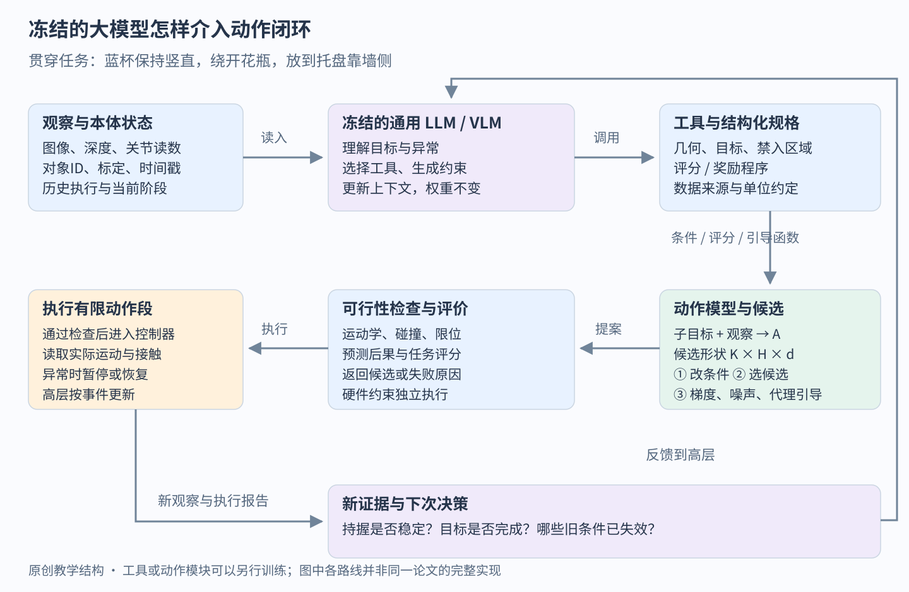
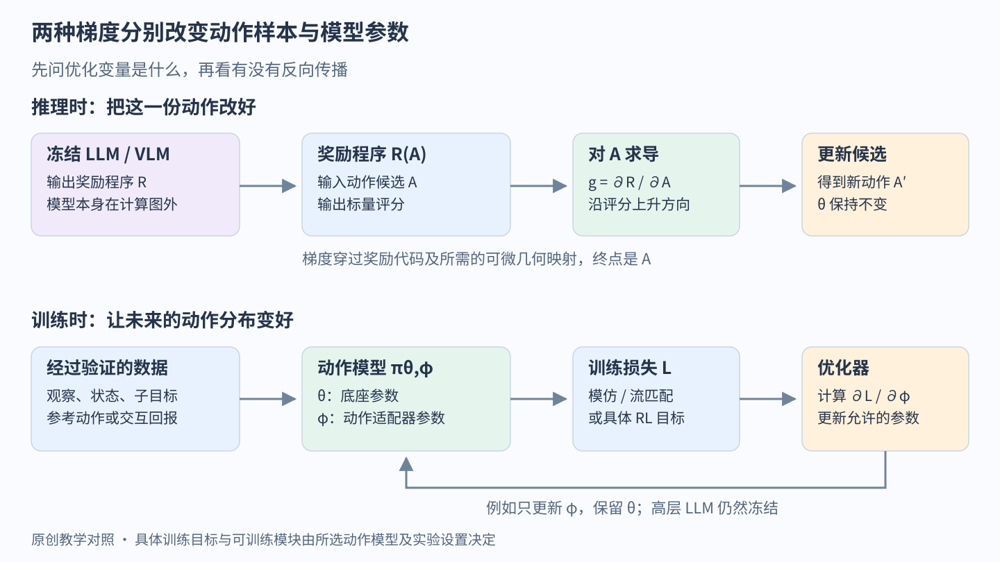
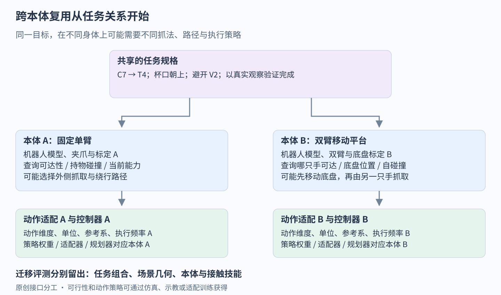

# 冻结的 LLM 怎样帮助动作模型完成新任务

> 速览：
> 1. 冻结的通用大模型可以把新要求变成子目标、几何约束、奖励程序和验证条件，动作模型提供已经学到的运动经验。
> 2. 干预既能发生在动作生成之前，也能进入候选选择和生成过程；VLS 与 FRS 分别把视觉语言反馈接到奖励梯度和生成噪声上，均包含 π0.5 实验。
> 3. 推理时改动作与训练时改参数可以串起来：先借工具找到更好的行为，再用经过验证的轨迹适配动作模型。
> 4. 跨机器人复用通常从目标和约束开始，向下仍要接本体对应的可行性模型、动作接口与控制器。

“把蓝杯开口朝上，绕开花瓶，放到托盘靠墙的一侧。”机器人学过抓杯和放杯，但未遇过这组物体与约束。一个有常识、能看图和调用工具的大模型，可以帮助它理解新要求；一个动作模型则提供如何接近、持握、搬运的运动经验。两者怎样连接，决定新增知识能否改变真实动作。

通用大模型参与的机器人 Agent 是更大的方向，包含感知、记忆、工具编程、规划与反馈；本页是其中的动作接口支线。本文保持高层 LLM 权重固定，允许工具和 VLA 动作模块另行训练或适配，沿着这一个任务走过输入、工具、动作生成与学习。整体 Agent 闭环见[具身 Agent 讲义](../embodied-agents.md)，VLA（从视觉、语言和机器人状态生成动作的模型）的内部结构见 [VLA 讲义](../vla.md)。这里集中回答中间的接口：大模型究竟修改了什么，工具返回什么，梯度又流向哪里。

## 一 先看大模型能交给动作模型什么

LLM 是以语言为主要接口的大模型；能直接读图的模型通常称为 VLM。把 Astra、Gemini 或其他通用模型放到这条链上，首先要检查具体版本的图像输入、工具调用和响应时延，再选择它承担的职责。模型名称只标识一个候选实现，系统仍需测它能否正确理解约束、选择工具并使用失败反馈。

动作模型的一次调用可以写成：

A ∼ πθ(A | o, q, g, e)

o 是当前图像等观察，q 是机器人状态，g 是当前子目标，e 是本体描述或适配后的条件，θ 是动作模型参数。A 是动作块，即未来 H 步命令组成的 H×d 数组。一次采样 K 个候选，形状就是 K×H×d。具体模型可以把其中某些条件隐含在训练数据或接口里。

教学上令 H=16、d=7，每步为三维末端位移、三维旋转增量和夹爪命令。LLM 输出的是“持杯后保持竖直，并绕过花瓶”等条件，πθ 输出连续数值。把文字条件传给动作模型最容易实现；若现有模型无法遵守新增约束，就需要能读取、评价乃至修改 A 的额外接口。

π0.5 原论文已经包含高层语义子任务与低层动作生成，训练又使用多机器人和网络视觉语言数据。[1] 外接通用 LLM 的价值应当落实到它带来的新信息和工具，例如查询物体用途、调用几何检查、生成新约束或处理执行异常。

图1　原创接口图。同一个高层可以通过子目标、评分程序或反馈改变动作；每条支路要求底层暴露不同接口。图是教学系统设计，各论文分别验证其中一部分。

## 二 把收纳任务变成能运行的工具链

### 从看到蓝杯到形成约束

当前观察 O17 包含相机图、深度、关节状态和标定版本。感知工具返回蓝杯 C7、花瓶 V2、托盘 T4 的实例标识及几何。LLM 根据指令选择 C7 和 T4，再请求定位杯口、托盘可放置区域和花瓶占据空间。SAM 3（按文字概念或视觉提示分割并追踪对象的模型）可以提供对象区域；深度、标定和几何工具继续把区域变成机器人能使用的位置。[2]

高层把任务分成“建立持握→搬运→放置”，并给搬运阶段生成一份结构化规格：目标对象=C7，目标区域=T4 的靠墙侧，杯轴方向=接近竖直，禁入区域=V2 的膨胀碰撞体，依据=O17。每个几何值引用工具结果，距离单位和坐标系由接口固定。

除了分割器，下面这些工具直接影响动作能否实现。名称是教学接口，重点是输入和返回值。

| 工具 | 接收什么 | 返回什么及其用途 |
|---|---|---|
| 场景与几何查询 | 图像、深度、对象ID、标定 | 带时间戳的位姿、关键点、占据空间与不确定性 |
| 动作生成器 | 观察、状态、子目标、本体配置 | 一个或多个动作块，供直接执行或继续优化 |
| 运动规划与可行性检查 | 动作候选、机器人模型、场景几何 | 逆解、碰撞、限位、速度约束及失败原因 |
| 结果预测与候选评价 | 当前状态、候选动作、任务规格 | 预测状态或视频、约束分数及预测可信度 |
| 执行与验证 | 通过检查的短动作段、完成条件 | 实际执行轨迹、新观察、阶段进度与失败证据 |

ReKep 把视觉语言模型生成的空间关系写成关键点约束，再由优化器产生操作；它展示了语言如何获得比一句子任务更精细的几何接口。[3] 预测工具则处理另一个缺口：轨迹几何上绕开了花瓶，杯子是否会滑动、倾倒，还涉及接触和动力学。动作条件世界模型尝试预测执行后的状态或图像，预测结果用于筛选，执行后的传感器数据用于确认。

### 沿着一个候选真正走到底

持握经新观测确认后，动作模型生成四个搬运候选。原创示例中，A1 走最短路线却与花瓶冲突，A2 绕行但杯子倾斜过大，A3 同时满足当前几何约束，A4 要求不可达的末端姿态。运行时先排除明确违规者，再根据任务分数和预测结果评价余下候选。

对 A3 只执行前四步，随后读回 O18。若杯子随夹爪运动且姿态符合要求，就继续生成；若杯子滑动，就更新持握状态，暂停旧的搬运计划并进入恢复。最后松爪后仍要确认杯子稳定落在目标区。工具返回的“命令执行完毕”与这个完成条件分开记录。

这里有两个时间尺度：控制器持续跟踪和处理硬件约束，大模型在阶段完成、异常或需要新规格时介入。候选搜索、视频预测和远程模型调用都增加等待，因此应同时记录端到端时延和动作中断情况。

## 三 六种干预位置对应六种能力

### 生成之前改变任务与环境

**改条件**最轻：把长指令拆成动作模型熟悉的子目标，补上目标对象、空间关系和当前阶段。它利用已有的条件接口；能否贯彻到动作，取决于动作模型在训练中学到了怎样的语言与控制对应。[1]

**改环境**处理的是另一类失败。StageCraft 根据成功与失败执行的场景，推断应移走哪些干扰物，通过 SAM 3 定位和机器人抓放腾出空间，再交给 VLA 执行。[4] 在蓝杯例子中，这相当于先移开遮挡物，让原策略回到更容易成功的条件下。它需要额外操作权限，也要计入移动物体的成本。

### 生成之后选择或修正候选

**候选筛选**先让策略提出多种行为，再问哪一个符合任务。SEAL 的 Do What You Say 让经过推理标注训练的 π0 产生文字计划和候选动作，通过仿真预测结果，再由 VLM 选出与计划一致者。[5] 这里语义判断发生在动作生成之后；筛选能力来自候选覆盖和结果预测。

**黑盒搜索**继续改造候选。VLA-Pilot 让 GPT-4o 结合关键点写奖励代码，对动作序列评分，保留较优者，加噪后交给原扩散模型再去噪，反复搜索并利用执行反馈。[6] “黑盒”表示搜索只需要奖励值，无需奖励对动作的导数；其动作底座实验是 DiVLA 和 RDT-1B。

### 生成过程中引导与执行中重规划

**采样引导**进入动作模型的生成循环。扩散或流匹配策略从噪声逐步形成动作，VLS 让 VLM 根据场景关键点生成分阶段的可微奖励程序，把奖励对动作的梯度加入生成更新。[7] 它在 LeRobot π0.5 上给出了有无引导的直接对照。所需接口比“给一句提示，返回动作”更深入。

**反馈重规划**决定何时放弃当前阶段或重新推理。Critic in the Loop 为 π0.5 系统训练一个小型视觉语言 critic（评价当前行为进展的模型），输出进度或干预信号，触发子任务重规划与停滞恢复。[8] 它把反馈接到高层时机上。

[判断] “LLM 干预 π0.5”至少要继续追问：改了子任务、输入场景、候选排名、采样过程，还是参数？这些位置可以组合；各自的证据和成本需要分别测量。[4]—[8]

## 四 文字怎样变成能推动动作的梯度

### 大模型写程序 数值程序计算方向

回到蓝杯搬运。可为候选 A 写一个教学奖励：

R(A) = −α‖p末(A)−p目标‖² − βΣh 倾斜(Ah)² − γΣh 碰撞软惩罚(Ah)

p末 是候选末端位置，倾斜项度量杯轴与竖直的偏离，软碰撞项随侵入程度平滑增大，α、β、γ 控制相对权重。几何量可以经运动学从动作算出，物体运动则需要持握假设或动力学模型。大模型根据任务决定应写哪些项，运行时检查代码的类型、单位、数值范围和可微性。

VLS 的 VLM 在计算图之外；真正反传的是它生成的 PyTorch 奖励函数。[7] 自动微分得到 ∂R/∂A，表示把候选朝哪个局部方向挪动会提高当前评分。为看清变量，把一次生成更新抽象成 B=Fθ(A,o,g)，再作教学修正：

A下一次 = B + η∇B R(B)

Fθ 代表动作生成器的一步，η 是修正强度。实际扩散与流匹配要按各自噪声或时间参数化接入引导。

### 向量接口要先说清它代表什么

“用向量帮助动作”有几个不同入口。检索嵌入向量用来找相似经验，检索结果随后进入上下文；目标向量是动作模型的条件；生成器的噪声或潜变量决定本次样本；动作向量则包含控制命令。潜变量指生成器内部用于表达候选行为的隐藏变量。

6 月的 FRS（Flow Reversal Steering，沿流匹配生成器反向寻找引导噪声的方法）给出了直接的连接：VLM 提出粗略移动方向，程序将其转成参考动作块，再沿冻结 π0.5 的流场反向积分取得噪声，随后正向生成动作。[9] 精确逆映射再正向会还原参考动作；论文利用有限步数值积分，经验上得到邻近的、较符合策略已有能力的动作。找到的有效噪声还能作为标签，训练一个小型噪声策略，以后直接选择有用的生成起点。

9 月的 PPS（Proxy Policy Steering，利用小型代理模型差值引导大策略）则训练两个各约3,200万参数的代理：参考代理模仿底座，任务代理从它出发用任务示范训练。每一步生成使用 v底座+γ(v任务−v参考)，γ 控制引导强度。[10] 这里 v 是生成空间的变换方向，两个代理之差提供任务适配修正。PPS 是独立的动作适配方法；把其小模型接口交给高层 LLM 编排，是有待验证的组合。

### 手算一次 变化的是候选

只看归一化终点坐标 x，设目标为0.30，当前候选为0.20，R(x)=−(x−0.30)²。此时 dR/dx=0.20，取 η=0.1，修正后 x=0.22，距离目标缩小。这一轮中 θ 保持原值，优化对象是动作样本。

动作先验是策略从数据学到的运动偏好。若梯度强到压过动作先验，候选可能获得高分却脱离策略熟悉的协调运动。若奖励漏掉杯底碰撞，它也会认真优化一个不完整目标。应把约束是否表达正确、候选是否可行和物理任务是否完成分别评价（可微软惩罚不提供硬约束安全保证）。

图2　原创梯度图。上路优化当前动作 A；下路用数据和损失更新参数 θ 或适配器 φ。奖励程序由语言模型产生，与梯度穿过语言模型是两回事。

## 五 怎样把干预变成动作模型的学习

### 先决定让哪个组件学

一次成功绕行可以留下三类数据。高层记录“何种观察下应生成什么子目标与约束”；评价器样本记录“候选或执行有何进展”；动作样本记录“当时观察与状态下，实际执行了什么”。保持高层 LLM 冻结时，前者可作为以后检索的上下文，后两类则可用于训练评价工具和动作模块。

若底座已有稳定持杯能力，只是偏好旧的放置位置，可以尝试在动作模块中训练小型适配器，或 LoRA（给部分权重加入低秩增量的参数高效微调方法）；也可以训练动作头。选择取决于任务缺口、数据量与模型开放接口。LLM 仍可负责生成阶段标签、提出训练场景、编写奖励和归纳失败，标签进入训练前要用独立证据核查。

### 用流匹配损失说明更新位置

流匹配是一种学习连续变换方向的生成方法：把随机噪声逐步变成动作块。以原创教学约定，z 为与动作块同形的高斯噪声，A* 为验证后的参考动作，τ 从0走到1，构造：

Aτ=(1−τ)z+τA*，u*=A*−z

L动作=E‖vθ,φ(Aτ,τ,o,q,g)−u*‖²

vθ,φ 预测当前位置的变换方向，θ 是底座参数，φ 是可选适配器。若只训练 φ，就计算 ∇φL 并更新 φ；若同时开放动作头，就把相应参数加入优化器。这里梯度来自动作示范损失，经动作网络传回可训练参数。π0.5 的连续动作专家使用流匹配；完整训练配方另含语义等监督。[1]

参考动作可来自遥操作、规划器，或在线干预后的真实成功轨迹。把昂贵的搜索结果教给更快的策略通常称为蒸馏，即让学生模仿老师提供的输出。[判断] 对本例，先用搜索发现绕行行为，再训练策略减少部署时的搜索量，是值得检验的连接；它需要比较训练前后，而非只看搜索当时成功了几次。

### 奖励也能用于强化学习

如果有受控交互环境，可以让 LLM 参与设计奖励，再用强化学习改善策略或残差策略。残差策略是叠加在原动作上的小修正模块。教学形式 L策略=−E[sg(优势) log πφ(动作|条件)] 把回报转成参数更新；sg 表示优势在这次更新中作为固定信号。连续生成策略还需要选择适配其概率表示的具体算法。

这样，黑盒 LLM 输出的代码、标签和建议，经由工具与数据即可影响动作学习。学习链要交代谁提供监督、谁验证结果、优化器更新哪些参数，以及如何保留原有技能。最终成功判断最好独立于生成奖励的模型，以便发现奖励投机。

## 六 换机器人时 哪些知识能留下

把七自由度机械臂换成双臂移动机器人，可以保留“C7 到 T4、杯口朝上、避开 V2”的目标关系。要重新确定的是谁抓、底盘停在哪、哪条手臂可达、持物碰撞体怎样变化，以及动作数组如何进入控制器。

因此，本体工具应至少提供机器人模型、可达与碰撞查询、控制模式、动作单位、传感器标定和适用技能。高层查询这些信息后可改变方案：单臂从外侧绕行，双臂可能选择另一侧抓取；支撑不足时先调整底盘。底层适配可以是运动学映射，也可以需要新的示教和参数训练。

图3　原创跨本体分工图。任务关系是较容易共享的接口；可行性、动作表示与低层策略需要本体条件。迁移时应检查每一条支路，而非只替换机器人名称。

作为训练过高层的对照路线，VAMOS 在移动任务中提供了一个具体例子：训练过的视觉语言规划器提出图像路径，每种本体的可行性模型给路径打分，再交给对应移动控制器执行。[11] 同一个场景中的窄道，对轮式和足式机器人可能得到不同分数。其高层用 LoRA 训练，本体可行性也从仿真执行结果学习（这里借鉴的是本体条件分工，VAMOS 不属于冻结高层 LLM 的设置）。

[判断] 未见任务至少应拆成三档：旧技能的新组合；已会动作在新几何约束下的变体；需要新接触技能或新身体能力的任务。前两档可以优先测试规划、搜索与采样引导，第三档更依赖新数据、适配或新控制器。[1][7][11] 这样才能说明“泛化”究竟跨过了哪条边界。

## 七 2026 年值得继续追的三条线

**让冻结大模型直接使用机器人接口。** 9 月的 Agent as Policy 把 RGB-D、标定、状态和执行反馈提供给冻结模型，让它在线写程序，调用末端位姿、关节目标和夹爪接口，运动学与伺服负责落地。[12] 这条路线适合追问工具和程序能把通用能力带到多远，系统中也可以没有独立的 VLA。

**让解析运动与动作模型各做擅长的部分。** 7 月首发、9 月更新的 Harness VLA 让通用编码 Agent 读观察、状态与记忆，选择固定工具：明确的末端移动由解析控制器处理，接触丰富的操作交给冻结 VLA；执行后再观察、验证和恢复。[13] 在蓝杯例子中，高层可以先重新摆位，再调用已学过的抓持动作。它研究的是调度与记忆如何发挥作用，底层 VLA 已有相应的训练经历。

**让冻结大模型组织低层学习。** 6 月首发、9 月更新的 ENPIRE 让编码 Agent 读执行视频、日志与奖励，修改行为克隆和强化学习训练程序，再按真机结果筛选改进分支。低层动作策略与评价器会被训练，前期建立的环境、安全与奖励接口在自主迭代中保持固定。[14] 这为“LLM 帮动作模型微调”提供了比生成标签更完整的研究对象。

[判断] VLS 与 FRS 把语义反馈送进采样，PPS 用小代理表达任务修正，Agent as Policy 让模型在线写程序，Harness VLA 组合原语、动作模型与记忆，ENPIRE 把建议送进训练循环。[7][9][10][12][13][14] 值得追的共同问题是：保持通用模型的知识与工具能力，怎样让其输出持续接受物理证据检验。具体成本分别落在接口覆盖、预测可靠性、调用时延与交互数据上。

## 八 怎样设计能回答问题的最小实验

以相同蓝杯任务和动作底座，依次比较：直接输入任务、LLM 分阶段、增加候选筛选、增加采样引导、用筛选后的轨迹适配策略。一次只增加一种机制，固定动作预算和测试场景，另外报告各方案所需的模型调用、候选数及总时延。

训练集保留普通摆放，测试分别改变目标位置、障碍布局、指令组合和机器人本体。训练动作适配器时，要把测试物体或任务组合留在训练之外。逐回合记录真实完成率、碰撞与停机、错误完成判断、失败恢复率和人工接管；同时保存对应观察，才能定位失败发生在哪一层。

若候选中存在成功动作，但总选错，优先改评价器；若所有候选都不会稳定持杯，继续增加语言推理的收益可能有限；若筛选成功却上线太慢，可检验蒸馏；若换本体后连可达性都判断错，先修适配与能力描述。[判断] 实验最终要回答的是：新增的大模型能力通过哪条接口，补上了动作系统的哪个缺口。

## 批注

**易误读**

- 全文蓝杯任务、接口、动作维度和手算为原创教学设计，未作为一套集成系统运行；论文各自的实现边界见相应引文。
- StageCraft 的干预模块免训练，但实验底层 VLA 已按任务数据微调；其贡献是环境干预，不能据此宣称 π0.5 动作头无需训练。[4]
- SEAL 的底座为经过推理标注训练的 π0；VLA-Pilot 在 DiVLA、RDT-1B 上实验；它们均不是 π0.5 的直接对照实验。[5][6]
- VLS 的 LIBERO-PRO（为机器人操作引入位置、语言等扰动的仿真评测）表中，LeRobot π0.5 的平均成功率从23.69%到36.81%，即增加13.12个百分点。其他模型行不能都解释为同一方法的有无引导对照。[7]
- FRS 的 VLM 引导结果来自仿真；论文真机部分主要使用人类粗引导与训练后的噪声策略。有限步反向再正向积分带来的改善是经验结果，不是严格投影或必然改进。[9]
- PPS 训练小代理并需要任务示范；两代理须与底座使用匹配的动作表示、流时间设置，其差值设计也依赖共享误差，不能视为即插即用的任意向量。[10]
- Critic in the Loop 的左右手迁移发生在同一双臂平台；它支持该设置内的迁移结论，不能外推为任意机器人零样本适配。[8]
- 候选评分、预测视频与实际完成是不同证据；几何检查也受感知、碰撞模型和执行误差影响。
- Robot Critics that Sweat the Small Stuff 可作评价工具的边界对照：它全量微调视觉语言 critic，并训练动作条件视频模型，因而不属于冻结通用 LLM 主导的实证。该实现生成五段视频约25秒、评价约1秒，说明预测筛选还有明显时延成本。[15]

**与其他论文的关联**

- [SayCan](../../papers/saycan/reading.md) 把“有用”与“做得到”组合在技能选择层；本页的候选筛选把同类分工推进到动作块层，可与[基线页](BASELINES.md)对读。
- [VoxPoser](../../papers/arxiv-2307.05973/README.md) 将语言变成三维价值图再规划，ReKep 将其变成关键点关系；VLS 则把生成的奖励接入已有动作策略的采样过程。[3][7]
- [世界模型方向](../world-models/README.md)讨论如何预测动作后果；本页关注这些预测怎样服务候选选择和反馈，预测误差仍会影响决策。

**未核实 / 待验证**

- Harness VLA 附录H包含特定版本 Astra 的结果；本页未独立复现实验，其他模型及版本的机器人能力仍需在对应接口与任务上直接评测。[13]
- ENPIRE 的方法没有报告 LLM 权重微调；按其方法边界将高层视为冻结。它会训练低层策略与评价器，不能收窄成已经验证“只训练某个 VLA 动作头”。[14]
- 各方法在相同硬件、任务、训练数据与端到端时延约束下的直接比较，以及干预轨迹蒸馏后的持续收益，需要单独实验。

**参考文献**

[1] Physical Intelligence. [π0.5: a Vision-Language-Action Model with Open-World Generalization](https://arxiv.org/html/2504.16054v1). 2025，§IV 架构与训练。

[2] Meta. [SAM 3: Segment Anything with Concepts](https://arxiv.org/abs/2511.16719v2). 2025，2026-03 修订。

[3] Huang 等. [ReKep: Spatio-Temporal Reasoning of Relational Keypoint Constraints for Robotic Manipulation](https://arxiv.org/abs/2409.01652v2). 2024。

[4] [StageCraft](https://arxiv.org/html/2603.20659v3). 2026，环境干预流程与底层策略训练设置。

[5] [Do What You Say](https://arxiv.org/html/2510.16281v2). 2025，推理与动作对齐的训练、候选验证。

[6] [Towards Deploying VLA without Fine-Tuning: Plug-and-Play Inference-Time VLA Policy Steering via Embodied Evolutionary Diffusion](https://arxiv.org/html/2511.14178v2). 2025，VLA-Pilot 的奖励代码与进化搜索。

[7] Liu 等. [VLS: Steering Pretrained Robot Policies via Vision–Language Models](https://arxiv.org/html/2602.03973v1). 2026，§III–IV 采样引导、Table I。

[8] [Critic in the Loop](https://arxiv.org/html/2603.05185v1). 2026，§4.1 与 critic 训练、迁移实验。

[9] Tang 等. [Improving Robotic Generalist Policies via Flow Reversal Steering](https://arxiv.org/html/2606.13675v2). 2026-06，§4 的流反转、语义引导与噪声策略训练，§5的评测设置。

[10] [Proxy Policy Steering](https://arxiv.org/html/2609.09148v3). 2026-09，方法与实验中的代理训练、速度残差与接口条件。

[11] [VAMOS](https://arxiv.org/html/2510.20818v1). 2025，§III 的规划器、本体可行性与执行。

[12] [Agent as Policy for Robotic Manipulation](https://arxiv.org/html/2609.12541v3). 2026-09，§3.1–3.3 的冻结模型、程序与机器人接口。

[13] [Harness VLA: Steering Frozen VLAs into Reliable Manipulation Primitives via Memory-Guided Agents](https://arxiv.org/html/2607.08448v5). 2026-07 首发，2026-09 修订，方法中的工具接口、反馈与记忆；附录H。

[14] [ENPIRE: Agentic Robot Policy Self-Improvement in the Real World](https://arxiv.org/html/2606.19980v2). 2026-06 首发，2026-09 修订，§2、§3.2 与附录B.5。

[15] [Robot Critics that Sweat the Small Stuff](https://arxiv.org/html/2606.21572v1). 2026-06，§3、§5.3 与附录C的评价器和时延。
