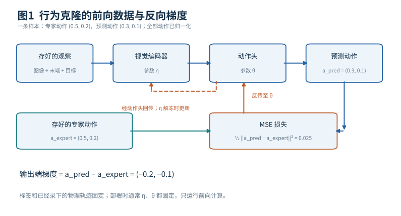
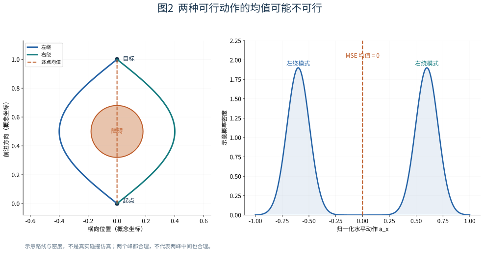
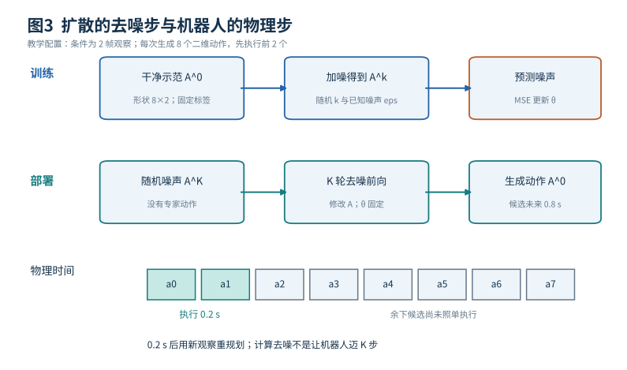
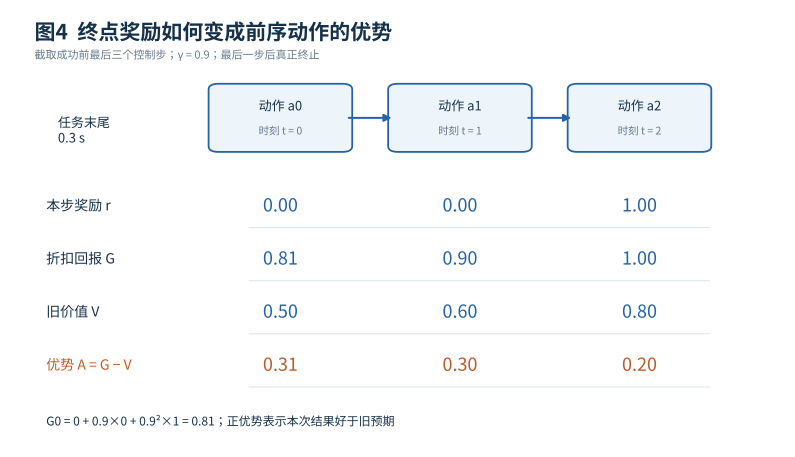
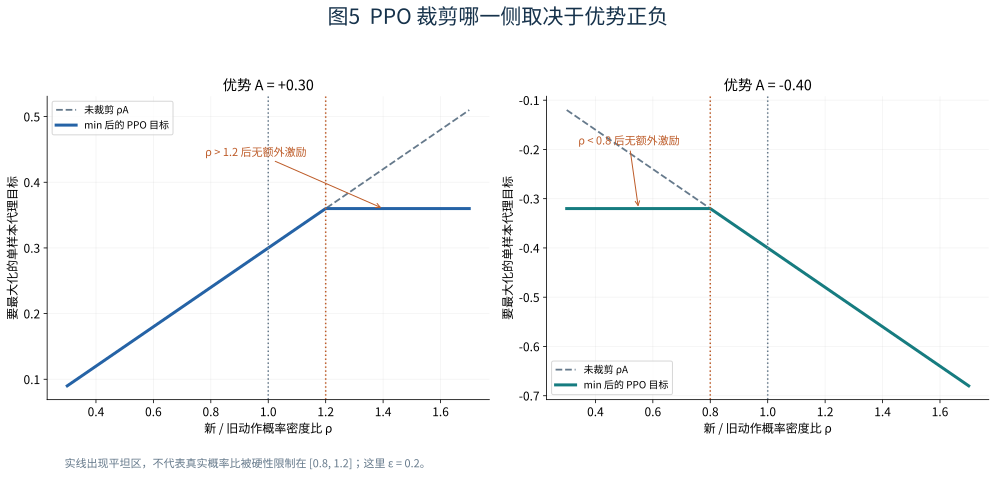
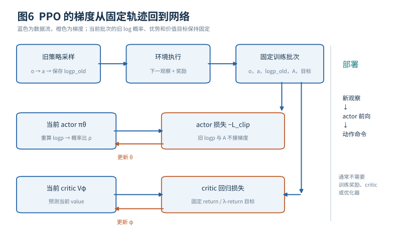

# 模仿学习与机器人强化学习入门 从一次推积木到网络参数更新

给机器人一段成功录像，它为什么不一定能照着做？告诉机器人“把积木推到目标，成功加一分”，它为什么也不一定能学会？这两种教学方式缺少的东西不同。模仿学习需要把演示转换为可执行动作，并面对自己出错后产生的新观察；强化学习需要把一串动作之后的好坏反馈，转换为网络今天应该怎样更新的梯度。

本篇从一个具体的桌面推积木任务开始。你只需要懂神经网络前向计算、均方误差、梯度下降和基本位置速度；扩散模型与强化学习的通用基础分别见 [17-diffusion](../../docs/foundations/17-diffusion.md) 和 [05b-reinforcement-learning](../../docs/foundations/05b-reinforcement-learning.md)，本篇把它们落到机器人上。我们会先完整走过示范采集、行为克隆、多峰动作与扩散策略，再从任务奖励、轨迹、return和advantage推到PPO更新。最后把奖励设计、信用分配、探索、课程、失败恢复与仿真迁移拆开，分别说明各自解决什么。所有小数、数据量和时间配置都是自建教学例子；论文方法的来源在相关段落标注。

## 1 把推积木任务写成明确接口

桌上有一个小方块，机器人用末端推杆把它推到目标中心g=(0.50,0.00) m。我们规定：方块中心距离目标小于0.02 m，连续保持0.5 s，且没有掉出桌面，算成功；单次任务最多10 s。末端不能瞬移，也不能穿过方块。接触位置、推力、摩擦和方块朝向都会影响运动。

为减少开始时的复杂度，策略只负责桌面二维运动，每0.1 s作一次决策，即10 Hz。输出a=(a_x,a_y)，两维都是[−1,1]内的无量纲数。执行层把它转换为末端平面速度v_cmd=0.20 m/s×a，再由机械臂的低层控制器跟踪。若a=(0.5,0.2)，期望速度就是(0.10,0.04) m/s；持续0.1 s，对应期望末端位移(0.010,0.004) m。

这里“期望”很重要。控制器受速度限制和接触影响，实际位移可能与期望不同，方块位移又由接触决定。强化学习环境中的转移，包含低层控制和接触动力学。模仿学习标签也必须采用与部署相同的动作定义：训练标签若是绝对位置，部署却当成速度，网络即使预测得很准也无法工作。

真实物理状态s可能包括机械臂关节、末端位置、方块位置和速度、接触状态及摩擦。部署观察o可以只包含相机图像、当前末端位置和目标位置。图像遮挡、有限分辨率和看不见的摩擦意味着o未必足以唯一确定s。本文的手算RL例子暂时假设状态可充分观测；实际视觉控制可以使用多帧、循环网络或状态估计，缓解部分可观测问题。

## 2 一段示范怎样变成监督学习数据

假设我们用遥操作收集40次成功推积木，每次10 s，以10 Hz保存数据。大约得到4000个时间对齐的观察—动作样本。每条记录至少包括时间戳、输入图像、当前末端位置、任务目标、实际发送的速度命令，以及回合编号。这个数据量只用来说明数据形状。

行为克隆BC把问题写成“看到o时预测专家动作a*”。一个简单网络先用视觉编码器f_η把图像变成特征h，再把h、末端位置和目标拼接，交给动作头g_θ：

$$
\hat a=g_\theta(f_\eta(I),p_{\rm ee},g),\qquad
L_{\rm BC}=\frac{1}{N}\sum_{i=1}^N\frac12\|\hat a_i-a_i^*\|^2.
$$

I是输入图像，p_ee是末端位置，η是视觉编码器参数，θ是动作头参数，N是小批量样本数。动作已经按0.20 m/s归一化，所以这个损失比较的是无量纲量。如果动作同时含角度、夹爪开合和位置，需要分别规定归一化与权重，以免数值范围最大的维度支配全部训练。

考虑一条样本：专家a*=(0.5,0.2)，模型â=(0.3,0.1)。损失为½[(−0.2)²+(−0.1)²]=0.025，对输出的梯度是(−0.2,−0.1)。优化器会通过链式法则调整参数，使类似输入下输出更接近专家。若动作头最后一层是â=Wh+b，则这条样本给出∂L/∂W=(â−a*)hᵀ，∂L/∂b=â−a*。实际多个样本和上游层的梯度再一起平均。

图1从左向右看前向通路：存好的观察进入编码器和动作头，得到预测动作；存好的专家动作进入损失的另一端。再沿橙色箭头反向看：MSE梯度经过动作头，是否继续进入视觉编码器，取决于该编码器是否解冻训练。专家动作是标签，保持固定；录像里已经发生的接触也在这次反向传播图之外。下方给出刚才的0.025损失和输出端梯度，供你逐项核对。

训练时可以更新η和θ，也可以冻结预训练视觉编码器，只更新θ。必须写清楚是哪一种。部署时通常两者都固定，只做前向计算得到新动作。

数据划分要按回合或场景。若随机打散相邻帧，同一次推积木中几乎相同的图像可能同时进入训练集和验证集，验证误差看起来很小，却没有检验新的初始位置、背景或推法。离线MSE之后还需要闭环执行测试：最终是否完成任务。

## 3 为什么模仿误差会越走越大

专家示范里，推杆通常已经位于合适一侧。模型第一次偏了几毫米，下一步看到的图像就与专家同一时刻不同；如果它不知道如何纠偏，又可能继续推错。数秒后遇到的姿态，甚至从未出现在示范中。这叫分布偏移：训练时输入主要来自专家造成的状态，部署时输入来自模型自己造成的状态。

更大的网络可能把已有示范拟合得更准，未见过的失败状态却仍然缺少正确动作标签；简单图像增强改善的是视觉变化，补不上“推到错误边后应该退开再接触”的动作知识。

DAgger（Dataset Aggregation，Ross等2011年提出）提供一种清楚的数据思路：用当前策略运行，收集它实际会遇到的观察；在这些观察上查询专家应该做什么；把新标签合并进数据集，再训练策略，重复进行。专家在这种流程中需要针对危险或偏离状态给出纠正动作。它的理论结论依赖专家查询和在线学习等假设，真实机器人还需安全采集安排。[1]

如果碰撞或掉落风险高，可以先在仿真、受限工作区或人工接管保护下收集纠偏数据。另一种实际改进是故意从轻微偏离的初始状态演示恢复；改善来自这些新增的状态覆盖，BC损失本身没有变。

## 4 多种动作都正确时 平均动作可能错误

假设推杆需要绕过桌上的障碍再接触方块。相同观察下，从左侧绕和从右侧绕都能成功。专家有一半选择左、一半选择右。某一步两种归一化动作分别为a_L=(−0.6,0.2)、a_R=(0.6,0.2)。如果网络对同一个输入必须输出一个确定向量，并使用平方误差，最优输出倾向条件均值(0,0.2)。

为什么会这样？只看水平分量，把预测记作z，平均损失是½(z+0.6)²+½(z−0.6)²。对z求导得2z，最小值在z=0。这个答案很适合最小化平均平方误差，却可能让推杆径直撞上障碍。问题在于单个均值没有表达“两条可行路线之间存在不可行区域”。

图2左侧先看两条实线：它们分别绕过障碍，都是可行的概念路线；虚线是两条路线逐点平均，会穿过障碍。右侧画出对应的示意双峰动作密度，两个峰位于−0.6和0.6，均值却在中间。图中的轨迹只用于解释几何机制，重点是“高概率动作有两个区域”。

可以用混合分布、离散路线加连续动作、生成式策略等方式表示多种答案。仅让普通单高斯的方差很大，会把两峰中间也覆盖进去，未必符合数据形状。即使表示出了两个峰，还要避免每0.1 s随机在左、右路线之间来回切换。因此建模一段连续动作序列往往比独立预测每一帧更有利。

## 5 扩散策略训练时 学的是去除动作里的噪声

Diffusion Policy（Chi等2023，用扩散模型生成机器人动作序列的模仿学习策略）把条件动作分布作为学习目标，利用扩散模型生成一段动作，并采用滚动执行。它用示范做模仿学习，生成的是动作序列（加噪与去噪的基础见 [17-diffusion](../../docs/foundations/17-diffusion.md)）。[2][3]

在本篇教学配置中，取过去2帧观察作为条件O，把未来8个二维动作堆成A⁰，形状为8×2。上标0表示干净示范动作序列。环境时间仍叫t；另用k表示扩散噪声等级，避免把“机器人前进一步”和“模型去噪一步”混成同一时钟（两条时间轴的区分见 [17-diffusion](../../docs/foundations/17-diffusion.md) 第 7 节）。

训练一次时，从示范取出A⁰，随机抽一个噪声等级k，再采样与动作序列同形状的高斯噪声ε。构造：

$$
A^k=\sqrt{\bar\alpha_k}\,A^0+
\sqrt{1-\bar\alpha_k}\,\varepsilon.
$$

ᾱ_k是该等级保留原信号的比例参数，由预先选定的噪声日程确定。k越接近高噪声端，原动作信息通常越少。去噪网络ε_θ(A^k,k,O)要预测我们刚加入的ε，损失为：

$$
L_{\rm diff}=\mathbb E\left[\frac12
\|\varepsilon_\theta(A^k,k,O)-\varepsilon\|^2\right].
$$

为看清数字，只取序列中的一个二维动作A⁰=(0.5,0.2)，设ᾱ_k=0.64，ε=(1,−0.5)。因为√0.64=0.8、√0.36=0.6，带噪动作就是A^k=(1.00,−0.14)。中间带噪变量可以超过原动作范围，它只是生成过程中的中间量。若网络预测噪声为(0.7,−0.4)，该二维片段的½平方损失为0.05，对噪声预测的梯度为(−0.3,0.1)。完整训练再对所有时间和动作维度求和或平均，具体归约方式要保持一致。

这一步里，干净示范、随机采样噪声和噪声日程都不需要学习；训练更新去噪网络参数，以及实现中选择解冻的观察编码器。整个训练只用示范，没有环境奖励或优势估计。训练程序知道正确噪声，是因为噪声由程序自己加进去。

## 6 扩散策略部署时 只做前向去噪

部署没有专家A⁰。先采样一段随机噪声A^K，再用同一个已训练的网络反复预测噪声、按反向扩散规则修正当前动作序列，直到得到A⁰的一个样本。标准DDPM形式的一步可写为：

$$
A^{k-1}=\frac{1}{\sqrt{\alpha_k}}
\left(A^k-\frac{\beta_k}{\sqrt{1-\bar\alpha_k}}
\varepsilon_\theta(A^k,k,O)\right)+\sigma_k z,
\quad \alpha_k=1-\beta_k.
$$

β_k和σ_k控制这一步的噪声日程，z是该步采样噪声，ᾱ_k是α₁…α_k的乘积。采样器也可采用别的更新方式或更少步数。这里反复改变的是候选动作A^k；θ保持固定。去噪网络运行多次，仍然只是推理。[2][3]

图3上半部是训练：已知示范加上已知噪声，网络预测噪声，MSE更新参数。下半部是部署：随机动作噪声经过多轮网络前向，生成8步动作。最下方的时间条把两种时间分开：8个机器人动作对应未来0.8 s；其中先执行2步，即0.2 s，再根据新观察生成下一段。本文的2帧、8步和执行2步是教学设置。

这样既可以让一段动作内部选择同一种绕行方式，又能在后续观察改变时修正计划。0.2 s重规划仍有延迟：图像获取、编码、去噪和命令排队都需要时间。若生成0.8 s动作需要0.4 s，却按0.2 s周期重规划，系统就会积压或使用过时观察。必须明确动作时间戳、队列替换方式和测量到执行延迟。

扩散改善的是动作分布表示和序列生成方式。

## 7 强化学习从哪里获得训练信号

现在假设没有专家动作标签，只有环境能判断任务结果（交互、奖励与回报的通用定义见 [05b-reinforcement-learning](../../docs/foundations/05b-reinforcement-learning.md) 第 2–3 节）。策略πθ(a|o)根据观察给出动作分布，采样动作，环境执行后返回下一观察、奖励r以及是否结束。连续控制常用高斯或变换后的高斯分布；离散动作也可以用分类分布。θ是待训练的策略参数。

一次任务生成轨迹：

$$
\tau=(o_0,a_0,r_0,o_1,a_1,r_1,\ldots,o_T).
$$

r_t在本篇指执行a_t、进入下一状态后得到的反馈。这个索引约定很重要，代码里若把上一动作的奖励错配给下一动作，梯度仍能算出来，却在学错误对应关系。

最直接的奖励是：任务首次满足成功条件，给+1并结束；其他步给0；掉出桌面记失败并结束。奖励无量纲，表达设计者的偏好。它告诉算法整段尝试的好坏，从哪边接触方块要由算法自己发现。任务难时，大多数随机轨迹可能都拿0分，训练信号就很稀疏。

为了提供中途反馈，也可以定义一个明确的教学奖励：r_t=(d_t−d_{t+1})/(0.10 m)+1×成功−0.02‖a_t‖²−0.5×碰撞，其中d_t是方块到目标的距离。例如距离从0.12 m变为0.10 m，a=(0.5,0.2)，没有成功或碰撞，则奖励为0.20−0.02×0.29=0.1942。

这个公式是人为选择。绕过障碍可能暂时增加距离；无意惩罚这种必要后退，会让任务更难。动作平方惩罚也可能鼓励不动；距离进展在折扣、终止和重复进出目标条件下可能出现设计漏洞。训练之外应保留独立的成功判定。

## 8 奖励怎样成为return 一个终点如何影响前面动作

我们先用更简单的成功奖励手算。截取一条即将结束的轨迹最后三个控制步，奖励依次为[0,0,1]。这是任务末尾的0.3 s。

从某一步开始，未来奖励的折扣和叫return，记为G_t：

$$
G_t=r_t+\gamma r_{t+1}+\gamma^2r_{t+2}+\cdots.
$$

γ是折扣因子（见 [05b-reinforcement-learning](../../docs/foundations/05b-reinforcement-learning.md) 第 3 节）。教学取γ=0.9，则G₂=1、G₁=0.9、G₀=0.81。最后一步的成功，因此也会进入前两步的训练权重。γ越小，远处奖励衰减越快；固定控制周期0.1 s时，10步是一秒，若改变控制频率而不调整γ，就改变了按真实秒计算的折扣速度。

图4先从上面的动作时间线读到最后的+1，再从右向左看return。G表示“从这里继续往后，这次最终拿到了多少折扣收益”。下方加入价值预测V和优势A，马上会逐项计算。图中的三个时刻为了便于手算重新编号为0、1、2。

算法最终希望提高的是多次尝试的期望收益，可写作J(θ)=E[Σ_t γᵗr_t]：轨迹由当前策略与环境共同产生，E表示对这些可能轨迹取平均。某一条轨迹成功只提供一个样本。

但把成功收益分给所有前序动作还不够精细。某一步可能本来就离成功很近，随便选合理动作都容易成功；另一步则可能在困难状态做了关键纠偏。为了比较“比这个状态通常能做到的更好吗”，需要价值函数。

## 9 value和advantage怎样接上神经网络

价值网络V_φ(o)预测从观察o开始、按当前策略继续行动时的预期折扣收益。φ是另一组可训练参数，通常称critic。策略网络负责选动作，常称actor（价值与优势的通用讲解见 [05b-reinforcement-learning](../../docs/foundations/05b-reinforcement-learning.md) 第 4 节）。

设采集这条轨迹时，旧价值网络对三个观察的预测是[0.50,0.60,0.80]。本次实得return是[0.81,0.90,1.00]，于是一个简单的优势估计为Â_t=G_t−V_old(o_t)，得到[0.31,0.30,0.20]。它们都为正，表示这次后续结果比该状态的旧预期更好。若某样本得到0而旧预期为0.60，它的估计优势就是−0.60。

严格说，真实优势A^π(s,a)=Q^π(s,a)−V^π(s)：Q是先选a、再按策略继续的期望收益，V是该状态通常的期望收益。G−V只是一条随机轨迹给出的估计，可能受运气、后续动作与估计误差影响。多样本、价值估计和合适优化帮助减小这种噪声。[4]

critic用监督回归更新，例如L_V=平均½(V_φ(o_t)−G_t)²。第一条样本预测0.50、目标0.81，输出端梯度为−0.31。梯度经价值网络回传到φ；G作为这轮固定目标。若actor和critic共享视觉骨干，共享参数可能同时收到两种损失的梯度；若完全分开，critic损失只更新φ。实现必须明确共享关系。

长轨迹还常用广义优势估计GAE。先计算单步时序差分残差δ_t=r_t+γV_old(o_{t+1})−V_old(o_t)，再把后续残差按γλ累加：

$$
\hat A_t^{\rm GAE}=\delta_t+\gamma\lambda\delta_{t+1}
+(\gamma\lambda)^2\delta_{t+2}+\cdots.
$$

λ控制多远地使用实测残差，以权衡估计的偏差和方差。例中成功后真正终止，终止状态价值为0，因此δ=[0.04,0.12,0.20]。λ=1时得到[0.31,0.30,0.20]，与完整return减去旧value一致；λ=0.95时得到[0.288805,0.291,0.20]。你可以用0.9×0.95=0.855逐项复算。[5]

还要区分真正终止和采样截断。成功、不可恢复失败等按任务定义真正结束时，下一状态价值取0；只是收集满一个训练批次、任务仍在继续时，通常需要用末状态价值补上未观测的未来。如果10 s本来就是任务规则的一部分，应把剩余时间纳入状态并按有限时域任务处理。

## 10 环境不可微 为什么仍能得到策略梯度

行为克隆直接比较动作与专家标签；强化学习没有那个a*。它采取另一条路线：提高“在这次观察下，产生这个好动作”的概率，降低坏动作的概率。对采样数据，一个基本的策略梯度代理目标可写成平均log πθ(a_t|o_t)×Â_t，训练时对其取负作为要最小化的actor损失。[4]

为什么log概率会出现？在环境不依赖θ的假设下，一条轨迹的概率包含初始分布、每步环境转移概率和每步策略概率。对轨迹概率取log，再对θ求导，环境项不需要对θ求导，剩下的是各步∇θ log πθ(a_t|o_t)。利用这个似然比关系，可以从实际采样轨迹估计期望收益的梯度，真实碰撞、摩擦和电机都无需可微。完整推导还涉及采样分布及折扣权重，这里展示的是常用样本代理形式。[4]

做一个一维局部数值例子。设某观察下策略给出高斯动作，均值μ=0.20、标准差σ=0.10，本次采到a=0.30，估计优势为+0.30。高斯log密度对均值的导数是(a−μ)/σ²=10，所以最大化目标对μ的导数为0.30×10=3。若暂把μ本身当作一个参数，用0.001步长作梯度上升，μ从0.200变成0.203。对同一观察，下一次更倾向接近这次好动作。

如果优势是−0.30，方向反过来。真正网络中μ由多层网络产生，梯度再经过∂μ/∂θ传给网络权重；若标准差也是可学习参数，也会接到相应梯度。采下来的a和Â在这轮更新中当作固定数据。这样，你已经看到一条从任务结果到θ的完整链：成功反馈→return→优势→动作log概率→网络梯度。

这里使用未约束高斯作局部数学说明。真正动作限制在[−1,1]时，可使用tanh变换高斯并正确计算变换后的log密度，或采用其他一致的有界分布/执行处理（若把采样值裁剪后执行，更新时要一致处理采样变量、执行动作和概率的对应关系）。

## 11 PPO到底限制了什么

用同一批“好动作”反复更新，策略可能很快远离产生这批数据的旧策略。旧数据对新策略的代表性越来越差，更新就可能不稳定。PPO的一种常用形式用旧、新策略在已采样动作上的概率比来构造裁剪代理目标。[6][7]

保存采样时的旧log概率log π_old(a|o)。当前网络重新计算log πθ(a|o)，得到：

$$
\rho_t=\exp\bigl(\log\pi_\theta(a_t|o_t)-
\log\pi_{\rm old}(a_t|o_t)\bigr).
$$

这里用ρ而不用r命名概率比，避免和奖励r混淆。连续动作使用概率密度比，密度本身可以大于1。PPO-Clip最大化：

$$
L_{\rm clip}=\operatorname{mean}_t\min\left(
\rho_t\hat A_t,
\operatorname{clip}(\rho_t,1-\epsilon,1+\epsilon)\hat A_t
\right).
$$

取ε=0.2。若某条样本Â=+0.30，旧动作密度为2.0、新密度为2.6，则ρ=1.3。两项分别是0.39和0.36，取0.36。这表示已经足够提高这条好动作的相对密度，再继续提高，不会从该样本这一项获得额外激励。

若Â=−0.40、ρ=0.7，两项是−0.28和−0.32，取−0.32。对于坏动作，已经把其相对密度降得足够多，再降也没有额外激励。若反过来提高坏动作的密度，目标仍会变差。

图5左图是正优势：曲线向右上升，在1.2之后变平；右图是负优势：在0.8左侧变平，往右仍然下降。虚线是未裁剪目标，实线是实际取min后的目标。两侧平坦区的位置不同，裁剪按优势的符号只作用在一侧。

共享参数、其他样本、价值损失和一次有限步长更新，都可能使某些比值越过裁剪区间，所以要监控新旧策略KL、clip fraction、价值误差、熵和真实评估回报。[6][7]

## 12 一轮PPO训练完整发生什么

假设同时运行32个仿真环境，各收集100步，总共3200条转移。10 Hz下每个环境这一段对应10 s物理时间；并行只改变数据采集吞吐量。以下数量是说明流程的配置。

第一步，把当前策略作为这一轮旧策略。用它采样动作，保存观察、采样动作、执行动作的必要记录、奖励、终止标记、旧log概率及旧value。采样阶段通常只收集数据，优化器更新放在之后。第二步，根据终止与截断规则计算return或GAE、价值目标，将这些量固定下来。

第三步，将3200条数据分成小批量，用当前actor重新计算旧动作的log概率，形成ρ和PPO损失；critic拟合固定价值目标；需要时加熵项鼓励一定随机性。若以最小化写，总损失可以是−L_clip+c_V L_V−c_H H(πθ)，其中H是动作分布的熵，c_V、c_H是权重。共享骨干接收合并梯度，独立网络则可分别优化。

第四步，对同一批数据进行有限轮小批量更新。旧log概率和优势在这几轮里保持固定、不接梯度，概率比和优势基准才保持原来的含义。第五步，结束这一轮，将新策略用于重新采样，再重复。保存旧log概率通常就足够计算比值。[6]

图6上半部是采样循环：策略改变环境，环境返回奖励，结果存入数据缓冲区。下半部才出现损失和梯度：固定的旧log概率与优势进入actor目标，固定价值目标进入critic目标；橙色箭头只回到需要训练的网络。环境和旧批次没有接到反向传播箭头。右侧部署栏只保留选动作所需网络，critic、旧策略副本、训练奖励和优化器通常都可以去掉。

这一点能回答“机器人部署时还要知道奖励吗”：常规策略部署可以不计算训练奖励，只根据观察输出动作。若系统明确设计了在线继续训练或自适应模块，那是额外机制，需要单独说明哪些参数更新、如何安全采集数据。

## 13 六类工作必须分开诊断

**任务与奖励回答什么算好。** 成功判定来自任务要求，奖励是可计算的训练偏好。若机器人学会轻碰目标后立即离开，却仍得高分，先查成功条件、终止与奖励计算。若负动作惩罚太大，静止可能真的是这个奖励下更好的策略。

**信用分配回答已见轨迹中哪些选择值得提高概率。** return、value、advantage和GAE把晚到反馈用于早期动作更新，它们只能利用已经出现过的经历。优势估计质量差时，应检查价值目标、终止mask、时间索引和尺度。

**探索回答怎样见到新的行为结果。** 动作采样、噪声、熵、示范初始化或合适初始状态，可以帮助策略遇到不同轨迹。熵高只表示动作分布更分散。PPO裁剪负责控制更新方式，稀疏成功的探索要靠上面这些手段。

**课程回答先练哪些难度。** 可以先把方块放在目标附近，再逐渐拉远；先无障碍，再加绕行；先较小外力，再逐步增加。它改变的是训练任务分布或权重安排，使策略更容易从已有能力过渡。课程最后要覆盖真实目标分布，前期的高成功率才有意义。RMA（Rapid Motor Adaptation，Kumar等2021年的足式机器人快速适应方法）是课程、奖励和环境随机化有明确配合的机器人实例。[8]

**恢复训练回答偏离后还会遇到什么状态与动作。** 推杆被卡住时，需要看到退开、绕行、重新接触的轨迹；四足倒地恢复需要倒地初始状态和可执行翻身动作。如果环境一失败就结束，任何失败后的恢复动作都不在数据里。增加失败惩罚可能让策略更保守、尽量避开失败，却不必然教会它从已经发生的失败中恢复。

更极端地，如果状态按环境定义已经吸收终止，之后根本没有可选动作；或机器人被物理夹死、力矩不足以移动，再大负奖励也不能改变可达性。想要恢复，必须先检查环境是否允许继续、动作是否能产生出口、探索或示范是否覆盖出口，以及恢复后的收益是否值得经历暂时的不利状态。

**仿真迁移回答学到的动作在现实里是否仍产生相似结果。** 摩擦、质量、相机、关节限幅、命令延迟和时间戳都可能改变转移或观察分布。域随机化扩展训练条件，系统辨识减小模型差异，历史适应利用近期反馈，执行保护限制命令。它们作用不同，需要组合使用。[8]

这六类工作与优化器处在不同位置。同一个PPO可以配上不同奖励、课程和机器人接口；同一个奖励也可以用不同算法学习。比较两个方法时，如果其中一个额外用了特权状态、更多示范或更宽随机化，不能把全部收益都归给算法名称。

## 14 模仿 离线强化学习 世界模型各自多了什么

纯行为克隆使用固定示范，目标是预测示范动作，只需要示范，无需奖励或对未做过动作的后果估计。扩散BC仍可属于这一类，只是输出一个更丰富的条件动作分布。

离线强化学习同样可以只用固定数据，却利用奖励与价值学习寻求更高回报。困难在于：价值网络可能对数据里极少出现的动作给出错误高值，而优化器会偏向利用这些错误。离线RL与BC都只用存盘数据，训练目标却不同；PPO则要求数据来自最近的旧策略。[9]

[世界模型](world-models.md)则先学习“给定观察历史和动作，后续状态或潜在表示及奖励会怎样变化”，再用这个模型规划或训练策略。它引入模型学习误差和多步预测偏差。扩散动作模型学习的是“在这个条件下可能采取哪些动作”，环境世界模型学习的是“做这个动作后世界怎样改变”，即使两者都用生成模型，输出对象和用途也不同。

组合路线当然存在。例如先用示范训练一个可行动的策略，再用环境奖励细调；或者用世界模型生成想象轨迹；或者让传统MPC生成示范。每加一种组件，都应重新写清楚它的数据、损失、更新参数与部署接口。

## 15 一套能真正检查理解的练习

先实现不带视觉的二维小环境，让观察直接包含推杆、方块和目标位置，确保动作缩放、时间步长和成功判定正确。用一个可解释的专家生成少量演示，训练BC，并把训练/测试按完整回合分开。先看正常起点，再故意将推杆移到示范之外的位置，记录离线误差与闭环成功是否同时改善。

接着构造左右绕行的双峰数据，分别训练确定性MSE、一个显式双峰分布或小扩散动作模型。除训练loss外，还要画同一观察下的多次动作采样、整段路线和碰撞率。检查生成一段动作后实际执行多少步、重规划是否使用新观察。

再把强化学习暂时缩成最后三个时刻，手算本篇[0,0,1]的return、value残差、GAE和正负优势PPO目标。实现单元测试，确认终止状态bootstrap为零，批次截断则保留合适value；确认旧log概率和优势不接梯度。最后才放回完整交互环境，记录真实成功率、平均回报、value误差、KL、熵和失败类型。

如果训练没有进展，先确认物理接口能完成任务，再确认奖励确实给正确事件打分，再看策略是否见过成功或恢复数据，再看优势和优化是否正常。这个顺序避免在动作单位写错时不断调学习率，也避免在完全没有成功样本时期待PPO裁剪凭空提供路线。

读完本篇，你应当能从一条完整记录回答四件事：这个动作是谁产生的、它改变了哪段物理过程、后续结果怎样变成数值训练信号、反向传播最后更新了哪些参数。能沿着这条链逐步解释，比记住BC、PPO或Diffusion Policy的简称更接近真正理解机器人学习。

## 批注

**易误读**
- “扩散”不意味着强化学习，Diffusion Policy也不预测未来相机视频（第5节，[2]）。
- 生成动作分布没有解决全部模仿问题：训练数据没有覆盖的碰撞后状态仍可能失败；采样出的一整段动作未必满足碰撞和关节约束；模型可能对新摩擦条件缺少反馈知识。扩散不保证成功、安全与任意恢复（第6节）。
- PPO不硬性保证所有ρ都留在裁剪区间，也不把网络参数投影回安全区域；代理目标改善不等于实机性能改善（第11节，[6][7]）。
- 一次仿真成功不能推出真机安全；域随机化、系统辨识、历史适应与执行保护彼此不能替代（第13节，[8]）。
- 六幅图均为原创机制图或明确标明的教学曲线，示例数字不是论文成绩；动作归一化、8步预测与2步执行、三步奖励及训练批量均为自建示例。

**与其他论文的关联**
- 第5–6节的动作扩散与滚动执行来自 [Diffusion Policy](../papers/diffusion-policy/README.md)；[VLA 讲义](vla.md) 中的 π0.5 改用流匹配生成动作块，训练目标从噪声换成向量场。
- 第11–12节的裁剪代理目标来自 [PPO](../../llm/papers/ppo/README.md)；第13节的课程与特权训练实例是 [RMA](../papers/rma/README.md)，其部署时适应见 [运动控制与足式运动](control-locomotion.md) 第9节。

## 来源与延伸阅读

[1] Ross、Gordon与Bagnell，A Reduction of Imitation Learning and Structured Prediction to No-Regret Online Learning，AISTATS 2011，DAgger原论文。https://proceedings.mlr.press/v15/ross11a.html

[2] Chi等，Diffusion Policy Visuomotor Policy Learning via Action Diffusion，RSS 2023及后续期刊版本，动作扩散与滚动执行。公式与动作执行框架以v5为版本。https://arxiv.org/pdf/2303.04137v5 ；作者项目 https://diffusion-policy.cs.columbia.edu/

[3] Ho、Jain与Abbeel，Denoising Diffusion Probabilistic Models，2020，前向加噪与噪声预测训练、反向采样。https://arxiv.org/abs/2006.11239

[4] OpenAI Spinning Up，Intro to Policy Optimization，策略梯度、奖励到达后回报与baseline的推导和代码说明。https://spinningup.openai.com/en/latest/spinningup/rl_intro3.html

[5] Schulman等，High-Dimensional Continuous Control Using Generalized Advantage Estimation，GAE原论文。https://arxiv.org/abs/1506.02438

[6] Schulman等，Proximal Policy Optimization Algorithms，2017，式7及算法1。https://arxiv.org/pdf/1707.06347v2

[7] OpenAI Spinning Up，Proximal Policy Optimization，PPO-Clip目标、伪代码与实现说明。https://spinningup.openai.com/en/latest/algorithms/ppo.html

[8] Kumar等，RMA Rapid Motor Adaptation for Legged Robots，2021，训练课程、特权训练与部署适应的具体实例。https://arxiv.org/abs/2107.04034 ；作者项目 https://ashish-kmr.github.io/rma-legged-robots/

[9] Levine等，Offline Reinforcement Learning Tutorial Review and Perspectives on Open Problems，2020，离线数据、分布外动作与价值估计问题。https://arxiv.org/abs/2005.01643

前置配套阅读：[运动控制与足式运动](control-locomotion.md)。
