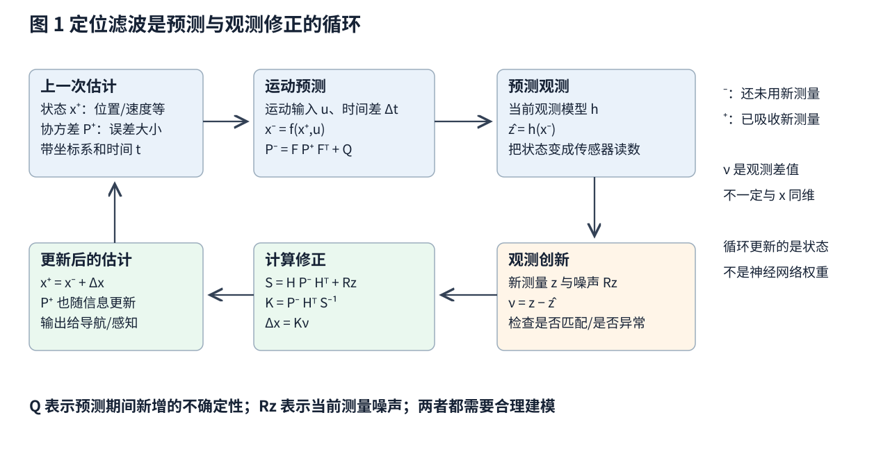
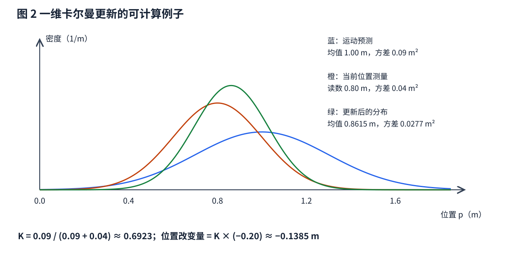
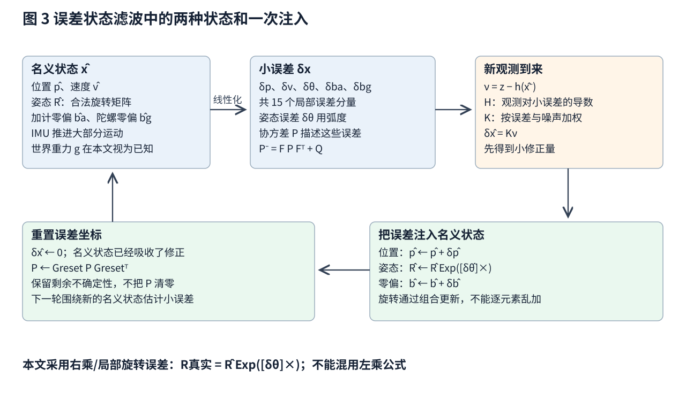
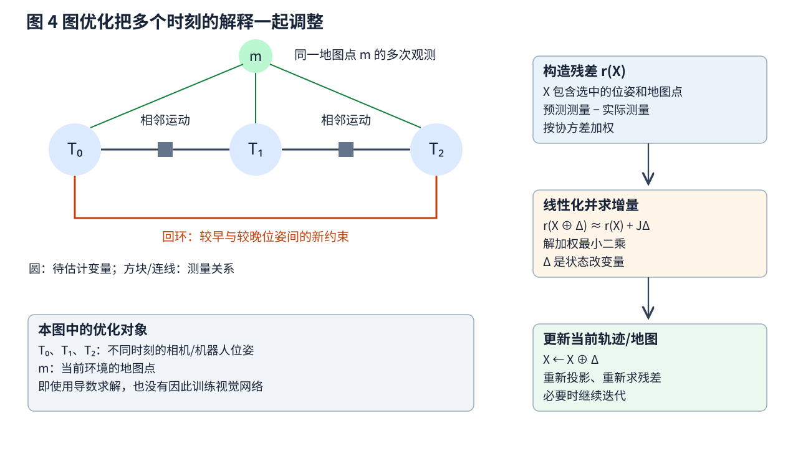

# 定位与建图 从运动预测到一致的轨迹和地图

假设一台机器人从门口出发，轮子报告向前走了 1 m，相机却发现自己离墙还有些远。它应该相信谁？如果轮子打滑、相机匹配也有噪声，答案通常不是二选一，而是把运动关系、观测关系和误差大小一起考虑。

本篇从一维位置的手算出发，逐步引入卡尔曼滤波、误差状态滤波和优化式 SLAM。只假定你知道向量、矩阵、导数以及基本位置和速度关系；不假定学过概率机器人或三维旋转群。公式采用可读文本表示，所有关键符号在首次使用附近说明。

学习目标是分清三件事：**正在估计什么状态、哪条测量约束了什么量、一次更新到底改了哪些值**。文中数字和示意图均为原创教学构造，参考论文提供方法依据，不提供这些虚构机器人的性能保证。

## 一 定位 状态估计和建图分别在问什么

**定位**问“机器人相对某个参考系在哪里、朝向哪里”。位置与朝向合起来叫位姿。例如二维地面机器人可用 (x,y,ψ) 表示：x、y 单位米，ψ 是绕竖直轴的角度，计算通常用弧度。三维位姿需要三维位置和三维朝向。

**状态估计**范围更广。为了预测下一刻运动，还可能需要速度、IMU 零偏、重力方向等。状态是算法选择的一组变量，不是所有传感器原始读数的拼接。

**建图**问“环境中的点、墙、障碍物或可通行区域在哪里”。地图不一定是一张有颜色的平面图，也可以是三维特征点、占据网格、表面片或带语义的对象。

**同时定位与建图 SLAM**要一起估计轨迹和地图。困难在于：把观测放到地图里需要位姿，而用地图确定当前位姿又需要已知地图。多时刻对同一环境的重复观测，将这两个问题联系起来。[3][4]

一个最小输入输出约定可以写成：

- 输入：带采集时刻的运动读数与环境观测，传感器内外参，运动和噪声模型
- 输出：指定坐标系、指定时刻的位姿或状态估计，以及不确定性和健康状态
- 建图输出：地图元素、它们的参考系和更新时间，以及必要的关联关系

控制指令“前进一米”不是测量；编码器根据轮子转动推得的位移也不等于真实位移。估计器要处理的正是这种差别。

## 二 在写滤波公式前 先建立两个物理关系

### 2.1 运动关系说的是状态怎样随时间变化

先让机器人只沿一条直线移动，状态为 x = [p,v]ᵀ。p 是位置，单位 m；v 是速度，单位 m/s；ᵀ 表示把一行转成列向量。若短时间 Δt 内近似匀速：

```text
p_(t+1) = p_t + v_t Δt
v_(t+1) = v_t

x_(t+1) = A x_t + w_t
A = [ 1  Δt ]
    [ 0   1 ]
```

w_t 代表没有显式建模的运动扰动，例如轻微加速。模型不是宣称机器人永远匀速，而是说在选定时间间隔内用这个近似推进状态，并用不确定性承认它不精确。

如果已知输入加速度 a，则可把 ½aΔt² 加入位置，把 aΔt 加入速度。实际选择哪种模型，要与数据、采样周期和本体相符。

### 2.2 观测关系说的是某个状态会产生什么读数

假设有设备直接测当前位置：

```text
z_t = H x_t + n_t
H = [1  0]
```

z_t 是一个标量，单位 m；n_t 是测量误差。H 从状态中挑出位置，所以状态有两个量，观测只有一个量。

如果测的是到已知地标 ℓ 的距离，关系就变成 z = ‖p − ℓ‖ + n；如果测的是图像像素，则需要相机投影公式。**不能把传感器值直接与状态向量相减**，先用观测模型把预测状态转换成同一种读数。

## 三 不确定性为什么需要协方差矩阵

设真实状态为 x，估计为 x̂，误差 e = x − x̂。误差均值接近零时，协方差写为 P = E[eeᵀ]；E 表示对可能误差的平均。它不是随意填的“可信度百分比”。

对位置和速度状态：

```text
P = [ Var(p误差)         Cov(p误差,v误差) ]
    [ Cov(v误差,p误差)   Var(v误差)       ]
```

对角线是各分量误差的方差，标准差是方差的平方根。位置标准差 0.20 m 对应方差 0.04 m²。非对角线描述关联：若速度估高常伴随位置估高，两个误差的协方差为正。

单位也必须正确：位置方差是 m²，速度方差是 m²/s²，二者交叉协方差是 m²/s。矩阵里的数不能一律理解成米。

为什么会产生关联？即使初始位置和速度误差无关，预测 p_new = p + vΔt 也把速度误差带进了位置。于是新位置与速度误差会相关。这解释了后面一个看似奇怪的现象：只测位置，也可能修正速度。

协方差是基于模型的描述，不是外部裁判颁发的证书。漏掉打滑、错误关联、时间偏移等误差源时，估计器可能给出很小的 P，却离真实位置很远。

## 四 先完整手算一次一维卡尔曼滤波

卡尔曼滤波 KF 的核心是递推处理新信息。线性、高斯并且噪声假设匹配时，可以得到相应的高斯后验；更一般的解释涉及线性最小均方估计，不能把其最优性无条件推广到所有真实传感器。[1]

### 4.1 预测先把旧状态往前推

先只估计位置。上一刻估计位置 0 m，方差 0.04 m²；编码器报告前进 1 m，设这段运动新增的误差方差 Q = 0.05 m²，并假设它与原误差独立：

```text
预测均值 p̂⁻ = 0 + 1 = 1.00 m
预测方差 P⁻ = 0.04 + 0.05 = 0.09 m²
```

上标 ⁻ 表示“还没吸收当前的新观测”；上标 ⁺ 稍后表示“已修正”。预测的不确定性增大，是因为往前推的过程又引入了误差。

### 4.2 创新是实际读数减去预测读数

现在位置传感器读到 z = 0.80 m，测量方差 Rz = 0.04 m²。这里写 Rz，避免与后面表示旋转矩阵的 R 混淆。当前观测模型是直接测位置，所以预测读数等于 p̂⁻。

```text
创新 ν = z − p̂⁻ = −0.20 m
创新方差 S = P⁻ + Rz = 0.13 m²
```

ν 读作 nu，也可叫测量残差。负号表示读数比预测位置更靠后。S 描述这个差值本来可能波动多大：预测和测量两边都有误差。

### 4.3 增益决定修正的幅度

```text
K = P⁻ / (P⁻ + Rz) = 0.09 / 0.13 ≈ 0.6923
p̂⁺ = p̂⁻ + Kν ≈ 1.00 − 0.1385 = 0.8615 m
P⁺ = (1 − K)P⁻ ≈ 0.0277 m²
```

K 是卡尔曼增益。在这个一维直接测位置的例子中它介于 0 和 1，表示把预测往测量方向拉多少。测量比预测可靠，结果更靠近 0.80 m；同时结合了两份独立信息，后验方差小于各自方差。

一般矩阵增益的元素不必全部在 0 到 1 之间，量纲也可能不同，不能把这个一维直觉机械套到任何滤波器。



图 1 说明这不是一次从输入到固定输出的分类，而是把上一轮估计带到下一轮。新一轮真正更新的是状态和协方差；我们还没有引入任何神经网络。



图 2 的曲线高度是位置的概率密度，不是“某个精确点发生的概率”。绿色曲线更窄，表示这套模型下位置范围收紧。它不代表滤波器已经消除了所有系统偏差。

### 4.4 这次修正实际上优化了什么

一维例子可以由一个加权平方目标直接推导：

```text
J(p) = (p − p̂⁻)²/P⁻ + (z − p)²/Rz
```

第一项要求不要无理由远离预测，第二项要求解释新测量。除以方差后，两项都无量纲，可靠的一方惩罚偏离更重。对 p 求导并令导数为零，就得到前面的加权融合结果。

这里**变量是当前的位置 p，J 是统计估计目标**。它不是一个用大量图像训练识别器的损失，没有更新神经网络权重。滤波公式把这个特殊优化问题解析地做完，不需要每次调用梯度下降。

## 五 把一维思想推广到多个状态量

线性状态和观测模型下，一轮预测与修正可以写为：

```text
预测：
x̂⁻ = A x̂⁺_旧 + B u
P⁻ = A P⁺_旧 Aᵀ + Q

观测修正：
ν = z − H x̂⁻
S = H P⁻ Hᵀ + Rz
K = P⁻ Hᵀ S⁻¹
x̂⁺ = x̂⁻ + Kν
```

u 是已知运动输入，B 把输入的物理影响变成状态增量；Q 是该预测间隔内的过程噪声协方差。H 把状态映射到观测，Rz 是观测噪声协方差。S⁻¹ 是矩阵逆的数学记法，实际程序通常求解线性方程，未必显式构造逆矩阵。

为了在有限精度计算中更好地保持协方差性质，可使用 Joseph 形式：

```text
P⁺ = (I − KH)P⁻(I − KH)ᵀ + K Rz Kᵀ
```

I 是与状态维度一致的单位矩阵。这一式保留了修正后来自预测误差和测量噪声的两部分影响；在理想精确运算和相应增益下，与简化式等价。

**只测位置为何能更新速度？** 取 Δt = 1 s，旧状态为位置 0 m、速度 1 m/s，旧协方差为 diag(0.04,0.01)，其中 diag 表示只在对角线上填这两个数。为教学方便，直接设离散过程噪声 Q = diag(0.01,0.01)，各项单位按状态决定。这里没有声称 Q 来自某个连续白噪声加速度模型。

经过匀速预测得到：

```text
x̂⁻ = [1.00 m, 1.00 m/s]ᵀ
P⁻ = [0.06  0.01]
     [0.01  0.02]
H = [1  0]，Rz = 0.04 m²
S = 0.10 m²
K = [0.6, 0.1/s]ᵀ
```

如果仍测到位置 0.80 m，创新 −0.20 m，因此位置修正 −0.12 m，速度修正 −0.02 m/s，结果为 [0.88 m,0.98 m/s]ᵀ。位置与速度误差已有正相关，所以“位置比预测落后”也是速度可能偏高的证据。修正不是拍脑袋同时改两个数字，而是由交叉协方差传递信息。

Q 与 Rz 也不是越小越好。把 Q 设得过小，会过分相信运动模型；把 Rz 设得过小，会让错误观测过分影响状态。过程噪声从连续模型离散化时还与 Δt 有关，不能更换采样频率后照抄原数字。

## 六 真实观测不是直线 雅可比为什么出现

### 6.1 雅可比就是多输入多输出函数的局部斜率表

现实运动可写成 x_new = f(x,u)，观测写成 z = h(x) + n。若函数非线性，无法直接用一个固定矩阵完整表示。扩展卡尔曼滤波 EKF 在当前估计附近做一阶近似：

```text
f(x̂ + δx,u) ≈ f(x̂,u) + F δx
h(x̂ + δx)   ≈ h(x̂)   + H δx

F = ∂f/∂x，H = ∂h/∂x
```

δx 是小的状态偏移；F、H 叫雅可比矩阵。它们的第 i 行、第 j 列表示“第 j 个输入改变一点，第 i 个输出大约改变多少”。神经网络训练也使用导数，但这里求导对象是物理模型对状态的变化率。

### 6.2 用距离测量亲手算一行雅可比

地标在 ℓ = (0,0)，机器人位置为 p = (3,4) m，预测距离 h(p) = √(3²+4²) = 5 m。距离对位置的局部导数是：

```text
H = [∂h/∂pₓ, ∂h/∂pᵧ] = [3/5, 4/5] = [0.6,0.8]
```

如果 x 方向多 0.10 m，距离约多 0.06 m；如果沿与 [0.6,0.8] 垂直的方向小幅移动，距离一阶近似不变。一个距离读数无法完全确定二维位置，这不是优化器不够努力，而是观测本身缺少信息。

EKF 用 F、H 传播协方差和计算增益，但均值预测仍通过非线性函数 f、h。若误差太大，一阶近似可能很差；若两个走廊都解释得通，单个均值和协方差也可能无法表示两个分离假设。更丰富的分布表示或重新定位机制可能有必要。

创新检查可以看 νᵀS⁻¹ν：它把不同单位与噪声尺度归一化。值异常大可能意味着外点、关联错误或噪声模型错误。阈值依赖观测维数和允许的误报率，不能给所有传感器用同一个神奇常数。

## 七 IMU定位为什么常使用误差状态滤波

### 7.1 先建立名义状态和IMU测量的物理意义

三维姿态可以用旋转矩阵 R 表示。本文规定 R 把机体系向量转到地图系，因此世界系加速度近似为：

```text
a_M = R̂(f_m − b̂_a) + g_M
```

f_m 是加速度计比力读数，b̂_a 是估计的加速度计零偏，均以机体系 m/s² 表示；g_M 是地图系重力加速度；R̂ 是当前姿态估计。帽子表示估计值。[2]

若两坐标轴此刻对齐、机器人水平静止，g_M = (0,0,−9.81) m/s²，理想比力为 (0,0,+9.81) m/s²，二者相加得到零运动加速度。这是检查符号与坐标定义的有效小测试。

设固定重力已知，名义状态包含：位置 p̂、速度 v̂、姿态 R̂、加计零偏 b̂_a、陀螺零偏 b̂_g。位置和速度各三维，两个零偏各三维，姿态虽由九个矩阵数表示，但只有三个自由度。

以足够短的 Δt 做简化积分：

```text
p̂_new = p̂ + v̂ Δt + ½a_M Δt²
v̂_new = v̂ + a_M Δt
R̂_new = R̂ Exp([(ω_m − b̂_g)Δt]×)
```

ω_m 是陀螺角速度，单位 rad/s。Exp([φ]×) 表示“由小旋转向量 φ 生成一个合法旋转矩阵”；φ 的方向是旋转轴、长度是旋转角。[φ]× 是满足 [φ]×a = φ × a 的叉乘矩阵。实际高精度积分还要处理区间内姿态变化，不能把上式当作任意运动下的精确解。

### 7.2 为什么不把旋转矩阵的九个数随便加一加

旋转矩阵各列必须互相垂直且长度为 1；任意加九个修正数通常会破坏这一结构。解决办法是保留一个合法的名义旋转，再用三维小角误差表示它附近的偏差。

本文统一采用**右乘、局部旋转误差**：

```text
R_true = R̂ Exp([δθ]×)
δx = [δp, δv, δθ, δb_a, δb_g]ᵀ
```

δθ 单位为 rad，δx 共 15 维；协方差 P 也在这 15 维误差坐标上定义。别把“名义旋转存九个数”误解成“姿态误差必须有九维”。使用四元数存储名义旋转同样可以只用三维小角误差。不同文献选择左乘或右乘、局部或全局误差时，雅可比和重置公式会改变，必须成套使用。[2]

### 7.3 误差怎样从一个状态传到另一个状态

误差状态卡尔曼滤波 ESKF 的协方差预测仍是 P⁻ = FPFᵀ + Q，但 F 是**误差动力学**的局部关系。

不用背完整 15 × 15 矩阵，先理解其中三个块：

- 位置误差会吸收速度误差：δp_new 里含 δvΔt
- 加计零偏误差会积累为速度误差：δv_new 里含 −R̂δb_aΔt
- 姿态误差会把比力转错方向：δv_new 里含 −R̂[f_m−b̂_a]×δθΔt

例如姿态歪了 1°，本来主要用于抵消重力的读数就可能漏出约 9.81 sin(1°) ≈ 0.171 m/s² 的水平虚假加速度。若误差近似持续 10 s，单纯积分可造成约 ½×0.171×10² ≈ 8.56 m 的位置偏差。这是忽略其他修正与姿态变化的量级示例，说明很小的角度误差为何危险。

### 7.4 有观测时先估计小误差 再注入名义状态

相机、激光或定位基站到来后，计算创新 ν = z − h(x̂⁻)，用对误差状态求导的 H 得到增益，形成 δx̂ = Kν。随后执行：

```text
p̂ ← p̂ + δp̂
v̂ ← v̂ + δv̂
R̂ ← R̂ Exp([δθ̂]×)
b̂_a ← b̂_a + δb̂_a
b̂_g ← b̂_g + δb̂_g
```

这一步叫**注入**：把局部小误差吸收进名义状态。随后令误差均值 δx̂ 重新回到零，因为新误差是围绕新的名义状态定义的。

但**不能把协方差清零**。修正后仍有残余不确定性，而且姿态误差的参考坐标发生了改变，需要做重置变换 P ← G_reset P G_resetᵀ。G_reset 是“旧误差坐标到新误差坐标”的局部导数；在本文右乘局部约定的小角一阶近似中，姿态块约为 I − ½[δθ̂]×，其他简单加法块为单位矩阵。[2]



完整运行顺序是：IMU 推进名义状态 → 推进误差协方差 → 新观测估计小误差 → 注入 → 重置误差坐标。更新的零偏是传感器状态估计，并非神经网络权重。

### 7.5 零偏写进状态 不代表一定估得出来

如果机器人运动过于单一、环境缺乏几何约束，某些偏差与真实运动可能难以区分。例如观测不充分时，水平加速度偏差与小姿态误差可能产生相似效果。能否区分不同未知量叫可观测性问题。

增加状态维度只是允许算法表示这些未知量，不会凭空创造信息。过早相信偏差已被精确估出，会造成后续漂移或协方差虚假缩小。

## 八 从一帧一帧滤波走到多个时刻一起优化

### 8.1 因子图首先是测量关系 不是神经网络图

滤波通常把历史信息压缩进当前状态分布；平滑或图优化则显式保留多个时刻的状态，用新观测也修正过去。实际系统可以组合两种思想，并非只能二选一。

把不同时刻位姿记为 T₀,T₁,…，地图点记为 m₁,m₂,…。相邻运动测量约束两个位姿；一个图像观测约束某个位姿与某个地图点；回环测量约束相隔较久的两个位姿。用变量节点和测量因子表示这些关系，就得到因子图。[3]

例如，地图点 m_j 先通过 T_(Cᵢ←M) 变到第 i 帧相机系，再通过针孔投影 π 得到预测像素。重投影残差是：

```text
r_ij = π(T_(Cᵢ←M) m_j) − u_ij
```

u_ij 是图像里实际测到的二维像素，r_ij 也是二维、单位像素。π 做“X/Z 与 Y/Z 再乘焦距加主点”的投影，因此位姿或地图点错了，会投到错误像素。相机内参在本例中固定。

### 8.2 每个残差按自己的不确定性加权

把选中的位姿、速度、偏差和地图点合记为 X。一个常见的统计目标形式为：

```text
E(X) = Σ_j ρ_j(r_j(X)ᵀ Σ_j⁻¹ r_j(X)) + E_prior(X)
```

r_j 是第 j 条测量残差；Σ_j 是其噪声协方差；E_prior 编码已知参考或历史先验；ρ_j 是鲁棒函数，用来减轻少数大残差的影响。若 ρ_j(s)=s，就是加权平方误差。鲁棒函数只能降低某些外点影响，不能保证自动纠正所有错误对应。[3]

像素误差与米制误差不能裸加：除以合适协方差后才具有可比较的统计尺度。权重过分相信一个错误回环，仍可能把整张地图拉坏。

### 8.3 用雅可比求状态增量 不是训练视觉编码器

非线性目标一般没有一步解析答案。先给位姿和地图点一个初值，将残差在当前 X 附近线性化：

```text
r(X ⊕ Δ) ≈ r(X) + JΔ
```

J 是残差对局部状态增量的雅可比；⊕ 表示“按状态的合法方式加增量”：位置可以加，旋转要组合。先忽略鲁棒项或把其当前影响并入权重 W，局部最小二乘问题会给出正规方程：

```text
(Jᵀ W J)Δ = −Jᵀ W r
X ← X ⊕ Δ
```

W 由残差协方差的逆等因素组成。解的是线性方程组，再重新计算投影和残差，迭代若干次。实际求解器常用更稳健的分解、阻尼与稀疏结构，不应把显式求逆当成必须实现方式。[3]

这里的未知量 X 是**这次运行中的轨迹与地图**。即使视觉特征来自神经网络，也不表示这次几何优化自动更新了那个网络；只有另行定义并连接到网络参数的训练目标，才有该意义。



图 4 左侧每条连线都可以追溯到一条具体测量关系；右侧才是求解流程。图中圆形变量和因子之间的连线，不是逐层神经网络的前向顺序。

## 九 手算一个回环怎样分配累计误差

为了不让三维矩阵挡住直觉，构造一维轨迹：固定 p₀=0，两段里程计分别认为前进 1 m，所以初始 p₁=1、p₂=2。后来从重访区域的几何匹配中得到一个跨时刻相对位移：p₂−p₀ 应为 1.8 m。回环约束不一定意味着两个时刻坐标完全相同，也可以给出可靠的非零相对位移。

假定三条约束方差相同，忽略公共权重：

```text
E(p₁,p₂) = (p₁ − 1)² + (p₂ − p₁ − 1)² + (p₂ − 1.8)²
```

分别对 p₁、p₂ 求导并令零，得到：

```text
2p₁ − p₂ = 0
2p₂ − p₁ = 2.8

p₁ = 0.9333 m
p₂ = 1.8667 m
```

三条约束的残差分别约 −0.0667、−0.0667、+0.0667 m。系统没有粗暴地只把终点从 2 改成 1.8，而是在三条同等可靠的测量之间分配不一致。如果跨时刻约束更可靠，它会得到更大权重，结果就更靠近 1.8。

这是一个严格凸的一维线性教学例子；真实三维回环还要先正确识别地点、验证特征对应、估计相对姿态，并应对非凸优化和错误闭环。ORB-SLAM3 是把视觉、视觉惯性、局部优化、回环及多地图等功能组织起来的完整系统例子，但其结构不能缩写成“发现回环后减去终点误差”。[4]

### 9.1 为什么必须固定参考系

若只有相对观测，把所有位置整体平移 100 m，并不改变任何相对距离；三维情况下，还可能整体旋转而保持测量不变。因此系统需要固定初始位姿、加合适先验，或用其他方式选定参考系。这叫规范自由度问题，不是再迭代几次就会自动消失。[3]

纯单目几何还通常存在整体尺度不确定性：把场景和运动同时按比例放大，图像投影仍可一样。已知双目基线、可靠深度或满足条件的惯性约束可提供米制尺度信息，但这需要相应传感器、标定与足够运动激励。不能只看到“用了相机”就认为轨迹单位一定是米。[4]

## 十 地图还可以是一格一格的占据概率

前面的地图点用于解释重复观测，并不自动等于导航可用的障碍地图。导航常需要知道某一区域是占据、空闲还是未知。占据网格把空间划成小单元，给每个格子 c 保存被占据的概率 P(occ_c)。未知常以接近 0.5 的先验表达，而不应默认为空地。[5]

一束有效测距射线提供两类局部证据：传感器到命中点之前的可见通路更像空闲，命中点附近更像占据，命中点后面仍可能未知。玻璃、无返回和有限视野需要按设备模型处理，不能统一解释成“无限远没有障碍”。

为便于累积，可以存对数几率：

```text
l_c = log(P(occ_c)/(1 − P(occ_c)))
P(occ_c) = 1/(1 + exp(−l_c))
```

在常用条件独立近似与逆传感器模型下，一次更新可以写成旧 l_c 加新观测对应的证据，再减掉该观测模型中重复计入的先验项。初始概率 0.5 对应 l=0；若每次独立有效证据给出占据概率 0.7，对应增量 log(0.7/0.3)≈0.847，两次累积后概率约 0.845。

这仍在更新当前环境的地图信念，不是在训练占据网络。连续几帧高度相关、姿态错误或移动行人被当成静态墙时，重复累积会让地图过分确信一个错误事实。实际系统需要裁剪极端对数几率、处理动态物体、控制旧信息寿命等策略；策略取决于应用，不能把教学更新式当作完整工程方案。

## 十一 一次真实运行应如何串起来

一个视觉惯性定位建图系统可以按下面的因果顺序理解：

1. 标定传感器内外参，检查时间同步，明确地图系、机体系、相机系和 IMU 系
2. 设定初始位置、姿态、零偏及不确定性；必要时静止采样或等待能完成初始化的运动
3. 每来一个 IMU 样本，按其时间间隔推进名义状态或形成预积分等运动约束
4. 每来一帧图像或点云，提取可用观测，与历史地图关联；先筛除明显错误匹配
5. 根据选择的系统架构，做滤波修正、局部优化，或二者结合
6. 有足够新信息时添加关键帧或地图元素；不是所有帧都必须成为永久地图节点
7. 识别到旧区域后，先做几何验证，再加入回环约束并修正更长范围的轨迹
8. 向控制器输出带采集/估计时间、坐标系、协方差和状态标志的位姿
9. 跟踪失败或不确定性过大时，重新定位、暂停相关任务或报告不可用，而不是继续发布看似平滑的错误数值

“预积分”在这里可理解为把一段高频惯性读数汇总成两个较低频状态之间的运动约束；不必先掌握其完整推导才能理解整体输入输出。

地图系的全局回环修正可能让坐标发生跳变，而底层控制通常希望局部运动连续。工程接口常区分连续的局部运动参考和可被全局修正的地图参考。无论采用何种软件框架，都应说明哪个变换发生了变化，以免上层把地图调整误认为机器人瞬间移动。

## 十二 看结果时哪些指标和失效必须分开

轨迹误差可以评估整体位置偏差，也可以评估短时间相对运动误差。比较前要说明坐标对齐方式、是否允许尺度对齐、时间同步和轨迹是否完整。一个允许事后尺度对齐的单目结果，不能直接证明在线输出已有准确米制尺度。

还要分别看：初始化要多久，动态或弱纹理区域是否掉跟踪，错误回环是否发生，重定位能否恢复，地图变化后如何处理，算力与延迟是否满足控制需要。只统计成功片段的平均误差，会漏掉最影响实际任务的失败。

三道自检题：

1. **位置估计每秒变化，是不是网络每秒都在训练？** 不是。滤波器可能只在更新当前状态、偏差和协方差，优化器可能只在更新轨迹与地图
2. **协方差变小，是否必然离真值更近？** 不是。结论依赖测量、关联和噪声模型；重复信息和未建模偏差都可能导致过度自信
3. **回环之后过去的轨迹也会改变吗？** 图优化或平滑可以改变保留的历史状态；仅维护当前状态的简单滤波器与它的历史处理方式不同

最终可以沿着一条清楚的链解释定位与建图：**运动模型预测状态，环境观测约束状态，误差模型决定权重，多时刻关联让轨迹与地图相互一致。** 神经网络可以为这条链提供特征、深度或观测模型，但“有导数”“有优化”与“正在训练网络”始终是不同判断。

## 参考文献

[1] Kalman. A New Approach to Linear Filtering and Prediction Problems. 1960。原始线性滤波论文；本文滤波数字与推导顺序为教学构造。DOI: https://doi.org/10.1115/1.3662552 。原论文扫描与评注镜像：https://skoge.folk.ntnu.no/puublications_others/1960_Kalman%20-%20A%20new%20approach%20to%20linear%20filtering%20and%20prediction%20problems%20-%20Orinal%20version%20with%20comments.pdf

[2] Solà. Quaternion kinematics for the error-state Kalman filter. 2017。重点核对第5章误差状态动力学、第6章观测修正、注入与重置，以及局部/全局误差约定。https://arxiv.org/abs/1711.02508

[3] Dellaert / GTSAM 官方教程，Factor Graphs and GTSAM。用于因子、先验、位姿图、地图点和非线性优化的关系。https://gtsam.org/tutorials/intro.html

[4] Campos 等. ORB-SLAM3: An Accurate Open-Source Library for Visual, Visual-Inertial and Multi-Map SLAM. 2020 预印本，2021 T-RO。用于视觉惯性、回环、多地图及米制尺度条件的系统例子。https://arxiv.org/abs/2007.11898

[5] Elfes. Using Occupancy Grids for Mobile Robot Perception and Navigation. Computer, 1989。用于占据概率地图的原始框架；本文简化证据累积算例不是原论文性能数据。https://www.cs.cmu.edu/~motionplanning/papers/sbp_papers/integrated4/elfes_occup_grids.pdf
