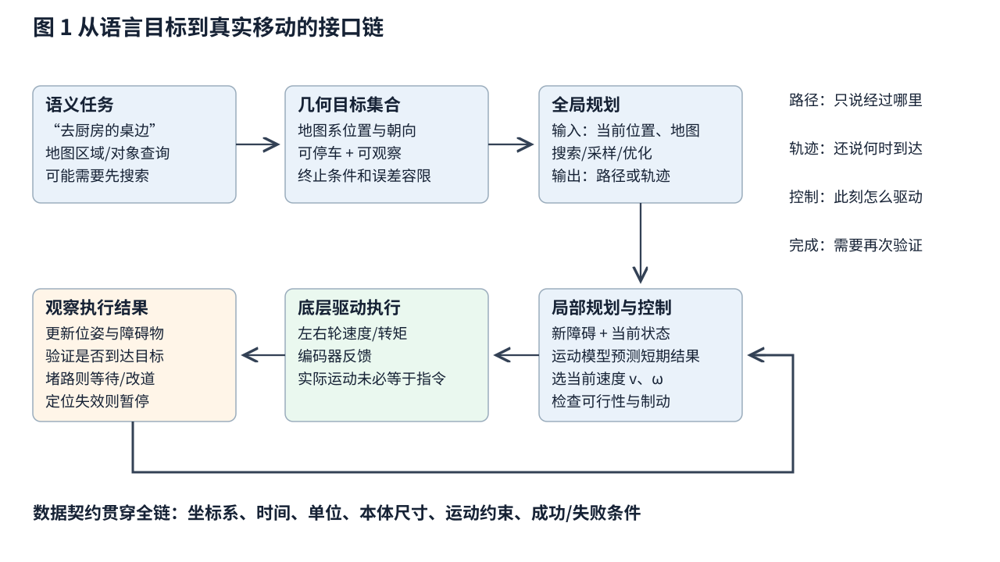
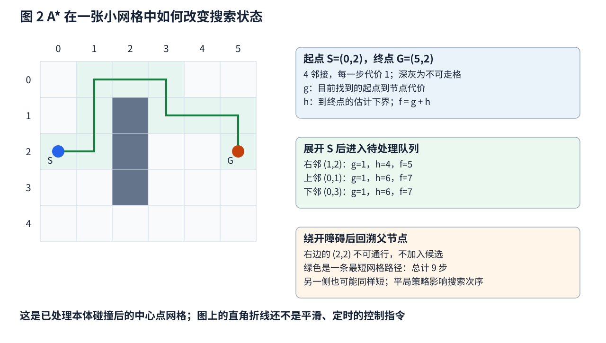
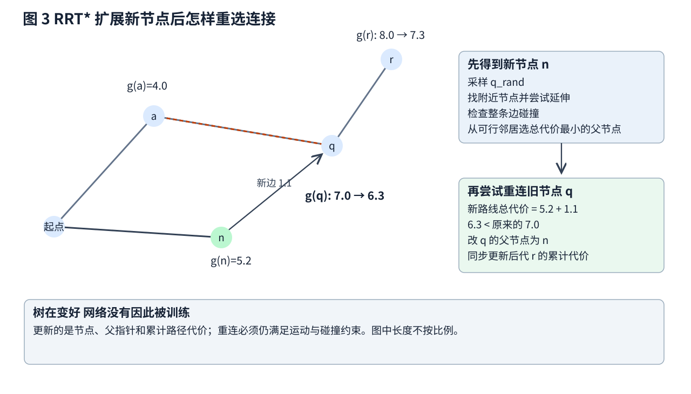
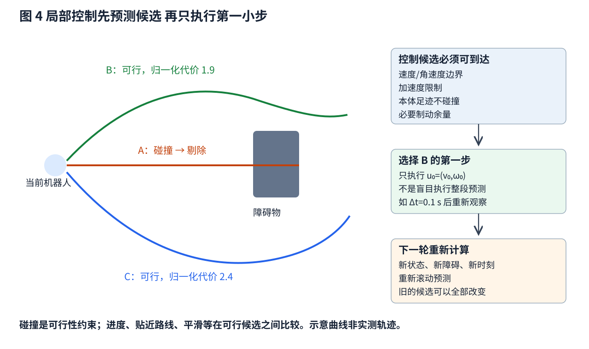
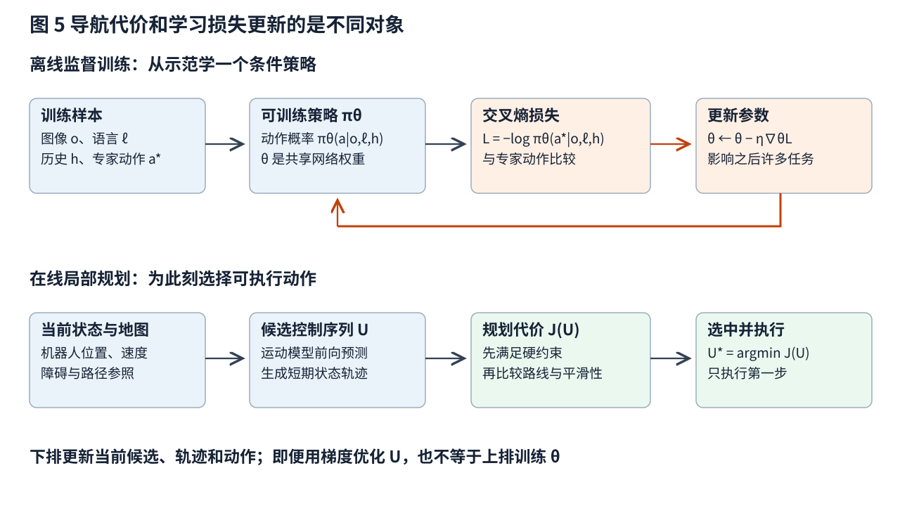

# 导航与规划 从语义目标到安全可执行的运动

“去厨房桌边”对人来说是一句话，对机器人却不是一个可直接发送给电机的命令。厨房在哪里，桌边哪一点能停，机器人能否通过门口，走到一半有人挡路怎么办，最后怎样确认已到达？这些问题共同构成导航。

本篇用一台地面移动机器人串起完整过程：目标表达 → 环境表示 → 全局搜索或采样 → 运动可行性 → 局部控制 → 结果验证。你只需要基础深度学习、向量与导数以及速度和加速度概念。我们会手算一个 A* 搜索片段、一次 RRT* 重连、轮速换算和制动距离，再解释语言导航在哪里引入神经训练损失。

文中的地图、路径和数字均为原创教学构造，不是任何硬件的安全认证，也不是原论文实验。实际设备应遵守其安全设计与验证要求。

## 一 把一句目标拆成几个可检验的问题

### 1.1 语义目标不等于几何坐标

“厨房”可能是地图上的房间区域，“桌边”可能是一个对象周围的可停车区域。如果机器人已有语义地图，可以查询房间和桌子；没有地图时，需要先搜索与观察，不能假装一句话中已经包含精确坐标。

目标常更适合写成一个集合 G，而不是一个点：例如位于桌边可通行区域、朝向桌面、停下后能看见目标，同时与桌沿保持所需距离。G 中每个状态都算几何上可接受，但任务完成还可能要求确认这确实是指定桌子。

机器人必须知道目标属于哪个坐标系。地图系目标 (3,2) m 与相机图像像素 (3,2) 是完全不同的东西；目标是相对当前位置还是绝对地图位置，也不能含糊。

### 1.2 路线 路径 轨迹和控制不是同一个输出

- **路线**可只给房间或通路顺序，如门口 → 走廊 → 厨房
- **路径**描述连续或离散的空间位置，回答经过哪里，未必给时间
- **轨迹**把状态与时间联系起来，回答每一刻在哪里、速度多大
- **控制输入**是当前下发的速度、轮速或力矩等，取决于底层接口

一条避开墙的折线不保证小车可以按任意速度跟随。即便得到可行轨迹，真实地面摩擦和测量误差也会使执行偏离，所以还需要反馈。

### 1.3 全局与局部模块交换什么

一个模块化系统可让全局规划器读取地图和当前位姿，输出到目标的路径；局部控制器结合新障碍、当前速度和本体限制，输出当下可行控制。Nav2 的官方概念文档采用了类似的规划器、控制器、平滑器与恢复行为职责划分。[1]

这只是理解接口的一个明确设计，不意味着所有学习导航系统都必须以相同方式实现内部模块。



图 1 的反馈线很重要。执行后重新观察，才能知道刚才的命令真正造成了什么。规划器返回一条路径是中间结果，控制器报告停止也不自动证明语义目标已实现。

## 二 用什么表示能走和不能走的地方

### 2.1 占据地图与代价地图提供不同信息

二维占据网格把地面划成边长 r_map 的小格子。r_map 叫地图分辨率，单位 m/格。格子可以记录占据概率，也可被进一步分成空闲、占据和未知。未知表示没充分看见，不等于一定能走。

若地图原点是 (x₀,y₀)，采用 x、y 坐标轴与网格列行方向一致的约定，可用：

```text
列索引 i = floor((x − x₀)/r_map)
行索引 j = floor((y − y₀)/r_map)
```

floor 表示向下取整。真实程序还要检查地图原点姿态、图像显示是否上下翻转、边界索引范围。一个 0.05 m/格的地图中，相差 20 格是 1 m，而不是 20 m。

**代价地图**除了表示绝对不可走，还给可走区域分配偏好代价：离墙近更贵、拥挤区域更贵、指定通道较便宜等。某格的代价 200 未必表示碰撞概率 200/255；具体值的语义来自系统约定。[1]

### 2.2 机器人有体积 不能当作无厚度点

设机器人近似为半径 r_body 的圆盘。如果让机器人中心规划在原障碍边缘旁边，身体会穿入障碍。一个常见等价思路是把障碍向外扩张 r_body，再在扩张后的自由空间中规划中心点；还可加入安全余量。[2]

**门口算例。** 门宽 0.90 m，机器人半径 0.30 m，每侧再留 0.10 m，中心可通过的横向宽度只剩：

```text
0.90 − 2 × (0.30 + 0.10) = 0.10 m
```

这说明“看起来宽 90 cm 的门”对该机器人已经是很窄的中心通道。若再保守加入每侧 0.08 m 的定位/建图误差界，剩余宽度变成 −0.06 m，当前保守模型会判断不能通过。这里的 0.08 m 是假设的确定性误差界，不是把一个标准差自动当成绝对界。

对于长方形底盘或伸出的机械臂，碰撞还取决于朝向和当前外形；一个统一圆形膨胀可能太保守或不够准确。此时应检查实际足迹，或在位置与朝向共同组成的**构型空间**里规划。[2]

### 2.3 构型和状态为什么要分开

二维刚体的构型 q=(x,y,ψ) 描述摆放位置与朝向；如果还需要考虑速度，可把状态写成 s=(x,y,ψ,v,ω)。v 为前向速度 m/s，ω 为角速度 rad/s。

同一个位置和朝向，以 0.1 m/s 与 2 m/s 经过，制动能力和下一步可达区域不同。因此只在二维位置网格上找到路，不足以回答高速执行是否安全。

## 三 A*搜索如何从地图得到一条路径

### 3.1 把网格看成图

把可行格子当作节点，相邻可达关系当作边。四邻接只允许上、下、左、右；八邻接还允许斜向，边代价和穿角碰撞规则也要随之改变。以下使用四邻接，每走一格的代价为 1，单位暂定为“格步”。

A* 为每个节点 n 维护三个数：

```text
g(n)：当前已找到的起点到 n 的最小累计代价
h(n)：从 n 到目标的估计剩余代价
f(n) = g(n) + h(n)
```

g 是搜索过程中会更新的记录；h 是用于引导探索的启发式。它们不是神经网络的隐藏状态或可训练权重。[3]

待处理队列常叫 open set：下一次优先取 f 最小的节点展开。父节点指针记录“目前哪条已知路线到达这里最好”，最终从终点倒着追这些指针得到路径。

### 3.2 手算前两步 为什么不一开始就向障碍撞过去



图 2 的起点 S=(0,2)，终点 G=(5,2)，障碍为 (2,1)、(2,2)、(2,3)。这是已经处理本体碰撞后的中心点网格；图示坐标 y 向下，只为了与网格行号一致。

采用曼哈顿距离 h(n)=|x_n−5|+|y_n−2|，因为四邻接至少需要这么多水平和竖直步：

- 起点 g=0、h=5、f=5
- 展开起点后，右邻 (1,2) 的 g=1、h=4、f=5
- 上邻 (0,1) 和下邻 (0,3) 的 g=1、h=6、f=7

于是先处理 (1,2)。它的右邻 (2,2) 是障碍，不能加入；其上邻 (1,1) 和下邻 (1,3) 都得到 g=2、h=5、f=7。继续扩展会发现必须绕过竖直障碍。图中绿色路线共 9 步：直接横向需要 5 步，再额外上下绕行各 2 步。

相同 f 的候选可以按不同平局策略展开，最终不一定得到同一条折线；本图上从障碍另一边绕也有同长解。

### 3.3 一次节点更新到底修改什么

从节点 n 尝试走到邻居 m，先算 g_candidate = g(n)+c(n,m)，c 是这条边的代价。如果新值比 g(m) 小，就修改 g(m)、父节点和队列优先级；否则保留原记录。整个过程只有离散比较和数据结构更新，没有反向传播。

A* 的最优性依赖图、非负边代价、启发式和实现方式。若 h 不高估真实剩余代价，称为可采纳；一致性还要求 h(n) ≤ c(n,m)+h(m)。一致启发式可配合常见的已关闭节点策略；仅可采纳但不一致时，正确实现可能需要重新打开得到更好路径的节点。[3]

设 h=0，算法退化为按累计代价扩展的 Dijkstra 式搜索。把 h 乘大可能更快偏向目标，却不能再无条件声称得到原问题的最短路径。

### 3.4 搜索最优不等于真实机器人最优

9 步最短只是对这张静态四邻接图和给定代价成立。更细的地图可能允许更短的斜行曲线；真实机器人可能要减速转弯；一条稍长但更宽的通道也可能更可靠。

因此需要说明代价究竟代表长度、耗时、能耗还是风险偏好。它们不是同一个量，也不能仅凭“最优规划”四个字互相替换。

## 四 连续空间怎么搜索 从RRT到RRT*

### 4.1 为什么需要采样

连续位置有无限多个可能值，机械臂多个关节组合的维度还会更高。把每个维度都细密网格化，节点数会迅速增长。采样方法通过抽取有限个状态、测试局部连接是否可行，避免显式枚举整个空间。[2][4]

快速探索随机树（RRT）在最简单的几何版本中可以这样运行：

1. 用起点建一棵树
2. 采一个候选位置 q_rand
3. 找树中按选定距离度量最近的节点 q_near
4. 朝候选方向延伸至多一个步长 η，得到 q_new
5. 检查从 q_near 到 q_new 的整段是否碰撞；可行才加新节点和连接
6. 重复，尝试连接目标集合

若使用欧氏位置空间、直线连接和固定步长，可以写：

```text
d = ‖q_rand − q_near‖
q_new = q_near + min(1, η/d)(q_rand − q_near)，当 d > 0
```

这里 η 与 q 的位置单位一致。若状态含朝向或关节角，距离度量和连接方式必须另行定义，不能把米和弧度随意相加。

**整段碰撞检查**很重要。两个端点都在空地，不代表中间连线没有穿墙。离散采样检查若太稀疏也会漏碰撞，需要与几何和分辨率要求匹配。

### 4.2 RRT*为什么会更换已经存在的父节点

基本 RRT 找到一条路后，并不会自动系统地优化所有已有连接。RRT* 在加入新节点附近比较不同父节点的累计代价，并尝试让附近旧节点改走新节点，称为重连。[4]



在图 3 的原创数值例子中，旧节点 q 从原父节点走来的总代价是 7.0；新节点 n 的累计代价是 5.2，从 n 到 q 的可行边代价是 1.1。因此新路线总代价 6.3 更小，便把 q 的父指针改成 n。若 q 的后代 r 比 q 多一条代价 1.0 的边，r 的总代价也由 8.0 变为 7.3。

更新的是树结构、累计代价和当前候选路径。并不是拿“7.0−6.3”当损失去训练一个网络。图中的节点位置不按代价长度比例绘制，算例只展示重连逻辑。

### 4.3 渐近最优到底承诺了什么

RRT* 的经典结论是在相应假设下，样本数量趋于无限时，得到的最好路径代价几乎必然趋近最优。该分析涉及可行空间、鲁棒可行路径、代价性质、采样和邻域连接规则等前提。[4]

它没有承诺“抽 100 个点就一定最优”“一秒内必定成功”或“随便加入车辆动力学仍自动继承原证明”。狭窄通道、昂贵碰撞检查、高维状态和紧张时间预算，都可能使有限时间表现很困难。

当机器人无法沿任意直线运动时，需要能满足其运动模型的局部连接、运动基元或控制采样。例如采样一段转向和速度，把动力学前向积分到新状态；不能简单把几何 RRT 的直线连接拿来当车辆轨迹。[2]

## 五 路径怎样变成这台机器人真的能做的运动

### 5.1 非完整约束可以从小车不能横移理解

理想差速轮式机器人，用前向速度 v 和角速度 ω 控制。若无侧滑，其平面运动关系为：

```text
ẋ = v cosψ
ẏ = v sinψ
ψ̇ = ω
```

点表示对时间求导。车头朝 ψ=0 时，瞬间前进会改变 x，不能保持朝向不变同时向 y 方向横移。这类对允许速度的限制，常称非完整约束。[2]

用短时间 Δt 做简单预测：

```text
x_(k+1) ≈ x_k + v_k cosψ_k Δt
y_(k+1) ≈ y_k + v_k sinψ_k Δt
ψ_(k+1) ≈ ψ_k + ω_k Δt
```

这是离散近似；转弯较快或步长较大时，应采用更准确积分或足够细的步长。ψ 的误差还要按角度环绕处理，不能把 179° 与 −179° 当作相差 358° 的朝向。

### 5.2 速度命令怎样变成轮速

设轮半径 r_w=0.10 m，左右轮间距 b_w=0.50 m，左右轮角速度为 ω_L、ω_R，单位 rad/s。理想滚动关系为：

```text
v = (r_w/2)(ω_R + ω_L)
ω = (r_w/b_w)(ω_R − ω_L)
```

若期望 v=0.40 m/s、ω=0.20 rad/s，则：

```text
ω_R = (v + ω b_w/2)/r_w = 4.5 rad/s
ω_L = (v − ω b_w/2)/r_w = 3.5 rad/s
```

这仍只是理想运动学换算。电机控制器还要用编码器反馈跟踪轮速，实际地面可能打滑；上层导航从新的位姿估计看到执行结果后，再纠偏。

### 5.3 运动边界是硬条件 不是装饰

轨迹需要满足最大速度、最大角速度、加速度和制动能力等约束。以当前 v=0.40 m/s、最大加速度幅值 0.50 m/s²、控制周期 0.10 s 为例，下一周期可达速度只能位于约 [0.35,0.45] m/s，再与硬件速度上下限取交集。

如果全局路径突然要求一个高速直角拐弯，控制器可能无法跟上。可在规划时引入朝向状态和可行运动基元，或平滑路径并重新验证碰撞与曲率，再分配速度。平滑后曲线可能向障碍内部“抄近路”，所以不能只看画面顺滑就认为有效。

## 六 局部控制为什么总在短时间内重算

### 6.1 一张旧地图不足以应付眼前的人

全局路径提供大的方向，局部传感器提供最新障碍。局部控制每轮读取当前位置、当前速度、附近路径和障碍，预测一些短期行动的结果，再选一个当前能执行的动作。

一个教学设置可以预测未来 2 s，离散成 20 个 0.1 s 步长。但只执行第一个 0.1 s，然后重新读取数据、重新规划。这叫滚动时域思想；数字只是示例，不是通用的频率标准。

### 6.2 动态窗口方法如何缩小候选

动态窗口方法 DWA 在速度空间中考虑候选 (v,ω)，先限制为短时间内可达到的速度，再检查相应路径是否有足够制动余量，在可接受候选中比较朝向目标、速度和障碍距离等目标。[5]

注意三个集合应取交集：硬件允许的速度、由当前速度和加速度在短时间内可达的速度、能够安全停下的速度。前两项合法不代表第三项也合法。

例如前面速度窗口为 [0.35,0.45] m/s，向前的某个候选虽然运动学可达，若前方刚出现障碍而制动距离不够，仍应剔除。DWA 的具体评分并不等同于下面用于讲解的通用轨迹代价。

### 6.3 模型预测控制把一串动作当成优化变量

另一种写法把未来控制序列记为 U=(u₀,…,u_(N−1))，每个 u_k=(v_k,ω_k)。从当前状态 s₀ 出发，用运动模型生成 s₁,…,s_N。然后在约束下比较目标：

```text
min_U J(U)
满足 s_(k+1) = f(s_k,u_k)
     速度和加速度限值
     整个预测轨迹上的本体碰撞约束
```

J 可以包含目标距离、偏离参考路径程度、控制变化和终端误差。一个教学例子先把每项都除以相应单位尺度，再写成：

```text
J = d_goal + 2 d_path + 0.5 c_change
```

d_goal 是归一化目标距离项，d_path 是归一化路径偏离项，c_change 是归一化控制变化项，三者均无量纲。它们可以是整个预测时域的平均或终端项，但在实现中必须明确。系数 1、2、0.5 表达设计者的取舍，不是自然常数。

若 B 候选的三项为 (1.0,0.2,1.0)，J_B=1.9；C 为 (0.6,0.5,1.6)，J_C=2.4。C 的目标距离更好，但偏离路径和动作变化更大，因此综合排序较差。若任务偏好改变，排序也可能改变。



图 4 的 A 候选因为碰撞先被排除；不能靠“接近目标的奖励很高”补偿它。B、C 的数值是教学评分，曲线不用于计算这些数值，也不是实测轨迹。

### 6.4 如果用了梯度 梯度流到哪里

在可微运动模型和可微目标下，可以对 U 求梯度。u₀ 会影响 s₁，s₁ 又影响 s₂，因此较晚状态的代价会通过运动递推的链式法则影响较早控制量。优化器更新的是**当前待执行的控制序列 U**。

这与训练一个策略网络的权重 θ 不同。候选控制也可以通过枚举、采样或其他数值优化比较，未必有神经网络，未必用反向传播。若额外学习了模型或代价函数，那是另一个要明确数据和监督来源的学习问题。

局部最优化还可能落入局部极小值，短视地在 U 形障碍前来回犹豫。因此它常需要全局路线、较好初值、重新规划和失败处理，不能单靠增加一次求解精度解决所有导航困难。

## 七 制动距离给规划提出了什么最低要求

假定速度 v，能稳定提供减速度幅值 a_brake>0，忽略更复杂动力学，匀减速停车距离为 v²/(2a_brake)。若从感知到生效还有延迟 τ，延迟期间继续前进 vτ：

```text
d_needed ≈ vτ + v²/(2a_brake) + d_margin
```

取 v=0.60 m/s、τ=0.20 s、a_brake=1.0 m/s²、安全余量 d_margin=0.10 m，则 d_needed≈0.12+0.18+0.10=0.40 m。

这个算例没有保证 0.40 m 在所有环境都安全。轮胎打滑、下坡、未知障碍运动和制动执行误差会改变结果。它揭示的是：**障碍刚被看见时还有没有足够时间停下，也必须进入系统设计**。视野外、遮挡后面和过期传感器信息不能用静态地图的空白替代。

对于行人等动态障碍，只知道其当前占据位置不够。需要短期运动预测、不确定性余量和谨慎策略；预测错时还要有独立的安全响应。合理的规划代价不是现实碰撞安全性的完整证明。

## 八 语言导航增加了哪一个学习问题

### 8.1 语言不一定只指定终点

“走过沙发，在第二个门口左转，再到窗边停下”同时包含地标、顺序、相对方向和停止条件。视觉语言导航 VLN 要把这些词语与观察联系起来，并维护目前执行到了哪一段。

如果任务只是“去冰箱旁边”，主要是目标定位与搜索；若任务要求经过特定走廊，则即便到同一个终点，完全绕另一条路也可能不算正确。任务定义改变，评价标准也要改变。

Room-to-Room（R2R）是经典 VLN 基准：其原始设置使用真实室内环境的视觉数据和导航图，学习依照自然语言指令移动的策略。[6] “真实环境数据”不应被读成原始基准已经验证了实体机器人上的连续速度控制、制动和动态避障。

### 8.2 一个学习策略怎样表示输入输出

把当前视觉观测记为 o_t，语言指令记为 ℓ，已走历史或内部记忆记为 h_t。策略输出动作分布：

```text
πθ(a_t | o_t, ℓ, h_t)
```

θ 是网络权重。视觉编码器提取观察特征，语言编码器表示指令，融合模块决定哪些词与当前观察相关，历史模块维护进度。输出动作可以是相邻视点、候选航点、转向类别或连续控制；不同选择意味着不同难度与额外接口。

若在导航图上输出“走到相邻节点 3”，系统还需把这个抽象动作变成实际可行移动。真实机器人不能像图算法一样瞬间跳到下一个相机视点。

### 8.3 示范动作损失怎样训练网络

若有专家轨迹，给第 t 步专家动作为 a*_t，一个基础监督目标是：

```text
L_IL(θ) = −Σ_t log πθ(a*_t | o_t, ℓ, h_t)
```

IL 表示模仿学习。真值是专家动作，不是像素分割标签；损失经动作输出、视觉语言融合和可训练编码器反传。采用梯度下降时更新 θ，从而影响以后许多任务中的决策。若某个编码器被冻结，它不会随这项损失更新；原始 R2R 实现预先缓存 CNN 视觉特征，因此不能把这个示意损失理解成原论文将视觉骨干也全部端到端训练。[6]

仅看专家到过的状态训练，执行时一旦走错，就可能进入没见过的观察和历史组合。训练时喂专家动作还是模型采样动作，会改变模型看到的状态分布；原始 R2R 论文也比较了相应训练策略。[6] 本文不把“学到了动作分布”当成“已经获得任何地图上的可靠导航能力”。

有些导航方法还使用强化学习奖励，例如到达、进度或碰撞惩罚。这时需要说明奖励、策略更新方法和环境交互来源，不能把规划代价 J 的负数写出来就宣称已完成强化学习。



图 5 上排更新共享网络权重 θ，下排更新当前控制序列 U 或选择当前候选。两者都可能用“优化”这个词，但变量、数据和更新时机不同。

### 8.4 语言推理之后还要做几何与终点验证

一个可解释的混合系统可以让语言策略提出下一个房间、地标或航点，几何规划负责路线，局部控制负责可达速度和避障。语义模块发现“第二个门”计数不确定时，可以暂停核验；不能把“语言模型确信”当作墙体不存在的证据。

到达目标附近后，还要用当前观察验证：是否是指定房间或物体、是否朝向正确、是否已停稳、是否满足观察或交互距离。若只根据导航 API 返回 success 就把高层任务标成完成，容易把“到达一个坐标”误当成“完成用户要求”。

## 九 把一次完整执行写成可诊断的流程

下面是一条教学级执行链：

1. 将“去厨房桌边”解释为目标对象和允许停车状态集合；若目标不唯一或地图中没有它，进入查询或搜索
2. 获取带时间的当前位姿、速度和不确定性；确保目标、地图和机器人位姿在可转换的参考系中
3. 更新障碍表示，考虑本体足迹、安全余量和未知区域规则
4. 用搜索或采样得到全局路径；找不到时说明当前模型下不可达，检查是否地图变化或目标定义问题
5. 根据运动约束平滑或细化路径，分配可行速度；重新检查修改后路径的碰撞
6. 局部模块持续预测候选、筛除不可行运动，选一个短期控制并执行第一步
7. 新观测显示临时堵路时，可等待或重规划；长时间无进展时升级处理，而不是不断重复同一撞墙候选
8. 位姿失效、数据过期或制动余量不足时，按安全设计暂停相关运动；不能为了“任务一定完成”忽略这些信号
9. 进入目标集合后验证语义对象、朝向、距离和停止条件，再报告完成；验证失败则继续观察或明确报告未完成

日志应让人看得出哪里失败：目标解析错、定位漂移、地图漏障碍、全局搜索无解、局部控制无可行候选、执行打滑，还是终点语义验证失败。这些故障需要不同处理，统一归为“导航模型不好”没有诊断价值。

## 十 如何读懂导航实验而不被一个成功率误导

### 10.1 成功率必须附带成功定义

到终点 3 m 内与到桌沿 20 cm 内不是同一任务。终点是否要主动发出停止动作、是否必须看见指定物体、是否要遵循路线、碰撞如何计数、时间和步数预算如何限制，都影响成功率。

还应区分已见环境与未见环境。模型记住训练房间的布置，与根据语言和观察在新环境导航，是不同的能力。[6][7]

### 10.2 长度加权成功指标也有边界

一种常用指标是 SPL，单任务分数可写为：

```text
SPL_i = S_i × l_i / max(p_i,l_i)
```

S_i 为是否成功（0 或 1），l_i 为定义环境中到目标的最短路径长度，p_i 为实际路径长度。多个任务通常再求平均。若成功且 l=10 m、p=12.5 m，单任务 SPL=0.8；失败则为 0。[7]

它把成功和路线效率结合起来，但仍不能独自衡量碰撞风险、动作平顺性、计算成本或是否忠实遵循一段指定路线。若指令刻意要求绕路，单纯偏好到终点的最短长度也未必对应用户意图。

### 10.3 三道自检题

**题 1：** 一条路径在膨胀后的地图里无碰撞，能否以任意速度执行？

答：不能。还需要满足转向、加速度、制动、时变障碍和执行误差等条件。

**题 2：** RRT* 已抽取 500 个样本，能否因此宣称找到了全局最优解？

答：不能。经典结论是带前提的渐近性质，有限样本与计算预算下需要报告实际结果及可行性。

**题 3：** 局部控制用导数把 J(U) 降低了，是不是 VLN 网络训练成功？

答：不是。它只优化了这次控制序列；训练策略网络需要以 θ 为变量、具有明确数据和学习目标的更新。

理解导航的关键，不是记住一串算法缩写，而是能沿着数据链追问：**目标怎样落在地图上，地图怎样约束候选，候选怎样遵守本体运动，执行以后谁来验证结果。** 只要其中一环缺失，一条漂亮的路径图也不等于可靠的自主移动。

## 参考文献

[1] Nav2 官方文档，Navigation Servers。核对规划器、控制器、平滑器、恢复和机器人足迹职责；文中频率与参数不是引用其默认配置。https://github.com/ros-navigation/docs.nav2.org/blob/rolling/docs/getting_started/navigation_concepts/navigation_servers.md

[2] LaValle. Planning Algorithms. 2006。作者公开版，重点参阅第4章构型空间、第5章采样式规划、第13至14章运动模型与微分约束。https://lavalle.pl/planning/

[3] Hart, Nilsson, Raphael. A Formal Basis for the Heuristic Determination of Minimum Cost Paths. 1968。A*原始论文。https://ai.stanford.edu/~nilsson/OnlinePubs-Nils/PublishedPapers/astar.pdf

[4] Karaman, Frazzoli. Sampling-based Algorithms for Optimal Motion Planning. 2011。用于RRT*父节点选择、重连及渐近最优结论与前提。https://arxiv.org/abs/1105.1186

[5] Fox, Burgard, Thrun. The Dynamic Window Approach to Collision Avoidance. 1997。作者主页及原论文入口，核对速度空间、动态可达窗口、制动可接受性与目标评分。https://www.cs.cmu.edu/~dfox/abstracts/colli-ieee.abstract.html

[6] Anderson 等. Vision-and-Language Navigation: Interpreting Visually-Grounded Navigation Instructions in Real Environments. CVPR 2018，2017预印本。用于R2R任务、导航图、视觉语言策略及示范训练，不作为实体机器人安全执行证据。https://arxiv.org/abs/1711.07280

[7] Anderson 等. On Evaluation of Embodied Navigation Agents. 2018。用于任务定义、泛化设置与SPL等评价讨论。https://arxiv.org/abs/1807.06757
