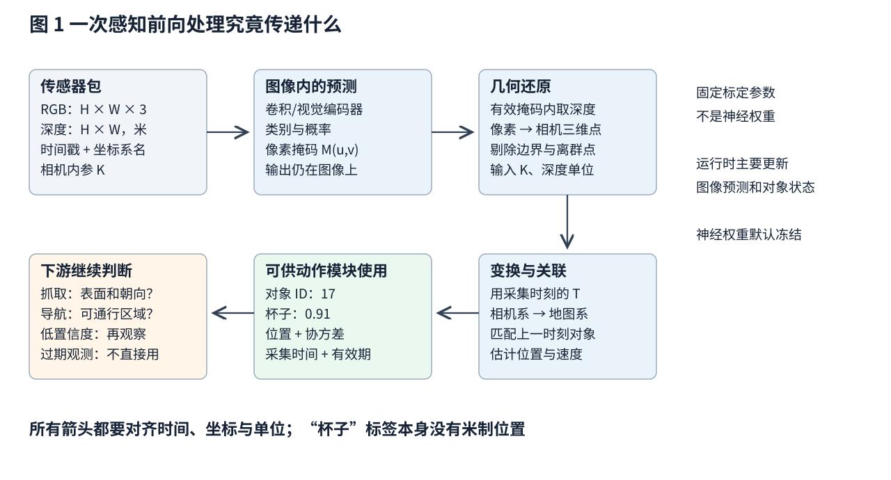
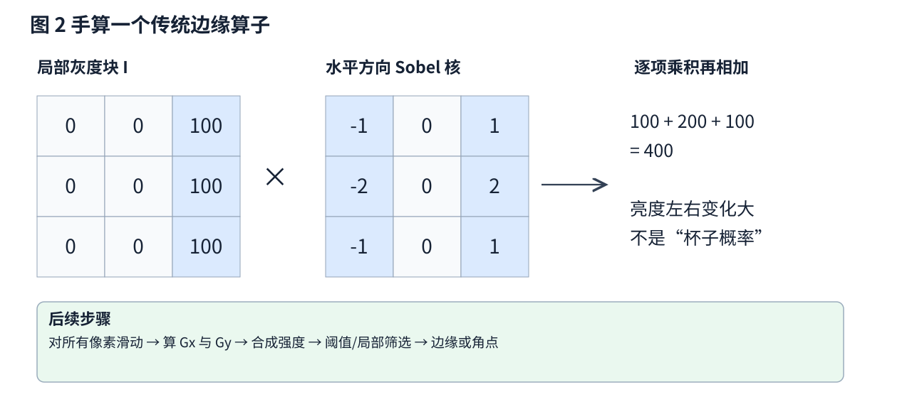
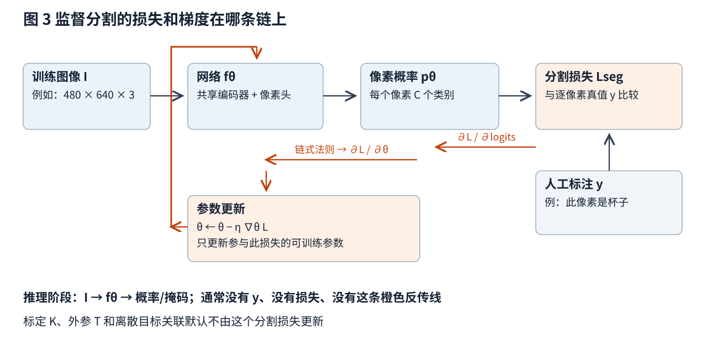
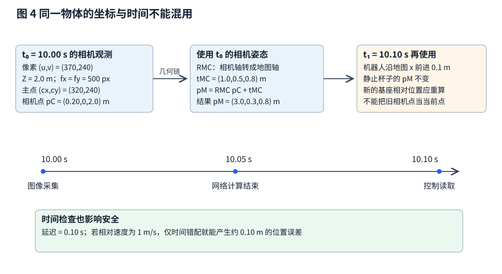

# 感知 从相机像素到机器人能使用的环境信息

你已经知道神经网络怎样前向计算、怎样用损失函数训练，也学过位置、速度和坐标。接下来缺少的桥梁是：机器人上的网络输出，怎样变成一次可靠的行动依据。

本篇只做一件事：跟着一台移动机器人寻找桌上的杯子，把原始读数变成带有位置、时间和不确定性的对象记录。沿途会亲手算一次边缘响应、一次像素到三维的变换、一次分类梯度和一次融合结果。读完后，应能回答“输入是什么、数值属于哪个坐标系、哪个环节在训练、运行时到底更新了什么”。不要求先懂机器人软件、滤波器或 SLAM。

文中杯子、相机和数字均为教学构造，示意图为本文原创。模型和算法的出处集中列在文末，正文的 [n] 对应参考编号。

## 一 先把任务说成可检验的输出

假设用户说“把桌上的杯子拿给我”。感知模块的输出至少要回答四层问题：

1. **识别**：图像里是否有杯子，它与水壶是否容易混淆
2. **定位和分割**：杯子对应哪个图像区域，哪些像素属于这个杯子
3. **几何**：可见表面离相机多远，位置怎样换到机器人底盘或机械臂基座坐标系
4. **时间和可靠性**：这条记录来自什么时候，有多大误差，现在还能不能使用

这四项齐全之后，抓取还需要杯壁朝向、手指能否进入、材质是否易滑等更细的观测和抓取模型；“找到了杯子”是后续动作的一个必要输入。

为了把接口讲清楚，设感知输出一条记录：对象编号 17、类别杯子、类别分数 0.91、实例掩码、地图系位置、位置协方差、采集时刻、最近一次观测时刻。**类别分数与位置协方差是两种置信度**：前者描述模型对类别的偏好，后者描述几何误差在各方向上的大小及关联（类别分数还未必经过概率校准）。

图 1 应从左上读到右上，再沿箭头返回左下。图像预测、几何还原、跨时刻关联是不同运算；它们可以被组合训练，也可以完全分开实现。本篇先解释一个模块化系统。

## 二 传感器真正交给了我们什么

### 2.1 彩色图像与像素索引

一张 RGB 图像记为 $I_t\in\mathbb{R}^{H\times W\times3}$，$t$ 是采集时刻（像素与通道见 [11-cnn](../../foundations/lessons/11-cnn.md)）。

像素索引写成 $(u,v)$：$u$ 是横向列号，$v$ 是纵向行号，通常原点在图像左上，右和下为正。很多数组访问写作 $I[v,u]$，这与几何公式的 $(u,v)$ 顺序不同。把行列弄反不会触发数学错误，却会把三维位置投到错误方向。

### 2.2 深度图必须问清楚“深度”的定义

深度图 $D_t(u,v)$ 给一些像素附上距离。本文把深度定义为**沿相机光轴的坐标 $Z$**，单位米。某些设备给的是从传感器到表面的斜距 $r$，另一些原始数组用毫米或厂商自定义比例；要先换成同一种定义，再代入公式。

若读数是斜距，先构造方向 $d=K^{-1}[u,v,1]^T$，再用 $p_C=r\,d/\|d\|$ 得到相机系点。若读数是光轴深度，则使用下一节的 $p_C=Z\,d$。这里 $K$ 是相机内参矩阵。无效深度通常需要单独的有效位或掩码（数值 0 不表示物体就在相机中心）。

### 2.3 激光和惯性数据的形式

一个三维激光点云可以写成 $\{(x_i,y_i,z_i,\tau_i)\}$，坐标单位米，$\tau_i$ 是第 $i$ 个点的采集时刻。雷达一圈扫描需要时间，移动期间一圈内不同点对应不同传感器姿态。把整圈强行当作同一瞬间，直墙可能变弯；需要用运动估计对点做时间补偿。

惯性测量单元 IMU 主要给角速度（rad/s）和比力（m/s²）。加速度计测的是比力：静止在桌上时，它仍能测到支撑力对应的比力。要推算空间运动，需要处理重力、姿态、零偏和时间间隔。感知融合用 IMU 提供运动信息。

不同传感器的互补性来自测量机制不同。RGB 对纹理和语义有帮助，深度或激光提供几何，惯性有高频运动信息；透明物、反光、弱纹理、振动、遮挡等会以不同方式破坏这些测量。

## 三 先把像素变成三维点 再谈机器人在哪里

### 3.1 内参把图像方向和光线方向联系起来

使用无畸变针孔模型时，相机系点 $p_C=(X,Y,Z)^T$ 投影到像素满足：

$$u=f_xX/Z+c_x,\qquad v=f_yY/Z+c_y.$$

$f_x,f_y$ 是以像素为单位的焦距参数；$c_x,c_y$ 是主点坐标；$X,Y,Z$ 是米。式中的 $X/Z$、$Y/Z$ 是无量纲比例，因此最后得到像素。一个像素只限定一条射线：沿这条射线的近点和远点能投到同一个像素，单张 RGB 的一个点没有直接告诉我们距离。[1]

给定有效光轴深度 $Z$，反过来计算：

$$p_C=\begin{bmatrix}(u-c_x)Z/f_x\$v-c_y)Z/f_y\\Z\end{bmatrix}.$$

**手算一次。** 令 $f_x=f_y=500$ px，$(c_x,c_y)=(320,240)$ px，杯子某个可见表面像素是 $(370,240)$，深度 2 m。则 $X=(370-320)\times2/500=0.20$ m，$Y=0$，$Z=2$ m。这只是一个表面点；杯子的几何中心或抓取点要另外估计。

真实相机还需要标定和去畸变；RGB 与深度也可能来自两个不同的镜头。所谓“对齐深度图”，意味着已经利用两个相机之间的几何关系把测距对应到 RGB 像素。[1]

### 3.2 外参改变表达坐标

现在把相机系点换到地图系。定义 $T_{MC}$ 为“把 C 系坐标转换成 M 系坐标”的变换，它包含旋转 $R_{MC}$ 和平移 $t_{MC}$：

$$p_M=R_{MC}p_C+t_{MC}.$$

$R_{MC}$ 是 $3\times3$ 的旋转矩阵，负责轴方向；$t_{MC}$ 是相机原点在地图系中的位置，单位米。下标要写全：$T_{MC}$ 与 $T_{CM}$ 互为逆变换，通常不同。[1]

沿用上例，明确约定：相机 $z$ 轴朝前，$x$ 轴朝右，$y$ 轴朝下；此刻地图 $x$ 朝机器人前方，$y$ 朝左，$z$ 朝上。因此用

$$R_{MC}=\begin{bmatrix}0&0&1\\-1&0&0\\0&-1&0\end{bmatrix},\qquad t_{MC}=\begin{bmatrix}1.0\\0.5\\0.8\end{bmatrix}\text{ m}.$$

将 $(0.20,0,2.0)^T$ 代入，得到 $p_M=(3.0,0.3,0.8)^T$ m。可以逐轴检查：杯子在相机前方 2 m，所以地图 $x$ 增加 2 m；在相机右方 0.20 m，所以地图 $y$ 减少 0.20 m。

若要变换到机械臂基座 B，则再做 $p_B=T_{BM}p_M$。这里的简写默认使用齐次坐标，即给三维点加一个末尾为 1 的分量，使旋转和平移能合在一个 $4\times4$ 矩阵里。计算顺序仍是先从 C 到 M，再从 M 到 B。

## 四 传统算子究竟算出了什么

### 4.1 从局部亮度差开始

先不使用训练好的网络。为了寻找轮廓，我们比较附近像素亮度。Sobel 算子的横向核可以写成：

$$S_x=\begin{bmatrix}-1&0&1\\-2&0&2\\-1&0&1\end{bmatrix}.$$

把这个固定核在灰度图上做卷积（卷积的逐项计算见 [11-cnn](../../foundations/lessons/11-cnn.md) 第 2 节），得到横向亮度变化响应 $G_x$。转置核得到纵向响应 $G_y$；$\sqrt{G_x^2+G_y^2}$ 可作为边缘强度。具体实现可能选择不同归一化，响应值本身不必落在原图的 0 到 255 范围。[2]

图 2 中每行是 $[0,0,100]$，横向核计算得到 $100+200+100=400$，纵向响应为 0。这个结果表示有明显的左右亮度变化；阴影和桌面纹理同样会产生这样的边缘，所以它还不能说明边界属于一个物体。

这里运行时更新的是整张响应图，核的系数固定。调阈值、平滑尺度、局部窗口属于算法配置。

### 4.2 为什么跟踪更喜欢角点而不只喜欢边缘

沿着一条长直线移动一个小窗口，窗口外观可能几乎不变；垂直这条线移动，外观变化很大。因此一条边只能很好约束一个方向。角点附近在两个方向上移动都会改变外观，较容易在下一帧重新找到。

一种做法是在小窗口内计算梯度乘积的总和：

$$M=\sum_i w_i\begin{bmatrix}G_{x,i}^2&G_{x,i}G_{y,i}\\G_{x,i}G_{y,i}&G_{y,i}^2\end{bmatrix}.$$

$i$ 枚举窗口内像素，$w_i$ 是邻近权重。对任意小位移向量 $d$，$d^TMd$ 近似描述这个方向上的图像变化。若存在一个方向变化很小，多半是一条边；若两个主方向变化都大，可能是角点。Harris 检测据此构造角点响应。[3]

下一步还需要描述子与匹配：在角点周围提取外观向量，将前后帧候选互相比对，并用运动几何剔除明显不相容的对应。反复的瓷砖纹理会导致误匹配，缺纹理白墙则可能没有足够特征。

### 4.3 传统几何估计也会有优化目标

从匹配点估计平面、相机运动或物体位置时，可以最小化几何残差。例如拟合平面 $n^Tp+d=0$，其中 $n$ 是单位法向量、$d$ 是平面偏置，残差是点到平面的带符号距离。调整的是当前平面的参数 $n,d$。

这揭示了一个重要区分：**这类误差最小化是在解释当前这一组观测**，与在数据集上训练神经网络权重是两件事。

## 五 学习识别 检测和分割时 每个输出头做什么

### 5.1 同一个编码器可以接不同的预测头

图像编码器将 $I$ 变成特征张量 $F=f_\theta(I)$。$\theta$ 是可训练权重。

- **图像分类头**把整图特征汇总后输出各类别分数，回答整张图可能有什么
- **检测头**输出候选框和类别。框可以用中心 $x,y$ 与宽高 $w,h$ 表示，也可以用两角坐标，必须声明是像素还是归一化数值
- **语义分割头**对每个像素输出类别，把全部杯子像素标成同一类，未必能区分两只相邻杯子
- **实例分割头**还区分不同对象，输出“杯子 1 的掩码”和“杯子 2 的掩码”

U-Net 的编码—解码结构及跨层连接，是理解逐像素分割的经典入口；Mask R-CNN 则展示了检测、类别和实例掩码可以成为同一系统中的不同分支。[4][5] 这里借它们说明“共享特征之后仍有不同任务输出”。

### 5.2 分类损失怎样改变参数

下面的 softmax 与交叉熵推导见 [分类与概率](../../foundations/lessons/modules/objectives/02-classification-probabilities.md)，这里直接用于逐像素分割。设某个像素的类别分数为 $a_c$，softmax 概率为

$$p_c=\frac{e^{a_c}}{\sum_k e^{a_k}}.$$

$c,k$ 是类别索引。真值 $y_c$ 是 one-hot 标签：真实类别为 1，其余为 0。交叉熵为

$$L=-\sum_c y_c\log p_c,\qquad\frac{\partial L}{\partial a_c}=p_c-y_c.$$

**手算梯度的含义。** 如果这里只有杯子和背景两类，网络给杯子概率 0.7，真值是杯子，则损失 $-\log0.7\approx0.357$，两个分数的梯度是 $(-0.3,+0.3)$。梯度下降会倾向于提高杯子分数、降低背景分数。网络权重怎么动还要乘上分数对每个权重的导数，这正是链式法则。

逐像素分割的损失可以取有效像素上的平均：

$$L_{\rm seg}=\frac1{|\Omega|}\sum_{i\in\Omega}-\log p_{i,c_i}.$$

$\Omega$ 是有真值且没有被忽略的像素集合，$|\Omega|$ 是数量；$c_i$ 是第 $i$ 个像素的真实类别。遮挡、未知标签或无效区域应从 $\Omega$ 中排除，而不是当成背景监督。类别不均衡时，可加入类别权重或采用其他损失，但要说明权重如何改变优化目标。

图 3 的黑线是前向数据流，橙线是训练时梯度。若只训练分割头、冻结编码器，优化器只修改分割头参数。训练必须明确“哪些参数在优化器里”。

### 5.3 多任务训练要平衡各项损失

检测与分割可以合成示意目标：

$$L_{\rm train}=\lambda_cL_{\rm cls}+\lambda_bL_{\rm box}+\lambda_mL_{\rm mask}.$$

$L_{\rm cls}$ 是类别错误；$L_{\rm box}$ 是匹配后预测框与真值框的差异；$L_{\rm mask}$ 是相应对象的掩码错误。$\lambda_c,\lambda_b,\lambda_m$ 是人为设定或专门学习的任务权重。框损失可以用坐标差、平滑绝对误差或重叠度形式；不同算法的实际定义不同。[5]

共享编码器接收到多个分支的梯度之和，各头主要接收自己分支的梯度。若某项数值量级过大，可能主导训练。匹配候选、阈值筛选、非极大值抑制等是离散步骤，通常不可导。

执行时通常只有图像，没有人工标注；系统用冻结权重前向输出结果。**新出现一个杯子只会产生新预测，网络权重保持不变。** 真要在线训练，需要新的监督来源、更新规则和防止遗忘或失控的措施。

## 六 深度可以测量 可以三角化 也可以学习

### 6.1 双目如何把距离变成一个可算的量

对于已经校正、两相机光轴平行的理想双目，两个镜头间距叫基线 $b$，对应点横向像素差叫视差 $d$，则

$$Z=f_xb/d.$$

这里 $f_x$ 是像素，$b$ 是米，$d$ 是像素，所以 $Z$ 是米。令 $f_x=500$ px，$b=0.10$ m，$d=25$ px，则 $Z=2$ m。[1]

再求一个局部导数：$\partial Z/\partial d=-f_xb/d^2$。在此例中，视差误差约 1 px 会对应约 0.08 m 的深度误差。物体更远时视差更小，同样的像素误差造成更大的距离误差。因此“图像匹配差一点”可能对远处三维几何影响很大。这个数字是本文从公式推导的教学算例。

### 6.2 有深度标签时 训练目标很直接

深度网络输出 $\hat D_\theta(I)$。如果有经过对齐的米制真值 $D^*$，一个简单教学目标为

$$L_{\rm depth}=\frac1{|V|}\sum_{i\in V}|\hat D_\theta(i)-D^*(i)|.$$

$V$ 是有效深度像素集合。损失单位是米；只有有效点贡献梯度，梯度经深度预测头流回可训练编码器。很多实际方法使用对数深度、逆深度、尺度处理和不同鲁棒项，必须按其论文定义检查。

### 6.3 没有深度标签时 为什么两帧图像也能提供监督

假设短时间内场景静止，相机从时刻 $t$ 移到 $s$。给定目标帧像素 $i$ 的预测深度，可以完成四步：

1. 用 $K^{-1}$ 把像素和深度还原成目标相机系三维点
2. 用相对姿态 $T_{s\leftarrow t}$ 把点变到源相机系
3. 投影到源图像的连续像素位置 $j$
4. 在源图像 $I_s$ 的位置 $j$ 做双线性采样，重建目标像素 $\hat I_t(i)$

最简单的光度目标是 $L_{\rm photo}=\sum_i|I_t(i)-\hat I_t(i)|$。错误的深度或相机运动，会把源图像的错误位置采样过来，从而产生重建误差。双线性采样在大多数位置可求导，因此梯度可以从颜色误差流向采样位置，再流向深度网络；若相对运动由另一个可训练网络预测，梯度也能流向它。

这是不需要人工标签的神经训练损失。Monodepth2（Godard 等 2019 的自监督单目深度估计方法）使用的完整目标还处理遮挡、违反静态场景假设的像素以及多尺度重建；其中最小重投影与自动掩蔽是重要设计。[6]

这一监督存在边界：运动物体违反静态场景假设，玻璃和反射破坏光度对应，弱纹理区域多种深度都可能解释图像。纯单目几何还存在整体尺度不确定性。

## 七 融合先关联 再加权

### 7.1 先回答是否同一个物体

一帧检测到三个杯子，下一帧也检测到三个，编号要通过数据关联沿用：用预测位置、外观、类别和可见性判断对应关系。关联错误会让“杯子 17”突然跳到另一只杯子上，而位置平滑器可能把这种错误暂时掩盖。

一个教学跟踪状态是 $x_t=[p_t^T,v_t^T]^T$，其中 $p_t$ 是地图系三维位置，$v_t$ 是速度。短时间内假设速度不变，预测为 $p^-_{t+1}=p_t+v_t\Delta t$。上标 $-$ 表示还没有吸收新观测。先在预测附近寻找可接受候选，再更新状态；找不到就增长不确定性或使记录过期。

### 7.2 独立测量的加权平均有明确前提

假设两套传感器测同一个静止点的一维坐标，结果分别为 $z_1,z_2$，零均值误差方差为 $\sigma_1^2,\sigma_2^2$，且误差相互独立。可以最小化

$$J(p)=\frac{(p-z_1)^2}{\sigma_1^2}+\frac{(p-z_2)^2}{\sigma_2^2}.$$

对 $p$ 求导并令导数为零，得到逆方差加权平均：

$$\hat p=\frac{z_1/\sigma_1^2+z_2/\sigma_2^2}{1/\sigma_1^2+1/\sigma_2^2}.$$

这里优化的是当前点位置 $p$；$J$ 是统计估计目标。

取 $z_1=2.00$ m、$\sigma_1=0.10$ m，$z_2=2.10$ m、$\sigma_2=0.20$ m。权重比为 $100:25=4:1$，融合得 2.02 m；方差是 $1/(100+25)=0.008$ m²，标准差约 0.089 m。更可靠的测量影响更大，另一条仍有贡献。

若两个估计共享同一张图像、同一个深度模型或同一份定位误差，独立性假设就可能失败；套公式会把重复信息当成新证据，过度自信。

### 7.3 时间戳是几何链的一部分

图 4 中图像在 10.00 s 采集，10.05 s 算完，10.10 s 控制器才读到。应使用 10.00 s 的相机姿态把测量变到地图系，再考虑使用时刻的机器人或物体运动。若机器人这 0.10 s 前进了 0.10 m，旧相机系位置已经不等于当前相机系位置。

若物体静止，地图系点不必随机器人走动改变；若物体会动，应预测到当前时刻，并相应增大不确定性。采集时间还要配合可靠的时钟同步。相机滚动快门、不同设备时钟偏移、网络排队，都可能造成时间错配。

一个最简单的量级检查是 $\Delta p\approx v_{\rm rel}\Delta t$。$v_{\rm rel}$ 为相对速度，$\Delta t$ 为时间误差。1 m/s 乘 0.10 s 等于 0.10 m；抓取只有厘米级余量时，这个误差已经不能忽略。

## 八 开放词汇增加的是语义入口

若用户说“找装咖啡用的白色杯子”，固定类别检测器可能只知道“杯子”。图文模型可将图像或候选区域与文字编码到可比较的向量空间，按照相似度选候选。CLIP（Radford 等 2021，用图文配对做对比学习的视觉语言模型）是这种表示的重要例子。[7]

把它用于机器人，还要解决一串问题：候选区域如何产生，两个白杯怎样区分，词语“装咖啡”究竟表示用途还是当前内容，候选是否有有效深度，机器人到那里是否能看清。

一个可解释的执行设计是：语言选出候选 → 检测或分割给像素 → 几何模块给三维 → 主动换视角验证 → 再交给动作模块。每一步都保留“不确定”或“需要再观察”的出口。

## 九 把完整的一次运行写成可排查的记录

以下是一个教学实现的前向清单：

1. 收到采集时刻 $t$ 的 RGB、深度、标定版本和坐标名；检查图像尺寸、深度比例、有效掩码
2. 按网络训练时的方式缩放和归一化 RGB；若缩放或裁剪，保存回到原图坐标的映射
3. 冻结模型做检测或实例分割；将预测坐标映射回与深度一致的图像空间
4. 在杯子掩码内部选有效深度点，避开边缘和离群点；反投影成点集，说明输出的是表面点、点集中心还是特定关键点
5. 查询采集时刻的坐标变换，将点集转到地图或基座系；传播或估计几何不确定性
6. 与历史对象关联，更新位置、速度、协方差和时间；关联失败则新建候选或保留未确认状态
7. 对下游返回结果和有效条件：例如观测年龄、遮挡比例、深度有效比例、位置标准差
8. 下游执行过程中继续观察；对象移走、检测冲突或数据过期时，触发重新观察或停止相关动作

这份记录能定位错误属于哪层。若语义类别对、机器人却伸错方向，应先检查坐标变换和时戳；若点云位置合理、杯子与背景粘连，应检查掩码；若图像中目标根本不在视野，要先换视角重新观察。

## 十 怎么判断真正学会了这一章

### 10.1 三类误差分别测

识别可看类别精度和漏检；分割可看交并比 $\mathrm{IoU}=|A\cap B|/|A\cup B|$，其中 $A,B$ 分别为预测与真值像素集合。几何可看米制位置误差、深度误差及不同距离上的分布。时序可看身份切换、延迟和丢失恢复。最终还要看抓取或导航任务是否成功。

置信度也要单独验证：声称标准差 1 cm 的位置估计，真实误差是否经常达到 20 cm？低频失败是否集中在透明杯、强反光、快速运动或特定相机角度？平均误差之外还要做失效分析。

### 10.2 三道检查题

**题 1：** RGB 图像宽高缩小一半，而深度仍然与缩小后的 RGB 对齐，内参是否能原样使用？

答：焦距像素参数和主点像素坐标也要按缩放改变；若还做了裁剪，要再扣除裁剪偏移。物理焦距没变，但它用像素表达的数值变了。[1]

**题 2：** 同一个杯子连续十帧的类别分数都为 0.99，能否据此认为位置误差也很小？

答：不能。类别可能很容易识别，但深度、标定、时间或对象关联仍可能有错；连续帧也高度相关。

**题 3：** 对两个深度读数做加权平均，是不是一次反向传播训练？

答：上面的例子只更新当前位置估计。除非另行定义参数学习问题和梯度路径，否则没有更新网络权重。

到这里可以用一句完整的话描述感知：**它将不同传感器在特定时刻产生的读数，经过语义预测、几何变换和时序处理，变成带有适用条件的环境估计。** “图像进、动作出”可以是整体模型接口，但要理解或排错，仍需要知道这些中间约束去了哪里。

## 批注

**易误读**
- 图 1 的箭头不都是神经网络层：图像预测、几何还原和跨时刻关联是不同运算（第一节）。
- Sobel 响应值 400 不是杯子概率（图 2）。
- 自监督单目深度：训练数据的先验可能让输出看起来有合理尺度，但不能据此宣称任何新场景都有可靠米制距离（6.3，[6]）。
- 上述最简光度目标不是 Monodepth2 的完整算法（6.3，[6]）。
- 存在未建模系统偏差时，声称的方差很小也不代表实际准确（7.2）。
- 图文相似度高不能证明杯中液体是什么，CLIP 也不提供三维定位或操作保证（第八节，[7]）。
- 示意图为本文原创，不是论文实验复现。

**与其他论文的关联**
- `[结构]` 第四节的 Sobel 固定核与 CNN 第一层的可学习卷积核是同一种运算，区别只在核系数是手工设定还是由损失学出，见 [11-cnn](../../foundations/lessons/11-cnn.md)。
- `[结构]` 第七节的逆方差加权，与 [定位与建图](localization-mapping.md) 4.4 节一维卡尔曼修正最小化的是同一个加权平方目标；第三节的针孔反投影在 [具身 Agents](embodied-agents.md) 第三节又用于把像素变成抓取目标点。

## 参考文献

[1] OpenCV 官方文档，Camera Calibration and 3D Reconstruction。用于针孔模型、内外参、坐标变换与图像缩放时的参数变化；本文算例为自行构造。https://docs.opencv.org/4.x/d9/d0c/group__calib3d.html

[2] OpenCV 官方教程，Sobel Derivatives。用于固定梯度核及梯度响应定义。https://docs.opencv.org/4.x/d2/d2c/tutorial_sobel_derivatives.html

[3] OpenCV 官方教程，Harris Corner Detection。用于梯度二阶矩与角点判别。https://docs.opencv.org/4.x/dc/d0d/tutorial_py_features_harris.html

[4] Ronneberger, Fischer, Brox. U-Net: Convolutional Networks for Biomedical Image Segmentation. 2015。用于编码—解码和跨层连接的历史例子，并不将生物医学实验结论直接当作机器人性能。https://arxiv.org/abs/1505.04597

[5] He 等. Mask R-CNN. 2017。用于检测、分类与实例掩码分支及多任务学习的例子。https://arxiv.org/abs/1703.06870

[6] Godard 等. Digging Into Self-Supervised Monocular Depth Estimation. ICCV 2019。用于自监督深度、遮挡处理和自动掩蔽的技术边界。https://arxiv.org/abs/1806.01260

[7] Radford 等. Learning Transferable Visual Models From Natural Language Supervision. 2021。用于图文配对学习与开放词汇语义匹配的背景，不作为三维定位或机器人操作保证。https://arxiv.org/abs/2103.00020
