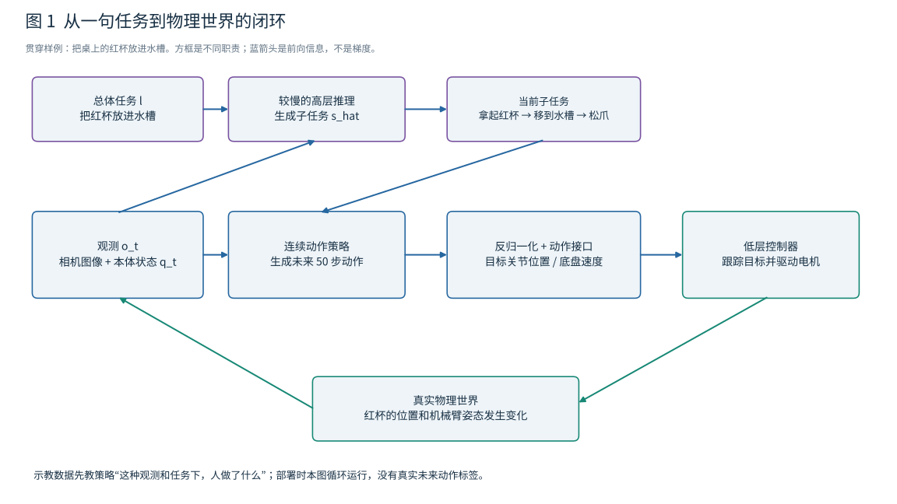
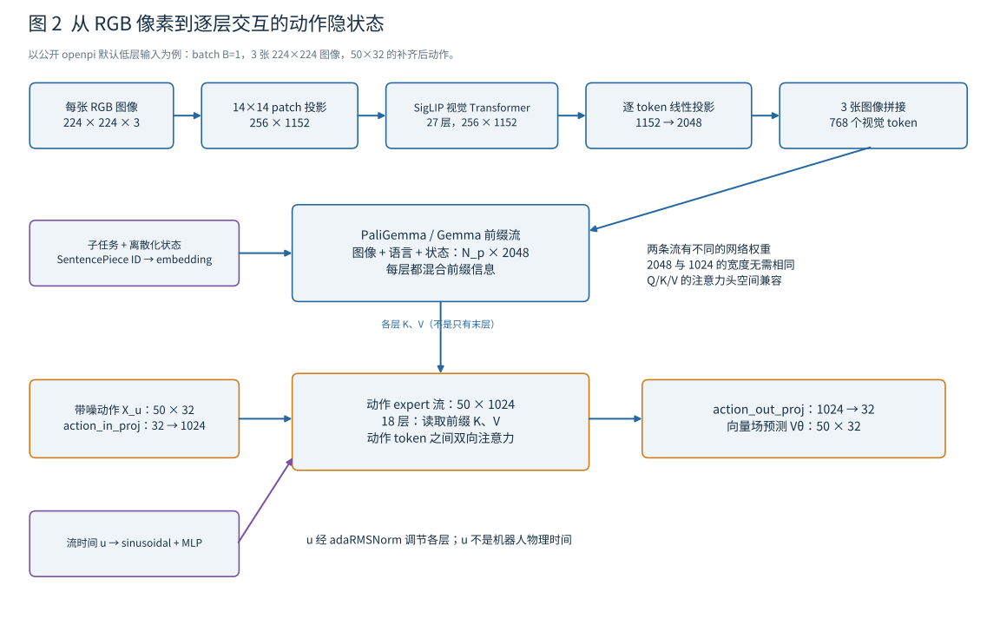
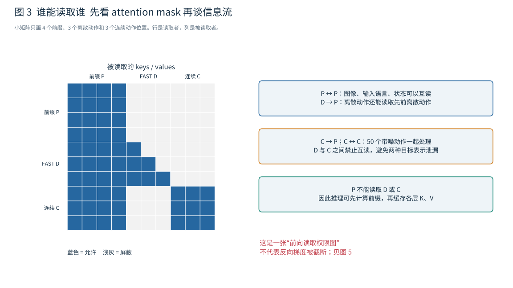
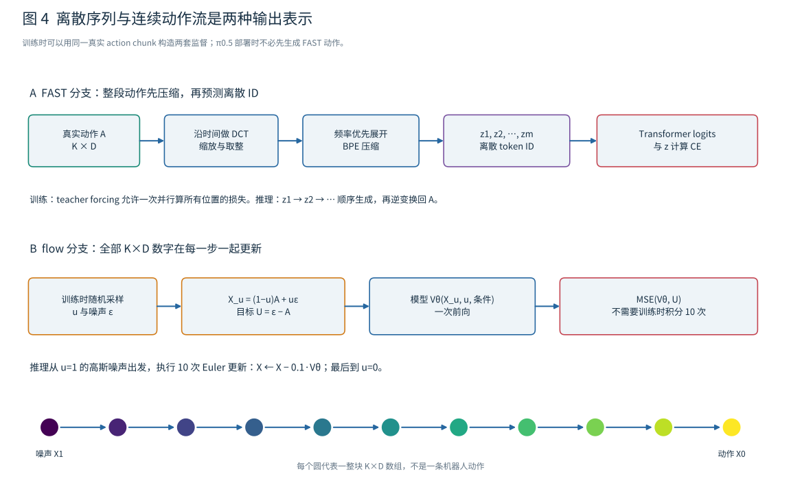
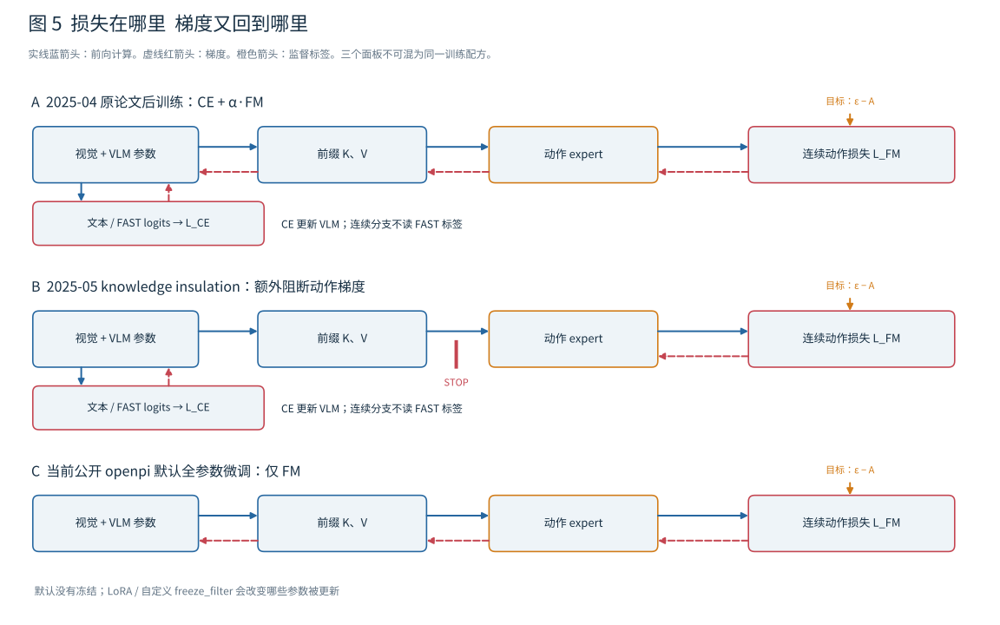
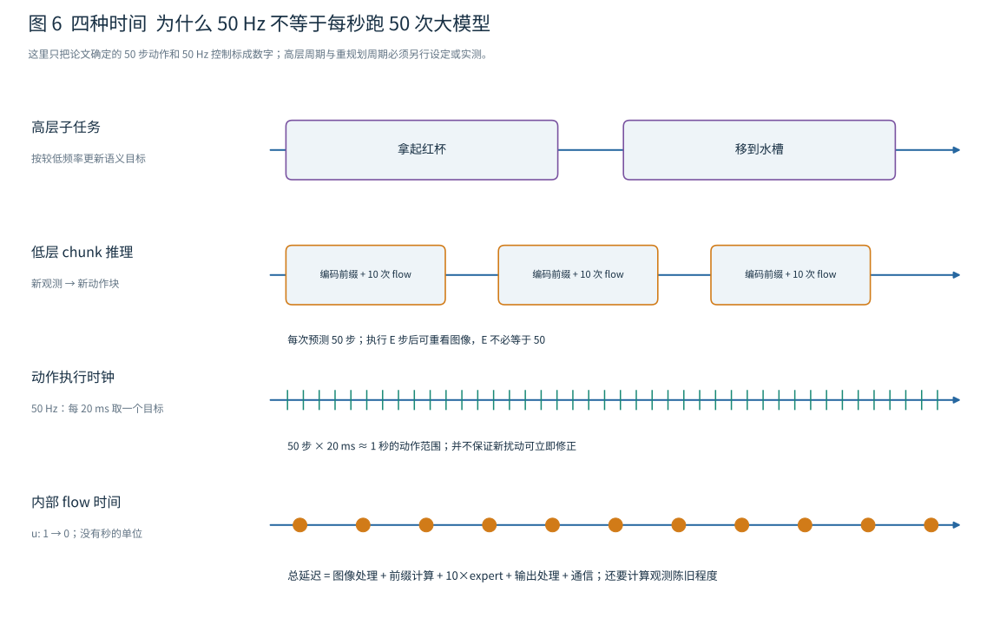

# VLA 从图像和语言到机器人动作的逐步讲义

本文面向学过基础深度学习、物理和运动学，但还没有接触机器人学习的读者。我们不从一串论文名开始，而是跟着一个任务走完全过程：**把桌上的红杯放进水槽**。先弄清机器人真正接收和输出什么，再拆开图像、语言、隐状态、动作、训练标签、损失和梯度，最后回到部署时的时间安排。

核心例子是 Physical Intelligence 的 π0.5。本文把三件事分开：2025 年 4 月原论文的完整训练与高低层推理设计、后来发布模型的说明、以及公开 openpi 代码实际实现的微调路径。它们相关，但并不完全相同。正文以原论文讲思想，以固定版本代码解释张量；差异集中在最后核查，不要求初学者一开始记住版本细节。[1][2]

读完应能回答四个具体问题：一张图片怎样变成动作相关的表示；一句任务怎样改变这些表示；模型究竟在什么位置接受监督；为什么输出 50 个动作不等于每秒把大模型运行 50 次。

## 一 先确定 V L A 各自是什么

**V 是 Vision，视觉。** 它通常来自机器人身上的相机。RGB 图像的每个像素有红、绿、蓝三个通道，模型看到的是数值数组。红杯在图像里并不是一个预先给定的“杯子变量”，而是许多像素组成的区域。视觉编码器要从这些像素提取可供后续计算使用的特征。

**L 是 Language，语言。** 用户的任务是文字，例如“把红杯放进水槽”。模型还可能生成文字，例如“拿起红杯”，用作下一阶段的子任务。语言既可以是条件输入，也可以是受监督的输出。只有前一种用途的 VLA，并不一定具备对话能力。

**A 是 Action，动作。** 在这里，它不是“拿起杯子”这几个汉字，而是机器人接口能够执行的数值命令。例如某个关节的目标角度、夹爪的目标开度、底盘的目标速度。动作空间是这些命令允许取值的集合。动作的含义、单位、坐标系和发送频率都必须预先约定。

**VLM 是 Vision Language Model，视觉语言模型。** 它已经学会把图像和语言放进同一套预测系统，例如看图回答“哪一个杯子是红色的”。很多当代 VLA，包括本文的 π0.5 路线，会借用这类预训练能力，再用机器人示教教它怎样输出控制量。π0.5 使用的 PaliGemma 就是这种预训练 VLM；SigLIP 是其中承担视觉编码的网络，Gemma 是承担多模态序列处理的语言 Transformer 主干。[1][3][4]

这里的“主干”指承担主要表示计算的网络；“头”通常指把表示变成某种输出的小模块。不过 π0.5 的 action expert 不是只有最后一层线性映射。它本身是一条多层 Transformer 计算流，后面会仔细展开。

### 1.1 策略 控制器 机器人不是同一个东西

在机器学习里，**策略 policy** 是一个从观察和目标到动作分布的函数。记模型参数为 θ，πθ 表示由这些参数确定的策略。相同图片下，“拿红杯”和“拿蓝杯”应当使动作分布不同。

**控制器 controller** 则负责跟踪动作目标。如果策略说“把这个关节移到 0.8 rad”，控制器还要不断比较实际角度与目标角度，并让电机输出适当的力矩。rad 是弧度，属于角度单位。策略输出目标角度，不意味着它直接输出电机电流，也不意味着目标能够瞬间实现。

**本体感知 proprioception** 是机器人对自己状态的测量。例如关节编码器测得的角度、夹爪开度、升降机构的位置。只看相机可能不知道手臂当前究竟弯了多少，所以这些状态常与图像一起输入。

π0.5 原论文中的移动机器人有两条六自由度机械臂、两个夹爪、移动底盘和躯干升降机构。自由度是可独立变化的运动变量数。论文系统的状态和动作空间为 18 或 19 维：两臂共 12 个关节变量，两个夹爪变量，底盘两个平移速度与一个转动速度，再加一个或两个躯干变量。论文以目标位置或姿态以及底盘目标速度控制机器人，下面还有 PD 控制器跟踪目标。[1]

PD 的 P 是比例项，D 是微分项。以一个关节为例，可把它理解为“离目标越远就越用力，同时通过速度反馈减少过冲”。这里无需先学完整控制理论；只要记住，**网络输出与真实运动之间仍有动力学、控制器和物理世界**。

**读图 1。** 从左上角开始，总任务经过高层推理变成当前子任务。中间一行才是数值动作生成：当前图像和状态，加上当前子任务，产生一个短动作序列；它经过单位还原和机器人接口交给控制器。底部的物理世界改变后，相机与编码器提供下一次观测。箭头返回输入，才构成反馈闭环。图中的“拿起、移动、松爪”是帮助理解的例子，不表示模型必然一次性生成并严格执行固定的三步计划。

## 二 先拿到一条真正的训练样本

### 2.1 四样东西比模型名字更重要

设 t 是机器人数据中的时间步索引，不是秒数。一次观测记作 o_t，其中包括若干张图像 I_t 和状态向量 q_t。向量是按固定顺序排列的数字；张量则是更一般的多维数组。

我们的红杯示教中，一条样本至少要能对应上：

1. 当前时刻的图像，例如前向相机和两只手腕相机拍到的场景
2. 当前状态 q_t，例如左右臂关节角度、夹爪开度和底盘状态
3. 当前任务文字，低层样本可能是“拿起红杯”
4. 示教者接下来实际给出的动作序列，例如未来 50 个控制时刻的目标值

这些未来动作是训练标签，不是模型在部署时能偷偷读取的未来信息。示教通常来自人遥操作机器人时记录的数据。用示教学习策略称为**模仿学习**；让策略模仿“给定当前条件时，示教者选择了什么动作”是行为克隆的基本想法。[1]

### 2.2 action chunk 是一个短动作表

把单步动作写成 a_t，它有 d 个实际控制分量。把连续 K 步放在一起，得到动作块：

A_t = [a_t, a_(t+1), …, a_(t+K−1)]，形状为 K × d

这里 K 是动作步数，d 是每步动作的实际维数。π0.5 原论文预测 50 步动作，因此本文统一用 K=50。论文写 a_(t:t+H) 且两端都计入，所以其 H=49；这与代码中 action_horizon=50 并不矛盾，只是记号计数方式不同。[1][5]

如果一次控制间隔为 20 ms，ms 是毫秒，那么 50 个目标大致覆盖 1 秒的控制范围。它们不是 50 个独立语言决策，而是一小段协调运动。比如前面几个目标让夹爪靠近杯子，中间逐渐闭合，后面开始抬起。能否把这一切塞进同一秒，取决于实际示教和任务，此处只是动作序列含义的例子。

### 2.3 物理量为何要归一化

不同分量原本可能使用不同单位：关节角用 rad，线速度用 m/s，角速度用 rad/s，升降位置用 m；夹爪字段究竟用距离还是经过转换的标量，要查机器人数据适配器，不能凭字段名猜测。

若直接把这些数放在同一个均方误差里，数值范围大的分量可能压过范围小的分量。归一化的目的，是使不同分量的数值尺度更可比较。π0.5 原论文对各数据集的各动作维度，使用训练数据的第 1 和第 99 百分位进行尺度变换，把这两个参考值映射到 −1 和 1。[1]

设某维原始动作是 a，下、上参考分位数是 p01 和 p99，则说明这种变换的公式是：

ã = 2(a − p01)/(p99 − p01) − 1

ã 是归一化后的无量纲数。极端异常值是否裁剪，还要看具体实现；“分位数映射到 [−1,1]”并不自动保证所有样本都落在区间内。推理后也要使用对应统计量做逆变换，才能回到有物理意义的命令。不能拿另一个机器人的统计量随便替换。

跨机器人训练还需要统一张量大小。公开 openpi 的基础配置用 D=32 个模型动作通道，不足的维度做零填充。因此 d=18 的机器人可以对应 K×32 的模型输入输出，但这不意味着它有 32 个真实自由度。本文用 d 表示实际动作维数，用 D 表示模型内部补齐后的维数。[5][6]

## 三 一张图片怎样变成视觉 token

现在先暂停动作生成，只追踪红杯图像。**token 在这里表示序列中的一个处理单元，不一定是文字，更不一定是离散词典编号。** 语言 token 通常先是整数 ID；视觉 token 通常是连续向量。把二者都叫 token，是因为 Transformer 可以把它们安排成一个序列来处理。

### 3.1 输入数组和 patch

以本文核读的 openpi 默认图像处理为例，单张图像变为 224×224×3。三个轴分别是图像高度、宽度和 RGB 通道数。实际输入还带一个 batch 轴 B，B 表示一次并行处理的样本数；单机器人单次推理可以取 B=1，因此完整形状为 1×224×224×3。[5][6]

图像被划分为 14×14 像素的小块，称为 patch。224/14=16，因此横向 16 块、纵向 16 块，总共 256 块。一个 patch 包含 14×14×3=588 个像素通道数值。

可以把最初的 patch embedding 理解成对每个 588 维小块做一次共享线性变换，映射成 1152 维向量。代码没有先写一个显式“切块再展平”函数，而是用卷积核大小 14、步长 14 的卷积完成等价的 patch 提取与投影。输出从 1×16×16×1152 改排为 1×256×1152。[3]

1152 不代表 1152 类物体，它是网络为每个位置保留的特征宽度。哪些方向描述颜色、边缘、材质或其他组合，由训练决定；不能把某一维直接宣布成“杯子特征”。

### 3.2 为什么 patch 投影后还要视觉 Transformer

最初每个小块只来自局部像素。如果红杯跨越多个 patch，或者手柄在杯体旁边，单个小块可能看不出完整物体。因此先加入位置信息，再经过 SigLIP 的视觉 Transformer，让各个 patch 交换信息。

在此 openpi 实现中，SigLIP 使用 So400m/14 变体，特征宽度 1152、27 个视觉 Transformer 层。每层的注意力与前馈网络都更新 patch 表示。经过这一过程，某个位置的 token 不再只包含原来 14×14 的像素信息，它可以通过注意力整合其他区域的上下文。[3]

这也解释了两个容易混淆的词：**patch 是输入的局部图像块；经过视觉网络后的视觉 token，是与位置对应但已带上下文的向量。** 不能把它想成始终互不相干的小图片。

### 3.3 从视觉宽度投影到 VLM 宽度

Gemma 主干的隐藏宽度是 2048，而视觉网络输出宽度是 1152。需要一个可学习的线性投影，把每个视觉 token 从 1152 维变为 2048 维，形状由 1×256×1152 变为 1×256×2048。

在核读代码里，这个投影不是另一个名字很醒目的独立 connector 文件，而是 SigLIP 模块的 head：创建视觉模块时把 num_classes 设为语言主干宽度 2048，并设置 pool_type="none"。这里的参数名 num_classes 不意味着正在做 2048 类图像分类；这次调用实际上保留所有 patch 位置，并把每个位置投影成 VLM 需要的宽度。[3][5]

如果低层用三张相机图像，每张产生 256 个视觉 token，按序拼接后就是 768 个视觉 token，每个宽度 2048。这些视角共同帮助模型理解杯子与两只手的相对关系，但模型没有因此自动得到一个显式、经过标定的三维网格。本文讲的是从图像直接学习动作的路线，不默认中间一定有目标检测器、深度图或逆运动学求解器。

**读图 2。** 顶行是每张图片都要走的视觉路径。左中是语言和状态编码。两者在中央的 VLM 前缀流相遇。左下的带噪动作走另一套输入投影和 Transformer 权重；它通过各层注意力读取上方前缀信息，最后得到的是向量场，而不是立刻可以发给电机的动作。带噪动作和向量场的含义在第六节解释。图中已省略 B=1 的 batch 轴，且数字对应公开基础配置，不是所有 VLA 的统一规格。

## 四 语言和机器人状态怎样进入同一序列

### 4.1 从句子到整数 再到向量

“拿起红杯”先经过 tokenizer，即分词器。它把文字切分为词、子词或其他文本片段，再映射成整数 ID。一个汉字或一个单词不保证只占一个 token。PaliGemma 使用的 SentencePiece 分词器会按其词表和规则决定切分。[7]

整数 ID 本身没有可用的连续几何关系。网络用 embedding 矩阵查表，把每个 ID 变为 2048 维连续向量。例如有 M 个有效文本 token，得到 M×2048 的数组。embedding 矩阵是可学习参数；“查表”只是取出被选中的行，不意味着这些向量永远不更新。

图像 token 已投影到同一宽度，所以可与文本向量沿着序列轴拼接。若使用三张图像和 M 个文本 token，前缀有效长度是 N_p=768+M。N_p 表示输入前缀的有效位置数。实现可能把文本补齐到 200 个位置，补齐位置由 mask 屏蔽；不能把占位 padding 当成真实文字。[5][7]

### 4.2 π0.5 的状态输入与 π0 有一处重要差别

π0.5 原论文把本体状态编码进文本前缀。公开基础配置的做法是：状态先经过数据处理与归一化，然后各维离散化到 256 个区间，区间编号转为数字字符串，再与任务文本一起分词。例如结构类似“Task: 拿起红杯, State: 123 87 …; Action:”。[1][7]

这里的数字字符串仍由文本 tokenizer 切分，所以一个状态分量不一定恰好对应一个文本 token。**它不是把关节角当作自然语言含义来理解，而是使用现成的序列通道传递机器人的当前配置。**

π0 的公开实现则给连续状态一个单独线性投影，作为动作侧的状态 token。π0.5 还改变了流时间的注入方式，后面会看到。于是“π0 和 π0.5 都有状态输入”虽正确，“它们把状态放在完全相同的位置”却不正确。[5]

这些说法描述原论文与公开基础默认配置。实际微调配置可以覆盖状态输入选项，例如库中某些基准配置关闭离散状态输入；读实现必须同时读模型和所选配置，不能只读类名。[6]

## 五 图像与语言如何交互 隐状态究竟是什么

### 5.1 拼接只是排座位 注意力才交换信息

设某一层的输入表示为 X，每一行对应一个 token。经过线性映射可得到 Q、K、V：分别是 query 查询、key 键和值 value。注意这里 K 在注意力公式中代表键矩阵，不是前文动作块长度；正文谈动作长度时会写“动作步数 K”。

对某个位置 i，注意力大致执行：

w_ij = softmax_j(Q_i · K_j / √d_h + mask_ij)

h_i = Σ_j w_ij V_j

d_h 是一个注意力头的向量宽度；w_ij 是位置 i 从位置 j 读取信息的权重；mask_ij 把不允许读取的位置屏蔽掉。softmax 在允许的 j 上把分数变成总和为 1 的权重。随后还有输出投影、残差连接、归一化与前馈网络，不是只算这两行就结束。

红杯例子里，与“红杯”有关的语言表示可以从视觉位置中聚合相关信息；视觉位置的表示也可在后续层中受到任务上下文影响。训练会使有助于正确动作的关联更容易被利用。不过单张注意力图不能直接证明模型“理解了红色”，也不能把所有动作因果关系归结成一个注意力权重。

**隐状态 hidden state** 就是网络某一层更新后的内部向量集合。它不是一个额外训练出的神秘变量，也不等于机器人真实物理状态 q_t。隐状态承载的是网络处理输入后形成的中间表示；q_t 是传感器测得的实际状态。

### 5.2 在 π0.5 里 前缀并非普通聊天模型那样全因果

图像、输入任务文字和状态构成 prefix，即前缀。这部分使用双向注意力：同一前缀中有效 token 可以互相读取。生成的文本则要遵守自回归约束，当前位置不能读取尚未生成的未来输出。

自回归就是把联合输出概率分解成“第一个输出的概率，乘以给定第一个输出后第二个输出的概率，依次继续”。它是输出依赖结构，不等于训练时必须逐个 token 运行完整模型。

论文还同时考虑离散 FAST 动作 token 和连续动作 expert token。这两个动作表示都能读条件前缀，但**不能互相读取**。否则连续分支可能从离散的真实动作标签中直接抄答案；离散分支也可能利用带噪真实动作泄漏的未来信息，导致训练与推理条件不一致。[1]

**读图 3。** 每一行回答“这个 token 可以看哪些列”。左上全蓝表示前缀内部双向读取；中间的三角形表示离散输出只能看自身输入位置之前已经提供的输出历史；右下全蓝表示一个动作块中的连续 token 可以同时互看。右上和另外两个跨动作表示的区域为空，是信息隔离。具体自回归实现还通过输入标签错位避免当前位置直接读到自己要预测的下一 token。

### 5.3 动作 expert 不是最终隐状态后面随手接个 MLP

公开配置的 VLM 主干宽度为 2048，动作 expert 宽度为 1024，两条流各有 18 个 Transformer 层。动作 expert 使用单独的查询、键、值投影和前馈权重，但注意力投影的头空间兼容，因此它可以读取 VLM 前缀各层的键和值。[4][5]

这不是“先把整个图像和句子压成一个向量，再把这个向量交给两层 MLP”。更准确的理解是：**前缀流提供一组带位置和内容的信息，动作流在多层计算中反复查询它。** 每个动作位置也读取同一块中的其他动作位置，协调未来轨迹。

expert 一词在这里表示面向动作 token 的专门参数，不要自动联想到根据每个 token 内容动态选择专家的稀疏 MoE 路由器。本文核读的是按输入模态划分权重的设计。

## 六 连续动作分支到底在预测什么

### 6.1 为何不直接回归唯一动作

相同场景可能存在多种合理做法。拿杯子可以先稍向左绕，也可以稍向右绕。若直接用均方误差拟合全部真实动作，某些情况下模型可能倾向输出多个方案的平均值，而平均轨迹未必可执行。

生成式动作模型尝试表示一个有多种可能性的条件分布。扩散模型和流匹配模型都能从简单噪声出发，逐步生成结构化连续结果。**π0.5 明确采用 flow matching，流匹配；不能只因为论文也使用“denoising”一词，就把它的训练目标写成任意一种扩散模型的噪声预测目标。**[1][5]

### 6.2 用一套自洽符号理解 flow matching

下面使用与公开 openpi 代码一致的方向，避免物理时间与生成时间混在一起：

- A 是归一化后的真实动作块，形状 K×D；默认例子为 50×32
- ε 是相同形状的独立标准高斯噪声，均值 0、方差 1
- u 是从 0 到 1 的无量纲流时间；u=0 对应真实动作，u=1 对应纯噪声
- X_u 是中间带噪动作块，定义为 X_u=(1−u)A+uε
- U=ε−A 是这条直线路径沿 u 增大方向的目标向量场
- Vθ(X_u,u,c) 是模型预测的向量场；c 统称图像、任务和状态这些条件

注意 U 的每个数字是“归一化动作对无量纲流时间的变化率”。它不是机械臂在物理世界中的速度，更不是底盘速度字段本身。A 中可以混合关节位置目标和底盘速度目标；U 只是生成空间中的数学量。

训练让 Vθ 接近 U，部署则从 u=1 向 u=0 反向积分。论文使用的 τ 记号从数据/噪声的另一端描述插值，本文不混用两套时间方向。判断公式是否正确，必须把插值式、目标场、积分起点和步长符号四件事一起检查。[1][5]

### 6.3 一个数字就能检查方向

假设暂时只有一个动作数字，真实归一化目标 A=0.6，抽到 ε=−0.4。若 u=0.75，则：

X_u=0.25×0.6+0.75×(−0.4)=−0.15

目标 U=−0.4−0.6=−1.0。如果流时间向下走 0.1，理想 Euler 更新为 X_new=X_old−0.1×U，因此 −0.15 变成 −0.05，正在向真实目标 0.6 靠近。Euler 是最简单的数值积分方法：用当前位置预测的变化率乘以一小段步长，近似更新状态。

真实模型一次处理的是整个 50×32 数组，所以一次 Euler 更新同时改变全部动作步和全部模型动作维度，并非这一步只更新一个关节、下一步才更新另一个。

### 6.4 带噪动作如何进入动作 expert

输入 X_u 的每一行是一个完整动作向量。action_in_proj 把每行从 D=32 映射到 1024 维，因此得到 50×1024 个数，按 50 个动作 token 排列。**这里是 50 个 token，每个带 32 维动作信息；不是 50×32=1600 个离散动作词。**[5]

u 经过正弦余弦编码和一个 MLP，成为时间条件向量。π0.5 用这个向量调节动作 expert 各层的 adaptive RMSNorm，简称 adaRMSNorm。普通 RMSNorm 按均方根对激活做尺度归一化；adaptive 表示缩放、偏移或门控会随时间条件变化。直观上，它告诉网络“当前还是很乱的噪声阶段，还是已经接近可执行动作”，使同一组参数能处理不同噪声程度。[4][5]

π0 的实现把动作特征与流时间特征先合并后送进动作侧；π0.5 把时间作为各层调节条件。这是具体架构变化，不是“0.5 只是更大数据的同一个类名”。

经过动作 expert 后，action_out_proj 再把每个 1024 维隐状态映射回 32 维，形成 50×32 的 Vθ。最后这个线性层输出的是流向量场；只有完成从噪声到动作的积分、反归一化和接口变换后，才得到控制器需要的命令。

### 6.5 训练一次前向与推理十次积分要分开

训练时抽取真实 A、随机 ε 和随机 u，就能直接构造 X_u 与目标 U。一次前向得到 Vθ，一次均方误差计算就得到学习信号。默认代码的 u 来自经过缩放的 Beta(1.5,1) 采样，偏向较噪的部分；它不是永远固定为 0.5。[5]

部署时没有真实 A，也没有 U，不能再按上面的训练式“算答案”。必须从一块高斯噪声 X_1 开始，反复调用模型预测 Vθ。论文与公开默认采样器使用 10 次更新，每次步长为 −0.1，直到 u 接近 0，得到生成动作块。[1][5]

因此，“使用 10 步流匹配”说的是一次推理的数值求解过程，不是模型训练时只看 10 个样本，也不是机器人执行 10 个动作。

## 七 离散动作 token 和 FAST 在哪里

### 7.1 最容易想出的办法是逐数字分桶

仍用一个标量动作举例，把归一化范围分成 256 个区间，把每个区间分配一个整数 ID。模型预测 ID 后，再把它还原为该区间代表的数值。这是动作离散化的一种方法。

RT-2 使用把动作编码成离散符号并进行自回归预测的路线。这对连接语言模型很自然，但不能据此断言所有 VLA、或 π0.5 的最终连续分支，都在逐个输出这样的数字桶。[8]

若对 50 步、32 维动作逐数字分桶，就需要 1600 个位置。相邻时刻的动作往往非常相似，容易产生又长又冗余的序列。这里的 1600 是帮助比较的算术例子，不是 π0.5 实际 FAST 输出长度。

### 7.2 FAST 先压缩整段动作的时间结构

FAST 是 Frequency-space Action Sequence Tokenization，频域动作序列分词。它先对每一维动作的时间序列做离散余弦变换 DCT。DCT 把随时间变化的信号表示成不同频率的余弦成分：低频描述缓慢的整体变化，高频描述更快速的变化。[9]

接着把系数缩放并取整，按低频优先、跨动作维度交错的顺序展开，再用 BPE 压缩成离散 token。BPE 是字节对编码，这里可以把它理解成将频繁共同出现的符号序列合并为一个编号的方法。取整会造成有损压缩；BPE 对已经得到的整数序列本身做无损合并。

这些 token 代表的是压缩后的整段动作结构，**一个 FAST token 不必等于“第 7 时刻的肩关节角度”**。推理生成完整 token 序列后，需要逆 BPE、还原系数、逆 DCT，才得到原时间轴上的动作块。[9]

### 7.3 自回归训练为什么可以并行 推理却通常不能

设压缩后的动作序列为 z1…zM，这里的 M 是离散动作 token 数，随序列内容和压缩结果变化，不等于动作步数 K。自回归模型学习：

p(z1…zM | c)=∏_j p(zj | c,z1…z(j−1))

训练数据已经给出全部正确 z。使用 teacher forcing，即把真实的前面 token 作为条件，再用因果 mask 防止偷看后面 token，就能在一次大前向中计算多个位置的预测误差。公开 π0-FAST 的代码把目标向后错开一位，并只在输出位置计算交叉熵。[7][10]

推理时还不知道 z1，所以必须先预测 z1，再把生成的 z1 加回输入预测 z2。KV cache 能减少重复计算，但不会自动消除这种序列依赖。FAST 压缩减少了需要逐个生成的 token 数，并不把标准自回归解码变成一次输出全部动作的网络。

**读图 4。** 上半部是离散表示：真实动作先变成 token 标签，然后在 token 预测位置计算 CE。下半部是连续表示：真实动作与噪声混合，再监督向量场。最底部的 11 个圆是从 u=1 到 u=0 的 10 个数值更新间隔，每个圆都是一整块动作数组。两条路共享“学习机器人行为”的目标，却有不同的标签形式、输出层和推理过程。

### 7.4 π0.5 如何同时利用两条路线

原论文的预训练阶段只有离散 token 监督，其中动作标签经过 FAST 编码。后训练才加入随机初始化的连续动作 expert，并联合保留离散预测目标。这样，大规模预训练先让 VLM 学习机器人相关表示，后训练再让动作 expert 利用这些表示生成连续动作。[1]

最终部署时，文字子任务使用自回归解码，低层动作使用连续 flow 采样。**不需要先生成一套 FAST 动作，再把它逐个翻译成连续动作；连续分支也不读取另一分支的 FAST 输出。** FAST 的重要作用可以发生在训练期，而不成为最终动作推理的必经步骤。

## 八 任务 标签和损失分别从哪里来

“任务传进网络”和“损失反传到网络”是两件相反方向的事。任务文字是前向条件；标签用来比较输出；损失是比较结果的数值；梯度才告诉优化器如何改参数。不能说“把抓杯子的 loss 传给大模型，大模型就知道要抓杯子”，而跳过真实监督是怎样构造的。

### 8.1 同一个模型可以面对不同种类的训练样本

先看三种最直接的样本。

**机器人动作样本。** 输入是图像、状态和任务或子任务。标签来自示教的未来动作块。预训练阶段将它转成 FAST token；后训练阶段还把同一动作块用于构造流匹配监督。

**高层子任务样本。** 输入是当前图像、相关状态和总体任务，标签是人标注的下一步语义子任务。例如图片中杯子还在桌面，正确标签是“拿起红杯”；杯子已被抓住且手在水槽附近，标签可能改成“把杯子放进水槽”。论文还使用与任务相关的目标框预测，以及标有子任务和动作的混合样本。不能只凭一个字符串的格式，就认定它由机器人动作数据自动无误生成。[1]

**普通视觉语言样本。** 输入是一张图和问题，标签可能是回答、描述或位置相关文本。这种样本没有机械臂未来动作，所以不应凭空为它填一份动作 MSE。它通过文字监督帮助模型保持视觉和语言能力。

论文把机器人数据进一步分成移动操作、跨家庭场景的非移动机器人、多种机器人实验室数据；后训练还引入口头指令示教。口头指令示教是人选择适合当前情况的子任务，用语言指导已学会低层动作的机器人，从而提供高层决策标签。它不是仅把音频输入一个自动语音识别模型那么简单。[1]

### 8.2 文本与 FAST 的交叉熵在输出 logits 上计算

logits 是还没有做 softmax 的词表分数。对于一个应当输出 token y 的位置，softmax 把词表分数变成概率 p，交叉熵为 −log p(y)。正确 token 概率越小，惩罚越大。

如果只计算指定输出位置，平均损失可写成：

L_CE = −Σ_j m_j log pθ(y_j | 允许的输入和输出历史) / Σ_j m_j

m_j 是 loss mask：该位置有监督标签时为 1，不计算损失时为 0。这里的 loss mask 与 attention mask 功能不同：前者决定“哪里计分”，后者决定“谁能读取谁”。图像输入位置不一定直接产生一个图像重建损失；它们仍可能通过后面输出的损失得到训练。[1][10]

在“拿起红杯”这个高层标签中，模型不是一次收到一个“子任务正确/错误”标签，而是对构成这句话的各个文本 token 接受监督。FAST 动作也同样在相应词表输出位置计算交叉熵，只不过标签 ID 对应动作压缩符号。

### 8.3 连续损失在 action_out_proj 的结果上计算

流匹配分支输出 Vθ，目标是 U=ε−A。均方误差可以写成：

L_FM = mean_(动作步,动作维) [(Vθ − U)²]

mean 表示求平均。公开 Pi0.compute_loss 先在动作维上求平均，返回每个样本、每个动作步的损失；训练脚本再对 batch 和动作步求平均。网络并不是在每个 Transformer 层都额外计算一份动作标签误差；主要监督在最终输出投影之后，梯度再通过整条计算链传播。[5][11]

注意这里比较的是向量场，不是先完整采样得到一个最终动作块，再与 A 做普通 MSE。带噪输入中确实包含真实 A 的一部分，这是流匹配训练的正常构造；模型部署时从纯噪声起步，依靠训练中覆盖过的不同 u 学会逐步生成。

### 8.4 联合损失不意味着每条样本都有全部标签

原论文后训练可概括为：

L_total = L_CE + α L_FM

α 是相对权重，原论文后训练取 10。这个值依赖具体损失归约尺度，不能把求和改成均值后仍假定两项权重比例不变。实际混合数据要按标签是否存在、输出位置是否有效来启用相应项。对只有看图问答标签的样本，连续动作项没有监督；对带动作的样本，才能构造动作标签。后续 knowledge insulation 论文将这种 token mask 与样本动作 mask 写得更显式。[1][12]

原论文报告离散预训练 280k 次梯度更新、后训练 80k 次更新；k 表示一千，梯度更新次数不是机器人动作步数，也不是小时数。这里提这些数字，是为了明确两阶段到底训练了什么，而不是建议读者照抄训练预算。[1]

## 九 损失怎样影响视觉和语言参数

### 9.1 梯度沿可微依赖反向传播

把前缀表示简写为 P=gθv(图像,文字,状态)，其中 θv 是视觉与 VLM 参数；动作 expert 输出简写为 V=fθa(X_u,u,P)，其中 θa 是动作侧参数。如果没有人为截断，流匹配损失对 θv 的梯度包含这条链：

∂L_FM/∂θv = (∂L_FM/∂V)(∂V/∂P)(∂P/∂θv)

这就是基础深度学习的链式法则。动作 expert 读取了前缀的键和值，动作误差便可能更新产生这些键和值的 VLM 权重，进而更新图像投影与视觉编码器。模型因此有机会学到更有利于抓取的视觉特征，而不只是保持原来的图像问答表示。

但这个训练信号也可能扰动预训练能力。一个刚随机初始化的动作 expert 还不擅长利用语义信息，早期传回的梯度未必有助于保留语言跟随能力。这是后来研究 knowledge insulation 的动机之一。[12]

### 9.2 单向前向注意力不等于单向梯度

图 3 中，VLM 前缀不读动作 token，动作 token 读取 VLM 前缀。这说明**前向内容依赖**由前缀到动作侧，并不意味着梯度被阻断。

用最简单的算式 y=w×x 就能理解：前向只计算 x 到 y，但损失对 x 的导数仍然存在。要阻止反向更新，需要 stop-gradient、detach 或参数冻结等明确机制，不能只看前向箭头方向。

### 9.3 冻结和知识隔离也不同

**冻结某些参数**，意味着优化器不更新这些参数。**stop-gradient** 则是切断一条特定计算路径上的导数，它不一定阻止同一组参数通过别的损失学习。

knowledge insulation 的一个关键做法，是动作 expert 读取前缀 K、V 时，对这条动作支路的 K、V 使用 stop-gradient。这样连续动作损失更新动作 expert，却不通过该支路更新 VLM；VLM 仍由文本与离散动作 CE 训练。它并不是“把整个视觉语言模型永远冻结”。[12]

**读图 5。** 实线蓝色是模型如何算输出，橙色是目标标签进入损失，红色虚线是反向梯度。A 展示原论文联合训练在未额外设置梯度阻断时的可微路径；B 额外切断动作误差到 VLM 的分支，CE 仍更新 VLM；C 是本文核读的公开默认全参数微调路径，只有连续动作损失。B 的 STOP 标记表示动作支路的导数被阻断，不妨碍同一前缀在前向中被使用。**面板 A 是根据公开公式和依赖关系画出的梯度解释，不冒称拿到了作者未公开训练程序的逐行执行记录。**

### 9.4 公开代码能确认怎样的冻结事实

在本文固定的 openpi commit 中，Pi0(pi05=True).compute_loss 计算连续 flow loss；默认 TrainConfig.freeze_filter 是 Nothing，即默认不选择任何参数冻结，训练脚本对选中的 trainable_filter 计算梯度并更新。所核读的 JAX Gemma 注意力实现没有动作分支到前缀的 stop_gradient。[4][5][6][11]

因此，不能把当前默认微调脚本说成完整的“FAST CE 训练 VLM、隔离 flow 训练 expert”实现。README 也明确说公开 π0.5 训练和推理目前只支持 flow matching head。[2]

还有一个代码阅读陷阱：视觉编码器调用里的 train=False 主要控制模块训练态行为，例如 dropout，不等于把视觉参数从自动微分中删除。是否更新参数，要继续检查梯度路径与优化器冻结过滤器。

若启用 LoRA，即通过低秩可训练增量适配权重，冻结集合又会变化。不能把“使用 LoRA”自动翻译为“视觉、语言、动作模块全部冻结，只训练一个头”。应按所选配置的 get_freeze_filter 逐项核对；某些模块可能全量训练，某些只训练增量。[5][6]

## 十 推理时 红杯任务如何真正运行

### 10.1 较慢的高层先回答下一步做什么

用户给总体任务 ℓ：“把红杯放进水槽”。高层观察当前场景，通过文本自回归生成子任务 ŝ，例如“拿起红杯”。ŝ 是本文对子任务文本的记号，不是连续机器人状态。

原论文将高低层分解为：

p(A,ŝ | o,ℓ) = p(ŝ | o,ℓ) × p(A | o,ŝ)

右边第一项决定当前子任务，第二项根据观测与该子任务产生动作。按照这个分解，低层动作条件中使用 ŝ，不再另外依赖总体任务 ℓ。两项由**同一个模型**表示，不是必须先调用一个外部聊天模型，再调用另一套不相干的机器人策略。[1]

高层也不是无限长的内心推理。这里实际说的是可监督、可输出的语义子任务序列。原论文明确高层更新频率低于低层动作推理；高层使用四个相机视角，低层使用前向和两腕三个视角。因此，即使共享模型权重，也不能假定两次调用的视觉前缀完全相同。[1]

### 10.2 较快的低层生成动作块

给定当前的“拿起红杯”和新观测，低层执行：

1. 缩放并编码图像，准备任务与状态 token
2. 运行前缀 Transformer，保存每层的 attention keys 和 values
3. 采样一个 50×32 的初始高斯噪声块
4. 进行 10 次动作 expert 前向与 Euler 更新，每次读取缓存的前缀 K、V
5. 得到归一化动作块，反归一化并转换回机器人实际动作接口
6. 调度器逐步把目标交给控制器，之后再获取新观测并重规划

KV cache 就是第 2 步保存的键和值。由于前缀不能读取动作 token，在同一次动作块生成期间，它不随 X_u 的更新而改变。因此第 4 步不必每次重新运行图像编码器和整套前缀网络，只需更新较小的动作侧。[5]

缓存有效的前提是条件没有变。若换了图像、状态或子任务，就不能毫无检查地继续使用旧前缀缓存。π0.5 “慢高层、快低层”的安排，与“一次 flow 采样内部缓存前缀”是两个不同层次的加速机制。

### 10.3 开环动作块与整体闭环可以同时成立

设一次预测 50 步，但系统只执行其中 E 步就重新观察。E 是实际执行的步数，可以小于或等于 50。新的动作块基于新观测生成，整个系统是闭环的；不过在执行这 E 步的过程中，目标可能来自同一次旧预测，所以这一小段相对于新视觉信息是开环的。

红杯如果在中途被推走，控制器仍可能很好地跟踪原来的关节目标，但原目标已经不适合新环境。这是“底层关节跟踪准确”与“任务动作仍然正确”的区别。缩短 E 可能改善响应性，却要求更快推理与更好的衔接；不能只看输出轨迹是否平滑。

公开 action_chunk_broker 是一个简单例子：它缓存策略给出的动作块，一次返回一个动作，达到配置的执行步数后再调用策略。它并不自动实现全部异步重规划、延迟补偿或碰撞保护。[13]

### 10.4 要分清四种时间

**读图 6。** 第一行是语义子任务变化；第二行是何时重新运行低层模型；第三行是控制器何时取出一个动作目标；最后一行是一次模型生成内部的数学流时间。它们不是同一个时钟。图中横向间隔只表示层次关系，不是原论文未公开调度参数的精确比例。

50 Hz 意味着每秒发送或执行 50 个控制目标，周期是 20 ms。它不表示一次完整的 VLM+flow 推理必须在 20 ms 内完成，因为一次模型调用可以生成多个未来控制目标。

一次动作块推理的端到端时间可概括为：

T_chunk = T_image + T_prefix + 10×T_expert + T_output + T_communication

各个 T 的单位都是秒或毫秒，必须统一。T_image 是图像预处理和编码耗时；T_prefix 是前缀网络耗时；T_expert 是一次动作侧更新耗时；T_output 包括结果转换；T_communication 是传输耗时。高层生成文字若在该次流程中发生，还要另外加上对应开销。

只有当计算和传输来得及提供后续目标，且动作起点与实际状态衔接合理，系统才可持续运行。即使平均推理时间不超过动作块覆盖范围，抖动、排队和观测陈旧仍可能导致问题。因此应同时测模型计算时间、端到端延迟和“第一条动作开始执行时，观测已经旧了多久”。

### 10.5 哪些延迟数字可以引用 哪些不能

π0 原论文曾在 RTX 4090、三相机配置下报告：图像编码 14 ms，观测前缀 32 ms，10 次动作前向合计 27 ms，总机载推理 73 ms；离机时另有网络延迟。这些是 **π0 的特定测量**，不能改写成“π0.5 延迟就是 73 ms”。同一附录还给出其具体动作执行与重规划设置，它们同样不能直接移植为 π0.5 的事实。[14]

π0.5 原论文可以确认的是高层更低频、低层 flow 使用 10 步、动作块 50 步、系统控制 50 Hz。本文没有从原文确认一套可通用引用的 π0.5 高层周期、低层重规划周期和端到端毫秒分解，所以不填造这些数字。[1]

公开 policy.py 返回 infer_ms，但代码计时区间不包括全部输入变换、通信和输出变换；JAX 路径还需要注意异步执行与同步位置。实测基准应先预热编译，明确同步与计时边界，再报告分位延迟，而不是拿第一次调用或单一字段直接当端到端实时性能。[15]

## 十一 重新走一遍红杯样本 看哪些东西在训练与部署时不同

假设训练样本的图像中，夹爪位于红杯左上方，真实示教下一秒向杯子移动并开始闭合。

**训练时**，数据管线提供这一时刻的图像、状态、任务和真实动作 A。图像变成视觉 token，文字与离散状态变成文本 token。若这次是离散监督样本，A 经 FAST 变成目标 token，模型使用 teacher forcing 接受 CE 监督。若这次启用了连续监督，还会随机采样 ε 和 u，构造 X_u 与 U，让动作 expert 接受 MSE 监督。最后优化器根据允许的梯度路径更新参数。

高层训练样本则可能给出总体目标和当前场景，以“拿起红杯”为文字标签。不同样本共享参数，使模型逐渐学会“看到怎样的情形时，需要哪个子任务”，以及“这个子任务下，动作应当怎样”。这叫多任务或混合数据训练，不表示每张网络图片都附带了机器人动作。

**部署时**，只有现在的图像、状态和用户指令。模型必须自己生成当前子任务，也必须从随机噪声生成动作。没有真实未来 A，没有目标 U，也没有拿正确答案算 loss 的步骤。网络权重通常固定，不会因为杯子没抓住就自动进行一次反向传播。

机器人执行后，杯子可能被挡住、滑落或仍留在原位。下一次观测给策略一个修正机会，但能否恢复取决于训练覆盖、状态可见性和决策能力。VLA 的输出形状正确、离线损失较低，都不等于长任务必定成功。

## 十二 不要把几条 VLA 路线拼成不存在的统一模型

下面只比较理解主流程所必需的差别。

- **RT-2**：代表将机器人动作编码进离散 token 预测、复用视觉语言模型训练形式的路线。不能把它直接描述成本文的 300M flow action expert。[8]
- **π0**：从预训练 VLM 接入连续动作 expert，以 flow matching 生成动作块；公开实现中的状态和流时间输入方式与 π0.5 有明确不同。[5][14]
- **FAST**：首先是一种动作序列分词方法，不是所有 VLA 都必须经过的一层网络。π0-FAST 是采用这种离散动作表示的自回归策略；训练快与推理快不是同一个结论。[9][10]
- **π0.5 原论文**：离散预训练、联合连续后训练、多来源任务监督，以及同一模型的高低层推理共同组成方法。仅把 π0 的动作 expert 换个名字，并没有覆盖它的训练设计。[1]
- **knowledge insulation 后续方法**：进一步研究连续动作梯度对 VLM 的影响，并明确提出动作支路的梯度隔离。它与冻结整个 VLM不同，也不能无条件倒推为 2025 年 4 月原论文已经写明的实现。[12]

因此，看到一篇新 VLA 论文时，先问它到底采用哪种动作表示、在哪些输出位置计算何种监督、推理时实际保留哪些分支，再讨论“端到端”“快慢系统”或“统一多模态”。这些大词本身不能替代计算图。

## 十三 如何检验自己真的读懂了

### 13.1 六个检查问题

1. **为什么 224×224、patch 14 的图像产生 256 个视觉位置？** 因为每边 16 块，共 16×16；1152 或 2048 是每个位置的特征宽度，不是位置数量。
2. **为什么连续动作是 50 个 token 而不是 1600 个 token？** 因为每个连续 token 先接收一个完整的 32 维动作向量，再投影到 expert 宽度。逐数字离散化才可能产生另一种序列长度。
3. **为什么动作 loss 可以改视觉编码器？** 因为动作输出依赖前缀特征，前缀依赖视觉特征；只要梯度路径可微且没有冻结或截断，链式法则就能把误差传回去。
4. **为什么双向连续动作注意力不算偷看未来？** 部署时这些位置里是同时生成的带噪变量，不是已知的真实未来动作；真正要防的是训练时从另一种真实目标表示抄答案。
5. **为什么 FAST 训练可并行却仍可能推理慢？** 训练时已知真实输出历史，可以同时算多个位置的损失；推理时输出历史必须逐个生成。
6. **为什么高层做对了仍会抓取失败？** “拿红杯”的语义判断正确，不保证像素定位、动作分布、实际机器人接口、控制跟踪和接触动力学都正确。

### 13.2 真正上机器人前最该检查什么

先检查动作字段顺序、单位、绝对目标还是增量、坐标约定、归一化统计量、相机顺序与时间戳，再谈调大模型。把“绝对关节角 0.8 rad”误当成“再增加 0.8 rad”，即使离线模型很好也可能造成危险运动。

评估也要分开：高层是否选择正确子任务、低层是否拿对对象、是否成功搬运、整个任务是否完成、耗时多少、是否需要人工干预。长任务中的部分进度分数不能直接改名为完整成功率。

π0.5 原论文的实验机器人使用简单 PD 跟踪，没有额外轨迹规划或碰撞检测；这是作者实验系统的说明，不是建议实际部署时撤掉保护。其方法仍存在部分可观测、任务反复和未见环境失败等限制。本文的流程教学与源代码核读不构成安全认证，也没有进行真实机器人复现。[1]

## 十四 本文核查了什么 还有哪些边界

**论文版本。** 主文核读 π0.5 的 arXiv:2504.16054v1，提交于 2025-04-22；阅读了方法、训练、机器人系统、实验与附录 A-E，并下载 PDF 核查架构页。必要背景核读 π0 v1、FAST v1、RT-2 v1，以及 2025-05-29 的 Knowledge Insulating v1。本文没有以二手博客补齐未公开的训练细节。

**实现版本。** openpi 固定为 commit 215abfb217dbac7d5f1273282331b9b1866c0479，commit 日期 2026-08-24，读取日期 2026-10-02。重点静态核读 JAX 实现的 pi0.py、pi0_config.py、gemma.py、siglip.py、tokenizer.py、pi0_fast.py、training/config.py、transforms.py、scripts/train.py、policy.py 和 action_chunk_broker.py。没有下载并运行完整权重，没有训练或实机测时，不能称为复现。

**原论文与发布版本的关系。** 原论文描述先离散预训练、后联合后训练；后续 knowledge insulation 论文明确分析并扩展这一思路。当前仓库 README 称发布的 π0.5 使用 knowledge insulation，同时明确仓库只开放 flow head 的训练和推理支持。本文把“checkpoint 曾怎样训练”与“你现在运行开源微调脚本时怎样反传”分开说明。[1][2][12]

**一个已核实但未擅自解释的不一致。** π0.5 原论文 PDF 第 19 页附录 A-E 清楚写 num_heads=18；固定 commit 的 gemma.py 中 gemma_2b 和 gemma_300m 均设 num_heads=8。已对 PDF 页面目检，排除仅由 HTML 转写造成的差异。本文解释代码计算时采用代码中的 8，但不猜测作者笔误或内部实现。两边都给出了 18 层、2048/1024 宽度等信息；“18 个头”和“18 层”是不同参数。[1][4]

**图示性质。** 六张图均为本讲义原创教学图，依据原论文和固定代码绘制；图内省略了部分 batch 轴、归一化与残差细节，以便阅读。正文逐一说明省略和版本范围，图示不冒充论文原图或实测 profiler 结果。

## 参考文献与源码

[1] Physical Intelligence 等. π0.5 A Vision-Language-Action Model with Open-World Generalization. arXiv:2504.16054v1，2025-04-22。重点为 III、IV-A 至 IV-E、VI、附录 A-E。https://arxiv.org/html/2504.16054v1 ；PDF https://arxiv.org/pdf/2504.16054v1

[2] Physical Intelligence. openpi README，固定 commit 215abfb217dbac7d5f1273282331b9b1866c0479。特别核查开头 π0.5 发布说明与仅支持 flow head 的范围。https://github.com/Physical-Intelligence/openpi/blob/215abfb217dbac7d5f1273282331b9b1866c0479/README.md

[3] openpi. src/openpi/models/siglip.py，固定 commit 同 [2]。核查 patch 卷积、位置编码、So400m/14 配置、pool_type 和 head。https://github.com/Physical-Intelligence/openpi/blob/215abfb217dbac7d5f1273282331b9b1866c0479/src/openpi/models/siglip.py

[4] openpi. src/openpi/models/gemma.py，固定 commit 同 [2]。核查模型宽度与层数、Q/K/V、跨 expert 注意力、RMSNorm 与 adaRMSNorm。https://github.com/Physical-Intelligence/openpi/blob/215abfb217dbac7d5f1273282331b9b1866c0479/src/openpi/models/gemma.py

[5] openpi. pi0.py 与 pi0_config.py，固定 commit 同 [2]。核查 embed_prefix、embed_suffix、compute_loss、sample_actions、默认形状与冻结过滤器。https://github.com/Physical-Intelligence/openpi/blob/215abfb217dbac7d5f1273282331b9b1866c0479/src/openpi/models/pi0.py ；https://github.com/Physical-Intelligence/openpi/blob/215abfb217dbac7d5f1273282331b9b1866c0479/src/openpi/models/pi0_config.py

[6] openpi. training/config.py 与 transforms.py，固定 commit 同 [2]。核查模型输入变换、默认冻结配置、状态和动作补齐、归一化与配置覆盖。https://github.com/Physical-Intelligence/openpi/blob/215abfb217dbac7d5f1273282331b9b1866c0479/src/openpi/training/config.py ；https://github.com/Physical-Intelligence/openpi/blob/215abfb217dbac7d5f1273282331b9b1866c0479/src/openpi/transforms.py

[7] openpi. src/openpi/models/tokenizer.py，固定 commit 同 [2]。核查 PaligemmaTokenizer、FASTTokenizer、状态离散化与 loss mask。https://github.com/Physical-Intelligence/openpi/blob/215abfb217dbac7d5f1273282331b9b1866c0479/src/openpi/models/tokenizer.py

[8] Brohan 等. RT-2 Vision-Language-Action Models Transfer Web Knowledge to Robotic Control. arXiv:2307.15818v1，2023。本文只用其离散动作建模路线作对照。https://arxiv.org/html/2307.15818v1

[9] Pertsch 等. FAST Efficient Action Tokenization for Vision-Language-Action Models. arXiv:2501.09747v1，2025。重点为 III 至 V，DCT、量化、频率优先展开与 BPE。https://arxiv.org/html/2501.09747v1

[10] openpi. src/openpi/models/pi0_fast.py，固定 commit 同 [2]。核查 teacher forcing、next-token shift、token_loss_mask 与自回归采样。https://github.com/Physical-Intelligence/openpi/blob/215abfb217dbac7d5f1273282331b9b1866c0479/src/openpi/models/pi0_fast.py

[11] openpi. scripts/train.py，固定 commit 同 [2]。核查 train_step 中损失归约、DiffState、trainable_filter 与参数更新。https://github.com/Physical-Intelligence/openpi/blob/215abfb217dbac7d5f1273282331b9b1866c0479/scripts/train.py

[12] Driess 等. Knowledge Insulating Vision-Language-Action Models Train Fast Run Fast Generalize Better. arXiv:2505.23705v1，2025-05-29。重点为第 5 节，尤其 5.2 中对动作支路前缀 K、V 的 stop-gradient。https://arxiv.org/html/2505.23705v1

[13] openpi-client. action_chunk_broker.py，固定 commit 同 [2]。核查缓存动作块、逐步返回和何时重新调用策略。https://github.com/Physical-Intelligence/openpi/blob/215abfb217dbac7d5f1273282331b9b1866c0479/packages/openpi-client/src/openpi_client/action_chunk_broker.py

[14] Black 等. π0 A Vision-Language-Action Flow Model for General Robot Control. arXiv:2410.24164v1，2024-10-31。重点为 IV、附录 A-D 的 KV cache、73 ms 测量条件与动作调度；这些数值不作为 π0.5 实测结果。https://arxiv.org/html/2410.24164v1

[15] openpi. src/openpi/policies/policy.py，固定 commit 同 [2]。核查输入变换、sample_actions 调用、infer_ms 的计时边界与输出变换。https://github.com/Physical-Intelligence/openpi/blob/215abfb217dbac7d5f1273282331b9b1866c0479/src/openpi/policies/policy.py
