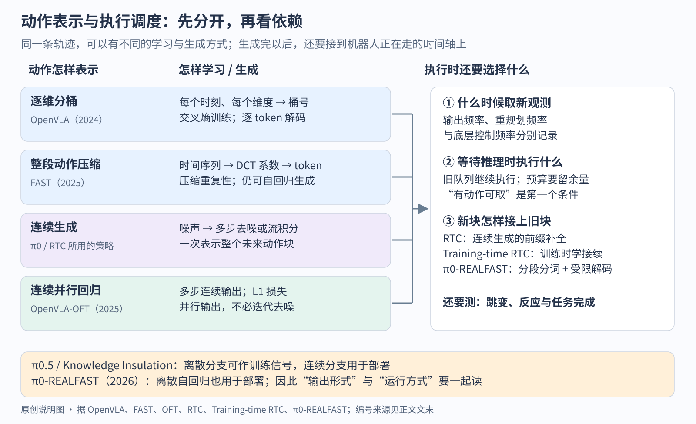

# VLA 的基线

> 状态：Baseline 页 · v2 · 依据 [synthesis.csv](synthesis.csv) 与各篇原文

[入门页](README.md) · [路线图](ROADMAP.md) · [论文目录](PAPERS.md) · [逐步讲义](../vla.md)

## 基线是谁、为什么是它

结论：VLA 有两个基线。RT-2 / OpenVLA 定义了"图像 + 指令 → 离散动作 token"的接口，π0 定义了"预训练 VLM + 连续动作专家 → 动作块"的接口；2025 年以后的工作几乎都以其中一个为起点，并在实验表里拿它作对照。

| 基线 | 定义了什么 | 为什么后来者拿它当参照 |
|---|---|---|
| [RT-2](../../papers/arxiv-2307.15818/README.md)（2023，Google DeepMind）与它的开放复刻 [OpenVLA](../../papers/openvla/reading.md)（2024，Stanford、Berkeley 等） | 接口：单张图像 + 语言指令进入预训练 VLM（视觉语言模型），每个动作维度离散成 256 个桶、映射到词表里的 token，用下一词预测输出。训练范式：机器人示教上的行为克隆，RT-2 再与网页图文数据联合微调（co-fine-tuning）。评估：Google 机器人的见过 / 没见过任务、BridgeData WidowX 桌面任务 | RT-2 闭源、55B、云端 1–3 Hz；OpenVLA 7B、权重与训练代码开放，在 170 次 WidowX 试验上比 RT-2-X 高约 20 个百分点。后来者要比较"离散 token 路线"时，能跑的就是 OpenVLA |
| [π0](../../papers/arxiv-2410.24164/README.md)（2024，Physical Intelligence） | 接口：多视角图像 + 关节状态 + 语言进入 PaliGemma（3B VLM），另接一个 300M 的动作专家（一条独立权重的 Transformer 流），用 flow matching（一句话：学习把高斯噪声逐步推成动作的速度场）一次生成 50 步连续动作块，最高 50 Hz 执行。训练范式：约 1 万小时自有数据预训练，再按任务后训练。评估：叠衣、清桌、装袋这类长时程灵巧任务，按完成进度打分 | 原文把 OpenVLA 的落后归因于不支持动作块和高频控制（Sec. VI-A）。openpi 开放了 π0、π0-FAST、π0.5 的权重，2025–2026 年的论文（SmolVLA、OpenVLA-OFT、ForceVLA、InternVLA-A1、Qwen-VLA）都把 π0 或 π0.5 放进对照表 |

两个基线之前还有一个"前 VLA"的参照：[RT-1](../../papers/arxiv-2212.06817/README.md)（2022）用 13 台机器人 17 个月采集的 13 万条示教训练 35M 参数的 Transformer，动作同样逐维离散成 256 桶，但视觉用 ImageNet 预训练的 EfficientNet、语言只是句向量，没有借用大语言模型。RT-2 的主要对照就是 RT-1：同样的机器人数据与动作离散方式，区别在于有没有从预训练 VLM 出发。

## 基线的结构拆分

结论：一个 VLA 可以拆成六个可替换的部件；两个基线在"动作表示"和"推理调度"上分歧最大，其余部件大体相同。

| 部件 | 含义 | RT-2 / OpenVLA | π0 |
|---|---|---|---|
| 观测表示 | 进入模型的是什么：几张图、历史帧、本体状态（proprioception，一句话：关节编码器等对机器人自身状态的测量）、力觉 | 单张第三人称图像；无历史、无本体状态。OpenVLA 拼接 DINOv2 与 SigLIP 两路视觉特征 | 2–3 张图（第三人称 + 腕部）+ 关节角状态；无历史帧 |
| 动作表示 | 模型输出的形式 | **离散 token**：每维 256 桶，RT-2 一步 8 个 token、OpenVLA 一步 7 个，单步动作 | **连续动作块**：50 步 × 18 维（不足补零），由动作专家输出 |
| 训练目标 | 在哪些输出位置计算什么损失 | 动作 token 上的交叉熵；RT-2 另有网页图文的下一词损失 | 动作块上的 flow matching 损失；动作专家的梯度回传进 VLM |
| 数据 | 用什么数据、什么配比 | RT-2：RT-1 的 13 万条示教 + WebLI 图文；OpenVLA：Open X-Embodiment 中筛出的约 97 万条轨迹 | 约 1 万小时、7 种机器人构型、68 个任务的自有数据，开源数据占 9.1% |
| 推理调度 | 多久推理一次、一次产出多少、在哪里运行 | 每步自回归解码 7–8 个 token；RT-2-55B 在云端 1–3 Hz，OpenVLA 在 RTX 4090 上约 6 Hz | 一次推理产出 50 步、10 步积分；RTX 4090 上机载推理 73 ms，执行 16–25 步后再推理 |
| 任务条件 | 用什么告诉模型"做什么" | 一句语言指令 | 一句语言指令；长任务由另一个高层 VLM 拆成子任务指令 |

几个部件之间有依赖：动作表示约束推理调度（离散 token 通常逐个解码，连续动作块可并行表示，但是否异步执行、如何接续还要单独设计）；训练目标决定 VLM 的知识能否保住（连续动作头的梯度会改动骨干）。下表按部件分行，同一篇论文改了几个部件，就在几行出现。

### 动作表示与执行调度分开选择

图：原创机制对照。横向每行是一种输出机制，右侧是把动作送到真实时间轴上的接口。FAST 改压缩，OFT 改并行输出，RTC（实时动作块接续：旧块执行期间生成能衔接的新块）改连续生成的接续，π0-REALFAST 同时改分词范围与自回归接续；看"动作是不是 token"只回答了其中一部分。箭头表示信息流，图中没有模型排名。

## 后续工作在改哪个部件

| 部件 | 改法 | 代表论文 | 改进了什么 / 付出了什么 |
|---|---|---|---|
| 动作表示 | **= 离散 token**（基线本身）：逐维 256 桶，RT-1 用均匀分桶，OpenVLA 把桶的范围改成训练数据的 1%–99% 分位数 | [RT-1](../../papers/arxiv-2212.06817/README.md)、[RT-2](../../papers/arxiv-2307.15818/README.md)、[Open X-Embodiment / RT-X](../../papers/arxiv-2310.08864/README.md)、[OpenVLA](../../papers/openvla/reading.md) | 完全复用语言模型的训练方式，网页知识能迁移到动作（RT-2 没见过任务的平均成功率 62%，RT-1 为 32%）。代价：逐 token 解码慢；控制频率升高后学不动（FAST 的出发点，见下一行） |
| 动作表示 | 压缩后的离散 token：对 1 秒动作块逐维做 DCT（离散余弦变换），取整后用 BPE 合并 | [FAST](../../papers/arxiv-2501.09747/README.md)（π0-FAST） | 50 Hz 叠 T 恤任务上，1 秒动作块从 700 个 token 压到 53 个；逐维分桶在 20 Hz、50 Hz 任务上完全学不动，FAST 能学；训练所需 GPU 小时约为 π0 的 1/5。代价：推理一个动作块约 750 ms，π0 约 100 ms |
| 动作表示 | 与 VLM 语义对齐的离散 token：4 级残差量化，第 1 级对齐冻结 VLM 的特征 | [X-Tokenizer](../../papers/arxiv-2606.14752/README.md) | 7 个真机任务平均进度 77.4，FAST 为 73.0；加噪后比 FAST 稳。代价：重建误差比 FAST 大约 17%；只支持末端空间，不支持灵巧手与关节空间 |
| 动作表示 | 连续动作块 + 生成式动作头（flow matching 或扩散） | [π0](../../papers/arxiv-2410.24164/README.md)、[Octo](../../papers/arxiv-2405.12213/README.md)（扩散头）、[GR00T N1](../../papers/arxiv-2503.14734/README.md)（DiT，16 步块）、[SmolVLA](../../papers/arxiv-2506.01844/README.md)、[Qwen-VLA](../../papers/arxiv-2605.30280/README.md)；前身是 [Diffusion Policy](../../papers/diffusion-policy/reading.md) | 能表示多峰动作、高频灵巧控制（π0 最高 50 Hz）；Octo 消融中离散动作 18%、MSE 回归 35%、扩散头 83%。代价：多一个随机初始化的模块，它的梯度会损伤 VLM（见"训练目标"行） |
| 动作表示 | 连续动作块 + 并行解码 + L1 回归（不用生成式头） | [OpenVLA-OFT](../../papers/arxiv-2502.19645/README.md) | 在 OpenVLA 底座上：并行解码加动作块使 LIBERO 平均从 76.5% 到 90.2%，换连续 L1 回归再到 95.3%；动作生成吞吐从 4.2 Hz 到 109.7 Hz（26 倍）。代价：作者自述 L1 学到的是中位数，可能表示不了真正多峰的动作分布 |
| 训练目标 | 骨干学离散 FAST token、动作专家学连续动作，二者联合，并阻断动作专家到骨干的梯度 | [π0.5](../../papers/arxiv-2504.16054/README.md)（预训练离散、后训练联合）、[Knowledge Insulation](../../papers/arxiv-2505.23705/README.md)（单阶段 + stop-gradient） | 训练快（π0 需约 7.5 倍步数达到相近表现）、推理快（只用连续分支）、语言跟随更好。代价：训练计算增加约 20%；语言跟随仍不完美 |
| 训练目标 | 在模仿之上用自主经验做 RL：价值函数算优势，以"优势为正 / 为负"的文本条件化训练 | [π*0.6](../../papers/arxiv-2511.14759/README.md)（RECAP）；仿真里的对应做法见 [SimpleVLA-RL](../../papers/arxiv-2509.09674/README.md) | 做咖啡、叠多样衣物的吞吐量翻倍以上，失败率约减半。代价：奖励标注、纠正与场景重置仍靠人；更新是分轮离线的 |
| 训练目标 | 加预测未来的生成目标：生成专家预测 15 步后的图像潜变量，动作专家读取它 | [InternVLA-A1](../../papers/arxiv-2601.02456/README.md)；更远的一支是把世界模型与动作合在一起的 [Zero-WAM](../../papers/zero-wam/reading.md) | 传送带上的动态任务 80.0% 对 π0.5 的 53.3%；去掉生成专家从 77.0 降到 57.6。代价：为了速度牺牲了预测图像的高频细节；理解专家没有与大规模 VQA 联合训练 |
| 观测表示 | 拼接两种视觉编码器并全量微调 | [OpenVLA](../../papers/openvla/reading.md) | DINOv2 补空间细节，SigLIP 补语义；冻结视觉编码器成功率从约 70% 降到 47%（小变体上的消融）。代价：视觉 token 多，推理慢 |
| 观测表示 | 加腕部相机与本体状态 | [π0](../../papers/arxiv-2410.24164/README.md)、[OpenVLA-OFT](../../papers/arxiv-2502.19645/README.md) | OFT 在 LIBERO 上从 95.3% 到 97.1%。反面：[Octo](../../papers/arxiv-2405.12213/README.md) 预训练加本体状态反而变差（作者归因于因果混淆），腕部相机也用不好；[Qwen-VLA](../../papers/arxiv-2605.30280/README.md) 默认不用本体状态，认为它带来本体专属的依赖 |
| 观测表示 | 加力 / 力矩：6 维力经线性投影成一个 token，在 VLM 之后经 MoE 融合，再注入动作专家 | [ForceVLA](../../papers/arxiv-2505.22159/README.md) | 插 USB、削黄瓜等 5 个接触任务平均 60.5%，π0 为 37.3%；把力直接拼进状态反而让 π0-FAST 从 31.0% 降到 14.2%。代价：用估计的外力；依赖昂贵的带力传感平台 |
| 观测表示 | 长上下文：在动作头里加 test-time training 层，把最长 8K 步（约 5 分钟）的历史写进快权重 | [RoboTTT](../../papers/arxiv-2607.15275/README.md)；[π0.7](../../papers/arxiv-2604.15483/README.md) 用视频历史编码器（每路相机最多 6 帧） | 长时程任务平均完成度 79%，单步上下文的 GR00T N1.7 为 42%；直接多给 1 帧历史反而在一个任务上从 57% 降到 39.5%。代价：训练上下文越长训练越贵 |
| 数据 | 跨机器人数据集：统一成 7 维末端动作 + 256 桶，但不对齐坐标系 | [Open X-Embodiment / RT-X](../../papers/arxiv-2310.08864/README.md)、[Octo](../../papers/arxiv-2405.12213/README.md)（80 万条） | RT-2-X 在 Google 机器人上做只在 Bridge 数据里出现过的技能，成功率是 RT-2 的约 3 倍（75.8% 对 27.3%）。代价：同一个动作向量在不同机器人上含义不同；35M 的 RT-1-X 在大数据域欠拟合（73% 对 RT-1 的 92%） |
| 数据 | 大规模自有数据 + 多来源联合训练：网页数据、子任务标注、口头指令、多环境数据 | [π0](../../papers/arxiv-2410.24164/README.md)、[π0.5](../../papers/arxiv-2504.16054/README.md)、[Gemini Robotics](../../papers/arxiv-2503.20020/README.md)（ALOHA 2 机群，数千小时） | π0.5 用约 100 个家庭的 400 小时移动操作数据，在没见过的真实家庭里完成 10–15 分钟的清理；去掉网页数据后没见过的物体明显变差。代价：数据配比靠经验，π0 自述不清楚怎样组合与加权 |
| 数据 | 数据金字塔：人类视频、仿真、神经网络生成的视频补真机数据 | [GR00T N1](../../papers/arxiv-2503.14734/README.md)（8376 小时，真机只占约 39%）、[InternVLA-A1](../../papers/arxiv-2601.02456/README.md)（仿真为主）、[Qwen-VLA](../../papers/arxiv-2605.30280/README.md)（另加导航、轨迹预测、人类第一视角数据） | GR00T N1 只用 10% 真机数据时 42.6%，同样数据的 Diffusion Policy 为 10.2%。代价：GR00T 自述合成数据难以在符合物理的前提下生成多样的反事实；Qwen-VLA 自述联合训练会轻微损害纯视觉语言和导航能力 |
| 数据 | 小模型 + 社区数据：481 个社区数据集、2.3 万条轨迹 | [SmolVLA](../../papers/arxiv-2506.01844/README.md) | 0.45B 参数在 LIBERO 上 87.3%，π0 为 86.0%；比 π0 训练快约 40%、显存少 6 倍。代价：预训练只有一种机器人（SO-100），长时程任务弱 |
| 推理调度 | 云端大骨干 + 机载动作解码器 | [RT-2](../../papers/arxiv-2307.15818/README.md)（只有云端，1–3 Hz）→ [Gemini Robotics](../../papers/arxiv-2503.20020/README.md)（云端 <160 ms，端到端约 250 ms，有效 50 Hz） | 可以用最大的模型。代价：依赖网络；报告不公开结构 |
| 推理调度 | 双系统：慢的 VLM 与快的动作模块分频运行 | [GR00T N1](../../papers/arxiv-2503.14734/README.md)（VLM 10 Hz，动作 DiT 120 Hz）、[π0.5](../../papers/arxiv-2504.16054/README.md)（高层子任务比低层动作更低频，同一个模型） | 语言推理与高频控制解耦。代价：GR00T N1 自述只做了短时程桌面任务 |
| 推理调度 | 异步推理：动作队列快用完前就发起下一次预测；跳过 VLM 的后半层 | [SmolVLA](../../papers/arxiv-2506.01844/README.md) | 任务完成时间从 13.75 s 降到 9.7 s，60 秒内完成数从 9 个到 19 个。代价：排序任务的成功率从 70% 降到 50% |
| 任务条件 | 先生成子任务文字（或思考）再生成动作 | [π0.5](../../papers/arxiv-2504.16054/README.md)、[Gemini Robotics 1.5](../../papers/arxiv-2510.03342/README.md)（thinking + ER 编排器） | 长时程任务可分解、可解释。代价：π0.5 的高层会分心（反复开关抽屉）；单独的 Thinking VLA 做复杂长任务最高 44% 进度 |
| 任务条件 | 可引导的提示：子目标图像（由世界模型生成）、片段元数据（速度、质量、是否犯错）、控制模式 | [π0.7](../../papers/arxiv-2604.15483/README.md) | 能用好质量参差的数据（有元数据时数据越多越好，无元数据时反而下降）；开箱即用追平 RL 专用模型。代价：没见过的任务 60–80%，复杂新任务要人口头教练 |
| 任务条件 | 用示教作提示：给一条或几条示教，不改权重就做新任务 | [ICRT](../../papers/arxiv-2408.15980/README.md)、[Behavior Prompting Policy](../../papers/arxiv-2606.30457/README.md)、[RoboTTT](../../papers/arxiv-2607.15275/README.md)（人类视频进上下文）、[Zero-WAM](../../papers/zero-wam/reading.md) | ICRT 在没见过的任务上 79.2%，同设定下 OpenVLA 7.5%、Octo 9.2%。代价：ICRT 与 BPP 都自述学不会全新的动作原语 |
| 整体缩放 | 换更小的底座 / 统一更多任务与本体 | [SmolVLA](../../papers/arxiv-2506.01844/README.md)（0.45B）、[Qwen-VLA](../../papers/arxiv-2605.30280/README.md)（4B VLM + 1.15B 动作专家，统一操作、导航、轨迹预测） | Qwen-VLA 在 ALOHA 分布外设置上 76.9%，π0.5 为 41.5%。代价：见上 |
| 观测表示（2026 年补充） | 多尺度记忆：短时用视频编码器（每 4 层一次时间注意力，推理最多 18 帧、54 秒），长时由策略自己更新一段文字摘要 | [MEM](../../papers/arxiv-2603.03596/README.md)（π0.6 底座，π0.7 沿用） | 能做约 15 分钟的整理厨房；朴素地拼接历史指令明显更差；灵巧任务上与无记忆版本持平。代价：记忆只在一个回合内；文字摘要的训练标签要靠大语言模型从带子任务标注的回合里生成 |
| 数据（2026 年补充） | 大规模第一视角人类视频，用 SLAM 与手部姿态估计标出腕部与手指动作，再经少量人-机对齐数据过渡 | [EgoScale](../../papers/arxiv-2602.16710/README.md)；[GR00T N1.7](https://huggingface.co/blog/nvidia/gr00t-n1-7)（官方博客，把这 2 万小时放进预训练） | 验证损失随人类数据小时数对数线性下降并能预测真机表现；22 自由度手上平均成功率比不做人类预训练高 54%。代价：手部姿态估计有噪声，另需高精度数据与对齐阶段；尺度律不外推 |
| 推理调度（2026 年补充） | 全身：上层策略（VLA、视觉运动策略或导航策略）输出全身关节目标或速度指令，下面接单独训练、频率更高的全身控制器 | [Helix 02](../../papers/figure-helix-02/README.md)（S1 200 Hz → S0 1 kHz）、[GR00T N1.6](https://developer.nvidia.com/blog/building-generalist-humanoid-capabilities-with-nvidia-isaac-gr00t-n1-6-using-a-sim-to-real-workflow)（速度指令 → GR00T-WholeBodyControl）、[Gemini Robotics 2](../../papers/gemini-robotics-2/README.md)（未公开下层） | 行走、平衡与操作在一个系统里连起来（Helix 02 的 4 分钟洗碗机任务）。代价：Gemini Robotics 2 地面拾取 45.7%；两层之间的接口各家不同，没有同条件比较 |
| 训练目标（2026 年补充） | 冻结 VLA，从内部表示压出一个 RL token，只在它上面在线训练小 actor-critic，修正 VLA 提出的动作块 | [RL Token](../../papers/arxiv-2604.23073/README.md) | 每任务约 15 分钟到 5 小时真机数据，精密阶段提速最高约 3 倍，装螺丝 20% → 65%。代价：仍要人给奖励、做干预、切换 RL 与基座策略 |
| 整体缩放（2026 年补充） | 机载小模型 + 少量示范适配新本体 | [Gemini Robotics On-Device 2](../../papers/gemini-robotics-2/README.md) | 新的双臂本体通常少于 200 条示范、几小时适配。代价：官方没有给出机载版与完整版的对比数字 |
| 推理调度 | 旧队列执行时生成新块，用已承诺前缀与软重叠引导补全 | [RTC](../../papers/arxiv-2506.07339/README.md) [1]（NeurIPS 2025） | 不重训即可用于扩散 / flow 策略；引导带来额外计算，仅覆盖这类生成策略 |
| 训练目标 + 推理调度 | 训练时随机模拟延迟，干净前缀作条件，只训练带噪后缀 | [Training-time RTC](../../papers/arxiv-2512.05964/README.md) [2]（2025-12 v2） | 省去推理时的额外引导；要匹配延迟分布，原方法只用硬前缀 |
| 动作表示 + 推理调度 | 分段 FAST 分词、前缀条件化、预算内的合法 token 解码 | [π0-REALFAST](../../papers/arxiv-2606.13355/README.md) [3]（2026-06 v1） | 自回归动作也可异步接续；要微调并校准延迟预算，证据限于单臂桌面 |

[OpenVLA 精读](../../papers/openvla/reading.md)位于"动作表示 = 离散 token"与"观测表示 = 拼接两种视觉编码器"两格；它的三个限制（单帧、无本体状态、无动作块）分别对应"观测表示 = 加腕部相机与本体状态"和"动作表示 = 连续动作块 + 并行解码"两行。

## 批注

**易误读**

- RTC、Training-time RTC 与 π0-REALFAST 解决的是动作块衔接；队列不断流、动作连贯、及时响应新观测是三个需要分别检查的条件。RTC 的适用范围见正式版 §6，Training-time RTC 的延迟分布与硬前缀限制见 v2 §VI，π0-REALFAST 的外部延迟假设与单臂范围见 v1 §3.3、§6。

- OpenVLA-OFT 摘要中的 76.5% → 97.1% 跨越了输入设置：97.1% 的配置另加了腕部图像与本体状态，同输入下的对照是 π0 的 94.2%（Table I）。表中按同一输入分步写出。
- FAST 的 750 ms 与 π0 的 100 ms 都是 RTX 4090 上预测 1 秒动作块的时间（FAST Sec. VI-E）；KI 写的"π0 约 10 Hz、自回归 VLA 约 1.3 Hz"是另一种口径（§4）。
- SmolVLA 与 π0 的 LIBERO 对比、BPP 与 π0.5 的 LIBERO 对比，对照方的训练设置与本方不同（BPP 的 π0.5 只跑 1 个种子、训练不含 LIBERO-90）。LIBERO 已接近饱和，BPP 附录 D 也这样写。
- RT-X 的"约 3 倍"只指 Emergent Skills 这组评测；在 RT-2 的泛化评测上 RT-2-X 与 RT-2 基本持平（62% 对 61%）。
- GR00T N1 仿真结果取最后 5 个 checkpoint 的最高值（Sec. 4）。
- ForceVLA 原文把 37.3% 一处写成 π0-base w/ F、一处写成 w/o F；按图 5 与后文，37.3% 是不带力的 π0。

**与其他论文的关联**

- 动作块与生成式动作头来自模仿学习一侧：[Diffusion Policy](../../papers/diffusion-policy/reading.md) 与 ACT；它们在单任务小数据上很强，π0 的微调实验中最强的前作正是这类从零训练的模型（π0 Sec. VI-C）。机制见[扩散讲义](../../../foundations/lessons/17-diffusion.md)第 6.1、7 节。
- "新加的随机初始化模块会损伤预训练骨干"在视觉语言模型里也出现过：[LLaVA](../../../multimodal/papers/llava/reading.md) 第一阶段冻结视觉编码器和语言模型、只训练投影层，仓库精读把它解释为先让随机初始化的接口学会对接，以免一开始就大幅扰动语言能力。KI 的 stop-gradient 是同一个问题在动作头上的解法。
- 模仿之上的 RL（π*0.6）与 LLM 后训练共用思路：[模仿与强化学习方向](../imitation-reinforcement-learning/README.md)把它与 DPPO、HIL-SERL、SimpleVLA-RL 放在一起比较。

**未核实 / 待验证**

- Gemini Robotics 两份报告没有给出参数量、动作表示与训练目标，表中只写报告明确写出的调度与数据。
- X-Tokenizer 的每块 token 数与编码延迟只在图中，pdftotext 抽取错位，本页未引用。
- π0.7、Qwen-VLA 的训练数据总小时数与混合比例原文未写全，表中只写原文给出的部分。
- 2026 年补充的五行中，GR00T N1.6/N1.7、Helix 02、Gemini Robotics 2 都只有官方博客或仓库，没有论文；表中只写官方页面明确写出的结构与数字。

**参考文献**

[1] Black et al. [Real-Time Execution of Action Chunking Flow Policies，NeurIPS 2025 正式版](https://papers.nips.cc/paper_files/paper/2025/file/300ccb2187dedd4edcc07f7e76d8e553-Paper-Conference.pdf)，§3、§6。

[2] Black et al. [Training-Time Action Conditioning for Efficient Real-Time Chunking，v2](https://arxiv.org/html/2512.05964v2)，2025-12-09，§IV–VI。

[3] Lee et al. [Real-Time Execution with Autoregressive Policies，v1](https://arxiv.org/html/2606.13355v1)，2026-06-11，§3、§6。
