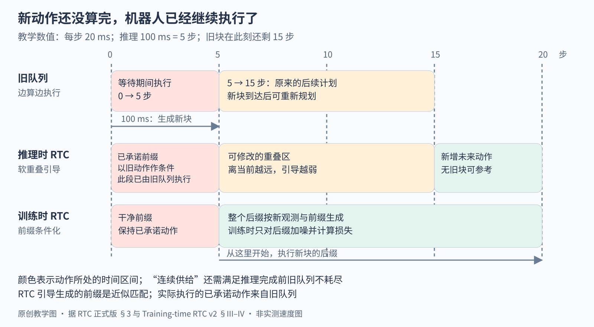

# 视觉-语言-动作模型（VLA）

> 状态：领域入门页 · v3（2026-10-04 补充实时接续与评测协议） · 依据 [synthesis.csv](synthesis.csv)（24 行）与本方向论文、官方材料的原文
>
> 速览：
> 1. VLA 要让一个策略听懂自然语言、在没见过的物体和场景里完成操作。办法是从预训练视觉语言模型出发，再用机器人示教教它输出动作；RT-2 第一次证明网页知识能迁移到动作上，没见过任务的成功率从 RT-1 的 32% 提到 62%。
> 2. 2023–2026 年的主线是动作怎样表示：逐维分桶的离散 token（RT-2、OpenVLA）在 20 Hz 以上的灵巧任务上学不动、推理慢；π0 换成 flow matching 生成的连续动作块；π0.5 与 Knowledge Insulation 采用"训练时用离散 token 保住语言模型，部署时用连续动作头"；2026 年的 π0-REALFAST 又给出了自回归动作实时部署的另一条路线。
> 3. 每一代都由后来者写出前作的坑：FAST 指出逐维分桶在高频数据上只会复制上一个 token；OpenVLA-OFT 把 OpenVLA 的 4.2 Hz 提到 109.7 Hz；Knowledge Insulation 指出 π0 的动作头梯度损伤语言跟随；π*0.6 指出纯模仿会累积误差，最多做到示范的水平。
> 4. `[判断]` Google DeepMind 押注自家最大的 VLM 加云端运行，Physical Intelligence 押注自有数据与连续动作头、并把新信息都写进模型的提示，Stanford/Berkeley 押注完全开放与廉价微调，NVIDIA 押注人形与合成数据；2026 年各家都在扩充"任务条件"（子任务、示教、子目标图、元数据）与上下文长度。2026 年中起，Google DeepMind（Gemini Robotics 2）、NVIDIA（GR00T N1.6/N1.7）、Figure（Helix 02）、Unitree（UnifoLM-WLA-1.0）都把 VLA 推到人形全身；Figure 与 NVIDIA 的官方材料写明行走与平衡由下面一层单独训练的全身控制器负责（第 7 阶段）。
> 5. 衡量方式从自家机器人上的见过 / 没见过任务，迁移到 LIBERO 仿真（已接近饱和，多家在 97%–98%），再到真实家庭、吞吐量、连续运行小时数和"没见过的任务-机器人组合"；π0.7 在没见过的任务上为 60%–80%，见过的常在 90% 以上。

本页是[机器人与具身](../../README.md)领域的 VLA 方向，讲领域地图。一张图像和一句话怎样变成动作块、损失在哪里计算、部署时怎样调度，见[VLA 逐步讲义](../vla.md)；基线拆分见 [Baseline 页](BASELINES.md)，学习路线见[路线图](ROADMAP.md)，论文列表见[论文目录](PAPERS.md)。

## 这个领域在解决什么

对一台从没见过这间厨房的机器人说"把红杯放进水槽"，它要认出哪个是红杯、知道水槽在哪，再输出一串关节或末端的目标值，让控制器带着机械臂去抓、去放。传统做法是每个任务单独采示教、单独训练一个策略（行为克隆的 [Diffusion Policy](../../papers/diffusion-policy/reading.md) 在单任务上很强），换一个物体或一句新指令就要重新采数据。VLA（vision-language-action model）想借用视觉语言模型（VLM，一句话：在网上图文数据上训练、能看图回答问题的模型）已经学到的常识，让一个策略覆盖很多任务、听懂没见过的指令。

主线上有三类做法，直觉各不相同：

- **动作当作词**：把每个动作维度切成 256 个桶，桶号当成词表里的 token，让 VLM 像回答问题一样"说出"动作（RT-2、OpenVLA）。好处是训练方式与语言模型完全一样。
- **VLM 加一个连续动作头**：VLM 负责看和听，另接一个生成模块一次输出未来几十步的连续动作（π0、GR00T N1、SmolVLA）。好处是动作精细、频率高。
- **高层想、低层做**：先用语言写出当前子任务或思考，再生成动作；高层可以和低层是同一个模型（π0.5），也可以是另一个模型当编排器（Gemini Robotics 1.5、π0 时期的高层 VLM）。

### VLA 与相邻方向的分工

结论：VLA 管"从像素和指令直接到动作"这一段；更低层的跟踪控制、更高层的长程规划和对未来的预测，分属相邻方向。

| 方向 | 管什么 | 与 VLA 的接口 |
|---|---|---|
| [模仿学习与机器人强化学习](../imitation-reinforcement-learning/README.md) | 单任务或小数据的策略学习、从经验改进策略 | VLA 的动作块和生成式动作头来自这里（Diffusion Policy、ACT）；π*0.6 把 RL 搬到 VLA 上 |
| [运动控制与腿足运动](../control-locomotion/README.md) | 关节力矩、PD 跟踪、全身控制 | VLA 输出目标位姿或关节角，下面仍有控制器；π0.5 的实验机器人只用简单 PD 跟踪 |
| [具身 Agents](../embodied-agents/README.md) | 用 LLM 做长程规划、调用技能库 | SayCan 一类方法把 VLA 或技能策略当作被调用的底层；Gemini Robotics 1.5 的编排器也是这种接口 |
| [世界模型](../world-models/README.md) | 预测"执行这个动作之后会怎样" | InternVLA-A1 与 Zero-WAM 把未来预测放进 VLA 内部 |
| [视觉表征](../../../multimodal/fields/visual-representation/README.md) | 视觉编码器学到什么性质 | VLA 的视觉骨干是 SigLIP、DINOv2 这类编码器；OpenVLA 冻结视觉编码器后成功率明显下降 |

## 主线历史

结论：2022–2024 年要回答"能不能用一个大模型做很多操作任务，以及网页知识能不能迁移到动作上"；2024 年底起，问题变成"动作怎样表示才能又准又快，同时不损伤 VLM"；2025 年底起，又加上"怎样从经验、示教和更丰富的提示里继续学"。每个阶段先写上一阶段留下的问题，再写它改变了什么，最后写它做不好的场景；其中"站在现在看"的部分，是后来的论文专门修补或明确批评的地方，标 `[判断]` 的是从后续工作反推的结论。

### 1 多任务真机示教：RT-1（2022，Google）

留下的问题：此前的语言条件策略要么任务很窄（Gato 只在积木堆叠上评估），要么在新任务上表现差（BC-Z）。改变：[RT-1](../../papers/arxiv-2212.06817/README.md) 用 13 台机器人、17 个月采集的 13 万条示教、700 多条指令，训练一个 35M 参数的 Transformer，图像用 ImageNet 预训练的 EfficientNet、语言用句向量经 FiLM（一句话：用语言向量算出逐通道的缩放与偏移，去调制视觉特征）注入，11 维动作每维离散成 256 桶，3 Hz 闭环控制。见过任务 97%、没见过任务 76%，同数据重训的 BC-Z 为 72% 和 19%。作者还发现数据多样性比数量重要：去掉 25% 的任务、保留 97% 的数据，泛化降到 54%。

做不好的场景：作者自述只能泛化到已见概念的新组合，生成不了全新动作，灵巧度不高；背景变化下只有 59%，真实厨房里换新物体和新位置（L3）只有 50%。`[判断]` 站在现在看，"每维 256 桶、一步一个动作"之所以在 RT-1 上可行，部分因为 3 Hz 的低频数据相邻动作差别大；FAST 后来表明同样的分桶到 20 Hz、50 Hz 就学不动（第 4 阶段）。

### 2 动作当作词：RT-2 与跨机器人数据（2023，Google DeepMind）

留下的问题：RT-1 的语义能力只来自机器人数据，作者写明泛化受限于见过的概念。改变：[RT-2](../../papers/arxiv-2307.15818/README.md) 把动作写成 8 个整数 token，直接微调 PaLI-X（55B）和 PaLM-E（12B），并与网页图文数据联合微调。没见过任务的平均成功率 62%，RT-1 为 32%；符号理解、简单推理、人物识别这类"涌现能力"平均 60%，RT-1 为 17%；同样 5B 模型从零训练只有 9%，说明收益来自网页预训练。作者把这类模型命名为 VLA。同年的 [Open X-Embodiment](../../papers/arxiv-2310.08864/README.md) 汇集 34 个实验室、22 种机器人的 100 万条以上轨迹，统一成 7 维末端动作加 256 桶；RT-2-X 在 Google 机器人上做只在 Bridge 数据里出现过的技能，成功率是只用 Google 数据的 RT-2 的约 3 倍（75.8% 对 27.3%）。

做不好的场景：RT-2 自述机器人没有因为网页数据学到任何新动作，物理技能仍局限于机器人数据中的技能分布；附录列出的失败包括抓物体的特定部位（把手）、用毛巾擦、使用工具、叠毛巾这类精细动作。55B 模型在云端只有 1–3 Hz，5B 约 5 Hz，作者把实时推理列为瓶颈。RT-X 的动作向量不对齐坐标系，原文写明同一个动作向量在不同机器人上会引起很不同的运动，35M 的 RT-1-X 在大数据域欠拟合（Google 机器人上 73%，RT-1 为 92%）。`[判断]` 站在现在看，"不对齐的动作空间"是后来各家都要单独处理的坑：π0 把状态和动作补零到同一维度，GR00T N1 给每种本体配独立的动作编解码器，Qwen-VLA 用补零加掩码并在文字提示里写明机器人、频率和动作块长度。

### 3 开放的通用策略：Octo、OpenVLA（2024，Berkeley、Stanford 等）

留下的问题：RT-2 闭源、55B、只能在 Google 的机器人上用，也没有给出"怎样适配到新机器人"的做法；Octo 的作者另外指出前作只接受预先定好的观测和动作空间。改变：[Octo](../../papers/arxiv-2405.12213/README.md)（27M/93M）用扩散头输出连续动作块，可以按语言或目标图像执行，微调时能增删相机、换动作空间，用约 100 条示教、单卡约 5 小时微调，平均 72%，从零训练 20%。[OpenVLA](../../papers/openvla/reading.md) 沿用 RT-2 的离散 token，换成 7B 的开放底座 Prismatic（DINOv2 与 SigLIP 两路视觉特征接入 Llama 2）和清洗过的约 97 万条 Open X-Embodiment 轨迹，在 170 次 WidowX 试验上比 55B 的 RT-2-X 高约 20 个百分点，并开放权重与训练代码。

做不好的场景：Octo 自述用不好腕部相机，常常只用第三人称相机反而更好；新技能（翻杯、把方块放进槽）只有 0%–10%；它的消融里离散动作只有 18%，因为精度不足、常抓空。OpenVLA 自述只看单帧、没有本体状态（关节角、夹爪开度等机器人对自身状态的测量），RTX 4090 上约 6 Hz，撑不起 50 Hz 的高频控制，成功率通常低于 90%；在单指令的窄任务上输给从零训练的 Diffusion Policy（倒玉米 50% 对 100%）；DROID 数据集的动作 token 准确率一直上不去，训练最后三分之一被移出数据混合。`[判断]` 站在现在看，这几处正是后来者的出发点：FAST 原文写明 OpenVLA 难以拟合频率较高的 DROID（Sec. IV），与 OpenVLA 自己移除 DROID 的经历对得上；π0 把 OpenVLA 的落后归因于不支持动作块和高频控制；OpenVLA-OFT 写明 OpenVLA 自回归生成太慢（3–5 Hz），且让动作块变得不切实际，因为 K 步、D 维的动作块要串行跑 K×D 次前向。OpenVLA 自己在 Sec. 6 已把"动作块或投机解码"列为提速的可能办法，把"与网页图文数据联合训练是否有用"列为没来得及研究的问题；前者由 OpenVLA-OFT 做成，后者由 π0.5 回答（去掉网页数据后没见过的物体明显变差）。

### 4 连续动作块：π0（2024，Physical Intelligence）

留下的问题：离散 token 的 VLA 只做低频、简单的任务；擅长灵巧动作的 ACT、Diffusion Policy 又只在小数据上从零训练。改变：[π0](../../papers/arxiv-2410.24164/README.md) 在 PaliGemma（3B）上接一个 300M 的动作专家（一条独立权重的 Transformer 流），用 flow matching（一句话：学习一个把高斯噪声逐步推成动作的速度场，推理时积分 10 步）一次生成 50 步连续动作块（action chunk，一次预测未来多步动作），最高 50 Hz；用约 1 万小时、7 种机器人构型、68 个任务的自有数据预训练，再按任务后训练（简单任务约 5 小时数据，复杂任务 100 小时以上）。叠衣服、组装纸箱、装蛋这类此前方法做不了的长时程灵巧任务，完整 π0 都拿到一半以上的分数。RTX 4090 上机载推理 73 ms。生成方式的来龙去脉见[生成配方的收敛](../../../perspectives/generative-convergence.md)：连续信号走去噪或流匹配，π0 把它用在了机器人动作上。

做不好的场景：π0 自述不清楚预训练数据该怎样组合与加权，"并非所有评测任务都可靠"；长任务仍要另一个高层 VLM 把指令拆成子任务。`[判断]` 站在现在看，π0 的配方有两个坑是后来者写出来的：一是语言跟随，[Knowledge Insulation](../../papers/arxiv-2505.23705/README.md) 的图 2 中 π0 不理会"把勺子放进收纳盒"而去抓垃圾，作者归因于随机初始化的动作专家的梯度破坏了预训练 VLM；Gemini Robotics 报告也写到它复现的 π0 难以理解描述性的属性词。二是训练慢，KI 中 π0 要用约 7.5 倍训练步数才达到相近表现。

### 5 修补与分化：FAST、OpenVLA-OFT、π0.5、Knowledge Insulation、双系统（2025）

留下的问题：离散 token 慢且在高频上学不动，连续动作头又伤 VLM、训练慢；所有模型都只在与训练环境相近的地方评测。2025 年的工作从不同部件下手：

- **把离散 token 修好**：[FAST](../../papers/arxiv-2501.09747/README.md) 给出逐维分桶失败的机理：自回归模型的学习信号与每个 token 在已知前文下的边际信息量成正比，控制频率越高，相邻时刻越接近，这个信息量越趋近于零，模型只学会复制上一个动作 token。它对 1 秒动作块的每一维做 DCT（离散余弦变换，把一段随时间变化的信号拆成低频到高频的余弦成分），取整后再用 BPE（把经常一起出现的符号合并成一个新符号的压缩方法）压缩，50 Hz 叠 T 恤从 700 个 token 压到 53 个；π0-FAST 训练所需 GPU 小时约为 π0 的 1/5。
- **把 OpenVLA 修快**：[OpenVLA-OFT](../../papers/arxiv-2502.19645/README.md) 在同一底座上改成并行解码、动作块、连续 L1 回归，LIBERO（一个桌面操作仿真基准，四组各 10 个任务）平均从 76.5% 到 97.1%（后者另加了腕部图像与本体状态），动作生成吞吐提高 26 倍；双臂 ALOHA 上用 FiLM 把语言注入视觉特征，不加时语言跟随只有随机水平的 33%。
- **两种表示合用**：[π0.5](../../papers/arxiv-2504.16054/README.md) 预训练只用 FAST 离散 token，后训练加入连续动作专家；同一个模型先生成子任务文字、再生成动作；与网页数据、子任务标注、口头指令数据联合训练。约 100 个家庭 400 小时的移动操作数据之外，第一阶段 97.6% 的样本不来自家庭场景移动操作；它在三个没见过的真实家庭里完成 10–15 分钟的清理。[Knowledge Insulation](../../papers/arxiv-2505.23705/README.md) 把它改成单阶段，并对动作专家到骨干的梯度做 stop-gradient，部署时只用连续分支。
- **双系统与小模型**：NVIDIA 的 [GR00T N1](../../papers/arxiv-2503.14734/README.md) 让 VLM 以 10 Hz、动作 DiT（扩散 Transformer，这里用 flow matching 训练）以 120 Hz 分频运行，用人类视频、仿真、生成视频补真机数据；Hugging Face 的 [SmolVLA](../../papers/arxiv-2506.01844/README.md) 只用 0.45B 参数和社区数据，在 LIBERO 上与 π0 相当，用异步推理让任务完成时间缩短约 30%。
- **闭源大模型**：Google DeepMind 的 [Gemini Robotics](../../papers/arxiv-2503.20020/README.md) 把骨干放在云端（查询延迟压到 160 ms 以下）、动作解码器放在机器人上，端到端约 250 ms，有效 50 Hz。

做不好的场景：π0-FAST 推理一个 1 秒动作块要约 750 ms，π0 约 100 ms，FAST 作者把推理速度列为局限；KI 指出 750 ms 的延迟会造成动力学失配和轨迹变慢。π0.5 自述在陌生的抽屉把手、难打开的柜门上持续失败，手臂挡住污渍时擦不到，高层推理会分心（放东西时反复开关抽屉），只能处理简单的提示，没有记忆。OpenVLA-OFT 自述 L1 回归学到的是中位数，可能表示不了多峰动作。GR00T N1 后训练只用右手数据后丢失了换手能力。SmolVLA 预训练只有一种机器人，只擅长短时程任务。`[判断]` 2025 年的分化并不是路线之争：π0.5、KI 和后来的 π*0.6、π0.7 都同时保留离散 token 与连续动作头，这一支形成了"离散 token 用于训练、连续动作头用于部署"的分工；2026 年 π0-REALFAST 的自回归部署是另一支，见下文的实时执行问题链。

### 6 从经验、示教与提示里继续学（2025 年底–2026）

留下的问题：模仿学习最多做到示范的水平；所有模型都只用一句简短指令和当前观测，学不会新任务、记不住几分钟前发生的事。改变：

- **从自主经验学**：[π*0.6](../../papers/arxiv-2511.14759/README.md) 用部署数据训练价值函数，以"优势为正 / 为负"的文本条件化训练策略（RECAP）。叠多样衣物、做双份浓缩咖啡的吞吐量翻倍以上、失败率约减半，连续做咖啡 13 小时；底座 π0.6 换成 Gemma 3 4B 加 860M 动作专家。
- **可引导的提示**：[π0.7](../../papers/arxiv-2604.15483/README.md) 的提示里除了任务和子任务文字，还有世界模型生成的子目标图像、片段元数据（速度、质量 1–5、是否犯错）和控制模式，每路相机最多 6 帧视频历史。有元数据时，数据越多越好，即使平均质量下降；没有元数据时反而变差。它开箱即用追平 π*0.6 的 RL 专用模型，在没见过的 UR5e 上叠 T 恤成功率 80%，人类遥操作专家 80.6%。
- **多本体与思考**：[Gemini Robotics 1.5](../../papers/arxiv-2510.03342/README.md) 让一个 checkpoint 控制 ALOHA、双臂 Franka 和 Apollo 人形，输出动作前先用自然语言写思考，另一个 ER 模型做编排。
- **统一更多数据与任务**：[Qwen-VLA](../../papers/arxiv-2605.30280/README.md)（4B VLM + 1.15B 动作专家）把操作、导航、轨迹预测、人类第一视角动作放进一个模型，ALOHA 分布外 76.9%，π0.5 为 41.5%；[InternVLA-A1](../../papers/arxiv-2601.02456/README.md) 加一个预测未来图像潜变量的生成专家，传送带上的动态任务 80.0% 对 π0.5 的 53.3%；[X-Tokenizer](../../papers/arxiv-2606.14752/README.md) 让离散动作 token 与 VLM 特征对齐。
- **新的观测与任务条件**：[ForceVLA](../../papers/arxiv-2505.22159/README.md) 在 π0 上加力觉 token，5 个接触任务平均 60.5% 对 37.3%；[RoboTTT](../../papers/arxiv-2607.15275/README.md) 用 test-time training（一句话：部署时每一步用一次小的梯度更新改写一组"快权重"，把历史压进参数，而不是越来越长的上下文）把最长 5 分钟的历史写进快权重；[ICRT](../../papers/arxiv-2408.15980/README.md)、[Behavior Prompting Policy](../../papers/arxiv-2606.30457/README.md) 与 [Zero-WAM](../../papers/zero-wam/reading.md) 用示教或人类视频代替语言指令。

做不好的场景：π0.7 自述没见过的任务或"任务-机器人"组合只有 60%–80%，数据太杂以至难以判定哪些任务真正没见过，复杂新任务（如做红薯）不经人口头教练就做不成。π*0.6 的奖励标注、纠正和场景重置都靠人，探索基本是贪心的。Gemini Robotics 1.5 自述灵巧度与上一代持平。Qwen-VLA 自述联合训练轻微损害纯视觉语言与导航能力，评测多为短时程。ICRT 与 BPP 都自述学不会全新的动作原语。RoboTTT 的完全成功率仍低（10 个阶段的齿轮机器人只成功 2/10）。`[判断]` 站在现在看，RoboTTT 与 BPP 揭示了一个此前少有人写的坑：直接给策略多看几帧历史会引入虚假相关，RoboTTT 的对照中多给 1 帧历史让一个任务从 57% 降到 39.5%，BPP 也批评 ICRT 保留整段历史容易分布外；Octo 预训练加本体状态反而变差（作者归因于因果混淆），Qwen-VLA 默认不用本体状态。历史和本体状态都是双刃剑，π0.7 用 0.3 的概率整体丢弃历史帧来训练。

### 7 全身、记忆与人类视频（2026）

留下的问题：第 6 阶段的模型几乎都在桌面双臂或轮式双臂上评测；π0.5 自述没有记忆；"真机数据之外的数据能顶多少"还没有定量答案（Gemini Robotics 1.5 把它列为局限）。改变：

- **记忆**：Physical Intelligence 的 [MEM](../../papers/arxiv-2603.03596/README.md)（2026-03）在 π0.6 上把记忆分两种模态：短时记忆是视频（视觉编码器每 4 层插一次时间注意力，推理时最多 18 帧、54 秒），长时记忆是策略自己不断更新的一段文字摘要。机器人能完成长达约 15 分钟的整理厨房；直接拼接历史指令的"朴素语言记忆"明显更差。π0.7 已沿用 MEM。
- **人类第一视角视频**：NVIDIA 的 [EgoScale](../../papers/arxiv-2602.16710/README.md)（2026-02）用 SLAM 与手部姿态估计把 20,854 小时第一视角人类视频标成动作，人类动作预测的验证损失随数据小时数对数线性下降（R² = 0.9983），并能预测真机表现；22 自由度灵巧手上平均成功率比不做人类预训练高 54%。[GR00T N1.7](https://huggingface.co/blog/nvidia/gr00t-n1-7)（2026-04，官方 Hugging Face 博客与 [GitHub](https://github.com/NVIDIA/Isaac-GR00T)）把这 2 万小时放进预训练：3B 参数，VLM 换成 Cosmos-Reason2-2B（Qwen3-VL 结构），32 层 DiT 流匹配动作头，跨本体改用相对末端动作空间，状态与动作维度从 29 扩到 132，动作块从 16 步加长到 40 步。
- **全身**：[GR00T N1.6](https://developer.nvidia.com/blog/building-generalist-humanoid-capabilities-with-nvidia-isaac-gr00t-n1-6-using-a-sim-to-real-workflow)（2026-01，NVIDIA 技术博客）的仿真到真机流程把 VLA、在 Isaac Lab 里用 RL 训练并零样本上真机的全身控制器 GR00T-WholeBodyControl 和导航策略组合起来，导航策略只给全身控制器发速度指令，平衡交给下层；定位用 cuVSLAM，深度用 FoundationStereo（见[定位与建图](../localization-mapping/README.md)、[感知](../perception/README.md)）。Figure 的 [Helix 02](../../papers/figure-helix-02/README.md)（2026-01）分三层：S2 做语义推理，S1 以 200 Hz 输出全身关节目标，S0 是 1 kHz、10M 参数的全身控制器，用超过 1000 小时人体动作数据加仿真 RL 训练。Google DeepMind 的 [Gemini Robotics 2](../../papers/gemini-robotics-2/README.md)（2026-07-30）同时发布全身 VLA、做规划与多机协作的 ER 2 和机载的 On-Device 2，后者适配新的双臂本体通常少于 200 条示范。Unitree 的 [UnifoLM-WLA-1.0](../../papers/unifolm-wla/README.md)（2026-09）开放 6B 参数的人形基础模型权重与训练代码，约 2500 小时真机数据、一个模型覆盖 64 个桌面与全身操作任务。
- **在线 RL 精修**：[RL Token](../../papers/arxiv-2604.23073/README.md)（Physical Intelligence，2026-04）冻结 π0.6，只在压缩出的一个 token 上训练小的 actor-critic 修正动作块，几小时真机数据把精密插接阶段提速约 3 倍，见[模仿与强化学习方向](../imitation-reinforcement-learning/README.md)。

做不好的场景：Gemini Robotics 2 博客中，Apollo 2 人形从地面拾取只有 45.7%，SharpaWave 手拧上灯泡 36%、系垃圾袋 44%、用簸箕 32%；图中只有自家模型，没有与 1.5 或其他模型的对照，结构、参数量与动作表示都没有公开。同期的[安全评测报告](../../papers/gemini-robotics-2-safety/README.md)显示，没有一个前沿模型能把人员接近的漏报和误报同时压到接近零。Helix 02 的博客自称结果还早，没有成功率。GR00T N1.7 的官方说明称它与 N1.6 表现相当，提升在泛化与语言跟随。EgoScale 写明尺度律不外推到测量范围之外。MEM 的记忆只在一个回合之内，跨回合记忆留作未来工作。UnifoLM-WLA-1.0 没有技术报告，README 不给具体数字。

`[判断]` 站在现在看：2026 年的"全身 VLA"在结构上延续了本页开头"VLA 管从像素到动作、下面仍有控制器"的分工。Figure 与 NVIDIA 都把平衡与行走交给一个单独训练、频率更高的全身控制器（Helix 02 的 S0 为 1 kHz，S1 为 200 Hz），上层（Helix 02 的 S1、GR00T N1.6 的导航策略）给的是全身关节目标或速度指令；Boston Dynamics 与 TRI 的 Atlas 大行为模型（2025-08）让策略输出脚的位姿、由 MPC 去稳定（见[模仿与强化学习方向](../imitation-reinforcement-learning/README.md)）；Gemini Robotics 2 没有公开这一层。下层全身控制器的训练信号是人体动作数据加仿真 RL（Helix 02 的 S0、NVIDIA 的 [SONIC](../../papers/arxiv-2511.07820/README.md)），这与[运动控制方向](../control-locomotion/README.md#为什么绕不开模仿学习)"运动控制绕不开模仿学习"的结论接上了。

### 评测目标怎样迁移

benchmark 的替换就是目标的迁移：2022–2023 年在 Google 自家机器人上分见过 / 没见过任务（RT-1、RT-2）；2023–2024 年转向跨实验室的 BridgeData WidowX 桌面任务（RT-X、Octo、OpenVLA）；2024–2025 年微调比较集中到 LIBERO 仿真（OpenVLA-OFT、SmolVLA、KI），真机比较转向按进度打分的长时程灵巧任务（π0）；2025 年起比的是没见过的真实家庭（π0.5）、吞吐量与连续运行时间（π*0.6）、230 个任务的 A/B 测试（Gemini Robotics 1.5）；2026 年比没见过的任务-机器人组合（π0.7）、RoboTwin 2.0 双臂仿真（X-Tokenizer、InternVLA-A1、Qwen-VLA、Zero-WAM）。2026 年中又多出两种口径：Gemini Robotics 2 按"全身操作 / 多指灵巧 / 夹爪灵巧"三类在人形与双臂上分别报告成功率，并另发一个评测编排器安全决策的 ASIMOV-Agentic 基准；EgoScale 用人类动作预测的验证损失来预测真机表现，评测对象从策略延伸到了数据。

### 动作块之后：怎样一边行动，一边重新计算

连续动作块解决了"一次产出多步动作"，部署还要处理两块之间的衔接。**动作前缀**是机器人在下一次推理完成前已经承诺执行的那段旧动作。新块生成时把这段前缀作为条件，才能同时考虑新观测和正在进行的运动。

- **RTC**（real-time chunking，实时动作块接续：在旧动作执行期间生成能衔接的新块；NeurIPS 2025 正式版）把衔接写成补全问题：一边执行旧块，一边生成新块；推理延迟期间的动作固定由旧队列执行，后续重叠区用逐渐减弱的引导维持连贯。代价是每步去噪还要计算引导，增加推理开销。[1]
- **Training-time RTC**（2025-12，v2）在训练时随机模拟延迟，前缀保持干净、只对后缀加噪并计算损失。它把推理时的额外引导换成训练时学会接续；代价是要调整训练，并选择与部署相符的延迟分布。[2]
- **π0-REALFAST**（2026-06，v1）保留 FAST 的离散自回归输出，将前后两段分别分词，把旧队列前缀作为输入，再用受限解码（一句话：屏蔽无法在剩余预算内组成合法动作的 token）约束生成。它把"分词覆盖多长时间"也变成调度参数；实验范围是相对静态的单臂桌面任务。[3]

图：原创教学示例。控制周期为 20 ms、推理耗时为 100 ms，则等待期间旧队列继续执行 5 步。新块可用时，接入的是对应此刻以后的后缀；调长动作块增加的是可排队的未来动作，改变新观测进入动作的速度则要看重新推理与接续时刻。RTC 与训练时 RTC 对重叠区的处理不同，图中用三种颜色分开表示。

`[判断]` 动作表示和推理调度是两条相互影响的轴。离散压缩、连续生成、并行回归各解决不同问题；把队列、延迟与接续单独列出，才解释得了为什么相同动作头在不同部署流程下表现不同。两条轴的对照见 [Baseline 图](BASELINES.md#动作表示与执行调度分开选择)。

## 技术地基

- **视觉语言模型的接口**：视觉编码器把图切成 patch 特征，经投影层接进语言模型的词嵌入空间，与文字排成一个序列。VLA 的骨干就是这样一个模型。[LLaVA 精读](../../../multimodal/papers/llava/reading.md)，视觉编码器的性质见[视觉表征方向](../../../multimodal/fields/visual-representation/README.md)。
- **Transformer、因果 mask 与 KV 缓存**：离散 token 路线为什么训练能并行、推理却要逐个解码。[Transformer 讲义](../../../foundations/lessons/14-attention-transformer.md)第 7、12 节，[QKV 讲义](../../../foundations/lessons/15-qkv-deep-dive.md)。
- **行为克隆与动作块**：从示教学"给定观测时示教者做了什么"；动作块（action chunk，一次预测未来多步动作）减少推理次数、让动作更连贯。[Diffusion Policy 精读](../../papers/diffusion-policy/reading.md)，[VLA 讲义](../vla.md)第 2.2 节。
- **扩散与 flow matching**：连续动作头怎样从噪声生成动作块，动作生成里的两条时间轴。[扩散讲义](../../../foundations/lessons/17-diffusion.md)第 6.1、7 节。
- **微调与 LoRA**：OpenVLA、OFT、π0 都靠微调适配新机器人。[迁移与元学习讲义](../../../foundations/lessons/05c-transfer-meta-learning.md)第 4–5 节。
- **价值与优势**：π*0.6 用优势判断哪些动作值得模仿。[强化学习讲义](../../../foundations/lessons/05b-reinforcement-learning.md)第 4 节。

## 主要路线与团队偏好

结论：动作表示上，π0.5、KI 一支在 2025 年形成了"训练时两者都用"的配方；团队之间更大的差别在于数据从哪里来、模型放在哪里跑、是否开放。

| 团队 | `[判断]` 押注 | 代表论文 | 代价与做不好的地方 |
|---|---|---|---|
| Google DeepMind | 从自家最大的 VLM 出发（PaLI-X、PaLM-E → Gemini），骨干放在云端；自建机群采数据 | RT-1、RT-2、RT-X、Gemini Robotics、Gemini Robotics 1.5 | RT-2 云端 1–3 Hz；Gemini Robotics 要另做本地解码器补延迟；RT-2 与两份 Gemini 报告都不开放权重，Gemini 报告不写参数量、动作表示与训练目标 |
| Physical Intelligence | 连续动作头（π0 起每一代都保留）加大规模自有数据；从 π0.5 起离散 FAST token 与连续头并用；每一代把新信息写进提示：子任务文字（π0.5）、优势文本（π*0.6）、元数据与子目标图（π0.7） | π0、FAST、π0.5、KI、π*0.6、π0.7 | 数据配比靠经验；openpi 开放了 π0、π0-FAST、π0.5 的权重，π0.6、π0.7 未在其中；π0.7 没见过的任务 60%–80% |
| Stanford、Berkeley（Finn、Levine、Liang 等） | 完全开放（权重、训练代码、数据管线），廉价微调（LoRA、单卡），在 BridgeData 与 LIBERO 上可复现地比较 | Octo、OpenVLA、OpenVLA-OFT、ICRT、BPP | 预训练规模小于公司；OpenVLA 成功率通常低于 90%；OFT 只验证了微调 |
| NVIDIA | 人形机器人、双系统分频运行、数据金字塔（人类视频、仿真、生成视频） | GR00T N1、RoboTTT（以 GR00T N1.7 为底座） | GR00T N1 只做短时程桌面任务；合成数据难生成多样的符合物理的反事实 |
| 中国团队（Qwen、上海人工智能实验室、X Square Robot 等） | 统一更多任务与本体（Qwen-VLA）、仿真为主的数据加未来预测（InternVLA-A1）、对齐 VLM 的动作 tokenizer（X-Tokenizer）；多在 RoboTwin 2.0 上比较 | Qwen-VLA、InternVLA-A1、X-Tokenizer | Qwen-VLA 联合训练损害部分能力；InternVLA-A1 的理解专家没有与大规模 VQA 联合训练 |
| Hugging Face | 小模型、社区数据、消费级硬件 | SmolVLA | 单一机器人类型的预训练，只擅长短时程任务 |
| Unitree（2026 年补充） | 开放权重、训练代码与数据的人形基础模型，延续它在运动控制上开源整条流水线的做法 | UnifoLM-VLA-0、UnifoLM-WLA-1.0（官方仓库） | 没有技术报告，README 不给具体数字 |
| Figure AI（2026 年补充） | 三层系统：语义推理、200 Hz 视觉运动策略、1 kHz 学到的全身控制器；触觉与手掌相机进入策略 | Helix、Helix 02（官方博客） | 只有演示，没有成功率与失败分析 |

`[判断]` 本页所列 π 系列及相关连续策略的共同选择：连续动作块成为默认输出（Octo、π 系列、GR00T、SmolVLA、Qwen-VLA、InternVLA-A1）；离散 token 退到训练信号的位置（π0.5、KI、π*0.6、π0.7、X-Tokenizer 部署时也只用连续 flow 头）；高层子任务或思考进入同一个模型（π0.5、Gemini Robotics 1.5）。分化的部分：骨干在云端还是机载（Google 对其他各家）；本体状态与历史要不要输入（π0.7、RoboTTT 加，Octo、Qwen-VLA 慎用）；数据靠自有真机还是合成与人类视频（Physical Intelligence 对 NVIDIA 与 InternVLA）。

`[判断]` 2026 年的补充（第 7 阶段的材料）：Google DeepMind 第三次沿用"ER 模型编排 + VLA 执行 + 多本体 motion transfer"（1.5、2），并新增机载的 On-Device 2，云端与机载两条都在做；Physical Intelligence 继续在同一个 π0.6 底座上加部件（MEM 记忆、RL Token 在线精修、π0.7 提示），仍未开放 π0.6 之后的权重；NVIDIA 第三次押注人类与合成数据（GR00T N1 的数据金字塔、EgoScale 的 2 万小时人类视频、GR00T N1.7 把它放进预训练），并开始用自家的 Cosmos-Reason 当 VLM 骨干；人形公司（Figure、NVIDIA）在 VLA 之下都放了一个单独训练的全身控制器。

## 用什么衡量进展

结论：VLA 没有像 ImageNet 那样的统一 benchmark；仿真基准便宜可复现但已饱和，真机评测更接近目标但口径各家不同。

- **仿真**：LIBERO（Spatial、Object、Goal、Long 四组，每组 10 个任务、各 50 条示教），2025–2026 年 OpenVLA-OFT 97.1%、Qwen-VLA 97.9%、BPP 97.48%，BPP 作者写明它已接近饱和；[SimplerEnv](https://arxiv.org/abs/2405.05941)（在仿真里复现 Google 机器人、WidowX 等常见真机设置，作者报告仿真与真机成绩强相关；Qwen-VLA 用其 WidowX 部分）；RoboTwin 2.0（50 个双臂任务，分 Easy、Hard）；RoboCasa（厨房任务，GR00T N1 使用）。
- **真机泛化套件**：Google 机器人的见过 / 没见过物体、背景、环境（RT-1、RT-2）；BridgeData WidowX（Octo、OpenVLA）；Gemini Robotics 的视觉、指令、动作三类泛化（1.5 再加"新环境中的新任务"）。
- **真机长时程**：按进度打分（π0 叠衣满分 4、组装纸箱满分 5）；没见过的真实家庭（π0.5）；吞吐量，即每小时成功次数（π*0.6）；连续运行小时数。
- **口径问题**：OpenVLA 的 WidowX 部分任务允许 0.5 分；OpenVLA-OFT 的 76.5% → 97.1% 同时换了输入；GR00T N1 仿真取最后 5 个 checkpoint 的最高值；很多论文自己重跑对照模型（Gemini Robotics 复现 π0，SmolVLA、BPP 微调 π0 / π0.5 的设置与原作不同）；π0.7 自述难以判定哪些任务真正没见过；每任务 10 次左右的真机试验，几个百分点的差距常在误差之内（OpenVLA 在 Google 机器人上 85.0% 对 78.3%，作者只称"相近"）。离线 token 准确率与闭环成功率是两回事：OpenVLA 的 int8 量化离线准确率接近，闭环成功率却从 71% 掉到 58%，作者归因于推理变慢。

### 2026 年的补充：把"高分"拆成可复现的能力

三项新评测各补了一个缺口，选择时先看自己要回答哪个问题：

- **能力覆盖与真机接口**：RoboDojo（2026-07，v3）在仿真中分开测泛化、记忆、精度、长程与开放指令，包含 42 个仿真任务和 18 个真机任务。成功率衡量整项完成，进度分衡量做到了哪一步；总分按五类能力等权汇总。真机与仿真任务是互补设计，没有逐项配对。[4]
- **实验室能否复搭**：VLA-REPLICA（2026-05，v1）用 SO-101（LeRobot 生态中的低成本、可自行组装机械臂）、相机和灯箱标准化场景，并固定摆放与标定流程。10 个域内任务测目标场景适配，8 个域外任务测物体变化与新的重复次数；单一桌面本体限定了它的覆盖范围。[5]
- **同一模型换条件后怎样**：IndustrialVLA-Bench（2026-09，v1）把 LIBERO 常规成功率、LIBERO-Plus 非语言扰动、LIBERO-Para 同义改写和运行成本分别报告。在三项满足其协议证据要求的模型中，常规均分仅跨 1.36 个百分点，而扰动和同义改写均分分别跨 14.62、23.10 个百分点（原文 §1、§4.6；这是指定检查点的差异，不是架构因果结论）。[6]

`[判断]` 比较目标已经从"谁在熟悉场景多成功几次"扩展成"成功依赖哪些条件、别人能否重做"。前两项改变测试环境与能力覆盖，第三项改变比较与证据口径；它们给现有 LIBERO 分数补上不同的信息。

## 当前开放问题

- **离散与连续怎样分工？** π0.5、KI 一支把离散 token 当训练信号、连续头负责部署；[π0-REALFAST](../../papers/arxiv-2606.13355/README.md) 则保留自回归部署。离散 token 本身应该怎样设计（压缩还是对齐语义）仍是开放问题；动作压缩、语言跟随、推理预算和闭环反应需要一起比较。入口：[FAST](../../papers/arxiv-2501.09747/README.md)、[Knowledge Insulation](../../papers/arxiv-2505.23705/README.md)、[X-Tokenizer](../../papers/arxiv-2606.14752/README.md)。
- **能不能学会新动作，而不只是新物体、新场景？** RT-2 自述学不到新动作，BPP 写明当前 VLA 的零样本能力主要限于新环境与新物体，ICRT 与 BPP 自己也学不会全新原语，π0.7 的新任务要靠人教练。入口：[π0.7](../../papers/arxiv-2604.15483/README.md)、[Behavior Prompting Policy](../../papers/arxiv-2606.30457/README.md)、[Zero-WAM](../../papers/zero-wam/reading.md)。
- **真机数据之外的数据能顶多少？** 人类视频、仿真、生成视频在 GR00T N1、Qwen-VLA、InternVLA-A1 里占大头，Gemini Robotics 1.5 把"动作数据以外的可扩展数据源"列为局限。入口：[GR00T N1](../../papers/arxiv-2503.14734/README.md)、[InternVLA-A1](../../papers/arxiv-2601.02456/README.md)、[Qwen-VLA](../../papers/arxiv-2605.30280/README.md)。
- **怎样从部署经验里自主改进？** π*0.6 仍需人工奖励与重置；仿真中的纯 RL 微调受限于基座能否起步。入口：[π*0.6](../../papers/arxiv-2511.14759/README.md)、[SimpleVLA-RL](../../papers/arxiv-2509.09674/README.md)、[模仿与强化学习方向](../imitation-reinforcement-learning/README.md)。
- **记忆、力觉与接触**：π0.5 自述没有记忆，Qwen-VLA 把力和触觉列为未来方向。入口：[RoboTTT](../../papers/arxiv-2607.15275/README.md)、[ForceVLA](../../papers/arxiv-2505.22159/README.md)。
- **闭源模型怎样做的？** Gemini Robotics 两份报告没有给出参数量、动作表示与训练目标，π0.6、π0.7 没有开放权重；这些只能作为开放问题，不能写成事实。
- **VLA 与全身控制器怎样分工？**（2026 年补充）Helix 02 让视觉运动策略给全身关节目标、GR00T N1.6 让导航策略给速度指令，下层学到的控制器负责平衡；Atlas 大行为模型输出脚的位姿交给 MPC；Gemini Robotics 2 没有公开。接口给多少自由度、下层能不能拒绝不可行的指令，还没有同条件的比较。入口：[Helix 02](../../papers/figure-helix-02/README.md)、[SONIC](../../papers/arxiv-2511.07820/README.md)、[Gemini Robotics 2](../../papers/gemini-robotics-2/README.md)、[运动控制方向](../control-locomotion/README.md)。
- **记忆能撑多长、放在哪里？**（2026 年补充）MEM 用视频加文字摘要撑到约 15 分钟、限于一个回合，RoboTTT 把约 5 分钟的历史写进快权重。入口：[MEM](../../papers/arxiv-2603.03596/README.md)、[RoboTTT](../../papers/arxiv-2607.15275/README.md)。
- **人类视频的尺度律能延伸多远？**（2026 年补充）EgoScale 在 1 千到 2 万小时内看到对数线性、没有饱和，但作者不外推。入口：[EgoScale](../../papers/arxiv-2602.16710/README.md)。

## 阅读顺序

1. [CLIP](../../../multimodal/papers/clip/README.md) → [LLaVA](../../../multimodal/papers/llava/README.md) → [DINO](../../../multimodal/papers/dino/README.md)：先弄清 VLM 的视觉输入从哪来（图文对比、自监督两条路线）、怎样接进语言模型；这三篇正是 OpenVLA 视觉骨干的两条来源和它的投影接口。VLM 本身怎样从 Flamingo、BLIP-2 走到 Qwen-VL、InternVL，以及幻觉、分辨率、"不看图也能答"这些坑，见[视觉语言模型方向页](../../../multimodal/fields/vlm/README.md)。
2. [OpenVLA 精读](../../papers/openvla/reading.md)：离散 token 基线的全部细节，配合 [RT-2](../../papers/arxiv-2307.15818/README.md) 看它继承了什么。
3. [VLA 逐步讲义](../vla.md)与 [π0](../../papers/arxiv-2410.24164/README.md)：连续动作块与 flow matching 怎样训练、怎样调度；讲义以 π0.5 为例。
4. [FAST](../../papers/arxiv-2501.09747/README.md) 与 [OpenVLA-OFT](../../papers/arxiv-2502.19645/README.md)：从两个方向修补离散 token 路线，对照着读，看清"慢"和"学不动"各自的原因。
5. [π0.5](../../papers/arxiv-2504.16054/README.md) → [Knowledge Insulation](../../papers/arxiv-2505.23705/README.md)：两种表示怎样合用、梯度为什么要隔离。
6. [π*0.6](../../papers/arxiv-2511.14759/README.md) → [π0.7](../../papers/arxiv-2604.15483/README.md)，对照 [Gemini Robotics 1.5](../../papers/arxiv-2510.03342/README.md)：当前前沿在提示、经验与多本体上的押注。
7. [MEM](../../papers/arxiv-2603.03596/README.md) 与 [EgoScale](../../papers/arxiv-2602.16710/README.md)，再看 [Gemini Robotics 2](../../papers/gemini-robotics-2/README.md) 与 [Helix 02](../../papers/figure-helix-02/README.md)：2026 年的记忆、人类视频与人形全身；对照[运动控制方向](../control-locomotion/README.md)看 VLA 之下的全身控制器从哪里来。

按问题排列的练习见[路线图](ROADMAP.md)，各篇在基线的哪一格见 [Baseline 页](BASELINES.md)。

## 批注

**易误读**

- RTC 的"固定前缀"指推理期间旧队列实际执行的动作已经确定；原算法对生成块的引导是近似的，不能把生成前缀逐值完全一致当作保证（正式版 §3.1–3.2）。图中的 20 ms / 100 ms / 5 步都是示例数值。
- π0-REALFAST 的延迟约束依赖 token 解码耗时和外部延迟的上界假设；其单臂桌面结果不外推到双臂、腿足或强动态环境（§3.3、§6）。
- IndustrialVLA-Bench 的名称指被评系统的工业发布背景；任务仍全在 LIBERO 家族仿真内。六个条目只有三个处于 protocol-faithful（协议忠实：复现路径保持任务、观测与动作语义及结果聚合规则）状态，其余为近似复现或待验证；运行硬件、精度、动作块长度未统一，延迟表不支持跨模型效率排名（§4.1、§5、App. B–D）。

- RT-2 的"62% 对 32%"是没见过的物体、背景、环境三类的平均（Table 4，数字由表格重建并与均值核对）；见过任务上两者相当（91%–93% 对 92%）。
- RT-1 原文正文写"超过 200 个任务"，附录 D.1 写 744 条指令；没见过的指令正文写 21 条、附录写 53 条。本页写"700 多条指令"，取 Table 1。
- OpenVLA-OFT 的 26 倍是 LIBERO 上动作生成吞吐（Table II：4.2 Hz → 109.7 Hz），不是端到端控制频率；Sec. II 把延迟写成 0.07 ms，与 Table II 的秒级数值不一致，按表格。
- π0.5 的"10–15 分钟"是整体清理流程，单个多阶段任务约 2–5 分钟（Sec. I）。
- π*0.6 的"吞吐量翻倍、失败率减半"比较的是加入真机经验前后（从离线 RL + SFT 到最终模型），只在多样衣物与做咖啡两个任务上（§VI-C）。
- π0.7 的 80% 对 80.6% 是 UR5e 上的跨本体叠 T 恤，π0.7 没有在 UR5e 上采过这项任务的数据，人类专家是遥操作（Sec. IX-C）。
- Qwen-VLA 的 76.9% 对 41.5% 是作者在自家 ALOHA 上的分布外设置（Table 6），π0.5 由作者微调。
- 本页所称"Physical Intelligence 押注连续动作头"，FAST 一篇本身是离散 token；它在 π0.5 之后成为训练信号，而非部署时的输出。
- Gemini Robotics 2 的成功率来自官方博客的三张图，每张只有自家模型（带误差棒），没有与 1.5 或其他模型对照；"少于 200 条示范"说的是 On-Device 2 适配新的双臂本体，不是全身 VLA。
- EgoScale 的"+54%"是 22 自由度手上多个任务平均成功率相对不做人类预训练的提升；R² = 0.9983 是人类动作预测验证损失对数据小时数的拟合，不是成功率的拟合。
- GR00T N1.7 的结构变化（Cosmos-Reason2-2B、32 层 DiT、29 → 132 维、16 → 40 步）取自官方 Hugging Face 博客与 GitHub README，没有对应的论文。
- MEM 的"15 分钟"是单个回合内的任务长度；推理时视频记忆最多 54 秒，更早的事件只保留在文字摘要里。

**判断的支撑论文**

- "表示与调度分开比较"：RTC 正式版 §3、Training-time RTC v2 §IV–VI、π0-REALFAST v1 §3、§6。前两篇用连续生成，后一篇用自回归解码，却都显式处理已承诺动作；边界是它们的基座与评测并非同一套，不能由此宣布某一表示普遍胜出。
- "评测增加了条件与复现维度"：RoboDojo v3 §3、VLA-REPLICA v1 §3–5、IndustrialVLA-Bench v1 §2–5。边界：三套评测仍各有受控环境与硬件范围，不能汇成通用机器人能力总分。

- 离散 token 在高频上的坑：FAST Sec. I、IV、VI-B（逐维分桶在 20 Hz 清桌、50 Hz 叠 T 恤上完全没有进展；Fig. 3 的样条实验中采样率升高后只会复制第一个动作）；RT-1 以 3 Hz 控制，FAST Table I 中 5 Hz 的 BridgeV2 每秒只有 35 个 token。边界：OpenVLA-OFT 消融显示，即使在 LIBERO 上，离散换连续也只多 5 个百分点（90.2% → 95.3%），慢的主因是逐 token 解码而非离散本身。
- 连续动作头损伤 VLM：KI §4、Fig. 2、§6；Gemini Robotics §3.3。反例：π0.5 Sec. V-D 中 π0 训练到 300k 步仍不如 π0.5，但那组比较同时换了数据配方，不是单变量。
- π0.5、KI 一支中"离散 token 用于训练、连续头用于部署"的分工：π0.5 Sec. IV-B–D、KI §5、π*0.6 §V-A、π0.7 Sec. III、X-Tokenizer（部署时关闭自回归头）。边界：OpenVLA-OFT 与 SmolVLA 不用离散 token 也能在 LIBERO 上达到 87%–97%；π0-REALFAST 保留自回归部署，证据限于相对静态的单臂桌面任务（v1 §3、§6）。
- 团队偏好按"同一团队在两篇以上论文中、有替代方案时仍重复同一选择"判断：Google DeepMind 在 RT-2、RT-X、Gemini Robotics 中都把大骨干放在云端（RT-2 §3.3、OXE §IV-C、Gemini Robotics §3.1）；Physical Intelligence 在 π0、π0.5、KI、π*0.6、π0.7 中都保留连续动作专家，在 π0.5、π*0.6、π0.7 中都把新条件写成提示里的 token；Stanford/Berkeley 的 Octo、OpenVLA、OFT 都开放权重与训练代码；NVIDIA 的 GR00T N1 与 RoboTTT 共用 GR00T 系列的 DiT 动作头。边界：Google 的 RT-1 是机载的 35M 小模型；Gemini Robotics 1.5 没写是否在云端运行。
- 历史与本体状态是双刃剑：RoboTTT §4（GR00T Hist. 39.5% 对 57%）、BPP §4.1 与 App. G、Octo App. E、Qwen-VLA Table 12 与 §5.2.4、π0.7 Sec. VI-B。边界：OpenVLA-OFT 加本体状态有正收益，RoboTTT 的长上下文也有正收益，问题在于怎样加。MEM（2026）给出第三种加法：短时用视频编码器、长时改成文字，作者报告直接拼接历史指令明显更差，与"直接多给历史会变差"的观察一致。
- "全身 VLA 之下仍有学到的全身控制器"：Helix 02 官方博客（S0 1 kHz、S1 200 Hz）、GR00T N1.6 技术博客（导航策略给全身控制器发速度指令）、Atlas 大行为模型博客（脚的位姿交给 MPC）。反例与边界：Gemini Robotics 2 没有公开行走由谁生成；Unitree UnifoLM-WLA-1.0 的 README 也没有说明。
- 2026 年的团队偏好补充：Google DeepMind 的 ER 编排 + VLA 见 Gemini Robotics 1.5 报告与 Gemini Robotics 2 博客及安全报告；Physical Intelligence 的同底座迭代见 MEM、RL Token（都基于 π0.6）与 π0.7；NVIDIA 的人类与合成数据见 GR00T N1、EgoScale、GR00T N1.7 官方博客。

**与其他论文的关联**

- [生成配方的收敛](../../../perspectives/generative-convergence.md)：π0 的 flow matching 动作头是"连续信号用去噪或流匹配"在机器人上的实例；π0.7 对元数据、π*0.6 对优势做的无分类器引导（CFG），也来自图像生成。
- [视觉表征方向](../../../multimodal/fields/visual-representation/README.md)：OpenVLA 拼接 SigLIP 与 DINOv2、冻结视觉编码器掉点，是"按性质组合多种表征"与"冻结即用在精细控制上遇到边界"两条趋势的证据。
- [模仿与强化学习方向](../imitation-reinforcement-learning/README.md)：Diffusion Policy 与 ACT 是连续动作块的来源；π*0.6 与 SimpleVLA-RL 是 VLA 上的 RL。
- [具身 Agents 方向](../embodied-agents/README.md)：π0 时期的高层 VLM、Gemini Robotics 1.5 的编排器与 SayCan 是同一种"规划器调用技能"的接口。
- [世界模型方向](../world-models/README.md)：InternVLA-A1、Zero-WAM 与 π0.7 的子目标图像生成都把未来预测放进策略；NVIDIA 的 [Cosmos Policy](../../papers/arxiv-2601.16163/README.md) 反过来把视频世界模型直接后训练成策略，GR00T N1.7 的 VLM 骨干 Cosmos-Reason2 也来自同一个 Cosmos 平台。
- [运动控制方向](../control-locomotion/README.md)：Helix 02 的 S0、NVIDIA 的 [SONIC](../../papers/arxiv-2511.07820/README.md) 是 VLA 之下的全身控制器，训练信号是人体动作数据加仿真 RL；SONIC 用微调后的 GR00T N1.5 驱动自己的运动学规划器。
- [具身 Agent 方向](../embodied-agents/README.md)：[Gemini Robotics 2 安全评测](../../papers/gemini-robotics-2-safety/README.md)把 ER 2 写成以工具调用调 VLA 的 Agent，并测它能否判断"这个子任务 VLA 做不做得到"。

**未核实 / 待验证**

- 原有主线依据此前各篇 pdftotext 全文核对，图中柱值没有估读；π0、π0.5、π*0.6、π0.7 的大部分逐任务分数只在图中，本页只引正文写出的数字。
- openpi 的开放范围以其 GitHub README 为准（π0、π0-FAST、π0.5 的基础模型权重，π0.5 只支持 flow 头）；π0.6、π0.7 是否另有开放渠道未核实。
- Gemini Robotics On-Device 只在 Gemini Robotics 1.5 报告中作为对照出现，本页没有单独核实它的官方说明。
- Qwen-VLA、X-Tokenizer 正文只给出项目链接，权重与数据是否开放未核实。
- Physical Intelligence 官方博客（pi.website）本轮返回 403，MEM 与 RL Token 只核实了 arXiv 原文；π0.7（2026-04）之后 Physical Intelligence 是否有新的模型发布未能从官方页面确认。
- GR00T N1.6 的全身控制器 GR00T-WholeBodyControl 是否就是 SONIC，官方博客没有写明；GR00T N1.5、N1.6 没有单独的技术报告，本页只引官方博客与 GitHub。
- Gemini Robotics 2 没有模型卡或技术报告（只有博客与安全评测报告）；VLA 是否在云端运行未写明。
- Figure Helix 02、Tesla Optimus 的公开材料都没有成功率；Tesla 本轮只找到二手报道，没有官方技术材料，未写入。
- RoboDojo 的论文固定为 v3，官方仓库 2026-09-16–17 又修正了观测帧与 RGB 通道顺序；重做实验时需同时固定数据、资产及 XPolicyLab 版本（官方要求该修正配合 `bb9a0b5` 或更新提交）。本页不抄录持续变化的排行榜名次。[7]

**参考文献**

[1] Black, Galliker, Levine. Real-Time Execution of Action Chunking Flow Policies. [NeurIPS 2025 正式版](https://papers.nips.cc/paper_files/paper/2025/file/300ccb2187dedd4edcc07f7e76d8e553-Paper-Conference.pdf)，§3、§6；[文献卡](../../papers/arxiv-2506.07339/README.md)。

[2] Black et al. Training-Time Action Conditioning for Efficient Real-Time Chunking. [arXiv v2，2025-12-09](https://arxiv.org/html/2512.05964v2)，§III–VI；[文献卡](../../papers/arxiv-2512.05964/README.md)。

[3] Lee et al. Real-Time Execution with Autoregressive Policies. [arXiv v1，2026-06-11](https://arxiv.org/html/2606.13355v1)，§3、§6；[作者项目页](https://oddqueue.github.io/realfast/)；[文献卡](../../papers/arxiv-2606.13355/README.md)。

[4] Chen et al. RoboDojo: A Unified Sim-and-Real Benchmark for Comprehensive Evaluation of Generalist Robot Manipulation Policies. [arXiv v3，2026-07-08](https://arxiv.org/html/2607.04434v3)，§3；[文献卡](../../papers/arxiv-2607.04434/README.md)。

[5] Huang et al. VLA-REPLICA: A Low-Cost, Reproducible Benchmark for Real-World Evaluation of Vision-Language-Action Models. [arXiv v1，2026-05-20](https://arxiv.org/html/2605.20774v1)，§3–5；[作者材料页](https://robot-replica.org/vla-replica-materials/index.html)；[文献卡](../../papers/arxiv-2605.20774/README.md)。

[6] Wang et al. IndustrialVLA-Bench: A Traceable Multi-Axis Evaluation of Open Robot Policy Models. [arXiv v1，2026-09-22](https://arxiv.org/html/2609.25562v1)，§1–5、App. B–D；[文献卡](../../papers/arxiv-2609.25562/README.md)。

[7] RoboDojo 官方仓库，[2026-09-16–17 更新说明](https://github.com/robodojo-benchmark/RoboDojo#news)。
