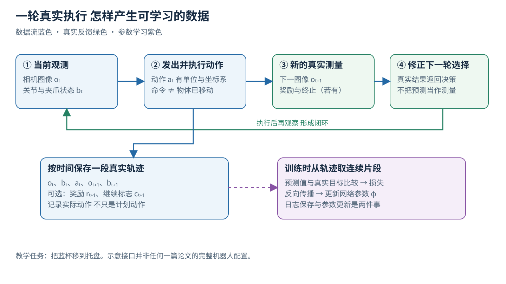
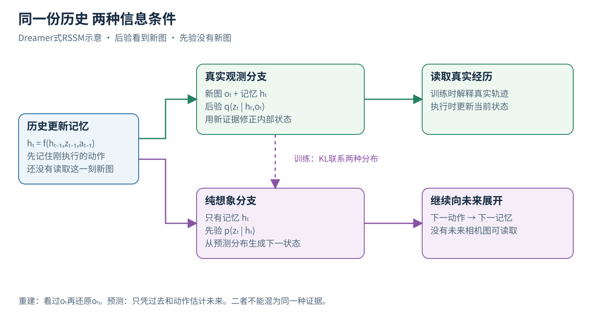
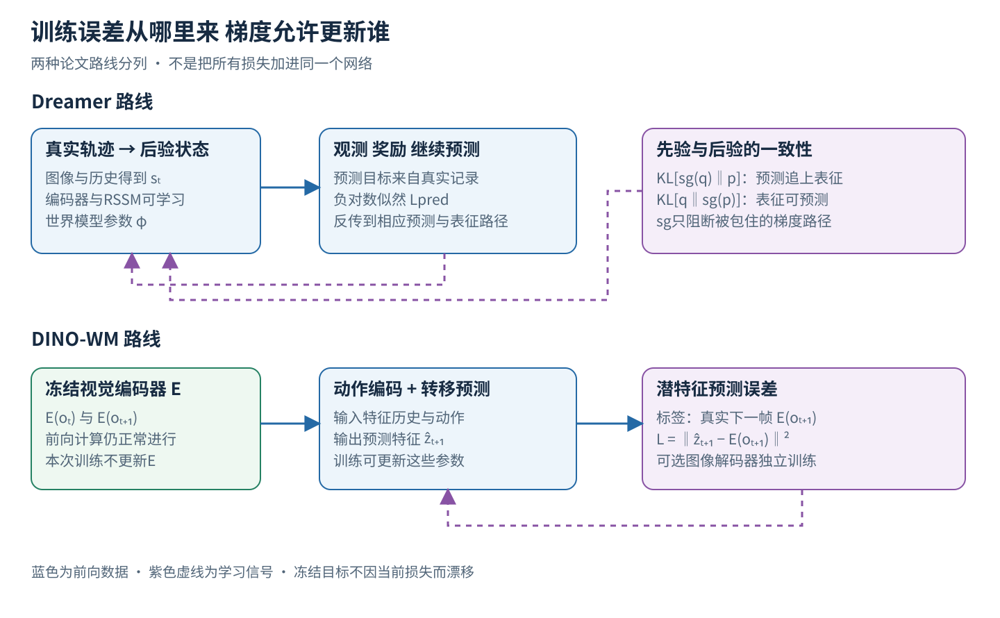
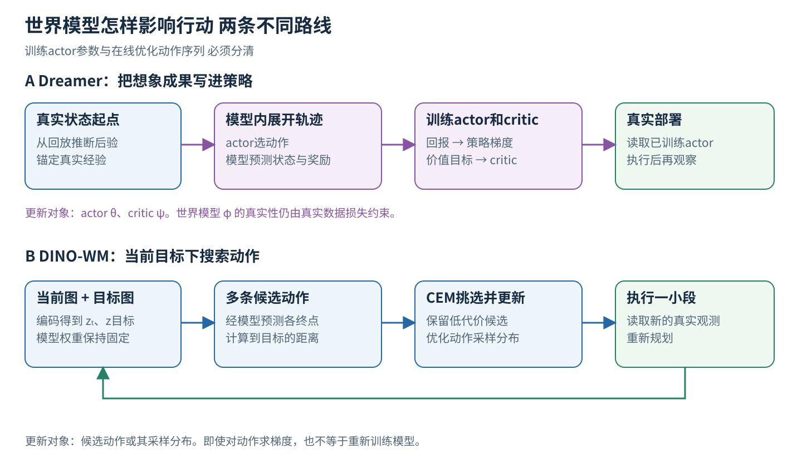
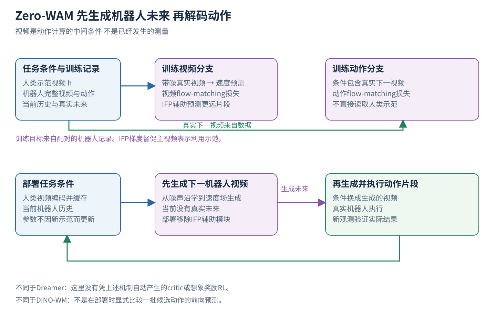

# 世界模型 从一段真实动作学会预测和选择未来

> 状态：逐步讲义 · DreamerV3 按 arXiv v1、Zero-WAM 按 v2

机器人要把蓝杯从桌面移到托盘。相机看到杯子，机械臂也会动，但这些能力还不能回答一个关键问题：从杯柄侧接近和从杯口上方接近，分别可能造成什么结果？如果不试一下，它怎样比较？世界模型研究的就是这类**带行动条件的后果预测**，以及这些预测怎样帮助行动。

本文面向学过基础深度学习、物理和运动学的读者，潜变量与KL、扩散与流匹配、强化学习的通用基础分别见 [16-vae](../../foundations/lessons/16-vae.md)、[17-diffusion](../../foundations/lessons/17-diffusion.md) 和 [05b-reinforcement-learning](../../foundations/lessons/05b-reinforcement-learning.md)。我们先亲手走过一次“记录真实动作、编码观察、预测后果、计算误差、更新模型、选择下一动作”的过程，再看三个系统各自选了哪条路线：DreamerV3（Hafner等2023，在学到的潜空间里想象并训练策略）、DINO-WM（Zhou等，在冻结的预训练视觉特征上学习动力学并做规划）和Zero-WAM（2026，先预测机器人未来视频再解码动作）。

全文中蓝杯、二维特征和数字算例均为原创教学构造。[1][3]

## 一 先明确机器人要预测什么

### 从当前照片到动作后的照片

设相机在时刻t拍到图像oₜ，机械臂读到自己的关节角、夹爪开度等信息bₜ。这些是**观测**：传感器此时给系统的东西。机器人执行动作aₜ，随后得到新图像oₜ₊₁。下标t和t+1表示环境中的相邻时刻；一个时刻可以是一段控制片段的边界。

为了把动作说具体，先设计一个简化接口：aₜ包含末端位置增量Δx、Δy、Δz以及夹爪开合命令。例如Δx=0.01米表示末端目标向该坐标系的x方向移动一厘米。真正的机器人还可能需要姿态、速度、关节限制和控制频率；本例暂不处理它们。动作是一个具有单位、坐标系和执行时间的控制输入。

世界模型接收历史观测与候选动作，预测接下来可能看到什么。策略则接收当前信息，输出要选哪个动作。两者可以分别写成：

预测：当前信息 + 假设动作 → 未来信息

决策：当前信息 + 任务目标 → 选定动作

预测器能说出“这样推可能碰倒杯子”；要在“不要碰倒”与“尽快到达”之间取舍，还需目标、代价或奖励。把预测和选择分开，是读懂后面所有训练图的第一步。[1][2]

### 为什么一张照片不一定够

设两次拍摄时杯子的位置看起来完全相同，但第一次杯子静止，第二次刚被推过、仍在滑动。若模型只读当前照片和同一个动作，它可能得到几乎相同的输入，却面对不同的下一位置。缺失的是速度或历史信息。

因此，模型常把一串观测、过去动作和本体状态综合成内部状态sₜ。它可以是循环网络的记忆，也可以是一段Transformer上下文。sₜ是机器人凭有限证据构造的描述；杯子的质量、桌面摩擦系数、遮挡后的姿态，仍可能未知。

同样，“发送了向前一厘米的命令”之后，杯子怎样动还取决于接触：末端可能根本没接触杯子；接触后杯子也可能滑动或倾倒。学到动作与环境变化的关系，才是动力学预测的工作。它可以利用物理结构，也可以完全由数据拟合。

图1　原创数据流。蓝色实线表示这轮真正发生的信息传递，绿色回路来自执行后的新测量。下面的紫色训练支路稍后才使用这些记录，参数要等训练时才更新。

沿图1走一次：相机拍杯子，控制器执行aₜ，再拍下一张图。把它们按时间对齐保存，形成(oₜ,bₜ,aₜ,oₜ₊₁,bₜ₊₁)。如果环境定义了奖励与终止，再存rₜ₊₁和cₜ₊₁。r是数值反馈；c为1表示仍可继续，0表示本次任务真实终止。实际系统要区分“任务结束”和“日志被时间上限截断”，否则训练目标会出错。

## 二 把观察变成潜在表示

### 编码器到底做了哪一步变换

一张128×128的RGB图片有128×128×3=49,152个数。直接预测每个数当然可行，但杯子的接触关系可能只占很小一块区域，背景纹理却占去大量像素。编码器E把图像映射为特征zₜ=E(oₜ)。z称为潜在表示或latent，是网络内部计算出的表示。

例如可以把图像分成8×8=64个图块，每块得到一个维度为32的向量，总共2,048个特征数。这是帮助理解形状的假想设置。图块表示保留了粗略空间排列，比只用一个全图向量更容易区分“杯子在左”与“杯子在右”。

请区分三种常见的编码方式。Dreamer从自己的任务经验学习观测表征，并用重建等目标约束它；DINO-WM使用预训练DINOv2图块特征，世界模型训练时冻结这个视觉编码器；Zero-WAM把机器人和人类视频送入视频VAE的视觉潜空间，再交给视频与动作分支。[1][2][3] 它们都出现latent，但latent来自什么网络、受什么损失约束、是否更新，答案不同。

### 压缩之后还要保留控制所需的信息

假如编码器几乎不在意杯柄方向，因为从普通图像识别角度看，杯柄朝左朝右都是“杯子”。对于绕开杯柄的抓取，这个差别却很重要。反过来，如果编码器特别关心桌布花纹，模型可能花大量容量预测纹理，却没学会杯子有没有接触桌面。

所以要检查：改变目标位置时表示是否有足够变化；改变背景而不改变任务时，它会不会剧烈变化；两张特征很接近的图像，是否真的意味着机器人任务接近完成。表示的质量由后续用途检验。

## 三 动作条件动力学怎样沿时间展开

### 先学一个最简单的确定性预测器

暂把内部状态直接记为zₜ，训练一个预测网络Fφ：

ẑₜ₊₁ = Fφ(zₜ,aₜ)

φ是这个网络的可训练参数，帽子表示预测值。给它“杯子目前的表示”及“末端向右移动”，它输出下一时刻的表示。若当前图像不足以判断运动状态，就把最近H步的特征与动作一起输入：Fφ(zₜ₋H₊₁:ₜ,aₜ₋H₊₁:ₜ)。冒号表示一段连续序列，H是历史长度。

有了第一步预测，再把ẑₜ₊₁和下一候选动作aₜ₊₁送回Fφ，就得到ẑₜ₊₂。反复展开得到一条预测轨迹，称为rollout。只有起点来自真实观测，后面的状态越来越依赖模型自己。这串结果是条件预测，要与真实执行日志分开保存。

### 为什么模型需要表示多种未来

如果杯子被遮挡，你无法看清末端是否已经接触它。执行同一动作后，杯子可能随夹爪移动，也可能留在原地。这时强迫模型只输出一个平均未来，可能得到“杯子移动一半”这种并不对应任何真实情况的结果。

随机模型用分布表示多个可能状态：pφ(zₜ₊₁ | sₜ,aₜ)。竖线右边是已知条件，左边是要预测的量；pφ表示参数由φ决定的概率分布。采样是从这个分布选出一个可能后果（能采样不等于不确定性已经校准）。

杯子是否已接触可能是确定的，只是机器人不知道。模型的随机表示可能同时吸收测量不确定性、未观测因素和真实噪声。

## 四 Dreamer的先验和后验为什么要同时存在

### 先用动作更新记忆 再决定有没有新证据

Dreamer的RSSM，即循环状态空间模型，把状态写成sₜ=(hₜ,zₜ)。hₜ是确定性的循环记忆，zₜ是随机潜变量。确定性只说明相同输入与参数给出同样的h。先验、后验与KL的基础见 [16-vae](../../foundations/lessons/16-vae.md) 第 2–4 节。下面采用与Dreamer方法一致的教学记法：[1]

hₜ = fφ(hₜ₋₁,zₜ₋₁,aₜ₋₁)

fφ是记忆更新网络。它读取旧记忆、旧潜变量和刚执行的动作，先形成对当前情况的预测背景。比如它记得“夹爪在杯子左边”，并知道刚刚执行了向右接近。

如果此刻已经拍到真实图像oₜ，表征网络可以用新证据修正状态：

zₜ ∼ qφ(zₜ | hₜ,oₜ)

q是近似后验分布，∼表示从分布采样。把真实图像也放进条件，是这里最关键的区别。若新图显示杯子仍在原地，模型应有机会纠正此前“已经抓住”的预测。

如果我们只是在内部想象，没有新图像，则只能用：

ẑₜ ∼ pφ(zₜ | hₜ)

p是动力学先验。它没有oₜ输入，只能依靠历史及前面的动作推断未来：它有历史，只缺当前的新测量。后验是一种结合新测量的近似推断，仍会受感知错误影响。

图2　原创先验后验拆解。上支需要真实相机图，适用于读取真实记录或真实交互；下支没有未来相机图，适用于模型内滚动。训练中的KL将两种分布联系起来，两者的输入路线仍然不同。

### 为什么不能想象时也使用后验

因为后验需要你还没看到的未来图像。训练数据里确实有oₜ₊₁，但部署前不可能事先拍到尚未发生的结果。若评测预测未来时偷偷把oₜ₊₁送进后验，再展示重建得很好的图，就只证明模型会解释已知观测，不能证明模型能预测未知未来。

这也是“重建”和“预测”必须分开的原因：从已经看到的oₜ编码再还原oₜ，是重建；仅凭过去和动作生成oₜ₊₁，是预测。同一个解码器可以参与两者，但信息条件不同，难度也不同。

DreamerV3 v1采用多组分类潜变量，类别由学习得到。前向离散采样与反向训练之间使用straight-through估计等技巧，它给出的是离散采样的近似梯度。[1]

## 五 训练时每一种损失究竟在纠正什么

### 第一类信号 从状态还原刚才看到的内容

若模型从oₜ得到状态sₜ，再用解码器D得到ôₜ=D(sₜ)，就可以比较ôₜ与oₜ。简单教学版本用平方误差：

L图像 = 平均像素上的(ôₜ − oₜ)²

这条损失把梯度送给解码器，并在允许更新的路径上送回状态表征与编码器。它要求表示保留足够信息以解释输入。

Dreamer实际将观测、奖励和继续标志的预测写成负对数似然（见 [分类与概率](../../foundations/lessons/modules/objectives/02-classification-probabilities.md)），并对不同变量采用相应输出分布与尺度处理，上面的MSE是简化版。[1]

### 第二类信号 用真实下一帧教潜在动力学

对确定性潜空间预测器，可以用编码后的真实下一帧作目标：

L潜在 = ‖Fφ(E(oₜ),aₜ) − E(oₜ₊₁)‖²

双竖线平方表示把各特征维度的差平方后相加或按实现平均。这里的标签不需要人逐帧写“杯子移动了几毫米”；时间对齐的下一张照片经过编码器，就产生了监督目标。这通常称为自监督预测，但动作仍要有真实记录。

DINO-WM采取这类潜特征预测路线：视觉编码器冻结，梯度训练动作编码与转移预测模块；可选像素解码器另行训练，不把图像重建损失强行接入主动力学训练。[2] 冻结的实际含义是E的参数不被优化器改变，E仍参与前向计算。

如果E也一起自由更新，目标E(oₜ₊₁)可能随着优化漂移。极端时E把所有图像变成同一个常数，预测损失很小，却没有有用信息。冻结预训练表示是一种避免这个特定坍缩路径的方法；它也带来限制：原表示没有保留的控制细节，动力学网络很难凭空恢复。

### 第三类信号 让先验学会追上看到证据的后验

Dreamer用KL散度比较后验q与先验p。可以把它理解为“已看到新证据的分布，与只凭历史预测的分布，哪里不一致”。若一个教学二分类后验q=(0.8,0.2)，先验p=(0.5,0.5)，则：

KL(q ‖ p) = 0.8 ln(0.8/0.5) + 0.2 ln(0.2/0.5) ≈ 0.193

两个数字只为计算方便，真实latent类别是学习出来的（KL散度的定义见 [16-vae](../../foundations/lessons/16-vae.md) 第 4 节）。

若同时让两边无限制地迎合对方，表征可能牺牲必要信息。DreamerV3把KL分为带不同停止梯度位置的动力学项与表征项：Ldyn=max(1,KL[sg(q)‖p])，Lrep=max(1,KL[q‖sg(p)])。sg表示这条损失不沿括号内那条路径反传；max(1,·)在KL低于阈值时停止进一步压缩。v1将它们以0.5和0.1的权重加入预测损失。[1]

这两项前向数值可能相同，反向路线却不同。第一项把q当目标，让p学会预测；第二项把p当目标，给q保留可预测性的压力。停止某条梯度只切断这一项的路径，其他项仍可能更新共享部件（stop-gradient 与冻结的区别也见 [VLA 讲义](vla.md) 9.3 节）。我们的0.193小于1，所以在这个极简示例中，截断后的KL项为1，局部不再贡献压小KL的梯度。

### 第四类信号 教模型预测任务价值所需的反馈

若环境给出奖励rₜ和继续标志cₜ，可以从sₜ预测r̂ₜ和ĉₜ。简单的奖励回归用(r̂ₜ−rₜ)²；继续预测可以用二元交叉熵：

L继续 = −[cₜ log ĉₜ + (1−cₜ) log(1−ĉₜ)]

ĉₜ是模型估计的继续概率。若任务确已终止，cₜ=0，但模型给ĉₜ=0.9，就产生较大惩罚。这对想象控制很重要：继续标志让想象在杯子摔碎之后停止累积“顺利放进托盘”的奖励。是否将摔碎设为终止，由任务设计决定。

奖励标签来自任务定义或环境反馈，奖励头只学习预测它。奖励预测损失小，与策略已经获得高奖励，是两个评价对象。一个模型可以准确预测“这次会失败”，但如果策略仍不断选择这种动作，任务依然失败。

图3　原创训练信号图。箭头旁标明损失使用的标签。紫色虚线代表参数学习路线；图中分列Dreamer和DINO-WM两种配方。

### 用一个标量算清楚梯度怎样改变预测

把复杂特征暂缩成一个数zₜ=0.20，动作aₜ=0.10，模型设为ẑₜ₊₁=zₜ+φaₜ。当前参数φ=0.50，因此预测为0.25。编码真实下一帧得到目标zₜ₊₁=0.28。

平方损失L=(0.25−0.28)²=0.0009。对φ求导，∂L/∂φ=2(0.25−0.28)×0.10=−0.006。若学习率η=0.10，一次梯度下降（见 [梯度、反向传播与 SGD](../../foundations/lessons/modules/optimization/gradient-sgd.md)）得到φ新=φ旧−η∂L/∂φ=0.5006。下次同一输入的预测略微增大，朝0.28靠近。

这就是“学会动作后果”在最小模型中的具体含义：改变预测函数的参数。这个标量是归一化教学特征（φ只有在明确物理模型与可辨识条件下才能解释为摩擦系数之类的物理量）。

## 六 用预测改善行动有两条不同的路线

### 路线A 训练时在想象里练策略

Dreamer从真实记录推断出后验状态，再从这里开始想象。actor πθ根据状态选择动作，世界模型预测下个状态、奖励和继续概率，actor再选动作。θ是actor参数，φ仍是世界模型参数。[1]

想象片段提供“如果按当前策略这样走，预计总共能得到多少奖励”。critic vψ(s)学习从某状态继续行动的长期回报，ψ是critic参数。奖励头回答眼前一步；critic回答后续累积。

暂设未来三步预测奖励为0、0、10，折扣γ=0.9，则回报为0+0.9×0+0.9²×10=8.1。γ控制远期奖励的权重。若只看第一步奖励，这个动作似乎没价值；把后续奖励算回来，早期准备也可以得到训练信号。

短想象不可能完整展开所有长期任务，所以Dreamer把片段尾端接到critic的估值，再用λ-return混合多步结果。本节沿用转移记录的索引：Rₜ从状态sₜ出发，动作aₜ执行后才得到rₜ₊₁与cₜ₊₁。教学式因此写为Rₜ=rₜ₊₁+γcₜ₊₁[(1−λ)vψ(sₜ₊₁)+λRₜ₊₁]。R是混合回报，λ控制对继续展开回报的依赖，c控制是否继续。若rₜ₊₁=1、cₜ₊₁=1、γ=0.9、λ=0.5、vψ(sₜ₊₁)=4、Rₜ₊₁=6，则Rₜ=1+0.9×5=5.5。

critic把回报当监督目标；actor提高预计回报较高的行为的概率。对于DreamerV3 v1，离散动作使用REINFORCE类估计，连续动作可通过学习到的动力学传递策略梯度。训练actor时，世界模型只由真实数据损失约束，不随actor目标改写。[1]

再把“用回报训练”拆到损失和梯度。教学critic可用L价值=(vψ(sₜ)−sg(Rₜ))²。若预测4、目标5.5，损失2.25，对预测值的导数为−3；梯度下降会推高估值。sg固定目标，避免网络仅靠改变目标减小误差。DreamerV3实际用symlog刻度上two-hot目标的分布式预测损失，这条MSE是简化版。[1]

离散actor的核心教学式是L策略=−sg(Aₜ)log πθ(aₜ|sₜ)，其中Aₜ=Rₜ−vψ(sₜ)是动作的估计回报相对基线的优势。若Aₜ=2、所选动作概率0.2，损失约3.219；对该概率的导数为−2/0.2=−10，故梯度下降倾向提高其概率。Aₜ为负时方向相反。sg表示本次actor更新不通过A反传到价值或回报计算，学习信号通过log概率回到θ。实际算法还处理回报尺度与探索熵，以上是展示方向的简化式。

连续actor则可沿θ→动作a→固定世界模型φ下的预测状态→预测回报J求导，以L策略=−J推动θ。固定φ仅意味着优化器不修改世界模型权重；模型对输入动作的导数仍可计算。若把这条输入导数也切断，便失去这条动力学策略梯度。能反传也不保证模型正确，策略仍可能利用模型误差。

**部署时发生什么？** 真实图像更新内部状态，已经训练好的actor直接选动作，机器人执行，再读取反馈。Dreamer部署时直接用actor选动作，无需每一步重新搜索候选动作序列。想象的成果已经部分写进actor参数，这与下一条在线规划路线不同。

### 路线B 部署时用模型搜索动作序列

DINO-WM用当前图像oₜ和目标图像o目标构建潜表示。然后提出多条候选动作序列，逐条通过动力学模型滚动，比较预测终点与目标表示的距离，再选择较好的序列。它使用MPC，即模型预测控制：规划一段，执行前面一小段，重新观察并重规划。[2]

为了看清比较方法，假设目标特征z目标=(1,0)。候选A的预测终点为(0.8,0.1)，平方距离是(0.8−1)²+(0.1−0)²=0.05；候选B的预测终点为(0.4,0.2)，距离为0.40。若除此之外没有别的约束，就优先A。这里的两个特征轴是假设数字，不代表真实位置或可解释物体属性。

论文主要采用CEM，即交叉熵方法，反复采样动作序列、保留代价较低的一部分，再根据这些较好候选调整采样分布。CEM优化的是本轮动作搜索分布，网络权重不变。论文也比较了对动作求梯度的规划方式；它的主要实验里CEM表现更好。[2]

**最容易混淆的两种更新。** 世界模型训练时，改的是网络参数φ，让预测更准确；在线规划时，可以冻结φ，改的是待执行动作aₜ:ₜ₊T₋₁。后者即使使用反向传播，更新的也只是动作。优化变量是什么，比“有没有梯度”更能区分训练与规划。

图4　原创决策路线图。上路把预测收益用于训练actor，部署读取actor；下路在当前目标下搜索动作序列，执行后再规划。两路都必须回到真实环境验证。

## 七 Zero-WAM 是第三种结构

### 它先预测想要的机器人未来 再反解动作

现在用户给机器人一段人类演示：把蓝杯放进托盘。演示中的人手、桌子、镜头都与机器人不同，Zero-WAM因此让演示承担任务说明：机器人下一段应该发生什么语义变化。[3]

它在机器人历史和任务条件下先预测下一段机器人视频，再根据该视频及机器人历史解码动作。视频与动作由不同Transformer分支处理，以注意力交换信息。人类视频影响视频预测，动作分支不直接读取人类视频。形式上是“先生成未来，再用逆动力学解码怎样到达这个未来”，与“给定候选动作再预测后果”的前向模型用途有所区别。[3]

这里的逆动力学是功能描述：已知前后状态，推断促成转移的动作。不同轨迹可能到达相同终点，所以动作模型也需要表示分布与执行约束。

### 学习信号是视频和动作的流匹配

flow matching（流匹配）的完整符号与算例见 [VLA 讲义](vla.md) 第六节，加噪与数值积分的基础见 [17-diffusion](../../foundations/lessons/17-diffusion.md)。这里先把一个视频潜变量或动作片段整体记为x。真实目标x₀来自训练记录，ε是随机高斯噪声。用u表示生成过程的噪声时间，以免和机器人环境时刻t混淆：

xᵤ=(1−u)x₀+uε，目标速度v*=ε−x₀

u=0是干净数据，u=1是噪声。网络读xᵤ、u及历史条件，预测沿这条插值路径的速度vθ，训练损失是‖vθ−v*‖²。生成时从噪声出发，沿学到的速度场反向积分到干净端。u是生成过程的噪声时间，与机器人的控制时间是两条时间轴（见 [17-diffusion](../../foundations/lessons/17-diffusion.md) 第 7 节）。[3]

一个一维算例：x₀=2，ε=0，u=0.25，得到xᵤ=1.5、v*=−2；若网络预测−1.5，平方误差为0.25。这个误差训练的是去噪路径上的速度预测（−2是生成空间中的速度，不是杯子的物理速度）。

Zero-WAM对视频和动作都设置流匹配目标；人类视频条件样本还加入IFP，对更远的未来视频片段进行辅助预测。IFP只能通过当前机器人视频分支的表示得到人类示范信息，促使主分支利用演示；部署时移除这些辅助模块。[3] 这是训练压力与数据设计，与Dreamer的奖励预测、critic、actor回报优化和KL项属于不同的学习信号。

### 训练时的未来视频和部署时的未来视频来源不同

训练动作分支时，未来视频条件来自数据中的真实下一片段，这是teacher forcing。部署时未来还没有发生，只能换成视频分支生成的片段。[3] 因此动作训练时见到的条件更干净，部署时却必须承受视频预测误差。

图5　原创Zero-WAM拆解。绿色框是真实记录，紫色框是模型生成。请特别对照两个“动作分支”的上游：训练读取真未来，部署读取生成未来。IFP只在训练出现。

这个系统展示了第三种关系：预测生成本身就是动作策略内部的桥梁。Dreamer把模型用于策略训练，DINO-WM显式比较许多候选控制序列，Zero-WAM则把未来视频当作动作解码的条件。新任务时把示范视频加入输入就能改变输出，模型参数不变；这依赖此前的大规模训练。

## 八 三种系统到底提供了怎样的证据

DreamerV3 v1的主要证据是跨多种控制与游戏任务的强化学习表现。它说明潜空间模型与想象学习能在所测环境中有效使用交互经验。阅读时应把2023年v1与2025年后续发表版本的实验设置分开。[1][4]

DINO-WM用离线轨迹学习环境动力学，再以目标图像进行规划；视觉编码器预训练与环境动力学训练是不同阶段。标题中的zero-shot planning要结合留出设置理解：看留出的究竟是新目标、新布局、新物体，还是新动力学条件。[2]

Zero-WAM v2在RoboTwin 2.0（Chen等2025的双臂操作数据生成器与benchmark，共50个双臂任务）上，于43个任务后训练、7个留出任务测试，留出任务宏平均为46.95%（这个数字只对这7个留出任务成立，不代表任意新操作都接近一半成功）。真机还先用已见配置适配机体，再测试留出配置。[3]

这三种结果的任务输入、动作形式、训练数据、反馈来源、规划预算和成功判据都不同，不宜直接排名。更有意义的比较是先固定问题：你需要低延迟执行、目标图像规划，还是通过视频说明新任务？随后比较满足相同接口与预算的方法。

## 九 生成可信视频之后 还要检验物理因果

### 视觉连续性只是第一层检验

一个视频模型可能让杯子平滑地从桌左移到桌右，画面没有闪烁，但它也可能省略必要接触，让夹爪穿过杯柄，或者在遮挡后改变杯子身份。像素与感知质量指标可以反映图像相似性，不能单独证明动作造成了正确后果。

进一步，Transformer的causal mask只限制“预测当前时不能看到未来token”，其中causal是时间信息流约束。把动作作为输入是行动条件建模的重要一步，但数据中动作选择可能与隐藏状态强相关，陌生干预下仍会失效。

例如训练数据里机器人只推空杯，从未推满水的杯子。模型可能把相同视觉外观映射为相同未来；改变质量后，预测才暴露问题。若质量在图像里不可见，合理实验要明确提供了哪些信息、是否允许试探性观察。

### 可以怎样设计更有区分力的实验

第一，固定当前场景，改变动作方向或幅值，比较模型预测与真实转移。这检查动作是否真正控制了预测。

第二，保持物理关系不变，只改变相机视角或背景。若有明确等变主张，就检验输入坐标变换后，输出是否按规定变换。

第三，改变摩擦、质量、遮挡或物体配置，检查泛化边界，并分别记录一步误差与多步误差。一步预测好，不保证十步滚动可靠，因为模型会逐渐读到自己的错误输出。

第四，让真实策略利用这个模型行动，比较使用与不使用模型、错误模型、相同计算预算下的结果。预测质量改善只有传递到决策，才支持“它对这个控制任务有用”。以上是本文提出的评估设计。

## 十 用一张纸走完自己的世界模型实验

先画一个仅含桌面、杯子和夹爪的二维任务。规定动作单位、采样间隔、目标位置和终止条件。收集或设想二十条短轨迹，每条都同时保存观测与真正执行的动作。

接着选一个可解释的教学状态，例如杯子位置和速度。先用它训练一个简单动力学网络，验证输入动作改变时输出是否相应变化；再把状态换成图像编码特征。这样可以区分“动力学没学好”和“视觉表示丢了信息”。

第三，用训练集构造下一步预测目标，用留出的连续轨迹检查多步滚动。轨迹切分要先做再取窗口，避免同一条轨迹相邻片段同时落入训练和测试。若测试目标与训练数据太接近，别把插值成绩写成新物理规律泛化。

最后只选择一种决策方式：要么训练actor在模型中练习，要么冻结模型用候选动作规划。记录预测误差、真实成功率、执行时间和失败类型。若后来想混合两条路线，先说明为什么混合、哪个变量被训练、额外计算换来了什么收益。

自查时回答四个问题：当前这张图是真实测量还是生成结果？当前误差的标签从哪里来？这次优化改了网络参数还是动作序列？最终成功由新的真实证据还是模型自己的叙述确认？能够顺着一次拿杯子过程回答它们，就已经越过只会解释“世界模型是什么”的阶段。

## 批注

**易误读**
- 名称里出现“世界”不意味着模型内置了牛顿方程；向量的第7维也不一定是横坐标，第12维不一定是摩擦系数（第一、二节）。
- 模型可能在完全陌生的物体上给出非常自信却错误的分布；随机表示不能自动解释成某一种物理噪声源（第三节）。
- 简化的MSE、KL和价值损失都不是DreamerV3的原始实现（第五、六节，[1]）。
- 想象轨迹不是新获得的真实证据；在线规划时对动作反向传播，也不意味着模型在学习新的世界规律（第六节）。
- DreamerV3 v1的跨任务强化学习结果，不能直接推出对家用机器人接触、安全和长期物体身份的同等保证（第八节，[1]）。
- DINO-WM标题中的zero-shot planning不等于“完全没看过该环境的任何轨迹”：它先用该环境的离线轨迹学动力学（第八节，[2]）。
- Zero-WAM新任务执行时不微调，不等于从未为该机器人训练（第八节，[3]）。
- Transformer的causal mask不等于模型学到了具有可干预语义的因果图（第九节）。
- 蓝杯、二维特征和数字算例均为原创教学构造，不是论文实验；DreamerV3按2023年arXiv v1口径，与2025年Nature版本[4]的配置和成绩分开。

**与其他论文的关联**
- 第七节Zero-WAM的视频与动作流匹配，与 [VLA 讲义](vla.md) 中π0.5动作expert的流匹配是同一训练目标（插值式、目标向量场、从噪声端积分），区别在生成对象是视频潜变量还是动作块；论文解读见 [Zero-WAM](../papers/2026/zero-wam.md)。
- 第四至六节的RSSM与想象训练见 [DreamerV3 过程精读](../baselines/dreamerv3.md)；第六节路线B的MPC与 [运动控制与足式运动](control-locomotion.md) 第5节是同一“规划一段、执行一步、重新规划”结构，只是动力学换成了学到的潜空间模型。

## 参考文献与继续阅读

[1] Hafner等. Mastering Diverse Domains through World Models. arXiv:2301.04104v1，2023。核对RSSM、模型损失、KL平衡、想象行为学习与动作梯度口径。https://arxiv.org/pdf/2301.04104v1

[2] Zhou等. DINO-WM World Models on Pre-trained Visual Features enable Zero-shot Planning. arXiv:2411.04983v2，2025。核对§3.1编码器冻结、latent预测、可选独立解码器，§3.2与附录A.5规划。https://arxiv.org/html/2411.04983v2

[3] Zero-WAM In-Context World Action Models for Zero-Shot Cross-Task Manipulation. arXiv:2608.26103v2，2026。核对§2–4，特别是视频动作分解、teacher forcing、flow matching与IFP；版本按v2固定。https://arxiv.org/html/2608.26103v2

[4] Hafner等. Mastering diverse control tasks through world models. Nature，2025。仅用于标明后续发表版本，本文不混用其配置与成绩。https://www.nature.com/articles/s41586-025-08744-2

继续读本库：[DreamerV3过程精读](../baselines/dreamerv3.md) · [Zero-WAM论文解读](../papers/2026/zero-wam.md) · [具身Agents过程教学](embodied-agents.md)
