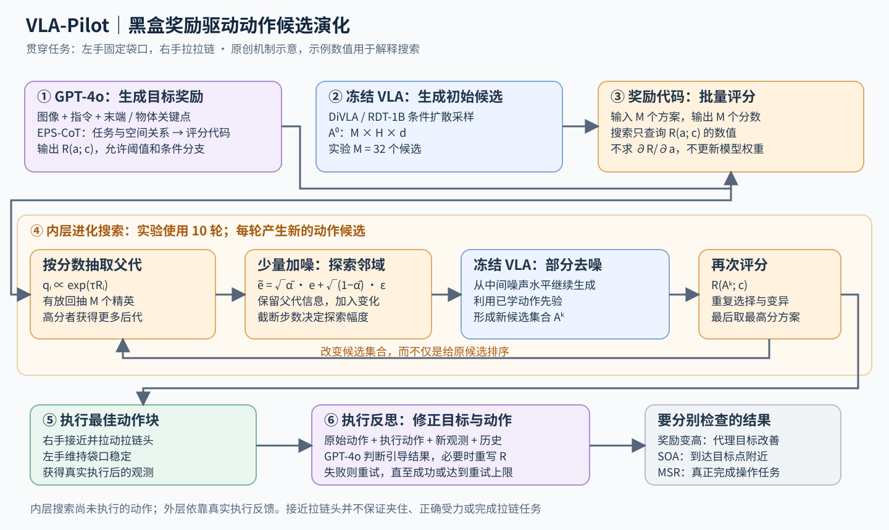

# VLA-Pilot：让大模型写评分程序，用进化搜索改进动作候选

> 状态：技术精读 · arXiv:2511.14178v2 · 未复现

## 一句话

用冻结的多模态语言模型从场景和指令中生成黑盒奖励，再反复“评分、保留、加噪、去噪”改进预训练策略的动作候选，最后用执行后的视觉反馈修正奖励和动作。

## 它要解决的问题

假设要求双臂机器人拉开袋子的拉链：一只手稳定袋口，另一只手靠近拉链头并沿正确方向拉动。视觉语言动作模型（VLA：把图像和语言指令映射为机器人动作的模型）可能分别知道抓、拉、固定，却在这次场景里选错手、靠错位置，或者双臂配合不好。

一种补救是让策略一次生成很多方案，再由验证器打分。验证器就是判断候选动作是否符合目标的模块。若候选中本来就有好方案，挑选会很有效；若所有方案都偏离拉链头，反复从原集合中排序的收益有限。VLA-Pilot 的增量是让候选集合本身继续演化，同时由通用多模态大语言模型（MLLM：能联合理解图像和文字的语言模型）定义当前任务的评分标准。[1，§I–III]

这篇工作最早于 2025 年 11 月公开，2026 年 4 月的 v2 报告了仿真与跨机器人结果。它适合作为理解“高层模型保持通用，动作端在部署时适配”的基础机制：高层输出奖励程序，底层保留预训练技能，计算预算花在动作搜索上。

## 核心想法

系统把“理解目标”“产生动作”“检查结果”分成可以交换明确信息的模块：

- **目标推理**：从观测和指令生成评分程序，把拉链任务转换成双手与关键部位之间应满足的关系。
- **动作优化**：让较好候选获得更多后代，用冻结扩散策略对后代重新去噪，逐轮形成更符合目标的动作分布。
- **执行反思**：执行后重新观察，检查评分标准和实际结果是否一致，需要时重写奖励、再次搜索。[1，Fig.2]

这里最值得注意的是“奖励可以不可微”。方法只需要对一个候选返回分数，因此能容纳阈值、条件分支或离散判断。动作改进来自进化搜索提供的选择压力。

## 机制

### 1 高层模型的输入和输出

输入上下文 cₜ=(oₜ,l)，即当前视觉观测与语言指令。EPS-CoT（Embodied Policy Steering Chain-of-Thought：把任务确认、场景理解、空间信息补充和奖励生成组织起来的提示流程）使用 GPT-4o 完成目标解释。它先确定要完成的任务，再结合场景关系和机器人可操作部位，最后生成评分代码。[1，§III-B、§IV-A]

空间信息由 DINO（自监督视觉特征模型）和 SAM（输出物体像素区域的分割模型）帮助提取，形成末端与对象的关键点。关键点是用于表达位置关系的少量代表点，例如左夹爪、右夹爪、袋口和拉链头。图像决定对象身份，点的几何关系让“固定这里、靠近那里”变成可计算条件。

输出是 R(a;c)：输入一个动作方案 a 和上下文 c，返回一个分数。运行候选搜索时，系统执行这段奖励代码；大模型负责生成或修订它。在拉链例子中，一个教学性的评分可以奖励右手终点靠近拉链头、左手靠近支撑位置，并处罚两只手同时离开目标。具体权重与分支是目标描述的一部分。[1，式 2]

### 2 候选动作是什么数据

论文用 aₜ 统一表示一个动作提案。为了展开其接口，可以将一次生成的动作块记为 a∈ℝᴴˣᵈ：H 是未来动作步数，d 是底座定义的动作维度；动作块就是一次预测的一段控制命令。M 个方案组成候选张量 A∈ℝᴹˣᴴˣᵈ，评分后得到 r∈ℝᴹ，最后挑出其中一个 H×d 方案执行。若底座只预测一步，可视为 H=1。

双臂末端控制的教学表示可以令每步包括两只手各自的平移、旋转和夹爪变量，奖励从这些动作计算与关键点有关的轨迹。但实际 d、归一化、坐标系和执行长度须跟随具体底座接口。论文的主要底座是 DiVLA（把语言生成与扩散动作生成结合的策略）和 RDT-1B（面向双臂操作的扩散动作基础模型）；它们已有自己的动作表示。[1，§IV-A]

首次采样时，冻结策略根据 cₜ，从各自独立的噪声生成 M 个动作方案。论文使用 M=32，并进行 K=10 轮演化。这两个数字描述每次部署的搜索预算：前者决定同时保留多少可能性，后者决定候选能改进多少轮。

### 3 评分如何变成选择压力

对第 k 轮候选逐个执行奖励代码，得到 rᵢ=R(aᵢ;cₜ)，再计算：

qᵢ=exp(τrᵢ)/Σⱼexp(τrⱼ)。

qᵢ 是第 i 个候选被抽为下一代父代的概率。论文称 τ 为温度参数，但在这个乘法写法下，τ 越大，分数差被放大得越强。随后按 q 有放回地抽取 M 个精英候选；精英就是更可能留下后代的高分方案。[1，式 4–5]

示例数值：三个拉链动作候选的奖励分别为 −2、−1、0，令 τ=1，得到 q≈(0.090,0.245,0.665)。第三个候选会更频繁地被复制，第一、第二个仍有机会保留。这样既集中于较好区域，也留下一定探索余地。这里的“精英选择”按概率抽样，最高分方案可以重复出现；它与固定选前几个的截断排序有不同的多样性。

### 4 为什么要给好动作重新加噪

复制只能重新分配已有候选，变异才产生新动作。对选中的精英 e，执行少量前向加噪步骤，用等价的一步式表示：

ẽ=√ᾱₙ·e+√(1−ᾱₙ)·ε，ε∼N(0,I)。

ᾱₙ 是截断到第 n 步时的累计噪声系数。然后从这个中间噪声水平出发，调用原 VLA 的噪声预测器，走完对应的反向去噪步骤，得到新候选 a′。截断扩散就是只使用完整加噪/去噪链的一小段，保留父代信息，同时探索附近变化。[1，§III-C]

仍看一个动作坐标的示例数值：父代的归一化右手位移为 e=0.20，ᾱₙ=0.81，ε=0.5，则加噪后得到 0.9×0.20+√0.19×0.5≈0.398。这个中间值随后交给冻结去噪器，后者根据当前图像与指令生成符合既有动作规律的新方案。最终输出值由模型计算，不能从加噪公式直接确定。

两步各有职责：噪声提供探索，学习过示教的去噪器提供动作先验。动作先验就是模型已经学到的常见、协调的运动分布。若只随机扰动命令，容易破坏动作结构；使用条件去噪，可以把探索往底座熟悉的运动区域拉回。完成 K 轮“评分→抽父代→变异”后，选最终候选集合 Aᴷ 中分数最高的方案执行。[1，Algorithm 1]

在拉链例子里，父代可能已经把右手带到拉链附近，却偏了一点；后代搜索能找到更接近关键点的轨迹。若底座完全缺少如何稳定袋口、施力或保持抓握的经验，则还要靠动作能力本身的适配来补足。

### 5 训练损失、推理目标与梯度的边界

DiVLA 和 RDT-1B 的动作生成能力来自此前的训练。以扩散动作生成的一般形式作解释：训练时给示教动作加入已知噪声，学习预测噪声，可写成 L(θ)=E‖ε−εθ(aⁿ,c,n)‖²。这里 θ 是网络参数，梯度用于让网络学会去噪；这条式子只是说明扩散底座的典型训练机制，VLA-Pilot 没有新增这一训练阶段。

VLA-Pilot 的部署目标则是提高 R(a;c)，变量是候选动作及其采样分布。奖励无需对动作可微，搜索不计算 ∂R/∂a，也不计算 ∂R/∂θ；GPT-4o、奖励代码生成过程和冻结 VLA 都不参与基于任务奖励的反向传播。去噪器每次正常前向计算，新的动作来自抽样和变异。[1，§III-B–C]

这把两件常被混在一起的事分开了：推理中反复优化动作，可以完全不更新模型权重；高层模型保持冻结，也不意味着系统所依赖的动作模型从未训练过。需要动作模块微调的系统仍可考虑这个接口，但该组合须另外验证。

### 6 执行之后如何修正理解

一次局部几何高分，可能对应“夹爪到了拉链附近，却没夹住”。VLA-Pilot 把原始动作 a₀、被选中的动作 a*、执行后新观测和此前的目标推理记录重新提供给 GPT-4o，让它输出引导是否成功的标记，并在奖励理解有误时生成新奖励。[1，§III-D]

若反馈表明右手走到了错误对象，修改的是目标解释；若目标没问题、动作效果不足，则重新搜索动作。成功时退出，失败时继续到预设最大重试次数。系统因此有两个时间尺度：内层在尚未执行前用奖励搜索动作，外层在真实执行后更新任务理解。内层得到高分，外层才能检查这一代理目标是否真的带来任务进展。

## 证据：哪个实验支撑哪个主张

MSR（Manipulation Success Rate）统计完整操作任务成功的试验比例；SOA（Steering Objective Alignment）统计执行后状态是否进入目标关键点阈值。前者评价任务，后者评价引导目标。这一分开报告的做法很重要，因为“到了正确位置”与“真的拉开拉链”有距离。

| 主张 | 支撑实验 | 怎么读 |
|---|---|---|
| 冻结底座可以从动作搜索获益 | DOBOT 双臂平台六项任务中，DiVLA 的平均 MSR 从 0.31 到 0.62，RDT-1B 从 0.30 到 0.60（Table II） | 这是增加约 31 和 30 个百分点，比较对象是各自未引导底座 |
| 改变候选比只排序重要 | 六项仿真任务完整方法平均 MSR 为 0.65，换成只选择为 0.54；去掉结构化目标推理为 0.57，去掉执行修正为 0.60（Table I） | 最大消融下降来自取消演化；仿真包含 ManiSkill3 单臂任务与 RoboTwin 双臂任务 |
| 机制可迁到另一台机器人 | Franka Panda 四项单臂任务中，DiVLA 加方法的 MSR 分别增加 21–31 个百分点（Table IV） | 支持两种平台上的可用性；动作接口适配仍是部署的一部分 |
| 引导目标对齐仍不足以完成接触任务 | DOBOT 拉拉链任务，DiVLA 加方法的 SOA 为 0.55，MSR 为 0.39（Table II） | 几何对齐后的抓握、接触和协调仍会失败 |

真机主平台是 DOBOT X-Trainer，由两只 Nova2 六自由度机械臂及各自夹爪组成。仿真每任务报告 250 回合，按原文所称的 10 个种子分别汇总。与微调的比较使用每任务 50 条示教：图 7 显示该设定下表现相近，支持先试部署时搜索的实践价值。[1，§IV]

## 局限与后续

第一，算法要求能访问“给带噪动作继续去噪”的接口。对只暴露最终动作、离散 token 或不同生成机制的策略，需要重新设计变异算子。这里的 token 指模型处理的离散符号，逐符号动作生成与连续扩散的中间状态接口不同。[1，§V]

第二，推理时间有代价。论文报告每个 steering step，即一次引导步骤，平均耗时 2.41 秒，其中目标推理与反思各占约 0.7 秒；这更适合低频任务决策或动作块级纠偏，实际控制还要配合底层执行节奏。更多候选、更多演化轮数通常改善结果，但截断加噪过多会破坏父代信息；论文实验中超过五步后性能下降。[1，Table V、Fig.9]

第三，关键点评分压缩了物理世界。论文承认对延迟效果、可变形物体交互等情形可能脆弱。拉链任务已展示这种边界：几何对齐改善，并未让抓握与受力问题消失。[判断] 对此应比较更丰富的接触反馈、可训练动作模块与搜索的组合，而不把所有失败都归为选错候选。

## 批注

**易误读**
- 本文的分布内/分布外划分依据是基线外部验证器在训练中是否见过场景；不能直接改写成“所有底座训练数据均未出现过这个任务”。[1，§IV-A]
- 实验底座是 DiVLA 与 RDT-1B，主真机平台是双臂 DOBOT，另有 Franka 迁移测试；π0 虽出现在相关工作中，并非这组方法增益的被测底座。
- 论文式 1 先用原始候选集合 A⁰ 表达选择问题，完整算法最后从演化后的 Aᴷ 中选择。只照着式 1 理解会漏掉核心增量。
- 原文称反向去噪使动作留在数据流形上；这里应理解为借用学习到的动作先验，论文没有提供硬碰撞、动力学可行性或任务成功的形式保证。
- MLLM 的反思成功标记与用于实验统计的 MSR 有不同职责。用户指令的正确解释、奖励对齐与真实成功应分别验证。

**与其他论文的关联**
- [VLS](../arxiv-2602.03973/reading.md) 把奖励限制为可微几何函数，直接改变动作变量；VLA-Pilot 允许黑盒评分，靠选择与变异改进动作。这是奖励接口对优化器选择的直接影响。
- [Diffusion Policy](../diffusion-policy/reading.md) 的去噪过程在这里兼任“变异后的动作修复器”，使已有生成器成为推理搜索算子，而不只是一次性动作来源。[判断：结构对应]
- [SayCan](../saycan/reading.md) 用语言偏好与技能可行性组合选择离散技能；VLA-Pilot 把干预位置推进到连续动作提案及其重采样，适用于已有技能内部的细化。[判断：干预层级对照]

**未核实 / 待验证**
- 本文未明确列出两种底座在每个平台上的全部动作张量尺寸、归一化、执行长度与适配细节；正文使用 H×d 展开数据流，双臂教学表示不作为实验实际张量声明。
- v2 的 8 页 PDF 没有独立附录；官方项目页仍将代码入口标作 Coming soon，奖励具体模板、动作适配和重试设置尚需公开实现或复现核验。[2]
- 作者在 v2 首页记录了 2026 年 3 月接收信息；本页数字采用 2026 年 4 月 16 日的 v2，尚未独立核对另一个出版商排版版本。

**参考文献**
1. Li 等，[Towards Deploying VLA without Fine-Tuning: Plug-and-Play Inference-Time VLA Policy Steering via Embodied Evolutionary Diffusion](https://arxiv.org/html/2511.14178v2)，2026 年 4 月版本；§III–V、Algorithm 1、Tables I–V、Fig.6–9。[PDF](https://arxiv.org/pdf/2511.14178v2)
2. [VLA-Pilot 作者项目页](https://rip4kobe.github.io/vla-pilot/)
