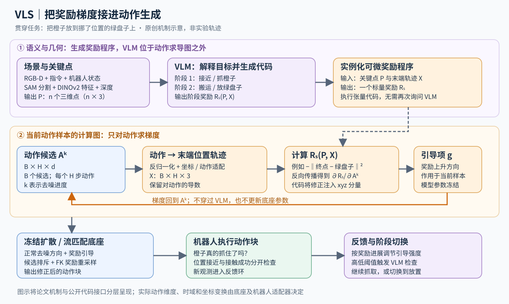

# VLS：把语言要求写成奖励，在动作生成过程中沿梯度纠偏

> 状态：技术精读 · arXiv:2602.03973v1 · 未复现

## 一句话

让视觉语言模型把“该抓哪个、该往哪里放”编译成可微分奖励，再用奖励对动作的梯度改变冻结策略的采样过程：语言模型负责规定方向，预训练动作模型提供动作先验，机器人执行后的反馈决定何时换阶段。

## 它要解决的问题

设想机器人已经会抓橙子、放盘子，现在要求“把橙子放到绿色盘子上”，而绿色盘子被挪到了原来红盘子的位置。视觉语言动作模型（VLA：接收图像和指令、输出机器人动作的策略）可能仍然生成熟悉的运动，却放错目标。这里缺的可能是对当前几何关系的适配。

Diffusion Policy [3] 一类策略用扩散模型生成动作：从一段随机噪声出发，反复去噪，得到可执行轨迹。π0 一类策略用流匹配（flow matching：学习把噪声连续搬运到动作分布的速度场）完成类似过程。二者都把示教中的动作规律保存在参数里；部署遇到物体位置、外观或指令变化时，原来的高概率动作可能偏离新目标。这就是本文关心的分布外输入，即部署条件偏离训练示教覆盖范围。[1，§III]

VLS 于 2026 年 2 月提出，改的是基线的“推理时采样”部件。它把通用视觉语言模型（VLM：能共同处理图像与文字的模型）保留为外部程序生成器，借助其语义能力构造当下的优化目标。这一分工也给“冻结高层模型、调整动作生成”的系统提供了一个清晰接口。

## 核心想法

只给候选轨迹打分，可以从已有方案中选好一点的；**让评分函数能对轨迹求导，还能告诉每一步动作该往哪里改。** VLS 将这件事拆成三层：

1. 把图像里的对象转成带编号的三维关键点，让语言中的“绿盘子”落到具体坐标上。
2. 让 VLM 生成分阶段奖励代码，用距离、方向和软约束衡量轨迹是否接近要求。
3. 在冻结动作策略的每轮去噪中加入奖励梯度，同时维护多个候选，并根据执行情况调整引导强度和阶段。[1，§IV]

最重要的设计是第二层接到第三层的可微接口。去掉梯度引导后，消融表现大幅下降；候选多样性和重采样主要继续改善搜索效率与稳定性。VLM 的作用因此可以说得很具体：输出一个可执行、可求导的“好动作定义”。

## 机制

图中紫色部分生成程序，橙色部分构成动作梯度的计算路径；蓝色底座只提供去噪方向。下文始终沿用“把橙子放到换了位置的绿盘子上”这个例子。

### 1 输入如何变成奖励函数的参数

输入包括 RGB-D 观测（彩色图像与逐像素深度）、机器人状态和语言指令。VLM 识别任务相关对象；SAM（Segment Anything：输出物体像素掩码的分割模型）圈出物体区域；DINOv2（用自监督学习得到局部视觉特征的编码器）提供物体内部的特征。将掩码内像素用深度反投影到三维，再把视觉特征与坐标拼接、聚类，得到关键点集合 P，形状可写成 n×3。[1，§IV-A]

例如 P 中一个点代表橙子，另一个代表绿盘子中心。关键点编号把语义选择与连续坐标分开：先识别“目标是绿盘子”，随后优化器就可以反复计算轨迹与该点的距离。场景位置变了，目标坐标也随观测改变。

接着，VLM 接收图像、指令、关键点及其含义，输出阶段划分和 PyTorch 奖励函数。PyTorch 是支持张量运算及自动求导的计算框架；这里要求函数由距离、内积等可微运算组成。橙子任务可拆成接近并抓取、搬运并放置，每个阶段有自己的 Rₛ。Rₛ 的输入是关键点与候选轨迹，输出一个“越大越好”的标量。[1，§IV-A2]

### 2 动作张量里到底装着什么

为了统一两类策略，记一批带噪动作块为 Aᵏ∈ℝᴮˣᴴˣᵈ：B 是候选数，H 是预测的动作步数，d 是底座动作维度，k 是去噪进度。动作块就是一次预测未来多步控制命令。Aᵏ[b,h,:] 表示第 b 个方案在未来第 h 步的动作；高噪声时它还是生成过程中的数值变量，完成去噪后才交给控制器。

在末端增量控制的教学例子中，d=7 可表示三维平移增量、三维旋转增量和夹爪命令。计算放盘子奖励时，需要先把动作反归一化，再按机器人接口把增量累积为末端位置轨迹 X∈ℝᴮˣᴴˣ³。若平移量已经在同一世界坐标系，单候选满足 xₕ=x₀+Σᵤ₌₁ʰΔxᵤ；使用其他动作表示时，这一步应由相应运动学与坐标变换完成。

公开实现中的动作适配器承担这座桥：动作样本→后处理→末端三维轨迹→奖励。当前两种策略包装器把奖励梯度写回动作的 xyz 切片，旋转和夹爪仍由底座生成。[2，`_sample_to_trajectory_3d`、`_compute_keypoint_gradient`]

### 3 一次梯度纠偏怎样算

下面是说明机制的简化奖励与示例数值，单位取米。假设已抓住橙子，绿盘子中心 p=(0.40,0.20,0.10)，候选搬运轨迹终点 x=(0.30,0.20,0.10)。只考虑终点位置：

R(x)=−‖x−p‖²=−0.01，∇ₓR=−2(x−p)=(0.20,0,0)。

做一个步长 η=0.1 的示意梯度上升，x′=x+η∇R=(0.32,0.20,0.10)，奖励变成 −0.0064。目标更近了。实际实现还会对梯度归一化，并通过动作到轨迹的链式法则把改动传回各步动作；若终点是增量的累积，多步平移都可能收到梯度。这解释了为什么“奖励的输出只有一个数”仍能得到整段动作的修正方向。[2]

程序生成与求导的边界尤其关键：求的是 ∂Rₛ/∂Aᵏ。关键点在这次求导中是给定参数，VLM 生成代码的过程处于计算图之外。公开实现先将当前样本 detach，再为该样本开启梯度，通过坐标转换和奖励调用自动求导；底座前向推理处于 no-grad 环境。[1，§IV-A2；2]

### 4 梯度怎样进入扩散或流匹配

扩散策略原本预测当前样本里的噪声 εθ。论文将它改为：

ε̂=εθ−λ√(1−ᾱₖ)g，g=∇ₐRₛ。

ᾱₖ 是累计噪声日程系数，λ 控制引导强度。去噪更新会减去预测噪声，因此这里减去奖励梯度项，最终给动作增加朝高奖励方向的修正。[1，式 2、4]

流匹配则修改动作样本的速度场。论文式 5 写成 v̂=v+λg；实现时必须连同积分时间方向理解。公开 π0.5 包装器采用从噪声时间 1 积分到动作时间 0，Δt<0，于是代码使用 v̂=v−λg，再更新 A←A+Δt·v̂，奖励项仍使 A 朝正梯度方向移动。[2]

这与训练损失有清楚分工：原策略用示教数据学习动作分布，论文式 1 给出最大化示教动作似然的抽象训练目标；VLS 部署时固定这些参数。Rₛ 是当前场景下的推理优化目标，每次改变的是采样中的动作变量。（奖励梯度存在，并不表示系统正在微调 VLM 或动作网络。）

### 5 多候选搜索怎样配合局部梯度

只沿一个初始方案爬坡，可能落入错误的一侧，例如所有轨迹都绕向被遮挡的盘子边。VLS 同时生成 B 个候选，并在早期引入候选间的排斥项，保持轨迹分散；文中把这部分称为 RBF diversity，即基于候选距离的多样性引导。

在随后的梯度修正之外，再做 Feynman–Kac 重采样（FK：按奖励权重复制好候选、淘汰差候选的粒子选择方法）。论文将每个候选的权重设为 wᵢ=exp(Rᵢ)/Σⱼexp(Rⱼ)。一个候选在此被看成一个粒子，重采样改变“保留哪些方案”，梯度改变“每个方案里面的动作”。扩散版本还在去噪步骤内安排多次随机细化，论文类比 MCMC，即用局部随机更新探索分布的蒙特卡洛方法。[1，§IV-B]

这几种机制解决不同问题：排斥项保留探索范围，奖励梯度提供局部改进方向，重采样把计算集中到更合适的区域。它们共同在动作先验附近寻找符合新语义与新位置约束的行为。

### 6 执行反馈为何还要另设一层

在橙子接近夹爪后，强位置引导可能干扰底座已有的抓握动作。VLS 按阶段内奖励的进展调节 λ，意图是在偏差较大时强纠偏、接近目标时更多依靠底座。阶段切换采用 Schmitt trigger（施密特触发器：用高低两个阈值及其间的保持区间减少来回切换）：高于高阈值则考虑前进，处于中间区间保持，低于低阈值加强当前阶段。[1，§IV-C]

触发切换时，再由 VLM 结合执行结果判断是进入放置阶段，还是继续抓取。完整闭环因此是：观测→生成/选择阶段奖励→修正动作块→执行→新观测→继续或换阶段。几何奖励负责快速细化，视觉反馈负责检查动作实施后的实际状况。

## 证据：哪个实验支撑哪个主张

| 主张 | 支撑实验 | 怎么读 |
|---|---|---|
| 同一冻结策略可从场景相关引导获益 | LIBERO-PRO 的任务与位置扰动中，LeRobot 版 π0.5 的平均成功率由 23.69% 到 36.81%，增加 13.12 个百分点；每任务 20 回合（Table I） | LIBERO-PRO 是对桌面操作基准 LIBERO 加入扰动的测试；这里的成对比较只针对该 π0.5 版本 |
| 梯度是主要增益来源 | CALVIN 消融中，完整系统 88%，去掉梯度 17.3%；去掉 FK 或多样性仍在约 85%–86%（Fig.4） | CALVIN 是包含方块及门、抽屉等机关的操作仿真；这支持“可微动作纠偏比附加搜索技巧更关键” |
| 真机上也能改善目标适配 | Franka 上冻结 π0.5 的分布内指标由约 50% 到 69%；新杯子替换原物体时由 0 到 40%（Fig.5） | 此指标抓对物体记 0.5 分、完整完成记 1 分，必须作为部分得分均值解读 |

CALVIN 的主要对照是同一扩散底座加 DynaGuide 或 ITPS：前者借视觉特征距离提供引导，后者使用预先定义的引导函数。VLS 的区别是根据当前指令与关键点生成任务专属目标。论文同时展示了增加候选数的成本：门任务从 1 个候选增至 10 个，推理时间从约 665 ms 到 1239 ms，成功率仅由 88% 到 90%；收益还体现在完成所需步数减少。[1，Fig.3–4]

## 局限与后续

VLS 最值得借鉴的是“语义程序→可微几何评分→动作变量”的接口。对已有操作能力、但目标选择和空间约束不稳的系统，这比重新设计整个动作模型更容易定位干预点。

它仍受三处约束。首先，奖励需要几何落地：点的位置、物体身份或坐标系出错，会让优化器认真执行错误目标。其次，末端接近某点只描述了一部分操作条件，抓握接触、杯内物体或延迟后果需要更丰富的反馈。最后，多候选、重复细化、视觉推理都有时延，适用控制频率要由闭环测试确定。[1，§VI]

[判断] 若现有策略根本缺少所需接触技能，应把动作模块适配和推理引导作为可组合的两层来测试：先让动作模型形成可用先验，再检查语言条件能否可靠调用它。本文的无额外训练设定证明了一种部署路径，适用范围由其已有底座和操作任务决定。

## 批注

**易误读**
- Table I 的 OpenVLA、π0 等是未引导对照，论文没有为其中每个底座分别给出 VLS 增益；真实机器人部分则明确使用冻结 π0.5。
- Fig.5 的“成功率”包含半分，不能把 40% 写成“20 次试验中恰有 8 次完整成功”。
- 论文式 10 的 sigmoid 方向与“接近目标时减弱引导”的文字意图，在负距离奖励下需谨慎对齐。当前公开实现使用随归一化进展递减的 sigmoid；同样，流匹配的正负号要与积分方向一起读。正文已区分论文记号与代码。
- 当前代码仅向 xyz 分量注入几何引导，且有任务专属提示规则；例如部分 LIBERO 放置阶段直接交回底座。公开代码能说明实现边界，不能单凭当前默认配置反推出论文每项实验的全部设置。[2]

**与其他论文的关联**
- [Diffusion Policy](../diffusion-policy/reading.md) 学会从噪声生成动作；VLS 保留生成器，把新的目标接入采样过程。两者分别回答“动作先验从哪里来”和“当下往哪里引导”。
- [VLA-Pilot](../arxiv-2511.14178/reading.md) 同样让视觉语言模型生成奖励，但允许黑盒评分，再用进化搜索修改候选。两者形成“能求梯度时局部纠偏、只能打分时群体搜索”的机制对照。
- [π0](../arxiv-2410.24164/README.md) 的连续动作生成提供另一种承载引导的接口；VLS 并非只依赖某个特定扩散噪声预测器。[判断：方法结构对应]

**未核实 / 待验证**
- 原文多处指向 Appendix，但该 v1 的公开 HTML 与 11 页 PDF 在参考文献后均未包含附录。奖励提示与接口细节以上述固定提交的官方代码为补充；精确实验配置、部分阈值与完整复现仍待验证。
- 需要把“动作几何评分提高”“阶段确实完成”“真实任务成功”分开测量，才能定位感知错误、奖励错误与技能缺失各占多少。

**参考文献**
1. Liu 等，[VLS: Steering Pretrained Robot Policies via Vision–Language Models](https://arxiv.org/html/2602.03973v1)，2026；§III–VI、Algorithm 1、Table I、Fig.3–5。[PDF](https://arxiv.org/pdf/2602.03973v1)
2. 作者官方代码，固定于提交 [b6e87ed](https://github.com/Vision-Language-Steering/code/tree/b6e87edc217a2a7682caadba285677fc79eb6f81)：[扩散采样与梯度](https://github.com/Vision-Language-Steering/code/blob/b6e87edc217a2a7682caadba285677fc79eb6f81/core/diffusion_policy_steer.py)、[π0.5 采样与梯度](https://github.com/Vision-Language-Steering/code/blob/b6e87edc217a2a7682caadba285677fc79eb6f81/core/pi05_steer.py)、[奖励模板](https://github.com/Vision-Language-Steering/code/blob/b6e87edc217a2a7682caadba285677fc79eb6f81/vlm_query/guidance_template.txt)、[LIBERO 任务规则](https://github.com/Vision-Language-Steering/code/blob/b6e87edc217a2a7682caadba285677fc79eb6f81/vlm_query/guidance_template_libero.txt)
3. Chi 等，Diffusion Policy，2023；[本库精读](../diffusion-policy/reading.md)
