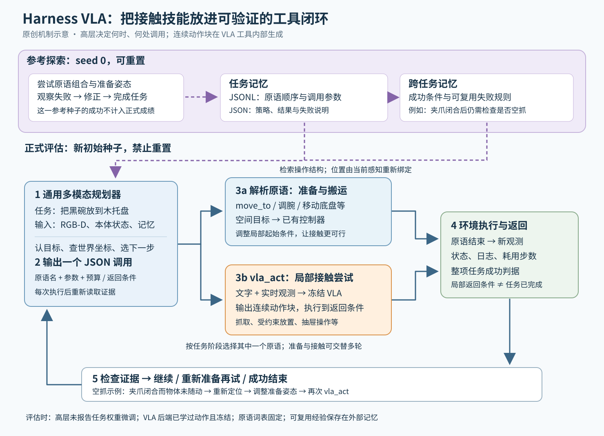

# Harness VLA：让通用大模型安排接触，让冻结策略专心动手

> 状态：技术精读 · arXiv v5（2026-09-24）· 未复现

## 一句话

通用多模态大模型负责认目标、安排接触前的姿态、检查结果和决定重试；已经训练好的 VLA（视觉—语言—动作模型：根据图像和指令生成机器人动作）被封装为一个短时执行工具，与固定的解析控制原语共同完成任务。[1]

## 它要解决的问题

对机器人说“把黑碗放到木托盘”，有两类能力要同时工作：先理解哪一个是黑碗、托盘现在在哪儿，再真正夹稳碗并放下。模型在熟悉的场景会拿碗，并不保证物体换位置、指令改目标之后仍会拿对、放对。

[具身 Agent 基线](../../fields/embodied-agents/BASELINES.md)中的 [SayCan](../saycan/reading.md) 已经用语言模型选择底层技能，并用技能价值函数约束可行性。[Code as Policies](../arxiv-2209.07753/README.md) 进一步让大模型组合感知与运动接口。另一条路线的 [π0.5](../arxiv-2504.16054/README.md) 则通过机器人数据训练，把语义子任务与连续动作组织进模型。[2–4]

Harness VLA 接手的问题是：**手里已经有一个会做局部操作的策略，怎样让现成的通用大模型把它用在正确的地方，并在失败后继续完成任务？** 相对基线，它主要改技能接口、执行反馈和经验复用三个部件。[1，§2]

## 核心想法

把完整任务拆成两类执行段：

- **解析原语**：由运动学和控制器实现的固定操作，如移到指定位置、调整手腕、移动底盘。适合空间重定位、自由空间搬运和接触前准备
- **VLA 原语 `vla_act`**：调用学得的视觉运动策略，完成抓取、受约束放置、开抽屉等接触密集操作；接触密集指动作效果强烈依赖物体接触、摩擦和局部几何

通用大模型每轮只选择原语并绑定参数。原语执行完，系统交还新图像、状态和执行日志，大模型再决定下一步。Harness（执行运行时）负责这一整套接口、同步、预算、记忆与反馈约定。它把 VLA 的使用单位改成“可以检查、重新准备、再次调用的一次局部尝试”。[1，§2.1–2.3]

关键设计是 **staging（接触前准备：先把机器人和视角调到适合该策略工作的局部状态）**。目标变了以后，原来学到的接触能力仍可能够用，只是起始位置和观察不合适；大模型可先用解析原语调整这些条件，再让同一个 VLA 接手。[1，§3.3]

## 机制



图：原创机制图。蓝色是规划与解析控制，橙色是学得的接触动作，紫色是外部记忆。正式评估复用参考尝试的操作结构，每轮重新定位；橙色工具内部产生动作块，高层输出的是结构化调用。

### 1 输入和输出之间，真正的接口在哪里

输入包含任务文字、RGB 图像、对齐的度量深度和机器人本体状态。实现把深度结合相机标定转成 world map（逐像素世界坐标图：每个可见像素对应一个三维点）。规划器在 RGB 上判断对象、选择像素，再读取这些像素对应的世界坐标；多点取中位数可减少边缘或背景像素的干扰。物体、相机或底盘移动后，要重新定位。[1，§2.1；附录 E.2]

因此接口两端的量不同：

- `move_to` 接收世界坐标系中的三维目标 `xyz`；数值算例以下按米解释，位置容差与其同单位。后端用操作空间控制、雅可比控制或逆运动学求解器执行
- `vla_act` 接收文字 `prompt`、动作块预算 `max_chunks` 和提前返回条件 `stop`。动作块是策略一次预测的未来若干步动作；一个工具调用可以运行多个动作块
- 返回值包括新观测、末端姿态、夹爪状态、原语状态和已经消耗的步数；最终完成由基准的二值成功判据决定

可把工具内部输出记成 A∈ℝ^(H×d_a)：H 是一个动作块覆盖的控制步数，d_a 是该机器人动作维数；这只是解释接口的记号，具体维数、归一化和控制约定随后端变化。高层的一轮以“原语结束”为边界，底层仍按自己的控制频率运行。（`max_chunks=2` 指至多两个动作块，不是两秒或两个关节动作。）[1，§2.3；附录 A–B]

### 2 哪些权重冻结，哪些东西发生了学习

高层直接使用 Codex 或 Claude Code 中的通用模型；论文未报告对高层进行机器人任务权重微调。v5 附录 H 还测试了 Codex 中的 GPT-6 Astra，推理努力设为 low。高层获得机器人能力的具体入口，是操作手册、感知文件、工具模式和交互经验。[1，§3.1；附录 E、H]

底层 VLA 则已经接受过动作学习，而且不同基准使用不同策略：LIBERO 系列使用 RLinf 发布的 `pi05_libero130_fullshot`，即在 LIBERO-130 上做过监督微调的 π0.5；厨房任务使用现成 RLDX-1；双臂 RoboTwin 使用作者先在该环境后训练的 LingBot-VLA。Harness 评估时这些权重均保持冻结。解析控制器也固定，不依靠机器人示教训练。[1，附录 B、D]

本方法新增的适应发生在 **外部记忆**。Task Specific Memory（任务记忆）包含成功尝试的原语调用序列，以及解释策略和失败原因的摘要；Global Memory（跨任务记忆）保存“夹爪闭合后检查物体是否随动”等可复用规则。它们改变下一轮模型看到的上下文，不通过反向传播修改模型参数。[1，附录 A、E]

### 3 先探索一次，再在新布局中重新绑定

Bootstrapping（引导探索：通过交互找到可复用的解决方法）在每项任务的参考初始种子 seed 0 上进行。这里允许重置场景并有较宽松时间预算，用于尝试摆位顺序、VLA 调用时机和返回条件；成功后保存调用轨迹与策略摘要。[1，§2.2]

正式评估换到未用于参考探索的初始种子，关闭 reset，缩短执行预算。规划器继承“先抓取、再搬运、再放下”的结构，但从新图像重新获取碗与托盘的位置。这样，记忆复用的是解决程序的骨架，而几何绑定跟着当前场景变化。（这是有参考探索的 few-shot 设置，seed 0 的成功不计入评估成功率。）[1，附录 C.1–C.3、E.3]

### 4 贯穿算例：黑碗换位置后，怎样继续用同一个策略

以下数字和完整流程是**教学用的假设算例**，用于说明论文接口，不是论文报告的一条轨迹。

**任务与结构化计划。** 指令是“把黑碗放到木托盘”。任务记忆提供顺序：定位 → 接触前准备 → 抓取 → 搬运 → 放下 → 检查。这里的“计划”是一组待验证的操作关系；运行时一次只提交下一条原语。

**定位与准备。** RGB 上选出黑碗表面的三个稳定像素，世界坐标分别为 `(0.398, 0.099, 0.811)`、`(0.402, 0.101, 0.812)`、`(0.400, 0.100, 0.816)` 米。逐坐标中位数为 `(0.400, 0.100, 0.812)`。假设这次选择表面上方 8 厘米作为准备点，则目标高度是 `0.812 + 0.080 = 0.892` 米；调用可写为：

```json
{"action":"move_to","xyz":[0.400,0.100,0.892],"gripper":"open","tol":0.012,"max_steps":80}
```

这里 `tol=0.012` 表示位置容差 1.2 厘米，`max_steps` 限制该次原语的执行步数。它把粗几何问题交给已有控制器，随后以更新后的近距离观测开始抓取。

**局部接触与返回。** 高层调用：

```json
{"action":"vla_act","prompt":"grasp the black bowl","max_chunks":2,"stop":"object_lifted"}
```

工具中的 VLA 根据实时相机观测产生动作块，达到抬起条件或预算耗尽后返回。`object_lifted` 是论文示例中的条件名，具体判定实现由后端提供；真实任务的提示词也要沿用底层适用的规范，例如 RoboCasa 提示要求传完整任务语言。[1，附录 B、E.5]

**验证与重试。** 假设夹爪已经闭合，但新图像显示碗仍在原处。这是空抓，当前原语结束而抓取目标尚未成立。规划器可张开夹爪、重新定位，假设选择向左修正 2 厘米，把准备点 x 从 `0.400` 改为 `0.380`，再调用 VLA。修正量是本算例的假设选择，实际必须根据失败后的证据判断。

**搬运与最终验证。** 抓稳之后，解析控制将末端送至新定位的托盘上方，调整高度并 `release`。视觉证据支持“碗似乎在托盘上”，基准成功信号确认整个任务已完成。如果碗靠在边缘、判据仍为假，规划器继续诊断和恢复。接触原语的返回条件与整项任务的成功判据因此有各自清楚的职责。[1，附录 C]

这条链的价值在于：一次空抓的后果被限制在局部尝试里，搬运不会无条件地跟着失败抓取继续。成功经验最终保存“哪一步该验证、失败后怎样重新准备”，供以后重新绑定位置时使用。

## 证据：哪个实验支撑哪个主张

LIBERO 是按语言指令操作桌面物体的仿真基准；LIBERO-Pro 在其任务上加入指令改目标与物体位置交换。RoboCasa365 测厨房短任务及组合任务；RoboTwin C2R 测双臂操作从干净场景到随机化场景的迁移。下表优先比较同一个冻结动作后端，所有成功率按任务完成判据统计。[1，§3；附录 C]

| 主张 | 支撑实验 | 怎么读 |
|---|---|---|
| 增益主要体现在扰动后的协调 | 标准 LIBERO：直接 πRLinf 95.3%，Harness + Opus-4.7 96.0%；LIBERO-Pro：同后端 50.0% → 82.4%（表 2–3） | 熟悉任务上的差距小；换指令和布局之后，外层系统的价值更明显 |
| 现成通用模型确实可担任规划器 | GPT-6 Astra low 在 LIBERO-Pro 为 741/800＝92.63%；GPT-5.5、Opus-4.7 分别为 72.1%、82.4%（表 21） | 同类工具与记忆协议下能受益于更新规划器；这组仍有 seed 0 参考探索 |
| 厨房未见组合有收益，但提升不均匀 | Astra 总计 148/250＝59.2%，直接 RLDX-1 为 30.0%；Composite-Unseen 为 42.5%，GPT-5.5 为 13.8%；Composite-Seen 则从 61.3% 降为 43.75%（表 4、22） | 总成绩掩盖子集差异；Unseen 指动作模型预训练未见任务模板 |
| 记忆对空间扰动尤其重要 | Opus-4.7 的 Goal-S：无目标设置记忆 31%，有记忆 87%；Goal-T 为 79% 与 87%（表 3、5） | 语义改目标与新几何布局依赖的经验程度不同；这里同时改变两类记忆的可用性 |
| 重试与重新准备有帮助 | 图 4 限制每回合最多调用 VLA 的次数，允许更多规划器安排的调用后，累计成功率上升并趋于饱和 | 支持局部多次尝试的作用；尚未独立拆开重新准备与单纯多试几次的贡献 |
| 同一组织方式也适用于双臂 | RoboTwin C2R：直接后训练 LingBot-VLA 50.4%，Harness + Opus-4.7 58.4%（表 6） | 使用 clean 场景任务记忆迁移；随机化设置中没有额外探索或微调 |

Astra 的 RoboCasa 总体数可手算核对：三个子集分别有 90、80、80 次评估，对应 79、35、34 次成功，合计 `(79+35+34)/250=59.2%`。所以应按任务数加权，而非把三列百分比简单平均。[1，附录 C.3、H]

`[判断]` 最有用的结论是：**可训练的接触策略与可替换的通用规划器，可以通过稳定的工具接口独立演进。** 证据覆盖多个动作后端和多个高层模型，但尚未单独隔离高层模型、参考探索质量与记忆内容的贡献。

## 局限与后续

**可靠性的负担转移到接口边界。** 目标是否识别正确、深度点是否可靠、抓稳条件是否误报，都会决定下一步。如果把错误观察当作已完成事实，系统仍会沿错误状态规划。原文也将高层与低层之间的信息反馈不足列为局限；进一步问题是怎样让接触置信度、失败原因与恢复代价更明确地返回高层。[1，§6]

**任务经验有收集成本。** 参考种子上的探索和重置换来了后续布局上的迁移。实际部署应把探索所耗时间、失败动作、人工复位与成功率一起衡量。真机部分使用双 Franka 展示目标改派、空抓恢复和组合操作，成功判断与场景复位由操作员参与；这些案例展示机制可运行，统计可靠性仍需独立试验。[1，§4]

**稳定流程可以压缩，开放变化仍需要判断。** 论文的 Flash Mode 把成功调用序列编成任务卡，重新定位目标后执行，并使用预设检查和有限重试。它给出一个有用工程方向：常见固定流程减少在线规划，发生新语义选择或意外恢复时保留在线智能。但任务卡的选择和计时口径需单独审视。[1，§4；附录 G]

`[判断]` 值得迁移到其他机器人系统的设计是：每个技能都公开“开始条件、预算、返回原因、成功证据”；再允许高层根据这些证据安排准备动作和恢复。这样才能比较究竟是动作策略能力不足，还是它在错误的位置、错误的时机被调用。与其他方式干预动作模型的关系，见[动作模型干预讲义](../../fields/embodied-agents/action-model-intervention.md)。

## 批注

**易误读**

- “冻结”发生在 Harness 使用阶段。πRLinf 已在 LIBERO-130 监督微调；RoboTwin 后端由作者另做后训练，且其配置列出了视觉编码器学习率。它不证明仅训练一个小动作头即可获得同样结果（附录 D）。
- GPT-6 Astra 的两个主成绩都是有参考探索的协议；RoboCasa 的 Composite-Unseen 也会在 seed 0 建任务记忆。附录 H 没有进一步说明三种规划器是否复用完全相同的记忆文件，因此模型对比不能解释成“只替换一个 API、其他交互数据逐字相同”。
- LIBERO-Pro 摘要中的“高 38.6 个百分点”比较 Harness 的八个评估单元与 RATS 报告的六个单元；本文用同后端 50.0% 作主要参照。RoboCasa 的摘要页、HTML 正文与表格还存在增幅或舍入不一致，本文使用表 4、表 22 的列值与明确分母，不沿用 headline 差值。
- 完全不检索目标设置记忆的零样本证据是表 5 的 LIBERO-Pro Goal；RoboTwin 所谓 zero-shot 指 clean-to-randomized 迁移，已有 clean 场景轨迹（§3.2、附录 C.4）。
- 原语调用频率和最后一个完成任务的原语类别属于使用统计；它们不能单独证明某原语的因果贡献。论文没有将两类记忆、解析控制、staging 和等预算重试做完整的正交消融。
- Flash Mode（max）在同一批种子上选择最好任务卡并报告成绩；其时间统计是源轨迹工具时长，Codex 比较项是规划器时长。两者不能据此推出端到端加速倍数（附录 G）。

**与其他论文的关联**

- `[结构]` [SayCan](../saycan/reading.md) 将“高层知道做什么”和“底层做得到”分开；Harness 把底层可执行单元改成固定解析原语与一个可反复调用的 VLA，再加入实时验证和外部记忆。[1–2]
- `[结构]` [Code as Policies](../arxiv-2209.07753/README.md) 生成程序组合控制 API；Harness 选择固定 JSON 原语，把组合能力放在逐轮执行与重新绑定中。两者都让空间参数在模型与控制器的接口处显式出现。[1、3]
- [π0.5](../arxiv-2504.16054/README.md) 通过训练把语义子任务预测与动作结合；Harness 把其中一个已微调版本接入外层通用规划器。[判断] 这说明模型内的语义推理与模型外的任务编排可共存，不能仅按“有没有大模型”划分路线。[1、4]

**未核实 / 待验证**

- 尚未复现官方代码、逐项审核工具停止条件，或评估传感器误差、现实碰撞约束下的性能。
- 两类记忆的独立增益、不同规划器使用的记忆是否完全相同、等计算预算下的重试收益，仍需更细的对照。

**参考文献**

[1] Yixian Zhang 等. [Harness VLA: Steering Frozen VLAs into Reliable Manipulation Primitives via Memory-Guided Agents](https://arxiv.org/html/2607.08448v5). arXiv:2607.08448v5，2026-09-24；方法 §2，评估 §3，部署 §4，附录 A–H。[版本记录](https://arxiv.org/abs/2607.08448)；原文以 [CC BY 4.0](https://creativecommons.org/licenses/by/4.0/) 发布。本页为独立中文讲解与原创示意图。

[2] Michael Ahn 等. [Do As I Can, Not As I Say: Grounding Language in Robotic Affordances](https://arxiv.org/abs/2204.01691). 2022。

[3] Jacky Liang 等. [Code as Policies: Language Model Programs for Embodied Control](../arxiv-2209.07753/README.md). 2022，v4 2023。

[4] Physical Intelligence 等. [π0.5: a Vision-Language-Action Model with Open-World Generalization](../arxiv-2504.16054/README.md). 2025。
