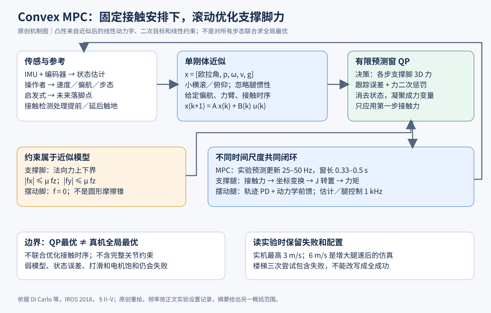

# Convex MPC：先固定步态时序和偏航，四足的接触力规划就变成每秒几十次的凸二次规划

> 状态：技术精读 · v2 · 未复现 · 原文 [IROS 2018 作者稿（MIT DSpace）](https://dspace.mit.edu/entities/publication/bc8c7e1e-5830-443f-a879-787947111fcf) · [证据档案](../../../docs/deep-readings/evidence/convex-mpc.json)



## 一句话

MIT Cheetah 3 把机身近似成一个刚体，提前给定每只脚何时着地、落在哪里，再在横滚和俯仰较小的条件下把转动方程线性化。这样，"未来约 0.5 秒内每只支撑脚该用多大的地面反作用力"就成了一个凸二次规划（QP），机载 CPU 不到 1 ms 求出它的全局最优，每秒重算 20–50 次，同一组权重支撑了从站立到三维奔跑的多种步态。

## 它要解决的问题

[运动控制讲义](../../fields/control-locomotion.md)第五节讲了 MPC 的滚动求解，第六节讲了四足为什么要通过地面反作用力（GRF，一句话：地面作用在脚上的三维力，机身的加速和转动全靠它）来控制机身，以及摩擦锥约束。本篇要处理的是其中最难的一类运动：**动态步态**（一句话：作者用它指有明显腾空或欠驱动阶段的步态，例如 bound、gallop）。

在动态步态里，机身经常只有一两只脚着地，甚至全部腾空，此时机身处于欠驱动状态（一句话：可直接施加的力不足以独立控制机身全部 6 个自由度）。控制器若只看当前一瞬间，就无法为即将到来的腾空做准备。论文梳理了当时的几条路线及各自卡在哪里：

- **启发式控制器**（如 Raibert 的跳跃和 bound 控制）：有效，但难调参。
- **平面简化模型**（如 MIT Cheetah 2 的 bound 控制）：只适用于没有横向和横滚运动的步态。
- **离线优化**（如进化算法找 gallop）：算得太慢，不能在线使用。
- **非线性 MPC**（如同一实验室的 policy-regularized MPC、ETH 的全身非线性 MPC）：能预测，但问题非凸，求解器不保证找到全局最优，还可能有数值问题。
- **凸优化力分配**（如 HyQ 的准静态 QP、只满足瞬时动力学的力 QP）：快且可靠，但模型是准静态或只有当前一步，扩展不到动态步态。

本篇要同时拿到后两条路线的好处：保留预测窗口，又让问题保持凸；保留三维和偏航，使机器人能转弯和横向移动。

## 核心想法

增量在建模选择上：作者找到一组近似，在丢掉的东西尽量少的前提下，让动力学对决策变量线性、约束为线性不等式，从而得到凸 QP。

1. **单刚体模型**：只保留机身，忽略腿的质量和动力学。Cheetah 3 的腿约占整机质量 10%，这是该近似成立的工程背景。
2. **小横滚、小俯仰**：用 Z-Y-X 欧拉角（一句话：先绕 z 轴偏航 ψ、再绕 y 轴俯仰 θ、再绕 x 轴横滚 φ 的三次转动）表示姿态，在 φ、θ 较小时，欧拉角速率只依赖偏航；世界系惯量也只随偏航转动；陀螺进动项 ω×(Iω)（一句话：刚体快速转动时角动量方向自身的变化，造成进动和章动）被丢掉。
3. **未来的偏航和落脚点由参考轨迹给定**：于是动力学矩阵在求解前就已知，系统成为线性时变（LTV，一句话：每一步的状态方程是线性的，但系数矩阵随时间变化）。
4. **接触安排预先给定**：摆动脚的力直接等于零，支撑脚的力满足线性的上下界和方锥摩擦约束。
5. **凝聚形式**：把状态从决策变量中消去，只剩支撑脚的力，问题规模只与脚数和预测步数有关。

作者在结论中给出了一条值得记住的判断：预测窗口内模型的精确程度，没有"当前时刻模型的精确程度"重要。每次求解时，第一步的矩阵都用当前实测状态计算，并且频繁重算，因此这一步总是准的；两次求解之间，线性近似已经够用。

## 机制

### 状态和决策变量

预测状态有 12 个运动量：欧拉角 Θ = (φ, θ, ψ)、质心位置 p、世界系角速度 ω、线速度 v。再加一个恒为常数的重力状态，把重力这个仿射项并入线性形式，共 13 维。决策变量 u 是各脚的三维地面反作用力，四脚全部着地时为 12 维。关节角和关节力矩不在 QP 里。[§III，式 16–17]

输入来自三处。IMU 和关节编码器经状态估计器得到机身状态与脚位；操作者用游戏手柄给速度、偏航速度和步态；参考生成器把速度积分成位置和偏航参考，横滚、俯仰及其速率、竖直速度的参考恒为零。接触与离地时刻按步态预先排好，接触检测算法在脚提前或延后触地时实时调整。[§II、§IV-B]

### 从刚体方程到线性时变模型

平动方程 p̈ = Σfᵢ/m − g 本来就是线性的。转动方程 d(Iω)/dt = Σ rᵢ × fᵢ 中，rᵢ 是质心到第 i 个接触点的力臂。非线性来自三处：欧拉角速率与 ω 的关系、随姿态变化的世界系惯量、ω×(Iω)。三个近似分别处理它们：

```text
Θ̇ ≈ R_z(ψ)ᵀ ω                     （小横滚、小俯仰）
Î ≈ R_z(ψ) I_body R_z(ψ)ᵀ          （同上）
d(Iω)/dt ≈ I ω̇                    （丢掉 ω×(Iω)）
```

偏航仍然保留在 R_z(ψ) 里，这正是能转弯的原因。**示例数值**：机器人朝向世界 y 轴（ψ = 90°），机身绕世界 x 轴以 0.5 rad/s 转动。R_z(90°)ᵀ = [[0,1,0],[−1,0,0],[0,0,1]]，乘以 (0.5, 0, 0) 得 (0, −0.5, 0)：对这台机器人而言这是俯仰，而不是横滚。同一个世界系角速度，朝向不同，对应的姿态变化就不同。

若未来的 ψ 和 rᵢ 由参考轨迹给定，矩阵 A、B 就不依赖待求的力。离散化时用扩展系统的矩阵指数得到零阶保持模型（一句话：假设每个时间步内力保持不变时的精确离散化）xₖ₊₁ = A xₖ + Bₖ uₖ。整个窗口共用一个按平均偏航算的 A；Bₖ 按每一步的参考落脚点和偏航计算；第一步的 B 用当前实测状态。机器人被扰动后，最迟 40 ms 内下一次 MPC 就会从扰动后的状态重建参考。[§IV-C，式 25–26]

### 约束：为什么仍然是凸的

目标是窗口内各步状态与参考之差的加权平方和，加上力大小的二次惩罚。约束有两类：

```text
摆动脚：      Dₖ uₖ = 0                     （该脚的力为零）
支撑脚：      f_min ≤ f_z ≤ f_max
             −μ f_z ≤ f_x ≤ μ f_z
             −μ f_z ≤ f_y ≤ μ f_z           （方锥近似的摩擦锥）
```

全部是线性等式和不等式，配上半正定的二次目标，就是凸 QP。论文参数：μ = 0.6，f_min = 10 N，f_max = 666 N，质量取 43 kg。[§IV-A，式 20–24；表 I]

**手算一：为什么必须预测腾空（示例数值，步态时序取自论文的 pronk 实验）**

Pronk 是四脚同时起跳的连续小跳。论文中四脚同时着地 150 ms，随后腾空 350 ms，一个周期 0.5 s。要维持周期性跳跃，一个周期内地面给的向上冲量必须抵消重力冲量：

```text
重力冲量 = m g T = 43 × 9.8 × 0.5 = 210.7 N·s
着地期平均总竖直力 = 210.7 / 0.15 ≈ 1404.7 N ≈ 3.33 倍体重
每只脚平均 ≈ 351.2 N（低于 f_max = 666 N）
```

如果控制器只看当前时刻、让总竖直力等于体重 421.4 N，那么着地 0.15 s 只给出 63.2 N·s，每个周期少 147.5 N·s，相当于机身竖直速度每周期多损失约 3.4 m/s，跳跃无法维持。MPC 的预测窗口覆盖整个周期，它"看到"后面 350 ms 没有支撑，于是在着地期主动给出约 3 倍体重的力。这就是论文所说的"为腾空期提前规划"。（这个算例只看平均竖直冲量，忽略了转动和力在着地期内的分布。）

**手算二：方锥比圆锥宽多少（示例数值）**

取上例每只脚 f_z = 351.2 N，μ = 0.6。方锥允许 |f_x| 和 |f_y| 各自达到 0.6 × 351.2 = 210.7 N；在方锥的角上，水平合力可达 √2 × 210.7 ≈ 298.0 N，比真实的圆形摩擦锥（水平合力 ≤ 210.7 N）宽约 41%。若要保守，可以改用内接方锥，即把每个方向的系数换成 μ/√2 ≈ 0.424，每轴上限变为约 149.0 N。

### 凝聚形式：QP 到底在解什么

把窗口内全部状态堆成 X、力堆成 U，线性递推可以展开为 X = A_qp x₀ + B_qp U。代入目标后，状态不再是决策变量：

```text
J(U) = ‖A_qp x₀ + B_qp U − X_ref‖²_L + ‖U‖²_K
H = 2(B_qpᵀ L B_qp + K)
g = 2 B_qpᵀ L (A_qp x₀ − X_ref)
```

L 是状态偏差的对角权重，K 是力大小的对角权重（论文取所有力等权、α = 10⁻⁶）。K 正定时目标严格凸。H 的维度只取决于脚数 n 和步数 k，与 13 维状态无关。[§IV-D，式 27–32]

**手算三：变量数（示例数值）**。取 k = 10 步、n = 4 只脚，未删减时力变量有 3nk = 120 个。trot 中每一步只有对角两只脚着地，删掉摆动脚后剩 60 个，H 为 60×60。若保留稀疏形式，还要再加 13 × 10 = 130 个状态变量和 130 组动力学等式。作者的取舍是：不利用稀疏性的求解器复杂度随变量数和约束数大致三次增长，所以先缩小问题，再用 qpOASES（一句话：专为 MPC 设计、利用上一次解热启动的在线活动集 QP 求解器）求解。作者也说明，能利用稀疏结构的求解器可能更快，选凝聚形式是因为实现简单且已经够快。

### QP 之外的控制层

QP 只给出第一步的世界系力 fᵢ。支撑腿的关节力矩由 τᵢ = Jᵢᵀ Rᵀ fᵢ 算出（R 把机身系转到世界系，J 是足端雅可比），优化结果不经滤波直接使用。其余模块：

- **摆动腿**：反馈加前馈。前馈用腿的操作空间惯性（一句话：在足端坐标下表现出来的等效质量矩阵）以及科氏力和重力项；比例增益随表观质量调整，使闭环自然频率在不同腿姿下大致不变。
- **落脚点**：受 Raibert 启发的启发式 p_des = p_ref + v_CoM·Δt/2，p_ref 是髋部在地面的投影，Δt 是该脚的着地时长。这个落脚点同时用于摆动轨迹和 QP 中的力臂 rᵢ。
- **多速率**：图 2 中 MPC 为 30 Hz，状态估计、摆动腿规划和腿阻抗控制为 1 kHz，电机电流环为 4.5 kHz。整个系统只用 IMU、关节编码器和电机电流传感器，没有力传感器。[§II-D–E、§V-A]

## 证据：哪个实验支撑哪个主张

所有实验都在同一台 Cheetah 3 上完成，没有与其他控制器在同一平台上的对照实验，也没有对各项近似的单独消融。

| 主张 | 支撑实验 | 怎么读 |
|---|---|---|
| 一个控制器、一组权重覆盖多种步态 | 站立、trot、flying trot、pace、bound、pronk、gallop 和自创的三腿步态（§V） | 演示性实验，没有每种步态的成功率统计 |
| 三维高速运动 | 跑步机上 gallop 最高 3 m/s；横向 1 m/s；flying trot 和 bound 原地转向 180°/s（摘要、§V-B、§V-E） | 3 m/s 受摆腿速度和 1.3 m 宽跑步机限制；trot 在 1.2 m/s 以下有效，flying trot 到 1.7 m/s |
| 抗扰 | trot 中被踢，机身侧向速度变化超过 1 m/s，横滚和俯仰保持在 10° 以内（图 7） | 单次演示 |
| 盲走楼梯 | 4 级台阶、散落约 15 块木块，flying trot，3 次上下尝试中第 2 次完整成功（§V-C） | 另两次中断于操作者误发偏航指令、后脚踩空导致膝关节反转、踢到自身电源开关 |
| 求解够快 | 摘要：预测窗最长 0.5 s，不到 1 ms 求到最优，20–30 Hz；§V-A：一个步态周期 0.33–0.5 s、10–16 步、25–50 Hz（图 4 为 gallop 求解时间分布） | 机载 2011 年的笔记本 i7 处理器；三处频率出自不同段落 |

## 局限与后续

- **接触时序靠人设计**：全部步态都是手工设计的，作者在结论中计划用高层规划器决定接触模式。学习步态切换的工作，例如[相位引导的自由步态切换](../arxiv-2201.00206/README.md)和 [CPG-RL](../arxiv-2211.00458/README.md)，处理的正是这一格。
- **盲走**：除本体感知外不知道地形，楼梯实验只是把摆动高度调高。带视觉或高度图的腿足控制见[野外鲁棒感知步态](../arxiv-2201.08117/README.md)和[第一视角视觉腿足运动](../url-https-proceedings.mlr.press-v205-agarwal23a-agarwal23a/README.md)。
- **模型参数固定**：质量、惯量、摩擦系数都是常数。用运动历史在线推断环境参数的学习方法见 [RMA](../rma/reading.md)。
- **忽略腿的动力学和关节限制**：f_max 只是粗略代替关节力矩、速度和足端可达范围。腿较重的机器人（如人形）需要更完整的全身模型，相关综述见[人形机器人运动与操作综述](../arxiv-2501.02116/README.md)。
- **高速受硬件限制**：实验时腿的最高转速 15 rad/s，超过 3 m/s 时腿摆不到位；在多刚体仿真中把腿速上限放到 30 rad/s，可达 6 m/s。

## 批注

**易误读**

- "全局最优"只对近似模型、给定接触时序和给定落脚点的 QP 成立，对真实多刚体机器人、其他步态或其他落脚点没有这个保证（§III–IV）。
- 摘要的"20–30 Hz"、§V-A 的"25–50 Hz"和图 2 的"30 Hz"出自不同段落，"不到 1 ms"是单次求解时间，"1 kHz"是低层控制频率，三者不能合成一个数（摘要、§V-A、图 2）。
- 整机质量在 §II-A 写 45 kg，控制器参数表 I 用 43 kg，复现时分别记录（§II-A、表 I）。
- 方锥约束满足时，水平合力仍可能超出真实圆锥；摩擦系数未知或打滑时，"QP 满足约束"不代表实际不滑（式 23–24，手算二）。
- "不需要额外的反馈控制器"指机身层面；MPC 本身每次读回实测状态，电机电流环也是闭环（§I）。
- τ = JᵀRᵀf 的符号取决于力定义为"地面对脚"还是"脚对地面"以及雅可比的坐标系，移植到其他机器人时要重新核对（式 4）。
- 6 m/s 是仿真结果，实机最高 3 m/s（§V-F）。

**与其他论文的关联**

- [运动控制讲义](../../fields/control-locomotion.md)第五节的小车 MPC 是本篇的一维版本；第七节的 τ = JᵀF 与多速率接口正是本篇 §II 的结构。
- [RMA](../rma/reading.md) 是另一条路线：把质量、摩擦等未知量的补偿交给从运动历史推断环境隐变量的网络，而本篇把质量、惯量、摩擦和接触安排显式写进在线优化。公平比较两者需要固定硬件、状态估计、延迟、步态自由度和地形信息。
- [ESKF 教程](../eskf/reading.md)提供本篇所依赖的机身状态估计的数学基础：MPC 的 x₀ 本身是估计量，带有误差和延迟。论文的状态估计器细节在其引用的 Cheetah 3 系统论文中，本篇没有展开。
- 在[导航与规划讲义](../../fields/navigation-planning.md)的分层中，[RRT*](../rrt-star/reading.md) 回答"走哪条路"，本篇回答"接下来半秒每只脚用多大的力"，两者之间还需要把路径变成速度和偏航参考。

**未核实 / 待验证**

- 状态估计器、接触检测算法分别出自论文引用的 Cheetah 3 系统论文和接触模型融合论文，未读。
- 用学习模块预测摩擦、建模残差或接触时序，再交给 QP 做约束内的力分配，是基于接口的阅读建议，论文没有实验。
- 补充视频未做定量核对。
