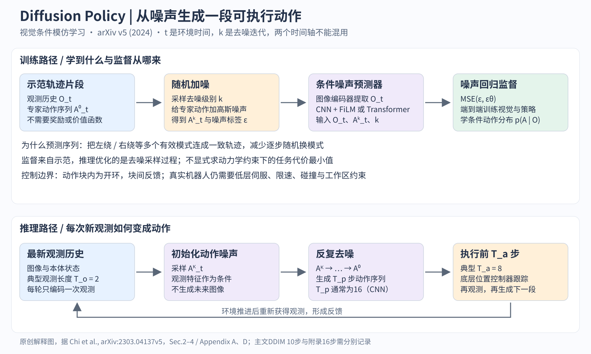
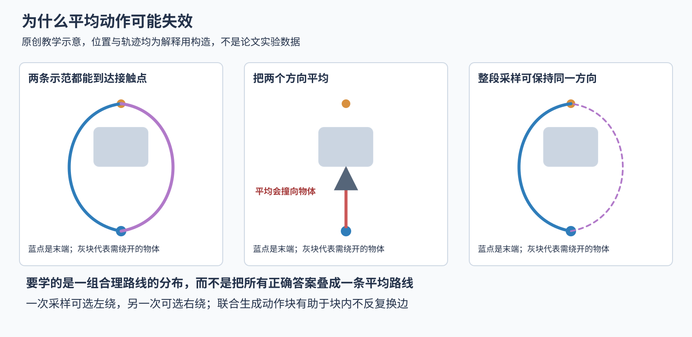
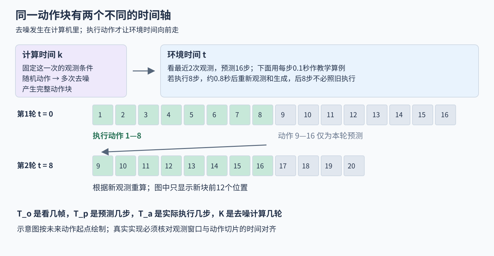

# Diffusion Policy 精读 从人类示范到机器人动作

> 状态：教学精读 · 原文 arXiv:2303.04137v5 · 未复现

把一块T形积木推到桌面的红色轮廓里，看起来只是一个小游戏。但机器人必须连续解决几件事：看清积木的位置，决定从哪一侧接近，控制末端绕过去，在合适的点接触，再根据积木真正移动的结果调整。即使两次开始时画面几乎一样，人也可能一次从左边绕、一次从右边绕。这两种做法都对，平均起来却未必对。

Diffusion Policy的中心思想，是让模型学会“在眼前这种情况下，人通常会怎样连续行动”的分布，再从中生成一段动作。它借用了扩散模型从噪声逐步生成结构化数据的方法，但生成对象不是图片，而是机器人接下来要执行的命令。读懂这一点，才容易理解它为什么有用。[1]

本文不要求你先学过模仿学习、扩散模型或机器人控制。我们会一直跟着这个推积木的例子，从训练数据讲到实际执行，再回头检查论文的实验是否支持它的主张。正文的编号对应文末来源；教学算例和原创示意图都明确标出。

## 一图先看清整个办法

图1　原创机制总览。上半部分是训练，下半部分是使用已经训练好的模型。箭头表示数据如何流动，不是所有梯度连接的完整计算图。

第一次看图，只记住两条路线。训练时，我们知道人的真实动作，把它弄乱，再要求网络猜出弄乱它的噪声。执行时，手里没有正确动作，于是从一团随机数开始，让网络反复修正，直到形成一段合理动作。执行这段动作的一部分后，机器人重新看桌面，再生成下一段。接下来的章节会把图中每一个环节拆开。

## 一 先跟机器人做完一次推积木

### 眼睛看到的不是世界的全部

假设桌上有一个T形积木，机器人末端是可以在桌面上移动的小圆头。任务是把积木推到指定轮廓中。相机给机器人一张画面，机器人自身还知道末端的位置。这里的“观测”，就是当下能够读到的这些信息。

观测不等于完整“状态”。完整状态可能包括积木的位置、朝向、速度、摩擦和接触情况；相机只记录其中一部分。两张看起来一样的图片，可能分别对应积木正在向左滑和刚刚停下。因此，模型通常看一小段最近观测，而不是只看孤立一帧。对本文贯穿的例子，你可以把观测理解成“最近两帧桌面画面，加上这两次末端在哪里”（论文不同任务使用的相机和本体信息不同）。[1，Sec.2.3、5.1]

### 动作是命令 不是结果

一个动作可以是“下一时刻让末端去到桌面坐标(20厘米，15厘米)”。这个坐标是控制命令，不等于积木会移动到那里，更不等于机器人瞬间就到了那里。底层控制器要把目标变成电机运动；机器人会接触积木，积木的运动又取决于物理过程。

在Push-T这样的平面位置控制任务里，一个动作主要由两个坐标组成。若连续输出16个动作，就有16组坐标，共32个数。对于同时控制位置、朝向和夹爪的机械臂，每一步的数更多，一整段命令的维度也会更高。“高维动作序列”听起来抽象，其实就是把连续多步命令一起列成一个大数组。

这里还有一个容易混淆的词：“轨迹”有时指机器人实际走过的位置曲线，有时指包含观测和动作的整段记录，有时仅指计划发出的动作序列。本文讲示范轨迹时，是人操作产生的连续记录；讲模型输出时，是一段目标命令。

### 训练数据从哪里来

这里说的神经网络，可以先理解成一个带有许多可调数字的函数：输入一组数，经过若干层计算，输出另一组数。那些可调数字叫参数。训练就是用数据计算“输出错得有多大”，得到损失，再小幅调整参数，使类似输入的错误逐步减少。梯度指示参数往哪个方向变化会怎样影响损失；反向传播是计算这些影响的方法。你不必先会手算神经网络，后面只需分清输入、输出、学习目标和参数更新这四件事。

人先遥操作机器人完成许多次推积木。每一段录像都与每一时刻发出的动作对齐保存。训练样本不是“一张成功照片”，而是从连续记录中截出的一个窗口：前面是模型当时能看见的观测，后面是人随后发出的动作。

例如，人看到积木挡住直线通路，先向左移动，再向上绕行，最后从侧面推。模型拿到的是这样的成对数据：“这段画面和自身位置”对应“接下来这一串动作”。训练时可以从同一条较长记录中抽出很多窗口。

**模仿学习**，就是利用示范学习行为。本文使用其中最直接的一类，叫**行为克隆**：看到类似情形时，尝试生成类似专家的动作。它不要求训练数据里有每一步的奖励，也不要求机器人通过反复试错找出比示范更高分的办法。我们知道任务目标是把积木推好，但训练模型所用的直接监督是“人做过什么”，不是“任意动作能得到多少分”。[1，Sec.1–2]

## 二 为什么不能只学一个平均动作

### 两条正确路线可能有一个错误平均值

设想机器人在积木正下方，想移动到上方接触点。左绕和右绕都合法。为了看清问题，只考虑第一步的横向移动量，忽略其余坐标：一半示范向左移动1个单位，另一半向右移动1个单位。

一个最简单的网络只输出一个数，并以平方误差训练。如果它预测0，两个样本的误差平方都是1，平均也是1。如果它总预测左移1，左移样本误差为0，右移样本误差平方为4，平均为2。对这个构造例子来说，预测0反而最符合这种损失函数。

但0表示既不向左绕，也不向右绕。若前方被物体挡住，这个统计上合理的平均数就可能是动作上不合理的选择。问题出在我们让模型解决的任务：用一个点概括多个分开的合理答案。

图2　原创教学示意。左图的两条路线都可行；中图表示平均方向可能指向障碍；右图表示一次生成可以选定一个完整方向。图中坐标与曲线是教学构造，不是对论文rollout的重绘或新的实测结果。

先看左图，再看中图，才能理解“多模态动作分布”的意思（这里的“模态”指概率分布里的多个行为模式，例如左绕和右绕，不是图像、声音、语言这些输入模态）。数据的概率质量集中在两片区域，中间区域反而少有人走。真正想学的是这些分开的区域，以及它们各自怎样延续成路线。

### 每一步都会随机选边也不够

另一种办法是让模型每一步都能随机选择左或右。这比永远输出平均数灵活，但仍有风险：第一步向左，第二步又向右，第三步再向左。单独看每一步，都像数据里出现过的合法动作；连续执行起来却犹豫、抖动，始终无法绕过积木。

这就是**时间一致性**。我们希望一次选择不仅影响下一瞬间，也能把短期内相互配合的动作组织起来。Diffusion Policy因此同时做了两件事：用有表达力的概率模型表示多种解；把生成对象从单步动作改为整段动作。后者让模型有机会学到“既然第一步往左绕，后面几步也应当继续完成这次左绕”的相关性。[1，Sec.4.1、4.3]

### 它在已有路线中站在哪里

论文对照的LSTM-GMM用带记忆的网络输出多个高斯分量；BET用离散行为类别和修正量表示动作；IBC给观测与候选动作打一个能量分，再寻找低能量动作。它们都在处理“一个输入有多个合理行为”的问题，只是用的表示和采样方式不同。[1，Sec.1、8]

扩散生成本身也有历史。DDPM在2020年系统展示了通过加噪与去噪学习数据分布的办法；DDIM在2020年提出、发表于ICLR 2021，研究如何用较少采样步骤加快生成。2022年的Diffuser已把扩散用于轨迹生成与规划。Diffusion Policy在2023年提出的关键落点，是把这些生成能力组织成视觉条件的机器人策略，并把动作块、反馈执行和实时推理一起设计。[2][3][4][5]

## 三 给动作加噪 到底在教网络什么

### 先把“学一个分布”说成人话

用符号写，目标是学习 p(A_t | O_t)。其中，t是环境中的当前时刻；O_t是这次可用的观测窗口；A_t是要生成的整段动作；p表示概率分布；竖线表示“在已经知道右边内容的条件下”。

这句话的意思不是“预测一个唯一正确动作”，而是“知道目前看到了什么以后，哪些整段动作比较合理，它们如何分布”。同一个O_t，可以有多个合理A_t。推理时从这个分布里得到一个动作块，叫采样。

直接把所有可能动作块逐个打分非常昂贵。例如32维的推T动作块，每一维只考虑10种数值，组合数已经是10的32次方。实际动作还是连续值，无法靠穷举。扩散提供了一种迭代生成方法，不需要列出全部候选。

### 训练题是我们自己制造的

从示范里拿一段干净动作，记作A⁰。上标0表示噪声水平为零，不是环境第零时刻。现在随机选一个噪声等级k，并产生一份随机噪声ε。把动作和噪声混合，得到Aᵏ。网络看到带噪动作、噪声等级和观测，尝试预测加入的噪声。

用于理解的标准DDPM加噪写法是：

Aᵏ = √ᾱ_k · A⁰ + √(1 − ᾱ_k) · ε

逐个读符号：

- A⁰是已经做过归一化的干净示范动作数组
- Aᵏ是同样形状的带噪动作数组；k只是噪声等级
- ε是各维从标准高斯分布抽取的噪声，平均值为0、方差为1
- ᾱ_k是由噪声日程决定、介于0和1之间的累计保留系数；越接近0，保留的动作信号越少
- √是平方根；两个系数决定干净信号和噪声各占多少

为了说明ᾱ_k从哪里来，可以把它看成第1到第k次加噪的保留比例α_1、α_2、……、α_k相乘。这里α_i是第i次的单步保留比例，乘积符号只是在记账。训练并不需要真的把每个样本逐次加噪k遍，上式可以直接构造指定等级的带噪样本。

这套记号来自标准DDPM，本文用它展开解释原论文Eq.3–5里的简写。原论文写作“干净动作加适当方差的噪声”，省略了调度器细节。[1，Sec.2；3]

### 算一维 先不算整条机器人轨迹

假设某一个归一化动作坐标A⁰等于0.5，选到的ᾱ_k为0.64，抽到的噪声ε为−1。那么：

Aᵏ = 0.8 × 0.5 + 0.6 × (−1) = −0.2

网络现在看到−0.2，也看到当前观测与k。我们要求它预测的是噪声−1，而不是直接要求它输出原坐标0.5。如果它预测−0.8，这一维的平方误差就是(−1 − (−0.8))² = 0.04。这里上标2是平方，不是第二步扩散。

这个例子里只有一个坐标。真实训练同时预测整块动作所有维度的噪声，再把误差综合起来。网络反复接触不同示范、不同噪声和不同k：有的题只轻微扰动原动作，有的题几乎全是噪声。它因此学习在不同破坏程度下，怎样结合观测恢复“像示范的动作结构”。

训练目标可写成：

L(θ) = E[ ‖ε − ε_θ(O_t, Aᵏ, k)‖² ]

L是要尽量减小的损失；θ是网络可学习的参数；ε_θ是网络预测的噪声；括号里的三个输入分别是观测、带噪动作和噪声等级。双竖线后的平方表示把各维误差平方后相加；实际MSE实现还会做平均，常数归一化不改变这里的核心意思。E表示对数据、随机噪声和随机等级取平均。优化器通过很多批样本调整θ，让这个平均误差下降。

这解释了一个看似反常的地方：标签虽然是随机噪声，却不是没有意义的随机监督。训练者知道自己加入了什么，网络只有理解数据在观测条件下应该具有什么结构，才能持续把这份噪声从混合物里辨认出来。

### 为什么不用每次从头去噪到尾再训练

一次常见训练步骤只随机抽一个k，构造相应Aᵏ，调用网络一次，算噪声误差并更新参数。长长的去噪链主要发生在生成时，而不是每个训练样本都完整倒着走一遍。这是理解计算开销的重要区分。

## 四 从随机数怎样得到真正要执行的动作

### 生成的起点没有一条正确答案藏在里面

部署时，机器人拿到新观测O_t，但没有人的未来动作。于是先抽取一个与动作块大小相同的高斯随机数组Aᴷ。大写K表示这一轮采样的起始噪声等级或总迭代设定。此时这些数还没有执行意义。

接下来，网络用O_t、当前带噪动作和k预测噪声，采样调度器据此更新动作块。重复后得到越来越有结构的动作，最后才得到低噪声的A⁰。不同初始随机数可以引导模型生成不同合理模式，例如一次左绕、另一次右绕。

原论文用下面的概念形式表达一次更新：

A_t^(k−1) = α · [ A_t^k − γ · ε_θ(O_t, A_t^k, k) + ξ_k ]

这里A_t^k是当前候选动作块，A_t^(k−1)是下一轮、噪声更低的候选；ε_θ是网络给出的修正依据；α与γ是随k变化的调度系数，控制缩放和去噪力度；ξ_k是相应步骤加入的高斯扰动。它的协方差写成σ_k²I，其中σ_k控制扰动幅度，I是单位矩阵，表示各坐标采用相应的独立各向同性噪声设定。θ在部署时保持不变，这里反复调整的是动作候选。[1，Eq.4]

这个式子要看清的，是“网络预测修正信息，调度器更新候选，重复得到动作”的分工。[4]

论文还谈到动作分布的score。这里它是对数概率密度关于动作的梯度，可写成 ∇A log p(A|O)；在扩散过程的某个噪声级别，则使用该级别的带噪条件分布。∇A表示分别对动作的各个分量求变化率，log表示自然对数。这个量为采样提供分布的局部变化信息（它不是环境给的奖励分数：扩散策略学习的是示范分布，未显式求解任务奖励最大化）。

### 视觉进入条件而不是变成生成目标

机器人看见桌面后，先用视觉编码器把图片变成一组特征。特征可以理解成神经网络方便处理的数字描述，可能承载物体位置、边缘和接触线索。特征不必能被人直接命名，但需要对动作预测有用。

原始视觉配置使用ResNet-18。作者把全局平均池化改为空间softmax，以保留有用的位置结构；把BatchNorm换成GroupNorm，减少与扩散训练使用的参数移动平均之间的不稳定配合。不同相机视角分别编码，再组合各时刻的信息；视觉编码器与动作去噪网络一起训练。这些细节服务于一个朴素目标：机器人需要知道“东西在哪里”，不只是“画面里有什么”。[1，Sec.3.2]

去噪循环中，当前观测条件不需要每一步都重新通过相机编码器。系统只回答“接下来怎么动”，不同时输出“动完后世界会是什么样”。因此它与图像扩散共享生成方法，却生成不同的数据；也与显式世界模型承担不同职责。

### 两种去噪器各有什么取舍

论文提供时间卷积网络和时间序列Transformer两种选择。时间卷积沿动作序列处理相邻时刻，容易捕捉平滑的局部变化；FiLM把观测和噪声等级转为对中间特征的缩放、偏移，让同一个网络根据不同桌面情况改变处理方式。你不必先学FiLM的全部公式，只需要理解“图像特征不是直接变成动作，而是在多层处理中持续影响去噪”。

Transformer则把带噪动作当成一串位置，通过注意力处理序列关系，并读取观测条件。论文发现它在一些变化更快的状态输入任务上更好，但对训练超参数更敏感（这里的CNN/Transformer是动作去噪器的选择；图片编码器是否用卷积是另一件事）。[1，Sec.3.1、Appendix A.4]

## 五 为什么预测16步 却只执行8步

### 一致性和反应速度必须同时考虑

如果机器人每一步都重新生成，容易对局部变化反应快，但采样与计算开销大，也更可能频繁改变短期意图。如果一次生成很长一段并全部执行，动作更连贯，却可能忽视中途发生的滑动、碰撞或人手扰动。

Diffusion Policy采用**滚动时域执行**：先预测一段，只执行其中较短的一部分，再用新观测重新生成。它把“需要想多远”和“愿意多久不重看环境”分开了。[1，Sec.2.3、4.3]

图3　原创时间轴示意。上方的k是计算过程中的噪声等级；下方横向推进的是环境动作时刻。绿色块真的执行，灰色块只是这一轮预测。图示以未来动作起点对齐，具体代码的数据窗口与动作切片仍需另行核对。

现在逐个解释三个长度。T_o是观测长度，回答“回看最近几次”；T_p是预测长度，回答“这次生成多少步”；T_a是执行长度，回答“生成后先真正做多少步，再重新观测”。论文CNN方案多数任务采用T_o=2、T_p=16、T_a=8，但并非每个任务都如此，真实Push-T的T_a为6。[1，Tables 7–8]

用一个明确的教学算例：假设每个动作间隔0.1秒，先预测未来16步，大约覆盖1.6秒；执行前8步，约0.8秒后再观察桌面。原动作块里第9步以后可能被新的预测替代，不代表机器人必须把旧计划走完。图3的两行就是这种不断向前移动的窗口。

“动作块内开环”只针对高层策略是否根据新视觉重规划而言。低层位置控制器在这段时间里仍可能持续读取关节反馈并修正电机。

### 它像MPC的地方与没有做到的地方

模型预测控制，简称MPC，典型做法是利用动力学模型预测不同动作的后果，按一个代价函数选动作，再只执行前一部分并重新规划。Diffusion Policy与它共享“预测一段、执行一部分、反复更新”的时间结构。

区别在于，它从示范学来的动作分布中采样（没有显式预测积木在每个候选动作下的未来位置，没有拿碰撞代价和目标距离逐一评价候选，也没有求解带约束的最优控制问题）。

v5的控制理论讨论给了一个很简单的线性系统例子：如果专家是线性反馈控制器，理想模仿器可以学回它；要预测其未来动作，就会隐含学习与闭环动力学有关的规律。这是解释性极限情形，说明未来动作需要包含一些任务相关的动态信息。[1，Sec.4.5]

### 实时和安全并不是多生成几步就解决了

每次生成都要反复调用去噪网络。论文主文报告，在Nvidia 3080上，训练扩散日程为100级、DDIM推理10次时，推理约0.1秒；但附录A.4和Tables 7–8对真实实验写的是16次推理。[1，Sec.3.4、Appendix A.4]

真实UR5系统中，策略以10Hz发送位置命令，插值控制器以125Hz接收目标，并施加限速和桌面上方的工作区限制。Franka系统在策略与关节控制器之间使用求解差分运动学的中层控制器，可以加入关节、双臂及桌面碰撞约束。论文明确区分了触觉遥操作与推理时采用的非触觉控制路径。[1，Appendix D]

因此，想在自己的机器人上使用它，首先应确认动作接口、坐标系、单位、时间戳和安全控制层。

## 六 逐项读实验 不只记住一个提高百分比

### 先确认作者究竟在比什么

仿真部分包括RoboMimic中的抓取与装配任务、Push-T、多块推动BlockPush和Franka Kitchen。RoboMimic的一些数据来自熟练操作者，标为PH；另一些混合了不同水平的操作者，标为MH。状态输入实验直接得到较低维的环境信息，视觉实验必须从图片提取信息，这两类难度和输入条件不同。[1，Sec.5]

评估的大部分指标是成功率，Push-T仿真主要用目标覆盖程度，Kitchen还会统计至少完成几个子任务（因此0.9未必是“90%的完整任务成功”，首先要读指标定义）。

Tables 1–2里的“1.00 / 0.93”还包含两个训练时点口径：斜杠前是最佳checkpoint的表现，后面是最后10个checkpoint的平均表现。checkpoint是训练过程中保存的一份模型参数。前者说明最高能到哪里，后者更能显示训练末期是否持续保持水平。

### 视觉复杂任务上提升在哪里

视觉Transport-PH里，CNN扩散策略的数字是1.00/0.93，LSTM-GMM为0.88/0.62。这个任务涉及多物体、多步骤协同。最佳表现有提升，末期平均的差距也明显，说明优势在训练末期仍然保持。

视觉ToolHang里，CNN扩散策略为0.95/0.73，LSTM-GMM为0.68/0.49。工具悬挂需要较精细的操作，结果支持扩散动作建模在复杂视觉行为克隆上的价值。[1，Table 2]

这些实验比较的是完整方法配置。作者为各方法使用表现较好的动作空间：扩散策略常用位置控制，基线常用速度控制（因此提升要连同序列预测和动作表示一起理解，不能全部归因于“把网络最后一层换成扩散”）。[1，Sec.5.2–5.3]

### 多步骤顺序能否学会

BlockPush允许先推任意一块，再推另一块；Kitchen允许以不同顺序完成多个操作。这是更长尺度的行为多样性，不只是从左或右绕一下。

在状态输入的BlockPush中，Transformer扩散策略完成两块的频率为0.94，BET为0.71。但CNN扩散策略只有0.11。这一行尤其重要：它支持特定架构的有效性，同时直接否定“任何扩散去噪器都在所有任务上更好”的读法。脚本生成的BlockPush示范、动作变化和最优时域设置与人类遥操作任务不同。

Kitchen中，CNN扩散策略完成至少四个子任务的频率为0.99，BET为0.44。这个数字显示它能学到较长的行为组合。[1，Table 4、Appendix A.4]

### 46.9%到底怎么算

摘要中“平均提升46.9%”是一个有特定算法的相对提升统计。附录B.2对每个纳入的表格列，分别取最强基线和最强扩散变体，用两者的差除以基线值，再对各列求平均；MH列没有纳入这项汇总。

做一个与原论文汇总无关的教学算例：假设基线成功率为50%，新方法为75%，绝对提高是25个百分点；相对提高是(75−50)/50=50%。二者不是同一单位。论文的46.9%同样不能改写为“所有机器人任务的成功率增加46.9个百分点”，也不是某一个固定扩散变体平均赢了46.9%的任务。

评估还要保留一个原文脚注：计划采用3个训练seed和50个环境初始条件，但RoboMimic受评估代码bug影响，实际上用了22个初始条件，基线也受同样影响。[1，Sec.5.2脚注、Appendix B.2]

### 真机器人证明了什么

真实Push-T的成功判据包含终态：机器人还要把末端移到结束区，并用最终积木与目标的重叠情况评估。CNN端到端版本在20次测试中报告95%成功率，也就是19次成功；末态IoU为0.80，人类示范对应0.84。IoU是交并比：重合区域面积除以两区域合起来的面积（它反映对齐程度，与“成功次数占比”是不同指标）。[1，Table 6、Appendix C.1]

同一真实实验里，所报告的最佳LSTM-GMM配置成功率为20%，IBC为0%。这些结果让“生成式动作分布能用于真实闭环操作”有了具体证据，而不只是仿真里的漂亮曲线。

v5又报告三个双臂任务：打蛋器操作55%，垫子展开75%，折衣75%，各20次测试，对应训练示范分别为210、162和284条。它们把证据扩展到双臂协调与柔性物体（20次测试中每一次成败改变5个百分点）。[1，Sec.7]

## 七 消融如何把方法拆开看

消融实验改变或移除某一部分，看看结果如何变化。这样才知道“整套系统有效”背后哪些设计重要。不过，只有改动和其它条件控制得足够清楚，才能把变化主要归因于那个因素。

### 动作执行长度不是越长越好

论文Fig.5比较不同执行时域。相对于每步重新采样，执行一小段能改善时间一致性；但块太长又降低对新信息的反应。作者认为8步是多数所测任务的好折中。这是与任务速度、控制频率、推理延迟和示范性质共同决定的经验选择。

同图的延迟实验还显示，位置控制方案能容忍一定程度的模拟观测到执行延迟（纵轴是相对该任务峰值的性能变化，不是所有任务统一的绝对成功率）。[1，Fig.5]

### 输入更多历史也不一定更好

附录B.1的观测时域消融发现，状态输入方案相对不敏感；视觉方案尤其是CNN版本，较短但大于1的窗口更合适，2步是多数任务的折中。对新读者来说，这个结果的意义是：额外历史可能提供速度信息，也增加要处理的视觉内容和拟合难度。[1，Fig.14]

### 位置控制与速度控制必须放在策略里比较

“向目标位置移动”和“以某速度持续移动”对误差的累积方式不同。一个位置目标在短暂误差后仍可能把末端拉回同一个目标；若速度命令连续偏一点，位移误差可能逐步积累。论文看到扩散策略较能利用位置控制的优势（原因分析部分是作者的推测）。[1，Sec.4.2、Fig.4]

尤其要记住前面的多峰例子：不同位置目标可能对应非常不同的路线。能表示多模式，可能正好帮助模型处理位置控制的这种困难。这是“动作表示”和“概率模型”相互配合的解释。

### 预训练视觉编码器不是一句有用或无用

在Square-PH这项视觉消融中，ViT从头训练为0.22，使用冻结的CLIP预训练特征为0.70，微调预训练模型为0.98。只看这一组，会觉得预训练与任务适配都非常重要。

但ResNet-18的相应数字为0.94、0.58、0.92。对它而言，从头训练已经很强，冻结预训练特征反而不如从头学习。两组放在一起，合理结论是：视觉架构、数据规模、预训练目标以及是否适配机器人任务会共同影响结果。[1，Table 5]

### 训练稳定性的证据与解释要分开

Fig.6展示IBC在能量函数训练损失下降时，动作推断误差和任务成功率仍可能波动。低训练损失没有自动变成可靠采样器。扩散训练不需要用负样本近似能量分布的归一化常数，这是作者解释稳定性优势的重要原因。

可以把区别先理解成：IBC既要学会给候选动作打分，又要可靠地从复杂打分面里找动作；扩散直接学习按噪声水平逐步修正候选的方向。论文本身也记录了Transformer版本对超参数更敏感。[1，Sec.4.4、Fig.6]

## 八 将这篇论文接回真实问题

现在可以从头复述一次推积木闭环。人先示范并记录同步的观测与动作。训练时，模型从这些记录取窗口，对动作块随机加噪，学习在观测条件下预测噪声。运行时，机器人编码最新观测，从随机动作开始反复去噪，生成一段位置命令；低层控制器执行前几步；相机再读到积木实际移动的结果，下一轮生成据此更新。任务成功与否，最终由真实执行决定。

如果积木突然被碰偏，短动作块允许下一轮看到变化并调整。但如果偏到示范中从没出现过的区域，模型仍可能不知道怎么办。这是行为克隆的分布偏移：自己的动作改变了未来会看见的数据，而训练数据来自人的行为。这个问题在扩散之前就存在，模仿学习研究早已分析过误差如何随交互累积。[6]

动作归一化也有直接后果。原文通常把每维动作的最小值、最大值映射到−1和1，因为采样中会裁剪预测范围；近常量维度只做平移以免数值放大，旋转维度另按表示约定处理。位置控制使用6D旋转表示、速度控制使用轴角表示。它们是“一个数究竟代表什么”的契约，不能在部署时随意替换。[1，Appendix A.1–A.2]

对于刚开始实践的人，最小的检验不是立刻接真机，而是在已有Push-T环境中核对三件事：数据中的观测与动作是否时间对齐；相同观测的多次生成能否产生合理且连贯的不同路线；改变执行长度后，成功率、动作抖动与扰动恢复是否一起变化。要记录训练seed、checkpoint选择方式和推理耗时。

Diffusion Policy是一种可表达多种连续行为的动作生成策略。它的价值在于证明：把生成模型用在动作分布上，并配合动作序列和滚动反馈，能够显著改善一组重要的机器人模仿学习任务。

## 读完后可以自己回答的三个问题

第一，左右两条示范都正确，为什么取平均可能错误？因为合理动作可以分布在分开的区域，而平均值落在低概率、不可行的位置。第二，为什么一次生成16步却不全执行？因为看得稍远有助协调，但较早重新观测才能应对真实变化。第三，为什么生成出的动作看起来合理，机器人仍可能失败？因为示范覆盖、动作对齐、模型误差、物理接触和低层控制都参与最终结果。

能把这三个答案连成前面的推积木过程，就已经抓住这篇论文，而不是只记住了“用扩散做机器人”。

## 局限与后续

**论文自述的局限。** v5结论写了三点：Diffusion Policy继承行为克隆的局限，示范数据不足时表现欠佳；每次生成要多次去噪，计算成本和推理延迟高于LSTM-GMM这类简单方法；作者寄望于新的噪声日程、推理求解器和一致性模型减少推理步数，并提出可以把扩散策略扩展到强化学习，利用次优和失败样本。[1]

**单任务、无语言、从头训练：被通用策略接手。** 本文每个任务单独训练一个策略，条件只有观测，没有语言指令，也不做跨任务预训练。[Octo](../arxiv-2405.12213/README.md)（2024）在 Open X-Embodiment 的80万条轨迹上预训练一个可用语言或目标图像指定任务的通用策略，动作输出仍是扩散头加动作块；它的消融（Octo-Small，WidowX上4个任务共40次试验）中，扩散头83%，MSE回归35%，离散化18%，作者的解释与本文相同：扩散能表示多峰分布，又保留连续动作的精度。

**预训练底座与高频控制：π0 改成 flow matching。** [π0](../arxiv-2410.24164/README.md)（2024）在预训练视觉语言模型上接一个“动作专家”，用 flow matching（扩散的一种变体）生成50步的动作块，最高支持50 Hz的灵巧控制，推理用10步积分。π0 在微调实验中把 Diffusion Policy 和 ACT 列为“专为小数据灵巧任务设计”的对照，并写明此前最强的方法正是这些在目标任务上从头训练的模型，说明这些领域里利用预训练对此前的方法是一大难点。

**语言与多物体泛化。** [OpenVLA](../openvla/reading.md) 的 Franka 微调对比显示两种收益不同：在“倒玉米”这类单指令窄任务上 Diffusion Policy 100% 对 OpenVLA 50%，在多物体、需要听指令的任务上 OpenVLA 领先，七任务平均 67.2% 对 48.5%。

[判断] 从这三篇反推，本文留下的坑主要在“条件与数据”，而不在动作头：Octo 与 π0 都保留了“动作块 + 生成式连续动作”，换掉的是条件输入（语言、跨机器人数据、预训练 VLM）。推理开销没有被消除，π0 仍要10步积分，靠一次生成50步动作块摊销。依据是 Octo Table II 的动作头消融、π0 的方法与微调实验描述。

## 参考资料与延伸阅读

[1] Chi等，Diffusion Policy: Visuomotor Policy Learning via Action Diffusion，arXiv:2303.04137v5，2024。本文方法、实验和附录事实的主要依据；段落内标出具体章节、图表。 [固定版本PDF](https://arxiv.org/pdf/2303.04137v5) · [固定版本HTML](https://arxiv.org/html/2303.04137v5)

[2] 作者项目页，包含论文、代码、数据和真实机器人演示。 [Diffusion Policy项目页](https://diffusion-policy.cs.columbia.edu/)

[3] Ho、Jain、Abbeel，Denoising Diffusion Probabilistic Models，2020。本文展开标准加噪记号和历史背景的来源。 [DDPM论文](https://arxiv.org/abs/2006.11239)

[4] Song、Meng、Ermon，Denoising Diffusion Implicit Models，2020预印本，ICLR 2021。用于理解训练日程与采样步数可以解耦。 [DDIM论文](https://arxiv.org/abs/2010.02502)

[5] Janner等，Planning with Diffusion for Flexible Behavior Synthesis，ICML 2022。用于区分早期扩散轨迹规划与本文的视觉条件动作策略。 [正式论文页](https://proceedings.mlr.press/v162/janner22a.html)

[6] Ross、Bagnell，Efficient Reductions for Imitation Learning，AISTATS 2010。用于说明模仿学习中策略改变自身输入分布与误差累积的历史问题。 [正式论文页](https://proceedings.mlr.press/v9/ross10a.html)

图1复用本专题已有原创机制图，图2–3为教学图，均非论文原始实验图。可编辑版本：[总览SVG](figures/diffusion_policy_mechanism-beginner-20261002.svg) · [行为模式SVG](figures/diffusion_policy_modes-beginner-20261002.svg) · [时间轴SVG](figures/diffusion_policy_horizons-beginner-20261002.svg)

## 批注

**易误读**

- 版本：本文按 arXiv v5（2024年3月14日，19页期刊扩展稿）。早期 RSS 2023 版本与 v5 不能混用：v5 增加了控制理论讨论、视觉预训练消融和三个双臂任务。[1]
- 原文内部有几处口径不一致：主文10次与附录16次 DDIM 推理；Kitchen 示范数正文566而 Table 3 为656；酱料任务 Table 3 与附录 C.2 的示范数也不一致。它们不影响机制理解，却影响严格复现；复现时要固定采用哪份配置，不能把“10次”“16次”和某个速度数字当作天然相同的设定，也不要替作者静默选择一个数字（§四、§八）。
- RoboMimic 实际只用了22个初始条件。基线也受同样影响，不能据此直接断言比较无效；但统计覆盖比主文一般表述小，阅读与复现报告都应明确写出（Sec.5.2 脚注）。
- Tables 1–2 斜杠前后是两种训练时点口径；挑最好的一个模型和随机拿到一个训练末期模型，使用成本与稳定性并不一样。ToolHang 的 0.95 与 0.73 之间有距离，“最佳模型很强”和“整个训练过程同样可靠”并非一回事。
- Kitchen 0.99 不表示拥有自由语言任务规划或能执行任何未示范的新任务，评估限定在数据与环境规定的操作集合中（Table 4）。
- 双臂任务各20次测试，不能外推成工业部署可靠性，更不能说未测过的物体与场景都已解决（Sec.7）。
- Fig.5 支持的是有限设置下的延迟鲁棒性，不能变成对任意网络延迟或高速接触任务的保证；8步执行长度也不是“8永远最好”的规则。把观测窗口无限加长，也不等于无成本增加记忆（Fig.14）。
- 位置控制优势的原因分析包含作者推测，不能写成已经分离所有因素的因果证明（Sec.4.2）。
- Square-PH 的视觉消融不能压成“CLIP有用”“预训练没用”或“所有模型都应该微调”中的任何一句（Table 5）。
- IBC 的不稳定不意味着一切能量模型必定不稳定，扩散也没有消除数据、优化器和采样器的调参问题（Sec.4.4）。
- 教学用的 DDPM 加噪公式与原文 Eq.3–5 的简式不要混拼成可直接运行的采样器。DDPM 和 DDIM 的采样更新不同，DDIM 还可以采用确定性采样形式；不能看到 Eq.4 里的随机项就断言所有推理实现每一轮都额外加随机噪声。
- 低噪声回归误差不等于机器人一定成功：网络可能在示范覆盖到的区域拟合得很好，部署时却遇到从未见过的接触状态；也可能网络本身没有大问题，但动作单位、时序或底层控制接口接错。训练损失衡量的是训练题答得怎样，真正任务还要执行后评估（§三）。一个离线噪声预测表现很好的网络，也可能因厘米误当米、动作延迟或姿态定义不同而产生危险命令（§四）。
- 示范里如果只有正常推成功的过程，没有积木卡在边角后的恢复过程，换成更强的生成模型也不会凭空获得充分的恢复知识（§一）。从同一条记录抽出的许多窗口来自同一个演示过程，不等于同样数量的独立任务经验；划分训练与测试时也要避免把高度相似的片段当成独立样本。
- 动作块的时间一致性不构成绝对保证：动作块之间仍可能改变意图，模型也可能生成不合理轨迹；论文提供的是所测任务上的有效结构与经验结果，不是“扩散生成必定连续、必定安全”的定理（§二）。
- 与 MPC 只共享滚动执行的时间结构；“滚动执行成立”不能推出“拥有动力学模型和优化目标”。v5 的线性系统讨论也不等于获得了一般非线性接触系统的稳定性或碰撞安全证明（Sec.4.5）。“动作块内开环”不等于机器人0.8秒内完全没有反馈，低层控制器仍在闭环。
- 本文不以语言指令理解为核心设定，不直接预测完整未来世界，不通过奖励在线改善策略，也不单独负责安全约束；它也不会预测一切后果或自动保证安全。真实 UR5 系统中扩散网络不直接输出电机力矩。
- Diffusion Policy 没有发明从示范学控制，也不是第一个发现行为存在多个合理答案的工作，更不是所有扩散控制方法的唯一开端；DDPM、DDIM、Diffuser 在本页只用于解释方法由来，没有逐篇精读。
- “CNN 方案”指动作去噪器用时间卷积；不要混成“CNN 方案只有图片用 CNN，Transformer 方案所有模块都换成 Transformer”。
- 目标命令和实际运动可能存在误差，不能直接画等号（§一）。

**与其他论文的关联**

- `[历史]` [Octo](../arxiv-2405.12213/README.md) 沿用扩散动作头与动作块，并在消融中复现了本文“扩散头优于回归和离散化”的结论；它把条件从单任务观测扩展到语言或目标图像，并在跨机器人数据上预训练。
- `[历史]` [π0](../arxiv-2410.24164/README.md) 把本文列为扩散式动作生成的前作，改用 flow matching 的动作专家接在预训练 VLM 上，并在微调实验中以 Diffusion Policy 为对照。
- [OpenVLA](../openvla/reading.md) 与本文的 Franka 对比说明“连续动作生成带来的精度”与“预训练 VLM 带来的语言与多物体泛化”是两种不同收益；离散 token 路线后来由 [FAST](../arxiv-2501.09747/README.md) 改进。
- `[结构]` 本文只生成动作；[Zero-WAM](../zero-wam/reading.md) 这类世界-动作模型先生成未来视频片段，再据此解码动作，相当于把本文刻意不生成的“未来世界”放回模型（见 [世界模型讲义](../../fields/world-models.md)）。
- 加噪与去噪的基础见 [DDPM](../../../multimodal/papers/ddpm/README.md)；行为克隆与分布偏移见 [模仿与强化学习讲义](../../fields/imitation-reinforcement-learning.md)；过程讲解见 [Diffusion Policy 基线](../../baselines/diffusion-policy.md)。

**未核实 / 待验证**

- 本页核查了 v5 的正文方法、实验和结论，附录 A 的动作处理与配置、B 的消融和统计口径、C 的真实任务评估、D 的硬件控制栈；没有运行训练、复现实验或验证当前官方仓库的具体 commit。项目页只用于核对工作定位与会议版本背景。
- 图3以未来动作起点对齐，具体代码的数据窗口与动作切片未核对。
- Octo 与 π0 的事实只核对了摘要、动作头消融与微调实验描述，没有精读全文。
