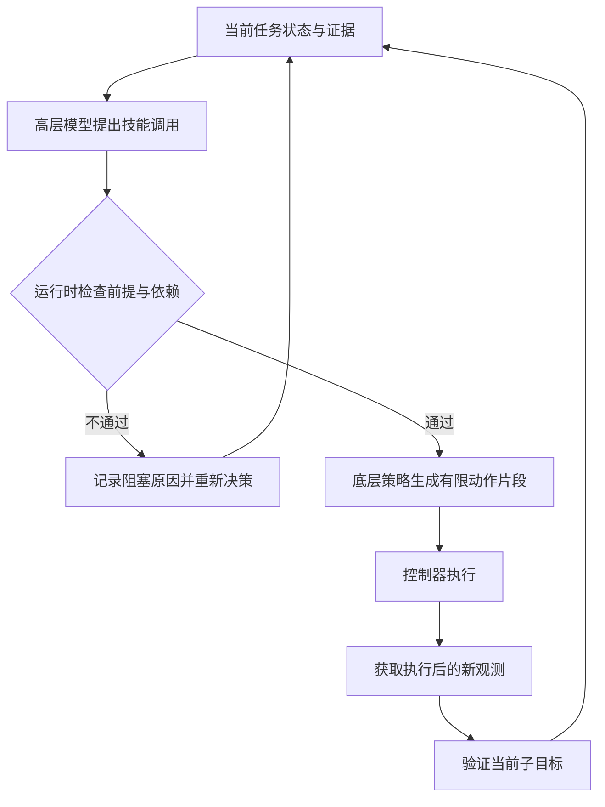

# EmbodiedSkills 如何把动作模型放进可检查的执行循环

> 状态：机制教学 · 原文 arXiv:2609.01281v1 · 未复现

一个模型能够给出“下一步怎么动”，和一个机器人能够可靠完成整件事，中间还隔着很多工作。EmbodiedSkills值得初学者关注，是因为它把这个间隙变成了明确的接口问题：谁提出动作，谁检查它现在能不能执行，执行后谁判断结果？[1]

## 先区分模型建议与世界事实

假设一个机器人要把海绵放进盒子。模型输出“已抓住海绵，接下来移动到盒子上方”。这句话可能通顺，下一步也可能看上去合理，但真实夹爪里也许什么都没有。

从软件角度看，模型刚刚产生的是一段输出；从物理角度看，世界未必发生了对应变化。如果程序把这段话直接写进状态，后续步骤就会建立在一个不存在的事实之上。

这个教学例子揭示了具身Agent的一条基本原则：计划属于意图，传感器记录属于证据，执行报告属于发生过的操作。三者应该联系起来，并分开存放。

EmbodiedSkills将高层决策当成提案，交给独立运行时检查；技能具有输入输出类型、前提、执行、状态更新与失败定义。观测和动作还携带来源及新鲜度信息，依赖变化后使相关旧结果失效。[2]

## 契约可以理解成一张带条件的工单

这里的“契约”更接近一张工单，说明这个模块需要什么、允许做什么、完成后留下什么证据。

在海绵例子里，我们可以自己设计一张工单：输入包括当前图像、目标盒子的标识和当前子目标；前提是盒子定位结果仍与这张图像对应；输出包括动作片段和执行状态；失败时要说明是缺少观测、动作格式错误，还是已经尝试但未达到目标（这是为理解概念编写的示意，不是论文代码接口的逐字复刻）。

关键是“当前”二字。假设盒子刚被人移走，十秒前的定位结果仍然格式正确，却已经不能支持本次运动。检查数据类型能防止把字符串当坐标，检查依赖和新鲜度能防止把旧坐标当当前坐标。这是两种不同的问题。

图为本文自绘的教学简图。注意它没有从“模型说成功”直接连到“任务完成”。最终是否完成仍应由任务的成功标准决定。

## 为什么动作要分段

如果机器人把完整任务一次性展开成一长串动作，然后不再观察，最开始一个小偏差就可能一路传下去。把动作分成有限长度的片段，相当于给执行过程留出检查站。

不过，检查站不是越密越好。拍图、调用模型、等待推理都会增加时间。在海绵远离障碍物的移动阶段，可能无需频繁判断；接近盒沿、发生接触时，新的证据可能更重要。如何分配检查频率，是执行可靠性与开销之间的设计问题。

论文把观察、规划、执行前检查、动作执行、验证、恢复组成可回访的循环，低层视觉语言动作模型（VLA）负责有限动作片段。验证既可以要求继续当前子目标，也可以要求重看、重规划或恢复。[2]

若海绵已经夹住，只差移动到位，下一段可以延续动作；若新图像显示夹爪为空，就应重新检查抓取状态。把这两种情况都写成“retry”，会隐藏真正需要改变的内容。

## 模块化为什么有助于训练

对于初学者，训练模型常常被想象成“把整个系统放进一个大黑箱”。但一个系统也可以分别改进几个组件，只要它们在同一接口上合作。

例如，规划器练习把任务拆成可验证的小目标；动作策略练习根据图像完成某个小目标；验证器练习判断新观测是否支持目标已经达到。训练样本若记录了前后状态和错误原因，就能帮助区分到底是哪一层出了问题。

这里还有一个容易忽略的条件：训练时提供给模型的证据，部署时也应该取得到。如果训练答案总能看到模拟器内部的真实坐标，而真机只有有遮挡的照片，离线成绩可能过于乐观。

把日志变成持续学习，还需要选取监督目标、判断标注是否可信，并决定何时更新模型。EmbodiedSkills的在线优化是可选路径（不能拿它解释所有主实验提升）。[2]

## 最重要的数字限定

论文报告RoboTwin 2.0为86.20%，LIBERO为97.40%；这些是任务适配低层策略的执行结果。尤其RoboTwin是50个任务各自微调一份π0.5策略（不能改写为“一个通用Agent在陌生任务上的成功率”）。四项依赖记忆的RMBench任务平均仅12.5%。[1][2]

更直接检验循环作用的是受控消融：同一组50任务、每项100回合，完整循环86.2%，去掉中间验证48.2%，去掉子任务条件34.4%，每子任务只给一个32步片段19.5%。前两种去除条件保留总动作预算；单片段条件则改变可用执行机会，解释时要分开。[2]

这组结果支持“在这套任务适配系统中，中间验证和子任务条件很有价值”。

本篇最值得记住的一句话是：具身Agent的可靠性，不只来自“会提出更好的动作”，也来自“让每次执行有明确前提，并让执行结果接受新的证据检验”。

## 局限与后续

**契约只保证它检查的条件。** 契约能够阻止“没有必要证据却直接执行”这类结构错误。但若视觉模块把海绵误认成抹布，错误结果仍可能拥有正确字段和足够新的时间戳。形式检查通过，语义判断仍然错误。论文§6自己写明了同一点：显式契约防止非法状态转移，却不能单独保证一个语义上说得通的模型决策是对的；整体表现受高层决策和低层动作两层共同约束，引导循环的质量仍取决于规划、验证和动作生成的校准。[2]

验证也有类似边界。盒子有盖子时，一张外部图像也许根本无法判断海绵是否在里面。此时诚实的结果应是证据不足，而不是把低置信度猜测包装成确定成功。系统还需要能获取更有判别力的观察，或者停止等待人工处理。

做一个纸面练习就能检验是否理解：在流程图中插入“人突然移动盒子”。找出哪些结果失效、哪些仍可保留、机器人必须重新获取什么。若答案只是“再问一次大模型”，就还没有真正设计状态管理；若能指出图像、目标绑定、动作片段之间的依赖，便抓住了这篇工作的核心。

**记忆是最弱的一环。** 四项依赖历史交互的 RMBench 任务平均只有12.5%，而 RoboTwin 主结果是86.20%。[2] [判断] 循环里的状态只覆盖当前任务的证据，缺少跨步骤、跨回合的情景记忆。补这一层的候选是 [MEMORA](../memora/reading.md)（从第一人称视频形成可检索记忆）和 [HoloAgent-0](../holoagent-0/reading.md)（三维空间记忆），但两者目前都没有在这样的闭环操作基准上测过。

**技能从哪里来。** 本文的低层技能是每个任务单独微调的 π0.5，新任务仍需要新的示范与微调。[判断] 同月稍晚的 [RoboSkill](../roboskill/reading.md) 走另一条路：不改模型权重，把执行过的代码和反馈记录整理成外部技能库；两者合起来正好覆盖“技能怎样被检查”与“技能怎样积累”，但还没有工作把两者放进同一系统比较。

## 参考资料

[1] arXiv身份、版本与摘要，EmbodiedSkills，2026-09-01 v1：https://arxiv.org/abs/2609.01281

[2] EmbodiedSkills v1全文，重点为§3–6、算法1、表2–5：https://arxiv.org/html/2609.01281v1

## 批注

**易误读**

- EmbodiedSkills 与 RoboSkill 是两篇独立工作，不是彼此的前一版或后一版；它也不是某个通用智能结论的证明。
- 计划“把海绵放进盒子”与新图像显示“海绵在盒内”不能具有相同的地位，三者不能混成同一个字段（§先区分）。
- 验证器不是只能输出“成功/失败”的打分器；继续执行也不等于盲目重试（§为什么动作要分段）。
- “训练证据部署时也应取得到”是理解模块化训练的一般方法，不表示本文另外测量了训练泄漏。记录日志并不自动产生一个会持续学习的系统（§模块化）。
- 受控消融不能单独回答“如果底层策略完全没见过任务，会怎样”，后者需要另外的训练划分和泛化测试。
- 主表的参考数字来自已发表基准或官方发布，不是所有基线都在本轮重新训练和运行，应视为带协议背景的结果比较；判断某个运行时机制的因果作用，优先看保持其他条件不变的消融（表5）。
- “有执行前条件检查”不能直接等同于物理安全保证。这种检查保障的是它实际检查的条件；没建模的危险、不准确的感知、延迟中的场景变化，仍可能存在。

**与其他论文的关联**

- `[历史]` 相关工作把 [SayCan](../saycan/reading.md)、Inner Monologue、Code as Policies 列为前作。SayCan 只在执行前用价值函数估计可行性，本文把选择之后的前提检查、执行后验证与恢复写成显式契约。
- 低层策略是 [π0.5](../arxiv-2504.16054/README.md)；LIBERO 上的高分对照可参考 [OpenVLA](../openvla/reading.md) 与 [OpenVLA-OFT](../arxiv-2502.19645/README.md) 的同一基准结果。
- [RoboSkill](../roboskill/reading.md) 把执行记录整理成外部技能，[MEMORA](../memora/reading.md) 形成跨经历记忆；与本文一起，分别对应具身 Agent 闭环中的“积累”“记忆”“检查”三段，见 [具身 Agents 讲义](../../fields/embodied-agents.md)。

**未核实 / 待验证**

- 本页核读了全文方法§3、训练§4、实验协议与全部实验类型§5、限制§6，特别核查了§5.1 的每任务微调、表5的消融条件以及最终成功由环境判据决定的说明。没有运行模型或机器人实验，没有独立复现表中数字。
- 截至核验，版本记录只有 v1；核验材料未给出已确认的官方代码仓库，因此不凭名称猜测仓库地址。
