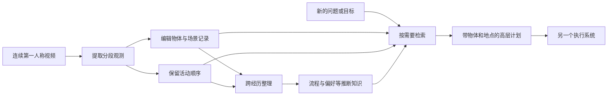

# MEMORA 如何把看过的经历变成以后可用的记忆

> 状态：机制教学 · 原文 arXiv:2607.14252v2 · 未复现

让机器人记住一段视频，和让机器人下次做事时用对那段经历，是两个问题。MEMORA研究后者所需的记忆系统：第一人称视频不断到来，物体会移动、状态会变化，人也会重复某些做法；系统怎样把这些经历整理成能支持以后推理和规划的材料？[1]

## 先用一只杯子解释记忆的难处

假设一段家庭厨房视频先拍到蓝杯在桌上，后来有人把它洗净，再放进橱柜。第二天又拍到同一只杯子。最简单的系统会存四条文字：“蓝杯在桌上”“蓝杯被清洗”“蓝杯在橱柜”“又看到蓝杯”。

记录本身没错，但以后问“那只杯子最后被放在哪里”，系统需要先确认几次出现是不是同一个物体，再理解它们的时间关系。若检索只返回最相似的一条文字，可能拿到昨天早上的桌面位置。

另一个问题是“主人通常用哪只杯子”。一次拿蓝杯不够证明偏好。它也可能只是因为其他杯子都脏了。重复经历能提供更强证据，但把多次事件概括成习惯，又会引入新的推断。

以上是本文自拟的教学例子。它把三种信息分开了：一次观测、随时间变化的物体记录、从多次经历推测出的规律。把它们全当成同等可靠的事实，正是记忆系统容易出错的地方。

## 为什么要分成不同记忆

MEMORA使用环境、实体、活动、推断知识四种存储：分别保留地点结构、物体身份与状态、事件顺序，以及跨经历整理的流程或偏好。在线编辑维护物体记录，离线整理形成可复用规律；查询时再组合相关材料。[2]

用蓝杯例子理解，厨房橱柜与水槽的位置关系属于环境；蓝杯的外观和位置变化属于实体；“取出、清洗、放回”的顺序属于活动；“经常使用蓝杯”则只能作为有依据的推断。这种分类的意义在于更新方式不同。

一条已经发生的事件不应因为杯子移动就被改写。相反，物体的最新记录应该随着新证据更新。习惯记录又需要积累多次支持，不能见到一次反例就立刻翻转，也不能永远不变。这是理解“不同更新速度”的一个直观方法。

图为本文自行绘制的概念图。最后保留“另一个执行系统”很重要：记忆负责提供相关背景，并不因此获得机械臂控制能力。

## 记忆形成和记忆使用要分开看

一个检索器只能找到已经保存下来的东西。如果感知阶段根本没看到杯子，后面换更强的搜索算法也未必有用。反过来，保存了大量准确内容，若查询方式错误，也可能检索出无关经历。

因此可以把系统分成两个阶段来理解。形成阶段回答“哪些观测要写入，怎样与旧记录合并”；使用阶段回答“这个新目标需要什么证据，怎样把通用流程绑定到具体对象”。例如，“准备饮品”需要一般步骤，也需要知道这个人使用哪只杯子、杯子最后在哪里。只有步骤没有物体，计划会过于泛泛；只有物体没有步骤，系统又不知道如何组织行动。

官方实现按视频编码、记忆编辑与整理、规划三个阶段交换产物。公开说明同时区分重算保存输出的指标和重新运行模型；原始视频由EPIC-KITCHENS提供，仓库不重新分发。[2][3]

记忆中的“最后位置”只是最后观察到的位置（长期记忆指导去哪里找，现场仍要重新看）。

## 规划分数不能直接读成机器人成功率

MEMORA-Bench使用18名参与者的45小时厨房视频，包含回顾性问答和未来规划。规划的Replay复用已观察流程，Generalize需要迁移或组合。报告的RGP汇总顺序、关键物体和偏好三个文本规则指标；最高16.6%是相对提升，不是真机成功率。[1][4]

举一个纯数学的教学例子：若分数从0.30升到0.36，绝对增量是0.06，相对增幅是20%。这既不等于提高20个百分点，也不等于机器人完成了36%的任务。

论文的真机材料是Unitree G1上的两个定性任务，由固定规则控制器执行记忆生成的高层计划。它提供了“可以接到机器人上”的实例。[4]

## 一处必须读到附录的关键限定

主QA表的74.5%来自条件子集：无记忆基线答错，且MEMORA选择A–D内容答案的题目。附录B.5表9中，同一Gemma-4-31B骨干的全量准确率是46.1%，比最强非MEMORA条件低0.5个百分点。因此不能把74.5%或提升20.5点宣传成全量问答成绩。[4]

为什么这件事如此重要？设想一场考试允许回答“不知道”。只统计愿意作答的题目，可以帮助研究模型在有把握时答得怎样；统计全部题目，才回答整体系统表现怎样。两种视角都有价值，但分母不同，结果不能互换。

## 记忆也可能让系统更自信地出错

如果系统连续误认同一件物品，离线整理可能把误认压缩成一句非常清楚的规律。压缩减少了字数，却没有增加真实性。更糟的是，未来检索时会反复读到这句“整理好的知识”，让最初的感知错误看上去像多次验证。

所以设计一个学习练习时，可以故意放入两条冲突记录：昨天蓝杯在橱柜，今天有人把它放到餐桌。要求系统指出哪个是较新的证据，再问“它通常放在哪里”。后一个问题不能简单用最新一条覆盖所有历史，因为“现在在哪”和“通常在哪”不是同一个查询。

再给一个只有一次出现的做法，要求它判断能否形成偏好。如果它能够保留“证据少，暂不确定”，就比把任何行为都写成稳定喜好更可靠（这些是本文提出的练习）。

厨房记忆还涉及真实人的生活规律。若未来应用要长期记录，应让参与者知道保存了什么、用于什么、怎样删除，并限制访问。

## 它在具身Agent里补的是哪一层

动作模型解决怎样动，执行循环解决何时执行和如何检查，MEMORA关心过去经历怎样帮助现在决定。它补充的是经验背景层，与实时地图、几何定位和底层控制并列。

更有用的结论是：记忆是一段从感知、更新、概括到检索的过程，每一步都有自己的错误模式；有效记忆必须在新的问题和行动中证明价值。

## 局限与后续

**论文自述的局限。** 评测只覆盖 EPIC-KITCHENS-100 扩展视频中的厨房活动，每名参与者最多15段会话；效果依赖感知质量与写入时的记忆编辑；与 Flat-1D、Graph-2D 的比较评估的是完整记忆接口，包括表示、检索工具和提示；Unitree G1 的结果是定性的迁移检查，不是闭环机器人基准。[4]

**从相邻工作反推。** [判断] 最大的空缺是“记忆进入闭环执行”这一步。几乎同时的 [EmbodiedSkills](../embodiedskills/reading.md) 在四项依赖交互历史的 RMBench 任务上平均只有12.5%，说明现有执行循环恰好缺这种记忆；而 MEMORA 的机器人部分由固定规则控制器执行文本计划，记忆是否真能提高闭环操作成功率还没有被测量。另一处空缺是空间几何：本文的环境存储是语义层面的地点结构，[HoloAgent-0](../holoagent-0/reading.md) 那种可导航的三维空间记忆不在本文范围内。依据是三篇原文的实验部分与 MEMORA 的局限节。

## 参考资料

[1] arXiv版本记录、官方摘要及会议说明，MEMORA：https://arxiv.org/abs/2607.14252

[2] 官方代码仓库README，记忆结构、阶段划分、发布范围与复现入口：https://github.com/yuzihaowashu/MEMORA

[3] 官方管线文档，编码、编辑、整理和规划之间的数据接口：https://github.com/yuzihaowashu/MEMORA/blob/main/docs/PIPELINE.md

[4] MEMORA v2全文，重点为§3–6、附录A.2、B.5、C.2–C.3、C.6和D：https://arxiv.org/html/2607.14252v2

## 批注

**易误读**

- 版本：v1 发表于2026年7月15日，v2 于8月31日；官方说明 v1 对应 RSS workshop 报告、v2 对应 EMNLP 2026 录用。两者是同一论文的修订，本页按 v2 引用。[1]
- RGP 的指标名称中出现“Robot”，并不会改变测量对象：它测文本计划，不测真机执行（§规划分数）。
- 计划中写出“蓝杯”不代表机器人在现场认对了某一只蓝杯。两只外观近似的杯子、遮挡、抓取滑落，都可能让文字计划正确而物理执行失败；语言层面的物体覆盖率与实例级视觉定位，应由不同证据验证（附录 C.6）。
- 两个定性的 G1 任务不足以估计大规模闭环成功率（附录 D）。
- 74.5% 的条件筛选不是“只挑 MEMORA 答对的题”，原文明确保留了它承诺回答但答错的情况。正确的批评是条件诊断不能代替全量评估，而不是无证据地指控作者只展示正确答案（附录 B.5）。
- 不同记忆家族不仅存储形式不同，检索工具和提示也不同。完整系统 A 超过完整系统 B，不能自动断定胜因就是“四个存储”这个单独组件；固定接口的编辑前后比较、去掉离线整理的比较，才更接近隔离某个机制。
- 如果视频结束后杯子被别人移动，机器人仍应重新看当前场景；长期记忆不能替代实时感知。
- 技术上能推断某个习惯，不等于已经获得了保存或使用它的许可。
- 读完不必得出“给 Agent 加记忆就一定更好”的口号。

**与其他论文的关联**

- `[历史]` 相关工作把 [SayCan](../saycan/reading.md) 作为“用语言模型、代码或技能库连接感知、推理与行动”的代表；SayCan 只用当前决策步的价值函数获取环境信息，没有跨经历记忆。
- [HoloAgent-0](../holoagent-0/reading.md) 的三维空间记忆与本文的情景记忆互补：前者回答“东西在哪、怎么去”，后者回答“发生过什么、人习惯怎么做”。
- [EmbodiedSkills](../embodiedskills/reading.md) 的 RMBench 记忆任务结果（12.5%）给出了执行循环缺少记忆时的代价；[RoboSkill](../roboskill/reading.md) 保存的是“怎样做”的技能，本文保存的是“发生过什么”的经历，两者都在权重不变时改变系统行为，见 [具身 Agents 讲义](../../fields/embodied-agents.md)。

**未核实 / 待验证**

- 本页核读了 v2 主文的定义、方法、实验与限制，并针对关键结论阅读附录 A.2 更新语义、B.5 全量与条件评估、C.2–C.3 工具和指标、C.6 物体指标限制、D 真机协议与结果。没有通读全部提示模板，没有逐行比较 v1 与 v2，没有运行模型或重算官方保存结果；数值是作者报告值。
- 三类记忆“不同更新速度”的写法是本页的直观解释，论文附录 A.2 的更新语义细节没有逐条对照。
