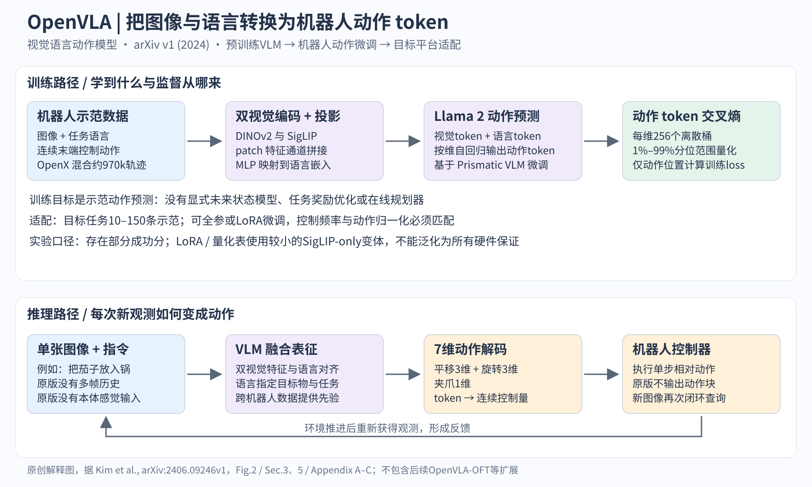

# OpenVLA：把现成的视觉语言模型直接微调成机器人策略

> 状态：技术精读 · 原文 arXiv:2406.09246v1 · 未复现

## 一句话

图像和指令进去，7 个"动作词"出来，用语言模型的下一词预测完成机器人控制；Kim 等（2024）用一个 7B、完全开放的模型和清洗过的跨机器人数据，把这条路线做到了 55B 闭源模型的水平之上。

## 它要解决的问题

[RT-1](../arxiv-2212.06817/README.md) 用大规模真实示教训练 Transformer 策略，但没有借用互联网知识。[RT-2](../arxiv-2307.15818/README.md) 把动作写成文本 token，从预训练视觉语言模型（VLM，一句话：能看图回答文字问题的模型）微调出机器人策略，第一次让网页知识迁移到动作上。作者把这类模型称为 VLA（vision-language-action，视觉-语言-动作模型）。

RT-2 路线卡在两处。第一，模型闭源：RT-2-X（RT-2 在 [Open X-Embodiment](../arxiv-2310.08864/README.md) 跨机器人数据上训练的版本）有 55B 参数，外界看不到架构、训练过程和数据配比。第二，没有给出"怎样把 VLA 适配到新机器人、新任务"的做法。同期开放的 [Octo](../arxiv-2405.12213/README.md) 可以微调，但它把预训练的语言嵌入或视觉编码器与从零初始化的模块拼在一起，让策略训练去学习"缝合"。

OpenVLA 要回答：一个 7B、权重和代码都开放、整体从预训练 VLM 出发的模型，配上更好的数据，能否追上 RT-2-X，并且让普通实验室能在自己的机器人上微调？

## 核心想法

架构上几乎没有新东西，这本身就是结论之一：RT-2 的"动作即词"接口原样可用。增量集中在三处。

1. **底座换成开放的 Prismatic-7B**（Karamcheti 等 2024 年的一组视觉语言模型，把 DINOv2 和 SigLIP 两种视觉特征拼接后接入 Llama 2）。DINOv2 是自监督训练的视觉编码器，作者引用的理由是它的特征有助于空间推理；SigLIP 是图文对比预训练的视觉编码器，提供与语言对齐的语义。
2. **数据**：从 Open X-Embodiment 中筛选并重新加权，得到约 97 万条真实机器人轨迹，并做了几处清洗（见"机制"第 3 小节）。
3. **训练时连视觉编码器一起微调**。消融显示，冻结视觉编码器会使成功率从约 70% 降到 47%（这组消融用的是较小的 SigLIP-only 变体，不是最终模型）。这说明互联网预训练得到的视觉特征，不足以直接支撑精细操作。

另外两项是工程贡献，但决定了"普通实验室能用"：LoRA 微调只训练约 1.4% 的参数就接近全参数微调；4 bit 量化后推理显存降到 7 GB 而成功率不降。

## 机制

### 1 从图像和指令到动作 token

输入是一张 224×224 的第三人称图像和一句语言指令。同一张图分别进入 DINOv2 和 SigLIP，两路的 patch（一句话：图像切成的小块，每块对应一个特征向量）特征按通道拼接，再由两层 MLP 投影到 Llama 2 的词嵌入空间，成为一串"视觉 token"。指令经 Llama 分词器变成文本 token，与视觉 token 排成一个序列。Llama 2 在这个序列后面自回归地预测 7 个动作 token。[Fig.2；Sec.3.1]

7 个维度是末端执行器（一句话：机械臂末端的夹爪及其坐标系）的 3 维平移、3 维旋转和 1 维夹爪开合。输出的是每一步的相对运动命令，由机器人自己的控制器去执行；图像更新后模型重新预测，构成闭环。

### 2 连续动作怎么变成词（示例数值）

每个动作维度独立离散成 256 个桶。桶的范围取训练数据中该维度的第 1 和第 99 百分位，而不是最小值和最大值，这样少数离群动作不会把桶撑宽。[Sec.3.2]

假设训练数据中末端 x 方向平移的 1% 和 99% 分位数分别是 −0.02 m 和 0.02 m（示例数值）。

- 桶宽 = 0.04 / 256 ≈ 0.000156 m，约 0.16 mm。
- 当前动作 0.006 m 落在第 ⌊(0.006 + 0.02) / 0.04 × 256⌋ = ⌊166.4⌋ = 166 号桶（从 0 计数）。
- 166 号桶对应 Llama 词表里最不常用的 256 个 token 之一。之所以覆盖低频词而不是新增特殊 token，是因为 Llama 分词器只预留了 100 个特殊 token，不够 256 个。
- 解码时把 166 号桶还原为一个连续值，例如桶中心 −0.02 + 166.5 × 0.000156 ≈ 0.00602 m，与原值相差约 0.02 mm。

7 个维度依次预测，得到 7 个 token。训练目标是只在这 7 个位置上算交叉熵：L = −Σⱼ log p(uⱼ | 图像, 指令, u₍<ⱼ₎)，其中 uⱼ 是第 j 维的桶编号（原文用文字描述，这里写成公式）。

这样做的直接后果有两个：

- 分辨率由桶宽决定，本例约 0.16 mm。
- 7 个维度逐个解码，单次推理比一次性输出慢；每一步只输出一个时刻的动作，没有动作块（action chunk，一句话：一次预测未来多步动作）。这两点正是后来 [FAST](../arxiv-2501.09747/README.md)、[π0](../arxiv-2410.24164/README.md) 和 [OpenVLA-OFT](../arxiv-2502.19645/README.md) 要解决的问题。

### 3 数据与训练：方法章节之外的关键

训练数据是约 97 万条轨迹，筛选条件是至少有一个第三人称相机、单臂末端控制，采样权重基本沿用 Octo 的配比。[Sec.3.3；Appendix A]

两处数据处理容易被忽略，却直接影响结果：

- **过滤全零首帧**。BridgeData V2（WidowX 机械臂上采集的桌面操作数据集）的每条示教，第一个转移的动作都是全零。不过滤的话，强模型会学到"开局不动"。OpenVLA 过滤了这些动作。[Appendix C]
- **DROID 中途移除**。DROID 数据集最初占 10% 权重，因为其动作 token 准确率一直上不去，作者在训练的最后三分之一把它移出混合。复现时只照搬静态比例表，等于换了一份数据。

训练用固定学习率 2×10⁻⁵、batch 2048，在训练集上过 27 个 epoch，64 张 A100 训练 14 天，约 21,500 A100 小时。把图像分辨率提到 384×384，在作者的评估中没有提升，训练却慢约 3 倍。[Sec.3.4–3.5]

## 证据：哪个实验支撑哪个主张

| 主张 | 支撑实验 | 怎么读 |
|---|---|---|
| 7B 开放模型可以超过 55B 闭源模型 | WidowX 上 17 任务 × 10 次 = 170 次试验：OpenVLA 70.6%，RT-2-X 50.6%（Table 4） | 7B 比 55B 高约 20 个百分点，说明数据处理和视觉微调可以抵消约 8 倍的参数差距。部分任务允许 0.5 分 |
| 在 RT-2-X 的"主场"也不落后 | Google 机器人 12 任务 × 5 次 = 60 次：85.0% 对 78.3%（Table 5） | 标准误区间重叠，作者的结论是"相近"，不是"胜出" |
| 预训练 VLM 让新机器人适配更强 | Franka 机械臂 7 个任务，每任务 10–150 条示教：OpenVLA 67.2%，从头训练的 Diffusion Policy 48.5%（Table 6，Franka-Tabletop） | 优势来自多物体、需要听指令的任务；在"倒玉米"这类单指令窄任务上，Diffusion Policy 100% 对 OpenVLA 50% |
| 视觉编码器必须一起微调 | 同一小变体上：全参数微调 69.7%，冻结视觉 47.0%，只调最后一层 30.3%（Table 1） | 小规模 SigLIP-only 变体上的结论 |
| LoRA 足够 | LoRA rank 32：68.2%，可训练参数 97.6M（约 1.4%）；全参数 69.7% | 同上，小变体。batch 16 时 LoRA 仍需 59.7 GB 显存，全参数 163.3 GB |
| 4 bit 量化不掉点，8 bit 反而掉 | bfloat16 71.3% / 16.8 GB；int4 71.9% / 7.0 GB；int8 58.1% / 10.2 GB（Table 2） | 作者把 int8 掉点归因于推理变慢：A5000 上 int8 约 1.2 Hz，低于数据采集时 5 Hz 的控制频率 |

最后一行值得多想一步：int8 的离线 token 准确率与其他精度接近，掉点发生在闭环里。推理延迟本身改变了"观测→动作"的时序，也就改变了机器人看到的闭环动力学。评估 VLA 时，离线准确率和在线成功率是两个测试。

## 局限与后续

- **只看单帧、没有本体状态、没有动作块**。论文自述只支持单图像观测。[OpenVLA-OFT](../arxiv-2502.19645/README.md) 以 OpenVLA 为底座，换成并行解码、动作块、连续动作表示和 L1 回归，在 LIBERO 仿真基准四个任务组上的平均成功率从 76.5% 提到 97.1%，动作生成吞吐提高 26 倍。
- **逐维分桶不适合高频灵巧控制**。论文自述推理吞吐不足以支撑 ALOHA 这类 50 Hz 的高频控制，主模型在 RTX 4090 上约 6 Hz。[FAST](../arxiv-2501.09747/README.md) 指出逐维、逐时刻分桶在高频数据上表现差，改用离散余弦变换压缩整段动作序列再分词。[π0](../arxiv-2410.24164/README.md) 换掉离散 token，在预训练 VLM 上接 flow matching 生成连续动作。
- **语义泛化弱于 RT-2-X**。在 BridgeData 的语义泛化类别上 RT-2-X 领先。作者认为原因是 RT-2-X 预训练数据更大，并且机器人数据与互联网图文数据一起微调（co-fine-tuning，[RT-2](../arxiv-2307.15818/README.md) 的配方），而 OpenVLA 的机器人训练阶段没有混入图文数据。
- **可靠性**。论文自述成功率通常低于 90%，还达不到高可靠部署。

VLA 方向的整体脉络与这些后续工作的分工，见 [VLA 逐步讲义](../../fields/vla.md)。

## 批注

**易误读**

- WidowX 部分任务允许 0.5 分（例如接近正确目标但没完成），所以 BridgeData 表中的成功率不是完整成功的 episode 比例；Google 套件是 0/1 评分（Appendix B.1–B.2）。
- 摘要中"比 RT-2-X 高 16.5 个百分点"是两个平台 230 次试验的加权汇总：Table 4 积分 120 对 86，Table 5 成功 51 对 47，(171 − 133) / 230 ≈ 16.5。它与 BridgeData 单独的约 20 个百分点是不同口径，也不是 29 个任务等权平均。
- Table 1 和 Table 2 的效率实验使用较小的 OpenX 数据混合和 SigLIP-only 架构，不是最终的 DINOv2 + SigLIP 模型（Table 1 脚注）。
- Diffusion Policy 的对比有两个版本：完整版带两帧历史、本体状态、动作块和绝对位置输出；matched 版去掉这些，改成单步相对动作以匹配 OpenVLA 接口（Sec.5.2 脚注）。"OpenVLA (scratch)"指从 Prismatic VLM 直接在新任务上微调，参数并非随机初始化。
- 与 RT-2-X 的比较中，RT-2-X 没有按过滤全零首帧的数据重训；作者为缓解它"不动"的问题，查询其概率第二高的动作（Appendix C）。所以这组对比混合了架构、数据清洗和查询方式，不是单变量消融。
- int8 掉点的延迟解释是作者的归因，没有隔离延迟做单独实验（Sec.5.4）。
- "开放"的范围：OpenVLA 发布了权重、微调示例和 PyTorch 训练代码；它依赖的 SigLIP、DINOv2、Llama 2 只开放权重，训练数据和代码未公开（p.2 脚注 1）。

**与其他论文的关联**

- `[历史]` 逐维 256 桶离散化继承自 [RT-2](../arxiv-2307.15818/README.md)（原文写明 "Following Brohan et al."），OpenVLA 把桶的范围从最小-最大值改为 1%–99% 分位数。[FAST](../arxiv-2501.09747/README.md) 用 DCT 压缩整段动作，解决逐维分桶序列冗长、高频失效的问题。
- 单帧、无本体状态、无动作块这三个限制，分别被 [π0](../arxiv-2410.24164/README.md)（每台机器人 2–3 张图像、关节角状态、50 步动作块；π0 原文把 OpenVLA 的差距归因于不支持动作块和高频控制）和 [OpenVLA-OFT](../arxiv-2502.19645/README.md)（同一底座上的并行解码与动作块）改进。
- `[结构]` 视觉侧的两个编码器分别延续两条预训练路线：SigLIP 属于 [CLIP](../../../multimodal/papers/clip/README.md) 式图文对比学习，DINOv2 属于 [DINO](../../../multimodal/papers/dino/README.md) 式自监督学习。"视觉 token 经 MLP 投影进 LLM 词嵌入空间"的接口与 [LLaVA](../../../multimodal/papers/llava/README.md) 相同。
- 在窄任务上输给 [Diffusion Policy](../diffusion-policy/reading.md)，说明"预训练 VLM 带来的语言与多物体泛化"和"连续动作生成带来的精度"是两种不同的收益。π0 试图同时拿到两者。
- 过滤全零首帧这一数据处理，对任何使用 BridgeData 的工作都适用。

**未核实 / 待验证**

- 未核对官方代码某个 commit、权重下载与当前依赖，未运行 LoRA 或量化实验。
- RTX 4090 上约 6 Hz 是作者在未使用编译、投机解码等加速手段时的测量，换硬件或实现后不保证。
- 数值出处与页码定位见 [证据档案](../../../docs/deep-readings/evidence/openvla.json)；机制图源文件见 [SVG](figures/openvla_mechanism.svg)。
