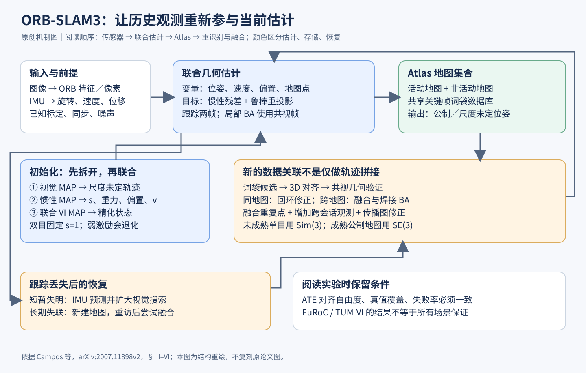

# ORB-SLAM3 全文精读与机制图解

> 角色：传统视觉／视觉惯性／多地图 SLAM 的开放系统基线，不是 ESKF 的实现，也不是语义地图或学习式感知基线。本文固定阅读 arXiv:2007.11898v2（2021-04-23，18 页，含封面、参考文献及作者简介），覆盖正文 I–VIII；该版本没有技术附录。以下图为独立绘制的机制解释图。

## 1 从研究问题读起

机器人连续看到图像，为什么不能只把相邻两帧接起来？局部视觉里程计会不断丢弃离开窗口的观测，误差随路程累积。真正的 SLAM 还要回答“这是不是以前来过的地方”，并让旧地图直接帮助当下定位。ORB-SLAM3 的核心，是把短期跟踪、中期共视、长期回环和跨地图关联统一进同一套几何优化系统；IMU 初始化和地图融合是让这个目标可靠工作的关键环节。

论文的贡献应按系统理解。ORB 特征、束调整、词袋识别和惯性预积分都不是本文新发明。本文重点在于：从初始化开始一致使用最大后验估计；提高地点识别召回率；用 Atlas 管理失联地图并在重新相遇时精细融合；抽象相机模型以支持鱼眼和非校正双目。把这些合起来形成可运行、可测量、可恢复的系统，比只列几个模块名更接近作者真正解决的问题。[来源：§I–IV]

## 2 状态、观测和输出分别是什么

关键帧状态为 Sᵢ={Tᵢ,vᵢ,bᵍᵢ,bᵃᵢ}：Tᵢ包含世界坐标中的姿态 Rᵢ与位置 pᵢ；vᵢ是速度；两个 b 是陀螺仪与加速度计偏置，按随机游走建模。地图变量是三维点 Xⱼ。图像观测是特征像素 uᵢⱼ，IMU 观测是两关键帧之间的角速度和加速度序列。相机内参、相机与 IMU 的刚性外参及噪声参数需要预先提供。系统输出轨迹和稀疏地图，不直接输出电机力矩，也没有一个供策略优化的动作变量。

纯单目观测不能独自确定公制尺度，因此只可在相似变换意义下恢复结构；双目由已知基线提供尺度，视觉惯性模式还需足够运动激励才能辨识重力、尺度和偏置。观测越多并不自动消除退化，纯旋转不能为单目新点提供足够三角化视差，缓慢、缺少俯仰横滚的运动也可能使惯性初始化困难。这是把 SLAM 接入机器人控制时必须检查的可观测性前提。[来源：§IV–V、§VIII]

## 3 从残差看懂联合估计

视觉残差为 rᵢⱼ=uᵢⱼ−Π(T_CB Tᵢ⁻¹Xⱼ)。它比较实际像素和由当前位姿、地图点预测的像素，Π采用该相机实际投影模型。误匹配不可避免，所以视觉项经过 Huber 鲁棒核。鱼眼支持不是简单把图像拉直；系统把投影、反投影和雅可比封装，使用投影射线进行相机模型无关的重定位，双目也不要求全部图像校正成平行针孔相机。

惯性预积分把高频采样压缩成两帧间的 ΔR、Δv、Δp 和协方差。以速度项为例，r_v=Rᵢᵀ(vᵢ₊₁−vᵢ−gΔt)−Δv；位置项再扣掉 vᵢΔt 与 ½gΔt²；旋转项通过 Log(ΔRᵀRᵢᵀRᵢ₊₁)落到三维切空间。联合目标把各惯性残差的协方差加权平方和与鲁棒重投影项相加。它让同一组状态同时解释图像和 IMU，而不是先各自估计再平均。[来源：§V-A，式1–4]

跟踪与建图并不每次求解整个目标：跟踪只优化最近两帧状态，地图点固定；局部建图优化滑动窗口及其地图点，并引入共视关键帧的观测，窗口外相关位姿固定。这样能使用时间很久以前但仍共视的图像，提高视差约束，又控制在线计算量。这与滤波器只递推均值和协方差的架构不同；阅读 ESKF 是数学准备，而不是声明 ORB-SLAM3 内部采用 ESKF。

## 4 为什么初始化要拆成三阶段

第一阶段先运行约两秒纯视觉 SLAM，在单目情况下得到尺度未定但几何相对准确的轨迹与地图。第二阶段暂时固定视觉轨迹，只用惯性残差和偏置先验，估计尺度 s、重力方向 R_wg、偏置及速度。显式优化尺度比指望它在大规模联合优化中慢慢涌现更直接。尺度更新写成 s←s·exp(δs)，保证为正；重力方向只有两个有效自由度，因为绕重力轴的旋转不改变重力。[来源：§V-B，式5–10、图2]

第三阶段把尺度应用到轨迹、速度和地图，重对齐重力，更新偏置并重新预积分，再做视觉惯性联合优化。随后还有阶段性精化及低成本尺度／重力再估计。双目已知尺度时就固定 s=1。论文报告短轨迹初始化约 5% 尺度误差，进一步精化后约 1%，但这来自文中实验条件，不能解释为任意运动两秒内必定成功。作者明确讨论弱激励下收敛不足，因此初始化质量应作为系统状态向下游暴露。

## 5 丢失、重识别与地图焊接

Atlas 维护一个活动地图和多个非活动地图，共用关键帧词袋数据库。视觉短暂失败时，视觉惯性跟踪先用 IMU 预测姿态扩大搜索；长时间失去跟踪则启动新地图，保留可用旧地图。它的价值是避免“一次遮挡就把整个任务清零”，而不是凭空消除遮挡时的漂移。

新地点识别先用词袋找候选，再检验三维对齐及几何一致性。关键改变是利用地图中已存在的共视关键帧验证，不总等三个未来连续关键帧到来。纯单目或尚未成熟的单目惯性地图需要 Sim(3)对齐，成熟的公制地图用 SE(3)；视觉惯性还检查重力方向一致。地点识别的高召回不能牺牲误闭环风险，因此多步几何验证不可省略。[来源：§VI-A]

若匹配来自另一张地图，系统先建立匹配区域的“焊接窗口”，变换位姿和点，合并重复点，再做局部束调整；随后用 essential graph 优化把修正传播到其余地图。视觉惯性焊接还包含速度、偏置及时间相邻帧的预积分因子。同一地图中的匹配则触发回环修正，必要时独立线程做全局 BA。地图融合不是仅把两条轨迹摆在一起，而是增加跨会话约束，使旧信息真正参与当前估计。[来源：§VI-B–D、图3]

## 6 实验结论要连同口径一起保存

EuRoC 单会话结果采用 11 条序列，每种配置运行十次取中位数，指标为 RMS ATE；纯单目用 Sim(3)对齐，其余配置用 SE(3)。表II的 ORB-SLAM3 双目惯性平均 ATE 为 0.035 m，单目惯性为 0.043 m。表中有些竞争系统采用不同真值处理或仅关键帧轨迹，星号平均值只统计成功序列；不能把不同对齐自由度、漏跑序列及真值口径的数字无条件排序。[来源：§VII-A、表II及脚注]

TUM-VI 多数序列只有起止区域有真值，因此相关 ATE主要反映累计漂移，不能称为整段逐帧误差。room 序列有完整真值，双目惯性平均 0.009 m，单目惯性 0.011 m（表IV，三次中位数）。户外长序列仍可能出现十米到几十米误差；稀少的近处特征会使尺度及加速度计偏置漂移。论文对户外还过滤超过20米的点，复现时须保留这个条件。[来源：§VII-B、表III–IV]

多会话评估把同环境序列逐个加入地图，EuRoC 报五次运行中位数。它支持“重访能改善定位与鲁棒性”，不等于对所有新场景泛化。时间在 i7-7700、32GB、CPU上测量：例如 V202 双目惯性跟踪总时间33.05±9.29 ms。跟踪实时不代表全局优化每次只需几十毫秒；全局 BA 可运行数秒，由独立线程承担。[来源：§VII-C–D、表V–VII]

## 7 与学习式机器人的连接和边界

对 VLA 或导航策略，ORB-SLAM3可以提供公制位姿、速度、地图约束和重定位机制，但稀疏几何点没有天然语义，也不说明某物可抓取。学习式特征、深度和动态区域分割可以替换或补充观测模块；替换后仍要重新检查匹配外点、协方差校准、尺度和闭环一致性。以上是结构性设计建议，不是本文做过的神经网络消融。

论文最主要的失败边界是低纹理，此外还依赖相机与惯性标定、同步、可重复识别和足够激励。本文没有全面动态场景剔除、LiDAR地图或端到端控制安全保证。值得复用的是“估计状态→可靠性判定→短暂预测→重定位／建新图→融合”的恢复闭环；学习策略也需要知道定位何时不可信，不能只取一个位姿数值当作真相。

## 8 建议复现与自测

先在同一数据、配置、代码版本下复现单目与双目惯性，并记录失败次数、完整／关键帧轨迹口径和对齐方法；再分别关闭IMU、回环及地图复用，检查精度来自哪里。自测问题：为何单目 ATE较小不代表尺度更准？为何共视帧可比只保留最近帧提供更多约束？若一次错误地图融合发生，哪些模块能发现？能够从状态、残差、数据关联和恢复机制回答，才算真正理解这个系统基线。

## 来源与审计

- [官方 arXiv v2 全文](https://arxiv.org/pdf/2007.11898v2)，重点索引：§V／图2；§VI／图3；§VII／表II–VII；§VIII
- [作者官方代码仓库](https://github.com/UZ-SLAMLab/ORB_SLAM3)（论文提供；本文未运行代码，未宣称独立复现）
- [逐条证据与版本](../../../docs/deep-readings/evidence/orb-slam3.json) · [阅读覆盖](../../../docs/deep-readings/evidence/orb-slam3-coverage.json)

## 图解文件与证据索引

[PNG高清图](figures/orb-slam3.png) · [SVG可编辑图](figures/orb-slam3.svg) · [结构化证据](../../../docs/deep-readings/evidence/orb-slam3.json)

来源类型：本次为细分方向新选择的 baseline，不是历史聊天提取。
