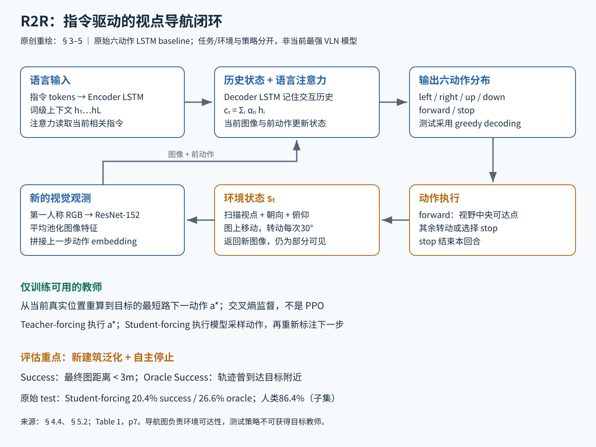

# R2R：在真实建筑的扫描里，按一句自然语言指令走到没去过的房间

> 状态：技术精读 · 原文 arXiv:1711.07280v3（CVPR 2018）· 未复现

## 一句话

Anderson 等提出视觉-语言导航（Vision-and-Language Navigation，VLN）任务：智能体在没见过的真实建筑里，读一段像"穿过厨房，在餐桌旁左转，停在卧室门口"这样的指令，边看边走，并自己决定在哪里停下。论文同时交付了三样东西：可交互的 Matterport3D 模拟器、Room-to-Room（R2R）数据集，以及一个带语言注意力的 LSTM 基线策略。

## 它要解决的问题

此前的视觉语言任务，如视觉问答（VQA）和图像描述，都只让模型对一张固定图像作答。作者指出，这些任务虽然常以机器人应用为动机，却没有一个允许智能体移动或控制相机：模型的输出不会改变它下一步看到什么。

另一方面，已有的指令导航研究多在渲染出来的合成环境里做。渲染环境里可见的物体只限于渲染器手工建好的模型库，指令也往往简单。

R2R 要建立的是两者的交集：**指令是人写的自由文本，图像来自真实建筑，测试建筑在训练中从未出现过**。在这个设定下，任务的难点从"看图答一个词"变成"输出的动作会改变下一张图像，并且在看不到全局地图时判断何时完成"。

## 核心想法

这是一篇任务与基准论文，增量在问题定义上，基线模型是当时的标准序列到序列结构。三个设计决定了 R2R 测的是什么：

1. **真实图像 + 离散视点图**。把 Matterport3D 的建筑扫描变成一张"视点图"，智能体在已扫描的视点之间跳转，看到的是真实拍摄的全景图像。这让交互可以无限重复，而图像仍是真实的。
2. **按建筑划分数据**。验证集分为 seen（建筑在训练中出现过，指令是新的）和 unseen（建筑从未出现）。只有 unseen 检验向新环境的泛化。
3. **主动停止 + 3 米成功判据**。智能体必须自己输出 stop；停下时离目标的图上距离小于 3 米才算成功。

基线方面，论文最有价值的一点是 **student-forcing**（一句话：训练时让模型执行自己采样的动作，但每一步的标签都由"从当前真实位置到目标的最短路"重新计算）。它让模型在训练中见到自己走错之后的状态。

## 机制

蓝色是语言与视觉策略，橙色是环境动作和新观察，绿色是只在训练时可用的最短路教师。

### 1 环境：视点图上的状态与动作

Matterport3D 原始数据有 90 个建筑级场景、10,800 个全景视点（由 194,400 张 RGB-D 图像构成），相邻视点平均相距约 2.25 m。基线策略只用 RGB 图像。[§3.1]

模拟器状态 sₜ = (vₜ, ψₜ, θₜ)：所在视点、水平朝向、俯仰角。视点之间的连通关系是一张加权无向图，边权为直线距离；建图时先用射线检测障碍，去掉长于 5 米的边，再人工检查窗户、镜子等造成的错误连接。平均每个建筑约 117 个视点，每个视点平均连 4.1 个邻居。[§3.2.2]

基线把动作简化为 6 个：left、right、up、down、forward、stop。左右转和俯仰每次 30°；forward 移动到"当前视野中可达、且最靠近视野中心"的相邻视点。[§5.1]

示例数值：智能体要从面朝北改为面朝东（右转 90°），需要连续输出 3 次 right（3 × 30° = 90°），之后 forward 才会选中东侧的相邻视点。一次转向就要占用多步动作。

### 2 策略：编码指令，再边走边查指令

- **语言编码**：指令逐词送入 LSTM 编码器（一句话：带门控的循环网络，见 [LSTM 讲义](../../../docs/foundations/13-lstm.md)），保留每个词位置的隐状态 hᵢ。作者发现把指令词序反转输入更好（沿用 Sutskever 等的做法）。词嵌入 256 维，LSTM 隐藏单元 512。
- **视觉编码**：当前图像经 ImageNet 预训练的 ResNet-152，取平均池化特征；与上一步动作的 32 维嵌入拼接，作为解码器这一步的输入。
- **解码与注意力**：解码 LSTM 更新隐状态 h′ₜ，记住"走过哪里、指令进行到哪一步"。再用 h′ₜ 对指令各词做注意力（Luong 等的 general 形式，一句话：用当前状态给每个词打分，按分数加权求和得到上下文向量），最后输出 6 个动作上的分布。[§5.1–5.2]

注意力的手算例子（示例数值）。设隐藏维度为 2，Wₐ 取单位矩阵，指令有 3 个词：

- h₁ = (2, 0)（"门"），h₂ = (0, 1)（"经过"），h₃ = (1, 1)（"桌子"）；当前解码状态 h′ₜ = (1, 0)。
- 打分 eᵢ = h′ₜᵀ Wₐ hᵢ：e₁ = 2，e₂ = 0，e₃ = 1。
- softmax：e² ≈ 7.389，e⁰ = 1，e¹ ≈ 2.718，总和 ≈ 11.107；α ≈ (0.665, 0.090, 0.245)。
- 上下文向量 cₜ = Σ αᵢ hᵢ ≈ 0.665 × (2, 0) + 0.090 × (0, 1) + 0.245 × (1, 1) = (1.575, 0.335)。

这一步主要读到了"门"。走过门以后，新图像改变 h′ₜ，打分随之移向"桌子"。动作产生新观察，新观察改变下一次注意力，这就是策略的闭环。原文只写了 cₜ = f(h′ₜ, h̄) 这类简式，上面的展开按所引用的 Luong 机制写出；论文没有做图像区域上的视觉注意力，留作后续工作。

### 3 训练：teacher-forcing 与 student-forcing

损失是逐步交叉熵 L = −Σₜ log p(a*ₜ | 指令, 历史)，其中 a*ₜ 是从**当前实际位置**沿最短路走向目标的下一步动作。这是模仿学习，教师就是最短路算法。[§5.2]

两种训练方式的区别只在"执行哪个动作"：

- **teacher-forcing**：执行教师动作 a*ₜ。模型只见过正确路径上的状态；测试时一旦走偏，就到了训练中没见过的地方。
- **student-forcing**：执行从模型动作分布中采样的动作；到了新位置，教师重新计算最短路给出标签。

作者说明 student-forcing 等价于在线版的 DAgger，或 scheduled sampling 中"始终采样"的方案。它之所以可行，是因为在视点图上从任意位置重算最短路很便宜。测试时没有教师，用贪心解码。

## 证据：哪个实验支撑哪个主张

数据集：7,189 条路径，每条 3 段人工指令，共 21,567 条，平均 29 个词；路径要求长于 5 米、4 到 6 条边，平均约 10 米。划分以建筑为单位：61 个建筑供训练（14,025 条）和 val-seen（1,020 条）；11 个建筑作 val-unseen（2,349 条）；18 个建筑作测试（4,173 条）。[§4.2–4.4]

| 主张 | 支撑实验 | 怎么读 |
|---|---|---|
| student-forcing 优于 teacher-forcing | val-seen 成功率 27.1% → 38.6%；val-unseen 19.6% → 21.8%（Table 1） | 改善主要发生在见过的建筑里；它缓解了"训练只见正确路径"的问题，没有缓解"建筑没见过"的问题 |
| 新建筑泛化是主要难点 | student-forcing 在 seen 38.6%、unseen 21.8%；训练曲线中 unseen 指标早早停滞，seen 仍在上升（Table 1、Figure 7） | 作者据此认为模型学到的视觉-语言关联过度依赖训练建筑 |
| 基线确实学到了东西，但离人还很远 | 测试集：模型 20.4%，随机基线 13.2%，人类 86.4%（Table 1） | 随机基线会利用路径长度规律（见批注）；人类数据只覆盖约 1/3 测试指令 |
| "曾经到过附近"与"停对地方"是两回事 | 测试集 oracle 成功率 26.6%，比实际成功率 20.4% 高约 6 个百分点（Table 1） | 差值来自停错位置 |

## 局限与后续

- **场景偏差**。作者自述扫描场景多为整洁甚至豪华的空间，很少有人和动物，扫描位置通常视野良好（§3.2.4）。
- **离散、确定的移动**。视点间的跳转是确定性的，碰撞、行人、打滑、定位误差都不在任务中；把 R2R 策略接到真机上，还需要定位、避障和底层运动控制。底层控制如何适应地面，属于 [RMA](../rma/reading.md) 这一层的问题。
- **基线的动作接口**。逐 30° 转向的 6 动作接口把"转向"和"前进"拆成多步，转一个直角就要 3 个动作，每一步都给策略一次出错的机会。
- **评价只看终点**。原始协议不比较执行路径与标注路径是否一致；后来提出的 SPL、nDTW 等指标补上了路径效率与路径一致性。

在仓库中，R2R 是 [导航与规划方向](../../fields/navigation-planning/README.md) 中"语言条件导航"的基线；语言条件的机械臂操作见 [OpenVLA](../openvla/reading.md)。

## 批注

**易误读**

- 成功的判据是最终视点到目标的**图上最短路距离** < 3 米，不计最终朝向；3 米约容忍一个视点的误差（§4.4）。示例：停在离目标 2.6 米处算成功，3.4 米处算失败；若途中曾经过离目标 1.8 米的视点、最后却停在 3.4 米处，则只计入 oracle 成功。
- Oracle Success 假设在轨迹上最接近目标的时刻替模型停下，用来诊断"到过但没停好"，不是自主成功率。
- 随机基线（RANDOM）先随机选朝向，再尝试走 5 次成功的 forward，走不了就右转；它利用了数据中的路径长度规律，不是 6 个动作上的均匀随机（§5.3）。SHORTEST 已知目标，是上界参照。
- 人类成绩 86.4% 基于约 1/3 测试指令（1,390 条），不是全部 4,173 条（§5.3）。
- 测试提交用训练集加验证集训练，与只用训练集的验证曲线不是同一设置（§5.2 脚注）。
- 标注员看着带标记的轨迹演示写指令，被要求以到达目标为先、多用地标、不提机器人看不到的标记，所以同一路径的三条指令粒度差别很大（Figure 10、Table 2）。

**与其他论文的关联**

- `[结构]` student-forcing 与 [RMA](../rma/reading.md) 第二阶段的数据收集是同一个思路：学习者执行自己的预测，教师从真实状态算出标签（R2R 的教师是最短路，RMA 的教师是仿真中的真实环境编码）。两篇都把这一做法联系到 DAgger。
- `[结构]` 解码器对指令的注意力就是 [注意力机制讲义](../../../docs/foundations/14-attention-transformer.md) 中的查询-键-值读取：h′ₜ 作查询，各词隐状态 hᵢ 同时作键和值。
- `[结构]` R2R 的"动作产生新观察、观察进入下一步决策"与 [ReAct](../../../cross-domain/papers/react/reading.md) 是同一种闭环；R2R 把历史压进 LSTM 隐状态，ReAct 把历史以文字形式保留在上下文中。
- `[判断]` teacher-forcing 下的分布偏移问题，在 [OpenVLA](../openvla/reading.md) 这类只用示教做行为克隆的机器人策略中同样存在；那里没有可以随时重算的最短路教师，只能靠更多样的示教数据覆盖偏离状态。

**未核实 / 待验证**

- 正文未给出完整的优化超参数（如学习率、训练步数），精确复现须核对对应版本的代码。已知设置：图像 640×480、垂直视角 60°，dropout 0.5，batch 100，Adam 加 weight decay（§5.2）。
- SPL、nDTW 等后续指标的出处论文未收录，未在本文核对其定义。后续 VLN 模型常改用"在全景候选视点中直接选下一步"的动作空间，相关论文未收录，本轮未核实。
- 数值出处与页码定位见 [证据档案](../../../docs/deep-readings/evidence/r2r.json)。
