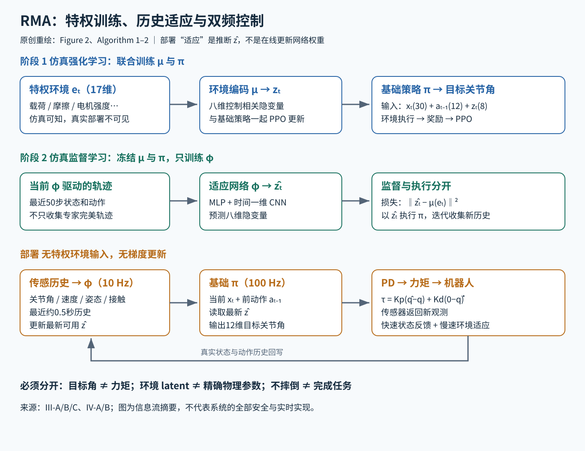

# RMA：从最近半秒的运动历史估计"环境对步态的影响"，让四足机器人边走边适应

> 状态：技术精读 · 原文 arXiv:2107.04034v1 · 未复现

## 一句话

Kumar、Fu、Pathak、Malik（2021）先在仿真里训练一个"知道环境参数"的走路策略，并把环境参数压成 8 维隐变量；再训练一个小网络，从最近 50 步的关节状态和动作中估计这个隐变量。部署时用估计值代替拿不到的真实参数，四足机器人只靠本体感知就能在几分之一秒内适应新地面和新负载。

## 它要解决的问题

在仿真里用强化学习训练腿足策略再搬到真机上（sim-to-real，一句话：仿真中训练、真机上直接部署），难点在于真机的地面摩擦、负载、电机强度都和仿真不同，而且会在行走中变化。当时主要有三种做法：

- **域随机化**（domain randomization，一句话：训练时随机改变仿真物理参数，让一个策略在所有参数下都能凑合）：得到的策略鲁棒但保守，它不知道"此刻"是哪种环境，只能对所有环境取折中。
- **系统辨识**（system identification，一句话：从观测中估计质量、摩擦等物理参数，再据此控制）：作者认为精确预测全部系统参数往往既困难又不必要，实践中效果差。
- **真机上继续训练**：每换一种地面都要收集数据、更新参数，慢且有损坏硬件的风险。

另一条相关路线是 [Lee 等 2020](../arxiv-2010.11251/README.md) 的 ANYmal 策略，RMA 原文认为它是真实世界鲁棒性上最可比的工作，但它依赖手工编码的领域知识：预定义的轨迹生成器和电机模型。

RMA 要回答：能否不靠手工先验、不在真机上更新参数，只用机器人自己的关节和 IMU 读数，在行走中实时适应？

## 核心想法

把"环境是什么"换成"环境要求步态怎样变"。

1. **第一阶段**：仿真里能读到真实环境参数 eₜ（特权信息，一句话：训练时可得、部署时拿不到的信息）。编码器 μ 把 eₜ 压成 8 维隐变量 zₜ，作者称之为 extrinsics（外在因素）。基础策略 π 同时看机器人状态和 zₜ 输出动作。μ 和 π 一起用 PPO 端到端训练，所以 zₜ 只保留"对控制有用"的环境信息。
2. **第二阶段**：冻结 μ 和 π，训练适应模块 φ，从最近 50 步的状态和动作历史回归 zₜ。历史里藏着环境信息：同样的关节命令，在软垫上和在水泥地上产生的实际运动不同。
3. **部署**：φ 的估计值 ẑₜ 代替 zₜ，送进基础策略。适应全部发生在前向计算中，没有梯度更新。

与系统辨识的区别在第 1 点：φ 回归的是 8 维的 zₜ，而不是 17 维的物理参数 eₜ。不同物理原因（例如负载变重与电机变弱）可能要求同样的步态调整，zₜ 不必区分它们。

## 机制

训练时真实环境编码提供监督；部署时移除这条通道，历史估计与关节控制异步运行。

### 1 输入与输出接口

- **机器人状态** xₜ ∈ R³⁰：12 个关节角、12 个关节角速度、机身横滚角和俯仰角、4 个足端接触信号（0/1），来自电机编码器、IMU 和足端传感器。没有相机，也没有地形图。
- **基础策略输入**：xₜ、上一步的 12 维动作 aₜ₋₁、8 维 zₜ，共 50 维。
- **输出** aₜ ∈ R¹²：12 个关节的**目标角度**，由 PD 控制器（一句话：按"角度误差 × 比例增益 + 速度误差 × 微分增益"计算力矩）转成电机力矩。
- **特权向量** eₜ ∈ R¹⁷：负载质量与位置、12 个电机强度、摩擦系数、局部地形高度（四只脚下方高度离散化后取最大值）。[III-A；IV-A]

PD 一步的示例数值：真机实验 Kₚ = 55、K_d = 0.8，目标速度设为 0。若某关节目标角 0.30 rad、实际 0.25 rad、实际角速度 1.0 rad/s，则

τ = 55 × (0.30 − 0.25) + 0.8 × (0 − 1.0) = 2.75 − 0.8 = 1.95

策略每 10 ms 给出新的目标角，PD 把它变成力矩；所以策略学的是"把关节往哪里拉"，不是直接学力矩。

### 2 第一阶段：奖励与课程

目标是最大化折扣回报 E[Σ γᵗ rₜ]，用 PPO（一句话：限制每次更新幅度的策略梯度算法，见 [PPO 精读](../../../llm/papers/ppo/reading.md)）。奖励由"前进"和一组运动代价组成：前进速度 min(vₓ, 0.35) 为正项，另有侧向速度、偏航、做功、地面冲击、力矩变化、动作幅度、关节速度、姿态、竖直运动和滑足等惩罚项。作者称这些代价受生物能量学启发，作用是不用参考动作示范，也能学出自然步态。[III-A]

一开始就让所有惩罚生效，策略会学成"站着不动"或早早摔倒。所以训练用课程：第 3 至第 10 项惩罚的倍率从 k₀ = 0.03 开始，每轮迭代按 kₙ₊₁ = kₙ^0.997 增长并趋近 1。[补充材料 p.12]

示例数值：由递推可得 kₙ = 0.03^(0.997ⁿ)。

- n = 100：0.997¹⁰⁰ ≈ 0.741，kₙ ≈ 0.03^0.741 ≈ 0.074；
- n = 500：0.997⁵⁰⁰ ≈ 0.223，kₙ ≈ 0.46；
- n = 1000：0.997¹⁰⁰⁰ ≈ 0.050，kₙ ≈ 0.84；
- n = 2000：kₙ ≈ 0.99。

第一阶段共 15,000 次迭代，惩罚在前约 2,000 次迭代内就基本加满；之后的大部分训练都在完整代价下进行。环境随机扰动的幅度也随训练逐渐增大。

### 3 第二阶段：在自己会遇到的状态上学估计

φ 预测 ẑₜ = φ(xₜ₋₅₀:ₜ₋₁, aₜ₋₅₀:ₜ₋₁)，损失是 ‖ẑₜ − μ(eₜ)‖²。结构是：两层 MLP 把每步状态和动作嵌入成 32 维，三层一维卷积沿时间处理，最后线性投影到 8 维。[III-B；IV-B]

关键在数据怎样收集。如果只让"用真实 zₜ 的专家"走路，再拿这些完美轨迹训练 φ，φ 永远见不到"自己估错后机器人走偏"的状态。RMA 的做法是：用当前的 φ（一开始是随机初始化的）预测 ẑₜ 去驱动冻结的基础策略，同时用仿真里的 μ(eₜ) 作标签，反复采样、回归。作者说明这与 Ross 等 2011 的 DAgger（一句话：让学习者自己执行，由专家给它到达的每个状态打标签）类似。

第二阶段用 1,000 次迭代、约 8,000 万步，单 GPU 约 3 小时；第一阶段约 12 亿步，约 24 小时。[IV-B]

### 4 双频部署

基础策略以 100 Hz 输出关节目标角；φ 约以 10 Hz 更新 ẑₜ，基础策略总是取最新的估计值，两者异步运行。示例数值：100 Hz 下 50 步历史覆盖 0.5 s；φ 每 0.1 s 更新一次，期间基础策略的 10 个控制步共用同一个 ẑₜ。

这样拆分的依据是时间尺度：关节状态每 10 ms 都在变，地面和负载通常慢得多。长历史网络不必挤进每个 10 ms 控制周期，机载算力也负担得起。[III-C；算法 2]

## 证据：哪个实验支撑哪个主张

仿真测试的参数范围比训练更宽（例如摩擦训练 0.05–4.5、测试 0.04–6.0；负载训练 0–6 kg、测试 0–7 kg），且回合内重新采样参数的概率更高。每种方法 3 个随机种子 × 1,000 个测试回合。[Table I、II]

| 主张 | 支撑实验 | 怎么读 |
|---|---|---|
| 历史估计几乎追平"知道真参数"的上限 | 仿真成功率：RMA 73.5%，特权 Expert 76.2%（Table II） | 两者的行走时长和距离也几乎相同（0.85/0.86、1.34/1.35 m） |
| 估计"步态该怎么变"优于估计"物理参数" | 直接回归物理参数的 SysID 56.5%（Table II） | 比 RMA 低 17 个百分点 |
| 适应本身有用 | 只做域随机化的 Robust 62.4%；去掉适应模块 52.1%（Table II） | RMA 比 Robust 高 11.1 个百分点，比去掉适应模块高 21.4 个百分点 |
| 无需额外探索数据 | 离线调整隐变量的 AWR 41.7%，且需额外 40k 测试探索样本，RMA 为 0（Table II） | "0"指不另收集探索数据，行走中的实时观测照常使用 |
| 真机上适应模块是关键 | Unitree A1（约 12 kg）：床垫上 RMA 100%、厂商控制器 100%、去掉适应 0%；8 cm 上台阶 60% / 20% / 0%（Figure 3） | 通常每项 5 次；不同任务拉开的差距不同 |
| 在仿真没见过的地面也能走 | 油面 90%；户外楼梯 70%；水泥与石子堆 80%（Fig.1、4） | 作者具体试验中的结果 |

油面和突加 5 kg 负载的实验中，作者画出了 ẑₜ 和关节力矩随扰动变化的曲线，用来说明适应发生在几分之一秒内。

## 局限与后续

- **看不见前方**。作者在结论中自述：盲走的机器人在下楼时突然跌落、多条腿同时被石块阻挡等大扰动下会失败，真正可靠的行走需要机载视觉。这是反应式适应的固有局限：机器人要先踩到变化，历史里才有信号。同组作者的后续工作 [Agarwal 等 2022](../url-https-proceedings.mlr.press-v205-agarwal23a-agarwal23a/README.md) 加入单个前向深度相机，能走楼梯、路沿、踏石和间隙，训练同样分两阶段：先用易计算的深度变体做强化学习，再用监督学习蒸馏到使用真实深度的策略。
- **依赖训练分布与慢变假设**。8 维 zₜ 只编码训练中随机化过的那些因素；变化快于 φ 更新周期的扰动，只能靠基础策略本身的鲁棒性。
- **工程细节依赖实现**。时间步长、缓冲区对齐和传感器预处理在原文中有不一致之处（见批注），复现应以参考实现为准。

## 批注

**易误读**

- "在线适应"指前向估计 ẑₜ，部署时 φ 和 π 的权重都不变（III-B）。
- 真实实验通常每项 5 次，出现严重失败时 2 次后即停止并记为失败，所以各格样本数不完全相同（V-A）。
- Table II 的奖励列是前进加侧向的平均每步奖励，Torque 是力矩平方范数，Smoothness 是相邻力矩差的平方范数，TTF 按最大时长归一化，真机距离按任务目标距离归一化（补充材料 S1）。读表时不能把这些数当成牛米或米。
- 真实实验只与厂商控制器和去掉适应模块的版本比较，没有在真机上跑仿真中较差的基线，原因是避免损坏硬件（V-A）。

**与其他论文的关联**

- `[结构]` 第一阶段的优化器就是 [PPO](../../../llm/papers/ppo/reading.md)：μ 和 π 作为一个整体策略被 PPO 更新，补充材料给出 GAE λ = 0.95、γ = 0.998、裁剪比率 0.8–1.2。
- `[结构]` 第二阶段的数据收集与 [R2R](../r2r/reading.md) 的 student-forcing 是同一个思路：让学习者用自己的预测去执行，到达自己会犯错的状态，再由一个"从真实状态能算出正确答案"的教师打标签（RMA 的教师是 μ(eₜ)，R2R 的教师是最短路）。两篇都把这一做法联系到 DAgger。
- `[历史]` [Agarwal 等 2022](../url-https-proceedings.mlr.press-v205-agarwal23a-agarwal23a/README.md) 的作者包括 RMA 的 Kumar、Malik、Pathak，沿用"先强化学习、再监督蒸馏"的两阶段结构，并补上了 RMA 自述缺少的视觉。
- `[结构]` 从历史观测推断不可见量，是 [ESKF](../eskf/README.md) 这类状态估计器的任务；区别在于 ESKF 用显式的运动模型和噪声模型做概率推断，RMA 的 φ 是学出来的回归器，估计的量也只对控制有意义。另一条路线 [凸 MPC](../convex-mpc/README.md) 用显式刚体模型在线求解优化，与 RMA 的"学一个反应式策略"形成对照。

**未核实 / 待验证**

- Figure 3 图内"Uneven Foam"为 80%、"Step Down-15"为 100%，图注却写不平泡沫 100%、15 cm 下台阶 80%；已查看 PDF，原文自相矛盾，未能澄清，正文未引用这两项。
- 原文同时写策略频率 100 Hz 与仿真时间步 0.025 s，未说明二者关系（IV-A）；Table I 质心位置一行单位标为 cm、范围却是 ±0.15 / ±0.18。均未擅自换算。
- 补充材料多个小节重复编号 S1。课程递推 kₙ₊₁ = kₙ^0.997 的下标在本文按训练迭代次数理解，正文"约 2,000 次迭代内基本加满"依赖这一理解。
- 数值出处与页码定位见 [证据档案](evidence.json)。
