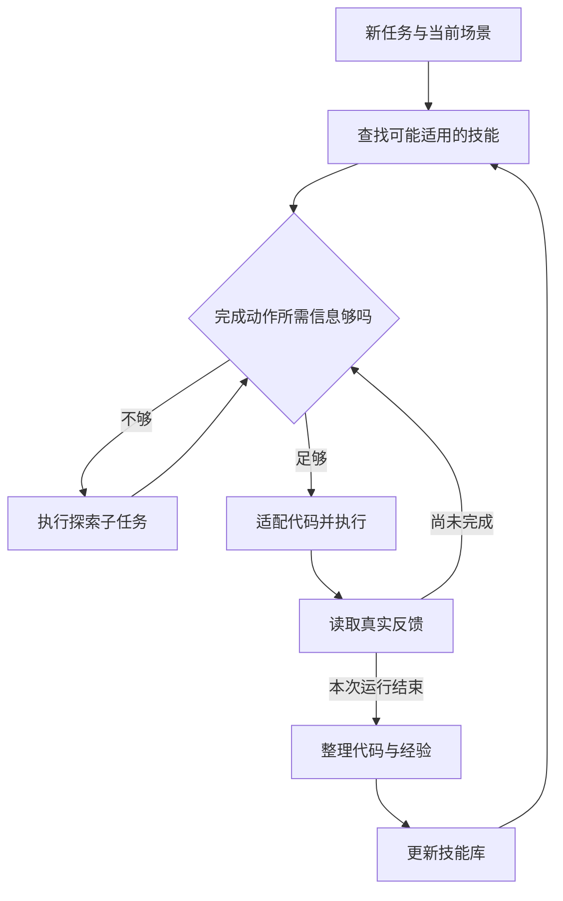

# RoboSkill 为什么机器人需要保存真正执行过的技能

> 状态：机制教学 · 原文 arXiv:2609.37810v1 · 未复现

机器人第一次成功打开抽屉，并不意味着第二次就会便宜、迅速地完成。它可能重新寻找把手，重新估计位置，重新写控制程序，又碰到相似的错误。RoboSkill关心的正是这种重复成本：一次任务结束以后，系统应该留下什么，才能帮助下一次执行？[1]

## 从一个抽屉开始理解技能

先看一个本文自拟的教学场景。机械臂要把积木放进抽屉。它看见把手，规划了抓取位置，但夹爪闭合以后没有抓牢。如果每次失败后只说一句“下次更准确”，这份经验几乎没有操作价值。

更有用的记录应该能回答三个问题：当时依据什么确定位置？执行了什么程序？用什么观察发现没有抓牢？这些问题把“经验”从一句感想变成可检查的材料。

在这个例子里，机器人也可能发现自己不知道抽屉是否已经完全打开。于是，它暂时不再追求“放入积木”，而先解决“确认开口是否足够大”。这就是探索子问题：眼前的动作未必直接完成目标，却能减少下一步的不确定性。拍一张更合适角度的照片，和盲目再拉一下，信息价值与风险显然不同。

RoboSkill以探索、执行、经验整理组成循环：Agent调用SDK（供程序调用机器人能力的软件接口工具包）写程序，结合视觉与触觉反馈调整操作；任务结束后，把文本说明、执行过的代码与记录整理成技能，供之后选择和适配。[2]

这是自行绘制的教学图。它强调两种不同的循环：一次执行内部要不停看反馈；不同执行之间还要保存经验。前者让机器人及时纠错，后者让机器人不必每次都从头想。

## 为什么一段代码比一句诀窍多保存了东西

假设经验只有“慢慢靠近把手，抓稳后拉”。下一次Agent仍要决定速度多慢、采用哪个坐标系、何时检查接触、检查失败后退出还是重试。这些细节如果已经写成程序并真正执行过，保留代码能减少重新翻译的工作。

但代码也有危险。把“向前移动5厘米”原样复制到另一张桌子上，并不比一句模糊建议可靠。可以复用的是处理流程，现场位置、物体尺寸和接触条件还需要重新绑定。技能因此更像“带适用说明和证据的程序模板”。

官方仓库的经验获取流程要求保存执行账本、关键帧、场景绑定、总结，以及与实际运行内容一致的代码副本。这使一个很重要的区别变得可追踪：系统事后说自己做过什么，和它实际执行过什么，应该能够核对。[3]

对初学者而言，可以把三种存储形式分开：轨迹记录保留一次经历；文字说明概括可能复用的规律；程序保留可执行步骤。它们不互相替代。只有程序，可能不知道何时不该用；只有总结，可能丢失足够多的细节，让下一次又重新犯错。

## 触觉究竟补上什么

继续看抽屉例子。从图像上看，夹爪已经贴近把手，不代表真的建立了稳定接触。视线被挡住时，这种区别尤其难判断。压力或力反馈可以增加一条证据来源。

压力升高可能意味着抓紧，也可能意味着撞到了不该碰的表面。因此一个好的教学系统应要求学生写清楚：哪个观测支持哪个判断，还有什么替代解释？在没有机器人硬件时，仅用几张示意图和虚构传感器读数就可以练这个思考过程。

这一点也说明，具身Agent的工具调用和普通软件调用不同。程序接口返回成功，可能只说明命令发送成功。物理结果还要靠感知验证。

## 怎样读实验才不会被平均数误导

论文主仿真实验是LIBERO-10、每条件40个任务与种子组合，构建技能用的种子排除在外。Astra和下文的Opus是实验比较的语言模型名称。Astra首回合成功率由72.5%升至97.5%；真机硬任务由80.0%升至88.3%，成功试验平均时间由27.0降至23.1分钟。真机时间只统计成功试验。跨任务迁移并非全面获益：Opus使用异任务技能后，首回合成功率60%降至56%，时间则缩短。[2]

这几个数字足以解释四个读表习惯。

第一，“最终成功”与“第一次就成功”不同。允许失败后重置，系统可能最终完成，却耗掉更多交互。现实中的机器人不一定可以把打翻的水、磨损的零件或弄乱的桌面一键重置。

第二，要看时间的分母。假设甲方法只成功两次，而且这两次非常容易；乙方法成功十次，其中包含困难案例。仅比较成功案例平均时间，可能让甲看上去更快。

第三，仿真表中的平均时间包含失败终止。一个方法很早放弃，也会缩短均值。因此要把时间与成功率放在一起读。

第四，“多给一个技能”不一定有益。额外经验可能提供帮助，也可能给错提示、增加选择成本（技能数量和来源一起改变时，实验不能把变化全部归因于跨任务知识）。[2]

## 这对搭建Agent有什么启发

可以用一个不控制真实机器的练习来理解它。给一个模拟Agent三份记录：一次成功抓取、一次因位置估计过时而失败、一次因目标太软而夹坏。要求它为新任务选一份可复用程序，并解释另外两份中的哪些条件值得警惕。

练习的评分不要只看最后有没有选中“成功案例”。还应看它有没有重新获取当前状态、有没有区分可复用步骤与场景常量、有没有设置观察点（这些是本文据方法提出的学习练习）。

RoboSkill最值得记住的是：执行经历可以成为下一次执行的输入，而且这种输入最好保留可检查的过程。对于具身Agent，积累经验的价值最终要由新的物理执行来检验。

## 局限与后续

**论文自己写到的边界。** 论文没有单独的局限一节，但在分析部分写明两点：继续成功的探索能提高技能效果，但连续几次更新之间的收益并不单调；技能选择实验中技能数量和成员一起变化，不能单独分离跨任务内容的作用。[2] 跨任务迁移对 Opus 的首回合成功率是负的（60%降到56%）。

**经验整理本身会出错。** Agent可能把偶然成功写成通用规律，把关键失败条件删掉，或者保留过时坐标。真正使用技能库时，应把版本、证据和回退路径纳入设计。[判断] 这正是同月稍早的 [EmbodiedSkills](../embodiedskills/reading.md) 所做的事：给每个技能写明类型、前提和失败定义，执行前检查依赖的新鲜度。RoboSkill 的技能包保存了证据，却没有这样的运行时检查；两者合起来才覆盖“积累”与“把关”。

**从前作看它推进到哪里。** 论文把 [Voyager](../../../llm/papers/arxiv-2305.16291/README.md)（把交互历史提炼成可复用技能）、Code as Policies（生成可执行的机器人程序）、CaP-X 和 ASPIRE 列为前作。[2] [判断] 相对 Voyager 在 Minecraft 中的代码技能库，本文的新增在物理世界：视觉与触觉反馈进入执行循环，技能包里保存的是真机上实际执行过的代码。技能库长期增长后会不会退化，仍是开放问题。

## 参考资料

[1] arXiv身份与版本记录，Explore, Execute, Evolve: A Skill Acquisition and Reuse Loop for Embodied Agents：https://arxiv.org/abs/2609.37810

[2] RoboSkill v1全文，重点为§3–4、§6–8及表1–4：https://arxiv.org/html/2609.37810v1

[3] 官方代码仓库README，执行边界、经验获取与发布范围：https://github.com/SII-dannyXSC/RoboSkill

[4] 官方实验入口文档，same-task、Top-K、迁移、技能迭代与消融入口：https://github.com/SII-dannyXSC/RoboSkill/blob/main/agent_runner/README.md

## 批注

**易误读**

- RoboSkill 与同样带有 Skill 字样的其他论文（例如 EmbodiedSkills）是独立工作，不能仅凭名称当成某个系列的续作。
- 技能不是保证成功的录像回放（§代码）。“触觉出现数值”与“正确理解接触”仍是两回事；“调用完成”不能直接当成“任务完成”（§触觉）。
- 真机用时只统计成功试验，真机的用时结论不能外推成所有试验的总成本下降。
- 论文报告的是具体条件下的取舍，不是“经验越多越好”的普遍定律；论文的循环给出了一个有用框架，它不等于已经证明技能库长期增长不会退化。
- 官方仓库说明其当前 Harness 可在 CLI 进程退出后恢复同一运行；复现时应核对“进程退出”和“评测终止”的具体定义，不把实现术语直接当成论文指标。[3][4]

**与其他论文的关联**

- `[历史]` 论文把 [Voyager](../../../llm/papers/arxiv-2305.16291/README.md) 和 Code as Policies 列为前作：Voyager 的技能库在游戏环境中由代码组成，本文把同一思路搬到带触觉反馈的真机。
- [EmbodiedSkills](../embodiedskills/reading.md) 用带类型与前提的契约约束技能调用，本文用执行记录积累技能；前者偏“把关”，后者偏“积累”。
- [SayCan](../saycan/reading.md) 自述系统瓶颈在底层技能的范围与能力；本文让技能库随任务增长，是对这一瓶颈的一种回应。[MEMORA](../memora/reading.md) 保存“发生过什么”，本文保存“怎样做”，见 [具身 Agents 讲义](../../fields/embodied-agents.md)。
- LIBERO 基准也用于 [OpenVLA](../openvla/reading.md) 系 VLA 的评测，但本文的成功率来自写代码调用 SDK 的 Agent，两类数字不可直接比较。

**未核实 / 待验证**

- 本页阅读了方法§3、实验§4、硬件与实验协议§5–6、分任务结果§7、技能选择分析§8，并核对官方仓库 README 及实验入口说明。没有运行代码、复现实验，也没有测试真实机器人。截至核验，版本记录只有 v1。
- 官方发布是源代码，不包含生成的技能包、运行日志或历史结果；数值复现还依赖论文使用的模型版本及相当的计算资源。
