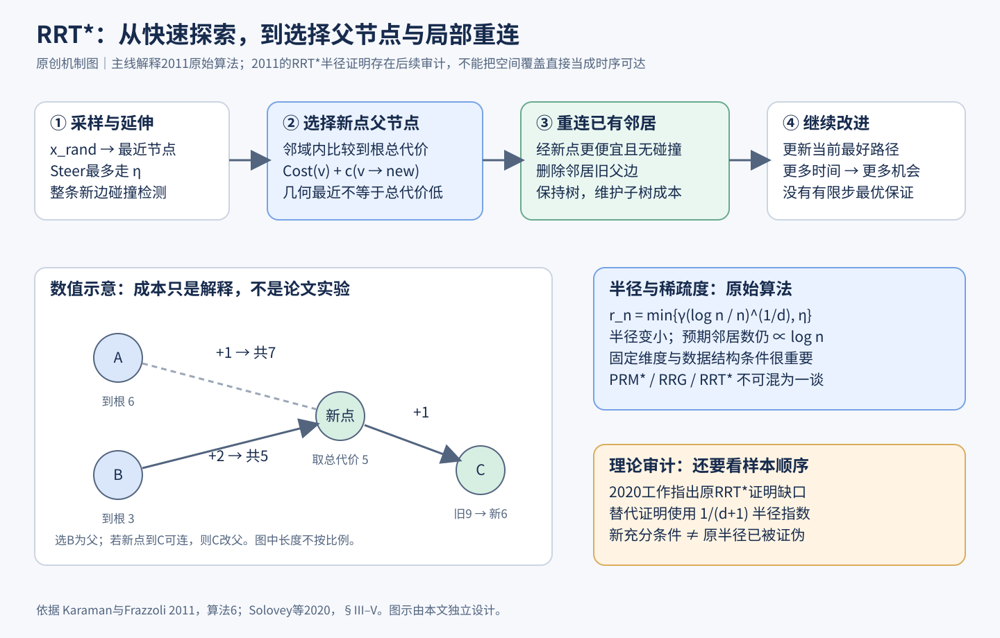

# RRT*：邻域按 (log n / n)^(1/d) 收缩，每加一个点都重选父节点并重连，采样树的路径代价就会随采样继续下降

> 状态：技术精读 · v2 · 未复现 · 原文 [arXiv:1105.1186v1](https://arxiv.org/abs/1105.1186) · [证据档案](../../../docs/deep-readings/evidence/rrt-star.json)



## 一句话

Karaman 与 Frazzoli 先证明当时常用的 PRM 和 RRT 在采样数趋于无穷时，返回路径的代价不会收敛到最优；再给出三种修改，PRM*、RRG 和 RRT*，让每个新点连接一个半径按 γ(log n / n)^(1/d) 收缩的邻域，从而在每步只多付常数倍计算的前提下获得渐近最优性。RRT* 是其中保持单棵树的版本：每加一个点，先为它选代价最低的父节点，再看邻居能否改走它而变得更便宜。

## 它要解决的问题

[导航与规划讲义](../../fields/navigation-planning.md)第四节已经讲过 RRT 的一次迭代、整段碰撞检查、重连的数值例子，以及渐近最优的直观含义。本篇是这些内容的原始出处，它要回答的问题是：**多给时间，路径会不会越来越好？**

当时的两类主流采样规划器：

- **PRM**（概率路网，一句话：先在自由空间撒点、把彼此可无碰撞连接的近邻连成一张图，适合在同一环境中反复查询）。
- **RRT**（快速探索随机树，一句话：从起点长出一棵树，每次朝随机样本延伸一小步，适合单次查询）。

两者都是**概率完备**的（一句话：只要存在一条与障碍保持正间隙的可行路径，随着采样数增长，找不到路径的概率趋于零）。但实际应用常希望规划器是"随时可用"的：先快速给出一条路，剩余时间继续把它改好。这需要另一个性质，**渐近最优**（一句话：采样数趋于无穷时，返回路径的代价以概率 1 收敛到最优代价）。论文证明 PRM、固定近邻数 k 的 PRM 以及 RRT 都不具备这个性质，一些启发式 PRM 变体甚至不一定完备。[§1、§4，定理 33]

## 核心想法

增量有三层：

1. **理论框架**：把"鲁棒可行""鲁棒最优"和渐近最优写成精确定义，并证明上述算法的负面结论。
2. **连接规则**：每个新点要连接的邻域不能固定，也不能太大。半径取 r_n = min{γ(log n / n)^(1/d), η}，n 是当前顶点数，d 是空间维数，η 是单步最大延伸距离；或者近邻数取 k₀ log n。在这个尺度下，邻域内的预期点数只按 log n 增长，所以每步的碰撞检查次数只比原算法多一个对数因子，同时足以保证渐近最优。
3. **三个算法**：PRM* 是用上述半径的多查询路网；RRG 是在线增长、允许成环的图；RRT* 是 RRG 的树版本，用"选父节点 + 重连"代替保留所有边，存储只需 O(n)。

## 机制

### 问题设定

配置空间 X = (0, 1)^d，d ≥ 2；X_free 是无碰撞构型，x_init 是起点，X_goal 是目标区域。路径是一条连续、总变差（一句话：曲线的"总长度"在一般函数空间中的推广）有限的曲线；代价 c(σ) 可以是长度，也可以是在代价场上的线积分，要求非负、对路径拼接可加且单调。分析对象是几何路径：没有速度、力矩、摩擦或非完整约束，算法通过 CollisionFree 查询一段路径是否合法，地图从哪里来不在问题之内。[§2.1]

### 一次迭代：RRT* 比 RRT 多做两件事

前半段与 RRT 相同：从 X_free 独立均匀采样 x_rand；找树中最近的 x_nearest；Steer 朝样本前进至多 η，得到 x_new；整条线段无碰撞才插入。之后：

1. **选父节点**：取 x_new 半径 r_n 内的邻居集合，在能无碰撞连到 x_new 的邻居 v 中，选 Cost(v) + c(v → x_new) 最小者为父节点。Cost(v) 是从根沿树走到 v 的累计代价，相当于讲义中 A* 的 g(n)。
2. **重连**：对每个邻居 w，若 Cost(x_new) + c(x_new → w) < Cost(w) 且新边无碰撞，就删掉 w 原来的父边，改以 x_new 为父。

第一步优化新节点自己，第二步让新节点反过来改善已有的树。树始终只有一个根，每个非根节点只有一个父节点。[§3.3，算法 6]

**示例数值（只用于理解逻辑，没有实验含义）**：邻居 A 到根的代价 6，A 到新点的边长 1；邻居 B 到根的代价 3，B 到新点的边长 2。A 更近，但经 B 的总代价 3 + 2 = 5 小于经 A 的 6 + 1 = 7，所以选 B 为父，新点代价为 5。另一个邻居 C 原代价 9，经新点再走 1 只需 5 + 1 = 6，于是把 C 重连到新点。实现时还要把 C 子树里每个节点的累计代价都减去 3，否则缓存的 Cost 会过期。

### 半径为什么这样收缩

半径的作用是在"连得够多"和"算得够快"之间找平衡。连接半径固定，边数和碰撞检查会越来越多；长期只连固定几个最近邻，又无法保证路径质量收敛——论文图 10 中固定 k 的 PRM 就没有收敛到最优。γ(log n / n)^(1/d) 让半径缩小，但单位体积中的点同时变多，两者相乘，球内预期点数约为 n × 球体积 ∝ γ^d log n，只按对数增长。[§3.3、§4.3]

**手算（示例数值）**：取单位正方形无障碍，d = 2，μ(X_free) = 1，单位圆面积 ζ₂ = π。定理 38 要求 γ > (2(1 + 1/d))^(1/d) × (μ(X_free)/ζ_d)^(1/d) = √3 × √(1/π) ≈ 0.977，取 γ = 1（对数取自然对数，并假设 η 足够大）：

```text
n = 100：    r = √(ln 100 / 100)   = √0.0461  ≈ 0.215，  预期邻居数 ≈ π × ln 100   ≈ 14.5
n = 10000：  r = √(ln 10000 / 10000) = √0.00092 ≈ 0.030，预期邻居数 ≈ π × ln 10000 ≈ 28.9
```

点数增加 100 倍，半径缩小约 7 倍，每个新点要检查的邻居只多了一倍。这就是"每步额外开销只多一个对数因子"的来源。

近邻数版本取 k = k₀ log n。三类算法的常数条件不同：PRM* 和 RRG 要求 k₀ > e(1 + 1/d)，RRT* 要求 k₀ > 2^(d+1) e(1 + 1/d)。[定理 35、37、39]

### 渐近最优的证明骨架

概率完备只需要存在一条与障碍有正间隙的路径。最优路径却常常贴着障碍边界走，所以论文引入**弱 δ-间隙**（一句话：最优路径可以在自由空间里连续变形为一串有正间隙的路径并逼近它），再加上代价在最优路径附近连续，合称**鲁棒最优**。[定义 14、24]

以附录 C 中 PRM* 的证明为例，路线是：

1. 用一条有正间隙的路径 σₙ 逼近最优路径。
2. 沿 σₙ 铺一串小球，使相邻球中各取一点时距离不超过连接半径，且连线留在自由空间。
3. 估计某个球里一个样本也没有的概率，再用并集界（一句话：若干事件至少发生一个的概率不超过各自概率之和）控制"这串球里有空球"的概率。
4. 选择 γ 使这些失败概率对 n 求和有限，由 Borel–Cantelli 引理（一句话：一列事件的概率之和有限时，以概率 1 只有有限个事件发生）得到：n 足够大以后，每个球里都有点。
5. 图中于是存在一条穿过这串球的路径，它在总变差意义下逼近 σₙ；由代价连续性，路径逼近变成代价逼近。

附录 D 处理近邻数版本，附录 E–G 处理在线增长的 RRG 和 RRT*。RRT* 比 PRM* 多出的难点在于：树是有向的，点按时间顺序加入，只有"先到的点"才能当"后到的点"的父节点。

### 后续理论审计

Solovey 等在 [Revisiting the Asymptotic Optimality of RRT*](https://arxiv.org/abs/1909.09688)（2020）中指出原附录 G 证明的两处缺口：每对相邻小球各自存在先后顺序合适的样本，推不出整条球链上存在一个一致的先后顺序；Steer 会改变已插入节点的分布，使它们不再是简单的独立均匀样本。他们给出另一个证明，所用半径更大：γ′(log n / n)^(1/(d+1))，定理 1 的结论是对任意 ε > 0，返回代价不超过 (1 + ε)c* 的概率趋于 1；这个新界是否紧、原来的 1/d 指数能否保留，该文留作开放问题。[后续论文 §III–V]

## 证据：哪个实验支撑哪个主张

实验在 2.66 GHz 处理器、4 GB 内存的 Linux 机器上用 C 实现。RRT 与 RRT* 对比时使用相同的采样序列，因此同一迭代次数下两棵树的节点相同，差别只在连接方式。[§5]

| 主张 | 支撑实验 | 怎么读 |
|---|---|---|
| 固定 k 的 PRM 不收敛，PRM* 收敛 | 二维对比曲线，PRM* 另测到五维（图 10–11） | 示意性曲线 |
| RRT 停在次优，RRT* 收敛到最优 | 二维无障碍：各 20,000 次迭代、重复 500 次取平均（图 12–13） | RRT* 各次运行的方差趋于零，几乎每次都收敛 |
| RRT* 能跳到更优的同伦类 | 二维有障碍：同样 500 次 × 20,000 次；RRT 平均约为最优代价的 1.5 倍，先探索到较差同伦类（一句话：不能连续变形为彼此的两类路径，如从障碍左边绕和右边绕）时约 2 倍（图 14–16） | 1.5 倍只属于这一场景 |
| 适用于非长度代价 | 代价场在高代价区为 2、低代价区为 1/2、其余为 1（图 17） | 树绕开高代价区或快速穿过，与光的折射定律一致 |
| 每步开销只比 RRT 多常数倍 | 无障碍环境运行到 100 万次迭代，50 次平均，RRT* 与 RRT 的运行时间比收敛到常数（图 18–19） | 对应 §4.3 的复杂度分析：固定维数下每步预期 O(log n) 次碰撞检查 |
| 高维也成立 | 5 维 100 次、10 维 25 次（图 20–22） | 每条曲线的样本数和环境不同 |

## 局限与后续

- **只有几何路径**：直线连接和欧氏距离只适用于能沿任意方向移动的系统。汽车、四足等有动力学约束的系统需要满足运动模型的局部连接和距离度量，并重新检查理论条件，见[导航与规划讲义](../../fields/navigation-planning.md)第五节；路径变成可执行运动还需要跟踪控制层，例如 [Convex MPC](../convex-mpc/reading.md) 这类控制器。
- **假设 X_free 已知且静态**：动态障碍、地图误差和定位误差都在问题之外，需要上游的建图定位（如 [ORB-SLAM3](../orb-slam3/reading.md)）和下游的局部重规划。
- **证明缺口**：原论文的 RRT* 半径对应的证明有已知缺口，Solovey 等给出更大半径下的替代证明。
- **有限时间表现**：渐近结论不说明多少样本够用；狭窄通道、高维空间和昂贵的碰撞检查都会让有限时间的表现变差。

## 批注

**易误读**

- 结论段口头说半径按 log n / n 缩放，正式算法中的 1/d 次方不能漏（§3.3 与 §6 对照）。
- 三类算法的 γ 和 k₀ 下界各不相同，不能把 PRM* 的阈值搬到 RRT* 上（定理 34–39）。
- Cost(v) 是根到 v 的累计代价，不是到目标的启发式估计；重连后要更新整棵子树的缓存（算法 6）。
- 局部重连不保证任何有限时刻得到的就是全部采样点上的最短路径树（§3.3）。
- 有限次实验的曲线只能与渐近趋势相符，不能证明无限采样的结论（§5）。
- 复杂度结论在固定维数、固定环境和指定的近邻查询模型下成立；高维近邻查询、复杂网格碰撞检测和子树代价维护可能主导实际耗时（§4.3）。
- Solovey 等的结论是"原证明有缺口，另有一个更大半径的充分条件"，既不说明原半径失效，也不说明 RRT* 不渐近最优（后续论文 §V）。

**与其他论文的关联**

- [导航与规划讲义](../../fields/navigation-planning.md)第三、四节：A* 的 g(n) 与本篇的 Cost(v) 是同一个量，讲义图 3 的重连算例（7.0 → 6.3）就是本篇算法 6 的重连步骤。
- [ORB-SLAM3](../orb-slam3/reading.md) 和 [ESKF 教程](../eskf/reading.md) 回答"我在哪、估计多可靠"，本篇回答"在已知自由空间里走哪条几何路径"，[Convex MPC](../convex-mpc/reading.md) 回答"接下来半秒每只脚用多大的力"。三者的接口分别是：带不确定性的位姿与地图 → 几何路径 → 速度和偏航参考。
- [R2R](../r2r/reading.md) 把移动抽象成在预先建好的视点图上跳转，几何规划和避障都不在任务里；把语言导航策略接到真实机器人上，本篇这一层要重新补回来。

**未核实 / 待验证**

- 用网络学习采样分布、距离度量或代价时，需要保证必要通道的采样概率不为零、并保留整段碰撞检验，否则经典保证的前提可能失效。这是基于 §2–3 设定的阅读建议，论文没有学习实验。
- 二维无障碍场景中 RRT 极限代价相对最优代价的倍数，原文提取文本中的根号符号丢失，未写入正文。
- Solovey 等只核对了 §III–V、定理 1 和反例附录，不代表穷尽 2020 年后的全部理论进展。
