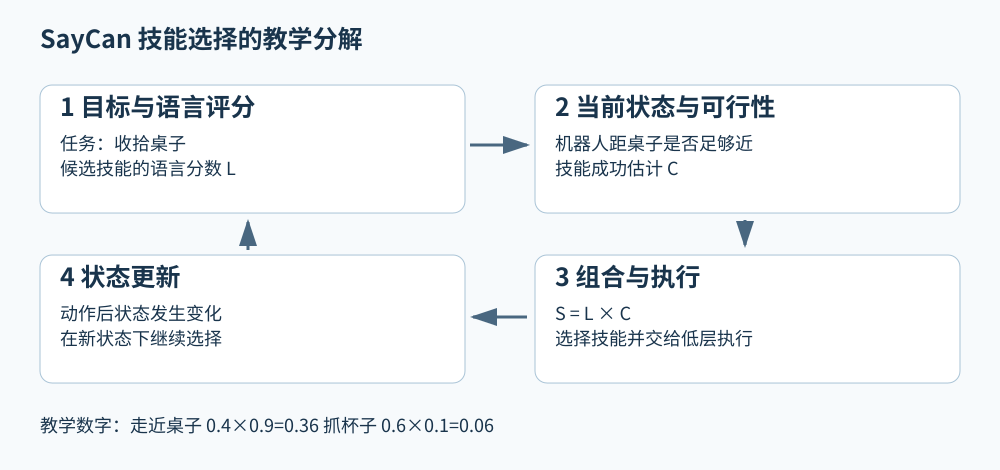

# SayCan 从语言建议到机器人能够执行的技能

如果对机器人说“帮我把桌子收拾好”，语言模型可以给出一串听起来合理的步骤。但房间里有没有垃圾桶？夹爪能不能拿起那只盘子？机器人是不是站得太远？这些问题无法仅靠句子的流畅程度回答。SayCan适合作为具身Agents的入门baseline，因为它把“这一步有没有用”和“这一步现在做不做得到”放到同一个选择过程中。[1][2]

本文是机制教学与关键章节核读，核对了v2方法部分、官方项目说明和版本记录；没有完整审计所有附录，也没有运行实验。例子中的数值全部是教学设定。你可以先理解技能选择，再读更复杂的记忆、规划与执行框架。

## 1 先定义机器人已经会什么

设想一个教学机器人只有三种技能：走近桌子、抓起杯子、放下物体。“技能”不是一句漂亮的话，而是一段能够调用的行为。每个技能有一个文字名字，也有真正控制机器人执行的程序或策略。

为什么要先有技能库？因为高层语言推理并不天然知道电机该如何转动。把问题拆开后，高层只需选择已有行为，低层负责把该行为完成。技能库也限制了高层的能力：如果机器人没有开门技能，语言模型再确信“先开门”很合理，也不能凭空让机器人拥有这种能力。

这并不是机器人系统第一次分层。SayCan的学习价值在于一种具体的衔接办法，而不是“分层控制从此诞生”。讨论历史时，应把传统任务分解这个更宽的思想，与论文实际实现的语言和可行性组合区分开。

## 2 两个分数分别回答什么

第一个分数来自语言侧。给定目标和已经选择过的步骤，某个技能名称接在后面有多合适？本篇把这个分数写成L。它反映语言模型对下一步的排序信号，不是机器人现场成功概率的直接测量。

第二个分数来自执行侧。给定当前状态，机器人执行某个技能可能成功到什么程度？本篇写成C。这里的状态可以包含技能模型需要的观察。机器人尚未接近桌子时，抓杯子的可行性应很低；已经站到杯子旁边时，这个值可能更高。

将两个分数相乘得到S，即S = L × C，然后选分数更高的技能，是论文核心选择机制的直观写法。[1] 这一步并没有把两个大模型拼接成一个新网络；它组合的是两个不同来源的判断。

图左边的目标影响语言评分，右边的现场状态影响可行性评分。下方的乘法表示必须同时关心任务相关性和可执行性。各框是教学分解，不是对论文网络层数的复刻。

## 3 亲手算一次选择

以下数字不是实验结果。假设机器人还在离桌子较远的位置。

| 候选技能 | 语言分数L | 可行性分数C | 组合分数S |
|---|---:|---:|---:|
| 走近桌子 | 0.4 | 0.9 | 0.36 |
| 抓起杯子 | 0.6 | 0.1 | 0.06 |

只看语言分数，会选“抓起杯子”；加入现场可行性以后，“走近桌子”得到更高分。注意我们没有说抓杯子不是最终需要做的事，只是当前更适合先走过去。

走近桌子之后，必须根据新状态重新评分。假设此时抓杯子的L为0.8、C为0.8，组合分数变成0.64。与之前相比，任务仍然是收拾桌子，但当前可行的步骤发生了变化。由此可以看到，计划不是一张脱离环境的固定清单。

为什么不用简单相加？如果某技能几乎不可执行，乘法能使它的组合分数明显降低。相加则可能让很高的语言分数抵消极低的可行性。不过乘法并不是普遍最优的证明：两个评分的校准、候选技能覆盖以及当前观察是否正确，都会影响选择。

一个容易忽略的点是，语言分数0.8并不意味着现实中80%的此类任务会成功。把S当作选择信号，和把S当作经过校准的整个任务成功概率，是不同的主张。论文的概率分解有建模假设；使用时应保留这些假设，而不是仅凭乘法形式就认定它是现实真值。

## 4 可行性估计怎样和强化学习联系起来

先不用复杂符号。设一个短技能成功时奖励为1，失败为0。如果在相同条件下多次尝试，平均奖励就是成功比例。在不折扣、终止奖励符合这个定义等条件下，预期回报可以对应成功概率。

这解释了为什么价值函数可以用来提供技能可行性信息。[1] 价值函数不是只检查句子语法的验证器，它利用任务经验估计执行结果。但真实训练使用近似模型和有限数据，估计当然可能出错。一个新杯子的材质、一个未见过的障碍物，都可能让已有估计失准。

也不要由此推出“所有强化学习价值函数都等于成功率”。如果奖励包含速度、能耗和姿态惩罚，或者使用折扣，回报就不再是简单的0到1成功比例。解释一个符号之前，必须先看奖励和任务终止方式。

## 5 训练和部署各在做什么

理解系统时，可以把时间分成准备和执行两个阶段。准备阶段，需要能执行的低层技能，以及用于评价技能是否可行的模型；语言模型提供已有语言知识。执行阶段，根据当前指令、历史步骤和环境状态反复给候选技能评分、执行选择，再继续下一步。

这里的重要区别是：把语言模型接到机器人上，不意味着每次做任务都重新训练语言模型。相反，很多具身系统先利用已有模型和已有技能，再在运行时组合它们。后续研究可以选择增加微调或在线学习，但那是另外需要实验证明的机制。

## 6 版本和实验要怎样读

SayCan的arXiv v1发表于2022年4月4日，v2发表于8月16日。官方记录说明v2加入PaLM结果及更多能力研究。[1] 这是同一论文的版本修订，不应计作两篇不同论文。

官方项目报告的PaLM-SayCan规划成功率为84%、执行成功率为74%，测试包含101条任务指令。[2] 两个指标的差距很值得思考：一串步骤在语义上合理，不表示每个低层技能都能成功执行。读者也不应把这个数字解释成任意家庭任务都能达到相同成功率。

可以用一个独立的教学计算理解长任务：假设每个技能成功概率都为0.9，并且错误彼此独立，连续五个技能全成功的概率是0.9的五次方，约0.59049。真实错误一般并不独立，所以这个数字不是对SayCan实验的解释；它只是说明，单技能看上去很可靠，也可能在长序列里累积明显失败风险。

## 7 它留下了哪些后续问题

第一，技能库没有覆盖的新任务怎么办？第二，执行以后怎样验证结果，而不是只相信原先的成功预测？第三，失败经历能不能转成以后可复用的知识？第四，环境改变以后，过去的事实何时失效？

这些问题把阅读自然引向执行契约、闭环恢复、空间记忆和技能复用。后来的具身Agent论文可以分别改进这些环节，但不同系统不必都沿着SayCan的一条直接继承线发展。本库路线图中的连接表示“解决相邻问题”，除非有明确引文，否则不表示作者师承或直接技术继承。

## 参考文献

[1] Ahn 等. Do As I Can, Not As I Say: Grounding Language in Robotic Affordances. arXiv:2204.01691v2. 2022. 本文核读方法与版本记录。https://arxiv.org/html/2204.01691v2

[2] 官方项目页，方法、2022年8月版本更新和实验摘要。https://say-can.github.io/

[3] 官方开放桌面仿真实现。仅核对公开入口，没有安装运行。https://github.com/google-research/google-research/tree/master/saycan

[具身Agents入门](../../fields/embodied-agents.md) · [方向路线图](../../roadmaps/embodied-agents.md)
